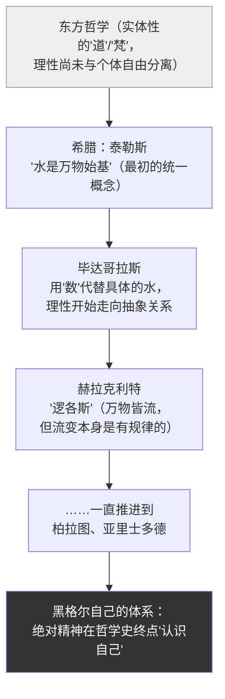

## 《哲学史讲演录（第一卷）》读书笔记 
  
### 作者  
digoal  
  
### 日期  
2026-06-22  
  
### 标签  
读书笔记 , 哲学史讲演录（第一卷）  
  
----  
  
## 背景 
  
  

---  
书名: 《哲学史讲演录（第一卷）》  
作者: [德] 黑格尔（贺麟、王太庆 译）  
出版年份: 1959  
笔记日期: 2026-06-22  
豆瓣链接: https://book.douban.com/subject/1074364/  
豆瓣评分: 9.1（847人评价）  
标签: [哲学史, 德国古典哲学, 黑格尔, 辩证法, 汉译名著]  
---

  

> **一句话**：哲学史不是一堆互相推翻的死人骨骸的陈列馆，而是同一个"理性"自己逐渐认清自己的成长史。  
> **适合谁读**：对"哲学到底有什么用""不同哲学家为什么总在互相否定"有困惑的人，以及想理解"辩证法"究竟是怎样一种思维方式的人。  
> **阅读难度**：⭐⭐⭐⭐⭐（5星，黑格尔的句子是出了名的"绕"）  
> **推荐指数**：⭐⭐⭐⭐☆  
  
---

## 一、时代坐标：这本书从哪里来？

1818年，48岁的黑格尔从海德堡北上柏林，接替已故的费希特，坐上了普鲁士王国最重要的哲学讲席。这不是一次普通的履新——拿破仑战争刚刚结束，普鲁士在德意志诸邦中正在崛起，一种"民族重新需要哲学"的氛围弥漫在大学里。黑格尔自己就在开讲辞里说，他很高兴能"在这个时候"重新讲授哲学，因为"这门几乎消沉的科学可以重新扬起它的呼声"。

从1819年起，黑格尔一共讲了六轮"哲学史"课程，直到1831年因霍乱去世。他生前正式出版的只有《精神现象学》《逻辑学》《哲学全书》《法哲学原理》——而《哲学史讲演录》是他死后，学生米希勒根据多轮讲稿和课堂笔记整理而成的。也就是说，**我们今天读到的这本"书"，原本是黑格尔站在讲台上，一年又一年讲给学生听的话**。这也解释了它的文风：口语化的重复、层层递进的铺垫、偶尔的讽刺和情绪，都是讲课现场留下的痕迹，而不是一篇精心打磨过的论文。

更关键的是，这本书要解决一个困扰了西方思想两千年的难题：哲学史上各家各派吵得不可开交，连"上帝存在"这种问题都能得出截然相反的结论，那哲学还配叫一门"科学"吗？黑格尔写这部讲演录，本质上是要回答这个让哲学"颜面尽失"的质疑。

---

## 二、核心命题：作者在说什么？

### 观点一：哲学史不是意见的堆积场，而是"理念"自己的发展史

黑格尔开篇就挑明一个流俗的看法：很多人觉得读哲学史就是看一群人轮流登场，各自宣布"真理在我这里"，然后被下一个人推翻——这简直是在证明"哲学没有用"。黑格尔说，这种看法把哲学史看成了"一个战场，堆满着死人的骨骼"。

他的反驳是：每一种哲学体系都不是凭空捏造，而是"理念"（即理性自己认识自己）在那个历史阶段所能达到的必然形态。泰勒斯说"水是万物的始基"，听起来幼稚，但这恰恰是人类第一次试图用一个统一的、非神话的概念去把握世界——这一步如果没有迈出，后面所有的哲学都不会发生。**所以哲学史上的每一个学说都"对"，只是"对"在它自己那个发展阶段上；后来的学说不是简单否定前面的，而是把前面的"扬弃"（既克服又保留）进自己里面。**

### 观点二：哲学与哲学史本质上是同一件事

这是全书最具颠覆性的论断之一：黑格尔认为，要理解"哲学是什么"，唯一的办法就是看"哲学曾经怎样一步步变成现在这个样子"——逻辑的展开顺序和历史的展开顺序是一致的。换句话说，**逻辑学里"概念"由抽象到具体的推演过程，和哲学史上一个个学派依次登场的过程，其实是同一个进程的两种表现**。这就是后人常说的"哲学即哲学史"，黑格尔之前没有人这样系统地论证过。

### 观点三：哲学的真正开端在希腊，不在东方

黑格尔把"东方哲学"（中国、印度）放在希腊哲学之前讲，但态度很微妙：他认为中国、印度固然有自己的思想体系，《易经》里的阴阳、老子的"道"也确实在表达某种"理性"，但他判断这些思想还停留在"实体"层面，没有发展出"主体能够自由地、独立地反思自己"这一关键环节——而**自由的、能够自我怀疑、自我否定的"思想的自由"，才是哲学和哲学史真正起始的条件**。他甚至说，假如孔子的书从未被翻译过，对孔子的名声反而更好——因为孔子在他眼里只是一位道德教训家，谈不上"思辨哲学家"。这是全书争议最大的部分。

---

## 三、论证地图：作者怎么说服你的？

黑格尔的整套论证依赖他著名的辩证法结构："正题—反题—合题"。下面这张图展示了他如何用这个结构，把看起来互相矛盾的哲学学说串成一条逐渐"具体化"的链条：



文字解析：黑格尔最看重的几个论证支点，恰恰不是后世教材里最常讲的那几位"大哲学家"，而是泰勒斯、毕达哥拉斯、赫拉克利特——因为这几位身上最清楚地体现了"概念从具体到抽象、从抽象到更高的具体"的运动轨迹。豆瓣上不少读者也提到，这本书"最精彩的部分在于导言、论毕达哥拉斯、论赫拉克利特"，其余部分受限于材料和体例，相对平淡——这和黑格尔自己论证用力的地方是吻合的。

需要警惕的是：黑格尔讲哲学史时手里的"史料"并不全面（尤其是关于中国、印度的材料，他靠的是当时传教士和早期汉学家如雷缪萨的二手转译），却要用这些有限的材料去支撑一个宏大的体系性结论。这是这本书最容易被现代学者诟病的地方。

---

## 四、前提假设与边界：什么情况下这不成立？

黑格尔的整套论证依赖几个未必所有人都会接受的前提：

1. **历史是有方向、有目的的**。黑格尔假设理性在历史中是"必然地"朝着自我认识前进的，不存在真正意义上的偶然或倒退。如果你不接受"历史有一个内在目的"这个前提（比如尼采、福柯式的历史观就明确反对这一点），整套"哲学史即逻辑展开"的论证就会站不住。

2. **"自由"被等同于"西方式的主体性反思"**。黑格尔判断东方思想"不属于严格意义上的哲学史"，依据的标准本身就是他从希腊—基督教传统里提炼出来的"主体自由"概念。用这把尺子去量别的文明，结论自然会偏向西方——这是后来"中国是否有哲学"这场争论的真正源头。

3. **欧洲中心的史料局限**。黑格尔写作时能接触到的东方文献极其有限，他自己也承认是"由于新近有了一些材料，才对中国哲学和印度哲学附带说几句"。这意味着他对东方哲学的论断，更多是基于材料匮乏下的推测，而不是深入研究后的判断。

这三个假设一旦松动，黑格尔体系里"哲学史是一条单线进化的链条，终点是我自己的哲学"这个结论，就需要被重新审视。

---

## 五、思想谱系：这本书在哪个传统里？

黑格尔站在康德、费希特、谢林之后，是德国古典哲学（理性主义—唯心主义这条线）的集大成者。他把康德"理性为自然立法"的思路，和谢林"自然与精神同源"的直觉，进一步发展成一个完整的、动态的、自己运动的"绝对精神"体系——哲学史只是这个体系展开自己的一种方式。

这本书的影响力极为特殊：马克思早年仔细研读过它，并在《德意志意识形态》里多次引用（尤其是第三卷论希腊哲学衰落部分）；恩格斯在《自然辩证法》里专门评述过其中论希腊哲学的内容；列宁1915年在瑞士流亡期间还专门做了读书笔记。**马克思主义经典作家对待这本书的态度很典型：吸收它的辩证法，同时毫不客气地剔除它的唯心主义外壳**——这也正是这版1959年商务印书馆译本"译者后记"里反复强调的立场。

往后看，黑格尔"哲学即哲学史"的观念，也直接塑造了后来海德格尔讨论"哲学史"的方式——海德格尔称这本书是"第一部哲学上的哲学史"。

```
康德（理性批判）→ 费希特（自我设定）→ 谢林（同一哲学）
                              ↓
                黑格尔《哲学史讲演录》（理念的自我认识）
                              ↓
        ┌─────────────┬─────────────┐
   马克思/恩格斯/列宁      存在主义/海德格尔     黑格尔右派（保守宗教）
   （吸收辩证法，          （历史性思考的       
    剔除唯心主义）          传统起点）
```

---

## 六、我学到了什么？

第一，**"否定"不是简单的"错"，而是"还不够"**。读这本书之前，我会觉得一个哲学家被后人反驳，就是这个哲学家"错了"。黑格尔让我换了一个视角：泰勒斯说"水是万物始基"，这句话单独看当然幼稚，但放进整条思想链里，它的价值在于第一次"敢于"用一个抽象概念去取代神话叙事——这一步的勇气，比这个具体答案对不对重要得多。这个视角后来我用在看任何"过时的理论"上都很受用：先问它在当时解决了什么问题，再问它后来被什么更好地解决了。

第二，**体系的宏大和材料的局限可以并存，而且经常并存**。黑格尔讲东方哲学那部分,论证之自信和材料之单薄形成了鲜明的反差。这提醒我，越是"一以贯之、能解释一切"的理论体系，越要回头去查它脚下的材料地基打得有多深——气场足不代表地基稳。

第三，**讲课稿和论文是两种完全不同的"真理生产方式"**。这本书是学生笔记整理出来的,黑格尔讲课时会重复、会绕、会临场发挥情绪化的讽刺（比如他嘲笑那种"哲学史只能教人怀疑一切"的肤浅看法）。这种"现场感"反而让抽象的论证有了温度——比起一篇严谨克制的论文,它更接近一个人真实思考时的样子。

---

## 七、举一反三：这个框架还能用在哪？

**"扬弃"式的发展观**完全可以迁移到任何学科史或行业演变的分析上：

- **看技术迭代**：评价一项"过时"的技术（比如功能机、胶片相机）时，不只问它"输给了谁"，而要问它在自己的阶段解决了什么前人没解决的问题，新技术又是"扬弃"了它的哪部分而不是简单抛弃。

- **看一个人的成长轨迹**：回顾自己几年前的某个"幼稚"想法时，与其简单否定，不如问：那个想法当时帮我突破了什么更早的局限？现在的我"保留"了它的哪一部分？

- **看团队/组织的方法论变迁**：一家公司从手工作坊式管理走向流程化管理，再走向敏捷迭代，每一次"否定"上一套方法，背后往往都保留了上一套方法解决过的某个核心问题的答案——理解这一点，能帮你在推行新方法时,不至于把有用的旧经验一并扔掉。

---

## 八、批判与反思

我不完全同意黑格尔把"自由的、反思性的主体"当成评判一种思想"是不是哲学"的唯一标尺。这套标准本身就带着浓厚的西方理性主义色彩——用它去衡量道家"道可道，非常道"那种刻意回避概念固化的思维方式，结论必然是"这不够哲学"。但"拒绝把真理装进一个固定概念"本身，未必就比"努力把真理装进一个概念"层次更低，这更像是两种不同的真理观,而不是高低之分。

另外，黑格尔对"历史必然朝向自我认识前进"的信念，在经历了两次世界大战、各种文明的断裂与暴力之后，今天读起来会让人本能地警惕——历史从来不是一条干净的、单向上升的链条。这也是为什么20世纪后半叶，从阿多诺到福柯，很多思想家会把黑格尔当成"需要被克服的对手"，而不只是被继承的遗产。

这本书最大的局限或许在于：它太想给出一个"终点"了——黑格尔毫不掩饰地认为整条哲学史的逻辑终点就是他自己的体系。这种自信固然成就了这本书的体系性,但也让它难以真正容纳"历史可能没有终点"这种更谦逊、也可能更真实的想象。

---

## 九、金句与记忆点

1. **"全部哲学史这样就成了一个战场，堆满着死人的骨骼。"**
   黑格尔先把流俗的、悲观的哲学史观说得淋漓尽致，再用接下来几百页去反驳它——这是全书最有力的开场反讽。

2. **"哲学史的本身就是科学的，因而本质上它就是哲学这门科学。"**
   "哲学即哲学史"这一论断的核心表述,理解这句话，就理解了全书的方法论根基。

3. **"思想的自由是哲学和哲学史起始的条件。"**
   黑格尔判定东方思想能否进入"哲学史"的核心标尺，也是全书最具争议的判断起点。

4. **"为了保持孔子的名声，假使他的书从来不曾有过翻译，那倒是更好的事。"**
   黑格尔对孔子评价的代表性论断（认为孔子是道德教训家而非思辨哲学家），常被后来研究"中国是否有哲学"的学者反复引用和反驳。

5. **"哲学这门科学的目的愈是被了解错了，它的兴趣反而愈益增加。"**
   一句看似矛盾、实则深刻的话：误解越多，恰恰说明这门学问触及了人最根本的好奇心。

---

## 十、延伸阅读

1. **《精神现象学》（黑格尔）**——理解黑格尔"意识自我认识自己"的整套辩证运动逻辑,是读懂《哲学史讲演录》方法论的源头。

2. **《小逻辑》（黑格尔，贺麟译）**——同一位译者贺麟的另一部经典译作,把黑格尔《哲学全书》中"逻辑学"部分单独成书，可以和这本"哲学史"对照着读：一个是逻辑的展开顺序，一个是历史的展开顺序。

3. **《西方哲学史》（罗素）**——和黑格尔截然不同的写法：罗素更重史料考据、更怀疑体系化叙事，读完黑格尔再读罗素，能直观感受到两种"写哲学史"的方式差异有多大。

4. **《哲学史教程》（文德尔班）**——常与黑格尔这部讲演录并列推荐的另一部哲学史经典，体例更接近现代学术写作，可作为对照阅读的"解毒剂"。

5. **关于"中国是否有哲学"的当代讨论**（如张允熠等学者的相关论文）——直接回应并反驳黑格尔对中国哲学的评判，适合在读完本书"东方哲学"部分后,做一次思想上的"反向校验"。

---

*笔记写于 2026-06-22 | 基于公开资料与深度思考整理*
  
  
#### [PostgreSQL 解决方案集合](../201706/20170601_02.md "40cff096e9ed7122c512b35d8561d9c8")
  
  
#### [德哥 / digoal's Github - 公益是一辈子的事.](https://github.com/digoal/blog/blob/master/README.md "22709685feb7cab07d30f30387f0a9ae")
  
  
#### [About 德哥](https://github.com/digoal/blog/blob/master/me/readme.md "a37735981e7704886ffd590565582dd0")
  
  

  
