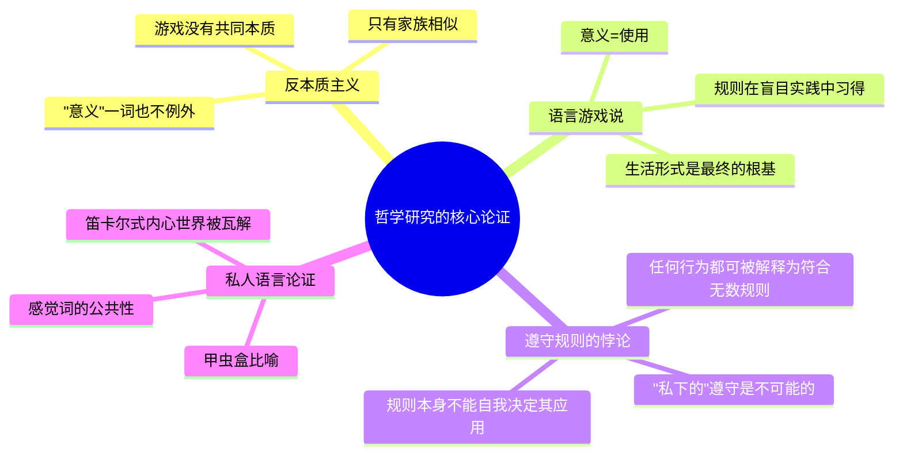

## 《哲学研究》读书笔记 
  
### 作者  
digoal  
  
### 日期  
2026-06-22  
  
### 标签  
读书笔记 , 哲学研究  
  
----  
  
## 背景 
  
  


---
书名: 《哲学研究》  
作者: [奥] 路德维希·维特根斯坦  
译者: 李步楼  
出版社: 商务印书馆  
出版年份: 1996-12  
笔记日期: 2026-06-22  
豆瓣链接: https://book.douban.com/subject/1232571/  
豆瓣评分: 9.0（820+人评价，李步楼译本）  
标签: [哲学, 语言哲学, 分析哲学, 维特根斯坦, 汉译世界学术名著丛书]  
---

  

> **一句话**：意义不在词典里，而在你怎么用它——维特根斯坦用一本"反哲学"的哲学书，把语言从天上拉回了地上。  
> **适合谁读**：对"语言是怎么有意义的"这种问题感到好奇的人；不需要专业哲学训练，但需要极大的耐心，因为这本书不会"讲道理给你听"，而是逼你跟着他一起想。  
> **阅读难度**：⭐⭐⭐⭐☆（4/5，语言不难，但思路反直觉、跳跃且不收口）  
> **推荐指数**：⭐⭐⭐⭐⭐（5/5，二十世纪最重要的哲学著作之一，绕不开）  
  
---

## 一、时代坐标：这本书从哪里来？

1921 年，30 岁出头的维特根斯坦出版了《逻辑哲学论》，给出了一个近乎宣判式的结论：语言的本质是给世界画"逻辑图像"，一个命题之所以有意义，是因为它在结构上对应着某个事实；哲学的全部问题都可以借此一次性解决，剩下"不可说的"，就该保持沉默。罗素为这本书写了导言，维也纳学派把它当作圣经，维特根斯坦本人则一度认为哲学已经"做完了"，转身去乡村当了小学教师。

但他自己很快不安了起来。一次与经济学家斯拉法的对话里，斯拉法用手指在下巴上做了个轻蔑的手势，问他："这个动作的'逻辑形式'是什么？"维特根斯坦答不上来——这个细节后来被反复提起，因为它精准地刺中了《逻辑哲学论》的软肋：日常语言里大量有意义的东西，根本没有什么对应的"逻辑结构"。1929年重返剑桥后，他开始批评自己早期的逻辑图像论和逻辑原子主义，认为它们虽然在科学层面说得通，却解释不了日常经验世界。

此后近二十年，他在剑桥的讲台上、挪威的小木屋里、战时医院的间隙里，不断写下大量札记。《哲学研究》的第一部分由他在1937—1945年间为公开出版而创作完成，第二部分写于1947—1949年，他本人并未为其出版做准备。他终其一生没有再正式出版一本书，这本书是在他1951年去世后，由学生编订成书的遗作。这不是一本"写完了"的书，而是一场持续二十年、始终没有真正"收尾"的自我辩论的记录。

```
1921《逻辑哲学论》——语言=逻辑图像，意义=对应事实
        │
        ▼   斯拉法的手势 / 剑桥讲座 / 乡村教书六年的反思
        │
1929 回到剑桥，开始系统怀疑早期立场
        │
        ▼
1937-1949 持续写作札记，反复修改
        │
        ▼
1953 遗著出版《哲学研究》——语言=游戏，意义=使用
```

---

## 二、核心命题：作者在说什么？

### 命题一：语言没有"本质"，只有"家族相似"

传统哲学一直相信，凡是能用同一个词指称的东西，必定共享某种隐藏的共同本质——"游戏"必有游戏的本质，"语言"必有语言的本质，找到这个本质，哲学问题就解决了。维特根斯坦反问：你去看看所有被称为"游戏"的活动——棋类、球类、纸牌、捉迷藏——它们之间真的有一条贯穿始终的共同特征吗？他认为没有，这些活动之间只是"家族相似"：一个成员和另一个成员有些相似，但未必是所有成员共有的相似，就像一个家族里，老大的眼睛像爷爷，老二的下巴像奶奶，但找不出一个所有人都长得像的特征。语言也是如此——它不是一种东西，而是一整个相互交织、彼此重叠的活动网络。

### 命题二："意义即使用"——语言游戏说

如果词语的意义不来自对应某个"本质"或某个"心理图像"，那它来自哪里？维特根斯坦的回答是：来自这个词在具体生活情境中**如何被使用**。一句"水！"在沙漠里可能是求救，在化学课上可能是命名，在派对上可能是玩笑——意义不是词语自带的标签，而是它在某个"语言游戏"里所扮演的角色。语言游戏说的核心是：语言的含义不在于它指向的对象，而在于它的使用方式。更颠覆的是，我们学会语言游戏，并不是先掌握规则再去玩，而是在"盲目地遵守规则"中学会的——就像孩子学母语，从来不是先学语法再说话。

### 命题三：私人语言是不可能的——甲虫盒论证

这是全书最锋利的一刀，直接打掉了笛卡尔以来"内心世界最确定、最私密、只能我自己知道"的预设。维特根斯坦设想：每个人都有一个盒子，里面装着只有自己才能看见的东西，大家把它叫做"甲虫"，没人能看别人的盒子，每个人都说自己是靠看见自己的甲虫才知道甲虫是什么。问题是：如果这个词在大家的语言里确实有公共的用法，那盒子里到底装着什么——甚至盒子是不是空的——根本无关紧要，因为"甲虫"在这个语言游戏里压根没有被用作某个东西的名称。换句话说：你以为你在"内心私下里"给自己的感觉命名，但命名这件事本身离不开公共可检验的规则——一个只有你自己才能遵循的规则，根本无法区分"遵守"和"违反"，而无法被违反的规则，也就谈不上被遵守，私人规则是自相矛盾的。

---

## 三、论证地图：作者怎么说服你的？



维特根斯坦几乎不使用传统哲学论文的"前提—推论—结论"结构，而是用大量短小的对话、设问、思想实验（甲虫盒、建筑工人的"石板！石板！"、阅读机器人）层层逼近一个直觉：**凡是声称只能在"私下"被理解的东西，最终都站不住脚**。这种写法本身就是他的哲学态度——拒绝体系化，因为体系化恰恰是他要批判的那种"本质主义幻觉"。

代价也很明显：全书没有索引式的结论，论证常常戛然而止，留给读者大量"自己想清楚"的空间，这也是它难读的根本原因。

---

## 四、前提假设与边界：什么情况下这不成立？

1. **假设一：语言意义必须依赖公共可验证的"生活形式"。** 这在大多数日常交流场景中成立，但放到一些极端的内心体验（比如冥想中的觉知状态）上，是否完全能被"公共使用"框架穷尽，仍有争议——这正是后来现象学家批评维特根斯坦"取消了主体性"的地方。

2. **假设二：规则的应用最终只能靠"生活形式的一致性"兜底，没有更深的根基。** 这一假设让他避免了无穷追溯的难题，但也带来了相对主义的隐忧：如果意义最终靠"我们碰巧这样生活"来保证，那不同"生活形式"之间是否就无法互相评判对错？这正是后来学界反复质疑的问题：语境决定论是否会滑向一种新形式的怀疑主义或相对主义。

3. **边界：他批判的是"寻找语言/概念的终极本质"这种哲学冲动，不是说语言完全没有规律。** 如果把"意义即使用"简化为"怎么用都行"，那是误读——他其实是说，使用本身有极其细密、嵌入生活形式的规则，只是这些规则不是来自某个柏拉图式的本质。

---

## 五、思想谱系：这本书在哪个传统里？

维特根斯坦是哲学史上极少数"自己否定自己"还都各自开创一个学派的人——前期《逻辑哲学论》是逻辑原子主义和逻辑经验主义（维也纳学派）的圣经，后期《哲学研究》则成了日常语言哲学（牛津学派：赖尔、奥斯汀等）的奠基文本。

```
弗雷格 / 罗素（逻辑主义）
        │
        ▼
《逻辑哲学论》(1921) ──→ 维也纳学派 / 逻辑经验主义
        │
        ▼ 自我批判（1929年后）
        │
《哲学研究》(1953) ──→ 日常语言哲学（赖尔、奥斯汀）
        │                    │
        ▼                    ▼
   后期分析哲学        克里普克《维特根斯坦论规则和私人语言》
   （达米特、普特南等均受其"语言游戏"启发）
```

值得一提的是，达米特和怀特的语义反实在论，同时受到维特根斯坦实证主义和遵守规则论证的启发；普特南在转向新实用主义时，也开始重视与维特根斯坦的紧密联系。哪怕是反对他的哲学家，也很难完全绕开他划下的问题边界。

---

## 六、我学到了什么？

第一个收获，是对"定义"这件事本身产生了警觉。我以前下意识觉得，搞不清一个概念就该去"查清楚它的定义"，读完才意识到，很多最重要的概念（正义、爱、智能）压根没有一个能覆盖所有用法的本质定义，硬要找，反而会把活生生的用法削成一个干瘪的模子。这对我后来看待"到底什么是 AI"之类的争论很有用——很多争吵根源不是事实分歧，而是在争一个本不存在的"本质"。

第二个收获，是甲虫盒论证给我的冲击：我们习惯把"内心感受"当成最私密、最确定的东西，但维特根斯坦让我意识到，哪怕是"我感到痛"这种最私人的陈述，能被说出来、被别人理解，恰恰是因为它依附在一整套公共的语言实践上。私密性不是语言之外的金矿，而是语言实践划出的一个区域。

第三个收获，更像一种写作和思考方式的启发：维特根斯坦从不假装自己"已经想清楚"，他在书里反复推翻自己刚提出的设想，留下大量"——但这样说对吗？"的自我追问。这种诚实地暴露思考过程、而不是端出一个打磨光滑的结论的写法，对我自己组织复杂问题时很有借鉴价值。

---

## 七、举一反三：这个框架还能用在哪？

1. **产品/概念争论**：团队里争论"这算不算一个真正的'功能'""这算不算'智能'"，往往是在找一个不存在的本质定义。换成"在什么场景下、被谁怎么用，才算"，争论效率会高很多。

2. **跨文化沟通**：很多"意思没传达到"的误解，不是字面翻译错了，而是"语言游戏"——背后的生活情境和使用规则——没对上。同一个词在两种生活形式里玩的是不同的游戏。

3. **自我反思与情绪表达**：当我们说"我说不清楚自己的感受"时，问题往往不是感受太私密无法言说，而是我们还没找到一套足够贴合这种感受的"使用方式"（恰当的比喻、情境、语境）。换一种表达框架，往往就能说清楚。

---

## 八、批判与反思

哪里我不完全同意：维特根斯坦把哲学问题几乎都诊断为"语言的误用"，认为说清楚语词怎么被使用，混乱自然消失。但这有时显得太轻巧——比如自由意志、意识的本质这类问题，恐怕不只是语言游戏没玩对，背后确实存在经验和形而上学层面的真实困难，把它们全部"治疗"为语法澄清，多少有点把问题矮化了。

时代已经变了的地方：私人语言论证诞生时，认知科学和神经科学还很初级。今天我们对"内感受""默会知识""无意识加工"有了大量经验研究，这些研究并不直接反驳维特根斯坦，但确实让"内心世界完全依附于公共语言"的论断变得更需要细化——至少有一部分心理状态，似乎在语言之前就已经存在并起作用。

这本书的局限性：写作方式本身是双刃剑。"前面部分论述比较集中，后面很多内容则可能本身就含糊不清"，是不少认真读过的人的共同感受——这既是他刻意的"反体系"姿态，也确实让全书后半段的论证力度打了折扣，读者很容易在札记的密林里迷路而抓不住主线。

---

## 九、金句与记忆点

1. **"一个词的意义就是它在语言中的用法。"** —— 整本书最常被引用、也最常被简化误读的一句，提醒我们不要脱离使用场景去问"这个词到底是什么意思"。

2. **"想象一种语言就是想象一种生活形式。"** —— 语言从来不是独立于生活之外的符号系统，它和具体的生活实践绑在一起。

3. "命令与执行之间有一道鸿沟，它必须由理解填平。" —— 规则本身永远无法自动决定它该怎么被应用，理解/解释是必不可少的中间环节，这也是"遵守规则"难题的核心。

4. "只有通过理解，这个命令才叫做：我们必须做这个。命令——那不过是些声音，是些墨水道道罢了。" —— 同样指向"符号本身不会说话，是使用赋予了它力量"。

5. **甲虫盒比喻** —— 用一个荒诞的思想实验，瓦解了"内心世界天然私密且最确定"的常识直觉。

6. **"家族相似"** —— 用一个生活化的类比，取代了哲学史上对"本质""共相"的执念。

7. **"哲学病"** —— 维特根斯坦常说哲学家容易染上一种"病"：被语言的表面语法（grammar）所迷惑，把语法问题误认为事实问题。这个词本身就是他整本书的诊断框架。

---

## 十、延伸阅读

1. **《逻辑哲学论》（维特根斯坦）** —— 不读这本，《哲学研究》里大量的"自我反驳"会失去对照对象，二者必须前后比照阅读。

2. **《蓝皮书和棕皮书》（维特根斯坦）** —— 维特根斯坦在剑桥讲课时整理的讲义，以更系统的方式介绍了语言游戏理论，可以看作《哲学研究》的"预热版"和过渡材料，体系感更强、更容易上手。

3. **《维特根斯坦论规则和私人语言》（克里普克）** —— 对"遵守规则"难题给出了著名的怀疑论式解读（"克里普克斯坦"），是理解这本书第二大论证（私人语言论证）绕不开的当代回应，哪怕你最终不同意他的读法。

4. **《维特根斯坦的〈哲学研究〉》（M. 麦金，劳特利奇哲学经典导读丛书）** —— 被认为是关于后期维特根斯坦最好的导读之一，不做过度简化，紧密贴合文本细读，适合在读原著遇到困惑时随时翻查。

5. **《论确定性》（维特根斯坦）** —— 维特根斯坦生命最后阶段的札记，延续"生活形式"和"语言游戏"的思路，进一步追问"确定性"和"怀疑"的边界，可以作为《哲学研究》核心论证在认识论领域的自然延伸。

---

*笔记写于 2026-06-22 | 基于公开资料与深度思考整理*
  
  
#### [PostgreSQL 解决方案集合](../201706/20170601_02.md "40cff096e9ed7122c512b35d8561d9c8")
  
  
#### [德哥 / digoal's Github - 公益是一辈子的事.](https://github.com/digoal/blog/blob/master/README.md "22709685feb7cab07d30f30387f0a9ae")
  
  
#### [About 德哥](https://github.com/digoal/blog/blob/master/me/readme.md "a37735981e7704886ffd590565582dd0")
  
  

  
