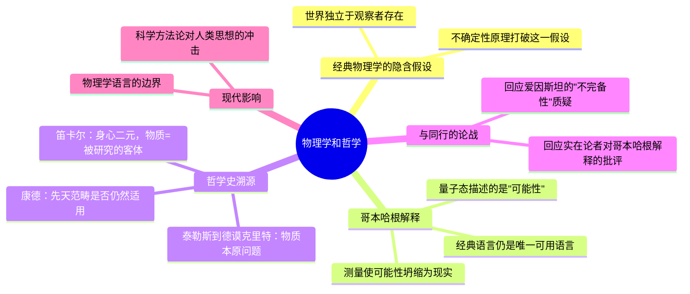

## 《物理学和哲学》读书笔记 
  
### 作者  
digoal  
  
### 日期  
2026-06-22  
  
### 标签  
读书笔记 , 物理学和哲学  
  
----  
  
## 背景 
  
  

---
书名: 《物理学和哲学》  
作者: [德] W. 海森堡  
译者: 范岱年  
出版社: 商务印书馆  
出版年份: 1999-5-1（中译本，原书首版1958年）  
笔记日期: 2026-06-22  
豆瓣链接: https://book.douban.com/subject/1841445/  
豆瓣评分: 9.1（18人评价）  
标签: [物理学, 哲学, 量子力学, 科学哲学, 汉译世界学术名著]  
---

  

> **一句话**：量子力学最大的哲学冲击，不是发现了什么新粒子，而是发现了"客观世界"这个概念本身需要被重新审视。  
> **适合谁读**：对"科学到底在描述什么"感兴趣的人，无论你是理科生还是文科生  
> **阅读难度**：⭐⭐⭐⭐☆（1-5星）  
> **推荐指数**：⭐⭐⭐⭐⭐  
  
---

## 一、时代坐标：这本书从哪里来？

这本书的成书背景本身就值得讲一讲。它最初是海森堡1955至1956年冬季在圣安德鲁兹大学吉福特讲座上的讲稿，整理后于1958年以英文出版，德文名直译过来是"物理学和哲学：世界视角"。也就是说，这不是海森堡年轻气盛时写的论战文章，而是他年过五十、量子力学的革命尘埃落定之后，回过头来做的一次哲学总结。

要理解这本书，得先理解写书之前那三十年发生了什么。1925到1927年间，海森堡先后提出了矩阵力学和不确定性原理，与玻尔一起确立了被称为"哥本哈根解释"的量子力学正统诠释。这套解释从一开始就不被所有人接受——爱因斯坦终其一生都不肯认输，"上帝不掷骰子"的名言就是冲着这套理论说的。玻尔和爱因斯坦在历次索尔维会议上的论战，成了20世纪科学史上最著名的智力对决之一。

更复杂的是海森堡个人的经历。二战期间他留在纳粹德国，参与了德国的核研究项目，战后这成了他一生都没能完全摆脱的争议标签——他坚持说自己没有、也不想为纳粹造出原子弹，但这段历史让很多同行（尤其是流亡海外的犹太裔物理学家）对他始终心存芥蒂。写这本书的时候，他既是量子力学的奠基人，也是一个带着历史负重、急于向世界解释"物理学到底意味着什么"的人。这种双重身份，让全书带着一种罕见的、试图把科学讲清楚同时也想把自己讲清楚的诚恳感。

```
1925-27  矩阵力学 + 不确定性原理 → 哥本哈根解释确立
   ↓
1927起   索尔维会议：玻尔 vs 爱因斯坦，论战延续二十余年
   ↓
1933-45  海森堡留在德国，卷入核研究项目，战后备受争议
   ↓
1955-56  吉福特讲座：年过半百回望量子革命的哲学意义
   ↓
1958     《物理学和哲学》英文版出版
```

他要解决的问题很明确：量子力学已经在数学和实验上站住了脚，可它对"现实是什么"这个最基本的哲学问题，到底意味着什么？这个问题留给物理学家本身解决不了，海森堡选择回到哲学史里去找答案。

---

## 二、核心命题：作者在说什么？

全书11章，但思想内核可以归结为三个核心命题。

### 命题一：经典物理学的"客观世界"假设崩塌了

牛顿物理学里有一个不言自明的前提：世界本身有一套确定的状态，观察者只是被动地去发现它。海森堡指出，量子力学打破了这个前提——在原子尺度上，我们没法在不干扰系统的情况下去测量它，"观察"本身成了现象的一部分。这不是技术限制，是原则性的限制。

### 命题二：日常语言和经典概念，是我们唯一能用的语言

这是全书最反直觉、也最容易被误读的一点。很多人以为海森堡的结论是"量子世界不可描述"，但他实际说的是反过来的事：任何物理实验，无论涉及日常现象还是原子事件，都必须用经典物理学的术语来描述。我们没有也不可能有另一套语言取代经典概念去描述测量结果，这恰恰是哥本哈根解释的核心——量子论不是要发明一套新的"实在"语言，而是承认我们只能用旧语言去描述一个新边界。

### 命题三：现代物理学比希腊哲学走得更远，但根子是同一棵树

海森堡花了大量篇幅梳理从泰勒斯、德谟克里特到笛卡尔、康德的哲学史，目的不是掉书袋，而是想说明：关于"物质是什么""基本粒子能不能再分"这些问题，古希腊哲学家早就以思辨的方式提出过类似框架，而现代物理学的不同之处在于，它能用数学方法从理论推导出具体性质，并用实验在任意精度上验证——这种可验证性，是古代哲学陈述永远无法具备的份量。

---

## 三、论证地图：作者怎么说服你的？



海森堡的论证方式很有意思：他不是从公式推导出哲学结论，而是反过来，先讲清楚物理学史上具体发生了什么实验、什么争论，再回去问"这件事在哲学史的坐标系里处于什么位置"。比如他用云室中电子径迹的观测难题来说明，我们看到的从来不是电子本身的轨道，而是远比电子大得多的水滴串成的痕迹——由此引出"不确定性不是测量误差，而是量子系统本身的属性"这一关键论点。

这种写法的好处是不依赖读者先懂高等数学；代价是论证的严谨度不如教科书，更像是一位大师在做"思想导览"。书中也专门用一章正面回应了对哥本哈根学派的批评，逐条反驳了认为量子论"不完备"的几种主流意见——这一章读起来火气最足，能感受到他面对爱因斯坦阵营时那种既尊重又不服气的态度。

---

## 四、前提假设与边界：什么情况下这不成立？

读这本书要留意几个隐含前提，它们决定了海森堡论证的适用边界。

**前提一：哥本哈根解释是唯一正确的诠释。** 海森堡几乎是站在哥本哈根学派内部发言的，对德布罗意-玻姆的隐变量理论、对多世界诠释等后来发展起来的替代方案基本没有正面交锋的篇幅（多世界诠释当时还未提出）。今天的物理学哲学界对"哪种诠释更对"仍无共识，把哥本哈根解释当作唯一真理来读这本书，会错过这场争论其实远未终结。

**前提二：经典物理学概念是描述实验的唯一可能语言。** 这个论断在书写时是合理的，但二战后量子信息论、量子计算的发展，某种程度上正在尝试构建超越经典语言框架去理解和操控量子系统的新数学工具。这并不否定海森堡的论证本身，但说明"唯一语言"这个结论可能需要打上时代的引号。

**前提三：物理学的哲学反思必须回到古希腊传统。** 海森堡的哲学史叙述以西方哲学为骨架，几乎没有涉及其他文明对"物质与实在"问题的思考。这是写作时代和作者知识背景的局限，今天读者可以补充东方哲学视角去丰富这个对话。

---

## 五、思想谱系：这本书在哪个传统里？

海森堡的思想来源很清晰：物理学上承玻尔的互补原理，哲学上他自己承认深受康德影响——尤其是康德关于"先天范畴"的讨论，让他思考经典物理概念（因果、实体、空间、时间）究竟是人类认知结构的必然产物，还是可以被新物理学修正的经验性框架。

```
古希腊原子论（德谟克里特）──→ 笛卡尔身心二元论 ──→ 康德先天范畴
                                                    │
                                                    ▼
                            玻尔互补原理 + 海森堡不确定性原理
                                                    │
                                                    ▼
                                《物理学和哲学》(1958)
                                                    │
                          ┌─────────────┴─────────────┐
                          ▼                             ▼
                 后续科学哲学讨论                  量子诠释问题持续争论
              （库恩、范弗拉森等）              （多世界、隐变量、退相干等）
```

这本书在科学哲学史上的位置很特殊：它不是一部严格的哲学论著（海森堡本人不是职业哲学家），但因为作者本身是量子力学最核心的奠基人之一，它拥有一种"第一手见证人证言"式的权威性，是任何研究量子力学哲学含义的人都绕不开的原始文献。

---

## 六、我学到了什么？

第一个收获，是重新理解了"不确定性原理"不是一句励志格言，而是有非常具体的物理含义和边界条件的命题。很多通俗科普把它简化成"你不可能同时知道一切"，读完原书才明白，海森堡真正想强调的是测量行为和被测量系统之间不可分割的纠缠关系——这比"凡事都有不确定性"这种泛泛而谈深刻得多，也克制得多。

第二个收获，是看到一位顶尖科学家如何认真地把哲学当回事。海森堡没有把哲学当成科学之外的装饰，而是真的相信，一个物理理论要讲清楚自己的含义，必须回答"什么是客观""什么是因果""语言的边界在哪里"这些哲学问题。这种跨界的认真态度，本身就是一种科学精神的范本。

第三个收获，跟海森堡个人的历史争议有关。这本书写于他声誉受损最深的年代，但他选择用最克制、最学理化的方式去回应世界——不是辩白自己,而是专心把物理学讲透。这让我重新思考：一个人留给世界最有说服力的"自我辩护"，有时候恰恰是把自己最专业的事情做到极致，而不是去争论历史细节。

---

## 七、举一反三：这个框架还能用在哪？

海森堡这本书背后真正的方法论是——**任何一个学科的边界问题，最终都要回到"我们用什么语言在描述什么"这个元问题上**。这个思路可以迁移到很多领域：

**数据科学/AI领域**：当我们说"模型理解了什么"，本质上也是一个语言边界问题——模型的输出永远是在某种表征系统内给出的"测量结果"，而不是对"真实世界"的直接陈述。讨论AI是否有"理解力"，很像讨论量子系统是否有"客观状态"，都容易陷入概念混淆。

**组织管理**：管理者常常假设"团队真实状态"是可以被客观观测和度量的，但任何绩效指标的采集过程本身都会改变被观测对象的行为（类似"霍桑效应"）。意识到测量行为本身参与构造结果，能让人对KPI体系少一些迷信。

**个人决策**：当我们试图"客观评估自己"时，往往忽略了自我反思这个行为本身就在改变被反思的心理状态。海森堡式的提醒是：完全中立的旁观视角，在很多复杂系统里根本不存在，承认这一点比追求虚幻的客观性更诚实。

---

## 八、批判与反思

我不完全同意书中某些地方把哥本哈根解释处理得过于"理所当然"。海森堡在驳斥爱因斯坦阵营时，态度有时显得像是在宣判而不是在辩论——考虑到这场争论在今天的物理学哲学界依然活跃（退相干理论、多世界诠释都在尝试解决同样的"测量问题"），把哥本哈根解释当作终局答案，回看是有些过早了。

另外，全书的哲学史梳理虽然清晰，但选择性很强——基本是一条从古希腊到康德的单线叙事，跳过了很多同样重要的哲学传统（比如经验主义内部的分歧、现象学对"观察"概念的讨论）。这固然是篇幅所限，但读者需要清楚，这是"一位物理学家眼中的哲学史"，不是哲学史本身。

时代局限也很明显：书中关于"现代物理学对人类思想的作用"这一章，带着浓厚的冷战初期、核武器阴影下的焦虑感，今天读起来，那种对科学技术力量既敬畏又警惕的语气，和我们今天讨论AI时的心态其实有种隔代呼应——但具体的历史语境已经完全不同了。

---

## 九、金句与记忆点

1. **"经典物理学的概念构成了我们描述实验装置和陈述实验结果的语言，我们不能也不应当用任何东西来代替这些概念。"**（第三章）——这是哥本哈根解释最核心的一句表态：量子论不取消经典语言，只是标出它的边界。

2. **"质子是基本物质方程的某个解。"**（第四章，大意）——海森堡用这句话区分古希腊哲学的思辨陈述和现代物理学的可验证陈述，是全书"科学与哲学分界线"的关键论点。

3. 关于希腊原子论的概括：**"只有原子和虚空才是真实的存在"**（转引德谟克里特，第四章）——海森堡借此说明，现代粒子物理的提问方式早在两千多年前就有了思辨原型。

4. 关于科学与宗教语言的区别（第十一章，大意）——科学语言追求剥离主观性，而宗教语言天然拒绝主客二分，这种语言性质上的差异，比内容上的对立更根本。

5. 关于"分割"基本粒子的论证（第九章，大意）——分裂一个基本粒子，唯一可用的工具是另一个基本粒子，这个论证清晰地展示了现代物理学的抽象程度已经远超直观经验。

---

## 十、延伸阅读

1. **《海森堡传》/《物理学之美》（Physics and Beyond）** —— 海森堡自己的回忆录性质作品，第五章他与爱因斯坦的对话被很多读者认为是全书最动人的部分，可以和这本书互相印证他思想形成的过程。

2. **尼尔斯·玻尔《原子物理学和人类知识》** —— 互补原理的原始提出者亲自论述，是理解海森堡哲学思想源头的必读补充。

3. **托马斯·库恩《科学革命的结构》** —— 如果对"量子力学如何改变了科学家看待世界的方式"这个问题感兴趣，库恩从科学史和科学哲学角度给出了一个更系统的框架。

4. **卡洛·罗韦利《时间的秩序》或《现实不似你所见》** —— 当代物理学家用更通俗的语言延续了海森堡式的追问：物理学告诉我们的"实在"，到底是什么。

5. **迈克尔·弗雷恩戏剧《哥本哈根》** —— 以虚构对话形式重现玻尔与海森堡1941年那次充满争议的会面，是理解海森堡战时处境和道德困境的绝佳文学补充。

---

*笔记写于 2026-06-22 | 基于公开资料与深度思考整理*
  
  
#### [PostgreSQL 解决方案集合](../201706/20170601_02.md "40cff096e9ed7122c512b35d8561d9c8")
  
  
#### [德哥 / digoal's Github - 公益是一辈子的事.](https://github.com/digoal/blog/blob/master/README.md "22709685feb7cab07d30f30387f0a9ae")
  
  
#### [About 德哥](https://github.com/digoal/blog/blob/master/me/readme.md "a37735981e7704886ffd590565582dd0")
  
  

  
