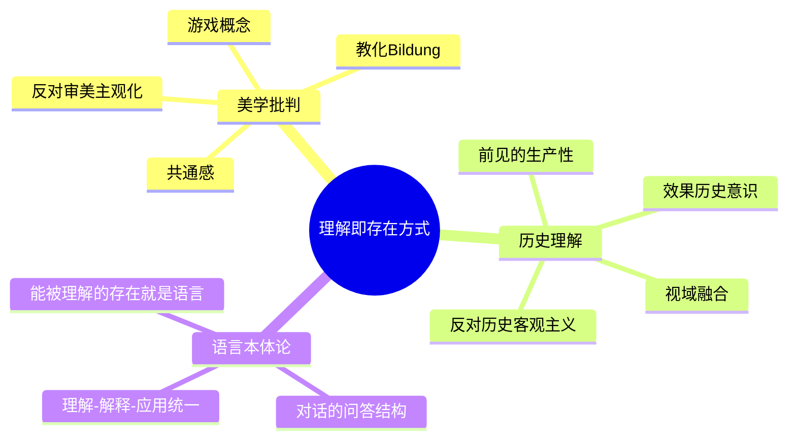

## 《诠释学Ⅰ、Ⅱ：真理与方法》读书笔记 
  
### 作者  
digoal  
  
### 日期  
2026-06-22  
  
### 标签  
读书笔记 , 诠释学Ⅰ、Ⅱ：真理与方法  
  
----  
  
## 背景 
  
  

---
书名: 《诠释学Ⅰ、Ⅱ：真理与方法》  
作者: 汉斯-格奥尔格·伽达默尔  
译者: 洪汉鼎  
出版年份: 2010-9-1（商务印书馆，汉译世界学术名著丛书）  
笔记日期: 2026-06-22  
豆瓣链接: https://book.douban.com/subject/5340426/  
豆瓣评分: 7.7（该修订本版本，73人评价）  
标签: [哲学, 诠释学, 德国哲学, 海德格尔, 美学]  
---

  

> **一句话**：理解不是一种你掌握的方法，而是你存在的方式——你永远已经站在偏见里去理解世界。  
> **适合谁读**：对"如何理解一个文本/一个人/一段历史"感兴趣的人，尤其是文学、历史、法学、神学、教育、产品与用户研究领域的从业者。  
> **阅读难度**：⭐⭐⭐⭐⭐（5星，原著1500余页，术语密度极高）  
> **推荐指数**：⭐⭐⭐⭐☆  
  
---

## 一、时代坐标：这本书从哪里来？

伽达默尔写这本书的时候已经60岁，那是1960年。表面上这是一部美学与方法论著作，但骨子里它是在回答一个困扰了整个19世纪到20世纪人文学科的焦虑：**自然科学有牢靠的方法，人文学科呢？**

这个焦虑有谱系。施莱尔马赫想用"普遍诠释学"重构作者意图；兰克、德罗伊森想给历史学找一套客观方法；狄尔泰想用"体验"概念给精神科学奠定认识论基础——结果却滑入了历史主义的泥潭：如果一切理解都是历史的产物，那理解本身还能谈"客观性"吗？这是悬在整个人文学科头上的达摩克利斯之剑。

伽达默尔的老师海德格尔在《存在与时间》（1927）里给出了一个釜底抽薪的答案：理解根本不是认识论问题，而是本体论问题——理解是"此在"（人）存在的基本方式，不是人偶尔使用的一种认知工具。伽达默尔接过这把钥匙，决定用它重新打开整个诠释学传统的大门。

而他个人的生命史也在场：他出生于1900年，经历了威廉二世帝国、一战、魏玛共和国崩溃、纳粹崛起、二战、德国分裂——一个人被历史反复"抛入"又"抛出"的世纪。这种被历史裹挟却又无法跳出历史去"客观旁观"历史的切身体验，构成了这本书最深层的情感底色：人永远在传统之中思考，而不是站在传统之外审视传统。

---

## 二、核心命题：作者在说什么？

### 观点一：理解从来不是"清空自己"，而是带着前见出发

启蒙运动以来，"前见"（偏见）一直被当作理解的敌人——要客观理解，先要清空自己的立场。伽达默尔反过来说：**没有前见，理解根本无法启动**。前见是历史赋予我们的、使理解成为可能的第一道入口，区别只在于哪些前见是"生产性的"（帮助我们打开文本），哪些是"遮蔽性的"（阻碍我们看见文本）——而这两者只能在理解的过程中、在诠释学循环里被逐渐辨认，不能提前一刀切清空。

### 观点二：理解是一场"效果历史"事件，而不是主体认知客体

文本和理解者并不是两个互不相干、一个等待被认知、一个负责认知的实体。文本的意义在它被一代代读者不断重新理解的过程中持续生长——这就是"效果历史"：历史不只是发生在过去的事，它一直在通过被理解、被解释而持续产生效果，理解者本身也已经被这历史塑造。所谓"视域融合"，说的不是把"古代视域"和"当代视域"两个独立的东西拼接起来，而是理解者在对话中让自己的视域向文本敞开、被文本的视域所拉伸、修正，最终生成一个新的、更大的视域。

### 观点三：艺术作品的存在方式提示我们，真理不依赖方法而呈现

伽达默尔从美学切入全书，核心是"游戏"概念：当你真正投入一场游戏，游戏的主角不是你这个游戏者，而是游戏本身——游戏"玩"你，而不是你"玩"游戏。艺术作品的真理也是这样发生的：它不是等待被方法论工具拆解、验证的客体，而是在你被它"卷入"的那一刻，向你呈现出某种无法靠外在方法预先计算出来的真理。这是全书标题"真理与方法"的张力所在——真理，恰恰常常发生在方法管不到的地方。

---

## 三、论证地图：作者怎么说服你的？

全书三部分构成一个层层递进的论证链：先在美学领域瓦解"主观化的审美意识"，再在历史学领域瓦解"主客二分的历史客观主义"，最后落在语言本体论上收束整个论证——理解、解释、应用三者统一于语言性的对话事件之中。



用一张图理解"视域融合"为什么不是简单的"两个圆相加"：

```
  传统/文本视域 ──┐
                   ├──→  在问答对话中相互拉伸、修正  ──→  生成新的、更大的理解视域
  理解者当下视域 ──┘
       （注：伽达默尔后期甚至质疑"两个独立视域"的说法本身——
        过去视域从未真正独立于当下视域之外，二者本来就处于同一条历史运动之中）
```

论证中最具说服力的，是他对"应用"（Anwendung）的处理：理解一段法律、一段经文，从来不是先纯客观地"理解原意"，再单独地"应用到当下"——理解本身已经包含应用，就像法官理解一条法律的瞬间，已经是在面对眼前这个具体案件去理解它。这一点借自亚里士多德的实践智慧（phronesis），也是后来法学诠释学、神学诠释学反复引用的核心资源。

---

## 四、前提假设与边界：什么情况下这不成立？

第一个假设是：理解发生在一个相对连续、有共识基础的"传统"和"共同体"之中。但哈贝马斯的著名质疑恰恰打在这里——如果传统、语言本身已经被系统性的支配关系（权力、意识形态）扭曲，那么"前见是生产性的""对话能促成视域融合"这套乐观图景，会不会反而成了既有权力结构的遮羞布？伽达默尔的回应是：意识形态批判本身也得依赖语言和理解才能展开，无法跳出诠释学之外。这场论战没有真正的赢家，却划出了这本书最重要的一条边界线：**在权力严重不对等的场域，"对话产生共识"是否还是一个可信的预设？**

第二个假设是：对话双方大体处于一种善意的、愿意被对方修正的开放状态。这在哲学讨论、经典阅读的语境里相对成立，但德里达后来提出，理解中始终存在某种"无法言说之物"——一种根本性的断裂，不是靠更多的对话就能弥合的。如果伽达默尔讲的是"讲过的事情的诠释学"，哈贝马斯讲的是"没有讲出来的事情的诠释学"，那德里达讲的就是"根本无法讲出来的事情的诠释学"。

第三个边界是历史性的：伽达默尔设想的"传统共同体"是前互联网、前社交媒体时代的产物。在信息碎片化、算法推荐制造的"信息茧房"里，人和人共享的"前理解结构"还剩多少？这是这本书写作时无法预见、却值得我们今天重新追问的问题。

---

## 五、思想谱系：这本书在哪个传统里？

向上追溯：施莱尔马赫的浪漫主义诠释学（重构作者意图）、狄尔泰的体验概念与历史主义困境、黑格尔关于"经验"与中介的辩证法、亚里士多德的实践智慧，最重要的是海德格尔《存在与时间》对"理解"的本体论改造——伽达默尔几乎是把海德格尔未充分展开的诠释学构想系统化、历史化、语言化了。

向下延伸：接受美学的姚斯、伊瑟尔从这本书里发展出"读者反应"理论；利科把诠释学进一步引向叙事与精神分析；法学诠释学、神学诠释学把"理解-应用统一"用作解经与释法的方法论资源；而哈贝马斯、阿佩尔的批判理论，以及罗蒂的新实用主义，则分别从意识形态批判和反基础主义的角度与伽达默尔展开了持续数十年的论战。这本书像一个枢轴，几乎当代西方人文学科关于"理解"的争论，都绕不开它。

---

## 六、我学到了什么？

第一，我开始对"客观阅读"这个说法保持警惕。我过去以为读懂一本书、理解一个人，理想状态是"清空自己的立场去贴近对方原意"。这本书让我意识到，没有立场的理解根本不存在——真正重要的不是消灭前见，而是保持前见可以被检验、被修正的开放性。这对我读任何争议性话题的文章都是一种提醒：先承认自己带着前见，比假装中立更诚实，也更容易真正理解对方。

第二，"经典为什么是经典"这个问题有了新答案。不是因为经典里埋着一个固定不变、等人挖掘的"原意"，而是因为它能在一代又一代完全不同的历史处境里，持续被重新理解、持续生成新的意义——经典的生命力恰恰在于它的意义从未被锁死。

第三，我重新理解了"对话"的意义。好的对话不是信息的单向传递（我准确理解了你的意思），而是双方的视域在交流中都被拉伸、修正，最终抵达一个谁都没有提前设想过的新理解。这比"我说清楚了/你听懂了"这种沟通观要深刻得多。

---

## 七、举一反三：这个框架还能用在哪？

**跨文化交流**：与其假装"价值中立"地理解另一种文化，不如承认自己带着自身文化的前见出发——承认前见的存在，反而是开放对话的起点，而不是终点。

**用户研究与产品访谈**：产品经理理解用户需求时，本质上是一场诠释学事件——不是单方面精确捕捉用户"原意"，而是在反复的问答对话中，让自己的产品假设和用户的真实处境相互修正，最终生成对需求的新理解。一次好的用户访谈，结束时双方对问题的理解都应该比开始时更丰富。

**人机交互与大语言模型**：当我们说一个AI模型"理解"了某段文本时，值得借用伽达默尔的提问——这种理解究竟是信息抽取式的方法论操作，还是真正意义上向文本的视域敞开？这提醒我们警惕把"理解"简化为可量化、可验证的纯技术问题的诱惑。

---

## 八、批判与反思

我并不完全认同伽达默尔的乐观主义。"对话能促成视域融合"这个预设，在权力对等、文化相对稳定的语境里说得通，但放进结构性压迫（性别、阶级、殖民历史）的现实场域里，理解的"和解"图景可能掩盖了谁在定义"共识"、谁的视域更容易被"融合"进对方的问题。哈贝马斯的质疑在我看来始终没有被真正化解，只是被伽达默尔用"意识形态批判也离不开理解"这句话暂时搁置了。

另外，这本书对"决裂"和"根本无法调和"的情境处理得相对薄弱。当价值冲突足够激进（比如战争伦理、不可调和的世界观对抗）时，"视域融合"似乎缺少应对资源——这也是后来德里达批评的方向。

最后必须老实说：这本书的中文阅读门槛极高。教化、共通感、效果历史意识、视域融合……术语密度让很多读者（包括我）经常陷入"读完一段却不确定自己懂了多少"的状态。这也部分解释了为什么它在中文世界长期处于"被引用远多于被读完"的状态。

---

## 九、金句与记忆点

1. **前见不是理解的敌人，而是理解的入口**——区别只在于它是"生产性的"还是"遮蔽性的"，而这要在理解过程中才能辨认。
2. **理解是一场效果历史事件**——历史不只是过去发生的事，它一直通过被不断理解而持续产生效果。
3. **视域融合不是两个圆的简单相加**——而是在对话中相互拉伸、修正，生成一个谁都没预先设想过的新视域。
4. **游戏的主角不是游戏者，而是游戏本身**——艺术真理常常发生在你被"卷入"而非你"主导"的那一刻。
5. **理解-解释-应用三者统一**——理解一段文本/法律/经文的瞬间，已经包含了面对当下处境的应用，二者不能先后分割。
6. **真理与方法之间存在内在张力**——人文科学的真理，未必能靠搬用自然科学的方法获得。

---

## 十、延伸阅读

1. **《存在与时间》（海德格尔）**——理解作为此在存在方式这一核心思想的真正源头，读懂它能帮你少走很多弯路。
2. **《伽达默尔传》（让·格朗丹）**——了解伽达默尔本人经历20世纪德国巨变的一生，能让这本书的情感底色更立体。
3. **《诠释学与他者的声音》（让·格朗丹）**——对《真理与方法》关键概念（有限性、历史性、视域融合）的系统梳理，适合作为"导读"先读。
4. **《阐释的冲突》（保罗·利科）**——诠释学的另一条路径，把伽达默尔的思路延伸到叙事与精神分析领域，互为参照。
5. **《交往行为理论》（哈贝马斯）**——对照阅读，能更立体地理解伽达默尔与哈贝马斯那场著名论战的双方立场。

---

*笔记写于 2026-06-22 | 基于公开资料与深度思考整理*
  
  
#### [PostgreSQL 解决方案集合](../201706/20170601_02.md "40cff096e9ed7122c512b35d8561d9c8")
  
  
#### [德哥 / digoal's Github - 公益是一辈子的事.](https://github.com/digoal/blog/blob/master/README.md "22709685feb7cab07d30f30387f0a9ae")
  
  
#### [About 德哥](https://github.com/digoal/blog/blob/master/me/readme.md "a37735981e7704886ffd590565582dd0")
  
  

  
