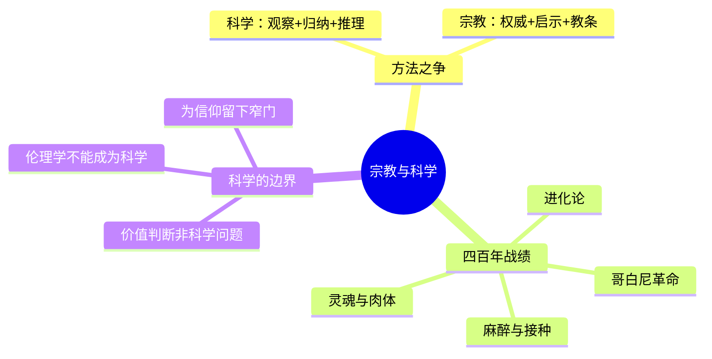

## 《宗教与科学》读书笔记 
  
### 作者  
digoal  
  
### 日期  
2026-06-22  
  
### 标签  
读书笔记 , 宗教与科学  
  
----  
  
## 背景 
  
  

---
书名: 《宗教与科学》  
作者: (英) 伯特兰·罗素  
译者: 徐奕春 / 林国夫  
出版社: 商务印书馆  
出版年份: 2010-9（原著1935年）  
笔记日期: 2026-06-22  
豆瓣链接: https://book.douban.com/subject/4753726/  
豆瓣评分: 9.0  
标签: [哲学, 宗教, 罗素, 科学, 西方哲学, 汉译名著]  
---

  

> **一句话**：这是一部用一百五十多页篇幅，把"科学每赢一寸，宗教就退一寸"这件事讲了四百年的简史，最后却悄悄给信仰留了一道后门。  
> **适合谁读**：对科学史、无神论、理性与信仰边界感兴趣的普通读者，不需要哲学训练  
> **阅读难度**：⭐⭐☆☆☆（1-5星）  
> **推荐指数**：⭐⭐⭐⭐☆  
  
---

## 一、时代坐标：这本书从哪里来？

1935年的罗素，已经63岁，刚刚结束与第二任妻子多拉的婚姻，离开他亲手创办的"游意学校"。这一年，他没有去写情感纠葛，而是回到一个他从青年时代就念念不忘的题目：科学和宗教，到底谁该让位给谁。

这不是一个孤立的学术兴趣。20世纪30年代的欧洲，正处在两种"新宗教"崛起的前夜——意大利的法西斯主义已经掌权十余年，德国的纳粹刚刚上台两年，苏联的斯大林体制也在巩固教条化的统治。罗素表面上在写哥白尼、伽利略和教会的旧账，实际上的问题意识，是一个更现代的焦虑：**当一种信念体系拒绝被理性检验、不允许任何异端存在时，会发生什么？** 这本书的最后一章，他几乎是图穷匕见地说穿了这一点——他真正担心的不是基督教会，而是法西斯主义和共产主义这类把教条当作真理、把异见当作罪行的"新教会"。

所以这本小书有一个表里两层结构：表层是四百年科学史的胜利叙事，里层是一份写给1935年那个动荡时代的、关于"什么样的信念体系配得上被相信"的诊断书。

```
[表层] 文艺复兴以来科学战胜神学的历史叙事
            ↓
[里层] 真正的靶子：拒绝接受理性检验的一切教条体系
            ↓
[落点] 法西斯主义、斯大林主义——20世纪的"新神学"
```

---

## 二、核心命题：作者在说什么？

罗素全书围绕三个层层递进的判断展开。

### 观点一：科学与宗教的冲突，本质是"方法"的冲突，而非"内容"的冲突

罗素开篇就划清界限：科学是"从特殊事实出发，归纳出规律，再用规律预测未来"的方法；宗教则同时包含教义、教会组织和伦理规范，是一个比科学复杂得多的社会现象。两者真正的战场，从来不是某一条具体教义对不对，而是**真理应该由谁来检验、用什么方式检验**——是靠观察和推理，还是靠权威和启示。哥白尼体系、进化论、对灵魂与肉体关系的探讨，每一次冲突的导火索都是教会想用权力终结一场本该用证据解决的争论。

### 观点二：四百年的战绩，科学几乎全胜，而且败的一方永远在"事后改口"

从哥白尼、伽利略到达尔文，再到麻醉术、接种术，罗素历数一连串案例，指出一个稳定的模式：教会先是激烈反对新发现，等到新发现站稳脚跟、无法否认之后，神学家们就回过头去重新诠释经文，宣称这本来就是上帝的意思。罗素的讽刺很克制但很锐利——宗教的"防线"不是被攻破一次，而是被攻破无数次之后，始终擅长把每一次溃退都包装成"早有预料"。

### 观点三：科学攻城掠地，但有一座城它攻不下——价值与伦理

这是全书最容易被忽略、也最关键的转折。罗素并不是一个把科学万能化的人。他明确承认：科学能告诉你什么是真、什么是假，但**"善""恶""应该不应该"这类价值判断，从一开始就不属于科学能裁决的范围**——它们本质上是个人欲望和偏好的表达，就像有人爱吃辣有人不爱吃辣，没有客观对错可言。正因如此，他给宗教留下了一道窄门：宗教在事实问题上节节败退，但在价值领域，它依然有存在的余地，因为那个领域本来就没有"科学"这个对手。



---

## 三、论证地图：作者怎么说服你的？

罗素的论证方式不是单点突破，而是**用大量具体的历史回合，反复验证同一个模式**，再在结尾处突然收紧到一个哲学论证。

他用的案例几乎都是教科书级别的——哥白尼日心说、伽利略受审、达尔文进化论、19世纪麻醉术和牛痘接种引发的宗教争议。这些案例的代表性很强，因为它们横跨天文学、生物学、医学三个领域，证明冲突不是某个学科的偶然现象，而是科学方法本身和教条权威之间的结构性矛盾。

但论证的真正"杀招"在第九章《科学与伦理学》。罗素在这里没有再讲历史案例，而是做了一次纯逻辑分析：他指出伦理命题本质上可以被改写成"我希望……"这样的主观陈述，因此天然不在"客观知识"的范畴内。这个论证干净利落，也确实是罗素作为逻辑学家的拿手好戏——但它同时是全书最大的论证跳跃：从"伦理判断无法被科学验证"，直接跳到"所以宗教在伦理领域可以合法存在"，中间缺了一环——**伦理学不能被科学解决，并不自动等于宗教就能解决它**。这是一个值得警觉的论证漏洞，下一节会展开。

```
[历史归纳] 哥白尼+达尔文+麻醉术…… 科学屡战屡胜
                  ↓
[逻辑分析] 伦理命题本质是主观偏好的表达
                  ↓
[跳跃点] 科学管不了伦理 ⇒ 宗教因此有了余地
                  ↓
[结论] 科学胜事实，宗教守价值——但这条边界线本身没有被证明
```

---

## 四、前提假设与边界：什么情况下这不成立？

罗素的整套论证，依赖几个隐藏的前提，而这些前提在今天未必都还站得住。

**前提一：科学与宗教的关系，可以被简化为"事实领域归科学，价值领域归宗教"的二分法。** 这个划分在1935年看起来干净利落，但今天的认知科学、进化心理学、神经伦理学已经大量介入"价值从何而来"这类问题，事实与价值的边界远比罗素设想的模糊。

**前提二：伦理判断纯粹是主观偏好，没有任何客观成分。** 这是元伦理学中"情感主义"的立场，至今仍有大量哲学家不同意——比如说人类痛苦的可避免性、基本权利的跨文化共识，似乎暗示伦理判断并非完全等同于"爱吃辣不爱吃辣"。如果这个前提被推翻，罗素留给宗教的那道"窄门"也就失去了存在的理由。

**前提三：1935年的"宗教"，主要指向有组织的、教条化的基督教会。** 今天宗教的样态早已多元化，有大量强调个人体验、不与科学正面冲突的宗教实践（比如某些灵修传统），罗素那种"宗教必然与科学打仗"的预设，对这部分宗教现象解释力有限。

这本书的适用边界，因此主要在于：**它对"教条化、排他性的信念体系"诊断力极强，但对"温和的、不主张垂直真理裁决权的信仰形式"诊断力有限。**

---

## 五、思想谱系：这本书在哪个传统里？

罗素属于英国经验主义和启蒙理性主义的延长线——洛克、休谟讲求"知识必须经受证据检验"的传统，在罗素这里变成了一种带有强烈历史感的、面向大众的科普写作。他同时也是分析哲学的奠基人之一，这本书里那种把伦理命题拆解为逻辑形式的手法，正是分析哲学"先把问题讲清楚再讨论"的招牌动作。

与同时代相比，罗素和维也纳学派的逻辑实证主义者（如卡尔纳普）有相近的气质——都对"形而上学的虚假问题"高度警惧；但罗素比他们更愿意直接介入历史叙事和公共议题，而不是把自己关在纯逻辑分析的房间里。这本书后来也成为英美世界"新无神论"写作（如理查德·道金斯《上帝的迷思》）的精神先驱之一——道金斯式的"科学逐一拆解宗教论证"的写法，能在罗素这里找到清晰的原型。

```
休谟·洛克（经验主义）
        ↓
罗素《宗教与科学》（1935）—— 历史叙事 + 逻辑分析
        ↓
逻辑实证主义（同期，更纯粹的逻辑路线）
        ↓
新无神论写作（道金斯等，21世纪）
```

---

## 六、我学到了什么？

第一个收获，是重新理解"宗教退让"这件事的节奏感。我原本以为科学和宗教的冲突是一次性的、戏剧化的对抗（比如伽利略受审），读完才发现真正惊人的是那种**反复发生、永远以同一种姿态收场**的循环：教会反对—科学胜出—教会改口说"这本来就是我们的意思"。这种循环本身,比任何单一案例都更能说明权威性话语体系如何应对被证伪的尴尬。

第二个收获，是罗素在第九章给我的提醒：**承认科学有边界，不等于给一切教条化的体系发放生存许可证。** 这是我读这本书最警醒的一刻——罗素自己说出"科学管不了价值"的时候，几乎是在给宗教松绑，但这个论证如果不加审视地搬到今天，很容易被滥用成"既然科学说不清道德，那随便什么信念体系都可以来填这个空"。这提醒我，在任何领域里，"承认某个工具有边界"和"默认替代方案就该被接受"，是两件完全不同的事，中间必须有论证，不能靠默认滑过去。

第三个收获，是看到罗素这本表面讲历史的书，骨子里其实是一篇"时代寓言"。这让我意识到，**读一本书的"标题主题"，往往只是表层入口**，更值得追问的是作者写作那一刻真正在担心什么——罗素表面在算文艺复兴以来的旧账，实际是在给1935年的欧洲敲警钟。读懂这层，整本书的份量会完全不同。

---

## 七、举一反三：这个框架还能用在哪？

罗素这套"方法之争优先于内容之争"的分析框架，有很强的迁移价值。

**场景一：评估任何争议性议题时，先问"这是事实之争还是价值之争"。** 比如当下围绕AI伦理、基因编辑的争论中，很多争吵其实混淆了"这项技术是否有效/安全"（事实问题，可用证据裁决）和"我们是否应该使用它"（价值问题，无法单靠证据裁决）。把两者分开讨论，能省下大量无效争吵。

**场景二：识别"教条化体系事后改口"的模式，可以用来审视任何权威性机构的话语策略。** 不只是宗教，企业公关、政治宣传中常见"先否认—被证伪—声称早有预料"的三段式，罗素对教会的分析提供了一份现成的识别清单。

**场景三：警惧"某领域有边界"被滑坡成"所以替代方案默认正确"的论证套路。** 这不仅适用于科学与宗教的关系，也适用于任何"专家系统失灵，所以民间智慧/直觉/传统就该上位"的论证——边界存在是一件事，谁来填补边界是另一件需要单独论证的事。

---

## 八、批判与反思

我最不同意的地方，正是前面提到的第九章那个论证跳跃。罗素用一句干净的逻辑分析（伦理判断是主观偏好）就把伦理学整个领域让给了宗教，这个动作太快了。即便接受"伦理判断不是科学命题"，也完全可以由哲学（而非宗教）来承担这部分工作——事实上罗素自己一辈子都在做这件事。他给宗教开的这道"窄门"，更像是一种修辞上的礼貌退让，而不是严密论证的结果。

时代变化最大的地方，在于**宗教与科学冲突的"主战场"已经转移**。1935年的典型冲突是天文学、生物学层面的事实之争（地球是不是宇宙中心、人是不是猿猴变的），今天这类冲突在大多数受教育人群中已经基本平息；新的冲突前线转移到了生命伦理（堕胎、安宁死、基因编辑）、身份认同等领域，而这些恰恰落在罗素留给宗教的那道"价值窄门"里——某种意义上，今天的冲突比罗素设想的更难用他这套框架去解决。

这本书的局限性也很明显：它太短、太"演讲化"，每一章都像一篇独立的科普短文，深度往往止于"讲清楚一个历史回合"，对一些复杂概念（比如决定论与量子力学的关系）几乎是点到为止，留给读者自己去查更专业的文献。

---

## 九、金句与记忆点

1. **"科学每战胜神学一步，就给人类带来一分幸福。"**
   ——罗素对科学进步价值的基本信念，但他随后补了一句更悲观的话：科学带来的杀伤力工具，也在同步升级。胜利从不是单向的礼物。

2. **教会的应对模式："先反对，再败退，再改口说这本来就是我们的意思。"**（笔者概括）
   ——这是全书最值得记住的"行为模式"，可以用来识别任何拒绝认错的权威话语。

3. **"价值问题不属知识范围，不是凭理智可以解决的。"**（笔者概括罗素核心论点）
   ——这句话既是罗素留给宗教的窄门，也是全书最大的争议焦点。

4. **关于俄国与德国的著名类比**（书中原话大意）：罗素提醒读者，不应因为同情某种意识形态就为它的镇压行为开脱，也不应因为厌恶另一种意识形态就宽恕对方的暴行——这句话写在1935年，几乎是对未来十年欧洲悲剧的预言。

5. **科学的定义："从特殊事实出发，建立规律，再用规律预测未来。"**（笔者概括）
   ——简洁到近乎冷峻，这也是罗素全书评判一切信念体系的标尺。

---

## 十、延伸阅读

1. **《为什么我不是基督教徒》（罗素）** —— 商务印书馆同期出版，收录罗素20-50年代批判宗教的15篇文章，可与本书对照阅读，更全面了解罗素的非宗教思想。

2. **《西方哲学史》（罗素）** —— 罗素1945年的代表作，能看到他如何把"宗教与科学"这种具体议题，放进更宏大的西方思想史脉络里处理。

3. **《上帝的迷思》（理查德·道金斯）** —— 21世纪"新无神论"写作的代表作，可以看到罗素这本小书的论证模式如何被继承和放大。

4. **《科学革命的结构》（托马斯·库恩）** —— 如果想更系统地理解"科学如何战胜旧范式"这件事的内在机制，库恩的"范式转移"理论是绕不开的补充读物。

5. **《人类简史》（赫拉利）** —— 从更宏观的人类学视角讲"信念体系如何塑造社会"，可以和罗素这本聚焦欧洲科学史的小书形成有趣的对照。

---

*笔记写于 2026-06-22 | 基于公开资料与深度思考整理*
  
  
#### [PostgreSQL 解决方案集合](../201706/20170601_02.md "40cff096e9ed7122c512b35d8561d9c8")
  
  
#### [德哥 / digoal's Github - 公益是一辈子的事.](https://github.com/digoal/blog/blob/master/README.md "22709685feb7cab07d30f30387f0a9ae")
  
  
#### [About 德哥](https://github.com/digoal/blog/blob/master/me/readme.md "a37735981e7704886ffd590565582dd0")
  
  

  
