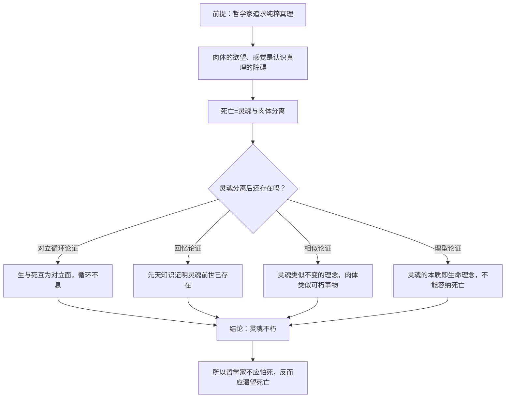

## 《斐多篇》读书笔记 
  
### 作者  
digoal  
  
### 日期  
2026-06-22  
  
### 标签  
读书笔记 , 斐多篇  
  
----  
  
## 背景 
  
  

---
书名: 《裴洞篇》（即《斐多篇》，柏拉图对话录单行本）  
作者: [古希腊]柏拉图，王太庆 译  
出版年份: 2013-1（译文出自王太庆遗稿《柏拉图对话集》，商务印书馆2004年首次整理出版）  
笔记日期: 2026-06-22  
出版社: 商务印书馆 / 汉译世界学术名著丛书·哲学  
页数: 84  
---
  
  

> **一句话**：苏格拉底用喝下毒酒前最后一个下午的时间，向朋友们证明"哲学家不怕死"，因为死亡不是终结，而是灵魂从肉体的牢笼里解脱出来去见理念本身。  
> **适合谁读**：想理解西方哲学"二元论"源头的人、对死亡和灵魂问题感兴趣的人、想知道苏格拉底到底是怎么死的人  
> **阅读难度**：⭐⭐⭐⭐☆（1-5星，对话体看似简单，但论证密度很高）  
> **推荐指数**：⭐⭐⭐⭐⭐  
  
---  

## 一、时代坐标：这本书从哪里来？

公元前399年春天，雅典。七十岁的苏格拉底被一个叫美勒托的年轻诗人控告"不信城邦的神、败坏青年"，500人陪审团以微弱多数判他有罪，又判他死刑。按照雅典的规矩，处决要等一年一次的提洛岛阿波罗祭典船只回港才能执行，于是苏格拉底在监狱里多活了将近一个月。这一个月里，他的朋友、学生天天来探监，于是有了《克力同篇》《裴洞篇》这些记录他临终言行的对话。《裴洞篇》记的就是行刑当天下午，苏格拉底喝下毒酒前的最后一场谈话——主题正是死亡。

这不是一篇冷静的学术论文，而是一个赴死之人留给活人的告别课。表面上看，苏格拉底要回答的问题是"哲学家为什么不怕死"；但往深处看，柏拉图借这场对话第一次系统地把他的"理念论"摊开来讲——灵魂之所以不怕死，是因为它本来就属于一个比肉眼可见的世界更真实、更永恒的"理念世界"。换句话说，这本书表面讲死亡，实际讲的是柏拉图整套世界观的地基。

商务印书馆这版《裴洞篇》单行本，译文出自王太庆（1922-1999）的遗稿。王太庆是北大哲学系教授，一辈子主要精力都用在翻译柏拉图上，却在整理出版前突然病逝，译文是身后由同事整理付梓的。这层"译者本人没看到译作问世"的背景，让这个译本本身也带了一点裴洞篇式的悲怆感。

---

## 二、核心命题：苏格拉底在说什么？

### 观点一：哲学家是"练习死亡"的人

苏格拉底开篇就抛出一个让朋友们大吃一惊的说法：真正的哲学家，一辈子都在为死做准备，所以面对死亡不仅不该害怕，反而该高兴。理由很直接——肉体是灵魂求知的最大障碍：饿了要吃饭、病了要养病、欲望和恐惧不断打扰思考，连战争和争夺都是为了肉体的需要而起。只要灵魂还困在肉体里，它就不可能获得纯粹的真理。死亡恰恰是灵魂和肉体的彻底分离，所以死亡不是哲学家的敌人，而是哲学家一辈子追求的"毕业典礼"。

### 观点二：灵魂不朽，靠四组论证撑住

这是全篇的重头戏。苏格拉底的两个对话者格贝和辛弥亚分别提出质疑，苏格拉底依次用四组论证回应：

1. **对立循环论证**：万物都从对立面中产生（冷生热、睡生醒），生与死也是一对对立面，活人死了产生死人，那么死人也该"循环"产生活人——否则世界早就该"用尽"了。这暗示灵魂在死后会以某种方式继续存在，并轮回归来。
2. **回忆论证**：人天生就有"绝对相等""绝对美"这类无法从感官经验里直接得到的知识（你见过的任何两根木棍都不是绝对相等的，但你一看就知道什么是"相等"本身）。这种知识只能解释为灵魂在出生前就已经"见过"理念，出生后只是凭感官触发"回忆"起来——这意味着灵魂在出生之前就存在。
3. **相似论证**：灵魂能认识那些不变的、单一的理念（如善、美本身），而肉体只能感知变来变去的具体事物。"物以类聚"，灵魂因此更接近不变、不朽的那一类东西，肉体则接近会朽坏的那一类。
4. **理型论证（最关键、最后给出）**：灵魂之所以能让肉体"活着"，恰恰是因为它本身分享了"生命"这个理念，而"生命"这个理念逻辑上不能容纳它的对立面"死亡"——正如"三"不能变成偶数一样。所以灵魂在本质上就是不死的。

### 观点三：哲学家临终的态度，本身就是最强的论证

比四组逻辑论证更打动人的，其实是苏格拉底本人那天下午的状态——他平静地讨论哲学，安慰哭泣的朋友，最后从容喝下毒药，躺下等死。柏拉图似乎在说：一个人能不能"知行合一"地相信自己的哲学，才是检验这套哲学是否站得住脚的终极标准。

---

## 三、论证地图：苏格拉底怎么说服你的？



四组论证不是简单叠加，而是层层递进、互相补台：前三组论证都被对话者找出了漏洞（格贝指出，循环论证和相似论证只能证明灵魂比肉体"更长寿"，不能证明它"绝对不朽"），最后的理型论证试图从柏拉图的核心武器——理念论本身——一锤定音地堵上漏洞。这种"先抛出朴素论证、让人挑刺、再用更深的理论收口"的结构，正是柏拉图对话体最精彩的地方：它把论证本身的脆弱性也暴露给了读者，而不是一路装作天衣无缝。

值得一提的是回忆论证用到的"案例"：苏格拉底让辛弥亚承认，任何两根现实中的木棍都不会"绝对相等"，但人一出生就懂得判断它们"相等不相等"——这说明判断的标准（绝对相等）不可能来自经验，只能来自灵魂前世的记忆。这个例子很巧妙，但也正是后来哲学家反复攻击的薄弱点：会不会"绝对相等"这个概念其实是人脑后天抽象、归纳出来的，根本不需要"前世记忆"来解释？

---

## 四、前提假设与边界：什么情况下这不成立？

苏格拉底的整套论证，建立在几个今天看来未必牢靠的假设之上：

1. **"理念"必须独立于具体事物而存在**。如果你不接受柏拉图的理念论（即抽象概念是比具体事物更"真实"的独立存在），整套灵魂不朽论证就失去了地基——回忆论证尤其如此。
2. **灵魂是单一、不可分的实体**。这与后来亚里士多德把灵魂理解为"身体的形式/功能"（灵魂离开身体就像"看"离开眼睛）形成尖锐对立，也与现代神经科学把意识视为大脑活动的产物相距甚远。
3. **"对立产生对立"这种自然规律可以无差别套用到生死问题上**。冷热、睡醒确实是循环的物理/生理现象，但把"死"类比为"睡"的对立面、再推论出死后必有循环再生，这一步的类比强度其实很弱，连当时的对话者格贝也只是"半信半疑"地接受。

适用边界：这本书更适合当作"理念论的入门教材"和"哲学态度的范本"来读，而不适合当作一份严谨到无懈可击的灵魂不朽证明来读——柏拉图自己其实也借对话者的质疑，承认了这一点。

---

## 五、思想谱系：这本书在哪个传统里？

```
毕达哥拉斯学派（灵魂轮回、净化说）
        │
        ▼
   苏格拉底（伦理转向：追问"什么是好的生活"）
        │
        ▼
   柏拉图《裴洞篇》（理念论初次系统登场：灵魂↔身体 二元对立）
        │
        ├──→ 新柏拉图主义、奥古斯丁（灵魂渴望脱离肉欲、回归永恒）
        ├──→ 笛卡尔身心二元论（"我思"独立于身体）
        └──→ 亚里士多德（反向修正：灵魂是身体的形式，不能脱离身体单独存在）
```

《裴洞篇》里的灵肉二元对立，直接孕育了后来整个西方哲学和基督教神学里"灵魂高于肉体""理性高于欲望"的基本框架。笛卡尔"我思故我在"背后那种"心灵可以独立于身体存在"的直觉，可以一路追溯到这里。而亚里士多德作为柏拉图的学生，恰恰是从《裴洞篇》这套二元论出发，反过来论证灵魂离不开身体——这场"师徒互怼"构成了西方心灵哲学绵延两千多年的主线之一。

---

## 六、我学到了什么？

第一，**死亡焦虑的解药未必是逻辑，而是一种生活方式**。读完四组论证，我并不觉得自己被"证明"说服了，但我确实被苏格拉底那天下午的状态打动了——一个人能不能不怕死，最终取决于他这一生有没有真的按自己信的东西活过，而不是临死前有没有想清楚一套形而上学。这比任何逻辑推导都更有说服力，也更难做到。

第二，**好的论证要敢于自我拆台**。柏拉图让格贝和辛弥亚当场指出苏格拉底论证的漏洞，这种写法在今天的"说服性写作"里其实很少见——大部分人写论证文章都是一路藏起反例。但《裴洞篇》告诉我，真正有力量的思考,反而是先把自己最脆弱的地方暴露出来，再想办法补上。

第三，**抽象概念的来源问题，比我想象的更难回答**。回忆论证那个"绝对相等"的例子让我第一次认真想：人到底是怎么获得"完美""相等""正义"这类没法直接从经验中观察到的概念的？柏拉图给出的答案（前世记忆）我不接受，但这个问题本身——抽象概念从哪来——直到今天的认知科学和语言哲学也没有彻底解决。

---

## 七、举一反三：这个框架还能用在哪？

**"先暴露漏洞再补"的论证结构**，可以用在任何需要说服别人的复杂场合：写产品方案时，主动列出最强的反对意见再逐一回应，比一路自圆其说更让人信服；做投资决策复盘时，先承认上一次判断的具体漏洞，再说明这次怎么补上，比空喊"我学到了"更有说服力。

**"用临终状态检验一套理论"**，可以转化为一种自我检验工具：如果你信的某个道理，让你在真正面对损失、痛苦或失败时依然能"知行合一"地照做，那这个道理大概是真的内化了；如果一遇到真实压力就抛弃了，那之前讲的可能只是嘴上的道理。

**理念与现象的区分**，在产品和管理工作里也有用：很多团队争论的其实是"现象层"的具体做法（这根木棍多长），却忘了先对齐"理念层"的标准（什么算"好"）。先把抽象标准说清楚，往往比争论具体案例更有效率。

---

## 八、批判与反思

我不同意的地方主要有两点。一是把肉体几乎完全等同于"求知的障碍"，这种对身体的贬低，放到今天身心一体的认知科学视角下显得过于决绝——情绪、直觉、身体经验本身也是认知和创造力的来源，而不只是干扰项。二是循环论证里"死后必然循环再生"的推论，类比的力度其实很弱，连当时的对话者都没有完全被说服，柏拉图本人似乎也清楚这一点，所以才需要后面三组论证层层加码。

时代变了的地方更明显：苏格拉底时代的人理所当然地接受灵魂轮回的民间信仰，把它当作论证的隐含前提；今天的读者大多不会预设这个前提，所以回忆论证和循环论证对现代人的说服力会打很大折扣。理型论证因为更纯粹地依赖逻辑（生命理念排斥死亡），反而是四组论证里在今天读起来最"硬"的一组，但它的代价是要你先全盘接受整套理念论的世界观。

这本书的局限性，归根结底在于：它解决的是"哲学家该如何面对自己的死亡"，而不是"灵魂不朽是否在科学上成立"。把它当作信仰的安慰剂或人生态度的范本来读，会比当作严谨证明来读收获更大。

---

## 九、金句与记忆点

1. **"哲学家是一辈子在练习死亡的人。"**——把死亡从恐惧的对象，重新定义为哲学训练的终点。
2. **"肉体用爱、欲望、恐惧，以及各种胡说，阻碍我们求得真理。"**——柏拉图灵肉二元论最直白的表述。
3. **"我们只能尽量在活着的时候避免和肉体过多交往，直到神使我们解脱。"**——一种克己的、近乎修行的哲学生活方式。
4. **回忆论证的核心比喻**："你见过两根绝对相等的木棍吗？没有，但你一看就知道什么是相等。"——抽象知识不可能完全来自感官经验。
5. **理型论证的关键类比**："正如三不能变成偶数，灵魂作为生命理念的分享者，不能容纳死亡。"——把逻辑必然性引入灵魂不朽问题。
6. **"我去死，你们去活，但谁的前程更幸福，只有神才知道。"**（出自姊妹篇《申辩篇》，常与《裴洞篇》并读）——苏格拉底面对审判结果时的态度，与《裴洞篇》临终场景一脉相承。
7. **格贝的质疑**："灵魂或许比肉体长寿，但谁能保证它绝对不朽，而不是经历很多次肉体后最终也会耗尽？"——本书里最犀利的反例，至今仍是这类论证的标准攻击点。

---

## 十、延伸阅读

1. **《苏格拉底的申辩篇》《克力同篇》**（与《裴洞篇》同属"苏格拉底临终三部曲"）——分别记录审判现场和苏格拉底拒绝逃狱的理由，三篇连读才能看全苏格拉底之死的完整脉络。
2. **柏拉图《会饮篇》**——同样讨论"灵魂如何超越肉体趋向永恒"，但走的是"爱欲之路"而非"死亡之路"，可以和《裴洞篇》对照阅读三种通往理念的不同途径。
3**亚里士多德《论灵魂》**——直接对柏拉图的灵肉二元论提出修正，认为灵魂是身体的"形式"而非可独立存在的实体，读完《裴洞篇》后读这本，能看清西方心灵哲学最早的一次"师徒分歧"。
4. **I.F.斯东《苏格拉底的审判》**——从历史和政治角度重新审视苏格拉底为何被处死，补足《裴洞篇》之外、雅典民主政治的现实背景。
5. **吴飞《〈斐多〉中的存在与生命》（论文）**——从"物理性存在/生命性存在/哲学性存在"三层次重新解读灵魂不朽的含义，是中文学界近年对此篇较有分量的再阐释，适合读完原典后做深度延伸。

---

*笔记写于 2026-06-22 | 基于公开资料与深度思考整理*
  
  
#### [PostgreSQL 解决方案集合](../201706/20170601_02.md "40cff096e9ed7122c512b35d8561d9c8")
  
  
#### [德哥 / digoal's Github - 公益是一辈子的事.](https://github.com/digoal/blog/blob/master/README.md "22709685feb7cab07d30f30387f0a9ae")
  
  
#### [About 德哥](https://github.com/digoal/blog/blob/master/me/readme.md "a37735981e7704886ffd590565582dd0")
  
  

  
