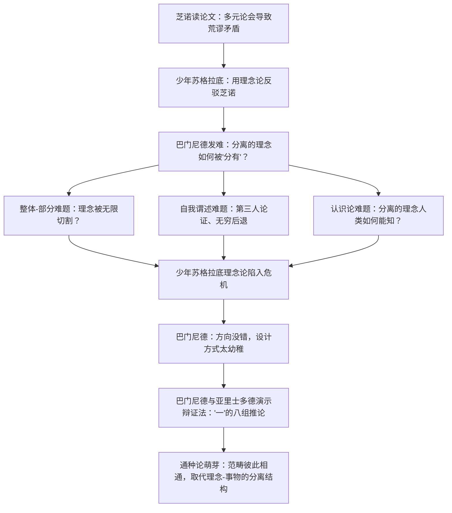

## 《巴曼尼得斯篇》读书笔记 
  
### 作者  
digoal  
  
### 日期  
2026-06-23  
  
### 标签  
读书笔记 , 巴曼尼得斯篇  
  
----  
  
## 背景 
  
  

---
书名: 《巴曼尼得斯篇》  
作者: [古希腊] 柏拉图 著 / 陈康 译注  
出版年份: 1982-8（商务印书馆，"汉译世界学术名著丛书·哲学"）  
笔记日期: 2026-06-23  
豆瓣链接: https://book.douban.com/subject/1251842/  
标签: [古希腊哲学, 柏拉图, 理念论, 辩证法, 陈康]  
---

  

> **一句话**：晚年的柏拉图把自己年轻时最骄傲的发明——理念论——亲手放上审判台，然后用八组烧脑的逻辑推演，告诉我们哲学真正的样子不是"一锤定音"，而是"永远在自我修正"。  
> **适合谁读**：对"概念到底是什么"感兴趣的人，想理解西方形而上学源头的人，以及——做好心理准备的逻辑训练爱好者。  
> **阅读难度**：⭐⭐⭐⭐⭐（5星，柏拉图对话录里公认最难的一篇）  
> **推荐指数**：⭐⭐⭐⭐☆  
  
---

## 一、时代坐标：这本书从哪里来？

《巴曼尼得斯篇》写作的确切年代柏拉图学界至今没有定论，但有一点几乎是公论：它出现在柏拉图思想生涯的"中年危机"时刻。在《斐多篇》《国家篇》（即《理想国》）里，柏拉图已经建立起一套漂亮的理念论——可感世界的具体事物都是"分有"了某个完美、永恒、独立存在的"理念"（相）。这套理论解释力很强，也写得很美，但柏拉图自己显然觉得不够踏实。于是他做了一件几乎没有哲学家敢做的事：让自己最得意的理论，去接受一次最严厉的盘问。

更耐人寻味的是对话的人物安排。在柏拉图绝大多数对话里，苏格拉底永远是那个"提问、拆解、教育别人"的主角。但在这一篇里，苏格拉底变成了被拆解的"少年"，真正的主导者是爱利亚学派的元老巴门尼德——那位提出"存在是一，不动不变"的古怪哲人。柏拉图借这位前辈之口，对自己年轻时（即苏格拉底所代表的阶段）的理念论展开质询。这个设定本身就是态度：**这是一次自我批判，不是别人对柏拉图的批判**。

陈康先生在译序里给出过一个很有说服力的判断：柏拉图的对话可以分成两组——《斐多篇》《国家篇》代表理念论的成熟期，《巴曼尼得斯篇》和《智者篇》代表后期"通种论"的酝酿期。而《巴篇》正是这两个阶段之间的转折枢纽：前半部让理念论陷入危机，后半部则借八组关于"一"的逻辑推演，悄悄孕育出一套新的范畴思路。学界普遍认为柏拉图的思想分为前后两期，早期以《斐多篇》和《国家篇》中的相论为代表，晚期则以从《巴曼尼得斯篇》开始到《智者篇》完成的通种论为代表，从早期到晚期的转折正是从《巴曼尼得斯篇》开始的。

这本商务印书馆 1982 年版，是著名希腊哲学专家陈康先生的译注本，最早出版于 1944 年重庆商务印书馆，此后多次重印。中译本由陈康翻译，1944年在重庆商务印书馆出版，此后多次印刷，全书由引论及正文组成，中译本约两万多字。原文不长，但陈康的注释篇幅却达到了正文的约九倍——这是一本"用注释托起正文"的奇特译本。

---

## 二、核心命题：作者在说什么？

### 命题一：理念论本身有"自爆"的风险

少年苏格拉底提出：理念是独立于个别事物、与个别事物分离存在的完美原型，个别事物因为"分有"理念才获得各自的性质。巴门尼德立刻发问：如果理念和事物是彻底分离的两个世界，那么——

- 一个事物怎么可能同时"分有"理念的全部，又"分有"理念的一部分？理念会不会因此被无限切割？
- 如果"大"本身要成为"大的"，那么"大的理念"和"大的事物"之间，岂不是还需要第三个"大"来统一解释它们的相似性？这第三个"大"又需要第四个来解释……无穷后退。

这就是后世哲学史上著名的"**第三人论证**"（Third Man Argument）的最早版本。"三个人"悖论即"第三者论证"，是《巴门尼德篇》中对柏拉图理念论的一个批评，它提出理念论只能解释感性世界中事物的相似性，无法解释感性世界事物与理念之间的相似性。这个论证的杀伤力在于：它精准地刺中了理念论的一个隐藏假设——理念本身也要"具有"它所代表的性质（自我谓述，self-predication），而这个假设一旦成立，理念论就会陷入解释自身的无穷循环。

### 命题二：认识论的死结——分离的理念怎么被我们知道？

巴门尼德还抛出一个更要命的问题：如果理念世界与可感世界彻底分离，那么"知识"本身存在于理念世界，而我们这些活在可感世界里的人，怎么可能真的认识理念？神或许能认识完美的理念，但人的知识只能停留在可感世界这一边，永远够不到理念。这等于说，理念论如果坚持"绝对分离"，反而会取消掉理念论原本想保住的"可知性"。

苏格拉底被这一连串质问问得哑口无言。但巴门尼德随即安慰式地补了一句关键的话：理念论的方向没有错，错的是少年苏格拉底为理念设定的方式过于幼稚生硬——这暗示了，柏拉图并不打算彻底抛弃理念论，而是要重新设计它。

### 命题三："通种论"——理念之间彼此相通，而非彼此孤立

后半部，巴门尼德转而和年轻的亚里士多德演示一种全新的辩证法练习：围绕"一"（to hen）这一个理念，从"如果一存在"和"如果一不存在"两种假设出发，各自推出一系列看似矛盾的结论，一共构成八组（或加上附论共更多组）逻辑推演。

这部分极其枯燥，却暗藏柏拉图后期思想的真正核心。巴门尼德接着提出了另一种"理念"即"最普遍的种"，也就是所谓的范畴，他认为解释极端相反的性质怎样在个别事物中相互结合，应当依据这种通种论，而不应以一种理念与个别事物分离的思路。换句话说：与其假设有一个孤悬在外、与万物分离的"大理念""美理念"，柏拉图开始设想一组彼此相通、相互结合的最高范畴（一、是、同、异、动、静……），具体事物之所以"是"它自己，是因为它"分有"了这些范畴的某种组合方式。在这种通种论的设想中，最高的理念不再只是"善的理念"，而变成了多个，且这些理念中的任何一个不能离开其他理念而单独存在，它们是相通的。

这是一次悄悄但彻底的转向：从"一个善的理念统御一切"，转向"多个范畴彼此交织、共同构成存在"。陈康先生称之为柏拉图哲学"**从一元唯善论到多元范畴论**"的转变。按陈康先生的说法，柏拉图的哲学从一元唯善论转变为了多元范畴论。

---

## 三、论证地图：作者怎么说服你的？



这张图的关键转折在 G→H：柏拉图没有让对话停在"理念论破产"上，而是把危机转化为方法论的升级——**真正的哲学不是守住一个一成不变的结论，而是不断用最严苛的反诘去检验自己最珍视的理论**。这本身就是一种"以辩证法为生活方式"的示范。

后半部八组推论的逻辑结构，可以简化理解为一种"假设演算"：

```
假设"一"存在 → 推导出一系列关于"一"的性质（是/不是多、有限/无限、动/静……）
假设"一"不存在 → 推导出另一系列截然相反的性质
        ↓
两组推论彼此对称又彼此矛盾
        ↓
逼迫读者意识到：单靠形式逻辑本身，
"一"既可以被论证为"绝对单纯"，
也可以被论证为"必然是无限的多"
```

豆瓣读者摘录的原文片段很能体现这种风格的"烧脑感"：是的一的部分中每一部分，一和是，离开另一部分么？一离开是的部分，是离开一的部分么？这是不可能。那么每一部分将又有一和是，并且至少由两部分组成，依照同一个论证永远是如此，凡成为一部分的，它将永远有这两部分；因为一将永远有是，是将永远有一，结果每一部分必然永远地变为二，永不是一。无疑地。是的一岂不要是这样无限的多么？看起来如此。读到这一段时我的真实感受是：这哪里是哲学，这分明是一台手工运转的逻辑机器，每一步都严丝合缝，却把读者逼到一个"一即是多"的悬崖边上，让你亲眼看见纯粹概念分析能把直觉炸成什么样子。

陈康对这部分的评价非常高，他认为这是全篇真正的精华，甚至放在整个欧洲哲学史的尺度上来比较：陈康先生评价《巴篇》后半部分提出的通种论甚为严肃，两千六百年的欧洲哲学史上也只有黑格尔的《逻辑学》（Wissenschaft der Logik）可以与之媲美。这是一个相当大胆的论断——把一篇两千四百年前的古希腊对话，和黑格尔体系最庄严的著作并列，但也正说明陈康读出了这部分文本里那种"纯靠概念自我运动推进论证"的气质。

---

## 四、前提假设与边界：什么情况下这不成立？

第一部分对理念论的攻击，几乎全部依赖一个隐藏前提：**理念也要"具有"它自身所代表的性质**（即"自我谓述"假设）——大的理念本身必须是大的，美的理念本身必须是美的。如果接受这一假设，理念论才会滑向第三人论证的无穷后退；如果不接受（比如把理念理解为一种纯粹的"功能"或"标准"，而不要求它自身也例示该性质），第三人论证就未必成立。这也是后世分析哲学反复争论的焦点之一。

第二，"理念-事物绝对分离"是一个本体论假设，而不是逻辑必然。柏拉图借巴门尼德之口指出：如果坚持绝对分离，认识论上会立刻陷入困境（人无法认识理念）。这提示我们：任何"两个世界论"式的哲学构造，都要小心处理"两个世界如何沟通"这道关卡——这其实是后来从新柏拉图主义到笛卡尔身心二元论，反复要面对的同一道难题的雏形。

第三，八组逻辑推演本身建立在一种特定的希腊式"一/多"二元语言框架之上。今天我们用现代逻辑（量化、集合论）去重新形式化这些论证时，会发现古希腊语言里"是"（einai）这个动词本身兼具"存在""等同""谓述"三种用法却不加区分，这恰恰是很多论证之所以能"推出矛盾"的语言学根源。换句话说，这套论证的有效性边界，部分取决于古希腊语本身的语法特性，未必能完全照搬到现代语言和现代逻辑体系里。

---

## 五、思想谱系：这本书在哪个传统里？

```
爱利亚学派（巴门尼德、芝诺：存在是一，不动不变）
        │
        ▼
柏拉图早期理念论（《斐多篇》《国家篇》：理念与个别事物分离）
        │
        ▼
《巴曼尼得斯篇》：理念论的自我批判 + 通种论的萌芽
        │
   ┌────┴────┐
   ▼         ▼
《智者篇》    亚里士多德《范畴篇》《形而上学》
(通种论完成)  (正式提出"第三人论证"，批判理念分离说)
   │         │
   └────┬────┘
        ▼
新柏拉图主义（普罗提诺："一"作为终极本原）
        │
        ▼
近代：黑格尔《逻辑学》（陈康认为可与本篇后半部媲美）
        │
        ▼
20世纪：分析哲学（Vlastos 论"第三人论证"）
        + 现象学（海德格尔论本篇"瞬间"问题）
        + 陈康的汉语译注传统（"少年苏格拉底相论考"等）
```

这张谱系图想说明一件事：《巴曼尼得斯篇》不是一篇孤立的奇文，而是一个**枢轴**——往前接住了爱利亚学派的一元论遗产，往后同时分出了至少三条完全不同的解读路线：

1. **形而上学路线**：亚里士多德把"分离说"明确归为部分学园派柏拉图主义者的主张，而非柏拉图本人立场，由此正式提出"第三人论证"作为对理念论的系统批评。
2. **分析哲学路线**：以 Vlastos 为代表的英美学者，把第一部分的逻辑论证当作独立的哲学谜题反复打磨，却普遍对后半部八组推演兴趣寥寥。学者 Vlastos 关于第三人论证的论文影响很大，但他从未写过关于本篇后半部辩证法练习的论文，在讨论柏拉图形上学的重要论文集中，关于《巴门尼德篇》后半部的论文也非常少。
3. **欧陆/汉语解读路线**：陈康坚持把前后两部分当作一个整体来读，认为后半部的"通种论"才是理解柏拉图晚期形上学的钥匙；海德格尔晚年也专门讨论过本篇第三条进路中"瞬间"（瞬间与无性）这一存在论疑难。

三条路线分裂的本身，恰恰说明这篇对话的解释空间有多大——这也是它两千四百年来始终是"显学中的显学"的原因。

---

## 六、我学到了什么？

**第一，真正的思想力量，体现在敢于亲手拆解自己最得意的理论。** 多数人（包括我自己）建立起一套说得通的解释框架后，本能是去捍卫它、修补漏洞，而不是主动去寻找最致命的反例。柏拉图却让自己年轻时的理念论亲自接受巴门尼德式的盘问，并且毫不留情——苏格拉底在对话里被问到几乎说不出话。这种自我批判的勇气，比理念论本身更值得记住。

**第二，"无穷后退"是检验一个解释框架是否健康的最锋利的工具之一。** 第三人论证的精髓在于：只要一个解释模式（A 之所以是 A，是因为分有了 B）本身也满足同样的提问条件，它就会陷入自我复制的循环。这个检验方式我后来发现可以用在很多地方——比如检验某个"元规则"是否真的解决了问题，还是只是把问题挪到了上一层。

**第三，辩证法不是为了得出一个唯一正确答案，而是为了穷尽逻辑空间里的所有可能性，看清问题的真正结构。** 后半部八组推演看似在反复"自相矛盾"，实际上是在系统地把"一"这个概念放在存在/不存在两种假设下，逐一推演到底。这种"把所有分支都走一遍"的态度，比急着下结论要诚实得多。

---

## 七、举一反三：这个框架还能用在哪？

**场景一：审视自己专业里的核心概念。** 任何领域都有一个被广泛使用却从未被真正盘问过的核心概念（比如"用户需求""市场效率""智能"）。可以模仿巴门尼德的提问方式问自己：这个概念和它所解释的现象，是"分离"的关系，还是"内在相通"的关系？如果分离，怎么沟通？如果相通，又如何避免概念空洞化？

**场景二：辩论或谈判中的"假设穷尽法"。** 与其急着论证自己的立场对，不如效仿后半部的八组推演——分别假设"如果 A 成立会怎样"和"如果 A 不成立会怎样"，把两条链条都推演到底，再看哪一条更经得起检验。这比单线论证更容易说服理性的对手。

**场景三：技术架构或产品设计中的"循环依赖"排查。** 第三人论证本质上是发现了一种隐藏的循环依赖（理念解释事物相似性，却需要更高层理念来解释理念与事物的相似性）。这和软件工程里排查"无限递归的抽象层"是同一种思维方式：一旦发现一个解释模式对自己也适用，就要警惕它是否真正解决了问题。

---

## 八、批判与反思

**我不完全同意的地方：** 陈康把"通种论甚至可与黑格尔《逻辑学》媲美"的评价，读起来更像是译者出于深厚情感的高度推崇，而不是一个经得起严格比较哲学检验的判断。黑格尔的《逻辑学》是一个完整、自足、试图穷尽全部范畴运动的体系，而《巴曼尼得斯篇》后半部更像是一次方法论的"示范演练"，柏拉图自己也没有在文本里给出最终结论——这恰恰是这篇对话的魅力，但也意味着它和黑格尔体系并不在同一量级上。

**时代局限性：** 八组推演高度依赖古希腊语"是"（einai）一词兼具存在、等同、谓述三重含义却不作区分的语言特性。现代逻辑学已经把这三种用法严格区分开，用这套现代工具回头审视这些论证时，会发现不少推论其实是利用了古希腊语本身的歧义性才能成立。这提示我们：阅读这类古典逻辑论证，要时刻区分"论证的哲学洞见"和"论证依赖的语言学偶然性"。

**这本书的局限：** 陈康译本的注释篇幅是正文的九倍，这固然提供了极扎实的学术支撑，但也意味着普通读者很容易被注释"带走"，反而疏远了原文本身那种紧张、逼问式的对话节奏。该篇本身难度很大，对它的看法也各有不同，其中的论证对于大多数人而言会让人感到无趣，阅读时需要特别注意这一点。坦白说，后半部读起来确实枯燥，如果不是带着"这是柏拉图留给后人的一道逻辑谜题"的心态去读，很容易半途而废。

---

## 九、金句与记忆点

1. **"一岂不要是这样无限的多么？"**——后半部推演里最具冲击力的一句反问，把"绝对单纯的一"逼成了"无限的多"，是整篇对话最浓缩的悖论缩影。
2. **"建设新的万有论需要对《纯粹理性批判》以前万有论的了解，而最能满足这一要求的，在柏拉图的谈话录中首推《巴篇》。"**——陈康译序中的核心判断，说明他把本篇视为西方存在论的奠基性文本。陈康先生认为，建设新的存在论需要对康德《纯粹理性批判》以及《纯粹理性批判》以前存在论的了解，而最能满足后一要求的，在柏拉图的谈话录中首推本篇
3. **"两千六百年的欧洲哲学史上也只有黑格尔的《逻辑学》与之媲美。"**——陈康对后半部"通种论"雏形的极高评价，可以批判性地参考，但不必全盘接受。
4. **"分离之说是当时学园中某些柏拉图主义者的主张，而非柏拉图本人的观点。"**——陈康博士论文的核心结论，提醒我们：很多归在"柏拉图理念论"名下的极端立场，其实可能是后人（包括他自己的学生）的过度引申。陈康博士论文认为亚里士多德从未将柏拉图的哲学说成是个别事物同理念相分离，分离之说是当时学园中某些柏拉图主义者的主张，而非柏拉图本人的观点
5. **"论证皆循步骤，不作跳跃式的进行……更避免玄虚到使人不能捉摸其意义的冥想来'饰智惊愚'。"**——陈康晚年自述的治学态度，也是读这本书最该带上的心态：每一步都要能被复核，拒绝用玄虚感蒙混过关。陈康自述他的每一结论无论肯定与否定，皆从论证推来，论证皆循步骤，不作跳跃式的进行，更避免玄虚到使人不能捉摸其意义的冥想来饰智惊愚

---

## 十、延伸阅读

1. **柏拉图《智者篇》**——通种论真正成熟和完成的文本，是《巴篇》后半部思路的直接延续，建议紧接着读。
2. **柏拉图《泰阿泰德篇》**——同属柏拉图后期作品群，讨论知识论问题，可与《巴篇》的认识论困境对照阅读。
3. **亚里士多德《形而上学》（尤其是 A 卷、M 卷）**——能看到亚里士多德如何正式系统化第三人论证，并明确把"分离说"归为学园内部某些人的主张。
4. **陈康《论希腊哲学》（商务印书馆，2011）**——陈康本人关于希腊哲学的论文合集，收录《"少年苏格拉底"的"相论"考》等直接相关文章，是理解他译注思路的最佳配套读物。
5. **Gregory Vlastos, *Platonic Studies***（英文）——20世纪分析哲学路线对"第三人论证"最具影响力的经典讨论，可与陈康的整体论路线形成有趣对照。

---

*笔记写于 2026-06-23 | 基于公开资料（豆瓣书评、百度百科、学术论文片段、陈康生平资料）与深度思考整理，部分原文引用据陈康译本及相关研究文献*
  
  
#### [PostgreSQL 解决方案集合](../201706/20170601_02.md "40cff096e9ed7122c512b35d8561d9c8")
  
  
#### [德哥 / digoal's Github - 公益是一辈子的事.](https://github.com/digoal/blog/blob/master/README.md "22709685feb7cab07d30f30387f0a9ae")
  
  
#### [About 德哥](https://github.com/digoal/blog/blob/master/me/readme.md "a37735981e7704886ffd590565582dd0")
  
  

  
