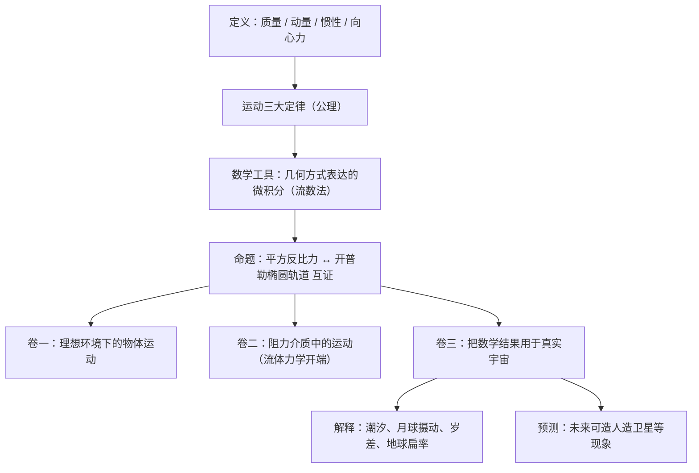

## 《自然哲学的数学原理》读书笔记 
  
### 作者  
digoal  
  
### 日期  
2026-06-23  
  
### 标签  
读书笔记 , 自然哲学的数学原理  
  
----  
  
## 背景 
  
  

---
书名: 《自然哲学的数学原理》  
作者: 艾萨克·牛顿  
译者: 赵振江  
出版社: 商务印书馆  
出版年份: 2006-7  
原作名: Philosophiae Naturalis Principia Mathematica  
丛书: 汉译世界学术名著丛书·哲学  
笔记日期: 2026-06-23  
豆瓣评分: 评价人数不足（该商务印书馆版本）  
标签: [物理学, 科学史, 经典力学, 哲学, 西方学术经典]  
---

  

> **一句话**：牛顿用几何与公理化的方式证明，天上行星的运动和地上苹果的下落，遵从同一条定律。  
> **适合谁读**：对科学史、科学方法论感兴趣的人，想知道"经典力学到底是怎么来的"而不只是会背公式的人。  
> **阅读难度**：⭐⭐⭐⭐⭐（5星，几何证明繁复，非专业读者建议配合导读本）  
> **推荐指数**：⭐⭐⭐⭐☆（作为案头收藏与思想史地标，价值远超作为"教材"被通读一遍）  
  
---

## 一、时代坐标：这本书从哪里来？

1687年，44岁的牛顿出版了这部书。在此之前，欧洲的"自然哲学"还停留在一种分裂状态：地上的运动归亚里士多德物理学管，天上的运动归托勒密或哥白尼的天文学管，两者各说各话。伽利略证明了地球上的物体如何落地，开普勒算出了行星绕日的椭圆轨道，但没有人能说清楚——为什么是这样，是什么"力"在起作用。

直接的引线是一场1684年的争论。哈雷、雷恩与胡克在一次聚会上讨论：如果引力与距离的平方成反比，行星轨迹会是什么形状？胡克声称自己能证明是椭圆，却迟迟拿不出证明。同年8月，哈雷专程跑去剑桥问牛顿同样的问题，牛顿随口答道"是椭圆"，还说"我算过"。哈雷大喜，请他把证明寄来——这就是后来扩展成三卷本巨著的起点。这段轶事也说明了一个常被忽略的事实：牛顿并不是孤立地凭空"想出"了万有引力，雷恩、哈雷、胡克都已经在平方反比定律的边缘徘徊，牛顿的不可替代之处在于，他是唯一一个真正把证明做完、把整个体系搭起来的人。

牛顿自己后来在《原理》各版本中也承认了胡克、雷恩、哈雷在平方反比关系上的先期工作，但他同时强调，这些人给他的只是一个问题的提示，而不是答案本身。这场优先权纠纷的余音，一直延续到牛顿晚年——他利用皇家学会会长的身份，某种程度上压制了对胡克贡献的承认，使得胡克的名字在后来很长时间里被科学史"消音"。这其实是理解这本书的一把钥匙：它不是一个孤独天才凌空出世的产物，而是一个时代积累的临界点，被一个极度专注、极度自负、也极度记仇的人，用三年时间一次性引爆。

---

## 二、核心命题：作者在说什么？

### 命题一：宇宙只有一套力学规则，天地同律

在牛顿之前，"天上的物理"和"地上的物理"是两个世界。牛顿的核心断言是：苹果落地的力，和让月亮绕地球转、让地球绕太阳转的力，是同一种力——万有引力，且严格按距离平方反比衰减。这在今天听起来是常识，但在1687年是一次彻底的世界观颠覆：它第一次把整个可见宇宙纳入了同一个数学方程。

### 命题二：力学可以像几何学一样"证明"

牛顿没有用"观察+猜想"的随意方式写这本书，而是模仿欧几里得《几何原本》的公理化结构：先给出定义（质量、动量、惯性、向心力……），再给出几条不证自明的"运动的公理或定律"（也就是著名的牛顿三大定律），然后像证明几何定理一样，一步步推导出关于行星轨道、潮汐、彗星、地球形状的全部结论。这本质上是一种方法论宣言：自然规律不是靠雄辩或哲学思辨"想出来"的，而是从少数几条公理严格推导出来的。

### 命题三："我不构造假说"——拒绝为现象编故事

牛顿用数学精确描述了引力如何作用，却拒绝回答"引力的本质是什么、它为什么能超距发生作用"。在第三版加入的《总释》里，他留下了那句流传至今的态度声明——大意是：凡不能从现象中导出的东西，都只是假设，而假设在严密的自然哲学里没有位置。这是一种克制：牛顿明明知道"超距作用"在哲学上说不通（连他自己都觉得不舒服），但他选择"先把现象说对，再把原因留给后人"，而不是用一套漂亮却无法验证的形而上学去填补空白。

---

## 三、论证地图：作者怎么说服你的？

牛顿的论证路径，本质上是一条"从公理到宇宙"的单向推导链：



几个值得注意的论证特征：

- **几何证明，而非现代代数符号**：牛顿手里其实握着微积分（他称之为"流数法"），但整本书几乎全部用古典几何加极限的方式表达。这既是当时数学共同体更能接受几何证明的策略性选择，也让这本书在今天读起来异常艰涩——你需要先在脑子里画图，才能跟上他的逻辑。
- **理论与观测反复对照**：在讨论具体问题（比如月球运动）时，牛顿总是把理论推出的数值和实际天文观测数据放在一起核对，这种"理论—观测"的来回校验，正是后来整个实证科学的标准动作。
- **论证的代价**：这种极致的几何化、公式化写法，让《原理》成了一本极难读、却极难被反驳的书——牛顿几乎把所有的论证细节都摆在台面上，但也因此把绝大多数读者挡在了门外。

---

## 四、前提假设与边界：什么情况下这不成立？

读《原理》不能只当它是"对的物理书"，还要看清它依赖的几个隐含假设：

1. **绝对空间与绝对时间存在**。牛顿假设宇宙中有一个不依赖任何物体、独立存在的"绝对空间"作为运动的参照背景，时间也均匀流逝、与一切观察者无关。这个假设支撑了他整套力学体系，却在两百多年后被马赫质疑、被爱因斯坦的相对论正式推翻——空间和时间其实是相对的，会随观察者和引力场弯曲。
2. **引力是瞬时的超距作用**。在牛顿体系里，两个物体无论相距多远，引力都"瞬间"互相影响，中间不需要任何媒介或时间延迟。这正是莱布尼茨当年嘲笑的地方：他觉得这种"隔空起作用"在哲学上说不通，就像宇宙需要一个上帝不断介入、给钟表上弦一样。后来爱因斯坦的广义相对论用"引力是时空弯曲"的方式，给出了一个不需要超距作用的解释——某种意义上，是替牛顿完成了他自己拒绝去做的那件事（说明引力的"原因"）。
3. **宏观、低速、弱引力场的适用边界**。牛顿力学在地球尺度、行星尺度的常规速度下精度惊人，但在接近光速、强引力场（比如黑洞附近）、极微观尺度（量子领域）时会失效，需要相对论和量子力学接管。理解这一点，才能正确地把《原理》安放在科学史中：它不是"错了"，而是"在它的适用域里近乎完美，但那个域是有边界的"。

---

## 五、思想谱系：这本书在哪个传统里？

牛顿站在两条传统的交汇点上。一条是经验主义/归纳主义传统：从现象出发，用观测和实验去检验，拒绝从形而上学第一原理出发"推演"自然——这与笛卡尔、莱布尼茨为代表的欧陆理性主义传统形成鲜明对照。另一条是公理化的演绎传统，直接师法欧几里得：从最少的定义和公理出发，严密推导出尽可能多的结论。

这两条传统在牛顿身上奇妙地结合成了一种"经验内容+演绎形式"的写法：用几何证明的严密外壳，包裹住完全靠观测校验的物理内容。这套组合直接塑造了之后三百年自然科学的"标准动作"——先描述清楚"是什么"，再去追问"为什么"，而不是反过来先思辨出一套"为什么"再硬套到现象上去。

它的影响远远超出了物理学本身。美国新行为主义心理学的代表人物赫尔，曾把这本书当作案头之宝，并模仿物理学的演绎逻辑体系来构建现代科学心理学的理论框架——这是一个很有意思的旁证：牛顿真正留给后世的，不只是几条物理定律，更是一种"任何一门学科要想称为'科学'，就该长成《原理》这个样子"的范式压力。

```
笛卡尔/莱布尼茨（理性主义、机械哲学）
        ╲
         ╲——分道——
        ╱
开普勒/伽利略（经验观测）── 牛顿《原理》── 后续300年自然科学范式
        ╱                         ╲
欧几里得《几何原本》（公理化演绎）   爱因斯坦相对论（修正绝对空间/时间假设）
```

---

## 六、我学到了什么？

第一个收获，是重新理解了"科学方法"这四个字到底意味着什么。我们今天说"大胆假设、小心求证"，听起来理所当然，但《原理》提醒我：在牛顿之前，"求证"这一步根本没有被严肃对待过，大多数自然哲学家更热衷于先想出一套"为什么"，再去凑现象。牛顿用一整本书证明了反过来做才是对的——先把"是什么"用数学钉死，再老老实实承认"为什么我还不知道"。这种诚实，比任何漂亮的形而上学解释都更有力量。

第二个收获，是看清了"伟大发现"背后那条不那么光彩的真实路径。哈雷、雷恩、胡克都已经摸到了平方反比定律的门槛，牛顿之所以能赢得这场比赛，靠的不是更聪明的灵感，而是更彻底的执行力——他一个人把别人停在猜想阶段的东西，做成了一套自洽的、可推导一切的体系。这对我自己做事的启发是：很多时候竞争的关键不在于"想到没想到"，而在于"做到了什么程度"。

第三个收获，是对"我不构造假说"这种克制态度的重新评价。牛顿完全可以像笛卡尔那样，编一套"以太漩涡"之类听起来很自洽的解释来填补引力机制的空白，但他选择留白，把问题诚实地交给后人。两百多年后爱因斯坦的相对论填上了这个空白，某种意义上完成了牛顿自己拒绝做的事。这让我意识到：承认"我不知道"，本身也可以是一种科学贡献，而不是一种缺陷。

---

## 七、举一反三：这个框架还能用在哪？

牛顿留下的不只是物理定律，更是一套可迁移的方法论："先定义清楚最基本的概念，再列出最少的公理，然后严格推导，最后拿真实数据去校验。"这套打法在很多领域都能用：

1. **产品或商业分析**：先给"用户""价值""增长"下精确定义，再设定几条不证自明的假设（比如"用户会选择最省时间的方案"），由此推导出具体策略，最后用数据反复校验，而不是先讲一个动听的商业故事再去找数据佐证它。
2. **写作或论证训练**：写一篇说理文章前，先把核心概念定义清楚、列出最少的前提假设，再一步步推导结论——这能极大减少"自己也没想清楚就开始下结论"的问题。
3. **个人决策**：在做重大决定前，先诚实区分"我确切知道的事实"和"我在编的合理化解释"，像牛顿对待引力机制一样，承认自己暂时解释不了的部分，而不是急着用一套自圆其说的理由把决定包装得很完美。

---

## 八、批判与反思

最值得警惕的一点，是牛顿体系本身那种"看起来天衣无缝"的说服力，恰恰是它最大的认知陷阱。绝对空间、绝对时间这两个隐含假设，在牛顿的体系内部完全自洽、毫无破绽，以至于两百年里几乎没有人真正去质疑它们——直到马赫和爱因斯坦从外部撬开了这个体系。这提醒我：一个理论的内部自洽性，从来不等于它的前提就是对的；真正危险的假设，往往不是那些被反复争论的假设，而是那些"显然成立、没人去问"的假设。

另一处值得反思的，是牛顿对"超距作用"的处理方式。他用"我不构造假说"回避了莱布尼茨的哲学诘问，这在科学策略上是高明的（先把现象说对，再谈机制），但也开了一个口子：后来很多学科都学会了用"我们只描述规律、不解释机制"来回避一些本该深究的问题，这种态度用得好是科学的谦逊，用滥了就成了逃避追问的挡箭牌。

最后，从科学共同体的角度看，牛顿和胡克、莱布尼茨之间的优先权纠纷，也提醒我们：科学史叙述常常是由胜利者书写的。胡克在万有引力问题上的早期贡献，因为牛顿掌握皇家学会的话语权，在很长时间里被有意无意地淡化。读《原理》时，记得这本书的"完美"和它背后那场并不完美的人事纠葛，是同时存在的。

---

## 九、金句与记忆点

1. **"我不构造假说"（Hypotheses non fingo）**——牛顿在《总释》里的态度声明，意思是：凡不能从现象中直接导出的东西，都只是假设，在严密的自然哲学里没有位置。这是科学方法论史上最重要的一句"克制宣言"。
2. **"由运动现象去研究自然力，再由这些力去推演其他运动现象"**——据多个版本概括，这八个字基本就是整本书的方法论骨架：从可观察的现象出发，反推出背后的力，再用这个力去预测新的现象。
3. **天地同律**——苹果落地的力和月亮绕地的力是同一种力，这个判断本身就是《原理》对人类宇宙观最大的一次"降维统一"。
4. **公理化写作范式**——模仿欧几里得《几何原本》，从定义和公理出发严密推导，这套范式后来被心理学、经济学等多个学科借用和模仿。
5. **"凡不能从现象导出的，被称为假设，而假设在实验哲学中是没有地位的"**——这句话也常被概括为牛顿对形而上学辩论的正式答复，他选择用方法论规则而不是哲学辩论来回应批评者。
6. **绝对空间是"上帝感知物体的器官"**——这是牛顿一个颇具神学色彩的说法，也是莱布尼茨嘲笑他的把柄之一，提醒我们牛顿的世界观里，科学和神学从未真正分开。

---

## 十、延伸阅读

1. **《关于两门新科学的对话》（伽利略）**——理解《原理》之前"地上物理学"已经走到了哪一步，伽利略是牛顿真正站在肩膀上的人之一。
2. **《时间简史》（霍金）**——如果想知道牛顿留下的"绝对空间/时间"假设后来是怎么被相对论修正的，这是最通俗的入口。
3. **《科学革命的结构》（库恩）**——把《原理》放进"范式转移"的框架里理解，会明白牛顿力学为什么能统治科学界三百年，又为什么终究会被超越。
4. **《自然哲学之数学原理》学生版（北京大学出版社·科学元典丛书）**——如果商务印书馆全译本的几何证明部分读起来太吃力，这个学生版有大量阅读指导和背景介绍，适合先打底再回头啃原文。
5. **《科学研究纲领方法论》（拉卡托斯）**——书中对牛顿经验主义/归纳主义方法论的统治地位有详尽阐述，适合想深入理解《原理》方法论遗产的读者。

---

*笔记写于 2026-06-23 | 基于公开资料与深度思考整理*
  
  
#### [PostgreSQL 解决方案集合](../201706/20170601_02.md "40cff096e9ed7122c512b35d8561d9c8")
  
  
#### [德哥 / digoal's Github - 公益是一辈子的事.](https://github.com/digoal/blog/blob/master/README.md "22709685feb7cab07d30f30387f0a9ae")
  
  
#### [About 德哥](https://github.com/digoal/blog/blob/master/me/readme.md "a37735981e7704886ffd590565582dd0")
  
  

  
