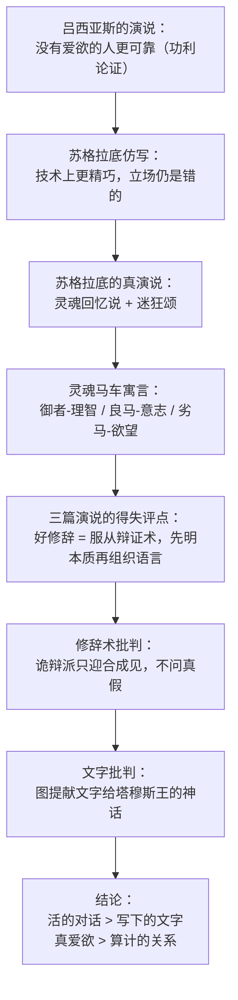

## 《斐德若篇》读书笔记 
  
### 作者  
digoal  
  
### 日期  
2026-06-23  
  
### 标签  
读书笔记 , 斐德若篇  
  
----  
  
## 背景 
  
  

---
书名: 《斐德若篇》  
作者: [古希腊] 柏拉图  
译者: 朱光潜  
出版社: 商务印书馆  
出版年份: 2018-11  
丛书: 汉译世界学术名著丛书·哲学  
ISBN: 9787100164016  
笔记日期: 2026-06-23  
豆瓣链接: https://book.douban.com/subject/30279077/  
标签: [古希腊哲学, 柏拉图, 修辞术, 爱欲, 灵魂, 写作与口传]  
---

  

> **一句话**：一篇表面在谈"该不该爱"的对话，实际上是柏拉图借爱欲之名，重新审判了语言、修辞与文字这件人类最日常的事。  
> **适合谁读**：对"说服术"心存警惕的人、写作者、以及任何曾经怀疑过"刷手机会不会让记忆力变差"的现代人。  
> **阅读难度**：⭐⭐⭐☆☆（1-5星）  
> **推荐指数**：⭐⭐⭐⭐☆  
  
---

## 一、时代坐标：这本书从哪里来？

公元前4世纪的雅典，城邦政治高度依赖"说话的能力"。法庭辩论、公民大会演讲、悼词、求爱信——一个人若想在公共生活中立足，几乎离不开修辞术。当时活跃着一批以"教人说话"为业的智者（Sophists），其中吕西亚斯是"阿提卡十大演说家"之一，以文风精巧著称。学界普遍认为《斐德若篇》属于柏拉图的中期对话，写作年代大致与《会饮篇》《理想国》相近，有豆瓣书评者推测它写于《理想国》之后约十年、柏拉图密友狄翁去世前后，认为情感基调的转变（从《理想国》里贬斥"迷狂"为灵魂的非正义，到本篇歌颂因爱而生的神圣迷狂）或许与这段私人经历有关——这只是一种读法，并非定论。

柏拉图要解决的问题很具体：修辞术教人"怎么说"，却从不问"说的内容是否为真"。在《高尔吉亚篇》里他已经痛斥过这种修辞家，《斐德若篇》则进一步追问——真正好的言说应该是什么样子？这个问题最终被他从"怎么说话"一路推向"什么是爱""灵魂是什么""文字能不能传递真理"这几个看似不相关、实则同构的领域。

对话的场景本身就是一处精心设计的隐喻：苏格拉底极少出城，这次却被斐德若引诱到伊利索斯河边的树荫下，原因仅仅是后者手里有一篇刚听来的演说文章。一个以"对话"为生命方式的人，被一篇"写下来的文字"勾出了雅典城——这个开场已经悄悄埋下了全篇的核心张力：口头言说 vs. 书面文字。

---

## 二、核心命题：作者在说什么？

整篇对话分前后两半，表面主题不同，骨子里是同一件事：**真正有价值的东西，必须诉诸活的、能够自我辩护的"逻各斯"（logos），而不能止步于固定、讨好、可复制的"成品"**。

### 命题一：有爱欲的人，反而更值得托付

斐德若带来的吕西亚斯演说主张"应该接受没有爱情的追求者"，理由很功利：有爱欲的人善变、占有欲强、容易因爱生妒、爱情消退后什么都不剩；没有爱欲的人则理智、平稳、靠得住。苏格拉底先即兴仿写了一篇风格更高级但立场相同的文章，证明自己"技术上能赢吕西亚斯"，随后却推翻自己，说这种论调本身就是错的——因为它把爱情简化成了纯粹的利害算计。

苏格拉底真正的回答，是那篇著名的"灵魂颂"：人类灵魂本是天上的精灵，跟随诸神巡游诸天，瞥见过"美""善""正义"本身（理念）；坠入肉身之后，这份记忆被遗忘，唯有在尘世遇见极美的事物（尤其是美少年的容貌）时，灵魂才会突然"想起"曾经见过的至美，于是浑身战栗、生发羽翼、痛苦而狂喜——这就是爱欲（eros）的真相。苏格拉底把这种由神灵引发、让人"越出常规"的状态称为"迷狂"，并指出迷狂共有四种：预言的、教仪的、诗歌的、爱情的，分别由不同神祇主宰，而爱情的迷狂是其中最高的一种，因为它直接指向对"美"本身的回忆与追求。

### 命题二：灵魂是一驾马车，爱欲考验的是谁在驾车

为了说明"迷狂"为何不是堕落而是上升，柏拉图给出了西方哲学史上最著名的比喻之一：灵魂是一辆双马战车，御者是理智，两匹马分别是向善的良马（意志/血气）与趋恶的劣马（欲望）。神的灵魂里三者和谐如一，人的灵魂则永远存在内部拉扯——遇到所爱之人的美貌时，劣马想立刻冲上去满足欲望，良马和御者却努力克制，引导这份激情转向对"美"本身、对智慧的追求。爱欲不是要被压抑的杂念，而是灵魂认识真理过程中必经的"阵痛"。

### 命题三：好的修辞术必须从属于辩证术，文字必须从属于活的言说

借着评点三篇演说的优劣，对话的后半段转向修辞术本身：诡辩派的"修辞"只迎合听众已有的成见，堆砌辞藻而不追问事实，所以条理混乱、结构杂乱；真正的修辞术则必须先弄清楚论题的本质（什么是爱？什么是正义？），再依照事物本身的逻辑组织语言——这正是辩证术的工作。修辞如果脱离了对真理的把握，就只是一种"巧言令色"的技艺，谁掌握了技巧，谁就能让坐听众相信任何事，无论真假。

紧接着，苏格拉底讲了一个埃及神话来收尾：图提神发明了文字，献给国王塔穆斯，国王却拒绝接受，理由是文字会让人变得健忘——人们会依赖外部符号，而不再把知识真正内化进灵魂；文字看似是"记忆的良药"，实际上制造的是"遗忘的毒药"。写下来的文字还有一个致命缺陷：它无法像活人一样针对不同提问做出不同回应，无论你怎么追问，文字永远只会重复同样的话；唯有种在听者灵魂里、随时能够自我辩护、自我生长的"活的言说"，才称得上真正的知识。

---

## 三、论证地图：作者怎么说服你的？



整篇对话最巧妙的地方在于，**论证形式本身就是论证内容的演练**：苏格拉底用一场活生生的、随时根据斐德若的反应调整方向的对话，去反驳"写定的文字"——他不是在用论文反对论文，而是用行动反对论文。这种"以体证道"的写法，是柏拉图式论证最有说服力、也最容易被忽略的部分。

需要诚实指出的论证薄弱处：灵魂回忆说、灵魂马车寓言本质上都是神话叙事，而非严格推论——苏格拉底自己也承认这是"近乎诗"的讲法。柏拉图用神话去填补理性论证暂时无法抵达的地方（灵魂的本质、不朽的根据），这是一种常见但需要警觉的论证策略：神话感染力强，却很难被证伪或检验。

---

## 四、前提假设与边界：什么情况下这不成立？

**假设一：灵魂先验地见过"理念"，知识是回忆。** 这是柏拉图整个认识论的地基，但它本身无法被经验验证，更像是一种用来解释"人为何能认出抽象的美与善"的哲学设定。如果你不接受"理念论"这个前提，灵魂马车、迷狂、回忆说这一整套论证就会失去立足点。

**假设二：口头对话天然优于书面文字。** 这个论断放在没有录音、没有可检索文本、知识主要靠师徒口传的古希腊是成立的——活人确实能比一段死文字更灵活地回应质疑。但放到今天，这个前提已经部分失效：写作可以反复修改打磨到比即时对话更精确；学术共同体正是靠可检验、可引用的书面文字才积累起跨越千年的知识体系。柏拉图自己最大的讽刺在于——这个"贬低文字"的论证，恰恰是用文字写下来、流传了两千四百年的。德里达后来正是抓住这个矛盾，指出"pharmakon"（药）这个希腊词本身兼有"毒药"与"治疗"两义，柏拉图在贬低文字的同时，其实也无法否认文字具有治疗记忆、保存思想的功能——文字的危险与文字的价值是同一枚硬币的两面。

**假设三：好修辞必须等同于对真理的把握。** 这个标准很高尚，却也带来一个边界问题：在现实世界里，很多需要立刻决策的场合（法庭、谈判、公共传播）根本等不及把"事物本质"研究透彻。柏拉图式的修辞理想，更适合作为一种长期的认知训练，而非应急的沟通工具。

---

## 五、思想谱系：这本书在哪个传统里？

```
苏格拉底的"产婆术"对话
        ↓
柏拉图《斐德若篇》：理念论 + 灵魂三分说 + 文字批判
        ↓                              ↓
亚里士多德《修辞学》              新柏拉图主义（普罗提诺）
（把修辞重新系统化为一门学科）      灵魂上升说被神秘化、宗教化
        ↓                              ↓
中世纪/近代修辞学教育            奥古斯丁等基督教思想吸收
        ↓
20世纪：德里达《柏拉图的药》
重新解读"文字-记忆"的二元对立，
质疑整个西方"重言轻文"的逻各斯中心主义传统
```

往前看，它继承的是苏格拉底"边问边想"的方法，并把这种方法本身提炼成一套关于"何为真知识"的理论。往后看，它的影响极为绵长：灵魂马车的比喻塑造了西方对"理性-意志-欲望"三分人格结构的基本想象；"迷狂优于冷静算计"的论证启发了后来的新柏拉图主义、文艺复兴的爱欲哲学，乃至浪漫主义对灵感的崇拜；而文字批判这一段，二十世纪被法国哲学家德里达重新激活——他在《柏拉图的药》一文中指出，整个西方哲学传统习惯性地把"言说"摆在"文字"之上、把"在场"摆在"缺席"之上，而《斐德若篇》正是这一传统最早、最清晰的范本。德里达没有简单地反驳柏拉图，而是指出柏拉图自己的文本里已经暗藏着瓦解这种等级秩序的种子。

---

## 六、我学到了什么？

第一，**爱欲被严肃地当作认识论问题来讨论，这件事本身就很震撼**。我们今天谈恋爱，常常默认这是私人感受、与"求知"无关；柏拉图却把"被一个人的美深深震动"当成灵魂触碰真理的入口。读完之后我更愿意相信：那些让人愿意为之付出、甚至痴狂的强烈情感体验，未必是理性的敌人，它也可能是认知突破的契机——前提是这份激情最终被导向更高的追求，而不是停留在占有欲本身。

第二，**好的说服力，不应该是"让人相信"，而应该是"帮人看清"**。这本书让我重新审视自己写东西、做汇报时的习惯——我有没有先搞清楚问题的本质，还是直接跳到"怎么让对方点头"？柏拉图的标准很苛刻：修辞术如果脱离了对事物本质的把握，再精巧也只是"信口雌黄"的同义词。

第三，**文字批判这段，意外地照进了我自己的生活**。把"文字"换成"搜索引擎""笔记软件""AI助手"，柏拉图那句"会让人善忘"的担忧几乎原封不动地适用——我们越来越习惯把记忆和思考外包给工具，遇到问题第一反应是"去查"而不是"去想"。柏拉图当然不可能想到两千多年后的今天，但他提出的这个张力——外部记忆工具到底是"治疗"还是"毒药"——直到今天仍未有答案，而且只会越来越紧迫。

---

## 七、举一反三：这个框架还能用在哪？

**场景一：评估任何"说服性内容"。** 不管是广告文案、自媒体爆款标题还是政治演讲，都可以套用本书的标准来检验：它有没有先弄清楚事情的本质，还是只在迎合听众已有的成见？柏拉图式的提问——"这段话让我相信了什么，又是靠什么手段让我相信的？"——是抵抗信息时代操纵话术的一把朴素却好用的尺子。

**场景二：审视自己与"外部记忆工具"的关系。** 笔记软件、收藏夹、AI对话记录正在替代我们大脑里原本该留存的东西。可以借用书中"药"的双重性来做一次自查：哪些工具是在真正帮我巩固理解（治疗），哪些只是让我产生"反正存下来了"的幻觉、实际上从未真正消化（毒药）？

**场景三：理解强烈情感与理性决策之间的张力。** 灵魂马车的比喻（理智、意志、欲望三者互相拉扯而非互相取消）比单纯的"压抑欲望"或"放纵欲望"都更贴近真实的人性体验，可以用作理解自己情绪冲突时的一个思维模型——目标不是消灭某一匹马，而是让御者真正握紧缰绳，把激情引向值得追求的方向。

---

## 八、批判与反思

我不完全同意柏拉图对文字的贬低，哪怕考虑到他所处的口传文化背景。把"容易被复制、传播"当作文字的缺陷，恰恰忽略了知识的可积累性——没有文字，柏拉图本人的思想也不可能跨越两千四百年抵达我此刻的电脑屏幕。这也是这本书最大的自我矛盾：它用写定的文字，论证写定的文字不可靠。

另外，本篇对"美少年"之爱的讨论建立在古希腊特有的"成年男子—美少年"师承式同性恋爱（pederasty）的社会习俗之上，这套关于"爱人/被爱者"的角色设定在今天的伦理框架下需要被谨慎地historicize（历史化处理），不能直接搬到现代两性或恋爱关系中作为规范性指导。柏拉图关心的核心其实是"爱欲能否引向对美与善的追求"这一更抽象的命题，这一层可以剥离出来单独继承，而具体的社会习俗背景则需要留在它所属的时代里。

最后，灵魂不朽与灵魂回忆说目前缺乏可验证性，更适合被当作一套"思想实验式"的隐喻系统去理解人对美与意义的强烈反应，而不必当作字面意义上的形而上学事实去接受。

---

## 九、金句与记忆点

1. **"知识是灵魂的回忆。"** —— 柏拉图认识论的核心命题：人能认出抽象的美与善，是因为灵魂曾在理念世界里见过它们的本相。

2. **"灵魂是一辆双马战车，理智是御者。"** —— 人格结构最早的西方隐喻之一，理性、意志、欲望三者永远在角力，而非某一方天然胜出。

3. **"凡人叫他做凭翼而飞的爱若斯；但神们叫他做羽客。"** —— 同一份激情，在凡人眼中是冲动，在更高视角看却是灵魂生发羽翼、试图飞回天界的征兆。

4. **"这帖药不能治好所有的病。"**（234C）—— 苏格拉底用来类比修辞术的局限：任何一种言说技巧都不能放之四海而皆准，要因人因事而异，而判断"因人而异"的能力，恰恰来自对事物本质的把握。

5. **"文字会使人善忘。"** —— 图提神献文字给塔穆斯王的神话，被德里达重新解读为西方哲学"重言轻文"传统的源头。

6. **"一个人若不知道真理，就只能玩弄影像的游戏。"**（大意）—— 这是对所有"只讲技巧、不问内容"的修辞家最直接的判词，至今适用于任何"流量优先于真实"的传播现场。

7. **"朋友之中一切都应该是共同的。"** —— 全篇结尾苏格拉底为斐德若所做的祈祷，呼应了开篇那句温柔的问候"亲爱的斐德若，你从哪里来？向哪里去？"，让一篇高度抽象的哲学论辩，最终落回到两个人之间真实的情谊。

---

## 十、延伸阅读

1. **《会饮篇》（柏拉图）** —— 与《斐德若篇》互为姊妹篇，同样以"爱欲"为主题，但通过多人轮番发言的方式展开，可与本篇对照阅读，看柏拉图如何在不同对话里反复打磨同一个问题。

2. **《理想国》（柏拉图）** —— 想理解灵魂三分说（理智/意志/欲望）的完整理论版本，《理想国》第四卷有更系统的论述，可与本篇的"灵魂马车"隐喻互相印证。

3. **《柏拉图的药》（雅克·德里达）** —— 二十世纪对《斐德若篇》文字批判段落最重要的重读文本，是理解"解构主义"如何具体操作的绝佳入口。

4. **《柏拉图文艺对话集》（朱光潜 译）** —— 同一位译者编选的合集，收录了《斐德若篇》《会饮篇》《理想国》节选等多篇与文艺、美学相关的对话，适合系统了解柏拉图的美学思想脉络。

5. **《理想国篇》之外的修辞学经典——亚里士多德《修辞学》** —— 如果想看"修辞术"这个学科后来如何被系统化、去神秘化为一门技艺，可以对照亚里士多德更务实的处理方式。

---

*笔记写于 2026-06-23 | 基于公开资料与深度思考整理*
  
  
#### [PostgreSQL 解决方案集合](../201706/20170601_02.md "40cff096e9ed7122c512b35d8561d9c8")
  
  
#### [德哥 / digoal's Github - 公益是一辈子的事.](https://github.com/digoal/blog/blob/master/README.md "22709685feb7cab07d30f30387f0a9ae")
  
  
#### [About 德哥](https://github.com/digoal/blog/blob/master/me/readme.md "a37735981e7704886ffd590565582dd0")
  
  

  
