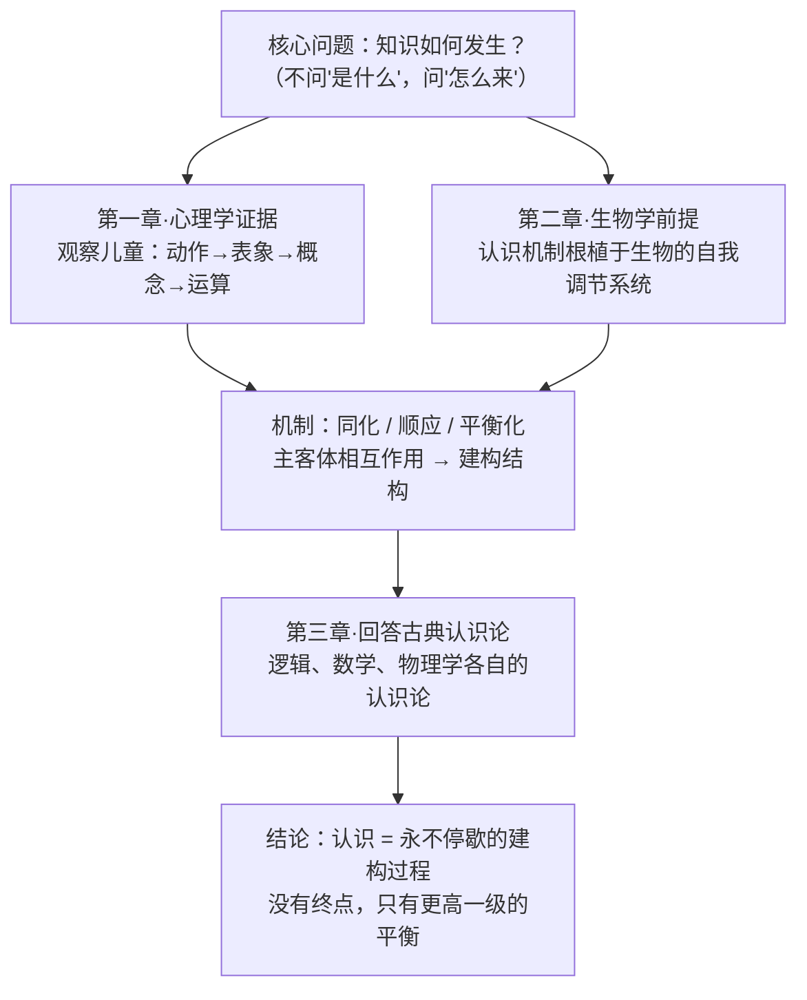

## 《发生认识论原理》读书笔记 
  
### 作者  
digoal  
  
### 日期  
2026-06-23  
  
### 标签  
读书笔记 , 发生认识论原理  
  
----  
  
## 背景 
  
  

---
书名: 《发生认识论原理》  
作者: [瑞士] 让·皮亚杰（Jean Piaget）  
译者: 王宪钿 等译 / 胡世襄 等校  
出版社: 商务印书馆（汉译世界学术名著丛书·哲学）  
出版年份: 1981（原著 1970）  
笔记日期: 2026-06-23  
ISBN: 9787100008464  
标签: [认识论, 发展心理学, 建构主义, 认知科学, 哲学]  
来源: 网络搜索（豆瓣信息 + 多方书评/学术述评整理）  
---
  
> **核心一句话**：知识不是被"发现"的，也不是被"灌输"的，而是儿童（以及全人类）在与世界反复打交道的动作中，一砖一瓦"建构"出来的。  
> **适合谁读**：对"人是怎么知道的"这个问题感兴趣的人——教育者、心理学/哲学爱好者、做认知科学或 AI 的工程师。  
> **阅读难度**：⭐⭐⭐⭐☆（124 页，但密度极高，术语自成体系，需慢读）  
> **推荐指数**：⭐⭐⭐⭐☆  
  
---

## 一、时代坐标：这本书从哪里来？

20 世纪上半叶，认识论（研究"知识如何可能"的哲学分支）基本是哲学家在扶手椅上的思辨——从笛卡尔的"天赋观念"到经验主义的"白板说"，争论了几百年，谁也说服不了谁。问题出在哪？皮亚杰认为：**所有这些理论都只盯着成年人成熟后的知识状态，去问"知识是什么"，却从没去看知识是怎么一步步长出来的。**

让·皮亚杰（1896—1980）是个"百科全书式"的瑞士学者，横跨生物学、逻辑学、数学、心理学、哲学。他 15 岁就发表软体动物论文，1918 年拿生物学博士，却一辈子想用生物学的眼光回答一个哲学问题：知识的源头在哪里。他从 1921 年起研究儿童心理学，但目的从来不是"研究小孩"——**儿童只是他的实验室**，是用来观察"知识从无到有"这一过程的活体标本。

这本书是 1970 年他在哥伦比亚大学四次讲座的结晶，可以看作他庞大体系（含三卷本《发生认识论导论》）的浓缩纲领。它要解决的核心问题只有一个：**与其争论知识是什么，不如去研究知识是怎么发生的。** 这就是"发生（genetic，指起源/发生学）认识论"的名字由来。

```
传统认识论：          只看终点 → 知识"是"什么？（静态、思辨）
                          ┌────────────┐
                          │  成人的知识 │  ← 哲学家从这里开始争
                          └────────────┘
皮亚杰的转向：     回看全程 → 知识"如何"发生？（动态、实证）
   婴儿动作 → 表象 → 概念 → 逻辑运算 → 科学思维
   └──────────── 用儿童发展回答哲学问题 ────────────┘
```

---

## 二、核心命题：作者在说什么？

### 观点一：认识是"建构"出来的，不是抄来的，也不是天生的

这是全书的灵魂，也是皮亚杰对哲学两千年老问题的"第三种答案"。

- **经验主义**说：知识来自外部世界，心灵像白板，被经验写满（知识是"抄"客体）。
- **先验论/天赋论**说：知识的基本结构是天生的，经验只是把它唤醒（知识是"内"在的）。
- **皮亚杰说：都不对。** 知识既不在客体那边，也不在主体这边，而产生于**主体与客体的相互作用**之中。儿童通过对物体施加动作（抓、摇、扔、排列、组合），并协调这些动作，才逐渐建构出关于世界、也关于自己思维的知识。

关键词是**建构（construction）**：结构不是预先存在等待发现的，而是在活动中一层层造出来的，从简单结构过渡到复杂结构，每一级都是上一级建构的产物。

### 观点二：四把"钥匙"——图式、同化、顺应、平衡化

皮亚杰用四个概念解释"建构"在内部如何运作，这套机制直接借自生物学（生物如何适应环境）：

- **图式（schema）**：主体已有的动作或思维的结构模板，是认识世界的"框架"。婴儿的"抓握"是图式，成人的"乘法"也是图式。
- **同化（assimilation）**：把新事物纳入已有图式。比如孩子第一次见到斑马，用已有的"马"图式去理解它——"一匹有条纹的马"。
- **顺应（accommodation）**：当已有图式塞不下新事物时，改造图式本身。孩子最终意识到斑马不是马，于是新建一个"斑马"图式。
- **平衡化（equilibration）**：同化与顺应之间的动态平衡，是发展的真正发动机。认知失衡（"咦，不对劲"）驱使主体调整，达到更高一级的平衡——然后又被新的失衡打破，螺旋上升。

> 这四个概念不是孤立的标签，而是一台不断自我升级的机器：**失衡 → 同化+顺应 → 新平衡 → 再失衡**。

### 观点三：认知发展有四个普遍阶段

皮亚杰把从婴儿到青少年的认知发展，按"运算能力"划成四个前后相连、不可跳跃的阶段。每个阶段的思维结构有质的不同：

| 阶段 | 大致年龄 | 核心特征 |
|---|---|---|
| 感知运动阶段 | 0–2 岁 | 靠动作和感觉认识世界；后期获得"客体永久性"（东西看不见≠消失） |
| 前运算阶段 | 2–7 岁 | 开始用语言、符号、表象思维；但自我中心，无法守恒 |
| 具体运算阶段 | 7–11 岁 | 能对具体事物做逻辑运算；掌握"守恒"（水换个杯子量没变） |
| 形式运算阶段 | 11 岁以后 | 能做抽象、假设—演绎推理；可处理"如果……那么……" |

重点不在年龄数字，而在一个深刻的洞见：**逻辑和数学，在儿童身上首先表现为外部动作（把积木排序、对应、归类），只有到很晚才"内化"为概念。** 也就是说，最抽象的数学，根源竟在最具体的身体动作里。

---

## 三、论证地图：作者怎么说服你的？

皮亚杰的论证不是靠思辨，而是靠**几十年日内瓦学派的儿童实验**（守恒实验、客体永久性实验等，可信度高）。全书结构（引言 + 三章）本身就是一条论证链：



**论证方式评价：**
- **优点**：用可重复的实验给哲学命题提供经验地基，这是真正的范式创新——把"扶手椅哲学"拉进了实验室。守恒实验等结论极其稳健，至今写在每本发展心理学教材里。
- **可疑处（中等可信度）**：从"儿童如何获得知识"跳跃到"全人类知识如何可能"，存在一个**个体发生 ≈ 系统发生**的类比假设。儿童的认知顺序，是否真能映射科学知识的逻辑结构？这个跨越是论证中最大的"信仰之跃"。

---

## 四、前提假设与边界：什么情况下这不成立？

皮亚杰的体系建立在几个隐含假设上，今天看，有的依然牢固，有的已被动摇：

1. **假设：认知发展有普遍、固定的阶段顺序，全人类一致。**
   → *部分动摇*。后续跨文化研究发现，阶段的出现时间、甚至是否普遍达到形式运算，受文化和教育影响很大。"普遍性"被打了折扣。

2. **假设：发展主要由个体与物理世界的相互作用驱动，是"个体"的事。**
   → *受到强力挑战*。这是维果茨基的主战场——他认为认知发展首先是**社会性**的，发生在人与人的互动和语言中，而非孤独的儿童与积木之间（详见第五节）。

3. **假设：发展是"学习"的前提（必须先到某个阶段，才能学某些东西）。**
   → *仍部分成立但被补充*。维果茨基反过来强调"教学应走在发展前面"（最近发展区），说明二者关系比皮亚杰设想的更双向。

**适用边界**：皮亚杰的框架最强在解释"个体如何独自从经验中建构逻辑数学结构"；最弱在解释"社会、语言、文化如何塑造认知"。它是一张精确但不完整的地图。

---

## 五、思想谱系：这本书在哪个传统里？

```
        康德（先验范畴：知识结构从哪来？）
                  │ 皮亚杰：范畴不是天生的，是"建构"出来的
                  ▼
   生物学（适应/自我调节）──┐
                          ├──► 皮亚杰·发生认识论（建构主义）
   结构主义（结构/运算）────┘
                  │
        ┌─────────┼──────────┐
        ▼         ▼          ▼
   认知科学    建构主义教育   维果茨基（社会文化派·对手兼互补）
   /发展心理学  （做中学）     强调社会、语言、最近发展区
```

- **向上**：皮亚杰是在回应**康德**——康德说认识的范畴（时间、空间、因果）是先验的，皮亚杰说不，它们是发生出来的、建构出来的。他把康德的静态先验论改造成了动态发生论。
- **横向**：他与同年出生的**维果茨基（1896）**构成了发展心理学的两大范式——皮亚杰是"自然科学范式"（个体、生物、普遍规律），维果茨基是"社会文化范式"（互动、语言、文化历史）。两人是终生未竟的对话。
- **向下**：他是**当代建构主义教育**的鼻祖（"以学生为中心""做中学""让孩子自己探索"），也深刻影响了认知科学，甚至今天 AI 领域关于"具身认知""从交互中学习"的讨论。

---

## 六、我学到了什么？

读这本书最大的震撼，是它把一个我从没认真想过的问题，变成了一个可以观察、可以实验的对象：**我是怎么"知道"的？** 我们太习惯把"知识"当成现成的东西去接收，却从没想过它在每个人脑子里都是被亲手造出来的。

三个核心收获：

① **"建构"取代了"传输"——这改变了我对学习的整个理解。**
以前我默认学习是"信息从老师流向学生"，像倒水进杯子。皮亚杰告诉我：杯子会自己改变形状，甚至会拒绝倒不进去的水。知识不是被接收的，是学习者用自己已有的结构主动加工、重组出来的。**这解释了为什么"讲清楚了"学生还是不会——因为他没有"建构"，只是听过。**

② **同化/顺应是个随手可用的思维工具。**
这套机制远不止用于儿童。我意识到我读任何新东西时都在同化（"哦这不就是 XX 嘛"）——这既高效又危险：同化太强会扭曲新信息去迁就旧框架。真正的成长发生在**顺应**那一刻——承认旧框架不够用，把它改掉。读一本好书的标志，就是它逼你顺应，而不只是让你同化。

③ **最难也最迷人的部分：抽象源于动作。**
"逻辑数学最初是外部动作，后来才内化"——这个论断我反复琢磨。它意味着抽象思维不是凭空的，而是身体经验的沉淀。但我仍有疑惑：从"把石子排成一行"到"理解数论"，中间那个"内化"到底是怎么发生的？皮亚杰描述了它存在，却没完全讲清它的机制。这正是后来认知科学还在啃的硬骨头。

读完合上书，我对"教"和"学"都谦卑了一点：你没法把理解直接装进别人脑子，你只能创造让他自己建构理解的条件。

---

## 七、举一反三：这个框架还能用在哪？

核心方法论的迁移公式：`[皮亚杰的概念] + [新场景] = [洞察]`

- **"同化 vs 顺应" + 团队引入新流程** = 大多数"推行失败"其实是同化（大家用旧习惯解释新流程，换汤不换药）；真正的变革要求顺应（痛苦地改掉旧结构），所以才难。
- **"认知失衡是发展的引擎" + 教学/带新人** = 别急着把答案喂过去。制造一个恰到好处的"困惑"（让他发现自己的方法不灵），学习才会真正发生。舒适区里没有建构。
- **"阶段不可跳跃" + 产品/技能成长** = 没经过具体运算就想要形式运算，是揠苗助长。打地基的笨功夫跳不过去——这对急于求成的成年学习者同样成立。
- **"从交互中建构" + AI/智能体设计** = 智能不必全靠预置规则，也可以从与环境的反复交互中"长"出结构。皮亚杰半个世纪前的直觉，正呼应着今天具身智能的路线。

---

## 八、批判与反思

**1. 作者认为认知发展是个体与物理世界互动的产物，但我不这么认为——他严重低估了"人"这个环境。**
皮亚杰镜头里的儿童，几乎是个独自摆弄积木的小科学家。可现实中孩子的认知，大半是在跟大人、跟同伴的对话里、在语言里长出来的。维果茨基的批评一针见血：脱离社会文化谈认知发展，等于研究一条离开了水的鱼。这是皮亚杰体系最大的结构性缺口。

**2. 作者认为阶段是普遍且固定的，但跨文化证据显示并非如此。**
"全人类都按同样顺序、在同样年龄经历四阶段"——这个普遍性主张太强了。不同文化、不同教育条件下，阶段的时间表差异很大，有些群体甚至未必普遍达到形式运算。把日内瓦中产家庭儿童的发展节奏当成全人类的标尺，有时代和样本的局限。

**3. "个体发生映射系统发生"的类比，是哲学上最可疑的一跳。**
把"一个孩子如何获得守恒概念"等同于"人类科学知识如何可能"，这是一个宏大而优美、但缺乏严格证明的类比。它让全书有了哲学野心，也让全书的认识论结论始终悬在一个未被证实的假设上。

**时代变了的地方**：皮亚杰当年没有的工具——脑成像、计算建模、跨文化大样本——后来既验证了他的许多观察（守恒、客体永久性是真的），也修正了他的许多结论（婴儿其实比他以为的聪明得多，很多能力出现得更早）。他是开路者，不是终点。

---

## 九、金句与记忆点

1. **"发生认识论的特有问题，是认识的成长问题。"**
   —— 全书的纲领。把"知识是什么"换成"知识怎么长出来"，一个问题的转向开辟了一个学科。

2. **"认识既不是起因于一个有自我意识的主体，也不是起因于业已形成的客体，而是起因于主客体之间的相互作用。"**
   —— 对经验论和天赋论的双重否定，建构主义的诞生宣言。

3. **"逻辑和数学，在儿童身上首先是作为外部活动而显示出来；只是在较晚的阶段，它们才内化了。"**
   —— 抽象源于动作。最反直觉、也最深刻的一句。

4. **"学习是一种能动建构的过程。"**
   —— 一句话掀翻了"灌输式"教育的地基。

5. **"儿童的数概念不是成人能直接教会的。"**
   —— 理解无法被"传递"，只能被"建构"。每个老师都该贴在墙上。

6. **平衡化（equilibration）**
   —— 不是静止的平静，而是"失衡—调整—更高平衡"的永动循环。发展没有终点，认识永远在路上。

---

## 十、延伸阅读

1. **维果茨基《思维与语言》** —— 皮亚杰的"对手"。读完皮亚杰必读它，看认知发展的另一半真相：社会与语言。两本合起来才完整。

2. **皮亚杰《儿童的语言与思维》** —— 皮亚杰更早、更具体的实证作品，想看他怎么"观察孩子"的，从这里入门比读《原理》轻松。

3. **皮亚杰 & 英海尔德《儿童心理学》** —— 日内瓦学派的体系普及本，四阶段讲得更细更好读。

4. **杜威《民主主义与教育》** —— 建构主义教育哲学的另一源头，"做中学"的思想盟友，理解皮亚杰的教育影响绕不开它。

5. **乔姆斯基 vs 皮亚杰之争（《语言与学习》论辩集）** —— 天赋论 vs 建构论的世纪对决，看皮亚杰如何应对"语言能力是天生的"这一最强反驳。

---

*笔记写于 2026-06-23 | 基于公开资料与深度思考整理。本书为 124 页的思想纲领，术语密度极高，本笔记力求把皮亚杰的"硬核建构论"翻译成不读原书也能听懂的话。*
  
  
#### [PostgreSQL 解决方案集合](../201706/20170601_02.md "40cff096e9ed7122c512b35d8561d9c8")
  
  
#### [德哥 / digoal's Github - 公益是一辈子的事.](https://github.com/digoal/blog/blob/master/README.md "22709685feb7cab07d30f30387f0a9ae")
  
  
#### [About 德哥](https://github.com/digoal/blog/blob/master/me/readme.md "a37735981e7704886ffd590565582dd0")
  
  

  
