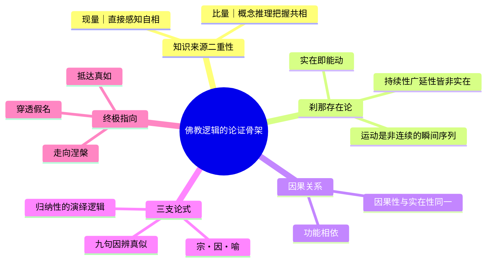

## 《佛教逻辑》读书笔记 
  
### 作者  
digoal  
  
### 日期  
2026-06-23  
  
### 标签  
读书笔记 , 佛教逻辑  
  
----  
  
## 背景 
  
  

---
书名: 《佛教逻辑》  
作者: [俄] 舍尔巴茨基（Th. Stcherbatsky）  
译者: 宋立道 / 舒晓炜  
出版社: 商务印书馆  
出版年份: 1997-11  
原作名: Buddhist Logic（1930，苏联科学院列宁格勒版）  
笔记日期: 2026-06-23  
豆瓣链接: https://book.douban.com/subject/1116336/  
标签: [因明, 佛教哲学, 印度逻辑, 认识论, 汉译世界学术名著丛书]  
---

  

> **一句话**：一位俄国贵族学者用康德的语言，把陈那、法称的因明体系，重新翻译成了"西方哲学也能看懂"的样子。  
> **适合谁读**：对印度哲学、佛教认识论、逻辑史感兴趣，并且愿意啃硬骨头的人。  
> **阅读难度**：⭐⭐⭐⭐⭐（5星，国内外学界公认"非专业读者勿入"）  
> **推荐指数**：⭐⭐⭐⭐☆  
  
---

## 一、时代坐标：这本书从哪里来？

1930年，《佛教逻辑》由苏联科学院在列宁格勒出版，作者舍尔巴茨基（1866–1942）当时已年过六旬。他出身俄国贵族家庭，少年时就掌握德、法、英语，青年时又学希腊语、拉丁语、希伯来语，later更精通梵文、藏文，是那种"语言天才型"的东方学家。他师从俄国梵语学泰斗米纳耶夫，又远赴维也纳、波恩问学，最终在彼得堡大学执教，与奥登堡等人共同撑起了西方佛学史上著名的"彼得堡学派"。

这本书写作的年代并不平静。一战、革命、内战之后的苏联，意识形态环境对"宗教哲学"研究越来越不友好，彼得堡学派的佛学研究后来也逐渐式微。把这个背景放进去看，《佛教逻辑》几乎可以算是这一学派在国际学界留下的"压轴之作"——舍尔巴茨基用英文写作、面向西方哲学界发布，某种意义上是在为这门学问争取一个"学术合法性"：佛教因明（陈那、法称一系的量论）不是异域的神秘主义，而是一套可以和欧洲逻辑学、认识论平等对话的体系。

他要解决的问题很具体：陈那、法称的"因明"（hetu-vidyā）到底是什么？是逻辑学，还是认识论，还是单纯的辩论术？西方学界长期把它简单等同于"印度版三段论"，舍尔巴茨基要证明，这远远不够。

---

## 二、核心命题：作者在说什么？

### 观点一：因明不是单纯的逻辑学，而是"知识论+逻辑+解脱论"三位一体

舍尔巴茨基开篇就强调，"佛教逻辑"这个译名本身是个简化。陈那、法称真正讨论的，是"量"（pramāṇa，知识的来源与检验标准）——现量（直接感知）和比量（推理）如何共同构成可靠认识，而这种认识论最终服务于一个宗教目标：穿透"假名"的迷雾，抵达"真如"实相，走向涅槃解脱。逻辑只是工具，认识论才是骨架，解脱论才是终点。

### 观点二：佛教哲学经历了三个阶段，因明是第三阶段、也是最高阶段的产物

舍氏提出了一套影响深远的"三期说"：小乘（以说一切有部为代表，朴素实在论，承认外境实有的"法"）→大乘（中观学派，"空"的辩证法，否定一切实有）→瑜伽行派/唯识（陈那、法称为代表，批判主义的认识论综合）。在他看来，因明正是第三期"否定之否定"后的成果——它既不天真地相信外境实有，也不滑向中观式的彻底虚无，而是建立了一套精细的认识论批判体系。

### 观点三：陈那—法称体系本质上是一种"批判哲学"，可以用康德的框架去理解

这是全书最大胆、也最具争议的论点。舍尔巴茨基把佛教的"自相"（svalakṣaṇa，刹那生灭、纯然个别的"自在实在"）类比为康德的"自在之物"（Ding an sich）；把概念、名言构造出的"共相"世界，类比为康德意义上经由范畴整理后的"现象界"。两种知识来源——现量直接触及"自相"，比量则通过概念网络去把握"共相"——在他笔下几乎变成了康德"感性—知性"二分的佛教翻版。

---

## 三、论证地图：作者怎么说服你的？



全书第一部分先立"知识来源"的总纲：佛教只承认两种合法的认识来源——现量与比量——并据此与正理派、胜论派等其他印度哲学流派划清界限。第二部分进入"可感知的世界"，从极具佛教特色的"刹那存在论"（一切存在物都是刹那生灭的动态序列，持续性、广延性都只是概念虚构）展开，再讨论因果律、感觉认识的具体机制。

最值得拿出来单独说的，是三支论式（宗、因、喻）的逻辑性质问题。舍尔巴茨基把它定性为一种"具归纳性的演绎逻辑"——因支要满足"遍是宗法性""同品定有性""异品遍无性"三个条件，其中后两相依赖对同类、异类事例的经验归纳，但论式整体的推出过程又具有演绎的形式。这个判断后来在中、日因明学界引发了长达数十年的争论：到底该把三支论式比作亚里士多德式的三段论，还是充分条件假言推理，还是某种独立于西方框架之外的论证术？学者们各执一词，至今没有定论——这恰恰说明舍尔巴茨基提出的问题抓住了要害，即便他给出的答案未必是终局。

---

## 四、前提假设与边界：什么情况下这不成立？

**假设一：佛教哲学"三期递进"模式具有普遍解释力。** 这是一种典型的黑格尔式"正—反—合"叙事：小乘是"正"，中观是"反"，唯识因明是"合"。这个框架讲故事很漂亮，但它默认了思想史是单线进化的，容易掩盖小乘部派内部的多样性，也容易把唯识学的兴起讲成是"佛教逻辑发展的必然终点"——而实际上，中观应成派的传统（尤其在藏传佛教中）从未承认因明高于"空性"的辩证法，二者更像是并行的两条路，而非谁取代谁。

**假设二：用康德的"现象—自在之物"框架去套陈那、法称的"自相—共相"，是恰当的跨文化翻译。** 这一点舍尔巴茨基自己也承认是"用西方哲学的语言转述"，但批评者（包括后来许多印度哲学史家）指出，这种比附容易"读入"而非"读出"——康德的自在之物是不可知的本体论假设，而佛教的"自相"恰恰是可以被现量直接、瞬间感知到的，二者在认识论地位上并不完全对等。把陈那法称"康德化"，固然让欧洲读者更容易进入，却也可能扭曲了原典本身的论证肌理。

**假设三：英译—转译链条中的概念能够保持稳定。** 豆瓣上有读者直言，因为原书是先把梵文转译为英文、再由中文译者转译为汉语，"对于梵文就走了几道弯路"，许多术语和国内传统因明学界（玄奘、窥基一系）的译法不一致，初学者很容易在术语对照上卡壳。这是这本书今天阅读起来门槛最高的地方之一，也是为什么它常被评价为"专业读者的工具书，而非入门读物"。

---

## 五、思想谱系：这本书在哪个传统里？

舍尔巴茨基代表的是西方佛教学的"彼得堡学派"，与同期法国、比利时学派（以普桑为代表，更偏重文献学与阿毗达磨细节考订）形成对照——彼得堡学派更愿意做哲学性的整体重构，敢于用欧陆哲学（尤其是德国古典哲学）的概念去"翻译"印度思想，风格更接近哲学史家而非纯粹的文献学者。

往上追，他直接继承的是陈那（Dignāga）—法称（Dharmakīrti）—法上一系的印度量论传统；往下看，《佛教逻辑》深刻影响了20世纪整个西方与日本学界对因明的理解框架，无论后来的学者是赞同还是反对他的"康德式"解读，几乎都要先和他对话。在中国学界，吕澂、陈大齐、霍韜晦、沈剑英等人围绕"三支论式是归纳还是演绎"展开的论战，某种程度上正是舍尔巴茨基提出的问题在汉语学界的延续与深化。

```
印度量论传统
陈那《集量论》《正理门论》
        │
        ▼
法称《量评释论》《正理滴论》
        │
   ┌────┴────┐
释文派      迦湿弥罗派 / 阐义派
        │
        ▼
舍尔巴茨基《佛教逻辑》(1930)
  ── 用康德式批判哲学重构 ──
        │
        ▼
20世纪中、日、欧因明学界的持续论战
```

---

## 六、我学到了什么？

第一，"逻辑"这个词在不同文明里指向的东西可能完全不一样。因明从来不是为了构造一套自洽的形式系统，它是辩论场上活生生的攻防术，也是修行路上认识真理的方法——逻辑、认识论、解脱论三者从未真正分开过。把它硬塞进"形式逻辑"的框子里评判对错，本身就是一种误读。

第二，"用一种哲学语言翻译另一种哲学传统"永远是一把双刃剑。舍尔巴茨基的康德式重构，让我这种没有梵文训练的读者第一次能"摸到"陈那法称体系的轮廓——但读完之后我也更警惕：每一次精彩的跨文化类比，背后都可能藏着一次悄悄的扭曲。理解一种思想，和把它"翻译"成自己熟悉的语言，中间始终隔着一层。

第三，刹那存在论这套东西其实很"硬核"。它不是诗意的"无常"感悟，而是一套严密到近乎偏执的论证：从矛盾律直接演绎出万物刹那生灭，否定持续性和广延性的实在性。这种把佛教核心教义"逻辑化到底"的努力，让我重新理解了"因明"为什么会被称为佛教哲学发展的最高阶段——它要用最硬的论证工具，去守护最核心的世界观。

---

## 七、举一反三：这个框架还能用在哪？

**跨文化概念翻译的自我审查清单。** 不只是研究印度哲学，任何把一种传统（中医、儒家伦理、本土法律观念）"翻译"进西方学术框架的工作，都可以用本书示范的方法做一次反向检验：哪些地方是真的找到了对等结构，哪些地方只是"看起来像"。

**区分"工具层"和"目的层"的分析方法。** 因明的逻辑只是工具，解脱才是目的——这个区分可以迁移到任何"方法论 vs. 终极关怀"被混为一谈的领域，比如把某种管理工具（OKR、敏捷开发）误认为是组织的最终目标，而忘了工具本身要服务于更大的命题。

**三期演进叙事的警惕。** 任何"从粗糙到精致、从朴素到批判"的思想史叙事（不管是讲科学史、艺术史还是商业模式演化）都值得用本书"假设一"的反思方式去拷问：是不是只是后人为了讲故事方便，强行排出了一条单线进化的轨迹？

---

## 八、批判与反思

我不完全认同把陈那、法称的体系直接套进康德的"现象—自在之物"二分。佛教的"自相"在认识论上是可以被现量直接觌面、当下了知的，而康德的自在之物恰恰是认识能力的边界、是"不可知"的设定——这是两种性质很不一样的"超验"。舍尔巴茨基这种处理虽然极大地方便了西方读者入门，但也容易让人误以为陈那法称真的在搞一套和康德同构的批判哲学，从而遮蔽了佛教认识论自身独特的问题意识（比如它最终要服务于"破除我执"这个完全不在康德体系射程之内的目标）。

时代也已经变了。今天的佛教哲学研究早已不再满足于"小乘—大乘—唯识"三期递进的叙事，藏传应成中观、南传上座部阿毗达磨各自的内部演化逻辑，都被更细致地呈现出来，不再被压缩进一条单线进步史。

这本书的局限性也很明显：写于近一百年前，很多梵文文献的整理和翻译水平今天已经大幅提升，部分具体论断（尤其涉及法称著作的版本与年代）在后续学界已经被修订。它更适合被当作"思想史上的经典文本"来读——理解一代学人如何用尽全力让东西方哲学对话——而不是当作"因明学的最新定论"。

---

## 九、金句与记忆点

1. **"知识来源只有两种：现量与比量"**——这是全书的认识论总纲，看似简单，却是佛教与正理派、胜论派分道扬镳的关键分界线。
2. **"实在即能动"**——刹那存在论的核心命题：凡是真实存在的东西，必定在变化、在起作用；静止不变的东西，本质上是概念的虚构。
3. **"佛教哲学经历三期：小乘、大乘、瑜伽行派"**——舍尔巴茨基最具标志性、也最具争议的论断，理解全书的钥匙，也是后人批评最多的地方。
4. **"三支论式是一种具归纳性的演绎逻辑"**——这句概括开启了中日因明学界数十年的论战，至今仍无定论。
5. **"逻辑的功能在于排除误执，引导人们接近真如"**——比喻为"宝石藏在密室，从锁孔泄出光来"：人们看见光便向那光走去，误以为光就是宝石，却仍因此走到了宝石所在之处。这是对因明工具性地位最诗意的概括。
6. **"持续性与广延性是非实在的"**——这一论断把"无常""无我"从宗教信念转译成了严密的逻辑推论，是因明"以理证教"的典范。

---

## 十、延伸阅读

1. **《正理滴论》（法称著）**——舍尔巴茨基本书的核心研究对象之一，直接读原典能更敏锐地分辨哪些是法称本人的论证、哪些是舍氏的康德式重构。
2. **《因明入正理论》（商羯罗主著，玄奘汉译）**——汉传因明的入门基石，可与本书第二部分的三支论式讨论对照阅读，体会汉译术语体系与英译/俄译体系的差异。
3. **吕澂《佛家逻辑——法称的因明说》**——中国学者对法称因明的经典解读，可作为本书"三支论式是归纳还是演绎"争论的中文学界对照样本。
4. **沈剑英《印度古典论证式的逻辑本质》**——直接回应舍尔巴茨基"归纳-演绎"判断的当代中文研究，适合想深入这场学术论战的读者。
5. **舍尔巴茨基《小乘佛学》《大乘佛学》**——同一作者的姊妹篇，按其"三期说"框架分别处理小乘说一切有部与大乘中观，读完《佛教逻辑》后回看，能更完整地理解他整套"三期递进"叙事的全貌。

---

*笔记写于 2026-06-23 | 基于公开资料（豆瓣书评、中文因明学界研究论文、出版社简介）与深度思考整理*
  
  
#### [PostgreSQL 解决方案集合](../201706/20170601_02.md "40cff096e9ed7122c512b35d8561d9c8")
  
  
#### [德哥 / digoal's Github - 公益是一辈子的事.](https://github.com/digoal/blog/blob/master/README.md "22709685feb7cab07d30f30387f0a9ae")
  
  
#### [About 德哥](https://github.com/digoal/blog/blob/master/me/readme.md "a37735981e7704886ffd590565582dd0")
  
  

  
