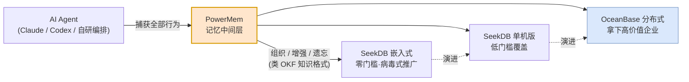
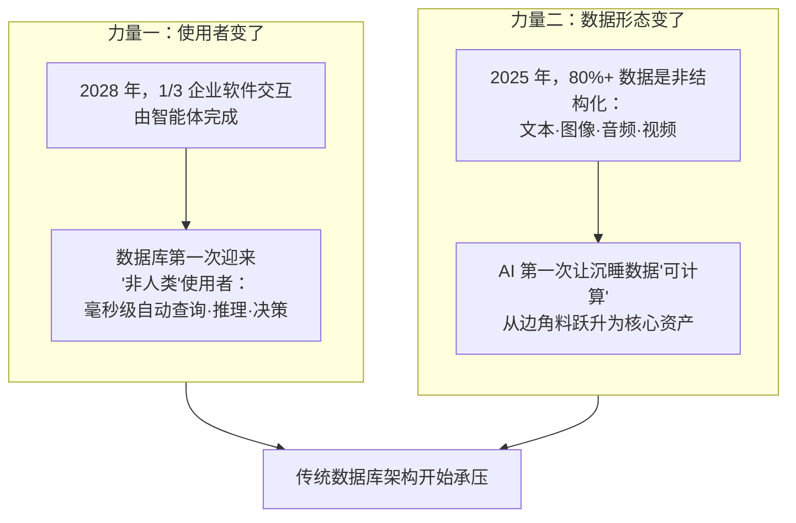
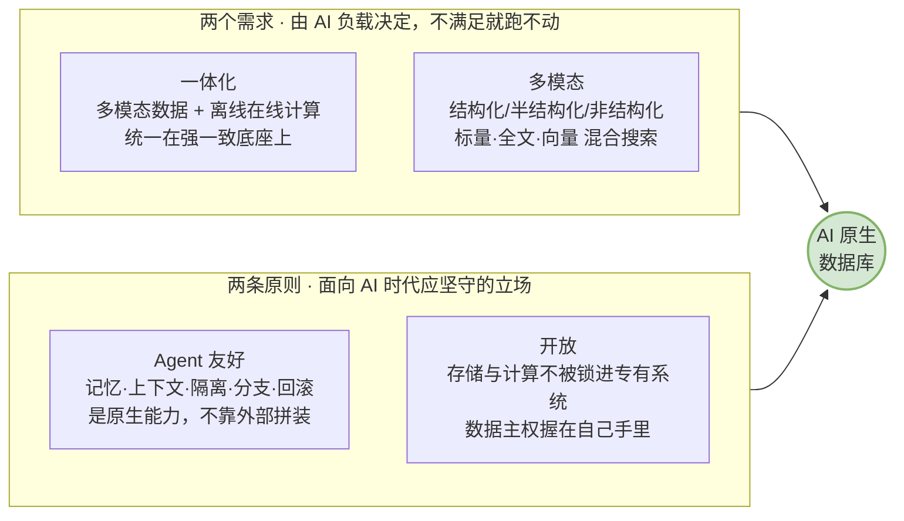
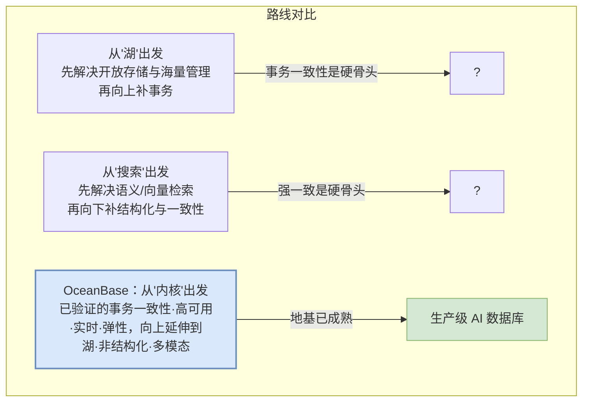
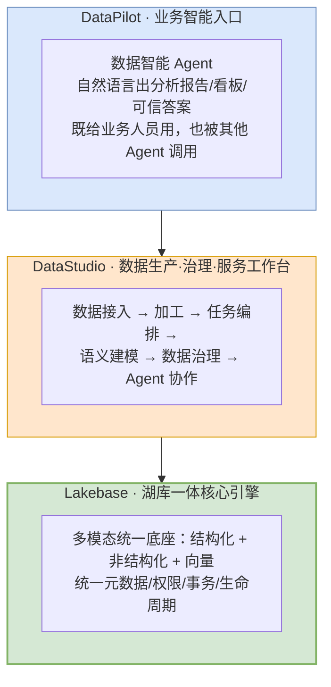
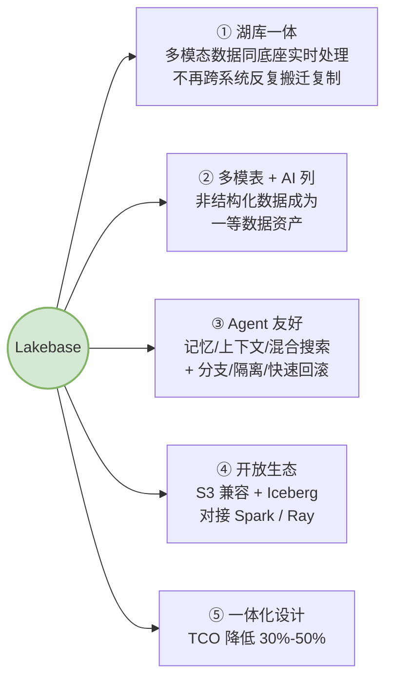
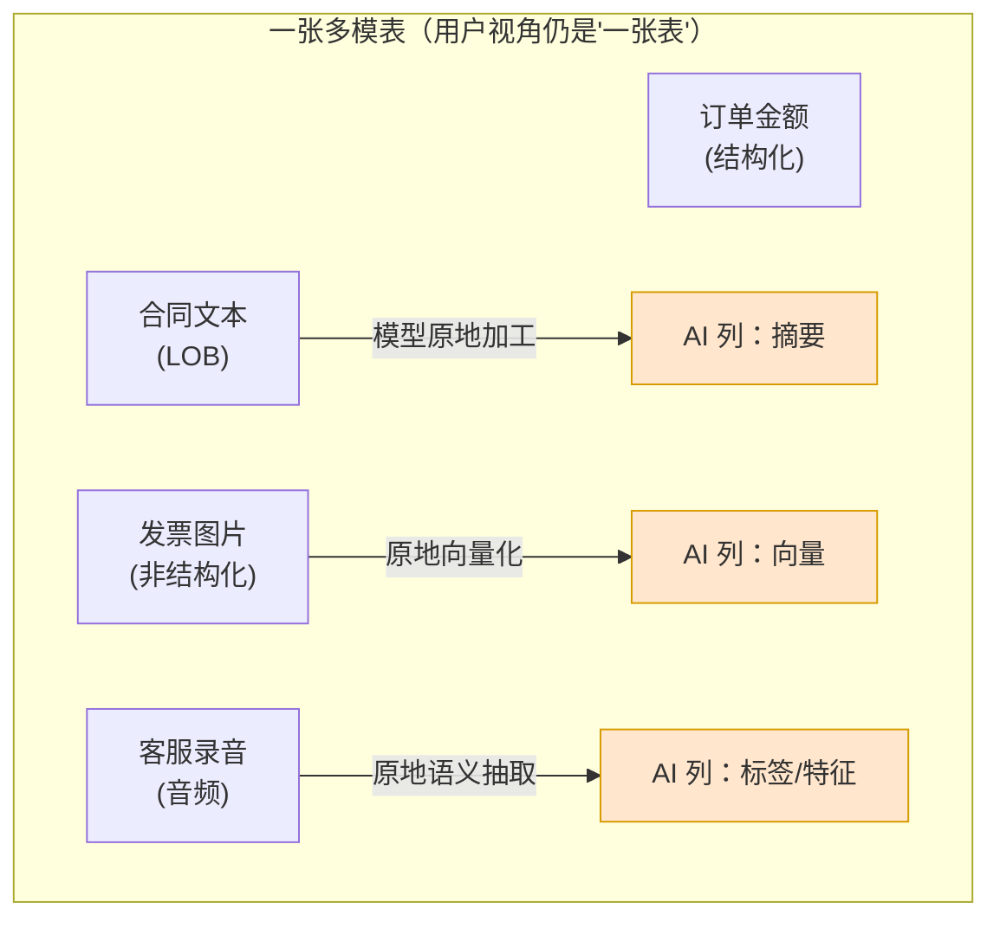
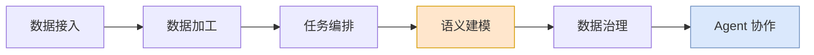
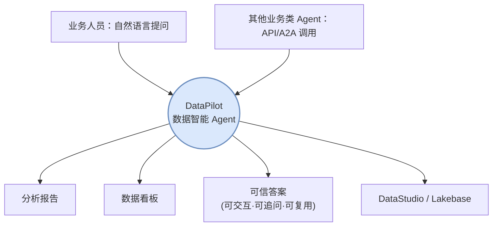
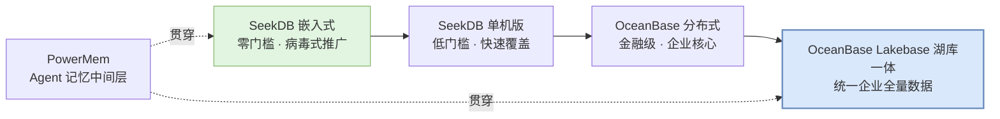

## 如何定义 AI 原生数据库？OceanBase 给出了答案  
  
### 作者  
digoal  
  
### 日期  
2026-06-29  
  
### 标签  
OceanBase , AI 原生数据库 , 数据基座 , 数据质量 , 上下文 , Agent , 记忆 , RAG , PowerMem , PowerRAG , LakeBase , Data Studio , Data Pilot , 数据治理 , Agent 编排  
  
----  
  
## 背景  
  
  
**昨天 OceanBase 的发布会线上有近 60 万人观看, 到底聊了啥? 怎么这么火?**  

  
## 一、我被啪啪打脸, OceanBase 的开源只是冰山一角 

在这场发布会之前，我曾仔细研究过 OceanBase 的三个开源项目, 发表了一篇分析文章 [《OceanBase 在下一盘大棋》](../202606/20260618_03.md)  。核心观点是：AI 时代，**入口争夺已成红海, 高价值的企业客户 AI 记忆基座将成为必争之地**。

Claude、Codex 早期靠自家模型优势圈用户，开放第三方模型的接入后又来抢劫国内增量用户。Agent 早已成为红海, 但真正高价值的，从来是企业市场。随着企业把 AI 用深用透，Agent 编排管理需求爆发 —— PingCAP 推 Loop，Ruflo 做架构师/码农/测试工程师的多角色编排。再往下争什么？我当时给的答案是： **Agent 记忆**。 

OceanBase 的三个开源项目完美证实了我的判断：

我当时的结论是 OB 要拿下 AI 记忆基座： **PowerMem 的精妙在于卡位** —— 它站在 Agent 与数据库之间，既能捕获 Agent 的全部行为，又能针对下游存储做定制化组织、增强、遗忘，类似一套面向 AI 的开放知识格式（OKF）。

- 没有 PowerMem，记忆要么残缺、要么组织混乱、要么臃肿到无法遗忘，体验崩塌；
- 没有 SeekDB 这种"从嵌入式到单机"的轻形态，门槛太高，谈不上病毒式覆盖；
- 没有 OceanBase 这种分布式形态，拿不下真正付费的企业大客户。

以上三者组合，是 OB 在下的一盘大棋： **拿下企业级 Agent 记忆基础设施**。 但看完发布会, 我发现自己格局还是小了.   

当时我说"也许我看到的只是冰山一角"。昨天下午看完发布会，我可以收回"也许"两字了 —— **冰山的主体，比我猜的更具像、也更宏大、OB 野心远大于我的描述。原来 AI “记忆”只是开胃菜, AI “数据”基座才是终极目标.**  
  
“记忆”与“数据”虽毫厘之差, 却隐藏了 OB 的大野心. 咱继续聊发布会.  
  
  

## 二、发布会聊了啥

四个议题，从 CEO 杨冰的"变与不变"，到 CTO 杨传辉的"湖库一体 AI 数据库"，到产品负责人韩富晟的产品家族，再到蚂蚁黄挺的"数据底座实践"，逻辑是闭环的、自洽的、有生产验证背书的。

如果你没看发布会的话, 我帮你总结了 4 位嘉宾的演讲内容如下:  
  
一、OceanBase CEO  
1. AI 落地企业的"最后一公里"本质是数据难题——模型再聪明，若无法理解业务、参与决策、跑通流程，就无法创造价值；Gartner 预测 2026 年超 60% 的 AI 项目可能被放弃，根因是缺乏高质量数据。
2. 两大变化正在重构数据底座：一是数据使用者从人变成 Agent（高频调用、并行执行、7×24 运行），二是数据形态从结构化转向占比 80% 以上的非结构化数据。
3. 当 Agent 成为主要数据消费者，带来三类挑战：海量小库的规模化共享与隔离（用"逻辑数据库"解决）、结构化与非结构化混合检索的上下文构建、以及 Agent 长期运行的正确性与自我进化（用"database branch"像 Git 分支一样提供即用即抛的数据库沙箱）。
4. 数据形态也在变：非结构化数据从存储成本变为可计算资产，数据要形成"闭环飞轮"实时回流（让 AI 越用越聪明），数据库要从"记录事实"升级为"理解业务"（从 SQL 到语义）。
5. 变化之中也有不变的底线——一致性、扩展性、可靠性、实时性，这四点在 Agent 大量进入生产系统时反而更重要。
6. OceanBase 给出的答案是"湖库一体"：库擅长一致性/实时性/可靠性，湖擅长多模态存储与开放计算，二者融合（而非缝合），目标是用下一个十年"再造一个 AI 时代的数据库"。
  
二、OceanBase CTO  
1. 数据库已历经交易型、数据仓库、大数据/湖仓多代演进，今天的 AI 数据库本质是在做"第四代数据库基建"，核心需求是更注重多模态、更注重在线与离线融合。
2. 业界趋势（如 Databricks 的 LTAP）显示所有数据库都在走向一体化融合，OceanBase 在分布式架构上叠加 OLTP、实时 AP，今天进一步推出存算分离、支持开放计算的"湖库一体"。
3. 底层核心是"多模表"：在一张表里既有结构化关系列，也有向量/文本/LOB 等多模列，把非结构化数据当作"一等公民"，并运行在对象存储之上以实现存算分离和低成本。
4. 基于多模表构建"混合搜索"，统一完成关系过滤、全文、向量、图等多路召回再 ReRank，性能优于业界主流（向量搜索领先，混合搜索比 Elasticsearch 好 30% 以上）。
5. 面向 Agent 设计了 Fork Database（秒级创建可回滚的数据库分支）和逻辑表（解决海量 Agent 带来的 Schema 爆炸），并用 Unified Catalog 做统一元数据与行级安全权限控制。
6. 在引擎层之上还有上下文层（数据上下文 + 应用上下文），包括记忆产品 PowerMemory/M0（评测通过率 39% vs Hermes 22%）和语义层 OceanBase OSI，理念是"把简单留给客户，把复杂留给 OB"。
  
三、OceanBase 产品负责人  
1. 正式发布以"湖库一体"为底座的 LakeBase 产品体系，面向 AI 时代文本、音频、图片、视频等多模态数据，构建新一代数据基础设施。
2. 核心价值有五点：多模态一体化处理、湖库一体架构、开放计算能力、混合搜索能力，以及对 Agent 友好。
3. 提供两种部署模式——独立部署（适合全新 AI 场景，小资源快速拉起端到端系统）和智能叠加层（复用已有数据湖资产，与现有系统并行运行），不要求客户推倒重来。
4. 以自动驾驶场景为例：LakeBase 能让海量车端多模态数据"存得下、算得动、用得起"，通过多模态接入、处理（拆分抽帧）和混合搜索高效召回训练数据。
5. 以证券行业为例：LakeBase 作为统一数据处理中枢，对研报、公告、舆情等做智能解析与索引，支撑投研资料使用、制度检索、合规问答等需求。
6. 在 LakeBase 之上还发布了 Data Studio（结构化与多模态数据的统一开发治理平台）和 Data Pilot（更懂业务的数据智能 Agent，支持自然语言查询、归因分析、看板生成），再结合 PowerMem、PowerRAG，形成完整的 AI 场景产品体系。
  
四、蚂蚁集团平台技术事业群总架构师  
1. AI 正沿着 OpenAI 的"五个层次"从 Chatbot 向 Agent 快速演进，蚂蚁基于 OceanBase、SOFA 等核心技术积累，正推动基础设施向 Agent 时代演进。
2. Agent 时代有两大假设变化：基础设施的使用方从工程师变成 Agent（数量级剧增、7×24 工作），系统从确定性变成随机性（下一个 token 不可预知），由此对弹性、隔离性、生产级提出新要求。
3. Coding Agent 案例：灵光 30 秒生成"闪应用"带来 Schema 不定、控制面压力、存储压力等问题，最终用 OceanBase 的 JSON Table 功能解决——用户照常用标准 SQL，OB 自动转成 JSON 存储，降本且保留算子能力。
4. 测试/评测成为大型软件交付的核心瓶颈："测不过来"且环境创建慢、数据污染难回滚、Agent 间相互影响，因此用 OceanBase branching（Fork Table）创建毫秒级、相互隔离、用完即销毁的数据沙箱（内部目标 5 分钟拉起一个评测环境）。
5. 安全 Agent 案例：风控规则、对话足迹、Bot 配置等原本需在 OceanBase 与向量库间同步，存在一致性 gap 导致规则漏派风险；改用 OceanBase 混合搜索把向量表直接放进库内，用事务一次性解决一致性，并简化为单系统运维。
6. 面向未来，Agent 时代的数据基础设施仍有诸多待解问题：需要端到端的能力与方案（收集 bad case → 分析 → 评测闭环），多模态数据必将进入生产系统并需与结构化数据统一管理，蚂蚁希望继续与 OceanBase 携手共建下一代 Agent 基础设施。
  
发布会验证了我的判断 —— **记忆与上下文是主战场**；但它超出我预期的地方在于：OceanBase 没有止步于"给 Agent 做记忆"，而是把 **Agent、数据治理、数据湖** 一起整合，端到端形成了一套 **AI 数据基座**。换句话说，OceanBase 不是在抢一个点，而是在重新定义整条赛道的标准。

这就引出了发布会真正的"题眼" —— 也是本文的核心问题：

> **到底什么才算 AI 原生数据库？**

  

## 三、别再把"数据库 + 检索插件"当成 AI 数据库

大多数人最容易犯的错，是把 AI 数据库理解成"老数据库挂一个向量索引"。OceanBase 用更理性、客观的方式进行了定义： **从两股客观力量开始进行逻辑倒推, 再用实际场景和数据说话。**

### 哪两股力量?

智能体有三个"天性"，提出了人类用户根本提不出来的要求：

| 天性 | 对数据底座的要求 | 关键词 |
|------|------------------|--------|
| **上下文是命门** | 一次检索就要从多模态数据里找出最相关信息，喂给模型 | 供给得准 |
| **规模指数爆发** | 从"一个应用一个库"到"一句话一个应用"，百万级库高密度共存、按需唤醒、闲时近零成本 | 承载得起 |
| **靠试错而进化** | 像管理代码一样随时开辟隔离试验空间，做得好就留、不行就丢 | 演练得稳 |

注意第二条里那个反直觉的"海量"定义——**AI 时代的海量，不是单库数据大，而是库的数量多**。灵光已有 3000 万个闪应用，平均每个仅百余行数据，99% 处于沉睡，极少数被唤醒时却要求秒级响应。这是一道传统"把单库做大"的扩展性思路完全答不上来的题。

### 倒推出的定义：两需求 + 两原则

把两条线汇到一起，AI 数据库该有的样子就清晰了：

### 变的是架构，不变的是被推到极限的工程底线

这一点尤其值得资深从业者品味。AI 改写了数据库的"用法"，却让它的"底线"前所未有地重要：

- **一致性**：从"高标准"变成"生死线"。当智能体在风控审核、内容安全里**直接替人拍板**，错一条、慢一拍就是真实业务事故。这正是"只做检索的系统"扛不住在线决策的根本原因——它们没有强一致保障。
- **扩展性**：从"把一个库做大"变成"让一百万个库经济地共存"。
- **可靠性**：从"有人兜底"变成"智能体的生命线"——身边没有运维盯着，金融级高可用成了每个 Agent 7×24 的保命绳。
- **实时性**：在线、毫秒级服务决策，而不是隔夜跑批。

**真正需要被重写的是架构与品类；必须被坚守的是工程底线——而且这条底线被推到了历史最高处。** 同时满足"变"与"不变"，形态上只有一个答案：

> **湖库一体**——数据湖的开放与海量存储，与数据库的事务与实时处理能力，生长在**同一个强一致的底座**之上。"库"擅长一致与实时，"湖"擅长规模与开放，AI 时代要求两者合而为一。

  

## 四、OceanBase 入局 AI 自带了什么光环?

湖库一体是方向，但**从哪里出发去构建它**，决定了谁能真正抵达生产系统。行业里有三条典型路线，差异是本质性的：

为什么从内核出发是更难、也更稳的一条路？因为当 AI 真正进入企业核心系统，数据底座要回答的就不只是"能不能找到数据"，而是**数据是否一致、权限是否可控、版本是否可信、系统是否持续可用、故障能否毫秒恢复**——这是一个面向生产系统的完整工程问题，不是检索问题，也不是存储问题。

OceanBase 的底气来自十五年金融级锤炼，这些不是 PPT 数字：

- 服务 **400+ 金融机构**，**近七成万亿级资产规模银行**把核心系统建在其上；
- 中国金融行业分布式数据库本地部署市场份额**连续三年第一**；
- **迄今唯一同时在 TPC-C、TPC-H 两项国际权威基准登顶**的数据库。

"数据不出错、系统不中断、故障毫秒恢复"——AI 时代被反复念叨的这些"刚需"，在金融场景里早已是成熟能力。把这套能力延伸到"湖"，对 OceanBase 是站在十五年地基上的下一步，而不是从零搭台。

  

## 五、OB 企业版三大核心产品：野心真正暴露

如果说开源三件套（PowerMem / SeekDB）露出的是冰山一角，那么发布会上的三个企业版产品，才是冰山主体。可以这么理解, 它们是开源三剑客的超集. 它们**分层咬合**，覆盖从底层引擎、到数据生产治理、再到业务智能入口的完整链路：

产品分工： **Lakebase 解决"数据底座"问题，DataStudio 解决"数据如何被生产、治理、服务化"问题，DataPilot 解决"业务人员如何直接使用数据智能"问题。** 下面逐个拆。

### 5.1 OceanBase Lakebase：AI 数据库的核心引擎

Lakebase 要解决的不是单点能力，而是**系统性问题**：让不同形态的数据、不同类型的负载、不同计算引擎，在同一架构中协同运行。五个设计点，建议每一个都对照自己手上的 AI 项目读一遍：

**① 湖库一体**：智能体需要的上下文天然跨形态——一笔交易的数字、一段客服录音、一张发票照片、一份合同文本，只有放在一起理解，才构成完整的业务事实。Lakebase 把开放格式的海量存储与数据库的在线服务能力统一进同一套元数据、权限、事务、生命周期管理，数据无需在系统间反复搬运。

**② 多模表 + AI 列**——这是我个人认为最具"AI 原生"味道的设计。

- **多模表**：结构化字段、文本、图片、音视频、JSON、LOB、向量进入同一张表的语义之下。用户看到的还是一张表，背后却承载了更丰富的资产，且在同一套治理体系内被检索、计算、调用。
- **AI 列**：把模型能力以"列"的形式引入数据处理链路——基于原始数据**原地**生成摘要、标签、特征、向量、重排或智能结果，**不必把数据搬出数据库交给外部模型再写回**。

它的含义是： **非结构化数据不再是"被存下来的文件"，而成为可搜索、可计算、可治理、可被 Agent 安全调用的数据资产。** 这恰好接上了我在开篇说的"组织、增强、入库"——只不过 OceanBase 把这件原本要靠 PowerMem 这类中间层做的事，往下沉淀进了引擎本身。

**③ Agent 友好**——这正是验证我"记忆主战场"判断的部分。Agent 不只查询数据，还需要长期记忆、会话上下文、业务状态、执行记录；不只结构化查询，还需要向量/全文/结构化的混合搜索；不只读数据，还要在隔离环境里试错、生成中间状态、安全回滚。Lakebase 原生支持：

- **实时上下文工程**：统一存储与检索 Agent 的记忆、上下文、状态、行动记录，混合搜索供给精准上下文；
- **数据分支 / 逻辑库 / 资源隔离 / 快速回滚**：像管理代码分支一样，为海量 Agent 快速创建独立、安全的数据空间，在不影响主干的前提下试错、运行、演进。

这把 AI 应用从"验证阶段"真正推向了"规模化生产运行"。

**④ 开放生态**：基于开放存储格式与可扩展计算架构，支持 S3 兼容对象存储与 Iceberg 开放表格式，可对接 Spark、Ray。不同引擎围绕同一份数据与同一份元数据协同，各做擅长的事，无需迁移数据或重建底座——这正是定义里"开放原则"的工程兑现，**数据主权握在企业自己手里**。

**⑤ 一体化设计**：核心价值不是"少部署几个系统"，而是从架构层面减少数据冗余、缩短链路、统一治理口径。企业不必为交易库、数仓、搜索引擎、向量库、数据湖各维护一套链路——**数据只治理一次、权限只定义一次、元数据只维护一套**。相关场景下整体 **TCO 降低 30%-50%** 。这不是简单的省钱，而是把 AI 落地的门槛降下来，让 AI 普惠从口号变成可负担的现实。

> **生产验证**：灵光已承载 **3000 万个 AI 生成的闪应用**。面对"海量独立数据空间 + 动态 Schema + SQL 计算"的需求，OceanBase 用**逻辑表**把每个闪应用的 Schema 与数据映射为可查询、可计算的逻辑表，避免"一应用一物理表"的元数据与资源开销，让千万级闪应用用标准 SQL 完成过滤、聚合、Join，低成本安全地跑在同一套基础设施上。

### 5.2 OceanBase DataStudio：数据治理的工作台

如果说 Lakebase 是地基，DataStudio 就是把"原始数据资产"加工成"可管理、可理解、可调用的数据服务"的车间。它运行在 Lakebase 之上，覆盖：

这里我要点出两个对 AI 至关重要的环节： **语义建模**与 **Agent 协作**。

- **语义建模**直接对应定义里那句"数据库要从'记录业务'走到'理解业务'"。自然语言是 Agent 与数据库交互的全新入口，没有语义层，Agent 就只能看到一堆裸表，读不懂"这家企业在做什么"。
- **Agent 协作**意味着治理流程本身也面向 Agent 开放——这正是我开篇说的 PowerMem"组织、增强信息再入库"那一层能力，被产品化、工作台化了。

### 5.3 OceanBase DataPilot：企业业务智能的统一入口

DataPilot 是面向经营分析与业务决策的**数据智能 Agent**，也是这盘棋里最关键的"入口"棋子。它的双重身份值得划重点：

它把过去依赖专业数据团队才能完成的分析流程，变成**可交互、可追问、可复用**的智能决策能力。更关键的是——**它既能给业务人员直接用，也能被其他 Agent 当作工具调用**。

这一点呼应了我此前的判断：谁掌握入口，谁就掌握话语权。DataPilot 卡的就是"企业业务智能入口"这个位置。它对上承接人和 Agent 的自然语言意图，对下统一调度 DataStudio 与 Lakebase——**入口、标准、底座，在 OceanBase 手里被串成了一条线。**

  

## 六、从嵌入式到湖库一体：形成完整"阶梯"

把开源与企业版拼在一起看，OceanBase 真正的杀招是**用一套标准、一条演进路径，覆盖了从个人开发者到超大型企业的全部形态** —— 企业完全不必担心"数据成为发展瓶颈"，因为每一步升级都不换标准、不换底座：

- **病毒式推广** 靠 SeekDB 的嵌入式/单机轻形态——门槛足够低，开发者随手就能用；
- **高价值企业** 靠 OceanBase 分布式与 Lakebase 湖库一体——金融级一致性与海量治理能力，吃下核心系统；
- **PowerMem** 横贯始终，做 Agent 与底座之间那层"记忆与上下文"的精准卡位。

**轻形态负责覆盖广度，重形态负责拿下高价值，从 Agent 入口到数据治理再到湖库一体的全链路解决方案则筑起了高高的黏性壁垒。**  
  
题外话: 其实我作为开源过来人, 真的不确定国产数据库厂商到底能不能同时干好开源和商业化这两件事. 因为资本都是逐利的、人是要靠业绩晋升的, 开源这种需要长期投入且回报难以衡量的事, 与商业沾边就会导致行为扭曲, 不沾边又无法满足晋升诉求逐渐被边缘化丧失公司资源支持, 在商业公司中开源难道真的是个死局? 难以持续?  
  
  

## 七、回到题眼：到底如何定义 AI 原生数据库？

绕了一圈，回到标题。我的看法是，OceanBase 这场发布会真正的价值，不在于发了三个产品，而在于它**给出了一个可被验证、可被推导、且已被生产检验的定义**：

> **AI 原生数据库 = 湖库一体的强一致底座（一体化 + 多模态）× 面向 Agent 的原生能力（记忆/上下文/分支/隔离/回滚）× 开放生态 × 被推到极限的工程底线（一致/可靠/实时/弹性）。**

它不是"老数据库 + 向量插件"，也不是"从搜索补一致性"或"从湖补事务"的半成品。它是从成熟内核出发，把十五年金融级地基延伸到湖、非结构化与多模态之上的**完整工程答案**。而 3000 万闪应用、阿福、灵光这些场景，是它真实的练兵场，不是发布会的渲染图。

### 几句话留给友商思考

最后，作为一名数据库老司机现在正深耕 AI 的人，我丢下几句话留给友商思考：

1. **最大的变数仍在 Claude / Codex 这类 Agent 厂商** —— 如果它们把记忆、编排这些能力内化，会进一步挤压编排层、记忆层、乃至通用 Agent 产品的生存空间。
2. **但高价值的企业客户不一样**。它们要数据主权、要可线下部署、要强一致与可审计。这恰恰是云端 Agent 厂商最难覆盖、而是 OceanBase 这套"开源轻形态 + 分布式企业版 + 湖库一体"全栈方案最擅长的地带。
3. **如果 OceanBase 再联手模型厂、Agent、编排层，把数据基座焊进整套解决方案，护城河会更深。** 这场发布会，已经能看到这条路的轮廓。

任何时代，谁掌握入口，谁就掌握话语权。传统数据库时代，OceanBase 用一行行被"双十一"逼出来的代码，证明了中国基础软件可以全球领先。AI 时代，它显然想再做一次同样的事 —— **不是适配 AI，而是重写 AI 时代的数据底座，去当那个"定义者"。**
  
下一个十年，OceanBase 的目标只有一句： **再造一个"AI 时代的 OceanBase"。**  
  
各位看官, 数据库行业已迎来新生机, “八仙过海, 各显神通”的大戏陆续上演, 免门票观看哟!  

国产数据库似乎错过了定义 OLTP、OLAP、KV、文档、数据湖、湖仓一体等时代, 不能再错过 AI 时代了!   
  
---

*本文基于 OceanBase AI 战略发布会内容与公开开源项目（PowerMem / SeekDB / OceanBase）整理，仅代表个人观点, 欢迎交流。*
  
  
#### [PostgreSQL 解决方案集合](../201706/20170601_02.md "40cff096e9ed7122c512b35d8561d9c8")
  
  
#### [德哥 / digoal's Github - 公益是一辈子的事.](https://github.com/digoal/blog/blob/master/README.md "22709685feb7cab07d30f30387f0a9ae")
  
  
#### [About 德哥](https://github.com/digoal/blog/blob/master/me/readme.md "a37735981e7704886ffd590565582dd0")
  
  

  
