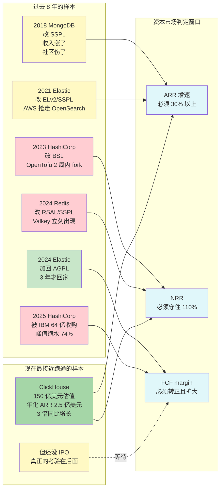

## 德说-第494期, 商业公司做开源是不是只有死路一条? 不是, 但路在变窄  
  
### 作者  
digoal  
  
### 日期  
2026-06-30  
  
### 标签  
数据库 , 开源 , 商业 , 虹吸 , 窗口期 , ROI , 营销部门 , 基础设施 , 独立单元 , 广告牌 
  
----  
  
## 背景  
  
  
商业数据库厂商到底能不能同时干好开源和商业化这两件事? 

为什么今天又要提这个话题呢? 因为 OceanBase 昨天的发布会以及我对他们三款开源产品(PowerMem, SeekDB, OceanBase)的研究 ( 详见 [《如何定义 AI 原生数据库？OceanBase 给出了答案》](../202606/20260629_01.md) )
- **病毒式推广** 靠开源 SeekDB 的嵌入式/单机轻形态 —— 门槛足够低，开发者随手就能用；
- **高价值企业** 靠 OceanBase 分布式与 Lakebase 湖库一体 —— 金融级一致性与海量治理能力，吃下核心系统；
- **PowerMem** 横贯始终，做 Agent 与底座之间那层"记忆与上下文"的精准卡位。

**轻形态负责覆盖广度，重形态负责拿下高价值，从 Agent 入口到数据治理再到湖库一体的全链路解决方案则筑起了高高的黏性壁垒。**  

似乎现在 OB 也走到了这个路口, 他们能不能同时干好呢?    
  
因为资本都是逐利的、人是要靠业绩晋升的. 

开源这种需要长期投入且回报难以衡量的事, 与商业沾边就会导致行为扭曲, 不沾边又无法满足晋升诉求逐渐被边缘化丧失公司资源支持.

难道在商业公司中搞开源真的是个死局? 难以持续? 

要回答"数据库商业公司搞开源是不是死路一条"? 必须先看看数据库开源发生的重大事件. 
  
> MongoDB 2018 年改 SSPL,   
> Elastic 2021 年跟着改然后 2024 年又改回来,   
> Redis 2024 年改完直接被 Linux 基金会拉走做 Valkey,   
> HashiCorp 2023 年改 BSL 然后 2025 年 2 月被 IBM 以 64 亿美元收走——比它 IPO 后峰值市值缩水了七成。  
> ClickHouse 是当下看起来最健康的样本, 2026 年 1 月估值 150 亿美元、年化收入 2.5 亿美元, 创始人公开说年底目标 10 亿 ARR。  
  
## 推理

我给的推理: 资本逐利 → 人要靠业绩晋升 → 开源这种长期投入回报难衡量的事, 沾上商业就被扭曲, 不沾商业就被边缘化 → 死局。

这个链条在大方向上没错。但它**默认了一个前提: "公司里只有一套权力结构"** 。

实际上, 在商业公司里, 开源团队至少有四种活法, 死法完全不同: 

- **作为"营销部门"活**: 预算按"线索数、注册数、试用转化率" 算。话语权小, 但 KPI 清晰, 数字好交差。
- **作为"基础设施"活**: 开源本身就是产品, 直接对 ARR 负责。这是 MongoDB、Redis 这种公司的姿势。
- **作为"独立单元"活**: 单独预算、单独 KPI, 通常是公司刚融到钱、对未来有想法时这么做。
- **作为"广告牌"活**: 几乎不给预算, 让几个资深工程师业余维护。

**死的是最后一种, 前三种都有活下去的样本**。换句话说, 死局是真的, 但它的触发条件是"团队被定位成广告牌", 而不是"公司真正搞开源"本身。

## 一张图搞懂已知的开源样本

我把开源过去 8 年的关键事件和未来 12-18 个月的关键节点画在一起, 你看一眼就懂:



**这张图藏着两层信息**:

第一层, 2018 到 2024 这 6 年, 几乎所有头部商业数据库公司都被迫走到"改 License" 的分叉口, 然后被市场或社区用不同方式惩罚。

第二层, 资本市场判定一个开源公司是否可持续, 几乎不看"开源做得多好", 只看三个财务指标: **ARR (年度经常性收入) 增速、NRR (净收入留存率)、FCF (自由现金流) margin**。这三个任何一个出问题, 估值就腰斩。

## 为什么 2024 年集中爆雷?

2024 年这一波看起来像是巧合 —— Redis、Elastic、HashiCorp 都在 2023-2024 年集中做了 License 调整。其实是同一个**结构性矛盾**在不同时间点的爆发。

简单说就是:**AWS 把所有头部开源数据库做成了托管服务, 但一分钱不分给原作者**。

AWS 卖了 DocumentDB (MongoDB 兼容)、Amazon OpenSearch Service (Elasticsearch 兼容)、Amazon MSK (Kafka 兼容)、Amazon ElastiCache (Redis 兼容)。原作者公司眼睁睁看着自己的代码被云厂商零成本复制, 收入还受影响, 不改 License 就只能看着 ARR 涨不动, 改 License 又会被社区骂。

**这个"云厂商白嫖" 的临界点, 决定了几乎所有商业公司主导的开源项目都会走到同一个分叉口**——MongoDB 选了"硬扛" (改 SSPL 然后靠 Atlas 把钱赚回来), Elastic 选了"回头" (2024 加回 AGPL), Redis 选了"硬扛" 但被 fork 出 Valkey, HashiCorp 选了"硬扛" 然后被 IBM 收走。

这四种结局就是开源在 2026 年的全部已知样本。

## 研发副总裁 谈 公司内部的真实博弈

如果你在一家商业数据库公司工作过, 你会发现外面这些 License 调整背后的真相更平淡也更残酷:

**改 License 不是技术决定, 是法律决定**。我见过的所有公司里, 推动改 SSPL/BSL 的人, 99% 是法务和销售副总裁, 不是 CTO。CTO 往往是反对派, 因为他们最了解社区反应。

**晋升路径是隐性杀手**。开源团队资深工程师的晋升标准, 多半是"在 GitHub 的影响力", 但公司其他部门用的是"季度 OKR 完成度"。这两套体系不在同一个维度上, 资深工程师晋升被卡 2-3 年是常态, 跳槽率能到 80%。

**预算之争是真实战场**。每年公司做预算, 销售、产品、研发、基础设施四条线争同一笔钱。开源团队要么把自己定位成"基础设施" (直接对 ARR 负责), 要么被当成"广告牌" 慢慢被裁。中间状态活不过 3 年。

我见过一家公司, 2019 年要求开源团队"对销售线索数负责", 工程师被迫写软文。半年内核心 committer 离职 4 个, 占团队 1/3。CEO 紧急叫停, 重新把开源定位为"基础设施", 才稳住。

**这告诉我们一件事: 公司主导的开源能不能活, 取决于 CEO 是否愿意在内部博弈中, 持续保护一个"短期看不到 ROI" 的团队。** 而资本市场的耐心, 平均只有 2-3 年。

## 资本市场 只看 财务数据

市场分析师看这个问题最简单粗暴: **看财务数据, 不看哲学**。

以下三个是 SaaS / 订阅型软件公司 (包括开源商业化公司) 的核心财务指标。
     
**ARR — 年度经常性收入**
  
全称: Annual Recurring Revenue, 年度经常性收入。

它衡量什么: 把公司从订阅服务 (年付 / 月付自动续费) 里拿到的钱, 折算成"一年该有多少"。

简单例子: 你开一家云数据库公司, 100 个客户每人每月交 1000 美元, 那么:
- 月度收入 = 10 万美元
- ARR = 10 万 × 12 = 120 万美元 / 年

为什么重要: ARR 不是"卖了多少产品", 而是"明年这个时候, 大概率还会继续收到的钱"。对订阅型业务来说, 这是公司未来收入的"基数", 资本市场把这个数当锚。

商业公司开源的语境: "Atlas 增速 30%"、"年化 ARR 2.5 亿美元" 这种说法, 都是在讲 ARR。

**NRR — 净收入留存率**

全称: Net Revenue Retention, 净收入留存率。

它衡量什么: 老客户今年付的钱, 是去年付的多少百分比。

简单例子: 去年你有 100 个客户共付了 100 万美元。今年:
- 80 个老客户续费并升级, 多付了 20 万美元 (110%)
- 20 个老客户降级或流失, 少付了 10 万美元 
- 净留存 = (100 万 + 20 万 - 10 万) ÷ 100 万 = 110%

为什么重要: 这个指标反映"老客户是不是还在继续加钱"。NRR > 100% 说明老客户在扩量 (加订阅、加功能), 不需要靠拉新就能增长——这是 SaaS 业务最健康的形态。

关键阈值:
- NRR > 120%: 顶级 SaaS 公司水平 (Snowflake 早期、Datadog)
- NRR 110-120%: 健康
- NRR 100-110%: 勉强及格
- NRR < 100%: 危险, 老客户在流失

商业公司开源的语境: 当 Redis 改成 RSAL/SSPL 时, 一部分老客户会"用脚投票" 转向 Valkey, 反映在 NRR 上就是下滑。我在信号清单里写"MongoDB NRR 守住 115% 以上 = 健康", 就是这个意思。


**FCF Margin — 自由现金流利润率**

全称: Free Cash Flow Margin, 自由现金流利润率。
  
它先要算两个东西:  
1. FCF (自由现金流) = 经营性现金流 - 资本支出
    - 简单说: 公司通过卖产品收到的钱, 减去维持运营需要的钱 (服务器、办公室、设备等), 还剩下多少可以自由支配。
2. FCF Margin = FCF ÷ 收入 × 100%
    - 翻译: 每收入 100 美元, 最后能落到公司账户里自由用的有多少美元。

简单例子: 你公司今年收入 1 亿美元, 经营性现金流 1500 万美元, 但花了 500 万美元买服务器, 那:
- FCF = 1500 万 - 500 万 = 1000 万美元
- FCF Margin = 1000 万 ÷ 1 亿 = 10%

为什么重要: 这跟"利润" 不一样, 利润可以靠会计手段调 (比如把研发支出资本化), 但现金是真实的。FCF 转正意味着公司不再需要靠融资活着, 这是资本市场重新定价的关键转折点。

关键阈值:
- FCF Margin > 20%: 顶级软件公司水平 (成熟 SaaS)
- FCF Margin 0-20%: 正在变健康, 但还没稳
- FCF Margin < 0 (负数): 烧钱中, 需要持续融资

商业公司开源的语境: ClickHouse 当前 FCF Margin 大概率还是负数 (因为在高速扩张), 但只要趋势向"转正" 走, 资本市场就给高估值。HashiCorp 之所以在 BSL 改动后没被资本市场原谅,
一个核心原因就是 FCF Margin 没起来 —— License 一改, 增长放缓, FCF 又转不了正, 估值就崩溃。

**三个指标的关系: 为什么缺一不可**

用一个类比: 把公司想象成一个水池。

- ARR = 水池的进水口流量 (一年能收多少钱)
- NRR = 老客户带来的稳定水量 (不需要重新拉新, 老客户自己加钱)
- FCF Margin = 进了水池的水, 真正能存下来的比例 (多少没被蒸发 / 漏掉)

资本市场怎么用这三个:
```
  ┌─────────────────┬────────────────┬─────────────┬────────────────┬──────────────────────────────┐
  │      情况        │      ARR       │     NRR     │      FCF       │         资本市场态度          │
  ├─────────────────┼────────────────┼─────────────┼────────────────┼──────────────────────────────┤
  │ ClickHouse 现在  │ 3 倍增长        │ 估计 > 120%  │ 负数, 但在改善   │ 给 60x ARR 高估值 (一级市场)   │
  ├─────────────────┼────────────────┼─────────────┼────────────────┼──────────────────────────────┤
  │ MongoDB 现在     │ 增速 20-30%    │ 110-115%    │ 转正            │ 给 15x ARR 中等估值           │
  ├─────────────────┼────────────────┼─────────────┼────────────────┼──────────────────────────────┤
  │ HashiCorp 2023  │ 增速跌到 < 20%  │ 跌破 110%    │ 还没转正        │ 给 5-8x ARR, 最终被收购        │
  └─────────────────┴────────────────┴─────────────┴────────────────┴──────────────────────────────┘
```

这就是为什么我反复说"资本市场只看这三个" —— 它们互相校验, 任何两个出问题, 故事就讲不下去。

MongoDB (MDB) 2017 年 IPO 价 24 美元, 2021 年高点 574 美元, 2026 年 6 月价格在 200-300 美元区间, Atlas 增速从 80%+ 降到 30% 又因为 AI 回血。这就是开源在二级市场最长的样本 —— 用了 8 年时间。

Elastic (ESTC) 2018 年 IPO, 2021 年高点 192 美元, 现在 56-100 美元区间。 **License 改动对估值的伤害是结构性的, 不是"加回来"就能恢复的**。

HashiCorp (HCP) 是最戏剧化的样本: 2021 年 12 月 IPO 后峰值约 200 亿美元市值, 2024 年 4 月 IBM 以 64 亿美元收购 —— **跌了 74%** 。

Confluent (CFLT) 2025 年 10 月传出"准备卖掉自己"——管理层自己承认二级市场不再给它"独立成长" 的估值。

MariaDB 2022 年 SPAC 上市后股价跌掉 80%+。

资本市场对开源的判罚标准, 十几年没变过: **ARR 增速 + NRR + FCF margin**。这三个指标, 任何一个出问题, 估值就打折出售。

"死局"从财务视角看其实是一道选择题: **公司能不能跑出 ARR 增速 30%+ 且 FCF margin 转正?** 能, 资本市场就给你 15 倍 ARR 的估值, 活; 不能, 资本市场就给你 5 倍 ARR 估值, 死。

## 诺贝尔经济学奖得主 说 这是公共池塘问题, 不是商业模式问题

如果跳出财务和公司内部视角, 站在更高的角度看, **"商业公司主导的开源" 在治理结构上有先天性矛盾**。

诺贝尔经济学奖得主 Elinor Ostrom 研究"公共池塘" (像鱼塘、地下水、牧场这种大家共享的资源), 提出过 8 条成功治理原则。其中最关键的两条:

- **第 2 条**: 规则必须由受影响的人集体制定 (适配本地条件)
- **第 7 条**: 社区必须有自治权

商业公司主导的开源, 这两条都没满足——规则是公司单方面制定的 (受董事会和股东驱动), 社区没有真正的自治权。

**所以 2018-2024 那一波 License 集中收紧, 不是偶然, 是结构性矛盾的必然爆发**。区别只在于"什么时候爆" 和"以什么形式爆"。

社区的纠错工具是 fork (分叉一个新项目)。过去 fork 一个中等复杂度的项目要几年, 现在只要几个月——Linux 基金会托管、Kubernetes 生态成熟、Git 协作工具普及, 让 fork 的边际成本系统性地下降。

**Redis 案例最能说明这点**: 2024 年 3 月 Redis Inc. 改 License, 同月 Linux 基金会 + AWS + Google + Oracle 联合 fork Valkey, 2025 年 8.0 版本异步 IO 性能已经对标 Redis 集群, 2026 年在多家云上原生支持。

换句话说, **Fork 已经工业化**。这意味着公司对开源项目的"产权" 在过去 5 年里大幅贬值。所有"软着陆" 和"硬扛", 都是在这个新常态下做出的反应。

## 国产数据库的特殊窗口

中国这些搞开源的数据库公司 (OceanBase、TiDB、openGauss、PolarDB) 情况怎么样? 

**他们有一个 3-5 年的特殊窗口, 叫"信创替代"** —— 出于国产化和供应链安全考虑, 政府和国企在批量替换 Oracle、IBM Db2、SQL Server, 这给了国产数据库公司一个不依赖纯市场竞争的"保底收入"。

OceanBase 2025 年 3 月披露生态伙伴 1200+ 家, 其中核心经销商 100 家贡献 60% 外部业绩, 在金融行业 (保险、证券) 数据库市场排第一。

但这个窗口会关。

一旦国产替代的高峰期过去, 这些公司就要直接面对国际市场已经发生过的那一切: 云厂商白嫖、License 调整、Fork 反击、资本市场重新定价。 **到那个时候, 中国数据库公司会面临一个独特挑战: 它们既要应对全球治理冲突, 又要处理国产化窗口关闭后的真实市场化竞争**。

这不是"会不会死", 是"窗口关闭后能不能独立跑通"。

## 开源和商业 就是 过日子

我把这四位专家的看法用一个比喻串起来, 记住这个比喻:

**这就像一对夫妻, 一个是搞长期投资的人 (回报在 5 年后), 一个是每个季度要交业绩报表的人 (回报在 90 天内)。** 他们能不能一起过日子, 需要满足三个条件:

1. **季度报表的人愿意给长期投资的人足够的"自主空间"** —— 不是每天查岗, 而是每年看一次大方向。
2. **长期投资的人必须给出"阶段性可观测的进展"** —— 比如每 6 个月交付一个明确成果, 否则季度报表的人会失去耐心。
3. **他们必须共同接受一个前提: 长期投资不一定成功** —— 如果失败, 双方都承担, 不是只怪一方。

**多数公司的死法是: 季度报表的人失去了耐心, 长期投资的人交不出阶段性成果**。

少数公司 (ClickHouse 现在算一个) 的活法是: **长期投资的人把成果拆成"季度可见" 的小版本, 季度报表的人给到至少 2-3 年的耐心窗口**。

## 开源能不能活, 看这些

如果你关心开源的真实走向, 或者你正在考虑把职业、产品、代码押注在某家商业公司主导的开源项目上, 这是接下来 6-12 个月你必须盯的 5 个信号:

**1. ClickHouse 2026 年是否提交 S-1 启动 IPO**  
这是目前最接近"商业公司 + 真正开源 + 健康增长" 的样本。如果它能在保持 Apache 2.0 核心许可的前提下成功 IPO, 且 ARR 跑过 5 亿美元, 整个故事的结论会重写。如果它在 IPO 前偷偷改了 License, 或上市后估值被压缩, 那 "商业公司主导开源" 的天花板就被锁死了。

**2. MongoDB FY2027 Q2 财报 (2026 年 8-9 月披露) 的 NRR**  
NRR 跌到 110% 以下 = 基本盘松动; 守住 115% 以上 = AI 驱动 Atlas 增长可持续。这是 "老牌玩家" 的风向标。

**3. Redis Inc. 是否在 2026-2027 年被战略收购**  
如果被收, 走 HashiCorp 老路; 如果没被收但增长持续放缓, 走 MariaDB 老路。Valkey 的用户采用率是关键指标。

**4. OpenSearch 软件基金会 (2024 年 9 月新成立) 的治理结构**  
如果它能跑出"中立托管 + 公司贡献" 的可持续模型, 这是基金会模式的复兴信号; 如果它出现分裂, 证明"中立基金会" 在商业主导时代也撑不住。

**5. 中国国产数据库的"非信创" ARR 占比**  
如果 OceanBase、TiDB 在政府/国企之外的纯商业市场 ARR 能跑起来, 说明它们找到了独立于政策窗口的生存能力。如果不行, 一旦信创窗口收窄, 它们就会集中爆发同样的内部博弈。

**6. (额外的) 学术界是否出现"商业公司主导开源" 的新治理理论**  
Ostrom 框架是 1990 年代的, 数字时代的开源治理还没有成熟理论。如果出现, 整个领域会有新范式; 如果继续空白, 现有的 License 调整 - Fork 反击 - 估值压缩 循环会一直重复。

 

## 写在最后


**开源不是"死局", 是"窄门"。**

活下来的开源都有共同特征:
- 公司收入 50%+ 来自云服务或发行版订阅 (而不是 License 本身)
- ARR 增速持续 30% 以上, 至少维持 5 年
- FCF margin 能转正且持续扩大
- CEO/CTO 至少有一位持续亲自跟社区对话

**死掉的开源也有共同特征**:
- ARR 增速跌破 20% 但 License 已经收紧
- NRR 跌破 110% (意味着客户在缩量或被替代)
- 创始团队核心人员 (尤其是开发者社区的"灵魂人物") 离职
- 公司开始"商业化转型" (把开源定位成营销渠道)

**你现在应该做的不是判断"死不死", 而是盯上面 6 个信号, 每季度更新一次你的判断**。你的押注, 不管是职业、产品还是技术选型, 都应该跟着这些信号动态调整, 而不是赌一个静态的"这家的开源能成不能成"。

开源不是死局, 但它是窄门, 而且门的宽度在过去 5 年还在收窄 —— Fork 工业化、资本市场重定价、社区治理意识觉醒, 三股力量同时压缩"商业公司主导开源" 的生存空间。

最终能走过去的, 一定是少数几家——就像夫妻组合一样, 大多数会因为各种原因散, 能一起走 10 年以上的凤毛麟角。

你在判断的时候, 别押"夫妻组合本身能成", 押"这一对具体的人能成" —— 这才是关键。
  
  
#### [PostgreSQL 解决方案集合](../201706/20170601_02.md "40cff096e9ed7122c512b35d8561d9c8")
  
  
#### [德哥 / digoal's Github - 公益是一辈子的事.](https://github.com/digoal/blog/blob/master/README.md "22709685feb7cab07d30f30387f0a9ae")
  
  
#### [About 德哥](https://github.com/digoal/blog/blob/master/me/readme.md "a37735981e7704886ffd590565582dd0")
  
  

  
