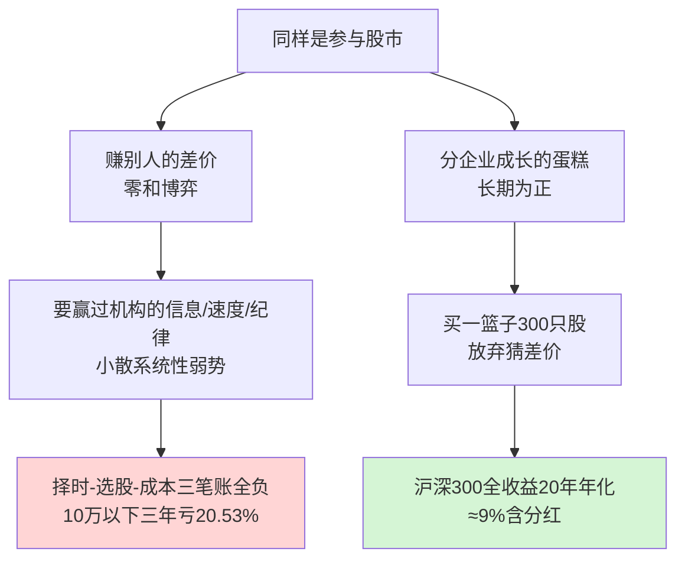
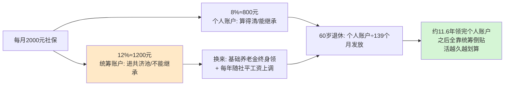
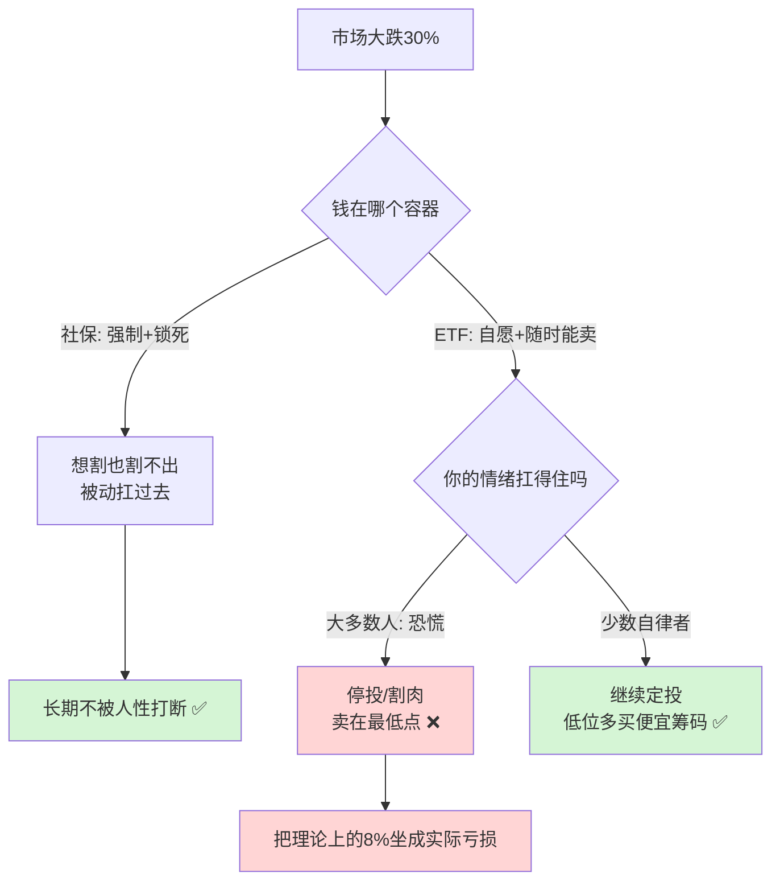

## 德说-第495期, 最好的理财产品到底是什么
  
### 作者  
digoal  
  
### 日期  
2026-06-30  
  
### 标签  
理财产品 , 股票 , 宽基指数 , 行业指数 , ETF , 社保 , 定投 , 底线 , 增值 , 纪律 
  
----  
  
## 背景  
  
如果你每个月只投 1000 到 5000 块. 你会选 股票? 指数基金? ETF? 社保?

## 先说说股票 

上海证券交易所有一篇基于 **5300 万个真实账户、2016 到 2019 三年数据**的论文，结论是：账户市值 10 万以下的散户，三年**平均**亏损 **20.53%**，单个账户平均一年亏 2457 元；账户越大亏得越少，1000 万以上的只亏 1.62%；而机构投资者那三年年化赚了 **11.22%**。

注意"平均"两个字。它不是说每个人都亏，而是说这一群人**整体性、系统性地吃亏，而且账户越小、比例上亏得越狠**。A 股老话叫"一赚二平七亏"，大概一成人能赚钱。所以：**作为小散，你大概率站在被收割的那一端。**

为什么？站在那位扛过 6124 点跌到 1664 点的投资人角度，他把散户的钱拆成了三笔账：**猜涨跌（择时）、挑股票（选股）、交易摩擦（成本）**。上交所数据把这三笔全拆开了，发现一个吓人的事实 —— **连机构靠"猜涨跌"都是亏的**（机构择时一年亏 417 万），机构唯一赚钱的本事是"选股"。而散户呢？三笔账全是负的，偏偏还把绝大部分精力花在自己最不可能赢的那场比赛 —— 猜点位 —— 上面。

前三个选项的比较水落石出：**小白买单只股票，不如定投 ETF/指数。** 道理很简单 —— 买单只股票，你是在赌"我能挑中赢家、还能猜对买卖点"，这恰恰是散户最弱的两件事；买指数，等于直接退出这两场比赛，改去分上市公司整体成长的蛋糕。一只股票可能暴雷归零，300 只的篮子不会同时归零。沪深300 全收益指数过去 20 年年化约 9%（含分红），过去十年定投甚至能到 11% 以上。

但这里我必须替你按住一个幻想：**长期向上，不等于哪一段都赚钱**。沪深300 近 5 年（2020–2024）年化总回报只有约 1.6%，中间一度三年年化 -6.1%。指数不是提款机，它给你的是"穿越牛熊后大概率为正"，前提是你得真的穿越过去，而不是中途下车。

## 定投 ETF，是不是不如交社保？

到这里，前面那套"收益率"的思路要踩刹车了。因为换那位精算研究者来看，**你犯了一个分类错误：社保根本不是一笔理财，它是一份保险。**

养老这件事，底层只有一个解不开的难题：**你不知道自己会活到几岁。** 你攒 240 万，活到 100 岁就显得不够，活到 70 岁又攒多了。任何投资工具都治不了这个病。社保的设计目标压根不是"收益最大化"，而是——**只要你还活着，每个月就有钱进账，活到 120 岁国家也得发。**

我们把你说的"每月 2000 元社保"拆开看。灵活就业交养老保险，比例是 **20%、全部自己掏**，其中 **8% 进你自己的个人账户、12% 进统筹大池子**。

很多人一看"12% 进了统筹、还不能继承"，就觉得这笔钱打了水漂。这是最大的误读。那 12% 买到的是两样东西：**一是基础养老金的终身领取权，二是养老金每年跟着社平工资往上调（自带通胀对冲）。** 关键在最后那一格——60 岁退休的"计发月数"是 139 个月，约 11.6 年。也就是说你领到 71 岁出头，自己账户那部分就发完了，可只要你还活着，钱一分不少地继续发，这部分来自统筹池。中国人均预期寿命已经接近 79 岁，**大多数人都能活到"国家倒贴"的阶段**——这正是那 12% 的价值：一份赌你长寿、而且你大概率赌赢的保险。

不过：**社保作为"投资"的吸引力，这些年掉得很快。** 个人账户那 8% 的"记账利率"（相当于保证收益），2016 年还有 8.31%，然后一路下滑——2023 年 3.97%、2024 年 2.62%、**2025 年只剩 1.5%**。十年跌掉了一个数量级。所以今天的社保，价值已经几乎全压在"保险"这一面，而不是"收益"那一面了。

那"定投 ETF 不如交社保"成立吗？**不是"不如"，是两者根本不在一个赛道。** 社保是你养老的"地板"——保证你老了饿不死、有终身现金流；ETF 是地板之上的"增值层"——博取更高回报，但要自己承担波动和风险。问"地板和增值哪个更好"，本身就问错了。

## 2000 社保 vs 2000 定投，本质区别到底是什么？

这个问题得请教行为学专家 —— **真正决定你结局的，不是收益率，是这两笔钱对你"行为"的约束力完全不同。**

人不是计算器，是情绪机器。我们有两个改不掉的毛病：
- 一是**亏 100 块的痛，约等于赚 200 块的爽**（所以一跌就慌着割肉，恰好卖在最低点）；
- 二是**眼前的 2000 块消费，永远比三十年后的养老金更诱人**（所以"自愿存钱"特别容易被"先花了再说"击穿）。

把同样一笔 2000 元放进两个不同的"容器"，大跌来临时，你的行为会走向完全相反的路：

这张图解释了一个反直觉的现象：**为什么"理论收益更高"的 ETF，在很多人手里反而跑输了那个"收益率正在下降"的社保？** 差距不在产品，在人。社保用一把"反人性的锁"，强行替你删掉了右下角那条红线 —— 你想恐慌也赎不出来，想挪用也拿不到。而 ETF 的纪律，**全靠你自己**，在千股跌停面前，多数人的自律会崩盘。

所以“2000 社保 vs 2000 定投”的本质区别，可以用三句话说清：

- **社保**：是保险，不是理财；是国家替你管住手，换一份终身的、抗通胀的养老地板；代价是流动性极差，锁到退休，且如今的"收益"已经很低。
- **定投 ETF**：是投资，不是保障；靠你自己管住手，换更高的长期回报和随时能用的流动性；代价是波动大、要你扛得住人性、并非任何一段都赚钱。
- **它们是互补，不是二选一**：一个守底线，一个搏增值；一个反人性地锁住你，一个考验你的自律。

## 所以，怎么做? 你自己掂量

不说废话, 我自己是按这个优先级的顺序来做的: 

1. **先留出 6 个月生活费的应急现金**，再谈任何投资。没有这个，一遇失业或大病，你就得在最低点割肉 ETF、或被迫高息借钱，前面所有努力归零。
2. **社保能交就交，它是地板，别用收益率衡量它**——你买的是"活多久都有钱领"这份确定性。灵活就业是 20% 全自费、负担不轻，**量力选档（60%–300% 可选），别硬顶高档**。
3. **地板之上，再用定投 ETF 搏增值**，前提是这笔钱 5–10 年内用不到，且你买的是宽基指数（如沪深300）、不是单只股票、不是行业主题。
4. **单只股票**：除非你真有专业研究能力和铁的纪律，否则别碰——你大概率是上交所数据里那个"择时选股都亏"的小散。

  
  
#### [PostgreSQL 解决方案集合](../201706/20170601_02.md "40cff096e9ed7122c512b35d8561d9c8")
  
  
#### [德哥 / digoal's Github - 公益是一辈子的事.](https://github.com/digoal/blog/blob/master/README.md "22709685feb7cab07d30f30387f0a9ae")
  
  
#### [About 德哥](https://github.com/digoal/blog/blob/master/me/readme.md "a37735981e7704886ffd590565582dd0")
  
  

  
