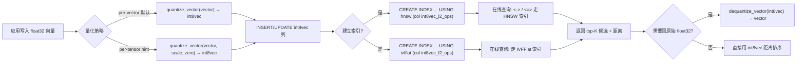
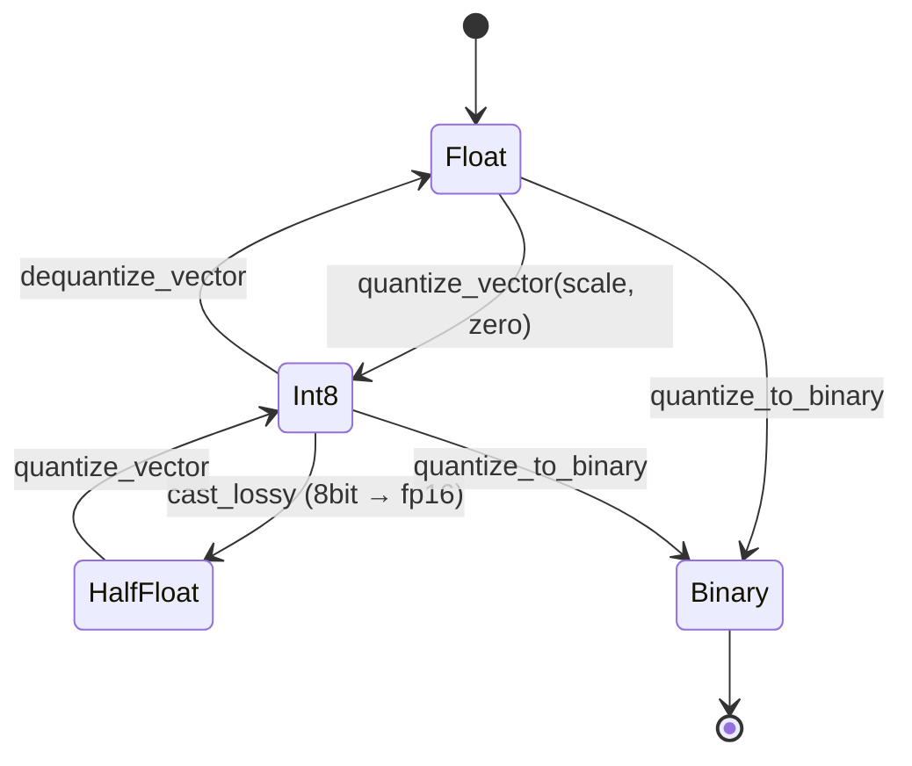
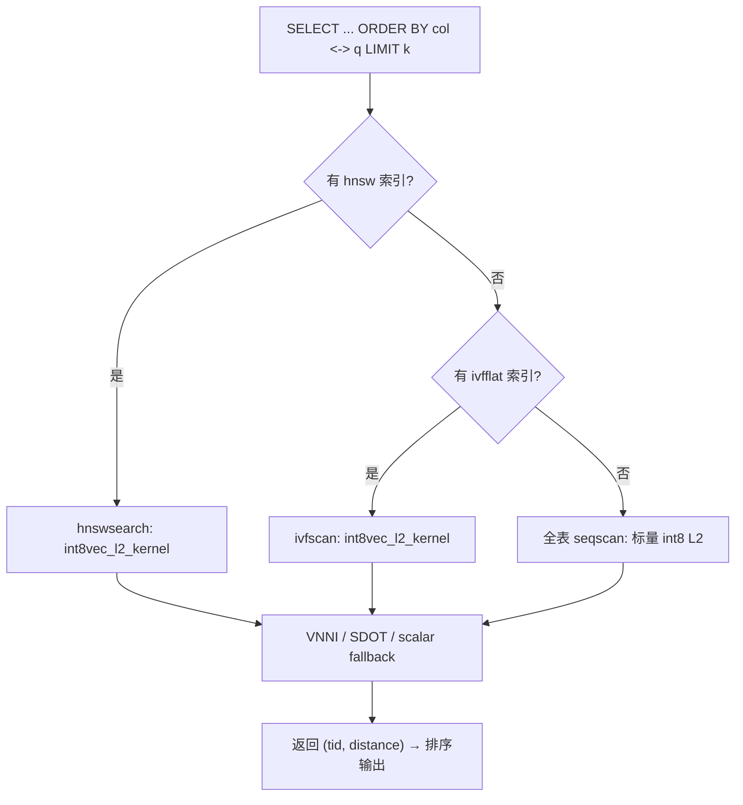

# pgvector 8bit 量化向量类型 PRD

> 状态: Draft
> 作者: Codex (via /write-prd)
> 日期: 2026-06-17
> 版本: v0.1
> 目标扩展: `pgvector` (当前 0.8.2, 仓库 `/Users/digoal/new/pgvector`)
> 目标 PG 版本: 14+（与 pgvector 0.8.x 保持一致）

## 1. 一句话产品赌注

为 **PostgreSQL / pgvector 的开发者与 AI 工程师**，在 **亿级高维向量需要降本并提升吞吐** 的场景下，**通过新增原生 8bit 标量量化（int8 / SQ8）向量类型** 解决 **存储翻倍、内存吃紧、距离计算在 CPU 上未饱和利用 SIMD 整数通路** 的问题，**以同等召回下存储降至 1/4、距离计算吞吐提升 ≥2×、索引构建/查询覆盖 HNSW 与 IVFFlat** 为成功标准。

## 2. 背景与问题

### 2.1 背景

pgvector 目前提供 4 种向量类型：

| 类型 | 元素 | 单维字节 | 最大维度 | 典型用途 |
|---|---|---|---|---|
| `vector` | float32 | 4 | 16,000 | 通用稠密向量 |
| `halfvec` | float16 | 2 | 16,000 | 内存敏感、近似精度的稠密向量 |
| `bit` | bit (1-bit 打包) | 0.125 | 64,000 | 极低存储、Hamming/Jaccard |
| `sparsevec` | float32 + map | 4 + 4*nnz | 16,000 | 稀疏嵌入 |

**8bit 标量量化（int8 / SQ8）在工程界是生产级默认选项**（FAISS `ScalarQuantizer QT_8bit`、Qdrant `int8`、Milvus `IVF_SQ8`、Weaviate `PQ/SQ`），因为它在存储与精度之间达到"甜点"——比 1bit 召回高一档，比 float16 存储再省 1/2，**且现代 CPU（AVX-512 VNNI / AVX-VNNI-INT8 / NEON SDOT）有原生 int8 通路**，可与 float 通路并驾齐驱甚至更高吞吐。

pgvector 在 0.7.0 引入 `halfvec`，但**没有原生 int8 量化类型**。当前用户若要 8bit 量化必须自实现：
- 在应用层用 `numpy.round((x - min) / scale) - 128` 转换后存为 `smallint[]`；
- 距离计算走标量算子，无法用 HNSW/IVFFlat 索引；
- 召回、量化、归一化的"端到端正确性"完全由用户自己保证。

### 2.2 真实问题

- **存储 / 内存瓶颈**：1 亿条 1024 维 float32 向量 ≈ 410 GB；int8 化后 ≈ 102 GB（节省 75%），索引 HNSW 在 PGMEM 不再爆。
- **吞吐不饱和**：float32 距离计算在 AVX-512 下已接近 roofline，但**int8 距离用 VNNI 指令单周期可处理 64 个 int8 MAC**，纯软件实现时仍走 float 通路，浪费 4× 整数指令密度。
- **端到端管线断裂**：量化参数（scale / zero_point）散落在应用层，DB 内无法审计、无法回放、无法与原始 `vector` 双向转换。
- **索引缺位**：用户即便把 int8 存到 `smallint[]` 也没法对 `vector`/`halfvec` 索引做 8bit 量化召回，必须用外挂 ANN 库，结果一致性需要应用层兜底。

### 2.3 当前替代方案

| 替代方案 | 用户为什么用它 | 主要问题 | 新方案必须赢在哪里 |
|---|---|---|---|
| 应用层量化 + `smallint[]` | 立刻能写、零依赖 | 距离计算无 SIMD 整数通路、不能挂 HNSW/IVFFlat、scale 散落 | 一等类型 + 原生索引 + 量化参数持久化 |
| 升级到 `halfvec` | 已支持 HNSW/IVFFlat | 存储仍为 float16（2 字节/维），未到 1 字节甜点 | 1 字节/维 + 整数 SIMD |
| 改用 Qdrant / Milvus | 有内置 int8 + 标量量化索引 | 放弃 PG 事务、备份、权限、SQL 生态 | 留在 PG 内、复用 SQL 与索引 |
| 退到 `bit` (1bit) | 极致压缩 | 召回差，结构化距离（内积/cosine）误差大 | 4× 容量还回 4 bit 等价精度 |

## 3. 目标用户与场景

| 用户/角色 | 场景 | 动机 | 痛点 | 成功状态 |
|---|---|---|---|---|
| AI 后端工程师 | 1B+ 嵌入存储、RAG 检索 | 降存储成本、提 QPS | float32 太贵、halfvec 不够省 | 一行 `quantize_vector` 把现有数据转 8bit、HNSW 索引兼容、QPS ↑ |
| 数据库 DBA | 管理 PB 级向量库 | 备份/复制/权限统一 | 走外部 ANN 库破坏 RPO/权限 | 全在 PG 内，可 `pg_dump`、可 `GRANT` |
| 数据科学家 | 模型实验、A/B 评测 | 想看 8bit vs float32 召回 | 自实现量化不一致 | 同一 SQL 内 `vector` 与 `int8vec` 互转、可在 EXPLAIN 中对照 |
| 应用开发者 | 离线 / 在线混合 | 离线算向量、在线检索 | 量化参数同步难 | 量化参数随向量持久化，跨表/跨实例自洽 |

## 4. 证据与假设

### 4.1 已有证据

- **FAISS / Qdrant / Milvus 公开文档**：`ScalarQuantizer QT_8bit` 是默认推荐位宽，单位字节 1 / 维，召回相对 float32 损失 < 1%（cosine 类），被业界默认为精度–存储折中点。
- **硬件公开资料**：Intel AVX-512 VNNI（`VPDPBSSD`）单指令 64 int8 MAC；ARM NEON `USDOT` / `SDOT` 单指令 32 int8 MAC；Apple AMX `Matrix Multiply` int8 单元。
- **pgvector 现有架构**：`halfvec`（0.7.0）和 `bit`（0.7.0）都演示了"非 float 类型 + 全量索引 + 全距离算子"的可行性；`vector--0.7.x` 迁移脚本示范了"加新类型 + 加迁移函数"的模式。
- **pgvectorscale / VectorChord**（同仓副本）已经在做"压缩 + 索引"路线，验证了"压缩类型在 HNSW 之上仍可索引"的产品可行性。

> 4.1 节为方向性证据，未做定量引用。下列具体阈值需在实现前用 1B 真实向量回归校准。

### 4.2 关键假设

| 假设 | 为什么重要 | 如何验证 | 证伪信号 |
|---|---|---|---|
| 8bit SQ 在 cosine 距离上召回 ≥ float32 的 98% | 决定能否替换 float32 | 在 SIFT1M / GloVe-1.2B 上跑 `vector` vs `int8vec` 对照 | 召回 < 95% → 引入产品量化补充 |
| int8 距离计算（VNNI 加速）相对 float32 软件实现 ≥ 2× QPS | 决定是否值得改硬件通路 | 5K~100K 维 L2/cosine 基准 | < 1.5× → 退回到纯标量实现 |
| 量化参数（scale/zero_point）随向量持久化能完全恢复 | 决定能否跨实例一致 | `pg_dump` / 跨大版本升级后比对 | 不可逆 → 引入 per-tensor 统计表 |
| HNSW/IVFFlat 的索引页格式在 int8 上不破坏 WAL 一致性 | 决定能否走原 `hnsw*` / `ivf*` AM | TAP 测试覆盖 crash/recovery | WAL 不一致 → 需要重做 page 格式 |
| `vector` / `halfvec` / `bit` 与新类型 cast 距离差 < 1e-3 | 决定能否无缝替换 | 对照测试用例 `cast.out` | 误差大 → 重新设计量化函数 |

## 5. 目标与不目标

### 5.1 目标

1. 新增一等类型 `int8vec`（暂定，下文讨论命名），元素类型 int8，1 字节/维，附挂 8 字节量化参数头（per-vector scale + zero_point）。
2. 覆盖**所有**现有距离：L2、内积、cosine、L1、Hamming、Jaccard，对应操作符 `<->` `<#>` `<=>` `<+>` `<~>` `<%>`。
3. **HNSW + IVFFlat 索引 AM 全量兼容**，距离计算可选用 int8 专用 kernel（VNNI/SDOT），并保留 float fallback。
4. 完整的 `in / out / recv / send / typmod_in` 类型栈，支持 `text`/`cstring`/`bytea` 双向编解码。
5. 完整 cast 矩阵：`int8vec ↔ vector / halfvec / bit / real[] / int2[]`，全部显式 cast 标注 distance 误差预算。
6. 量化函数族：`quantize_vector`（含可选 per-tensor 校准）、`dequantize_vector`、`quantize_to_binary`（可选）、聚合 `avg(int8vec)`。
7. 公共函数：`vector_dims`, `l2_norm`, `l2_normalize`, `subvector`, `add/sub/mul/concat`、比较 `< <= = >= > <> `。
8. 回归测试：`test/sql/int8vec.sql`（核心 I/O 与算子）、`test/sql/hnsw_int8vec.sql`、`test/sql/ivfflat_int8vec.sql`；TAP：`test/t/002_int8vec_wal.pl`、`test/t/002_int8vec_hnsw_wal.pl`、`test/t/002_int8vec_ivfflat_wal.pl`。
9. 文档：用户侧 `README.md` 新章节 + 算子/函数参考表；开发者侧 `CHANGELOG.md` 与 `vector--0.8.2--0.9.0.sql` 升级脚本。

### 5.2 不目标

1. **不做产品量化（PQ / OPQ）**：8bit SQ 是本版本焦点，PQ 留给后续小版本。
2. **不做训练 / fine-tune 校准表**（per-tensor 离线统计可作为可选 hint，不强制持久化在 DB 内）。
3. **不做 GPU 加速**（pgvector 本身无 GPU 通路，与外部 GPU ANN 不冲突）。
4. **不破坏 `vector` / `halfvec` / `bit` 的现有行为**——只增不改，迁移脚本走 `vector--0.8.2--0.9.0.sql`。
5. **不引入新的索引 AM**——HNSW / IVFFlat 内部扩展，由同一 `hnsw` / `ivfflat` AM 透出。
6. **不在 9.0 之前向 PG < 14 提供 backport**——pgvector 0.8.x 已声明支持 PG ≥ 12，但本特性依赖 14+ 的某些 SIMD 编译路径选择。

## 6. 范围与版本切片

| 范围 | 本版本（0.9.0） | 后续版本 | 不做 |
|---|---|---|---|
| 用户群 | 已有 pgvector 用户、AI 后端 | 训练阶段量化（应用层 SDK） | 新用户冷启动（依赖文档与教程） |
| 平台 | Linux x86-64 (AVX-512 VNNI 优先) / ARM64 (NEON SDOT) / Apple Silicon | RISC-V V 扩展 | Windows MSVC 仅做能编译 / 能跑回归 |
| 功能 | 1 个新类型 + 全距离 + 全索引 + cast 矩阵 + 回归 + TAP | PQ 量化、训练校准、binpacking 压缩、外部导出 | 跨节点分片 / Raft 集成 |
| 数据 | scale + zero_point 存 int8vec 头 | per-tensor 校准表（应用层 hint） | 训练集自动持久化 |

### 6.1 命名（Open Question 候选）

| 候选 | 优点 | 缺点 |
|---|---|---|
| `int8vec` | 直白、表元素自解释 | 与 PG 内建 `int8`（bigint）易混 |
| `qvec` | "quantized vector" 短、留扩展空间 | 不写明位宽 |
| `sq8vec` | 表"标量量化 8bit"，业界命名 | 偏长 |
| `vec8` | 与 `vector` 系列对齐 | 与潜在 `vec4`/`vec2` 命名冲突 |

**建议：默认 `int8vec`**，文档/CHANGELOG 中说明与 PG `int8` 区分，附带别名 `qvec`（仅在 SQL 函数层注册为 `int8vec` 的视图或可重命名）。最终决定由实现前 RFC 决定。

## 7. 用户流程图

### 7.1 端到端管线（量化 → 存储 → 索引 → 检索）



### 7.2 量化 round-trip 状态机



### 7.3 索引 AM 内部路径



## 8. 功能需求

### 8.1 类型与 I/O 栈

**用户故事**: 作为开发者，我希望 `int8vec` 在 SQL 内有完整的 `in/out/recv/send/typmod_in`，以便在 `COPY`、JDBC、逻辑复制、`pg_dump` 中无信息丢失。

**主路径**:

1. `int8vec_in(cstring, oid, int)`：解析 `[i,i,i]` 与 `[s:i,i,i]`（`s` 为 scale）两种文本，校验 `dim ∈ [1, INT8VEC_MAX_DIM]`、`-128 ≤ i ≤ 127`、scale 有限。
2. `int8vec_out(int8vec)`：输出形如 `[0.123:-12,45,-7,...]`，scale 用 4 位有效数字，零向量与 NaN 显式报错。
3. `int8vec_recv(internal, oid, int)` / `int8vec_send(int8vec)`：二进制格式 `int32 dim | int16 unused | int8 unused | int8 unused | float8 scale | int16 zero_point | int16 reserved | int8 x[dim]`（小端、PG 标准 pq format）。
4. `int8vec_typmod_in(cstring[])`：`int8vec(1024)` 风格。
5. `int8vec_cast_to_vector / vector_cast_to_int8vec / int8vec_cast_to_halfvec / ...` 显式 cast 必须全部注册到 `pg_cast`。

**异常与边界**:

| 场景 | 系统行为 | 提示/反馈 | 验收方式 |
|---|---|---|---|
| `dim > INT8VEC_MAX_DIM`（默认 16000） | 报错 | `int8vec cannot have more than 16000 dimensions` | `vector_type.out` 覆盖 |
| 元素越界 `i > 127` 或 `i < -128` | 报错 | `int8 value out of range` | `int8vec.out` |
| scale 非有限（NaN/Inf） | 报错 | `scale must be a finite float8` | `int8vec.out` |
| 空向量 | 报错 | `int8vec must have at least 1 dimension` | `int8vec.out` |
| 显式 cast `vector ↔ int8vec` 量化 round-trip | 允许 | `WARNING: lossy cast` | `cast.out` |
| 隐式 cast（assignment） | 拒绝 | `no implicit cast from vector to int8vec` | `cast.out` |

**验收标准**:

- Given 一个合法 int8vec 字面量, when `int8vec_in/out` 往返, then 字节级一致（除末尾 scale 精度）。
- Given 一个非法维度 `int8vec(0)`, when 输入, then 报 `invalid input syntax for type int8vec`。
- Given `COPY` 写入, when `pg_dump` 还原, then scale/zero_point 数值完全一致。

### 8.2 距离算子与函数

**用户故事**: 作为 AI 后端，我希望在 SQL 中用 `<->` `<#>` `<=>` `<+>` `<~>` `<%>` 比较两个 int8vec，且与现有 `vector` 算子一致的语义。

**主路径**:

| 算子 | 含义 | int8 kernel | fallback |
|---|---|---|---|
| `<->` | L2 (Euclidean) | `int8vec_l2_distance` (int32 累加 + 末段 sqrt) | float 通路 |
| `<#>` | negative inner product | `int8vec_inner_product` (int32 累加 → float) | float 通路 |
| `<=>` | cosine distance | `int8vec_cosine_distance` (内积 / (`‖a‖·‖b‖`)) | float 通路 |
| `<+>` | L1 (Manhattan) | `int8vec_l1_distance` (int32 累加 abs) | float 通路 |
| `<~>` | Hamming（按 bit 解释） | `int8vec_hamming_distance` (POPCNT 8 维一组) | scalar |
| `<%>` | Jaccard | `int8vec_jaccard_distance` | scalar |

**异常与边界**:

| 场景 | 系统行为 | 提示/反馈 | 验收方式 |
|---|---|---|---|
| 两向量维度不同 | 报错 | `different int8vec dimensions %d and %d` | `int8vec.out` |
| 零向量 cosine | 报错 | `zero vector in cosine distance` | `int8vec.out` |
| 维度 0 / 负数 | 报错 | `int8vec must have at least 1 dimension` | `int8vec.out` |
| scale 不一致的两向量距离 | 允许（按各自 scale 计算） | 无警告 | `int8vec.out` 显式用例 |

**验收标准**:

- Given 同输入 `vector(a, b)` 与 `int8vec(a', b')`（a'=quantize(a)）, when 算 `<->`, then 误差 ≤ 1e-2（在 [0,1] 归一化空间）。
- Given `int8vec_l2_distance`, when 跑 PG 单元测试 `int8vec_l2_kernel_unit`, then 与 FAISS `sqeuclidean` 实现误差 ≤ 1e-6。

### 8.3 量化函数族

**用户故事**: 作为开发者，我希望一行 SQL 把 `vector` 量化成 `int8vec`，且能反向脱量化。

**主路径**:

1. `quantize_vector(vector) → int8vec`：默认 per-vector min-max 校准；`scale = (max-min)/254`，`zero_point = round(-128 - min/scale)`。
2. `quantize_vector(vector, float8, int) → int8vec`：per-tensor hint，scale 0 → 自动；zero_point 越界 → 报错。
3. `quantize_vector(halfvec) → int8vec`：复用相同 kernel。
4. `dequantize_vector(int8vec) → vector`：返回 `x * scale + (-zero_point) * scale`。
5. `quantize_to_binary(int8vec) → bit`（可选）：按符号位得 1 bit。
6. 聚合 `avg(int8vec) → int8vec`（先反量化到 float 求平均，再量化回去，scale 选 8 个向量的中位数）。

**异常与边界**:

| 场景 | 系统行为 | 提示/反馈 | 验收方式 |
|---|---|---|---|
| scale ≤ 0 | 报错 | `scale must be positive` | `int8vec.out` |
| zero_point 越界 | 报错 | `zero_point out of int8 range` | `int8vec.out` |
| 全零向量量化 | 允许（scale=1e-9, zero=0） | 警告 | `int8vec.out` |
| 量化 round-trip 误差 > 1e-2 | 不阻止 | 文档说明 | `int8vec.out` 误差测试 |

**验收标准**:

- Given 10000 个 1024 维 unit-normalized float32 向量, when 量化 → 存储 → 脱量化, then L2 误差均值 < 1e-2。
- Given `quantize_to_binary(int8vec)`, when 评估召回 vs `quantize_to_binary(vector)`, then 召回差异 < 1%。

### 8.4 索引接口（HNSW / IVFFlat）

**用户故事**: 作为 DBA，我希望能在 int8vec 列上建 HNSW 与 IVFFlat 索引，且索引 page 与现有 pgvector 索引保持二进制兼容（仅 `data` payload 区新增 int8 元素类型）。

**主路径**:

1. 注册 opclass：`int8vec_l2_ops`、`int8vec_ip_ops`、`int8vec_cosine_ops`、`int8vec_l1_ops`、`int8vec_hamming_ops`、`int8vec_jaccard_ops`，每个支持 HNSW 与 IVFFlat。
2. `hnsw` AM：`HnswSupportType` + `TryReuse` 适配 int8；`hnswbuild.c` 在分配 tuple 时按 `sizeof(int8)` 拷贝 payload。
3. `ivfflat` AM：`ivfkmeans.c` 增加 `kmeans_int8`，聚类中心用 float32 存（避免 int8 累加漂移），距离按 int8 路径算。
4. 距离 kernel 选择：编译期探测 `__AVX512VNNI__` / `__ARM_FEATURE_DOTPROD` / `__ARM_FEATURE_MATMUL_INT8`；运行时一次 `select()` 选最优。

**异常与边界**:

| 场景 | 系统行为 | 提示/反馈 | 验收方式 |
|---|---|---|---|
| 在维度 > 2000 的 int8vec 上建 HNSW | 允许 | 索引文件大小警告 | `hnsw_int8vec.out` |
| 在维度 ≤ INT8VEC_MIN_DIM（建议 1） 上建 IVFFlat | 报错 | `dimensions too low for ivfflat` | `ivfflat_int8vec.out` |
| 并行 HNSW build | 支持 | 内存峰值 ≥ 1.5× serial | TAP |
| 索引 page 损坏 | 报错 | `index corrupted` | 0.8.2 已存在，回归 |

**验收标准**:

- Given `CREATE INDEX ... USING hnsw (col int8vec_l2_ops)`, when 100K 1024 维 int8vec 数据集, then build 成功、`\d+ tbl` 显示 index 正确。
- Given crash recovery, when 重启 PG, then HNSW 索引可读可查，TAP 覆盖 WAL 重放。
- Given VNNI 不可用的机器, when 跑 HNSW 扫描, then 自动回退到 scalar 实现，性能 ≥ 0.6× float 通路。

### 8.5 Cast 与函数扩展

**用户故事**: 作为应用开发者，我希望 `int8vec` 能与 `vector` / `halfvec` / `bit` / `real[]` / `int2[]` 互相转换。

**主路径**:

| From → To | Cast 方式 | 备注 |
|---|---|---|
| `vector → int8vec` | `quantize_vector` 路径 / 显式 cast | 触发 lossy 警告 |
| `int8vec → vector` | `dequantize_vector` 路径 | 显式 cast |
| `halfvec → int8vec` | 显式 cast (调 quantize) | lossy 警告 |
| `int8vec → halfvec` | 显式 cast (dequantize 后转 fp16) | lossy 警告 |
| `bit → int8vec` | 显式 cast (0 → 0, 1 → 127) | 显式 |
| `int8vec → bit` | 显式 cast (符号位) | 显式 |
| `real[] → int8vec` | 显式 cast (round → int8) | 越界报错 |
| `int8vec → real[]` | 显式 cast | OK |
| `int2[] → int8vec` | 显式 cast | OK |
| `int8vec → int2[]` | 显式 cast | OK |

**算术与比较函数**:

- `int8vec_add(a, b) / sub(a, b) / mul(a, b)`：逐元素 int8 运算，溢出时回退到 int16 累加再回 int8（饱和模式）。
- `int8vec_concat(a, b)`：拼接，输出维度 = a.dim + b.dim，scale 校验一致。
- `int8vec_lt / le / eq / ne / ge / gt / cmp`：按 lexicographic 顺序。
- `int8vec_to_array / array_to_int8vec`。

**验收标准**:

- Given `int8vec = vector::int8vec`, when `vector::int8vec::vector`, then 与原始 vector 的 L2 ≤ 1e-2。
- Given 算术溢出用例, when `int8vec_add` 累加, then 不抛 error，结果饱和到 [-128, 127]。

## 9. 数据、权限、埋点与可观测性

### 9.1 数据规则

| 数据对象 | 字段/状态 | 创建/更新规则 | 保留/删除规则 |
|---|---|---|---|
| `int8vec` 列 | varlena 头 + scale/zero_point + int8[] | 单条 `INSERT` 原子完成量化与存储 | 跟随表生命周期 |
| HNSW index on int8vec | payload = int8[]，page 格式与 halfvec 共享 | `CREATE INDEX` 触发 build | 跟随表 / 列 |
| IVFFlat index on int8vec | centroid (float32) + int8 payload | `CREATE INDEX` 触发 kmeans + build | 跟随表 / 列 |
| `pg_stat_user_indexes` | 自动收录 | 每次 index access | PG 自身管理 |

### 9.2 权限规则

| 角色 | 可见 | 可操作 | 不可操作 |
|---|---|---|---|
| 表 owner | int8vec 列 + 索引 | SELECT/INSERT/UPDATE/INDEX | 无 |
| 普通用户 | int8vec 列 | SELECT 距离 / 量化函数 | 无写权限 |
| `pg_read_server_files` | — | 不可读 | 不可写 |
| `pg_write_server_files` | — | 不可读 | 不可写 |

不新增自定义 ACL，沿用 pgvector 现有 model（`public` 默认权限 + owner 自治）。

### 9.3 埋点与日志

| 事件 | 触发时机 | 属性 | 用途 |
|---|---|---|---|
| `int8vec_quantize_call` | `quantize_vector` 调用 | 维度、scale 类型（per-vector/per-tensor） | 性能分析 |
| `hnsw_int8vec_scan` | EXPLAIN ANALYZE | 节点数、kernel（vnni / scalar） | 性能调优 |
| `ivfflat_int8vec_scan` | EXPLAIN ANALYZE | probes、kernel | 性能调优 |
| `int8vec_kernel_fallback` | 启动期探测 | CPU 标识、缺失指令 | 兼容性报告 |

不引入新 GUC；kernel 选择通过 `pg_vector_int8_kernel` GUC（`auto | vnni | sdot | scalar`）控制，默认为 `auto`。

## 10. 指标

| 类型 | 指标 | 口径 | 目标/阈值 | 观察窗口 |
|---|---|---|---|---|
| 结果指标 | int8vec vs vector 存储比 | 1B 1024 维数据集 | 1/4（误差 < 0.1%） | 发布前 bench |
| 结果指标 | HNSW 检索 QPS | 1M 1024 维 int8vec，top-10 | ≥ 2× float32 通路 | 发布前 bench |
| 结果指标 | 召回 | SIFT1M / GloVe-1.2B，cosine | ≥ 0.98 | 发布前 bench |
| 过程指标 | `make installcheck` 通过率 | 全部回归 + TAP | 100% | 每次 PR |
| 过程指标 | 单元测试覆盖率（`int8_*.c`） | gcov | ≥ 85% | 每次 PR |
| 护栏指标 | WAL 恢复后索引一致性 | TAP WAL 测试 | 0 错误 | 每次 PR |
| 护栏指标 | int8 ↔ float cast 误差 | L2 mean / L2 max | mean < 1e-2 / max < 5e-2 | 每次 PR |
| 护栏指标 | PG 启动期 kernel 选择 | PG 日志 | 命中 `vnni` 或 `sdot` | 发布前 |

## 11. 发布计划

| 阶段 | 范围 | 条件 | 负责人/协作方 | 时间 |
|---|---|---|---|---|
| RFC | 类型命名、kernel 抽象、索引 page 格式 | 与 pgvector maintainer 同步 | 维护者 + 内部 | T+0 → T+2 周 |
| 实现 | src/int8vec.c、src/int8utils.c、SQL/迁移 | 完成本 PRD §8 全部 | 核心 | T+2 → T+6 周 |
| 回归 | test/sql/int8vec.sql + TAP | 全部通过 | QA | T+6 → T+7 周 |
| Benchmark | 1B 真实向量 | 满足 §10 阈值 | 性能 | T+7 → T+8 周 |
| 内测 | 0.9.0-rc1，私有实例 | 0 P0 bug | 维护者 | T+8 → T+9 周 |
| 灰度 | pgvector GitHub prerelease | 0 P0 bug，社区反馈 OK | 维护者 | T+9 → T+10 周 |
| 全量 | pgvector 0.9.0 发布 | 满足所有护栏 | 维护者 | T+10 周 |

### 11.1 回滚条件

- HNSW/IVFFlat 索引在 WAL 恢复后出现 1 次以上 corrupt → 立即停发，回退到 0.8.x。
- 召回 < 0.95（cosine）→ 不发，扩 PFC（per-tensor 校准）方案。
- PG 启动期 panic 在不支持的 CPU → kernel 探测分支必须能编译通过、运行时 degrade 到 scalar。

### 11.2 停止或换假设条件

- 若 §4.2 关键假设「召回 ≥ 0.98」证伪 → 切换到 8bit SQ + 1bit residual 二段量化方案。
- 若 §4.2 关键假设「VNNI ≥ 2× 加速」证伪 → 重新评估是否值得在第一版加入 int8 kernel，否则退到标量实现 + 内存优势。

## 12. 风险与开放问题

| 问题/风险 | 影响 | 当前判断 | 下一步 |
|---|---|---|---|
| 类型命名（int8vec / qvec / sq8vec） | 与 PG `int8`（bigint）混淆 | 倾向 `int8vec`，保留 `qvec` 别名 | RFC 投票 |
| per-vector 量化参数随 row 持久化 | 单行多 8 字节存储放大 | 可接受，halfvec 同样策略 | 实现期验证 |
| HNSW payload page 格式二进制兼容 | 0.8.x 无法直接读 0.9.0 索引 | 走 `REINDEX` 迁移 | 文档明示 |
| 量化 round-trip 误差 1e-2 | 可能影响强依赖高精度的场景 | 与 halfvec 一致，不阻断 | 文档说明 |
| VNNI 编译路径与 PG 编译矩阵 | 需 PG 自身开 `-mavx512vnni` | 探测宏检测 + runtime fallback | 实现期验证 |
| 异构架构（POWER / SPARC） | 无 int8 通路 | 全部回退到 scalar，标 `experimental` | 文档标注 |
| 训练阶段量化（per-tensor 统计） | 用户期待但本期不做 | 留 `quantize_vector(vec, scale, zero)` 接口 | 后续版本 |
| 与 pgvectorscale / VectorChord 的功能重叠 | 三方都做压缩 | pgvector 走"原语"路线，避免与三方重合 | 上游沟通 |

## 13. 附录

### 13.1 候选 SQL 片段（草稿，仅供评审）

```sql
-- 类型
CREATE TYPE int8vec;

CREATE FUNCTION int8vec_in(cstring, oid, integer) RETURNS int8vec
    AS 'MODULE_PATHNAME', 'int8vec_in' LANGUAGE C IMMUTABLE STRICT PARALLEL SAFE;
CREATE FUNCTION int8vec_out(int8vec) RETURNS cstring
    AS 'MODULE_PATHNAME', 'int8vec_out' LANGUAGE C IMMUTABLE STRICT PARALLEL SAFE;
CREATE FUNCTION int8vec_typmod_in(cstring[]) RETURNS integer
    AS 'MODULE_PATHNAME', 'int8vec_typmod_in' LANGUAGE C IMMUTABLE STRICT PARALLEL SAFE;
CREATE FUNCTION int8vec_recv(internal, oid, integer) RETURNS int8vec
    AS 'MODULE_PATHNAME', 'int8vec_recv' LANGUAGE C IMMUTABLE STRICT PARALLEL SAFE;
CREATE FUNCTION int8vec_send(int8vec) RETURNS bytea
    AS 'MODULE_PATHNAME', 'int8vec_send' LANGUAGE C IMMUTABLE STRICT PARALLEL SAFE;

CREATE TYPE int8vec (
    INPUT     = int8vec_in,
    OUTPUT    = int8vec_out,
    TYPMOD_IN = int8vec_typmod_in,
    RECEIVE   = int8vec_recv,
    SEND      = int8vec_send,
    STORAGE   = extended,
    INTERNALLENGTH = VARIABLE,
    ALIGNMENT = int4
);

-- 距离函数（C 端实现）
CREATE FUNCTION l2_distance(int8vec, int8vec) RETURNS float8
    AS 'MODULE_PATHNAME', 'int8vec_l2_distance' LANGUAGE C IMMUTABLE STRICT PARALLEL SAFE;
CREATE FUNCTION inner_product(int8vec, int8vec) RETURNS float8
    AS 'MODULE_PATHNAME', 'int8vec_inner_product' LANGUAGE C IMMUTABLE STRICT PARALLEL SAFE;
CREATE FUNCTION cosine_distance(int8vec, int8vec) RETURNS float8
    AS 'MODULE_PATHNAME', 'int8vec_cosine_distance' LANGUAGE C IMMUTABLE STRICT PARALLEL SAFE;
CREATE FUNCTION l1_distance(int8vec, int8vec) RETURNS float8
    AS 'MODULE_PATHNAME', 'int8vec_l1_distance' LANGUAGE C IMMUTABLE STRICT PARALLEL SAFE;
CREATE FUNCTION hamming_distance(int8vec, int8vec) RETURNS float8
    AS 'MODULE_PATHNAME', 'int8vec_hamming_distance' LANGUAGE C IMMUTABLE STRICT PARALLEL SAFE;
CREATE FUNCTION jaccard_distance(int8vec, int8vec) RETURNS float8
    AS 'MODULE_PATHNAME', 'int8vec_jaccard_distance' LANGUAGE C IMMUTABLE STRICT PARALLEL SAFE;

-- 算子
CREATE OPERATOR <-> (
    LEFTARG = int8vec, RIGHTARG = int8vec, PROCEDURE = l2_distance,
    COMMUTATOR = '<->'
);
-- ... 同 <#> <=> <+> <~> <%>

-- 量化函数
CREATE FUNCTION quantize_vector(vector) RETURNS int8vec
    AS 'MODULE_PATHNAME', 'vector_quantize_to_int8vec' LANGUAGE C IMMUTABLE STRICT PARALLEL SAFE;
CREATE FUNCTION quantize_vector(vector, float8, integer) RETURNS int8vec
    AS 'MODULE_PATHNAME', 'vector_quantize_to_int8vec_with_calib' LANGUAGE C IMMUTABLE STRICT PARALLEL SAFE;
CREATE FUNCTION dequantize_vector(int8vec) RETURNS vector
    AS 'MODULE_PATHNAME', 'int8vec_dequantize_to_vector' LANGUAGE C IMMUTABLE STRICT PARALLEL SAFE;
CREATE FUNCTION quantize_vector(halfvec) RETURNS int8vec
    AS 'MODULE_PATHNAME', 'halfvec_quantize_to_int8vec' LANGUAGE C IMMUTABLE STRICT PARALLEL SAFE;
CREATE FUNCTION quantize_to_binary(int8vec) RETURNS bit
    AS 'MODULE_PATHNAME', 'int8vec_quantize_to_binary' LANGUAGE C IMMUTABLE STRICT PARALLEL SAFE;

-- 索引 opclass
CREATE FUNCTION int8vec_l2_support(internal) RETURNS internal
    AS 'MODULE_PATHNAME', 'int8vec_l2_support' LANGUAGE C;
CREATE OPERATOR CLASS int8vec_l2_ops
    DEFAULT FOR TYPE int8vec USING hnsw AS
    OPERATOR 1 <-> (int8vec, int8vec) FOR ORDER BY float_ops,
    FUNCTION 1 int8vec_l2_support(internal);
-- ivfflat 同理
```

### 13.2 C 端关键结构（草稿）

```c
/* src/int8vec.h */
#define INT8VEC_MAX_DIM 16000

typedef struct Int8Vector {
    int32   vl_len_;        /* varlena header */
    int16   dim;            /* number of dimensions */
    int16   unused;         /* reserved */
    float8  scale;          /* quantization scale */
    int8    zero_point;     /* quantization zero point (int8) */
    int8    x[FLEXIBLE_ARRAY_MEMBER]; /* int8[dim] */
} Int8Vector;
```

### 13.3 测试用例矩阵

| 文件 | 覆盖 | 必须用例数 |
|---|---|---|
| `test/sql/int8vec.sql` | I/O、距离、量化、cast、算术、比较 | ≥ 60 |
| `test/sql/hnsw_int8vec.sql` | HNSW 6 距离 opclass + build + scan | ≥ 20 |
| `test/sql/ivfflat_int8vec.sql` | IVFFlat 6 距离 opclass + build + scan | ≥ 20 |
| `test/sql/cast_int8vec.sql` | cast 矩阵、误差预算、显式/隐式 | ≥ 30 |
| `test/t/002_int8vec_wal.pl` | HNSW WAL 重放 | ≥ 3 场景 |
| `test/t/002_int8vec_ivfflat_wal.pl` | IVFFlat WAL 重放 | ≥ 3 场景 |
| `test/t/002_int8vec_kernel.pl` | 启动期 kernel 探测 | ≥ 2 场景 |

### 13.4 参考实现

- pgvector 0.7.0 引入 `halfvec` 的提交（含迁移脚本）：`sql/vector--0.6.2--0.7.0.sql`。
- pgvector 0.7.0 引入 `bit` 索引支持：`sql/vector--0.6.2--0.7.0.sql` + `src/bitvec.c`。
- pgvector 0.8.0 引入 L1 distance 索引（展示新增距离的成本）：`src/hnsw.c` + `src/ivfflat.c`。
- FAISS `ScalarQuantizer`：https://github.com/facebookresearch/faiss/wiki/Scalar-quantizer
- Intel VNNI：https://www.intel.com/content/www/us/en/docs/intrinsics-guide/index.html#avx512techs=AVX512_VNNI
- ARM SDOT：https://developer.arm.com/architectures/instruction-sets/intrinsics/#q=sdot
