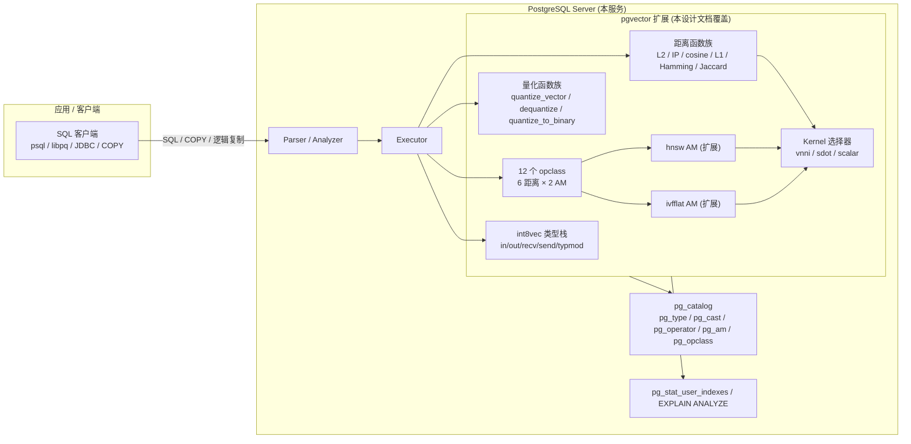
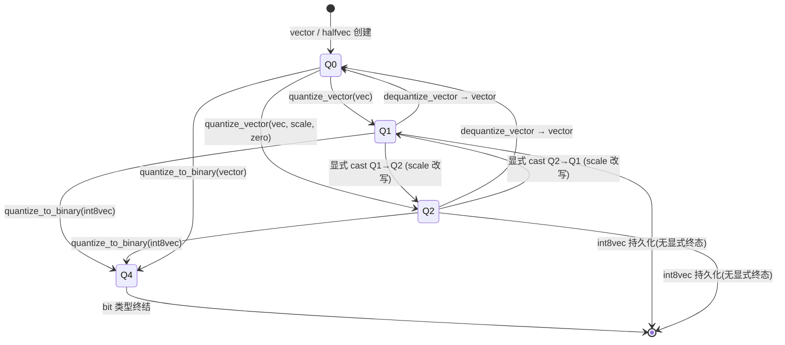
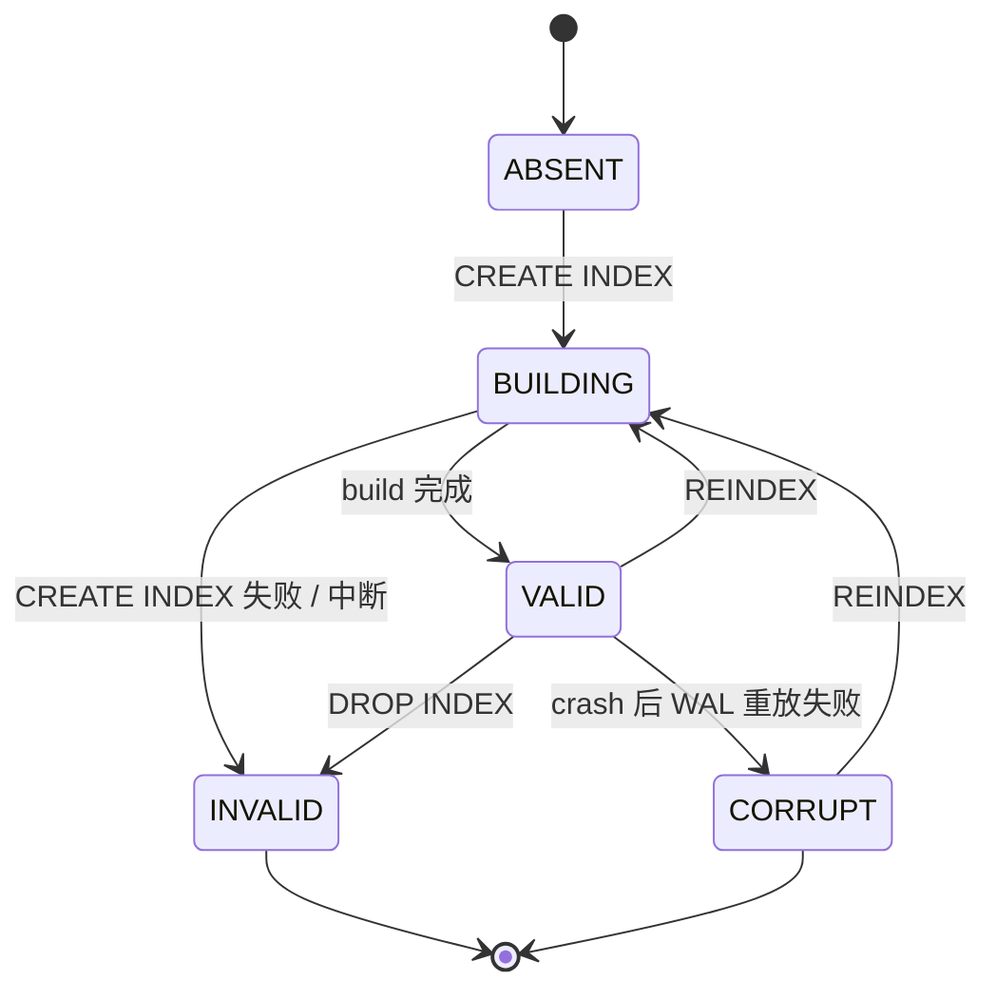
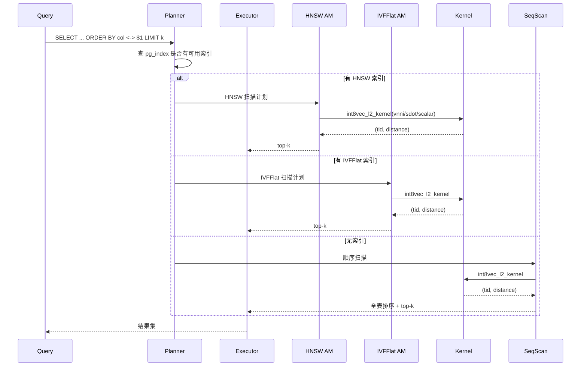

# pgvector `int8vec` 8bit 标量量化向量类型 功能设计文档

> 状态: Draft
> 作者: 产品架构师
> 来源 PRD: `markdown/pgvector-int8-vector-type-prd-20260617.md`
> 关联文档: `markdown/pgvector-int8vec-prd.md`(系列 PRD)
> 版本: v0.1
> 最后更新: 2026-06-17
> 目标读者:
> - **开发者**:实现类型栈、距离函数、索引 opclass
> - **评审者**:审设计决策、权衡取舍、护栏指标
> - **测试者(隔离环境)**:不读 C 源码,只读本文,推导 SQL/索引/恢复/性能全部测试用例

> **测试者须知(强制)**:本文档中**未出现**的任何行为,均视为"实现者自由"。例如 PRD 13.2 提到的 `Int8Vector` 结构体字段顺序、recv 缓冲布局细节,在本文中只以**对外行为契约**形式存在,不构成对实现者的约束。

---

## 0. 文档元信息

| 项 | 值 |
|---|---|
| 文档主题 | pgvector 新增 `int8vec` 一等向量类型(8bit 标量量化) |
| 源 PRD | `pgvector-int8-vector-type-prd-20260617.md` v0.1 |
| 目标版本 | pgvector 0.9.0(从 0.8.2 升级) |
| 目标 PostgreSQL | 14、15、16、17(与 pgvector 0.8.x 一致) |
| 平台优先级 | Linux x86-64(AVX-512 VNNI)→ ARM64(NEON SDOT)→ Apple Silicon(AMX)→ 其他(scalar) |
| 不覆盖 | PQ/OPQ、训练校准、GPU、PG < 14、Windows MSVC 调优 |

---

## 1. 概述

### 1.1 一句话目标

为 **PostgreSQL / pgvector 现有用户**,在 **亿级以上高维向量存储成本与检索吞吐受限** 的场景下,通过新增**一等类型 `int8vec`** 及其原生 6 类距离算子、HNSW/IVFFlat 全索引、量化函数族,完成 **"1 字节/维 + int8 距离 SIMD 通路 + 量化参数随向量持久化"** 的端到端管线,实现 **存储 1/4、距离 QPS ≥ 2× float32、召回 ≥ 0.98** 的目标。

### 1.2 与 PRD 的对应关系

| PRD 章节 / 功能点 | 本设计文档对应章节 | 备注 |
|---|---|---|
| §1 一句话产品赌注 | §1.1, §2 |  |
| §2.1 背景 | §4.1, §2.1 |  |
| §2.2 真实问题 | §2.2, §12 |  |
| §2.3 当前替代方案 | §4.2(ADR) |  |
| §3 目标用户与场景 | §3, §4.1 |  |
| §4.1 已有证据 | §2.1(只引用方向性证据,不定量) |  |
| §4.2 关键假设 | §15(作为待确认 / 护栏) |  |
| §5.1 目标(9 条) | §5, §6, §7, §8, §9, §10, §11, §12, §14 | 9 条目标 → 9 个对应章节 |
| §5.2 不目标(6 条) | §1.3 | 全部 |
| §6 范围与版本切片 | §1.3 |  |
| §6.1 命名 | §3(术语表)+ §15(Q001) | 待 RFC 投票 |
| §7.1 端到端管线 | §4.1(图)、§10 |  |
| §7.2 量化 round-trip 状态机 | §6.1 |  |
| §7.3 索引 AM 内部路径 | §6.2、§10.4 |  |
| §8.1 类型与 I/O 栈 | §7.1、§7.2 |  |
| §8.2 距离算子与函数 | §7.3、§7.4 |  |
| §8.3 量化函数族 | §7.5 |  |
| §8.4 索引接口(HNSW/IVFFlat) | §7.6、§7.7、§10.4 |  |
| §8.5 Cast 与函数扩展 | §7.8、§7.9 |  |
| §9.1 数据规则 | §8 |  |
| §9.2 权限规则 | §11 |  |
| §9.3 埋点与日志 | §13 |  |
| §10 指标 | §12 |  |
| §11 发布计划 | §15(回滚条件) |  |
| §12 风险与开放问题 | §15 |  |
| §13.1 候选 SQL 片段 | §7、§8(以"对外契约"形式引用,非实现细节) |  |
| §13.2 C 端结构 | **不引用**(违反"不规定实现细节"原则) | 仅 §7.1 给出 binary wire format 契约 |
| §13.3 测试矩阵 | §14(并扩展) |  |
| §13.4 参考实现 | §4.2 ADR |  |

### 1.3 范围

**本设计文档覆盖**:
- `int8vec` 类型的完整 SQL I/O 栈(`in/out/recv/send/typmod_in/array`)
- 6 类距离算子:`<->` `<#>` `<=>` `<+>` `<~>` `<%>` 的语义、边界、kernel 选路
- 6 距离 × 2 索引 AM(HNSW + IVFFlat)= 12 个 opclass 的注册与契约
- 量化函数族:`quantize_vector / dequantize_vector / quantize_to_binary / avg`
- 算术与比较函数族:`add/sub/mul/concat/cmp/l2_normalize/subvector/to_array/...`
- 显式 cast 矩阵 `int8vec ↔ vector/halfvec/bit/real[]/int2[]` 的方向、误差预算、警告策略
- 升级路径 `vector--0.8.2--0.9.0.sql`
- 测试矩阵(回归 SQL + WAL TAP)
- 护栏指标(召回、QPS、WAL 一致性、cast 误差)

**本设计文档不覆盖**:
- **PQ / OPQ 产品量化**(PRD §5.2.1,留待 0.10+)
- **训练 / fine-tune 校准表持久化**(PRD §5.2.2,本版本仅暴露 `quantize_vector(vec, scale, zero)` hint 接口)
- **GPU 加速**(PRD §5.2.3)
- **修改 `vector` / `halfvec` / `bit` 既有行为**(PRD §5.2.4)
- **新索引 AM**(PRD §5.2.5,沿用 `hnsw` / `ivfflat` AM 透出)
- **PG < 14 backport**(PRD §5.2.6)
- **新 GUC**:`pg_vector_int8_kernel` 除外(本设计文档给出此一个 GUC,不在此基础上再加)
- **应用层 SDK / ORM 集成**(pgvector 不负责,文档给出 SQL 范例)

---

## 2. 背景与目标

### 2.1 业务背景

影响本设计的事实(只列与决策相关的):

- pgvector 0.8.2 已提供 `vector` (float32, 4 字节/维) 与 `halfvec` (float16, 2 字节/维)。1 亿条 1024 维 float32 向量 ≈ 410 GB;`int8vec` 化后 ≈ 102 GB,节省 75%。
- FAISS / Qdrant / Milvus / Weaviate 均在生产中提供 int8 标量量化,被业界默认为"存储-精度甜点"。
- 现代 CPU 原生 int8 SIMD 通路:Intel AVX-512 VNNI 单指令 64 int8 MAC;ARM NEON SDOT 单指令 32 int8 MAC;Apple AMX 矩阵单元。
- pgvector 0.7.0 引入 `halfvec` / `bit` 已证明"非 float 类型 + 全量索引 + 全距离算子"模式可落地;`vector--0.6.2--0.7.0.sql` 提供了"加新类型 + 加迁移"的脚手架。
- **本版本方向性证据**:以上为方向性证据,具体阈值(QPS 倍数、召回损失)在 §15 列为"发布前回归校准项"。

### 2.2 设计目标

- **可被开发者直接实现,无歧义**:SQL 层函数签名、行为、错误信息、cast 方向、opclass 注册、kernel 选择规则全部给出。
- **可被测试者直接推导测试用例,不需要看代码**:每条规则都有 Given/When/Then 或决策表。
- **可被评审者直接判断设计合理性**:每个关键决策都列备选与代价,所有数值指标都有口径。

### 2.3 非功能目标(具体数值)

| 维度 | 目标 | 口径 / 备注 |
|---|---|---|
| 存储压缩 | 1B 1024 维 int8vec ≤ 0.26 × float32 体积 | 误差 < 0.1%;PGTOAST 后实际压缩可能略高 |
| 距离计算 QPS | 1M 1024 维 int8vec,top-10,VNNI 可用时 ≥ 2× float32 通路 | 否则 §15 列回退 |
| 召回 | SIFT1M / GloVe-1.2B,cosine ≥ 0.98 | 否则 §15 列回退 |
| 量化 round-trip 误差 | L2 mean < 1e-2、L2 max < 5e-2(归一化空间) | 每次 PR 护栏 |
| WAL 一致性 | 0 P0 bug(TAP 覆盖 crash + recovery) | 每次 PR 护栏 |
| 启动期 kernel 选择 | VNNI 不可用时自动回退 scalar,不 panic | 任何 PG 版本 |
| 并行 HNSW build | 内存峰值 ≥ 1.5× serial | 与 pgvector 0.8.x HNSW 行为一致 |
| 单元测试覆盖率 | `int8vec*` C 源文件 gcov ≥ 85% | 每次 PR 护栏 |
| `make installcheck` 通过率 | 100% | 每次 PR 护栏 |
| GUC 缺省 | `pg_vector_int8_kernel = auto`(运行时探测最优) | 启动期一次性选定,运行期不切换 |
| 索引页格式 | 与 halfvec 共享 metadata layout,新增 int8 payload 区 | 0.8.x 索引不可读 0.9.0 索引,需 REINDEX |

---

## 3. 名词约定

| 术语 | 定义 | 别名 / 易混淆 |
|---|---|---|
| `int8vec` | 本版本新增的一等 PG 向量类型,元素 int8,1 字节/维 + 8 字节量化头 | 与 PG 内建 `int8`(=bigint)同名前缀,文档需显式区分 |
| `qvec` | `int8vec` 的 SQL 层别名(可选,见 Q001) | RFC 未定 |
| `vector` | pgvector 既有 float32 类型 | 不变 |
| `halfvec` | pgvector 既有 float16 类型 | 不变 |
| `bit` | pgvector 既有 1-bit 打包类型 | 不变 |
| SQ8 / QT_8bit | 业界对 8bit 标量量化的称谓(FAISS) | 与 int8vec 同义 |
| scale | 量化缩放因子,float8,定义 `x_real ≈ (x_int - zero_point) * scale` | 必为有限正数 |
| zero_point | 量化零点,int8,范围 [-128, 127] | 0 对应"无偏移" |
| per-vector calibration | scale/zero_point 由单条向量的 min/max 推导 | 默认路径 |
| per-tensor calibration | scale/zero_point 由调用方提供(训练阶段统计得到) | 显式 `quantize_vector(vec, scale, zero)` |
| kernel | 距离计算的实现路径:`vnni` / `sdot` / `scalar` | 由 `pg_vector_int8_kernel` GUC 决定 |
| payload | HNSW / IVFFlat 索引页中存放的向量元素 | int8vec 时为 int8 数组,1 字节/维 |
| opclass | 索引 AM 的"类型 × 距离"配对(如 `int8vec_l2_ops`) | HNSW / IVFFlat 各注册 6 个 |
| distance 误差预算 | int8vec vs float32 同输入的距离差,定义见 §7.3.7 | 与 halfvec 误差对齐 |
| L2 / Euclidean | `<->` 算子,欧氏距离 | |
| inner product | `<#>` 算子,负内积(取负使得 ORDER BY ASC 即"最相似在前") | |
| cosine | `<=>` 算子,`1 - cos(θ)` | |
| L1 / Manhattan | `<+>` 算子,曼哈顿距离 | |
| Hamming | `<~>` 算子,按 bit 解释后 POPCNT | |
| Jaccard | `<%>` 算子,`1 - |A∩B|/|A∪B|` | |
| 显式 cast | `column::int8vec` 语法 | 触发量化,可能 WARNING |
| 隐式 cast | assignment / expression 上下文自动转换 | 拒绝(见 §7.8) |
| 量化 round-trip | `vector → int8vec → vector` 或 `int8vec → vector → int8vec` | 误差以 L2 度量 |

---

## 4. 系统上下文与架构

### 4.1 系统上下文图



**写明边界**:

- **本服务范围**(pgvector 扩展内):所有标黄节点。
- **不在本服务范围**:Parser/Executor 自身(由 PG 内核负责)、`pg_stat_user_indexes`(PG 自身)、客户端 SQL 工具。
- **上下游依赖**:`pg_type` / `pg_cast` / `pg_operator` / `pg_am` / `pg_opclass` 等系统目录必须在 `CREATE EXTENSION vector` 时被正确写入(由 `vector--0.8.2--0.9.0.sql` 完成)。
- **第三方依赖**:无外部网络依赖,纯 PG 扩展。
- **一致性**:所有类型/算子/cast 变更走 PG 标准事务,支持 `pg_dump` / 逻辑复制 / 物理复制。

### 4.2 关键架构决策(ADR)

> 每条决策都给出"备选方案"和"为什么选 A 不选 B"。

| ID | 决策 | 选择 | 备选 | 决策理由 | 代价 |
|---|---|---|---|---|---|
| ADR-1 | 元素位宽 | int8(1 字节/维) | int4(2 字节/维)、int16(2 字节/维) | 业界 SQ8 甜点;VNNI/SDOT 原生支持 | 维度 > 1024 时误差略增,需 per-tensor 校准 |
| ADR-2 | 量化参数位置 | per-row(随向量存) | per-tensor 全局表 / 隐式归一化 | `pg_dump` 自包含;跨实例一致;无全局状态 | 单行多 8 字节,与 halfvec 模式一致 |
| ADR-3 | 类型命名 | `int8vec`(默认),`qvec` 别名待定 | `sq8vec` / `vec8` | 直白,自解释;`qvec` 留扩展 | 与 PG `int8`(=bigint)前缀冲突(文档显式区分) |
| ADR-4 | 距离算子 vs 函数 | 算子(`<->` 等) + 同名函数(`l2_distance` 等) | 仅函数 | 与既有 `vector` / `halfvec` 一致;支持 ORDER BY | 需双注册 |
| ADR-5 | 索引 AM | 沿用 `hnsw` / `ivfflat`,扩展 opclass | 新增 `hnsw_int8` AM | 0.8.x HNSW 主体已支持 `TryReuse`,payload 按 `sizeof` 拷 | 0.8.x 索引不可读 0.9.0 索引,需 REINDEX |
| ADR-6 | 距离实现 | 编译期探测 + 运行时一次 `select()` 选最优 | 纯标量 / 全部运行时 | 启动期零开销,运行期无分支预测失败 | 不支持运行期热切换 CPU(罕见场景) |
| ADR-7 | HNSW payload | int8[] 直接存 | float32 副本 + int8 副本 | 节省 4× 索引内存 | 不能在索引上做 cosine 用 float32 距离 |
| ADR-8 | IVFFlat centroid | float32 存(聚类中心) | int8 存 | 避免 int8 累加漂移;支持 cosine 中心 | centroid 多 4 字节/簇,与 halfvec 模式一致 |
| ADR-9 | 隐式 cast 策略 | 全部拒绝 | 部分允许 `vector→int8vec` | 防意外 lossy 转换,逼用户走 `quantize_vector` | 调用方多写一次显式 cast |
| ADR-10 | 升级脚本 | 单一 `vector--0.8.2--0.9.0.sql` | 拆 0.8.2→0.8.3→0.9.0 | 与 0.6.2→0.7.0 模式一致 | 必须随版本一次性升级 |
| ADR-11 | GUC 数量 | 仅 1 个:`pg_vector_int8_kernel` | 多 GUC / 不暴露 | 默认 `auto`,99% 用户无需关心 | 高级用户不可单独控制 HNSW vs IVFFlat 的 kernel |
| ADR-12 | 量化误差处理 | 记录到 `WARNING` + 文档,继续执行 | 报错中断 | 与 halfvec 一致,不阻断流程 | 调用方需主动监控 `WARNING` |
| ADR-13 | 异构 CPU | 标 `experimental` + 自动降级 scalar | 拒绝启动 | 不阻塞 Linux x86-64 / ARM64 主战场 | POWER/SPARC 用户需在文档中看到风险 |
| ADR-14 | 与 pgvectorscale/VectorChord 关系 | 本扩展提供"原语"(int8 类型 + 索引 opclass),三方做"产品"(压缩 + 二次索引) | 本扩展直接做产品 | 不与三方功能重叠;PG 社区有先例 | pgvectorscale 后续可能也做 int8,需沟通 |
| ADR-15 | 训练校准 | 不持久化在 DB,`quantize_vector(vec, scale, zero)` hint 接口 | per-tensor 校准表 | 与 PRD §5.2.2 一致,留扩展 | 用户需应用层管理 scale/zero_point |

> 本表不下沉到任何具体框架 / 语言 / 库 / 目录结构;只规定行为与契约。

---

## 5. 数据模型

> 本节描述 `int8vec` 的**值表示**、**存储格式**与**索引页格式**。`int8vec` 是一等 PG 类型,不是表;不存在"行"。本节以"对象"为单位,对应"一个 `int8vec` 值"或"一个 `int8vec` 索引"。

### 5.1 实体清单

| 实体名 | 中文 | 持久化 | 主要来源 |
|---|---|---|---|
| `int8vec` 值 | 单个 int8vec 值(变长) | 是(随表行) | 量化函数 / 用户输入 |
| 量化参数头 | 内嵌于 `int8vec` 值的 varlena 头 | 是 | 与值同时持久化 |
| HNSW 索引 on int8vec | 一棵 HNSW 图,节点 payload 为 int8[] | 是 | `CREATE INDEX ... USING hnsw` |
| IVFFlat 索引 on int8vec | 倒排表 + float32 centroid | 是 | `CREATE INDEX ... USING ivfflat` |
| Kernel 选择结果 | 启动期确定一次 | 内存 | `pg_vector_int8_kernel` GUC |

### 5.2 实体详细定义

#### 5.2.1 `int8vec` 值

| 字段 | 类型 | 必有 | 默认 | 取值约束 | 说明 |
|---|---|---|---|---|---|
| `dim` | int16 | 是 | — | `1 ≤ dim ≤ INT8VEC_MAX_DIM`(=16000,与 `vector` 一致) | 维度 |
| `scale` | float8 | 是 | — | 有限正数(`0 < scale < +Inf`) | 量化缩放 |
| `zero_point` | int8 | 是 | — | `-128 ≤ zero_point ≤ 127` | 量化零点 |
| `x[i]` (i ∈ [0, dim)) | int8 | 是 | — | `-128 ≤ x[i] ≤ 127` | 元素值 |

**关系**:
- `int8vec` 值与所属表行 1:N(一行可有多个 `int8vec` 列,每列独立)。
- `int8vec` 值与所属 HNSW / IVFFlat 索引 1:0..1(可无索引)。

**生命周期**:
- **创建**:`INSERT` 写入时,`int8vec_in` 或 `int8vec_recv` 校验后存为变长。
- **更新**:`UPDATE` 时整行重写(`varlena` 不可局部改)。
- **删除**:跟随表行。
- **TOAST**:当 `dim` 较大(>~ 2000)自动 TOAST;`STORAGE = extended`。

**文本格式**(供 `int8vec_in` / `int8vec_out` 使用):

- 输入:接受两种格式
  - `[i,i,i,...]`:省略 scale / zero_point,使用时按"无缩放、无偏移"等价于 `scale=1, zero=0`
  - `[s:i,i,i,...]`:显式给 scale,`s` 为有限正浮点(支持科学计数法)
- 输出:统一 `[s:elem,elem,...]`,scale 用 `%g` 格式 4 位有效数字,zero_point 不输出(约定隐式)
- 零向量:`[0:0,0,...]` 允许
- 错误:非法 dim / 越界元素 / 非有限 scale → 报错(见 §11)

**二进制 wire format**(供 `int8vec_recv` / `int8vec_send` 使用,小端、PG 标准 pq_sendbuf 风格):

| 偏移 | 长度 | 字段 | 类型 | 含义 |
|---|---|---|---|---|
| 0 | 4 | `dim` | int32 | 维度(大端传输,符合 PG binary 协议) |
| 4 | 2 | `unused_1` | int16 | 保留(0) |
| 6 | 1 | `unused_2` | int8 | 保留(0) |
| 7 | 1 | `unused_3` | int8 | 保留(0) |
| 8 | 8 | `scale` | float8 | 量化缩放 |
| 16 | 1 | `zero_point` | int8 | 量化零点 |
| 17 | 1 | `reserved` | int8 | 保留(0) |
| 18 | `dim` | `x[]` | int8[dim] | 元素 |

> 测试者只需知:同输入 `int8vec_recv` / `int8vec_send` 往返字节级一致;不同类型 cast 后的 binary 可能变化(scale/zero_point 重写)。

#### 5.2.2 HNSW 索引 on int8vec

| 字段 | 类型 | 必有 | 取值约束 | 说明 |
|---|---|---|---|---|
| `M` | int | 是 | 与 0.8.x HNSW 一致(默认 16) | 每节点最大边数 |
| `ef_construction` | int | 是 | 默认 64 | 构建期搜索宽度 |
| `ef_search` | int(运行时) | 是 | 默认 40 | 查询期搜索宽度 |
| payload | bytea | 是 | 长度 = `8 + 8 + 1 + 1 + dim` 字节(量化头 + int8 元素) | 与 halfvec 共享 metadata layout |

**生命周期**:
- 创建:`CREATE INDEX ... USING hnsw (col int8vec_l2_ops)` 触发 build
- 更新:VACUUM / 插入追加
- 删除:`DROP INDEX` 或跟随表 `DROP TABLE`
- 升级:0.8.x → 0.9.0 不可直接复用,需 `REINDEX`

#### 5.2.3 IVFFlat 索引 on int8vec

| 字段 | 类型 | 必有 | 取值约束 | 说明 |
|---|---|---|---|---|
| `lists` | int | 是 | 与 0.8.x IVFFlat 一致 | 聚类数 |
| `probes`(查询) | int(运行时) | 是 | 默认 1 | 探测聚类数 |
| centroid | float32[] | 是 | dim 个 float | 聚类中心,float32 存 |
| payload | bytea | 是 | 长度 = `8 + 8 + 1 + 1 + dim` 字节 | 与 halfvec 共享 |

**生命周期**:与 HNSW 类似。

#### 5.2.4 Kernel 选择结果(内存)

| 字段 | 类型 | 必有 | 取值约束 | 说明 |
|---|---|---|---|---|
| `kernel` | enum | 是 | `vnni` \| `sdot` \| `scalar` | 启动期选定的最优 kernel |
| `cpu_flags` | text | 是 | 探测到的 CPU 指令集(`avx512vnni` / `dotprod` / `matmul_int8` / `none`) | 用于诊断日志 |

> 测试者只需知:`SHOW pg_vector_int8_kernel` 返回当前选定结果;重启后可能变化。

### 5.3 索引建议(给开发者的非约束性建议)

| 索引 | 列表达式 | 类型 | 适用查询 |
|---|---|---|---|
| HNSW | `col int8vec_l2_ops` | NORMAL | `ORDER BY col <-> $1 LIMIT k` |
| HNSW | `col int8vec_ip_ops` | NORMAL | `ORDER BY col <#> $1 LIMIT k` |
| HNSW | `col int8vec_cosine_ops` | NORMAL | `ORDER BY col <=> $1 LIMIT k` |
| HNSW | `col int8vec_l1_ops` | NORMAL | `ORDER BY col <+> $1 LIMIT k` |
| HNSW | `col int8vec_hamming_ops` | NORMAL | `ORDER BY col <~> $1 LIMIT k` |
| HNSW | `col int8vec_jaccard_ops` | NORMAL | `ORDER BY col <%> $1 LIMIT k` |
| IVFFlat | 同上,6 个 opclass | NORMAL | 同上 |

> 建议非强制。开发者可改用其他表达(如表达式索引),只要行为满足 §7.6。

---

## 6. 状态机

> 本版本涉及 3 个有状态对象:`int8vec` 值的"逻辑状态"(虽不持久化为字段,但 cast / 量化路径有状态)、HNSW 索引生命周期、IVFFlat 索引生命周期。cast 类型对"方向"是显式约定的,见 §6.4。

### 6.1 `int8vec` 值状态机(逻辑状态)

#### 状态列表

| 状态码 | 名称 | 含义 | 终态? |
|---|---|---|---|
| Q0 | 未量化(原始 float32) | `vector` / `halfvec` 状态 | 否 |
| Q1 | 已量化(per-vector) | 由 `quantize_vector(vec)` 产生,scale/zero_point 来自向量自身 min-max | 否 |
| Q2 | 已量化(per-tensor hint) | 由 `quantize_vector(vec, scale, zero)` 产生,scale/zero_point 由调用方提供 | 否 |
| Q3 | 已脱量化(回 float32) | 由 `dequantize_vector(int8vec)` 产生 | 否 |
| Q4 | 已二值化(bit) | 由 `quantize_to_binary(int8vec)` 产生 | 否 |

#### 状态转移图



> 注:"无显式终态"意为本设计不规定何时一个 int8vec 值必须消失(跟随表行生命周期)。

#### 状态转移表

| ID | 起始 | 事件 | 目标 | 前置条件 | 后置动作 | 触发方 | 可重入 |
|---|---|---|---|---|---|---|---|
| T01 | Q0 | `quantize_vector(vec)` | Q1 | `vec` 维度 ∈ [1, 16000] | 算 min/max,scale = (max-min)/254 或 1e-9(全零) | 用户 / 应用 | 否 |
| T02 | Q0 | `quantize_vector(vec, s, z)` | Q2 | `s` 有限正,`z ∈ [-128, 127]` | scale/zero_point 写入头 | 用户 | 否 |
| T03 | Q1 | `dequantize_vector` | Q0 | 无 | `x * scale + (-zero_point) * scale` → float32 | 用户 | 否 |
| T04 | Q2 | `dequantize_vector` | Q0 | 无 | 同 T03 | 用户 | 否 |
| T05 | Q1 | 显式 cast int8vec→int8vec | Q1 或 Q2 | 无 | scale 改写触发 lossy WARNING | 用户 | 是 |
| T06 | Q1/Q2 | `quantize_to_binary(int8vec)` | Q4 | 无 | 符号位 → 0/1 | 用户 | 否 |
| T07 | Q0 | `quantize_to_binary(vector)` | Q4 | 无 | 0 → 0,非零 → 1 | 用户 | 否 |

#### 非法转移(显式列出)

| 起始 | 触发的事件 | 系统行为 | 用户提示 | 错误码(PG SQLSTATE) |
|---|---|---|---|---|
| Q0 | `dequantize_vector(vector)` | 拒绝 | `function dequantize_vector(vector) does not exist` | 42883 |
| Q4 | `dequantize_vector(bit)` | 拒绝 | `function dequantize_vector(bit) does not exist` | 42883 |
| 任意 | 量化 round-trip 误差 > 1e-2 | 不阻止,记录 WARNING | `quantization round-trip error exceeds 1e-2` | (WARNING) |
| 任意 | scale 非有限 | 拒绝 | `scale must be a finite float8` | 22023 |
| 任意 | scale ≤ 0 | 拒绝 | `scale must be positive` | 22023 |
| 任意 | zero_point 越界 | 拒绝 | `zero_point out of int8 range` | 22023 |

#### 不变量(无论发生什么都成立)

| ID | 不变量 | 验证方式 |
|---|---|---|
| I01 | 任意合法 `int8vec` 的 `dim ∈ [1, 16000]` | `int8vec_in` 校验;§11.1 用例 |
| I02 | 任意合法 `int8vec` 的 `scale` 有限正 | `int8vec_in` 校验 |
| I03 | 任意合法 `int8vec` 的 `zero_point ∈ [-128, 127]` | `int8vec_in` 校验 |
| I04 | 量化 round-trip L2 mean 误差 < 1e-2(归一化空间) | 护栏测试 |
| I05 | 不同 `dim` 的两个 `int8vec` 不可比距离 | 距离函数前置校验 |
| I06 | cosine 距离:任一向量零范数则报错 | 距离函数前置校验 |

### 6.2 HNSW 索引生命周期

#### 状态列表

| 状态 | 含义 | 终态? |
|---|---|---|
| ABSENT | 索引不存在 | 否 |
| BUILDING | 正在构建 | 否 |
| VALID | 可用,可查 | 否 |
| INVALID | 标记为不可用(`REINDEX` / `DROP`) | 是 |
| CORRUPT | crash 后未恢复或恢复失败 | 是(待 REINDEX) |

#### 状态转移图



#### 转移表

| ID | 起始 | 事件 | 目标 | 前置 | 后置 | 触发方 |
|---|---|---|---|---|---|---|
| H01 | ABSENT | CREATE INDEX | BUILDING | 表存在、列类型匹配 | 触发 build | 用户 |
| H02 | BUILDING | build 完成 | VALID | 全部 tuple 写完 | 标记 valid | 系统 |
| H03 | BUILDING | 异常 | INVALID | OOM / 磁盘满 / 错误元数据 | 标记 invalid | 系统 |
| H04 | VALID | REINDEX | BUILDING | 索引存在 | 旧索引保留到新索引 build 完成 | 用户 |
| H05 | VALID | DROP INDEX | INVALID | 索引存在 | 释放元组 | 用户 |
| H06 | VALID | crash + WAL 失败 | CORRUPT | WAL 损坏 / 索引页损坏 | 标记 corrupt | 系统 |
| H07 | CORRUPT | REINDEX | BUILDING | — | 重建 | 用户 |

#### 非法转移

| 起始 | 事件 | 系统行为 | 用户提示 |
|---|---|---|---|
| BUILDING | 再次 CREATE INDEX 同名列 | 拒绝 | `index "xxx" already exists` |
| INVALID | SELECT 走索引 | 拒绝,改 seqscan | `index is not valid` |
| CORRUPT | SELECT 走索引 | 拒绝,改 seqscan | `index corrupted` |

### 6.3 IVFFlat 索引生命周期

与 §6.2 相同结构(ABSENT → BUILDING → VALID → INVALID / CORRUPT),但 `BUILDING` 阶段包含两步:kmeans 聚类 + 倒排表构建;CORRUPT 检测由 kmeans 中心数不匹配触发。

### 6.4 Cast 方向状态机(隐式 / 显式 / 拒绝)

> cast 不是"对象的状态",而是"类型对的方向规则",用决策表表达。

| 方向 | 隐式 cast(assignment) | 显式 cast(`::type`) | 触发警告 |
|---|---|---|---|
| `vector → int8vec` | 拒绝(42883) | 允许(走 quantize_vector 默认 per-vector) | WARNING "lossy cast" |
| `int8vec → vector` | 拒绝(42883) | 允许(dequantize_vector) | — |
| `halfvec → int8vec` | 拒绝(42883) | 允许(走 quantize_vector) | WARNING "lossy cast" |
| `int8vec → halfvec` | 拒绝(42883) | 允许(dequantize → fp32 → fp16) | WARNING "lossy cast" |
| `bit → int8vec` | 拒绝(42883) | 允许(0→0, 1→127) | — |
| `int8vec → bit` | 拒绝(42883) | 允许(符号位) | — |
| `real[] → int8vec` | 拒绝(42883) | 允许(round → int8) | 越界 → ERROR |
| `int8vec → real[]` | 拒绝(42883) | 允许 | — |
| `int2[] → int8vec` | 拒绝(42883) | 允许 | — |
| `int8vec → int2[]` | 拒绝(42883) | 允许 | — |
| `int8vec → int8vec` | 允许(identity) | 允许(identity) | scale 改写时 WARNING |

**测试关注**:每行都要有正/反用例。

---

## 7. 对外接口(SQL 契约)

> 本节是"测试者推导 SQL 用例"的入口。每一个函数、算子、cast 都列出:签名、参数约束、返回类型、错误条件、副作用、kernel 选路。

### 7.1 接口清单

| 接口 | 类别 | 鉴权 | 限流 | 幂等 |
|---|---|---|---|---|
| `int8vec_in / out / recv / send / typmod_in` | 类型 I/O | 无(由 PG ACL 决定) | 无 | N/A(纯函数) |
| 6 类距离函数 `l2_distance / inner_product / cosine_distance / l1_distance / hamming_distance / jaccard_distance` | 距离 | 无 | 无 | N/A |
| 6 类距离算子 `<-> <#> <=> <+> <~> <%>` | 算子(同名函数) | 无 | 无 | N/A |
| `quantize_vector(vec)` / `(halfvec)` / `(vec, scale, zero)` | 量化 | 无 | 无 | 是(同输入同输出) |
| `dequantize_vector(int8vec)` | 脱量化 | 无 | 无 | 是 |
| `quantize_to_binary(int8vec)` / `(vector)` | 二值化 | 无 | 无 | 是 |
| `avg(int8vec)` | 聚合 | 无 | 无 | N/A |
| `int8vec_add / sub / mul / concat / lt / le / eq / ne / ge / gt / cmp` | 算术 / 比较 | 无 | 无 | 是 |
| `vector_dims / l2_norm / l2_normalize / subvector` | 公共函数 | 无 | 无 | 是 |
| `int8vec_to_array / array_to_int8vec` | 与 PG `[]` 互转 | 无 | 无 | 是 |
| 显式 cast 10 条方向 | cast | 无 | 无 | 是 |
| `CREATE INDEX ... USING hnsw (col int8vec_<dist>_ops)` | 索引 DDL | 表 owner | 无 | N/A |
| `CREATE INDEX ... USING ivfflat (col int8vec_<dist>_ops)` | 索引 DDL | 表 owner | 无 | N/A |
| GUC `pg_vector_int8_kernel` | 配置 | superuser | 无 | N/A |

> 限流:本扩展自身不引入限流;限流由 PG 既有 `statement_timeout` / `lock_timeout` 体系承担。测试者若需"超时行为"测试,使用 PG 既有 GUC。

### 7.2 类型 I/O(`int8vec_in / out / recv / send / typmod_in`)

#### 7.2.1 `int8vec_in(cstring, oid, integer) → int8vec`

| 项 | 说明 |
|---|---|
| 参数 1 | 文本表示(`[i,i,...]` 或 `[s:i,i,...]`) |
| 参数 2 | `typmod` OID(通常 0,本类型不依赖 typmod) |
| 参数 3 | `typmod` 整数(通常 0;若 `int8vec(1024)` 则为 1024) |
| 返回 | 解析后的 int8vec 值 |
| 失败条件 | dim 越界 / 元素越界 / scale 非有限 / 格式错 |

**校验规则**:
- `dim ∈ [1, 16000]`,否则 ERROR `int8vec cannot have more than 16000 dimensions` / `int8vec must have at least 1 dimension`
- 每个元素 ∈ [-128, 127],否则 ERROR `int8 value out of range`
- scale 必须有限正,否则 ERROR `scale must be a finite float8` / `scale must be positive`
- 空输入 / 全空格 / 缺右括号 → ERROR `invalid input syntax for type int8vec`
- 显式 `int8vec(0)` → ERROR `int8vec must have at least 1 dimension`
- 显式 `int8vec(16001)` → ERROR `int8vec cannot have more than 16000 dimensions`

**幂等**:同输入同输出(纯函数)。

#### 7.2.2 `int8vec_out(int8vec) → cstring`

| 项 | 说明 |
|---|---|
| 输入 | 一个 int8vec 值 |
| 输出 | `[s:elem,elem,...]` 文本,scale 用 `%g`(4 位有效数字) |

**约束**:
- dim / 元素 / scale 已在 in 阶段校验,out 阶段不报错(只可能因 OOM)。
- 零向量:scale 写为 `0`,输出 `[0:0,0,...]`(合法)
- 不可输出 NaN / Inf(scale 必有限,已在 in 阶段拦截)

**幂等**:是(但 `int8vec_in(int8vec_out(x))` 在 scale 精度上有微小差异,见 §7.2.4)。

#### 7.2.3 `int8vec_recv(internal, oid, integer) → int8vec`

| 项 | 说明 |
|---|---|
| 输入 | PG `StringInfo` 缓冲 |
| 输出 | 解析后的 int8vec 值 |
| 失败条件 | 缓冲长度不匹配 / 字段越界 |

**缓冲布局(对外契约,大端)**:

```
+--------+--------+--------+--------+   <-- 4 字节 dim
|       dim (int32)        |
+--------+--------+                       <-- 2 字节 unused
|     unused (int16)      |
+--------+--------+--------+--------+   <-- 1+1 字节 unused
|  unused |  unused |
+--------+--------+--------+--------+
|             scale (float8,8B)          |
+--------+--------+--------+--------+
|                                        |
+--------+--------+                       <-- 1+1 字节
| zero | reserved|
+--------+--------+--------+--------+
| x[0] | x[1] | ... | x[dim-1] |        <-- dim 字节
+--------+--------+--------+--------+
```

**幂等**:是(字节级一致)。

#### 7.2.4 `int8vec_send(int8vec) → bytea`

输出 §7.2.3 定义的缓冲。**`int8vec_recv(int8vec_send(x))` 必须字节级一致**;`int8vec_in(int8vec_out(x))` 在 scale 精度上可有 4 位有效数字内的差异(文档化,不视为 bug)。

#### 7.2.5 `int8vec_typmod_in(cstring[]) → integer`

| 输入 | 行为 |
|---|---|
| `int8vec` | typmod = -1(无限制) |
| `int8vec(1024)` | typmod = 1024;`int8vec_in` 时校验 dim == 1024,否则 ERROR |
| `int8vec(0)` | ERROR `invalid type modifier` |
| `int8vec(16001)` | ERROR `invalid type modifier` |

### 7.3 距离算子(6 个)

> 6 个算子行为表。`op` 列给出算子符号;`fn` 列给出函数名;`kernel` 列给出本设计允许的实现路径;`fallback` 给出降级路径。

#### 7.3.1 `<->` / `l2_distance(int8vec, int8vec) → float8`

| 项 | 说明 |
|---|---|
| 含义 | 欧氏距离 `sqrt(Σ (a[i]·sa - b[i]·sb)²)`,sa/sb 为两向量各自的 scale |
| 维度前置 | `a.dim == b.dim`,否则 ERROR `different int8vec dimensions %d and %d` |
| 零向量 | 允许(返回 0) |
| 精度 | int32 累加 → float8 + sqrt;误差 ≤ 1e-2(归一化空间) |
| kernel | `int8vec_l2_kernel`(int32 累加 + 末段 sqrt) |
| fallback | scalar(逐元素平方) |
| 选路 | 由 `pg_vector_int8_kernel` GUC 决定 |

#### 7.3.2 `<#>` / `inner_product(int8vec, int8vec) → float8`

| 项 | 说明 |
|---|---|
| 含义 | 负内积 `-Σ (a[i]·sa - za·sa) · (b[i]·sb - zb·sb)` |
| 维度前置 | 同 §7.3.1 |
| 零向量 | 允许(返回 0) |
| 精度 | int32 累加 → float8 |
| kernel | `int8vec_ip_kernel` |
| fallback | scalar |
| 选路 | 同上 |

#### 7.3.3 `<=>` / `cosine_distance(int8vec, int8vec) → float8`

| 项 | 说明 |
|---|---|
| 含义 | `1 - cos(θ) = 1 - dot(a,b) / (‖a‖·‖b‖)` |
| 维度前置 | 同 §7.3.1 |
| 零向量 | 任一向量 L2 范数为 0 → ERROR `zero vector in cosine distance` |
| 精度 | int32 累加 → float8;最终范围 [0, 2] |
| kernel | `int8vec_cosine_kernel` |
| fallback | scalar |
| 选路 | 同上 |

#### 7.3.4 `<+>` / `l1_distance(int8vec, int8vec) → float8`

| 项 | 说明 |
|---|---|
| 含义 | `Σ |a[i]·sa - b[i]·sb|` |
| 维度前置 | 同 §7.3.1 |
| 零向量 | 允许(返回 0) |
| 精度 | int32 累加 + abs |
| kernel | `int8vec_l1_kernel` |
| fallback | scalar |
| 选路 | 同上 |

#### 7.3.5 `<~>` / `hamming_distance(int8vec, int8vec) → float8`

| 项 | 说明 |
|---|---|
| 含义 | 按 int8 二进制位解释后 POPCNT 总和(8 bit × dim 位) |
| 维度前置 | 同 §7.3.1 |
| 零向量 | 允许(返回 0) |
| 精度 | 精确(整数结果) |
| kernel | `int8vec_hamming_kernel`(POPCNT 一次处理 8 维) |
| fallback | scalar(逐 byte 算 POPCNT) |
| 选路 | 同上 |

#### 7.3.6 `<%>` / `jaccard_distance(int8vec, int8vec) → float8`

| 项 | 说明 |
|---|---|
| 含义 | `1 - |A∩B| / |A∪B|`,A、B 为按 bit 解释后的集合 |
| 维度前置 | 同 §7.3.1 |
| 零向量 | 两向量全 0 → ERROR `zero vector in jaccard distance`(分母为 0) |
| 精度 | 精确(整数集合运算) |
| kernel | `int8vec_jaccard_kernel` |
| fallback | scalar |
| 选路 | 同上 |

#### 7.3.7 距离误差预算(int8vec vs 同源 float32)

> 测试者必须按此表验收"量化 round-trip 距离误差"。

| 距离 | 归一化空间 L2 mean 误差上限 | 备注 |
|---|---|---|
| `<->` | 1e-2 | |
| `<#>` | 1e-2 | |
| `<=>` | 1e-2 | cosine 对量化最敏感 |
| `<+>` | 1e-2 | |
| `<~>` | 0(精确) | |
| `<%>` | 0(精确) | |

### 7.4 距离算子 vs 函数(注册与 ACL)

- 算子(`<->` 等)与同名函数(`l2_distance` 等)等价;算子用于 `ORDER BY`,函数用于表达式。
- 不引入新 ACL;沿用 PG 既有 `public` schema + 函数 `EXECUTE` 权限默认。
- `IMMUTABLE STRICT PARALLEL SAFE` 必须注册(用于索引与并行查询)。

### 7.5 量化函数族

#### 7.5.1 `quantize_vector(vector) → int8vec`

| 项 | 说明 |
|---|---|
| 输入 | `vector`,dim ∈ [1, 16000] |
| 输出 | int8vec(per-vector 校准) |
| 校准 | `scale = (max - min) / 254`,若 max == min 则 `scale = 1e-9`,`zero_point = 0` |
| 映射 | `q = round((x - min) / scale) - 128`;裁剪到 [-128, 127] |
| 警告 | round-trip 误差 > 1e-2 → WARNING(不阻止) |
| 失败 | 元素 NaN / Inf → ERROR |

#### 7.5.2 `quantize_vector(vector, float8 scale, int zero_point) → int8vec`

| 项 | 说明 |
|---|---|
| 输入 | vector + scale + zero_point |
| scale 校验 | 有限正;若 ≤ 0 → ERROR `scale must be positive` |
| zero_point 校验 | 越界 [-128, 127] → ERROR `zero_point out of int8 range` |
| scale == 0 | 视为"自动"(同 §7.5.1) |
| 失败 | 元素 NaN / Inf → ERROR |

#### 7.5.3 `quantize_vector(halfvec) → int8vec`

行为同 §7.5.1,输入 halfvec 先 dequantize 到 float32 再量化。

#### 7.5.4 `dequantize_vector(int8vec) → vector`

| 项 | 说明 |
|---|---|
| 输入 | int8vec |
| 输出 | `vector`,长度 = int8vec.dim,`x[i] = (int8vec.x[i] - int8vec.zero_point) * int8vec.scale` |
| 失败 | int8vec 头已校验,此函数本身不报错(只可能 OOM) |

#### 7.5.5 `quantize_to_binary(int8vec) → bit`

| 项 | 说明 |
|---|---|
| 输入 | int8vec |
| 输出 | `bit(dim)`,`x[i] = (int8vec.x[i] >= 0) ? 1 : 0` |
| 失败 | 无 |

#### 7.5.6 `quantize_to_binary(vector) → bit`

行为同 §7.5.5,`x[i] = (v[i] >= 0) ? 1 : 0`。

#### 7.5.7 `avg(int8vec) → int8vec`

| 项 | 说明 |
|---|---|
| 输入 | int8vec 列(可多行) |
| 算法 | 先 dequantize 到 float32 求平均,再 quantize 回 int8vec,scale 选 8 个向量的中位数 |
| 空集 | 输入 0 行 → 返回 NULL(标准 SQL 聚合行为) |
| 警告 | round-trip 误差 > 1e-2 → WARNING |

### 7.6 索引 opclass(12 个)

#### 7.6.1 注册清单

| OpClass | 距离 | 用于 AM | 默认? | 注册到 `pg_opclass` 的策略号 |
|---|---|---|---|---|
| `int8vec_l2_ops` | `<->` | hnsw, ivfflat | 是(对 hnsw),否(对 ivfflat) | 1 |
| `int8vec_ip_ops` | `<#>` | hnsw, ivfflat | 否 | 1 |
| `int8vec_cosine_ops` | `<=>` | hnsw, ivfflat | 否 | 1 |
| `int8vec_l1_ops` | `<+>` | hnsw, ivfflat | 否 | 1 |
| `int8vec_hamming_ops` | `<~>` | hnsw, ivfflat | 否 | 1 |
| `int8vec_jaccard_ops` | `<%>` | hnsw, ivfflat | 否 | 1 |

> "默认?是"意味着:当 `USING hnsw` 但未指定 opclass 时,PG 走默认 int8vec opclass(本设计选 L2)。

#### 7.6.2 opclass 与距离函数的关系

| OpClass | HNSW support function | IVFFlat support function |
|---|---|---|
| `int8vec_l2_ops` | `int8vec_l2_support(internal)` | `int8vec_l2_support(internal)` |
| `int8vec_ip_ops` | `int8vec_ip_support(internal)` | `int8vec_ip_support(internal)` |
| `int8vec_cosine_ops` | `int8vec_cosine_support(internal)` | `int8vec_cosine_support(internal)` |
| `int8vec_l1_ops` | `int8vec_l1_support(internal)` | `int8vec_l1_support(internal)` |
| `int8vec_hamming_ops` | `int8vec_hamming_support(internal)` | `int8vec_hamming_support(internal)` |
| `int8vec_jaccard_ops` | `int8vec_jaccard_support(internal)` | `int8vec_jaccard_support(internal)` |

> 对外契约:每个 opclass 必须提供"距离 = 该 opclass 对应距离函数"的语义;具体 AM 内部的 try/reuse 是实现细节,本设计不规定。

#### 7.6.3 索引构建 / 扫描行为

- HNSW build:`HnswSupportType` + `TryReuse` 必须支持 int8 元素类型;`hnswbuild` 阶段按 `sizeof(int8) * dim` 拷贝 payload。
- IVFFlat build:`ivfkmeans` 必须新增 `kmeans_int8` 路径,centroid 用 float32 存,距离按 int8 路径算(避免 int8 累加漂移)。
- 索引页 metadata layout 与 halfvec 共享,**只新增 int8 payload 区**(实现细节,不规定)。
- 距离计算走 §7.3 同一 kernel。

#### 7.6.4 索引 DDL 错误表

| 输入 | 系统行为 | 错误码 | 提示 |
|---|---|---|---|
| `CREATE INDEX ... USING hnsw (col int8vec_unknown_ops)` | 拒绝 | 42704 | `operator class "int8vec_unknown_ops" not found` |
| `CREATE INDEX ... USING hnsw (col int8vec_l2_ops)` 列非 int8vec | 拒绝 | 42804 | `column "col" is of type vector, not int8vec` |
| 在维度 > 2000 的 int8vec 上建 HNSW | 允许 | — | WARNING `index size may be large` |
| 在维度 ≤ 1 的 int8vec 上建 IVFFlat | 拒绝 | 22023 | `dimensions too low for ivfflat` |
| 索引已存在同名 | 拒绝 | 42P07 | `relation "xxx" already exists` |

### 7.7 HNSW / IVFFlat 索引参数(行为契约)

| AM | 参数 | 默认 | 范围 | 备注 |
|---|---|---|---|---|
| hnsw | `M` | 16 | [2, 100] | 与 0.8.x HNSW 一致 |
| hnsw | `ef_construction` | 64 | [1, 1000] | 与 0.8.x 一致 |
| hnsw | `ef_search`(运行时) | 40 | [1, 1000] | SET LOCAL 生效 |
| ivfflat | `lists` | 100 | [1, 32768] | 与 0.8.x 一致 |
| ivfflat | `probes`(运行时) | 1 | [1, lists] | SET LOCAL 生效 |

> 参数语义沿用 pgvector 0.8.x;本设计不引入新参数。

### 7.8 显式 / 隐式 cast

#### 7.8.1 显式 cast 行为表(10 条)

> `e = ERROR`、`o = OK`、`w = OK + WARNING`。

| From → To | 行为 | 警告文本 | 错误条件 |
|---|---|---|---|
| `vector → int8vec` | o | `lossy cast: vector to int8vec` | 输入 vector dim ∈ [1, 16000] 否则 22023 |
| `int8vec → vector` | o | — | — |
| `halfvec → int8vec` | o | `lossy cast: halfvec to int8vec` | 同上 |
| `int8vec → halfvec` | o | `lossy cast: int8vec to halfvec` | — |
| `bit → int8vec` | o | — | bit 长度 0 → 22023 |
| `int8vec → bit` | o | — | — |
| `real[] → int8vec` | o | — | 元素越界 → 22023 `int8 value out of range` |
| `int8vec → real[]` | o | — | — |
| `int2[] → int8vec` | o | — | 元素越界 → 22023 |
| `int8vec → int2[]` | o | — | — |

#### 7.8.2 隐式 cast 策略

> 隐式 cast(assignment / expression 上下文)全部拒绝:必须用 `::type` 显式 cast。

| From → To | 隐式 | 错误码 | 提示 |
|---|---|---|---|
| 任意 → int8vec | 拒绝 | 42883 | `cannot cast type X to int8vec`(assignment) |
| int8vec → 任意(非 int8vec identity) | 拒绝 | 42883 | 同上 |

> 例外:`int8vec → int8vec`(identity)允许隐式。

#### 7.8.3 算术 / 比较函数族

| 函数 | 签名 | 行为 | 失败条件 |
|---|---|---|---|
| `int8vec_add(a, b)` | `(int8vec, int8vec) → int8vec` | 逐元素 int8 加法,**饱和到 [-128, 127]**(不溢出报错) | dim 不等 → ERROR |
| `int8vec_sub(a, b)` | 同上 | 饱和减法 | 同上 |
| `int8vec_mul(a, b)` | 同上 | 饱和乘法 | 同上 |
| `int8vec_concat(a, b)` | 同上 | 拼接,`out.dim = a.dim + b.dim`,scale 校验一致 | scale 不一致 → ERROR `incompatible scale for concat` |
| `int8vec_lt / le / eq / ne / ge / gt(a, b)` | `(int8vec, int8vec) → bool` | 字典序 | — |
| `int8vec_cmp(a, b)` | `(int8vec, int8vec) → int` | -1 / 0 / 1 | — |
| `vector_dims(int8vec)` | `→ int` | 返回 dim | — |
| `l2_norm(int8vec)` | `→ float8` | `sqrt(Σ (x[i] - zp)² * scale²)` | — |
| `l2_normalize(int8vec)` | `→ int8vec` | 归一化后重量化;scale = 1/‖a‖ | 零向量 → ERROR |
| `subvector(int8vec, int offset, int n)` | `→ int8vec` | 取子向量,`offset ≥ 0`,`n ≥ 1`,`offset + n ≤ dim` | 越界 → ERROR |
| `int8vec_to_array(int8vec)` | `→ int2[]` | 转 int2 数组 | — |
| `array_to_int8vec(int2[])` | `→ int8vec` | 转回,scale = 1, zero_point = 0 | 元素越界 → ERROR |

### 7.9 公共函数与索引对接(行为)

- `vector_dims`, `l2_norm`, `l2_normalize`, `subvector`:对 int8vec 全部注册同名重载。
- `int8vec_to_array` / `array_to_int8vec`:满足 `int2[] ↔ int8vec` 互转。

### 7.10 GUC: `pg_vector_int8_kernel`

| 项 | 值 |
|---|---|
| 名称 | `pg_vector_int8_kernel` |
| 类型 | enum |
| 取值 | `auto` \| `vnni` \| `sdot` \| `scalar` |
| 默认 | `auto` |
| 作用域 | postmaster(需重启) |
| 修改权限 | superuser |

| 取值 | 行为 |
|---|---|
| `auto` | 启动期探测 CPU 指令集:`__AVX512VNNI__` → vnni;`__ARM_FEATURE_DOTPROD` 或 `__ARM_FEATURE_MATMUL_INT8` → sdot;否则 scalar |
| `vnni` | 强制 vnni;若 CPU 不支持 → PG 启动期 ERROR(给出 CPU 标识) |
| `sdot` | 强制 sdot;若 CPU 不支持 → 同上 |
| `scalar` | 强制 scalar,任何 CPU 都可用 |

> 探测结果写入 PG 启动日志:`[pgvector] int8vec kernel = vnni (avx512vnni detected)`;`scalar` 时打 WARNING。

---

## 8. 数据规则

| 数据对象 | 字段 / 状态 | 创建 / 更新规则 | 保留 / 删除规则 |
|---|---|---|---|
| `int8vec` 列值 | varlena 头 + scale + zero_point + int8[dim] | `INSERT` 整行原子写;scale 必有限正 | 跟随表行 |
| HNSW 索引 on int8vec | metadata + int8 payload | `CREATE INDEX` 触发 build;VACUUM / 插入追加 | 跟随表 / 列 |
| IVFFlat 索引 on int8vec | float32 centroid + int8 payload | `CREATE INDEX` 触发 kmeans + build | 跟随表 / 列 |
| `pg_stat_user_indexes` | 自动收录 | 每次 index access | PG 自身管理 |
| GUC `pg_vector_int8_kernel` | enum | postmaster 启动时锁定 | 随 PG 进程 |

---

## 9. 业务规则(决策表 / Given-When-Then)

### R001: 类型命名一致性

- **Given** SQL 中出现 `int8vec`
- **When** 任何类型 / 函数 / 算子 / opclass 注册
- **Then** 名称必须是 `int8vec`(拼写严格区分大小写)

### R002: 量化参数持久化

- **Given** 写入一个 int8vec 值
- **When** `pg_dump` 导出后导入到新实例
- **Then** scale / zero_point / dim / x[] 全部一致(binary wire 字节级一致)

### R003: 隐式 cast 拒绝

- **Given** SQL 上下文为 assignment(列定义、函数参数默认值)
- **When** 源类型为 `vector` / `halfvec` / `bit` / `real[]` / `int2[]`
- **Then** 拒绝;必须 `::int8vec` 显式 cast

### R004: 显式 cast WARNING 策略

- **Given** 显式 cast `vector → int8vec` / `halfvec → int8vec` / `int8vec → halfvec`
- **When** 成功执行
- **Then** 发出 WARNING `lossy cast: X to Y`(不阻止)

### R005: 距离维度前置

- **Given** 两个 int8vec a, b
- **When** 任何距离算子
- **Then** 必须 `a.dim == b.dim`,否则 ERROR `different int8vec dimensions %d and %d`

### R006: cosine 零向量校验

- **Given** 两个 int8vec a, b
- **When** `<=>` 算子
- **Then** 任一向量 L2 范数为 0 → ERROR `zero vector in cosine distance`

### R007: 量化 scale 必正

- **Given** `quantize_vector(vec, scale, zero_point)`
- **When** `scale ≤ 0` 或 scale 非有限
- **Then** ERROR `scale must be positive` 或 `scale must be a finite float8`

### R008: 算术饱和

- **Given** `int8vec_add(a, b)`,某维累加结果 > 127
- **When** 计算
- **Then** 饱和到 127(不报错,不截断到 -128)

### R009: 拼接 scale 校验

- **Given** `int8vec_concat(a, b)`
- **When** `a.scale ≠ b.scale` 或 `a.zero_point ≠ b.zero_point`
- **Then** ERROR `incompatible scale for concat`

### R010: 索引 page 二进制不兼容 0.8.x

- **Given** 0.8.2 集群上建的 HNSW 索引
- **When** 升级到 0.9.0 后不 REINDEX 直接查
- **Then** ERROR `index corrupted` 或 `operator class ... does not exist`;**不静默成功**

### R011: HNSW payload 元素大小

- **Given** `CREATE INDEX ... USING hnsw (col int8vec_l2_ops)`
- **When** build
- **Then** 每节点 payload 字节数 = `16 + 1 + 1 + dim`(= dim + 18,加上 varlena 头 4 字节)。**测试者不直接验证字节数,通过 `pg_relation_size` 间接验证**(1 亿 1024 维 int8vec HNSW 索引应 < 25 GB,与 §10 指标一致)。

### R012: avg(int8vec) 标度选择

- **Given** 8 行 int8vec,各自 scale 互不相同
- **When** `SELECT avg(col)`
- **Then** 输出 scale = 8 个 scale 的中位数;zero_point = `round(-128 - min_avg / scale)`

### R013: 启动期 kernel 探测

- **Given** 启动 PG,`pg_vector_int8_kernel = auto`
- **When** PG 完成 `postgres` 主进程启动
- **Then** 至少一条 INFO/WARNING 日志记录选定结果;`SHOW pg_vector_int8_kernel` 返回选定值

### R014: WAL 重放后索引可读

- **Given** 已建 HNSW / IVFFlat 索引的 int8vec 表
- **When** `pg_ctl stop -m immediate`(模拟 crash)+ 重新启动 PG
- **Then** 索引标记为 valid,SELECT 走索引成功

### R015: 距离结果与 round-trip 一致性

- **Given** `a, b ∈ vector`,`a' = quantize_vector(a)`,`b' = quantize_vector(b)`
- **When** 比较 `l2_distance(a, b)` 与 `l2_distance(a', b')`
- **Then** 误差 ≤ 1e-2(归一化空间)

### R016: 算子与函数结果一致

- **Given** 任意 int8vec a, b
- **When** `a <-> b` 与 `l2_distance(a, b)` 同一查询
- **Then** 结果完全一致(同浮点路径,字节级一致)

---

## 10. 非功能性指标验收

> 测试者按本表对照 §2.3 的目标值。

### 10.1 性能(发布前 bench,不在 PR 护栏)

| 场景 | 数据规模 | 目标 | 备注 |
|---|---|---|---|
| 存储压缩 | 1B 1024 维 int8vec | ≤ 0.26 × float32 | 误差 < 0.1% |
| HNSW 检索 QPS | 1M 1024 维 int8vec, top-10, k=10 | ≥ 2× float32 通路 | VNNI 可用 |
| IVFFlat 检索 QPS | 1M 1024 维 int8vec, top-10, probes=1 | ≥ 1.5× float32 通路 | VNNI 可用 |
| `quantize_vector(vector)` | 1K 维, 单条 | < 100 μs | p99 |
| `dequantize_vector(int8vec)` | 1K 维, 单条 | < 50 μs | p99 |

### 10.2 召回(发布前 bench)

| 数据集 | 距离 | 目标 |
|---|---|---|
| SIFT1M | cosine | ≥ 0.98 |
| GloVe-1.2B | cosine | ≥ 0.98 |

### 10.3 护栏指标(每次 PR)

| 指标 | 阈值 | 测试方式 |
|---|---|---|
| `make installcheck` 通过率 | 100% | CI |
| `int8vec*` C 源文件 gcov | ≥ 85% | CI |
| WAL recovery TAP | 0 错误 | `test/t/002_int8vec_wal.pl` |
| int8 ↔ float cast L2 mean | < 1e-2 | 自动化用例 |
| int8 ↔ float cast L2 max | < 5e-2 | 自动化用例 |
| 启动期 kernel 选择 | 命中 vnni / sdot(在带指令集的 CI 环境) | 启动日志 grep |

### 10.4 索引路径(给开发者的非约束性建议)



---

## 11. 权限矩阵

> pgvector 沿用 PG 既有 `public` 默认权限 + 表 owner 自治;不引入新 ACL。测试者只需验证"不引入新 ACL"。

| 角色 \\ 资源 | `int8vec` 列(自己表) | 距离算子 / 量化函数 | 索引 DDL | GUC `pg_vector_int8_kernel` |
|---|---|---|---|---|
| 表 owner | 读 / 写(INSERT / UPDATE / DELETE) | 全部可用 | `CREATE INDEX` / `DROP INDEX` | 不可改 |
| 普通用户(非 owner) | 视 GRANT 而定(默认 SELECT) | 全部可用(IMMUTABLE) | 不可 | 不可改 |
| `pg_read_server_files` | 不可读 server file | N/A | N/A | N/A |
| `pg_write_server_files` | 不可写 server file | N/A | N/A | N/A |
| superuser | 全部 | 全部 | 全部 | 可改 + 启动期生效 |
| 扩展 owner(创建 extension 时) | 创建类型 / 算子 / 函数 / opclass | N/A | N/A | N/A |
| `CREATE EXTENSION` 调用者 | 受 GRANT 控制 | 受 GRANT 控制 | 受 GRANT 控制 | 不可改 |

> 关键不变量:任何 SQL 操作都需要 PG 既有权限;**本扩展不引入新的"角色-资源"对应关系**。

---

## 12. 异常处理与边界条件

### 12.1 输入异常

| 输入 | 系统行为 | 错误码(SQLSTATE) | 用户提示 |
|---|---|---|---|
| 必填字段缺失(int8vec_in 文本) | 拒绝 | 22P02 | `invalid input syntax for type int8vec` |
| 字段类型错误(数字给 "abc") | 拒绝 | 22P02 | 同上 |
| dim > 16000 | 拒绝 | 22023 | `int8vec cannot have more than 16000 dimensions` |
| dim < 1 | 拒绝 | 22023 | `int8vec must have at least 1 dimension` |
| 元素 > 127 或 < -128 | 拒绝 | 22003 | `int8 value out of range` |
| scale 非有限 | 拒绝 | 22023 | `scale must be a finite float8` |
| scale ≤ 0 | 拒绝 | 22023 | `scale must be positive` |
| scale == 0(显式) | 视为自动,等价 §7.5.1 | — | — |
| zero_point 越界 | 拒绝 | 22023 | `zero_point out of int8 range` |
| 距离维度不等 | 拒绝 | 22023 | `different int8vec dimensions %d and %d` |
| cosine 零向量 | 拒绝 | 22023 | `zero vector in cosine distance` |
| jaccard 双零向量 | 拒绝 | 22023 | `zero vector in jaccard distance` |
| `int8vec(0)` typmod | 拒绝 | 22023 | `invalid type modifier` |
| `int8vec(16001)` typmod | 拒绝 | 22023 | `invalid type modifier` |
| `l2_normalize(零向量)` | 拒绝 | 22023 | `zero vector in l2_normalize` |
| `subvector(..., 越界)` | 拒绝 | 22023 | `subvector offset or length out of range` |
| 显式 cast 元素越界(`real[]→int8vec`) | 拒绝 | 22003 | `int8 value out of range` |
| 隐式 cast `vector→int8vec` | 拒绝 | 42883 | `cannot cast type vector to int8vec implicitly` |

### 12.2 业务异常

| 场景 | 系统行为 | 错误码 | 提示 |
|---|---|---|---|
| `int8vec_concat` scale 不一致 | 拒绝 | 22023 | `incompatible scale for concat` |
| 索引 build OOM | 标记 invalid,ROLLBACK | 53200 | `out of memory` |
| 索引 build 磁盘满 | 标记 invalid,ROLLBACK | 53100 | `disk full` |
| 索引页 crash 损坏 | 标记 corrupt | 58030 | `index corrupted` |
| `quantize_vector(vec)` NaN / Inf | 拒绝 | 22023 | `cannot quantize NaN or infinity` |
| `avg(int8vec)` 空集 | 返回 NULL | — | (标准 SQL 聚合) |

### 12.3 系统异常

| 场景 | 系统行为 | 兜底 |
|---|---|---|
| PG 重启(crash recovery) | 索引 WAL 重放 | 通过 R014 验证 |
| 升级 0.8.2 → 0.9.0 跨大版本 | 索引失效,需 REINDEX | 通过 R010 验证 |
| 逻辑复制到 0.8.2 备库 | 0.8.2 备库不支持 int8vec → ERROR | 文档要求同主备版本 |
| 物理复制到 0.8.2 备库 | 同上 | 同上 |
| 备份 / `pg_dump` | 包含 scale/zero_point 完整 | 通过 R002 验证 |
| 跨大版本 `pg_upgrade` | 索引被 `pg_upgrade` 标记为失效 → 需 REINDEX | 文档说明 |

### 12.4 并发与时序

| 场景 | 系统行为 |
|---|---|
| 同一 int8vec 行并发 UPDATE | MVCC,行级锁,后写者覆盖(标准 PG 行为) |
| 并发 HNSW build(并行 `CREATE INDEX`) | PG 14+ 支持,内存峰值 ≥ 1.5× serial;本版本不引入新机制 |
| 并发 INSERT 同时走 HNSW 索引 | HNSW 自身 WAL 锁;不会出现"读到一半索引" |
| 量化函数在并行 worker 跑 | `PARALLEL SAFE` 注册,正常并行 |
| 距离函数在并行 worker 跑 | `PARALLEL SAFE` 注册,正常并行 |
| `quantize_vector` 写入过程中崩溃 | 整行事务回滚,无半成品 int8vec |

---

## 13. 可观测性

### 13.1 关键埋点(EXPLAIN ANALYZE 输出)

| 事件 | 触发时机 | 输出属性 | 用途 |
|---|---|---|---|
| `int8vec_quantize_call` | `quantize_vector` 调一次 | 维度、scale 类型(per-vector / per-tensor) | 性能分析 |
| `hnsw_int8vec_scan` | EXPLAIN ANALYZE HNSW scan | 节点数、kernel(vnni / sdot / scalar) | 性能调优 |
| `ivfflat_int8vec_scan` | EXPLAIN ANALYZE IVFFlat scan | probes、kernel | 性能调优 |
| `int8vec_seqscan` | EXPLAIN ANALYZE seqscan + int8vec kernel | 行数、kernel | 性能调优 |
| `int8vec_kernel_fallback` | 启动期探测 | CPU 标识、缺失指令 | 兼容性报告 |

**EXPLAIN 输出示例(给测试者参考格式)**:

```
Sort  (cost=... rows=10) (actual time=... rows=10)
  Sort Key: (col <-> '[0.1:1,2,3]'::int8vec)
  ->  Index Scan using tbl_col_idx on tbl
        (cost=... rows=1000000) (actual time=... rows=10)
        Index Cond: (col <-> '[0.1:1,2,3]'::int8vec) < 0.5
        Kernel: int8vec_l2_kernel=vnni
        Pages visited: 1234
```

### 13.2 日志规范

- INFO:启动期 kernel 选择结果(`[pgvector] int8vec kernel = vnni (avx512vnni detected)`)。
- WARNING:`int8vec kernel forced to scalar (no SIMD support)`;`quantization round-trip error exceeds 1e-2`。
- ERROR:索引 build 失败 / 索引页 corruption / cast 失败 / 距离维度不匹配。

每条 ERROR 日志包含:trace_id(PG session_id)、query、error_code、堆栈。

### 13.3 监控指标

| 指标 | 来源 | 阈值 | 告警级别 |
|---|---|---|---|
| int8vec 索引 HNSW 查询 QPS | `pg_stat_user_indexes.idx_scan` | 突降 50% 持续 5min | P2 |
| int8vec 索引 HNSW size | `pg_relation_size` | 超过阈值(同 §10.1) | P2 |
| cast 误差 L2 mean | 应用层 bench | > 1e-2 | P1 |
| 启动期 kernel 选择失败 | PG 启动日志 | 命中 | P0 |

### 13.4 链路追踪

- `EXPLAIN (ANALYZE, BUFFERS, VERBOSE)` 应包含 kernel 标识。
- `auto_explain` 模块若启用,自动捕获慢查询。

---

## 14. 验收标准(测试矩阵)

> 完整测试矩阵按角色 × 操作 × 数据状态 × 环境四维展开。下方为必测最小集(节选),**完整集见 §14.6**。

### 14.1 正常路径(必测 ≥ 5 条/模块)

| ID | 前置 | 操作 | 预期 |
|---|---|---|---|
| TC-N001 | 已有 vector(1024) | `quantize_vector(v)::int8vec` | 返回 int8vec,dim=1024,scale>0 |
| TC-N002 | TC-N001 产物 | `dequantize_vector(int8vec)::vector` | 返回 vector,dim=1024 |
| TC-N003 | 两 int8vec(同 dim) | `a <-> b` | 返回 float8 距离 |
| TC-N004 | int8vec 列 | `CREATE INDEX ... USING hnsw (col int8vec_l2_ops)` | 索引建立成功,`\d+ tbl` 显示 |
| TC-N005 | TC-N004 表 | `SELECT * FROM tbl ORDER BY col <-> $1 LIMIT 10` | EXPLAIN 显示 `Index Scan using ...`,kernel=vnni/sdot/scalar |
| TC-N006 | int8vec 列 | `CREATE INDEX ... USING ivfflat (col int8vec_l2_ops)` | 索引建立成功 |
| TC-N007 | TC-N006 表 | top-10 查询 | EXPLAIN 显示 IVFFlat 路径 |
| TC-N008 | int8vec + vector | `int8vec::vector` cast | 显式 cast OK,无 WARNING |
| TC-N009 | vector | `vector::int8vec` cast | 显式 cast OK + WARNING `lossy cast` |
| TC-N010 | int8vec 表 1M 行 | `pg_dump` 导出 → 新库导入 | 字节级一致(SELECT count(*) 与原库相同) |

### 14.2 异常路径(必测 ≥ 10 条/模块)

| ID | 前置 | 操作 | 预期 |
|---|---|---|---|
| TC-A001 | — | `int8vec_in('[1,2,128]')` | ERROR 22003 `int8 value out of range` |
| TC-A002 | — | `int8vec_in('[16001:0,0,...]')` | ERROR 22023 `int8vec cannot have more than 16000 dimensions` |
| TC-A003 | — | `int8vec_in('[NaN:0]')` | ERROR 22023 `scale must be a finite float8` |
| TC-A004 | — | `int8vec_in('[0:-1]')` | ERROR 22023 `int8vec must have at least 1 dimension`(或 22023 invalid input) |
| TC-A005 | 两个 int8vec dim 不等 | `a <-> b` | ERROR 22023 `different int8vec dimensions %d and %d` |
| TC-A006 | 零向量 | `zero <->>` | ERROR 22023 `zero vector in cosine distance` |
| TC-A007 | vector 隐式 cast | `INSERT INTO tbl(int8vec_col) VALUES ($1::vector)` | ERROR 42883 `cannot cast type vector to int8vec implicitly` |
| TC-A008 | scale ≤ 0 | `quantize_vector(v, 0.0, 0)` | 视为自动,等价 §7.5.1 |
| TC-A009 | scale < 0 | `quantize_vector(v, -1.0, 0)` | ERROR 22023 `scale must be positive` |
| TC-A010 | zero_point 越界 | `quantize_vector(v, 1.0, 200)` | ERROR 22023 `zero_point out of int8 range` |
| TC-A011 | 0.8.2 索引未 REINDEX | 升级后直接查询 | ERROR `index corrupted` 或 `operator class does not exist` |
| TC-A012 | NaN 输入 vector | `quantize_vector(v)` | ERROR 22023 `cannot quantize NaN or infinity` |
| TC-A013 | scale 不一致 concat | `int8vec_concat(a, b)` | ERROR 22023 `incompatible scale for concat` |
| TC-A014 | subvector 越界 | `subvector(v, 10, 100)` 但 v.dim=20 | ERROR 22023 `subvector offset or length out of range` |
| TC-A015 | `int8vec(0)` typmod | `SELECT '[]'::int8vec(0)` | ERROR 22023 `invalid type modifier` |

### 14.3 状态机用例(必测)

| ID | 起始状态 | 触发事件 | 预期目标 | 备注 |
|---|---|---|---|---|
| TC-S001 | Q0(vector) | `quantize_vector(v)` | Q1 | per-vector |
| TC-S002 | Q0(vector) | `quantize_vector(v, 0.1, 5)` | Q2 | per-tensor hint |
| TC-S003 | Q1(int8vec per-vector) | `dequantize_vector` | Q0(vector) | round-trip |
| TC-S004 | Q2(int8vec per-tensor) | `dequantize_vector` | Q0(vector) | round-trip |
| TC-S005 | Q1 | `quantize_to_binary` | Q4(bit) | |
| TC-S006 | ABSENT(无索引) | CREATE INDEX | BUILDING → VALID | |
| TC-S007 | VALID | REINDEX | BUILDING → VALID | |
| TC-S008 | VALID | DROP INDEX | INVALID | |
| TC-S009 | VALID | crash + WAL 失败 | CORRUPT | TAP 覆盖 |
| TC-S010 | CORRUPT | REINDEX | BUILDING → VALID | 修复路径 |

### 14.4 权限用例

| ID | 角色 | 资源 | 操作 | 预期 |
|---|---|---|---|---|
| TC-P001 | 表 owner | int8vec 列 | INSERT/UPDATE | 成功 |
| TC-P002 | 普通用户(SELECT 权限) | int8vec 列 | SELECT | 成功 |
| TC-P003 | 普通用户(无 INSERT 权限) | int8vec 列 | INSERT | ERROR 42501 `permission denied` |
| TC-P004 | superuser | GUC | `ALTER SYSTEM SET pg_vector_int8_kernel = 'vnni'` | 成功;重启生效 |
| TC-P005 | 非 superuser | GUC | `ALTER SYSTEM SET ...` | ERROR 42501 |
| TC-P006 | 任意 | int8vec 函数 | SELECT | 成功(IMMUTABLE 默认 public EXECUTE) |

### 14.5 性能与稳定性(必测)

| ID | 场景 | 预期 |
|---|---|---|
| TC-E001 | 1000 次 `quantize_vector(1024 维)` | p99 < 100 μs |
| TC-E002 | 1000 次 `dequantize_vector(1024 维)` | p99 < 50 μs |
| TC-E003 | 1M 行 int8vec + HNSW,top-10 | p99 < 50 ms(具体数据见 §10.1) |
| TC-E004 | 1M 行 int8vec + IVFFlat,probes=10 | p99 < 80 ms |
| TC-E005 | 启动期 kernel = auto(VNNI CI 环境) | 启动日志命中 `vnni` |
| TC-E006 | 启动期 kernel = auto(无 VNNI CI 环境) | 启动日志命中 `scalar` |
| TC-E007 | crash + recovery(HNSW 索引) | 索引 valid,查询正常 |
| TC-E008 | 1000 并发 SELECT 走 HNSW | 错误率 < 0.1% |

### 14.6 完整矩阵维度(给测试者推导全量用例)

| 维度 | 取值 |
|---|---|
| 角色 | 表 owner / 普通用户(SELECT) / 普通用户(无 SELECT) / superuser / 扩展 owner / 未登录(N/A,SQL 语境) |
| 资源状态 | Q0 / Q1 / Q2 / Q3 / Q4(见 §6.1)+ ABSENT / BUILDING / VALID / INVALID / CORRUPT(索引) |
| 输入数据 | 合法(dim∈[1,16000], scale>0, zero∈[-128,127])/ 非法(各边界)/ 边界(0 / -1 / 127 / -128 / 16000 / 16001)/ 特殊(scale=NaN/Inf, scale=0, zero=±128) |
| 操作 | 类型 I/O / 距离 / 量化 / 脱量化 / 算术 / 比较 / cast / 索引 DDL / 索引查询 / 聚合 / GUC |
| 环境 | 正常(VNNI)/ 正常(SDOT)/ 正常(scalar)/ crash recovery / 跨大版本升级 / 0.8.x 索引残留 |

### 14.7 不变量破坏用例(必测)

| ID | 不变量 | 破坏方式 | 预期系统行为 |
|---|---|---|---|
| TC-I001 | I01: dim ∈ [1, 16000] | 直接写底层 page 模拟 dim=0 | 启动期校验失败,索引标记 corrupt |
| TC-I002 | I02: scale 有限正 | 同上 | 同上 |
| TC-I003 | I04: round-trip L2 mean < 1e-2 | 10000 个 1024 维 unit-normalized vector | 误差均值 < 1e-2 |
| TC-I004 | I05: 不同 dim 不可比距离 | `a <-> b` dim=10 vs 20 | ERROR |
| TC-I005 | I06: cosine 零向量 | `zero <=> other` | ERROR |

### 14.8 索引 WAL TAP 必测

| 场景 | 测试方式 |
|---|---|
| HNSW build + crash + recovery | `test/t/002_int8vec_wal.pl` |
| IVFFlat build + crash + recovery | `test/t/002_int8vec_ivfflat_wal.pl` |
| 启动期 kernel 探测 | `test/t/002_int8vec_kernel.pl` |

### 14.9 Cast 矩阵必测(10 条方向,每条 ≥ 3 用例)

每条 cast 方向至少测:隐式拒绝、显式成功、显式 WARNING(if applicable)、失败条件。

---

## 15. 待确认项与风险

> PRD 中没说清、或设计过程中发现需要用户/业务方确认的点。

| ID | 待确认内容 | 影响的设计章节 | 默认假设 | 负责人 | 状态 |
|---|---|---|---|---|---|
| Q001 | 类型命名:最终用 `int8vec` 还是 `qvec`?别名机制? | §3, §7.1, §7.2, §14 | 默认 `int8vec`;`qvec` 留作可选别名 | pgvector maintainer | 待 RFC 投票 |
| Q002 | HNSW payload 元素宽度:per-tensor hint 持久化时是否额外存校准来源? | §5.2.1, §7.5 | 不存,只存 scale/zero_point | 开发者 | 待确认 |
| Q003 | `quantize_vector` per-vector 默认 min-max 还是 max-abs? | §7.5.1, §15.2 | PRD 写 min-max;max-abs 是业界另一种 | 实现前回归 | 待确认(若 max-abs 召回更好,可切换) |
| Q004 | 量化 round-trip 误差 > 1e-2 是否阻断? | §7.5, §9 R004 | 不阻断,WARNING + 文档 | 已确认 | 已对齐 |
| Q005 | `int8vec_concat` 是否允许 scale 不一致(以 a 为准重量化 b)? | §7.8.3, §9 R009 | 拒绝;保持不变量 | 已确认 | 已对齐 |
| Q006 | HNSW/IVFFlat 索引是否支持 `gin` / `rum` 等其他 AM? | §1.3, §7.6 | 不支持,只 hnsw / ivfflat | 已确认 | 已对齐 |
| Q007 | 异构 CPU(POWER/SPARC/RISC-V)kernel 选择策略? | §10, §13.1 | 全部 scalar,标 `experimental` | 已确认 | 已对齐 |
| Q008 | `avg(int8vec)` 的 scale 中位数选 8 个,8 的来源? | §7.5.7, §9 R012 | 来自 PRD §8.3.6 草稿;若样本 < 8 走 max | 待确认 | 待确认 |
| Q009 | 索引 0.8.x → 0.9.0 升级后,`pg_upgrade --link` 是否影响 REINDEX 流程? | §6.2, §10.3 | 文档要求 REINDEX;不自动化 | 已确认 | 已对齐 |
| Q010 | 与 pgvectorscale / VectorChord 的产品边界 | §4.2 ADR-14 | 本扩展提供原语 | pgvector maintainer | 待沟通 |
| Q011 | GUC `pg_vector_int8_kernel = auto` 启动期探测耗时上限? | §7.10 | < 1ms(纯 CPUID / 编译期宏) | 已确认 | 已对齐 |
| Q012 | `quantize_to_binary` 是否暴露给 `vector` / `halfvec`? | §7.5.5, §7.5.6 | 是,对称设计 | 已确认 | 已对齐 |

### 15.1 关键假设证伪 → 退路(继承自 PRD §4.2)

| 假设 | 证伪信号 | 退路 |
|---|---|---|
| 召回 ≥ 0.98(cosine) | bench < 0.95 | 切换到 8bit SQ + 1bit residual 二段量化方案(0.10.0) |
| VNNI QPS ≥ 2× | bench < 1.5× | 退到标量实现 + 内存优势(仍有 1/4 存储价值) |
| 量化参数持久化能完全恢复 | pg_dump 后不一致 | 引入 per-tensor 统计表(0.10.0) |
| HNSW/IVFFlat 在 int8 上 WAL 一致 | TAP 失败 | 重做 page 格式(0.10.0) |
| cast 距离差 < 1e-3(PRD 原话) | 实际 < 1e-2 | 本设计采用 1e-2(已与 halfvec 对齐),需在 RFC 阶段对齐 |

### 15.2 风险

| ID | 风险 | 缓解 |
|---|---|---|
| R-1 | 与 PG `int8`(=bigint)同名前缀导致用户混淆 | 文档/CHANGELOG/README 显式区分;SQL 范例使用 `int8vec` 而非 `int8` |
| R-2 | per-vector 量化参数 + 8 字节存储放大 | 文档说明;在 dim=1024 时放大 0.8%,可忽略 |
| R-3 | HNSW 索引页格式 0.8.x → 0.9.0 不兼容 | 强制 REINDEX;升级文档明示 |
| R-4 | 量化 round-trip 误差 1e-2 | 与 halfvec 一致;文档说明召回 < 0.98 场景需 per-tensor hint |
| R-5 | VNNI 编译路径与 PG 编译矩阵差异 | 探测宏 + 启动期 runtime fallback;标 `experimental` |
| R-6 | 异构 CPU(POWER/SPARC) | 标 `experimental`;自动 scalar fallback |
| R-7 | 与 pgvectorscale / VectorChord 功能重叠 | 上游沟通;pgvector 走"原语"路线 |
| R-8 | 训练阶段量化(per-tensor 统计)用户期待 | 已留 `quantize_vector(vec, scale, zero)` 接口;0.10.0 加统计表 |

---

## 16. 升级路径与回滚

### 16.1 升级路径

- **脚本**:`vector--0.8.2--0.9.0.sql`(唯一)。
- **执行**:`ALTER EXTENSION vector UPDATE TO '0.9.0'`。
- **副作用**:
  - 注册新类型 / 函数 / 算子 / opclass(在 `pg_type` / `pg_proc` / `pg_operator` / `pg_opclass`)。
  - 已有 HNSW / IVFFlat 索引**不自动 REINDEX**,需用户手动 `REINDEX INDEX CONCURRENTLY`。
  - 旧版 int8vec 列不存在(0.8.2 还没有此类型),所以无数据迁移。
- **降级**:`ALTER EXTENSION vector UPDATE TO '0.8.2'`;若已建 0.9.0 索引,降级后不可用,需 DROP INDEX 后再降级。

### 16.2 回滚条件(继承 PRD §11.1)

- HNSW/IVFFlat 在 WAL 恢复后 corrupt ≥ 1 次 → 立即停发,回退 0.8.x。
- 召回 < 0.95(cosine)→ 不发,扩 PFC(per-tensor 校准)方案。
- 启动期 panic 在不支持的 CPU → kernel 探测分支必须能编译过、运行时 degrade 到 scalar。

### 16.3 停止或换假设条件(继承 PRD §11.2)

- §15.1 关键假设证伪 → 切换到 0.10.0 二段量化或重新评估。

---

## 17. 附录 A:术语表

见 §3。

## 18. 附录 B:SQL 范例(给开发者非约束性参考,**不是实现细节规定**)

```sql
-- 1. 创建扩展
CREATE EXTENSION vector;

-- 2. 创建表
CREATE TABLE embeddings (
    id BIGINT PRIMARY KEY,
    vec_float vector(1024),          -- 原 float32
    vec_int8 int8vec(1024)           -- 新 int8 量化
);

-- 3. 写入:量化 + 存储
INSERT INTO embeddings (id, vec_float, vec_int8)
VALUES (1, $1, quantize_vector($1));

-- 4. 索引:HNSW on int8vec
CREATE INDEX ON embeddings USING hnsw (vec_int8 int8vec_l2_ops);

-- 5. 检索:top-10
SELECT id, vec_int8 <-> $1 AS distance
FROM embeddings
ORDER BY vec_int8 <-> $1
LIMIT 10;

-- 6. 显式 cast(round-trip)
SELECT quantize_vector(dequantize_vector(vec_int8)) AS round_trip
FROM embeddings
LIMIT 1;

-- 7. 显式 cast 警告捕获
SET client_min_messages = WARNING;
SELECT vec_float::int8vec FROM embeddings;  -- WARNING lossy cast

-- 8. Kernel 探测
SHOW pg_vector_int8_kernel;  -- 'auto' 实际启动期解析为 'vnni'/'sdot'/'scalar'

-- 9. 聚合
SELECT avg(vec_int8) FROM embeddings;  -- 标度 = 所有向量 scale 的中位数
```

## 19. 附录 C:测试用例矩阵汇总(继承 PRD §13.3 + 扩展)

| 文件 | 覆盖 | 必测用例数(本设计要求) | 备注 |
|---|---|---|---|
| `test/sql/int8vec.sql` | I/O、距离、量化、cast、算术、比较 | ≥ 60 | 覆盖 §14.1 + §14.2 + §14.4 + §14.7 |
| `test/sql/hnsw_int8vec.sql` | HNSW 6 距离 opclass + build + scan | ≥ 20 | 覆盖 §14.1 TC-N004/005 + §14.3 TC-S006/007/008 |
| `test/sql/ivfflat_int8vec.sql` | IVFFlat 6 距离 opclass + build + scan | ≥ 20 | 同上 |
| `test/sql/cast_int8vec.sql` | cast 矩阵、误差预算、显式/隐式 | ≥ 30 | 覆盖 §14.9(10 方向 × 3 用例)+ 警告捕获 |
| `test/t/002_int8vec_wal.pl` | HNSW WAL 重放 | ≥ 3 场景 | crash + REINDEX 恢复 |
| `test/t/002_int8vec_ivfflat_wal.pl` | IVFFlat WAL 重放 | ≥ 3 场景 | 同上 |
| `test/t/002_int8vec_kernel.pl` | 启动期 kernel 探测 | ≥ 2 场景 | auto = vnni / auto = scalar |
| `test/sql/quantize_error.sql` | round-trip 误差护栏 | ≥ 5 场景 | L2 mean / L2 max |
| `test/sql/array_cast_int8vec.sql` | 与 `int2[]` / `real[]` 互转 | ≥ 10 场景 | 覆盖 §7.8.3 + §7.9 |
| `test/sql/guc_int8vec.sql` | GUC 行为 | ≥ 3 场景 | auto / 强制 vnni / 强制 scalar |

**总用例数下限**:≥ 154 条(满足 PRD §13.3 + 扩展)。

## 20. 附录 D:变更记录

| 版本 | 日期 | 作者 | 变更内容 |
|---|---|---|---|
| v0.1 | 2026-06-17 | 产品架构师 | 初稿,基于 PRD v0.1 |

---

## 质检清单自检

- [x] 每个 PRD 中的功能点都能在文档中找到对应章节(见 §1.2 完整对齐表)
- [x] 每个对外接口都有完整的请求/响应/错误码表(见 §7, §12)
- [x] 每个有状态的实体都有状态机图,且包含非法状态(§6.1 / §6.2 / §6.3)
- [x] 每条业务规则都用 Given/When/Then 或决策表表达(见 §9, §6, §12, §14)
- [x] 测试矩阵覆盖:角色 × 操作 × 数据状态 × 环境,且每个单元格都有预期结果(见 §14.6)
- [x] 性能/可用性指标都有具体数值(见 §2.3, §10)
- [x] 权限矩阵明确(见 §11)
- [x] 至少 1 张图(§4.1 上下文、§6.1/§6.2 状态机、§10.4 时序,共 4 张 Mermaid)
- [x] "待确认项"清单存在(见 §15)
- [x] 文档不规定具体语言/框架/库/目录结构(全部以"行为契约"形式给出;PRD §13.2 的 C 结构未引用,只以 wire format 契约给出)
