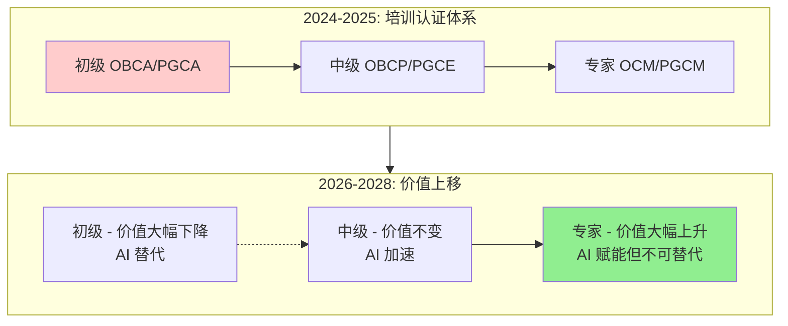
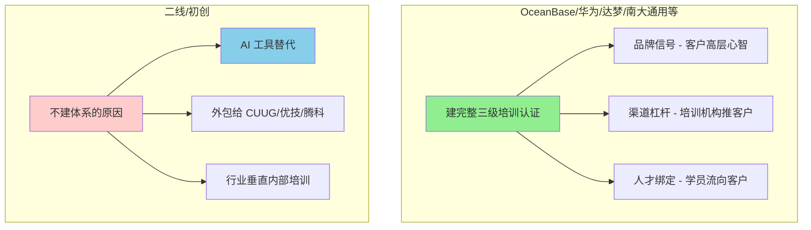
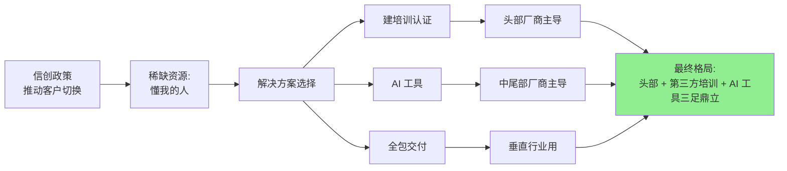

## 德说-第496期, AI 来了, 国产数据库还要不要砸钱建培训认证体系?
  
### 作者  
digoal  
  
### 日期  
2026-07-01  
  
### 标签  
数据库 , AI , 培训 , 认证体系 , 人才 , 初级 , 高级 , 稀缺 , 带货 , 决策 , 生态 
  
----  
  
## 背景  

  

我先把结论放在前面, 免得你读到最后才发现答案不合你胃口 —— 

这件事的真相是: **头部厂商要建, 而且要全面建设; 中尾部厂商大部分不建, 但需要另一种方式补回来**。AI 不会让培训认证消失, 它会让培训认证**两极分化**: 入门级被 AI 砸成白菜价, 高级认证反而更值钱。

你可能不同意。AI 都来了, 还要人考 OCP/OCM 干嘛? AI 写 SQL 比人快, 调索引比人准, 监控告警 7×24 小时不睡觉, 那培训认证体系不就是 21 世纪的马车作坊?

我得告诉你, 这事没那么简单。我让 4 个不同身份的人给我讲了讲他们的看法, 听完之后, 我得承认我自己之前对培训认证的理解也是片面的。

---

## 一、先回到 30 年前, 看看 Oracle 当年为什么"砸"培训认证

我跟一位 2010-2018 年在 Oracle WDP 中心当过讲师的老师聊过, 他给我讲了一个数字让我惊了一下——**全球 40 多万人拿过 Oracle OCP, 中国占了 2 万多; 但 Oracle OCM (最高级) 在中国不到 1000 人**。

这个数字背后的逻辑是这样的: 2000 年代的中国, Oracle 装在 80% 大企业的核心系统上 (银行、电信、政府、能源), 但中国能"玩得转" Oracle 的人, 一只手数得过来。Oracle 在中国押的赌注就是: **只要我培养了 10 万个 OCP, 那"用 Oracle"就是默认选项**。谁要替换我, 谁就要替我解决"人"的问题。培训认证是 Oracle 在中国押的"赌注", 不是"教育投入"。

但我这位讲师朋友后来跳到了国产数据库, 他告诉我一个反直觉的事——

> **国产数据库现在面对的局面跟 Oracle 当年完全相反。**

Oracle 当年缺"会用的人", 所以建培训体系是"从 0 培养"; 国产数据库面对的是 DBA 已经过剩——Oracle DBA、MySQL DBA、PostgreSQL DBA、SQL Server DBA 全都过剩。 **国产数据库建培训认证, 不是"培养人", 是"让人从'会别的'切换到'会我的'"** 。这事的 ROI 跟 Oracle 当年根本不在一个量级。

这个视角帮我把一个一直模糊的问题理清楚了: **培训认证体系从来不是"教育"行为, 是"生态控制"行为**。Oracle 当年建的不是一所学校, 是一张网。

但这张网在 AI 时代还撑得住吗? 这是另一个问题。

---

## 二、AI 真的能替代 DBA 吗? — 听一个写过内核的人怎么说

我跟一位在 某国产数据库公司 做过 8 年内核研发的架构师聊, 他刚说了一句特别"打脸"的话——

> "AI 替代的不是'数据库从业者'这个职业, 是其中'重复劳动'那 60% 的时间。"

他给我的拆解是这样的:

| 岗位 | 重复劳动 | AI 替代率 | 不可替代的部分 |
|---|---|---|---|
| **DBA** | 备份/监控/扩容/慢查询 | 80%+ | 凌晨三点的复杂故障定位 |
| **架构师** | 写文档/画方案图 | 50%+ | 选型 trade-off (要担责的决策) |
| **开发** | CRUD/报表 SQL | 70%+ | 核心交易逻辑 |

**AI 大约能替代 55-65% 的数据库从业者时间, 但能替代"人"的 5-10%** 。这是一个 0/1 错觉题——外行看是 0 (完全替代) 或 1 (完全不能), 实际上是 0.6。

但这个 0.6 表明**不是均匀替代**, 它专门替代"门槛低、重复多"的工作。这件事对培训认证体系的影响是结构性的:

也就是说, **AI 不是"消灭培训认证", 是"压缩初级, 拉高专家"** 。

初级认证 (OBCA/PGCA) 从"能干活"标准变成"基础认知"标准——以前你拿 OBCA 找得到工作, 2027 年以后你拿 OBCA 跟"会用 ChatGPT"的简历竞争, 优势约等于零。

专家级认证 (OBCE/PGCM/HCIE-GaussDB) 反而更值钱了——**因为 AI 时代唯一可识别的稀缺信号就是这个**。一个客户 CIO 面前摆着 5 个数据库厂商的产品, 他现在能问的"你团队有没有能搞定凌晨三点故障的专家", 这个问题的答案用"持证人数"来标识仍然是最直接的。

---

## 三、商业账怎么算——别跟我谈情怀, 算算 ROI

跟内核架构师聊完"技术现实", 我又去找了一个做了 10 年 ToB 商业化的操盘手。他上来就给我算了一笔账, 直接打脸很多"建培训认证"的政治正确:

**培训认证 4 条价值路径, 每条对头部和中尾部厂商的意义完全不同**:

| 价值路径 | 头部厂商 | 中尾部厂商 |
|---|---|---|
| **直接收入** (培训费/考试费) | 几乎为零 | 几乎为零 |
| **渠道杠杆** (WDP 中心帮你卖/推荐客户) | 重要, 但云化后被压缩 | 跑不通 |
| **客户绑定** (客户因为"有培训"选你) | 重要 | 几乎为零 |
| **品牌信号** (在客户高层心智里"有体系") | 极其重要 | 几乎为零 |

加总看: **对头部厂商, 这 4 条都赚钱, 是"长期生态投资"** 。对中尾部厂商, 亏钱。

他给我举了一个极有洞察的例子: **OceanBase 把 OBCA (初级) 做成线上免费, 50 题/60 分/60 分钟通过**。这事表面看是"亏钱", 实际是商业化高手的算盘——

> " **让'会用人池'越大, 大客户选型时'我团队已经有人会 OB'的概率越高, 选型成本越低**。把客户教育成本转嫁出去, 让社会替你做扫盲。 "

他说完又补了一刀: **AI 工具比培训认证体系便宜 10 倍以上**。

> "培养一个 OBCP 学员, 客户出 1-3 万 + 2-3 个月时间, 学员学完还不一定留在公司。AI 工具接管, 客户出 license 一年几万到几十万, 全公司 DBA 都能用, 边际成本接近 0。"

我问他: 那中尾部厂商最优策略是什么? 他说了句让我记住很久的话:

> " **不建完整体系, 把培训认证外包给 CUUG、优技这种第三方机构, 把钱押在 AI 工具的产品力上**。只建顶级大师级认证, 中尾部不建, AI 工具是更优替代。 "

---

## 四、谁会跟进, 谁不会——看赛道全景

最后我去找了一个跟踪国产数据库 8 年的行业分析师。他一上来就给我画了一张图, 把"建 / 不建"两类厂商切得清清楚楚:

他说他已经看了 8 年, 不建完整体系的厂商有 4 种典型, 各自的"替代动作"也不同:

| 不建的厂商类型 | 替代动作 |
|---|---|
| **项目制收入为主, 客户集中** (e.g., 中科曙光) 建体系ROI并不高又没有其他客户学 | 培训认证作为"客户成功"一部分, 不对外开放 |
| **创始人工程师文化, 看重产品** (e.g., TiDB 早期) | 押注产品力 + 社区运营 |
| **资金紧, 现金流敏感** (大量初创) | 把培训认证外包给第三方 |
| **垂直行业定位** (e.g., GoldenDB 金融) | 培训认证在行业内部闭环 |
| **AI 时代押注"AI Native"** (新一批) | 用 AI 工具直接对客户交付, 跳过"培养人" |

他特别提醒我: **AI 时代的不跟进, 跟传统不跟进不一样**。

> "传统不跟进 (2018-2022) 是'我小, 我没资源, 我不建'——这是无奈。AI 时代不跟进 (2026+) 是'我用 AI 替代了, 我不需要建'——这是主动。这是两种完全不同的不跟进, 后者比前者有生命力得多。"

他还提了一个 **"赛道分层"** 的视角我没想到——

> "培训认证在博弈中其实承担了'赛道分层'的功能。头部靠它维持'我们不一样'的信号, 中尾部靠'我们更便宜/更垂直'打差异化, AI 工具是新的'价格战武器'。 **所以中尾部不跟进, 不是'我没能力', 是'我选了另一条路'** 。"

最后他提了一个**关键博弈点**: 头部厂商之间的"对标压力"。

> "OceanBase 建了 OBCP, 华为必然跟 (已经跟了, 走 HCIE-GaussDB 路线), 达梦 2024 年 IPO 之后也会加码 (已经看到 DM-DCP 体系)。 **头部之间, 不跟进 = 品牌信号缺位 = 高端客户选型时被质疑'你没有体系'** 。所以头部不是'要不要建'的问题, 是'建多快、建多深'的问题。"

---

## 五、回到开头那个判断: 培训认证体系死不死?

死不了。但**形态会彻底变**。

我把 4 位专家的洞察压缩成一张总图:

也就是说, 2026-2028 的国产数据库人才生态, 大概率会变成这样:

1. **头部厂商 (OceanBase、达梦、华为、南大通用)** 继续建并升级自己的三级认证体系, 但重心从"培养 DBA"变成"认证高阶能力"。OceanBase OBCA 继续免费, OBCE 继续稀缺; 华为 HCIE-GaussDB 继续吃华为系生态红利; 达梦 DM-DCP 借上市后的资金加码。
2. **中尾部厂商** 普遍不建完整体系, 把培训认证外包给 CUUG、优技、腾科这种第三方, 钱押在 AI 工具 (DB-GPT、ChatDBA) 的产品力和场景适配上。
3. **工信部"信创数据库工程师"认证**会成为新的"官方标准", 部分采购合同会要求"持证人数", 这会进一步压缩厂商自建体系的市场空间。
4. **培训机构 (CUUG、优技、腾科)** 角色上升, 从"Oracle 时代的附庸"变成"AI 时代的多品牌中立服务商"。

---

## 六、给你一份"看盘清单"——接下来 6-12 个月看什么

我把 4 位专家的"证伪/证明信号"压缩成一份你可以照着盯的清单:

### 1. 头部厂商的培训认证投入披露
- **看什么**: OceanBase 2026 年报、达梦 2026 年报、华为公开材料
- **怎么判断**: 培训认证投入是否缩减 = 头部是否还认为"这是值得的长期投资"
- **警示线**: 头部削减培训认证投入 > 30% = 我这个判断需要修正

### 2. AI 数据库工具的生产部署案例
- **看什么**: DB-GPT、ChatDBA 类工具在金融/电信/能源的实际投产
- **怎么判断**: 突破 500 个客户 = 培训认证根基开始动摇
- **数据源**: GitHub star 数、企业案例发布、信通院相关报告

### 3. 工信部信创认证持证人数
- **看什么**: 2026 年下半年信创数据库工程师认证报考和通过人数
- **怎么判断**: 半年内破 1 万 = 政府认证已成市场事实标准, 厂商自建体系被边缘化
- **数据源**: 工信部教育与考试中心

### 4. 第三方培训机构 (CUUG/优技/腾科) 的多品牌覆盖
- **看什么**: 这些机构同时做 Oracle OCP、PGCP、OBCP、HCIP-GaussDB 几个品牌
- **怎么判断**: 培训生态越聚合 = 中尾部厂商"外包模式"成立
- **数据源**: 各机构官网公开课程表

### 5. 甲方招聘 JD 中"国产数据库认证"出现频次
- **看什么**: 拉勾/BOSS 直聘上"DBA/数据库工程师"岗位 JD 中"OBCP/PGCP/HCIP-GaussDB"出现频率
- **怎么判断**: 突破 40% = 认证已成市场刚需; < 10% = 认证是内部圈子游戏
- **数据源**: 抽样招聘网站

### 6. 头部厂商之间的人才生态战
- **看什么**: OceanBase OBCP/OBCE 通过人数 vs 华为 HCIE-GaussDB 通过人数 vs 达梦 DM-DCP 通过人数
- **怎么判断**: 哪家头部先到 1 万高级持证 = 哪家形成"人才虹吸"效应
- **数据源**: 各厂商官方披露

### 7. 中尾部厂商的"AI Native"产品发布
- **看什么**: 哪家中尾部厂商在 2026 年发布"AI 工具 + 数据库"一体化产品
- **怎么判断**: 出现 ≥ 3 家 = 中尾部已经放弃"建体系", 押注 AI 工具
- **数据源**: 各厂商发布会

---

## 最后说一句

我承认, 写完这篇文章之后, 我对"AI 来了, 培训认证体系会不会死"这个问题的看法, 跟开始时完全不一样了。

开始我以为答案是"AI 让培训认证死掉一半"——结果四位专家让我看到的是: **AI 不会让培训认证死掉, 它会让培训认证的"价值中枢"往上走, 同时让"投资回报"的判断标准彻底改变**。

头部还在建, 但建的理由从"教育用户"变成了"维持品牌信号"; 中尾部大部分不建, 但它们不是没动作, 它们把动作放在了你看不到的地方——AI 工具的产品力、第三方培训机构的外包合同、行业垂直的内部闭环。

这场博弈的真正赢家, 既不是最会建培训认证的厂商, 也不是最会用 AI 的厂商, 而是 **"最懂在'建'与'不建'之间切换"的厂商**。OceanBase 选了建, 因为它有这个体量和品牌; TiDB 选了不建 (早期), 因为它有社区; 一些二线厂商选了不建 + 押 AI 工具, 因为它们看清了"建也跑不赢头部, 不如换一条路"。

**所有的策略都对, 只要它适配自己的禀赋**。

至于你关心的"我作为个人, 还要不要考 OCP/OBCP/PGCP/HCIE 之类的认证", 那是另一个问题——但我的判断是: **初级的不用考 (AI 比你廉价), 高级的反而要考 (稀缺导致越来越值钱)** 。

这个判断, 6-12 个月内会被市场证伪还是证实, 就看上面那份"看盘清单"了。
  
  
#### [PostgreSQL 解决方案集合](../201706/20170601_02.md "40cff096e9ed7122c512b35d8561d9c8")
  
  
#### [德哥 / digoal's Github - 公益是一辈子的事.](https://github.com/digoal/blog/blob/master/README.md "22709685feb7cab07d30f30387f0a9ae")
  
  
#### [About 德哥](https://github.com/digoal/blog/blob/master/me/readme.md "a37735981e7704886ffd590565582dd0")
  
  

  
