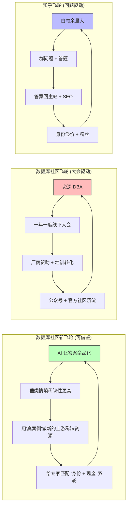

## 德说-第497期, 答案泛滥的时代, 数据库社区还有运营的必要吗? 知乎给出了答案
  
### 作者  
digoal  
  
### 日期  
2026-07-01  
  
### 标签  
数据库 , 社区 , KOL , 流量 , 知乎 , 好问题  
  
----  
  
## 背景  
  
知乎有点意思, 今天必须聊一聊, 原因是我之前被知乎运营看上, 把公众号内容搬到知乎给点好处费, 但是后来真正让我对知乎感兴趣的其实是他们的运营模式: 他们把我拉到科技类的群里, 群里大概全是我这种科技内容博主, 然后运营会每天推送问题, 邀请回答. 

我其实在想的是 : 知乎这套 "垂类专家群 + 每日放问题 + 答案回流主站 + 再通过大V及搜索引擎分发出去" 形成的从问题到内容生产再到分发的机制, 这套机制能不能搬到数据库运营的圈子里？  
  
因为现在是问题稀缺的时代, 稀缺的并不是答案.  
  
先说结论： **可以借鉴，但绝不能整套搬**。这个结论不是我拍脑袋，是把在知乎内容体系里待过 6 年的站内人、AI 创作者经济研究员、开源数据库社区 8 年运营老兵、和一位资深 DBA 的视角交叉检验之后得出来的。每一层都有真实的代价，下面一层一层拆开看。

 

## 第一层：你看到的"打法"，可能不是真正起作用的关键 

外界描述的知乎打法太"工程化"了：团队建群、群内养专家、每天抛问题、答案回流主站、被搜索"白嫖"流量。听起来好像是一套可以照搬的运营动作表，但如果站内的人给你讲透——**这套动作能跑得通，是因为背后有两样东西没被列出来**。

第一样，是**十年沉淀的中文问答搜索权重**。当一个用户在百度搜"PG 数据库主从延迟怎么排查"，知乎的问答页面常年排在前列；这些自然搜索流量是知乎不需要花一分钱买回来的飞轮。换句话说，知乎做的不是"答案生产"，是"答案分发"——专家写一份答案，主站免费替他分发到全国，这是真正的杠杆。

第二样，是 **"在知乎答题"这件事本身在中文知识圈已经是一种社会身份**。一个律师、一个医生、一个程序员，在知乎答题拿几万粉丝，对外是跳槽、接咨询、谈讲师价码的硬通货。这是身份溢价。

如果没有这两样东西，你试图在一个新社区里也搞"垂类群 + 每日问题 + 回流"——回流没流量，群机制调不动专家，机制就成了「空转」。换句话说，**你以为知乎卖的是运营秘籍，其实它卖的是十年积累的搜索权重和品牌信用**。这两样东西离开知乎都带不走。

PS: 但是我想反驳一下, 现在是问题稀缺、流量稀缺, 答案不稀奇甚至唾手可得, 其实任何领域都有KOL, 但KOL的流量并没有被调动起来, 以数据库厂商为例, 如果数据库厂商能帮KOL给出好问题(当然必须是对自己产品有帮助的好问题), 同时给出一定的市场费用, KOL只是顺水推舟的用他的能力解答并投放流量, 这事就成了, 双方各取所需. 

这就引出了核心张力：知乎做对了什么？做对了"在 AI 让答案变得不值钱的时代，掌握问什么、谁来答、怎么被看见的整套结构"——但这套权力结构是靠十年沉淀换来的，**不是靠一个团队从零搭得起来的**。

 

## 第二层：在 AI 时代，哪些东西真的变值钱了？

把镜头拉远一点看。AI 出现之后，写一篇"什么是 PostgreSQL MVCC"的文章，ChatGPT 三秒钟就能写出来，比多数人写得还工整。 **通用知识型的内容，AI 已经把它商品化** ——它的边际成本接近零，价格跟着归零。

但有一些内容还没被商品化：

- **强情境型**：一个 PG 17 在某银行核心系统跑出来、WAL 飙升、运维排查无果的故障 case，AI 没法稳定还原这种"现场体验"。
- **强版本敏感**：PG 13、14、15、16、17 之间行为有微妙差别，专家共识每年都在演化，AI 训练数据有滞后。
- **强业务耦合**：同一个表膨胀问题，放在电商秒杀、放在金融结息、放在物联网写入高峰，解法完全不同。AI 答得到，但答不准。

站在研究内容经济学的人的角度，这叫" **情境密度** "——一个垂类的情境密度越高，AI 越难替代，专家越值钱。

数据库、芯片设计、法律（特别是诉讼方向）、医学（特别是影像和病理）、嵌入式开发，这些都属于"情境密度极高"的垂类。它们共同的特点是： **答案的好，依赖情境理解的深**。知乎泛知识不少领域情境密度是中等（财经、母婴），AI 已经把它商品化得七七八八；高情境密度的垂类，反而因为 AI 进入，把好问题和好答案之间的距离拉开了——也就是变相把"上游问题筛选"的价值放大了。

所以知乎押注"好问题"不是抽象的赌未来，**是一个非常具体的赌：高情境密度垂类的"问题"和"答案"，价值差距在 AI 时代会扩大**。这一点，数据库垂类是赢家不是输家。

这个判断能解释"为什么数据库社区理论上可以从知乎模式受益"，但是不能整照抄。

 

## 第三层：知乎的飞轮和数据库的飞轮，是两个不同品种

知乎飞轮的运转逻辑是这样的：泛知识白领的下班余量大，知乎给出"粉丝 + 身份"双重激励，专家答题有真实回报，答案回流主站、被搜索免费分发。这是**专家供给有余量、问题筛选权在中游、内容分发靠下游**的链路。

数据库社区的飞轮是另一种： **专家供给是稀缺的（资深 DBA 大多在 oncall），问题筛选权在生产现场（用户提不出真正好的"案例型问题"），内容分发靠线下大会 + 公众号 + 厂商赞助**。

这两种飞轮的发动机不一样。知乎的发动机是"问题筛选权"，数据库社区的发动机其实是"线下场景的稀缺性"。

 

## 第四层：怎么借鉴? "上游稀缺资源垄断"

那是不是完全没机会？也不是。

知乎模式真正的护城河不是群、不是问题、不是回流。 **是在 AI 时代"上游稀缺资源"上建立了筛选权和定价权**。知乎赌的是"问题"会变稀缺，所以把持问题筛选权；数据库社区可以换一种上游稀缺资源——**真实生产案例**。

怎么做？

不是让群内的运营去"想"好问题——好问题是想不出来的，是从生产现场长出来的。你要做的是： **让资深 DBA 在大会上讲的、公众号发的、工单里反复出现的真实案例，被系统性地沉淀、标签化、再分发**。这相当于把"上游"从"问题"换成"案例"，但同样是一种"上游垄断"——你有了行业内最丰富的真实案例库，专家就有理由在你这里继续写、继续讲。

具体到操作层面，三件事可以并行：

- **把大会 PPT 沉淀成可被搜索的案例库**。中国 PG 分会和 PG 中国社区这些年已经积累了大几十场大会 PPT，但这些 PPT 的可检索性并不好。如果你能用 AI 工具把这些 PPT 全部索引化、案例化、再做成可被搜索引擎抓取的页面，你就在事实上建了一个"数据库垂类的知乎"——只是原料从"问题"变成了"PPT 里的真案例"。
- **把公众号文章做"身份化"标识**。头部 DBA 需要身份溢价，那你就给身份：CSDN 的博客专家、Redis 的认证讲师、PG 的认证讲师……这些体系一旦和"案例库作者"打通，专家就有持续输出动力。
- **厂商赞助做"案例共享基金"** 。这是比"提问奖励"更高级的反哺机制：谁贡献的案例被行业引用最多，厂商赞助给他讲座席位、咨询优先权、甚至研究经费。把现金反哺从"答题报酬"升级到"案例 IP 收益"。

这三件事，都不依赖"群 + 日抛"的外壳，但内核上是知乎模式的变体——**用你对"上游稀缺资源"的把握，反向激励供给端的专家**。

  

## 第五层：必须面对一个"算账的 DBA"

上面说的机制改造听着美好，但要让一个资深 DBA 真的动笔、真的来答题、真的愿意参与，他心里有另一本账。

一位做了 12 年 DBA 的资深人士私下盘算过：他每周能挤出来"主动输出"的时间是 5 到 10 小时（oncall 之外的余量）。这一周时间里，他已经在分配给公众号、知乎专栏、大会 PPT、付费咨询、培训。留给"群机制答题"的余量，**大概只占 10%** 。

换句话说，**你给他建再好的群，他也匀不出时间答**——除非你能让答题这件事在他的时间分配表里"挤掉"另一项。这意味着机制设计要竞争的是他自己的预算，而不是凭空给他加任务。

这指向几个具体结论：

- **问题不能是"新人入门类"** ——AI 都能答，专家凭什么答？
- **问题必须能衍生为他的公众号选题、大会 PPT 素材**——答题变成"半成品生产"，性价比才高。
- **问题必须绑定明确的"身份 + 现金"回报** —— 举个例子: 头部专家看到"PG 中国认证讲师候选人""厂商赞助席位优先权"才动心；腰部专家看到"案例库作者署名 + 现金小费"才动心；新人看到"案例贡献积分"才动心。
- **不能让他被新人低质量问题淹没**——必须给群机制配"门槛"和"过滤层"，否则他一周之内就被刷屏劝退。

这一层是和"运营老兵"高度一致的判断： **专家被调动，不是机制问题，是算账问题**。你不进入他的算账逻辑，群机制再精致也是空转。

## 总结一下我的判断

知乎模式让一群人心动，是因为它做对了一件非常聪明的事：在 AI 让答案变得不值钱的时代，把"问题"和"提问权"变成新的稀缺资源。它的成功不是来自"群 + 每日问题"这套动作，而是来自十年沉淀下来的搜索权重和身份溢价。

数据库社区能不能搬？ 不能搬外壳但可以借鉴内核——用"真实案例 + 案例库 IP + 身份 / 现金双轮"作为新的上游稀缺资源。

这件事能不能成，取决于三件事： **AI 数据库工具的进化速度不能太快、头部 DBA 的输出意愿不能突然下滑、厂商赞助的现金燃料不能突然断流**。
  
  
#### [PostgreSQL 解决方案集合](../201706/20170601_02.md "40cff096e9ed7122c512b35d8561d9c8")
  
  
#### [德哥 / digoal's Github - 公益是一辈子的事.](https://github.com/digoal/blog/blob/master/README.md "22709685feb7cab07d30f30387f0a9ae")
  
  
#### [About 德哥](https://github.com/digoal/blog/blob/master/me/readme.md "a37735981e7704886ffd590565582dd0")
  
  

  
