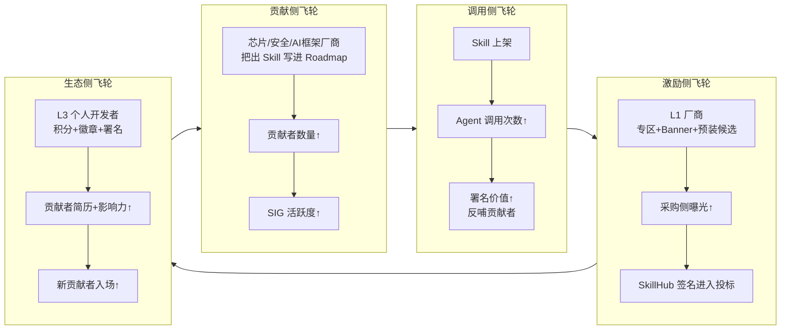

## 德说-第498期, 阿里云龙蜥搞 SkillHub 背后的“野心”
  
### 作者  
digoal  
  
### 日期  
2026-07-02  
  
### 标签  
操作系统 , OS , 龙蜥 , AI , Agent 入口 , SkillHub , 社区运作  
  
----  
  
## 背景  
  
龙蜥社区在 2026 年 6 月 25 日宣布自己正式升级为"AI 原生操作系统社区",同步上线了一件事: SkillHub。"以 OS 为枢纽连接南向芯片与北向应用生态,把基础设施层的专家经验结构化成 Skill"。具体见官网: 
https://skillhub.openanolis.cn/guide

一个开源操作系统社区做 skillHUB, 这件事情触发了我的敏感神经, 因为离职后的我天天围着SKILL打转转: **龙蜥社区搞这个的目的是啥? 怎么算成功? 友商在做什么?**

开聊之前, 我先假想一个场景:

一个普通工程师早上九点, 他被叫去给一台新采购的服务器配 vLLM 推理环境, 准备跑 Qwen-72B。显卡是 NVIDIA A800, 操作系统是龙蜥 Anolis 23(他们公司刚把 CentOS 换过来)。

他打开驱动下载页 —— 官网最新版本 545.x; 装上之后跑 NCCL all-reduce 测试,翻车了。

去查龙蜥官方适配说明,推荐的是 535.129.03; 再查 CUDA 兼容性,要装 12.1; 再查 vLLM 版本,要锁定 0.4.x; 再查内核参数,hugepages、IOMMU、PCIe ACS 一通调。

这一套, 熟练的人要半天, 不熟的人要三天。

这就是 SkillHub 想干掉的那"三天"。 

 

## 一、商业目的: 不是"卖 AI 技能", 是"换一种姿势卖 OS"

首先, 这件事腾讯更早, 腾讯 SkillHub 在 2026 年 3 月上线,基于 OpenClaw 开源生态,主打"通用 AI 技能超市",一口气放出 13000 多个技能,覆盖写代码、做 PPT、查数据。龙蜥 SkillHub 走的是完全不同的路——它锚定的是"基础设施层 Agent",也就是上面那个工程师踩的所有坑:装驱动、调内核、排查 NCCL 问题。通用 Agent 市场的用户是 8 亿 通用 AI Agent 用户;它的用户是几万 Infra SRE、芯片 FAE、服务器厂商工程师。这是一个窄了不止一个数量级的市场。

为什么放弃宽的路走窄的路?站在信创 OS 产业的视角,逻辑反而很顺。

过去五年国产操作系统的商业模式, 大体是左手靠政策(国产化目录、关基行业强制采购)、右手靠装机量补贴。把"装机套数"作为核心 KPI。这是个人都知道的旧地图。但 2026 年的现实是: 党政办公等"易替换"场景的装机量增速已经开始见顶,剩余市场在金融核心系统、电信 OSS、能源工控这些深水区,替换周期长、定制要求高,补贴政策的边际收益在递减。与此同时,AI 推理大规模"上生产"这件事正在改写 OS 的价值锚点 —— 以前 OS 价值在 syscall 和包管理, 现在 OS 价值在"以 Skill / MCP / Agent 为接口"的编排层。

换句话说,国产 OS 厂商面临的共同命题是: 从"卖许可/装机"转向"卖平台/生态"。谁先在自家根社区里建好一个"装机时默认带走的 Skill 池", 谁就占据了 Agent 调用的默认入口。

这时候再回头看 SkillHub 的设计, 它打的就不是"流量战", 而是"标准战"+ "适配证据战"。SkillHub 上线即宣布兼容 MCP(Anthropic 在 2025 年 10 月推出 SKILL.md 标准,这是事实标准), 不造新轮子; 它的 9 大 SKILL 类目覆盖操作系统运维、安全合规、芯片适配、容器与云原生、开发测试、中间件、AI 与大模型、基础设施、内核 —— 这是把"OS 之上会装什么"这件事的目录权,先抢在自己手里。

站在经济学视角看, 还会发现它其实在悄悄重做"贡献经济学"。

SkillHub 的关键设计不是"发周边", 而是把"贡献"这个抽象概念重新定义成了一个具体可触摸的东西: **每一次 Agent 调用 SKILL.md 都署你一次名字**。 这有点像 github 的项目被引用, 是一种荣誉. 

这是把"贡献者"身份升格成"Skill 供应商"。一个芯片厂商的工程师写了一个"海光 DCU 驱动适配 Skill",那么: 

- 这个 Skill 一旦跑通, 就是一次公开的"OS 适配认证", 比厂商内部发的适配证书更值钱。
- 这个 Skill 一旦被某个 AI 团队调用一次, 签名就出现在 Anolis OS 的 Agent 调用日志里——这是产品级品牌曝光, 远比一次白皮书联合署名高效。
- 这个 Skill 一旦积累到一定调用量,海光就自然进入了"Agentic OS 预装候选池",从此每装一台龙蜥, 都默认带上这个 Skill。

这三个飞轮, 加上"每次 Agent 调用都署你的名"这一句话,就是把"贡献"从义务升级成了生意。

如果你是海光/沐曦/飞腾的 BD 负责人,你会发现这件事对你的杀伤: 你再也不用靠"我们支持龙蜥!" 这种 PPT 话术去招投标,你可以直接说"我们的 Skill 在 SkillHub 上被调用了 5 万次,这是真实落地证据"。一句话就压过三页产品白皮书。 

所以 SkillHub 的真实商业目的是四层叠加: 

1. **给龙蜥 1000 万装机量做"二次增值"** —— 装机是过去十年打下的江山,SkillHub 是让这个江山重新变现的工具。
2. **抢"Agent 时代 OS 适配中心"的话语权** —— 不是和腾讯 SkillHub 抢通用,是在 Infra 层定义一种新的"事实标准"。
3. **重构 OS 上下游生态的利益分配** —— 让芯片厂商、安全厂商、AI 框架方把"出 Skill"写入自家 Roadmap,变成和发版一样自然的工作流。
4. **为下一代"Agentic OS"占据预装候选池** —— 这是为 Anolis OS 在 2027/2028 年的下一代产品提前铺路。

 

## 二、成功的标志: 别只看装机量,看 4 个飞轮有没有转起来

最常见的失败判断是用"装机量"作为成功标志。但 SkillHub 这种平台的产品,装机量是个滞后指标, 真正该问的是:**四类飞轮有没有同时转起来?** 

我能想到的四个飞轮是这样的:

**到 2026 年第四季度年度评选时,Skill 数能不能从 Q2 的个位数冲到 100+;Q3 Hackathon 提交能不能过 100 个;首批年度"最佳 Skill"奖是不是 30 个提名起步**。这是三个量化门槛,任何一个没跨过去都说明飞轮没有真正闭合。

**有没有至少 3-5 家头部芯片厂商(海光、沐曦、飞腾、Intel、AMD 里面任意组合)把"在 SkillHub 发布 Skill"写进自家明年的产品 Roadmap**。这一条比 Skill 数更关键,因为它意味着外部厂商把 SkillHub 从"社区伙伴关系"上升到"产品出厂流程"。

**SkillHub 个人开发者月度活跃贡献者数能不能在 Q4 达到 2000 以上,积分兑换率能不能稳定在三成以上**。这两条不达标,L1 的厂商激励就算给了,平台也只是一个会展,不会形成持续贡献。

## 三、友商都在做什么 

- **openEuler(华为系)** : 动作最像龙蜥的对手。"AI-on-Euler" 计划把 openEuler 定位成算力底座 OS,2024-2025 年全力推进,但截至 2026 H1 还没有推出和 SkillHub 直接对标的"社区级 Skill 平台",更多以 AI 套件 + 行业发行版形式落地。装机量 300 万 + 9500+ 贡献者。 **它走的是"算力底座 + 异构调度"路线,不是"适配证据"路线** ——打法不同,但都在争夺"Agent 时代标准"的话语权。
- **OpenCloudOS(腾讯系)** :走"云原生 + AI 推理优化"路线,与腾讯云算力、混元大模型深度绑定。它本身没有做社区级 Skill 平台,但腾讯在通用 AI 侧已经用 SkillHub 卡了一个位。
- **统信 UOS / 银河麒麟 / 中科方德**:截至 2026 H1,公开渠道几乎看不到对标 SkillHub 的"社区级 AI Skill 平台"动作。它们仍然在行业发行版、桌面 AI 助手、标杆案例这些传统路径上投弹药。
  **统信、麒麟、方德在 Agent 时代的差异化窗口正在快速关闭,这是 SkillHub 真正的差异化机会**。

## 四、总结

我对 SkillHub 整体偏乐观, 主要是因为它的"贡献即资产 → 兑现即署名 → 飞轮回流"这个链条, 是少数国产开源平台里把"为什么我要贡献"这件事答到了工程师 KPI 真实痛处的设计。 

但反过来, **大模型在 2026 Q4 显著提升了系统级命令的执行鲁棒性**。一旦 AI 在装驱动、调内核这种强权限操作上做到"基本不用查文档就能跑通", Skill 封装的最大理由就被削弱了。到时候 SkillHub 存在的意义又是什么? 毕竟人力、物理、时间都是实打实的投入. 

这个问题留给盆友们思考吧. 
  
  
#### [PostgreSQL 解决方案集合](../201706/20170601_02.md "40cff096e9ed7122c512b35d8561d9c8")
  
  
#### [德哥 / digoal's Github - 公益是一辈子的事.](https://github.com/digoal/blog/blob/master/README.md "22709685feb7cab07d30f30387f0a9ae")
  
  
#### [About 德哥](https://github.com/digoal/blog/blob/master/me/readme.md "a37735981e7704886ffd590565582dd0")
  
  

  
