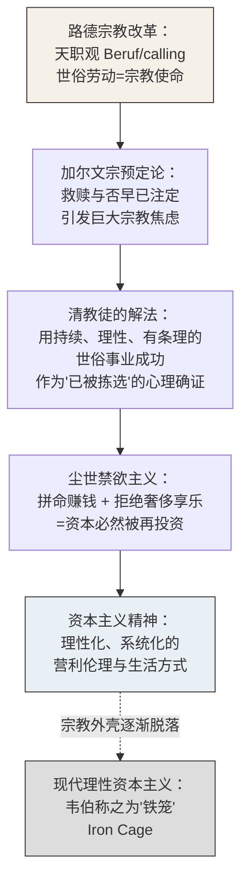

## 《新教伦理与资本主义精神》读书笔记 
  
### 作者  
digoal  
  
### 日期  
2026-07-02  
  
### 标签  
读书笔记 , 新教伦理与资本主义精神  
  
----  
  
## 背景 
  
  

---
书名: 《新教伦理与资本主义精神》  
作者: [德] 马克斯·韦伯  
译者: 阎克文  
出版社: 上海人民出版社（世纪文景）  
出版年份: 2018-3  
页数: 513  
定价: 65.00元  
丛书: 韦伯作品集  
豆瓣链接: https://book.douban.com/subject/27083202/  
豆瓣评分: 9.2（19315人想读 / 4162人读过）  
标签: [社会学, 韦伯, 宗教社会学, 资本主义, 经典]  
笔记日期: 2026-07-02  
---
  
  

> **一句话**：一个人为什么会拼命赚钱却过着近乎苦行的生活——韦伯用这个悖论撬开了现代资本主义的精神地基。  
> **适合谁读**：想理解"为什么是西方率先走向现代资本主义"、对组织行为与职业伦理的历史根源感兴趣的人，尤其是常年"卷"在工作里却说不清为什么要卷的技术人和创业者。  
> **阅读难度**：⭐⭐⭐⭐☆（4/5，德文思辨式长句偏多，阎克文译本已算克制）  
> **推荐指数**：⭐⭐⭐⭐⭐  
  
---

## 一、时代坐标：这本书从哪里来？

1904到1906年间，韦伯把这篇论文分两部分发表在他主编的《社会科学与社会政策文库》上，1920年他去世前又做了大幅修订，收进《宗教社会学论文集》第一卷，成为后来所有译本的通行底本。这不是一本"从零开始"的书，而是韦伯人生一次重要转弯后的产物：1898到1903年他因精神崩溃几乎完全停止写作和授课，1903年秋辞去教职，脱离体制束缚后，才与桑巴特一起创办期刊、重新出发。换句话说，这本书是一位刚刚从个人危机中走出来的学者，对"现代人为什么要如此拼命工作"这个问题的一次带着切身体感的回答。

时代背景同样关键。19世纪末的德国学术界，马克思的历史唯物主义如日中天——经济基础决定上层建筑，宗教观念不过是阶级利益的装饰。韦伯写这本书，某种程度上就是在正面挑战这套解释框架：他要证明，至少在一个历史节点上，因果箭头是可以反过来的——不是资本主义的兴起催生了某种为它辩护的意识形态，而是一套原本纯粹为了"灵魂得救"而发展出来的宗教伦理，无意中锻造出了资本主义所需要的心理气质。

这本书要解决的问题，后来被学界戏称为"韦伯问题"：为什么理性的、可计算的、可持续扩张的资本主义，独独在近代西欧成型，而不是在同样有商业活动、同样有贪婪欲望的其他文明？

---

## 二、核心命题：作者在说什么？

### 命题一：资本主义精神不等于贪婪，而是一种"理性的、系统性的赚钱伦理"

韦伯开篇就要拆掉一个误解：以为资本主义就是拼命想发财。他指出，想发财这种欲望古今中外都有，海盗、赌徒、投机商人都想发财，但这不是资本主义精神。他借本杰明·富兰克林那套"时间就是金钱""信用就是金钱"的说教式文字作为标本，指出资本主义精神是一种带有功利主义色彩、以增加资本本身为目的的责任伦理——积累的资本要用于社会再生产而非个人消费。也就是说，真正的资本主义精神是一种**把赚钱本身当作道德义务**、把节俭和再投资当作美德、把奢侈消费当作堕落的理性化生活方式。这是一种"为了赚钱而赚钱"、几乎反直觉的伦理姿态。

### 命题二："天职"（Beruf/calling）观念是这套伦理的宗教起源

韦伯认为，所谓"天职"指的是新教教派中的核心伦理，来自宗教改革家马丁·路德——人们不应以苦修、超越世俗道德的禁欲主义方式追求上帝的应许，而应该在俗世中完成个人在其所处职业位置上的工作责任和义务。这是一次石破天惊的伦理翻转：中世纪天主教把最高的宗教生活留给修道院里的僧侣，世俗劳动是"低一等"的存在；路德之后，"上帝安排的任务"被下放到每一个普通职业里——你在账房、作坊、田间做好本职工作，就是在履行宗教使命。劳动第一次被"神圣化"了。

### 命题三：加尔文宗的"预定论"焦虑，把天职观念锻造成了系统性的禁欲行动

如果说路德只是打开了一扇门，真正把人推着往前跑的是加尔文宗的预定论——上帝早已决定谁能得救，人无法通过任何善行改变命运，甚至无法确知自己是否属于被拣选的一员。这种极端的宗教不确定性制造了巨大的心理焦虑，而清教徒找到的出口是：**用世俗事业上持续、有条理、系统化的成功，作为自己"很可能已被拣选"的间接证据**。于是禁欲不再是逃避世界，而是要在世界之中、通过理性的劳动纪律去证明自己。韦伯选取17世纪清教伦理学家理查德·巴克斯特作为这一逻辑的典型代表，细读他反复强调"珍惜光阴""职业分工乃神意安排"的说教文本，指出这背后有两种动机的结合：把劳动视为遵从禁欲主义的方法，同时把职业分工视为神安排万物的直接结果。

这三个命题环环相扣：从"劳动是天职"到"以持续成功证明救赎"，最终沉淀为一种脱离了宗教外壳、却依然运转的**世俗理性主义生活方式**——这就是韦伯所说的"资本主义精神"。

---

## 三、论证地图：作者怎么说服你的？

韦伯的论证不是单线因果，而是一张"选择性亲和"（Wahlverwandtschaft，借自歌德，原为化学术语）的关系网——既承认客观的历史相关性，又不把话说死为决定论式的因果链。这也是他反复被误读、又反复自我辩护的地方。



**关键证据**：韦伯用的不是严格的统计学证据，而是大量文本细读——巴克斯特的布道文、富兰克林的处世格言、教派入会的"证书"制度，以及一个当时颇有说服力的社会观察：新教徒集中的地区，商工业领导人、资本占有者、受过高等技术和商业培训的管理人员的比例明显偏高。这个论证方式在方法论上更接近历史阐释学而非因果实验，这也正是后来"学术百年战争"的火药桶所在——从1907年历史学者卡尔·费舍尔（Karl Fischer）、费利克斯·拉赫法尔（Felix Rachfahl）与韦伯的论战开始，围绕这本书的争论持续了一百多年，被戏称为"academic Hundred Years War"。

**论证方式的评价**：我认为韦伯的高明之处恰恰在于他没有说"新教伦理导致了资本主义"，而是小心翼翼地用"选择性亲和"这个模糊却精确的表述——既指出了实际存在的历史关联，又给研究者的价值判断留了余地。但这也是它容易被简化误读、又难以被彻底证伪的原因：一个"亲和关系"到底能不能撑起一整套关于西方现代性起源的宏大叙事，学界至今没有共识。

---

## 四、前提假设与边界：什么情况下这不成立？

**假设一：新教伦理是"独立变量"，而非资本主义扩张的"结果"。**
批评者（如英国经济史学家托尼，R. H. Tawney）质疑这个因果方向本身——会不会是商业阶层先兴起，才反过来选择、强化了适合自己利益的宗教教义？韦伯专门指出美国部分地区资本主义精神的出现早于资本主义制度形式本身，试图倒转唯物史观的解释顺序，但这终究是历史阐释而非可复现的实验，双方都拿不出压倒性证据。

**假设二：新教国家的经济优势主要来自"伦理内驱力"，而非制度、地理、殖民等外部条件。**
王水雄等学者提出"亲和性机制或虚假命题"的质疑：如果把"社会行动"作为韦伯论证链条中缺失的中间环节补上，就会发现新教伦理和资本主义精神很可能都是某种更早的理性行动的共同结果，二者之间是伪相关而非选择性亲和。

**假设三：这套框架能推广到非西方文明，用以解释"为什么资本主义没有在那里发生"。**
这是边界最容易失效的地方。韦伯后来写《中国的宗教：儒教与道教》，断言儒家伦理"入世但不苦行"，因而未能催生资本主义精神。这个判断在二战后遭遇了最直接的经验反驳——**东亚经济奇迹**。余英时在《中国近世宗教伦理与商人精神》中系统反驳了韦伯对儒家的判断，指出中国近世的儒、释、道三教都曾发生"入世转向"，具备类似"入世苦行"的形态，只是韦伯对儒教、道教的文本理解本身就有偏差。日本、韩国、中国台湾和香港的战后腾飞，让"儒家伦理阻碍资本主义"这个具体论断基本站不住脚，尽管这不代表韦伯整体方法论失效——学界普遍的处理方式是区分"韦伯问题"（历史学的经验判断）和"韦伯式问题"（预设资本主义是普遍历史必然的方法论前提），后者本身就值得质疑。

所以我的判断是：把这本书当作"新教伦理是资本主义的唯一或首要原因"来读，会立刻撞上历史反例；但把它当作"理念如何在特定历史条件下参与塑造经济行为模式"的一个精彩案例来读，它依然站得住。

---

## 五、思想谱系：这本书在哪个传统里？

韦伯站在两条思想脉络的交汇点上。一条是德国历史学派和狄尔泰式的精神科学传统，强调"理解"（Verstehen）而非自然科学式的因果解释，这决定了他选择文本细读而非统计回归的方法。另一条是他与马克思的隐性对话——马克思强调经济基础决定意识形态，韦伯则要证明观念本身可以成为独立的历史动力，但他并不是简单地"用唯心论对抗唯物论"，而是在《经济与社会》等后续著作中把这本书定位为整个"多因论"体系里的一块拼图，而非全部答案。

这本书之后，韦伯把同样的框架推广到《中国的宗教》《印度的宗教》《古犹太教》，构成他"世界诸宗教的经济伦理"比较研究计划，试图证明只有西方新教路径通向了"理性化"的资本主义，其他文明的宗教伦理各自导向了不同的经济心态——尽管这个比较研究计划因他猝然离世未能完成对伊斯兰教和天主教的部分。对后世的影响则是双重的：一方面它开创了宗教社会学、组织社会学中"理念如何塑造制度"的研究路径；另一方面，"理性化""铁笼""科层制"这些概念，深刻影响了后来法兰克福学派对现代性的批判，也影响了新制度经济学对"非正式制度"（文化、信念）如何影响经济绩效的关注。

```
路德新教改革 ──▶ 韦伯《新教伦理与资本主义精神》(1904-1920)
                        │
          ┌─────────────┼─────────────┐
          ▼             ▼             ▼
   宗教社会学传统   现代性批判传统   比较文明经济史
  （贝拉/施路赫特）（法兰克福学派）（余英时/东亚学者反驳）
```

---

## 六、我学到了什么？

第一，**理念不是空谈，它可以变成组织行为**。这本书最打动我的地方，是它证明了一件很反直觉的事：一套关于"灵魂得救"的神学信条，可以在几代人之后，脱掉全部宗教外壳，变成一种纯粹世俗的职业操守——认真做事、系统规划、拒绝挥霍。这提醒我，我们今天在企业里谈的"使命驱动""长期主义""延迟满足"，本质上都是某种精神内驱力被制度化、组织化之后的产物，而不是天然如此的经济理性。

第二，**动机的自我确证机制值得警惕，也值得利用**。清教徒用世俗成功证明自己"被拣选"，这是一种典型的心理防御机制——用可观测的外部指标（业绩、财富）去缓解内在不可知的焦虑（是否得救）。放到今天，这种机制在创业者、技术人身上依然普遍存在：用交付速度、代码质量、发表数量去确证自己的"价值"，本质上和清教徒并无二致。理解这一点，能让人对自己"为什么这么拼"多一分清醒，而不只是被本能驱使。

第三，**"铁笼"这个隐喻是韦伯留给现代性最沉重的遗产**。他清楚地看到，理性化一旦启动，就会脱离最初赋予它意义的宗教信仰，变成一套自我运转、不问意义、只讲效率和可预期性的机器——"专家没有灵魂，纵欲者没有心肝"是他对这个后果最尖锐的形容。这不是危言耸听，而是我们今天在层层KPI、流程化管理、数据驱动决策里每天都能感受到的东西：系统运转得越来越高效，个体的意义感却越来越稀薄。

---

## 七、举一反三：这个框架还能用在哪？

**场景一：判断一家公司或一个团队的"文化驱动力"是否可持续。**
韦伯的框架提示我们，真正持久的组织行为模式，往往不是靠外部激励（奖金、KPI）驱动的，而是靠一套被内化为"天职"式信念的伦理支撑的。判断一个团队文化是不是"装出来的"，可以看它是否具备类似"尘世禁欲主义"的特征——愿不愿意把资源持续投入到长期建设中而非短期消费。

**场景二：理解为什么某些技术社区或开源生态能长期自我维持。**
开源精神本身就带有一种"世俗禁欲主义"的影子：贡献者不追求直接的物质回报，却把持续、系统化的代码贡献当作某种身份和价值的确证。用韦伯的框架去看待开源社区的动力机制，会比单纯用"利他主义"或"声誉经济"解释更有历史纵深感。

**场景三：审视自己对"努力工作"这件事的信念来源。**
很多人从未追问过自己为什么认同"勤奋=美德"这套价值观，韦伯提醒我们，这套价值观有具体的历史起源，也有具体的历史边界。意识到这一点，能帮助我们把"要不要拼命"从一个被默认的道德律令，还原成一个可以理性权衡的选择。

---

## 八、批判与反思

我不完全同意韦伯把新教伦理抬到"资本主义精神的核心起源"这个高度。他对儒家伦理的判断，被后来东亚经济的实证历史相当有力地反驳了——如果一种伦理体系被认定为"天然不利于资本主义"，却在几十年后孕育出高速工业化，那说明韦伯低估了制度、政策、地缘政治等结构性因素在经济起飞中的权重，也高估了宗教伦理的独立解释力。

其次，韦伯的论证方法本身也留下了硬伤：他用"选择性亲和"这个含糊而优雅的说法，回避了严格意义上因果关系的举证责任，这既是这本书的智慧所在，也是它至今无法被证伪、也无法被证实的根本原因——按照现代社会科学的标准，这更像是一个极具启发性的历史叙事，而不是一个可检验的因果模型。

最后，时代确实变了。韦伯写作时的资本主义还带着浓厚的清教徒禁欲底色，今天的资本主义早已高度金融化、消费主义化，"及时行乐"取代"延迟满足"成为主流消费文化，"天职"式的职业认同也被越来越普遍的"零工经济"心态稀释。用韦伯的框架去解释今天全球资本主义的运转逻辑，需要非常审慎的时代转译，直接套用会显得刻舟求剑。

---

## 九、金句与记忆点

1. **"资本主义精神以增加资本本身为目的，而非满足个人消费。"**——这句话划清了"贪婪"和"资本主义精神"的界限，是理解全书的第一把钥匙。
2. **"天职"（Beruf/calling）**——把世俗职业劳动神圣化的核心概念，是理解现代职业伦理起源绕不开的一个词。
3. **"选择性亲和"（Wahlverwandtschaft）**——韦伯借用歌德小说标题里的化学隐喻，用来描述两个变量之间"既相关又不是简单因果"的暧昧关系，是他方法论上最精巧、也最容易被误读的一个提法。
4. **"没有人知道将来会是谁在铁笼里生活。"**——韦伯对现代理性化前景近乎悲观的预言，"铁笼"（Iron Cage）后来成为现代性批判理论最常引用的意象之一。
5. **"专家没有灵魂，纵欲者没有心肝。"**——他对理性化走向极致后可能出现的人格空心化的警告，放在今天读依然扎心。
6. **"新教徒把劳动看作一项天职，而我们劳动是迫不得已。"**——这是后人对韦伯命题的一句提炼式转述，点出了"内驱"和"被驱使"两种劳动状态的根本区别。
7. **"学术百年战争"（academic Hundred Years War）**——学界对这本书争论的戏称，从1907年一直延续至今，提醒读者这不是一本"定论"式的书，而是一个持续被辩论的思想现场。

---

## 十、延伸阅读

1. **《中国的宗教：儒教与道教》马克斯·韦伯** —— 韦伯本人把同一框架应用到中国的尝试，是理解他"世界诸宗教经济伦理"比较研究计划的关键一环，也是后续争议的起点。
2. **《中国近世宗教伦理与商人精神》余英时** —— 直接回应并部分反驳韦伯对儒家伦理的判断，是理解"韦伯问题在中国"绕不开的中文原创研究。
3. **《经济与社会》马克斯·韦伯** —— 韦伯的理论巨著，把"新教伦理"放回他关于理性化、科层制、支配类型的整体社会学体系中理解，能避免只读这一本书造成的"以偏概全"。
4. **Religion and the Rise of Capitalism, R. H. Tawney** —— 对韦伯命题最重要的早期批评之一，从经济史角度质疑因果方向。
5. **《新教教派与资本主义精神》马克斯·韦伯（本书附录收录）** —— 作为正文的直接补充，从"教派"这个中间组织的角度解释新教伦理如何在社会结构中被扩散和保存，读正文时建议一并读完，理解会更完整。

---

*笔记写于 2026-07-02 | 基于公开资料与深度思考整理*
  
  
#### [PostgreSQL 解决方案集合](../201706/20170601_02.md "40cff096e9ed7122c512b35d8561d9c8")
  
  
#### [德哥 / digoal's Github - 公益是一辈子的事.](https://github.com/digoal/blog/blob/master/README.md "22709685feb7cab07d30f30387f0a9ae")
  
  
#### [About 德哥](https://github.com/digoal/blog/blob/master/me/readme.md "a37735981e7704886ffd590565582dd0")
  
  

  
