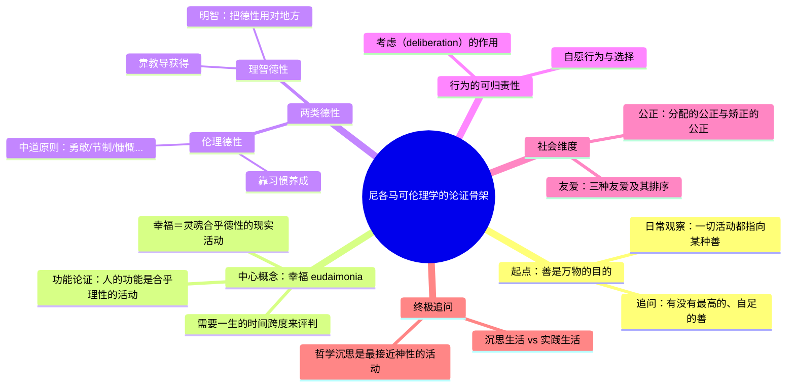

## 《尼各马可伦理学》读书笔记 
  
### 作者  
digoal  
  
### 日期  
2026-07-02  
  
### 标签  
读书笔记 , 尼各马可伦理学  
  
----  
  
## 背景 
  
  


---
书名: 《尼各马可伦理学》  
作者: [古希腊] 亚里士多德（Aristotle）  
译者: 廖申白 译注  
出版社: 商务印书馆  
出版年份: 2003-11  
页数: 367  
定价: 22.00元  
原作名: Ἠθικὰ Νικομάχεια  
丛书: 汉译世界学术名著丛书·哲学  
豆瓣链接: https://book.douban.com/subject/1051943/  
笔记日期: 2026-07-02  
标签: [伦理学, 古希腊哲学, 德性伦理, 亚里士多德, 西方哲学经典]  
---

  

> **一句话**：幸福不是一种运气或心情，而是一种"合乎德性的现实活动"——是做出来的，不是碰上的。  
> **适合谁读**：想搞清楚"我该怎么活"而不满足于成功学答案的人，尤其是常年在效率、KPI、量化指标里打转、偶尔怀疑这套体系本身有没有问题的人。  
> **阅读难度**：⭐⭐⭐⭐☆（1-5星）  
> **推荐指数**：⭐⭐⭐⭐⭐  
  
---

## 一、时代坐标：这本书从哪里来？

公元前335年前后，年过半百的亚里士多德回到雅典，在吕克昂建立了自己的学园。这时候的他已经不是柏拉图学园里那个"学园之灵"，也不是亚历山大的私人教师，而是一个带着二十年学术积累、准备把自己的思考系统化的成熟学者。他一边讲课一边散步，学生们跟在后面记笔记——这也是为什么《尼各马可伦理学》读起来常常像讲义而不是精心打磨的散文：文风朴素、逻辑绵密，甚至有些地方前后重复，因为它本来就不是写给大众读者的作品，而是课堂讲稿的整理稿。"尼各马可"这个书名，学界一般认为与他的儿子（也叫尼各马可）有关，可能是儿子后来整理编订了这部讲稿，故以其名冠之。

这本书诞生的历史节点很微妙：雅典城邦的黄金时代已经过去，马其顿的阴影笼罩着整个希腊世界。老师柏拉图留下的"理念论"框架把善、正义这些概念悬置在一个抽象的理念世界里，亚里士多德对此始终心存疑虑——他那句"吾爱吾师，吾更爱真理"，很大程度上就是冲着柏拉图的这套形而上学去的。所以《尼各马可伦理学》的问题意识非常明确：善不应该是一个悬在天上的、单一的理念，而应该是从人具体的生活、具体的活动中长出来的东西。这是一次从"天上"到"人间"的转向，也是西方伦理学第一次把"我该怎么活"当作一个可以系统研究、可以经验验证的问题来对待。

有意思的是，这本书从一开始就不打算给出一个放之四海而皆准的公式。亚里士多德在全书开篇就提醒读者：伦理学讨论的是"大多数情况下如此"的东西，不能像数学那样要求精确，这个态度本身就定义了整本书的方法论气质——不是造一套演绎体系，而是从常识意见出发，一层层澄清、修正、逼近真相。

---

## 二、核心命题：作者在说什么？

### 命题一：幸福不是感受，而是一种活动

亚里士多德开篇就抛出一个几乎所有人都会同意的前提：所有人的一切活动，最终都指向"善"，而人生诸善中最高的那个，希腊语叫 eudaimonia，中译常作"幸福"。但这个词跟我们今天理解的"幸福感"完全不是一回事——不是一种主观愉悦的心理状态，而是"灵魂合乎德性的现实活动"。他有一个经典的"功能论证"：一把刀的"善"在于锋利，因为锋利是刀的功能；一个人的"善"，同样要从人特有的功能里去找。人和植物一样能生长，和动物一样有感觉，但唯独人有理性——所以人的功能就是"合乎理性的灵魂活动"，人的幸福，就是把这个功能做到卓越、做到持续的一生。

这个论证直接把"幸福"从一种被动的运气（有没有钱、有没有好命）变成了一种主动的、需要终生践行的活动。它不是一时的高潮，而是"一辈子活得怎么样"的整体评价——所以亚里士多德才说，一只燕子飞不成夏天，一天也造不出幸福的人生。

### 命题二：德性是习惯出来的中道

第二个核心命题是德性论。亚里士多德把德性分为两类：理智德性（靠教导获得，比如智慧）和伦理德性（靠习惯养成，比如勇敢、节制、慷慨）。他反复强调一点：人不是生来就有德性的，德性是重复实践的产物——就像学木匠要靠动手做木工活，学德性也要靠反复做有德性的事。这句话放在今天依然扎心：性格不是天生的标签，而是行为习惯长期堆叠出来的结果。

德性的具体形态，则由著名的"中道"学说来刻画：每种德性都是两个极端（过度与不及）之间的适度。勇敢是鲁莽和怯懦之间的中道，慷慨是挥霍和吝啬之间的中道。但这里有个常见的误解需要澄清——中道不是简单的"折中主义"或和稀泥，而是"对的人在对的时间、对对的对象、出于对的理由、以对的方式"做出反应，这是一种高度情境化的精确判断，不是数学意义上的平均值。

### 命题三：明智（实践智慧）是德性的方向盘

第三个命题常被忽略，却是全书最精妙的部分：光有良好的性情还不够，一个人还需要"明智"（phronesis，实践智慧）才能把德性正确地应用到具体情境中。明智不是抽象的理论智慧，而是一种关于"如何在具体处境中做出正确判断"的实践能力，只能靠经验积累，无法单纯靠书本传授。这也是为什么亚里士多德说年轻人可以成为几何学家，却很难成为真正明智的人——明智需要阅历的沉淀。

---

## 三、论证地图：作者怎么说服你的？



亚里士多德的论证方式很有辨识度：他几乎从不凭空造理论，而是先摆出"大多数人怎么说"和"有智慧的人怎么说"这两类流行意见，然后用辩证法逐一检验，剔除其中的矛盾和过失，最后逼近一个能同时安顿住合理直觉的结论。比如讨论幸福时，他先列出三种流行的生活方式——享乐的生活、追求荣誉的政治生活、赚钱的生活——逐一指出其局限（享乐生活等同于禽兽，荣誉生活受制于授予荣誉的他人，赚钱生活把工具当成了目的），才引出沉思生活作为候选答案。

这套方法论的优点是接地气、有说服力，因为它始终锚定在普通人的经验判断上；缺点也很明显——当"流行意见"本身就带有时代偏见时（比如古希腊社会对奴隶、女性劳动价值的看法），亚里士多德的辩证法会不自觉地把这些偏见也一并"提纯"进最终结论里，这是我们读这本书时必须保持警觉的地方。

---

## 四、前提假设与边界：什么情况下这不成立？

细读全书，会发现亚里士多德的整套体系依赖几个未被明说的前提假设：

**假设一：人有一个稳定、统一的"功能"（ergon）。** 整个功能论证的说服力，建立在"人作为一个物种存在一个可以被识别出来的特有功能"这个预设之上。但现代哲学（尤其是分析哲学传统）对"人有本质功能"这个说法本身就存疑——如果人的存在方式是多元的、没有单一"应然"功能，功能论证的地基就会松动。

**假设二：城邦（polis）是人实现善好生活不可或缺的社会土壤。** 亚里士多德明确认为人是"城邦的动物"，伦理学最终要落脚到政治学，个人的善与城邦的善是一体两面的。这个假设在古希腊城邦社会里成立，但放到今天原子化、跨国流动的现代社会里，"共同体"早已碎片化，德性养成所依赖的稳定社会土壤已经变了模样——这也是麦金太尔在《德性之后》里花大力气要重新论证的问题：现代性摧毁了德性生长所需要的传统与共同体，我们该如何在这样的废墟上重建德性伦理。

**假设三：有闲暇、有一定财富基础的自由民才谈得上追求德性和沉思。** 这一点是最容易被忽视、也最容易引发不适的一条。亚里士多德笔下的"好人"，默认是有闲暇从事政治参与、军事训练和哲学沉思的雅典自由男性公民，奴隶和大部分体力劳动者、女性都被排除在这套德性叙事之外。这不是亚里士多德个人的偏见，而是整个古典城邦制度的结构性产物，但它确实限制了这套伦理学的普适边界——如果一个人被结构性地剥夺了闲暇和教育资源，这套"靠习惯养成德性"的方案对他而言几乎无从谈起。

---

## 五、思想谱系：这本书在哪个传统里？

```
苏格拉底（美德即知识，追问"什么是善"）
        ↓
柏拉图（理念论：善是超验的理念，理性的目标是认识理念）
        ↓  亚里士多德的转向：善不在天上，在人的活动之中
《尼各马可伦理学》（德性伦理学：幸福＝合乎德性的现实活动）
        ↓
斯多亚学派 / 中世纪经院哲学（阿奎那用亚氏框架嫁接基督教神学）
        ↓
启蒙运动后：功利主义（边沁、密尔）与义务论（康德）成为主流
        （德性伦理学一度边缘化两百余年）
        ↓
20世纪中叶：安斯库姆《现代道德哲学》重新点燃德性伦理学
        ↓
1981年：麦金太尔《德性之后》——现代性丧失了德性生长的传统土壤，
        呼吁回到亚里士多德式的实践与共同体
        ↓
当代：德性伦理学与功利主义、义务论三足鼎立，
        广泛渗透进医学伦理、教育哲学、管理学领域
```

这本书的特殊地位在于，它既是一个终点，也是一个起点。作为终点，它把苏格拉底"美德即知识"的追问和柏拉图的理念论综合、修正为一套更贴近经验的体系；作为起点，它开创了此后两千多年"德性伦理学"这整条脉络，一直影响到20世纪末安斯库姆和麦金太尔发起的"新亚里士多德主义"复兴，甚至渗透进今天的正面心理学、领导力研究和组织行为学——很多讲"习惯养成""刻意练习""心流状态"的畅销书，骨子里都能在这本两千三百多年前的讲稿里找到雏形。

---

## 六、我学到了什么？

读完这本书，有三点对我触动最大。

第一，**幸福是一种"活法"而不是一种"感受"**，这个区分对我个人的工作方式产生了实际影响。我平时写数据库和AI基础设施的技术分析，很容易陷入一种"完成了就有成就感"的短期反馈循环，但亚里士多德的框架提醒我：真正值得追求的不是某一次发表带来的满足感，而是长期、稳定地把"深度思考、准确表达"这件事做到卓越的整个过程——幸福感是这个过程的副产品，而不是目标本身。这跟我一直强调的"分析深度优于表面总结"的写作原则，其实是同一种价值取向的两种表达。

第二，**中道不是折中，而是精确判断**，这个洞察纠正了我过去对"中庸"的一个误解。我以前把"中道"简单理解成"凡事别太极端"，读完才明白亚里士多德讲的是一种高度情境化的判断能力——同样是"批评一篇稿子"，在什么场合、对什么人、用什么方式说出口，才是恰到好处的中道，而不是简单的"温和一点"。这对我写财经分析、写产品评测时如何拿捏"直言不讳"和"分寸感"之间的平衡，是很直接的方法论提示。

第三，**明智是经验的产物，无法靠读书直接获得**，这一点让我对"知道"和"做到"之间的鸿沟有了更清晰的认识。亚里士多德说得很直白：年轻人可以精通几何学，却很难拥有真正的实践智慧，因为几何学是抽象的、普遍的，而明智处理的是具体的、每次都不一样的情境，只能靠反复经历才能磨出来。这也是为什么很多方法论看起来一学就会，做起来却总是差一口气——不是道理没听懂，是经验没攒够。

---

## 七、举一反三：这个框架还能用在哪？

**技能与专业能力的养成**：无论是学写代码、学写分析文章还是学做数据库架构设计，亚里士多德的"习惯养成德性"框架都适用——能力不是听懂道理就自动拥有的，而是通过反复实践、不断修正才能内化成"品质"的东西。一个真正厉害的工程师和一个只会背设计模式的初学者，差的往往就是"明智"这层实践判断力。

**组织管理中的分寸感**：管理者面对团队时经常需要在"严格"与"宽容"之间找平衡，这正是中道原则的现实应用——不是找一个固定的折中值，而是针对具体的人、具体的错误、具体的时机，做出恰如其分的反应。同一句批评，对新人和对老将说出来的方式应该完全不同。

**内容创作中的"人味"判断**：我最近在做AI生成文本的"人味"打分和改写工作，某种意义上也是在寻找一种"中道"——太生硬（不及）和太做作、过度渲染（过度）都不自然，真正读起来像人写的文字，往往是在信息密度、情绪表达、句式变化之间找到了那个恰到好处的平衡点，这跟亚里士多德讲勇敢、慷慨的中道逻辑是相通的。

---

## 八、批判与反思

这本书最大的局限，前面在"前提假设"部分已经点出来了：它建立在一个精英化、排他性的社会结构假设之上——奴隶、女性、体力劳动者天然被排除在"追求德性"的资格之外。今天我们读这本书，必须做一个"去时代化"的手术，把它的方法论内核（习惯养成德性、明智作为实践判断力、中道作为情境化的精确反应）和它嵌入的具体社会结构（雅典自由民城邦制）区分开来，取前者、弃后者。

第二点，亚里士多德把"沉思生活"捧到了最高位置，认为纯粹的哲学思辨是最接近神性、最自足的活动，这个结论其实和他自己此前的"人是城邦的动物、需要在共同体中实践德性"的论证有一定张力——如果最高的幸福是孤独的沉思，那前面几卷花大力气论证的"公正""友爱"这些社会性德性，地位就显得有点尴尬。这是全书内部一个学界争论已久、至今没有定论的裂缝，融贯论者认为这些要素可以统一在一个层级体系里，主导论者则认为沉思生活压倒性地优于其他一切，我个人更倾向于认为亚里士多德本人也没有彻底想清楚这个问题，这恰恰是这本书作为"讲稿汇编"而非"精心统稿的专著"留下的痕迹。

第三点，从现代视角看，这套体系对"运气"的处理也值得商榷。亚里士多德承认外在的善（财富、健康、良好的出身）会影响一个人能不能实现幸福，这在某种程度上是诚实的，但也意味着这套伦理学没能完全摆脱"幸福需要一定的运气兜底"这个尴尬结论——对于那些被结构性剥夺了外在善的人，这套体系提供的安慰相当有限。

---

## 九、金句与记忆点

1. **"一只燕子造不成夏天"**——用来提醒：幸福是一生的整体评价，不是某个高光时刻。

2. **"人的善就是灵魂合乎德性的现实活动"**——功能论证的核心结论，把幸福从感受重新定义为活动。

3. **"德性因实践而生成，就像技艺一样"**——性格是练出来的，不是天生的标签。

4. **中道＝"在对的时间、对对的对象、出于对的理由、以对的方式"**——中道不是折中，是精确的情境判断。

5. **"年轻人可以是几何学家，却很难是明智的人"**——理论知识可以速成，实践智慧需要阅历沉淀。

6. **快乐是活动的"完成"（附加的圆满），而不是活动的目的本身**——这条区分帮助我们把"追求快乐"和"追求卓越"两件事分开来看。

7. **友爱有三种：因有用而结交、因快乐而结交、因德性而结交**——真正持久的友谊只有第三种，前两种会随利益或新鲜感消失而瓦解。

8. **公正分为"分配的公正"（按比例分配）和"矫正的公正"（不问身份、只纠正损益差额）**——现代法律和分配制度设计的很多底层逻辑，其实都能追溯到这个区分。

---

## 十、延伸阅读

1. **《政治学》（亚里士多德）** —— 与本书是姊妹篇，伦理学讨论个人的善，政治学讨论城邦的善，二者互为前提，读完本书接着读《政治学》会有更完整的理解。

2. **《德性之后》（阿拉斯代尔·麦金太尔）** —— 20世纪最重要的德性伦理学复兴之作，直接回应"现代性为什么丢失了亚里士多德式的德性传统"，是理解这本书当代意义的最佳桥梁。

3. **《善的脆弱性》（玛莎·努斯鲍姆）** —— 从古希腊悲剧和哲学出发，深入讨论亚里士多德伦理学中"运气"与"外在善"的问题，弥补了本书对这个话题相对简略的处理。

4. **《尼各马可伦理学义疏》（托马斯·阿奎那）** —— 中世纪最重要的注疏之一，看阿奎那如何把亚里士多德的框架嫁接进基督教神学体系，能帮助理解这本书跨越千年的解释史。

5. **《正义论》（约翰·罗尔斯）** —— 作为现代义务论/契约论的代表作，与德性伦理学形成鲜明对照，读完可以更清楚地看到三大伦理学传统（德性、义务、后果）之间的分野。

---

*笔记写于 2026-07-02 | 基于公开资料与深度思考整理*
  
  
#### [PostgreSQL 解决方案集合](../201706/20170601_02.md "40cff096e9ed7122c512b35d8561d9c8")
  
  
#### [德哥 / digoal's Github - 公益是一辈子的事.](https://github.com/digoal/blog/blob/master/README.md "22709685feb7cab07d30f30387f0a9ae")
  
  
#### [About 德哥](https://github.com/digoal/blog/blob/master/me/readme.md "a37735981e7704886ffd590565582dd0")
  
  

  
