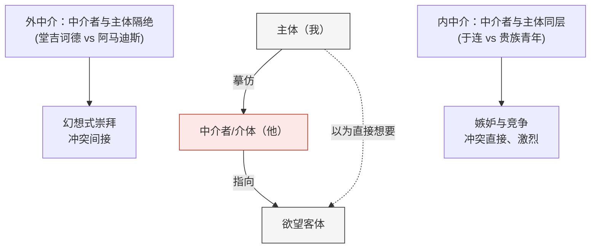

## 《浪漫的谎言与小说的真实》读书笔记 
  
### 作者  
digoal  
  
### 日期  
2026-07-02  
  
### 标签  
读书笔记 , 浪漫的谎言与小说的真实  
  
----  
  
## 背景 
  
  

---
书名: 《浪漫的谎言与小说的真实》  
作者: [法] 勒内·基拉尔  
出版年份: 2021（法文原版 1961，中译本首版 1998）  
笔记日期: 2026-07-02  
豆瓣链接: https://book.douban.com/subject/34969987/  
标签: [文学批评, 哲学, 摹仿欲望, 法国思想]  
---

  

> **一句话**：你以为自己想要的东西，其实是别人先想要的——欲望从来不是自发的，而是抄来的。  
> **适合谁读**：想搞懂"为什么我总是眼红别人拥有的东西"、对文学批评感兴趣、或者只是想理解朋友圈点赞焦虑背后逻辑的人。  
> **阅读难度**：⭐⭐⭐⭐☆（1-5星）  
> **推荐指数**：⭐⭐⭐⭐⭐  
  
---

## 一、时代坐标：这本书从哪里来？

1961年，法国思想界正被结构主义和存在主义两大阵营占据——萨特讲自由选择的主体，列维-斯特劳斯讲被文化结构决定的主体。就在这个当口，一个38岁、在美国教了十几年法语文学的"边缘人"勒内·基拉尔，出版了他的第一本书，却提出了一个跟当时主流都不太一样的问题：人到底想要什么，这份"想要"又是从哪儿来的？

基拉尔本人的背景值得一提：他生于法国南部阿维尼翁，那是中世纪教皇迁居过的地方，父亲是由教皇古堡改建的博物馆馆长，大学学的是中世纪文献学。这种浸润在历史与宗教氛围里的成长经历，让他后来即便远赴美国、常年在霍普金斯和斯坦福教书，思想底色依然是一个"非常古典的法国知识分子"。

他写这本书时手头没有宏大的理论野心，只是老老实实做了一件事：把塞万提斯、司汤达、福楼拜、陀思妥耶夫斯基、普鲁斯特这五位不同时代、不同国籍的小说家放在一起细读，然后发现——他们笔下最深刻的人物，欲望都不是"自己产生"的，而是照着某个"第三者"抄来的。这个发现后来成了基拉尔整个思想大厦的地基：从这本书出发，他后来写出了《暴力与神圣》《替罪羊》，把"摹仿"从文学批评一路推演到人类文明起源和基督教解读，成为一套贯穿文学、人类学、神学的宏大理论体系。

换句话说，这本薄薄的文学批评著作，其实是一位"人文领域的达尔文"（后人对他的评价）迈出的第一步。

---

## 二、核心命题：作者在说什么？

### 观点一：欲望从来不是"我要"，而是"三角形"

传统说法里，欲望是"主体-客体"的两点关系：我看上了一件东西，我就想要它。基拉尔说，这是一种"浪漫的谎言"——一个自欺欺人的假象。真实的结构是三角形：**主体-中介者（介体）-客体**。我想要某样东西，往往是因为我看到某个我崇拜或嫉妒的人也想要它。这个"中介者"才是欲望真正的起点，而客体本身常常没那么重要，重要的是"他也想要"这件事本身。

堂吉诃德想要的不是某个具体的冒险，而是模仿骑士小说里阿马迪斯的一切行为；包法利夫人渴望的不是某个具体的情人，而是浪漫小说灌输给她的"被爱的感觉"。第三者（骑士小说、浪漫读物）不在场，却主宰了主体的全部欲望。

### 观点二：中介有"外"有"内"，距离越近，恨意越深

基拉尔进一步区分了两种"中介"：

- **外中介**：中介者和主体不在同一个世界，彼此没有真实接触的可能。堂吉诃德不可能真的遇见阿马迪斯，包法利夫人也够不着小说里的贵族生活。这种中介产生的是幻想式的崇拜，冲突是间接的。
- **内中介**：中介者和主体处于同一个社会层级，彼此近在咫尺，随时可能正面竞争。司汤达《红与黑》里于连对贵族生活方式的欲望，普鲁斯特笔下人物之间的猜忌与攀比，都是内中介的产物。

基拉尔的洞察是：**中介者离你越近，你们之间的差异感反而会被无限放大，仇恨也就越强烈**。这解释了一个反直觉的现象——我们真正嫉妒的往往不是遥不可及的人，而是那个和我们水平差不多、甚至是朋友的人。

### 观点三：现代性的深处，是内中介的普遍化

基拉尔认为，随着社会等级被拉平、身份差异被消解，现代人越来越多地活在"内中介"的世界里：人人都可能是你的竞争对手，人人都可能是你欲望的介体。这也是他给出的现代人不幸福的诊断——不是斯丹达尔说的"虚荣"，而是**我们无休止地摹仿他人的欲望**，陷入永远追不上、又永远甩不掉的攀比循环。

---

## 三、论证地图：作者怎么说服你的？

基拉尔的论证方式不是搞问卷调查、不是做实验，而是**极其扎实的文本细读**：他一段一段地拆解《堂吉诃德》《包法利夫人》《红与黑》《卡拉马佐夫兄弟》《追忆似水年华》里的具体场景，指出人物的欲望在文本内部是如何被"点燃"的——往往是某个旁观者、某句闲谈、某个被崇拜对象的存在，让主体突然"发现"自己想要某样东西。

这种论证方式的优点是**极具说服力的细节密度**：一旦你跟着他重读这些经典场景，会有一种"原来如此"的恍然感。但代价也很明显——他选取的都是最能印证自己理论的经典范例，五位作家、几部代表作，样本量小且经过精心挑选，这是后文要谈的局限之一。

---

## 四、前提假设与边界：什么情况下这不成立？

基拉尔的理论要成立，隐含了几个前提：

**假设一：几乎所有欲望都是摹仿性的，本能性的自发欲望已经微不足道。** 这个假设在讨论爱情、社会地位、消费品位这类"社会性欲望"时很有解释力，但用来解释饥饿、疼痛这类生理性需求就明显不适用——基拉尔自己也承认这一点，他的理论专门针对"人之为人"的那部分欲望，而不是动物性本能。

**假设二：现代社会是一个"等级被拉平"的社会，所以内中介必然普遍化。** 这个判断带有明显的时代烙印和历史叙事色彩：基拉尔认为传统社会里人有其"本质"，现代社会由于差异缩小、信仰衰落，人才丧失自我、陷入虚无。这更像是一种文化诊断，而非普遍规律——放到今天全球化、社交媒体高度渗透的语境里，"内中介"的说法反而比1961年更贴切了（想想朋友圈点赞、网红同款），但这恰恰说明这个理论更适合描述**特定历史阶段的心理结构**，而非放之四海皆准的人性公理。

**假设三：文学（尤其是这五位"伟大小说家"）能够揭示欲望的真相，而非虚构的哗众取宠。** 基拉尔坚持认为，伟大的小说家之所以伟大，恰恰是因为他们诚实地写出了摹仿欲望这一"不体面"的真相，而三流作品则在美化、掩盖它。这个判断本身带有强烈的价值预设——谁来决定哪部小说"揭示真相"、哪部"制造浪漫谎言"？这个评判标准某种程度上是基拉尔理论自证的产物：凡是符合他理论的就是"深刻"，不太符合的就被排除在讨论之外。

---

## 五、思想谱系：这本书在哪个传统里？

基拉尔的思想来源相当驳杂：他受黑格尔"主奴辩证法"启发（欲望在竞争关系中产生和放大），受弗洛伊德影响却又与之分道扬镳（弗洛伊德讲俄狄浦斯情结和本能压抑，基拉尔讲摹仿和竞争），也常被拿来和拉康比较——拉康那句著名的"欲望是他者的欲望"，和基拉尔的三角欲望模型乍看很像，但两人的落脚点完全不同：拉康面向精神分析，讨论的是主体如何在与他者的想象性认同中建立自我；基拉尔面向的是文学与社会，讨论的是主体如何在与介体的竞争性对立中丧失自我。

有意思的是，基拉尔本人对结构主义相当不客气：他认为包括精神分析、社会学、结构主义在内的整个人文科学传统，因为方法论上过度形式化，反而"自愿变得盲目"，回避了摹仿和暴力这类关于人的真相。这也是他为什么坚持从最朴素的文本细读出发，而不是搭建一套抽象的符号系统。

这本书之后，基拉尔的思想沿着一条清晰的路径向外延展：先在《暴力与神圣》里把摹仿欲望推演到"摹仿性危机→替罪羊机制"，解释宗教献祭的起源；再在《世界创立以来的隐蔽事物》和后期著作里，把福音书解读为唯一站在"无辜受害者"视角、彻底揭穿替罪羊谎言的文本，并因此皈依基督教——这个转向让他的许多学术同行难以接受，却也让他的理论体系最终自洽地拼成了一张关于人类欲望、社会秩序与历史宿命的完整图景。

---

## 六、我学到了什么？

**第一，很多让我们痛苦的"想要"，其实压根不是我们自己的。** 读完这本书最直接的冲击是：下次再因为"别人有的东西我也想要"而焦虑时，值得先停一秒问自己——这份渴望，到底是我自己的判断，还是我在无意识地照着某个"介体"抄作业？基拉尔的可贵之处在于，他把这种说不清道不明的攀比心理，用一个清晰的三角结构讲透了。

**第二，"内中介"比"外中介"更凶险，这个洞察在今天格外应验。** 我们真正焦虑和嫉妒的，往往不是遥不可及的顶级富豪，而是那个和自己出身、能力、圈子差不多的同事、同学、朋友。距离越近，比较越具体，伤害也越真切。这也解释了为什么社交媒体上"同龄人正在抛弃你"这类内容总能精准戳中痛点——它制造的正是最密集的内中介场景。

**第三，理论的解释力和它的普适性野心是两回事。** 基拉尔的理论解释某些具体现象（比如攀比、竞争性嫉妒）非常精彩，但当他试图把摹仿欲望扩展成解释整个人类文明、宗教、历史的"统一场论"时，我会本能地保持警惕——这提醒我，读任何一套雄心勃勃的理论，都要分清楚它"精准解释了什么"和它"声称能解释一切"这两件事。

---

## 七、举一反三：这个框架还能用在哪？

**场景一：产品与商业策略。** 硅谷投资人彼得·蒂尔在斯坦福读书时正是基拉尔的学生，深受摹仿欲望理论影响。他后来提出"竞争是为失败者准备的"这句著名商业信条，逻辑正是：一旦陷入摹仿性竞争，所有人盯着同一个目标互相倾轧，价值创造反而被消耗殆尽，真正该做的是找到没人竞争的"从0到1"领域。同时，他对Facebook的投资，本质上也是"押注摹仿欲望"——点赞、分享、关注这些机制，正是把人类的摹仿欲望工业化、可视化，让"看，别人正在渴望这个"成为最高效的产品驱动力。同一套理论，既可以用来警惕内卷，也可以用来设计让人上瘾的产品，这本身就很值得玩味。

**场景二：品牌与营销分析。** 奢侈品、网红爆款、"同款"经济的底层逻辑几乎完全可以用外中介/内中介来解释：明星同款利用的是外中介（可望不可及的崇拜），而"朋友圈里谁买了什么"制造的是内中介（近在咫尺的攀比）。做内容或品牌分析时，判断一款产品在利用哪种中介机制，能帮你更快看懂它的传播路径。

**场景三：团队管理与冲突诊断。** 团队内部最激烈的矛盾，往往不是发生在职级差距悬殊的人之间，而是发生在能力、资历接近的同事之间——这正是"内中介距离越近、恨意越强"的职场版本。理解这一点，管理者在设计晋升通道和资源分配机制时，可以有意识地减少制造"近距离摹仿竞争"的场景。

---

## 八、批判与反思

**局限一：样本选择的自我印证问题。** 基拉尔集中分析的五位小说家，本身就是他按照"能否揭示摹仿欲望"这个标准挑出来的。这种"先有结论、后选证据"的论证结构，注定了这本书更像是一次精彩的文学再阐释，而非一套可被证伪的科学理论——它更适合被当作一种**深刻的解读视角**，而不是放之四海皆准的心理学定律。

**局限二：理论的扩张野心和它的经验基础不成比例。** 从一本关于五位小说家的文学批评，逐步扩张成解释暴力起源、宗教献祭乃至整个人类文明史的宏大体系，这种"以小博大"式的理论跃迁，本身就值得警惕。基拉尔晚年因为坚持用摹仿理论解读《圣经》并因此皈依基督教，让许多学界同行难以认同——这不完全是因为他的信仰选择本身，而是因为一套原本扎根于文学细读的理论，被推到了神学解释的地步，跨度确实太大。

**局限三：时代已经变了，但也印证了他的判断。** 基拉尔在1961年写下"现代性的深刻真实存在于内中介"这句话时，互联网和社交媒体还远未出现。今天回看，这句诊断在算法推荐、朋友圈攀比、网红经济的时代反而显得更加应验，这既是这本书穿越时间的生命力所在，也提醒我们：一套诞生于特定历史节点的理论，能否被后来的技术变迁不断"重新证实"，某种程度上取决于它本身留出的解释弹性有多大——弹性越大，越容易被后人拿来"套"新现象，但这既是理论的魅力，也是它难以被证伪的原因。

---

## 九、金句与记忆点

1. **"如今，已经没有人相信所谓的自发欲望。"** —— 基拉尔理论的出发点：欲望永远需要一个中介，不存在纯粹凭空产生的想要。

2. **"主观性和客观性，浪漫主义和现实主义，个人主义与科学主义，唯心主义和实证主义……都掩盖了介体的存在。"** —— 这句话点出了他对整个西方思想传统的批评：无论哪种二元框架，都习惯性地忽略了"第三者"在欲望形成中的作用。

3. **"介体和主体间的距离越小，他们的差异就越小；他们的见识愈准确，仇恨就愈强烈。"** —— 解释了为什么身边人比陌生人更容易招致嫉妒。

4. **"主体在他者身上谴责的欲望，永远正好是主体自己的欲望，但是他对此浑然无知。"** —— 一句话点破了道德义愤背后常常藏着的自我投射。

5. **"人是一种不知道自己想要什么的生物，他必须借助他人的欲望来确定自己的欲望。"** —— 后来被彼得·蒂尔反复引用的一句话，也是整套理论最凝练的表达。

6. **标题本身就是一个文字游戏**：法语原名区分了同源的两个词——"romantique"（浪漫的）和"romanesque"（小说的），前者指的是自欺欺人的表象，后者指的是伟大小说揭示出的真相。这个双关本身就是全书论点的浓缩。

---

## 十、延伸阅读

1. **《暴力与神圣》（Violence and the Sacred）** —— 基拉尔本人的续作，把摹仿欲望推演到"摹仿性危机→替罪羊机制"，是理解他思想体系承上启下的关键一环。

2. **《替罪羊》** —— 从中世纪犹太人集体迫害事件出发，进一步展开替罪羊机制如何贯穿人类历史与神话，是这套理论落到具体历史案例的代表作。

3. **《欲望几何学》** —— 对摹仿欲望理论做了更系统的哲学化梳理，适合想深入理解三角欲望模型的读者。

4. **《欲望的先知》**（基拉尔访谈录，钱家音译） —— 收录基拉尔跨越二十余年的访谈，语言比专著轻松得多，还谈到了"9·11"、社交媒体点赞焦虑、身形焦虑等当代议题，适合作为进入基拉尔思想世界的"软入口"。

5. **《从0到1》（Zero to One），彼得·蒂尔著** —— 虽然是一本商业书，但通篇可以看作摹仿欲望理论在创业与投资领域的实战应用，读完《浪漫的谎言与小说的真实》再读这本，会有一种"理论落地"的对照乐趣。

---

*笔记写于 2026-07-02 | 基于公开资料与深度思考整理*
  
  
#### [PostgreSQL 解决方案集合](../201706/20170601_02.md "40cff096e9ed7122c512b35d8561d9c8")
  
  
#### [德哥 / digoal's Github - 公益是一辈子的事.](https://github.com/digoal/blog/blob/master/README.md "22709685feb7cab07d30f30387f0a9ae")
  
  
#### [About 德哥](https://github.com/digoal/blog/blob/master/me/readme.md "a37735981e7704886ffd590565582dd0")
  
  

  
