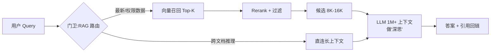
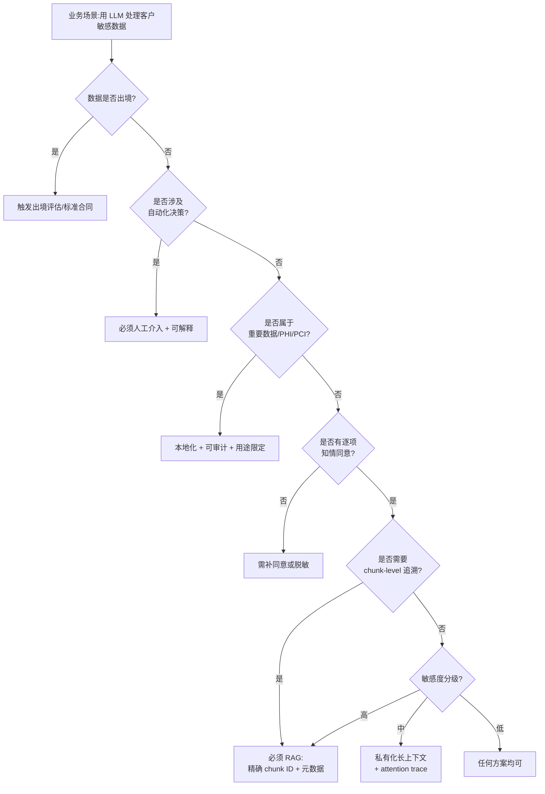

## 大模型支持的上下文已超 1M, RAG 是不是没有意义了?
  
### 作者  
digoal  
  
### 日期  
2026-07-02  
  
### 标签  
大模型 , LLM , context , 上下文窗口 , prompt , RAG , 合规 , 追溯 , 成本 , 注意力机制  
  
----  
  
## 背景  

 

2026 年 4 月,DeepSeek V4-Pro 正式发布, 上下文从 128K 直接拉到 1M(整整 10 倍);同一天,OpenAI 的 GPT-5.5 闭源版被曝支持 2M context。一时间,中文 AI 圈都在传一句话: **"以后不用 RAG 了,把全部数据塞进 prompt 不就完了?"**

下一个问题是, 向量数据库是不是要凉了?

   
## 一、注意力缺陷: Lost in the Middle

我们先站在**工程一线**的角度看这件事。

**模型不是"读得越长越好",而是"中段塌陷"** —— 一份 1M token 的输入,开头和结尾的指令执行得很准,但中间 50% 的内容经常被模型"看不见/性能显著下降"。学术上这叫 "Lost in the Middle". 

即使有 DeepSeek 在 2025 年 2 月开源的 FlashMLA(H800 上跑出 3000 GB/s 内存带宽)、2026 年 4 月 ACL 接收的 DASH-KV 论文把 attention 从 O(N²) 压到 O(N), 1M token 的 decode 阶段仍然是显存带宽受限 —— 这是物理定律,不是软件能完全绕开的。

所以工程一线的判断是: **长上下文不会消解 RAG,但会让 RAG "换岗"** 。RAG 不再是"找答案的工具", 而是"门卫" —— 决定哪 8K-16K 的内容值得送进 1M 上下文去做"深思"。换句话说: **长上下文是大胃王,RAG 是负责上菜的服务员**——你不会让一个人把整桌菜一次吞下,那样会噎着; 也不会让服务员每道菜都重新加热一遍。

这是一线工程师反复踩过的坑: **"全量塞入"在工程上是最常见的幻觉**。DeepSeek V4-Pro 自己也承认,真正的工业级 1M 请求必须是"召回 + 长上下文精读"的混合架构,不是二选一。

  

## 二、滥用长上下文的弊病

如果你站在**向量数据库厂商**的角度,会听到不一样的声音。

1、模型越长, **出问题时的根因追溯就越难**。所以 2026 年 5 月、6 月,无论是 CSDN 的向量数据库选型评测,还是腾讯云技术文章,都在反复强调同一句话: **"2026 年大模型应用开发进入了'深水区',真正的瓶颈变成了检索精度和数据基础设施的稳定性"** 。

2、成本问题。2025 年 Q4 起,DDR5 内存从 599 元飙到 2099 元(+250%),Counterpoint 预测 2026 年 Q1 再涨 40-50%、Q2 续涨 20%——这意味着 **"把所有企业数据无脑塞入上下文窗口"的 TCO 在快速恶化** 。换句话说:长上下文正在输给**自己的成本曲线**。

  

## 三、还有一个意想不到的场景

"合规红线"

**2023 年 3 月,三星电子不到 20 天内发生 3 起源代码外泄事件**——工程师把内部设备测量资料、产品良率代码、会议记录"喂"给了 ChatGPT,导致核心机密进入 OpenAI 的学习数据库。三星最后把单次提问容量限制在 1024 byte 以下。

同一个月,**意大利数据保护局(Garante)直接禁用 ChatGPT**——罚款上限是 2000 万欧元或全球年营业额 4%。OpenAI 当晚应要求关停意大利用户访问。

这两个事件指向同一个结论:**把客户敏感数据"一次性喂给模型",在合规层面天然脆弱**。背后的硬约束至少有四层:

1. **数据流动**:中国《数据安全法》《个人信息保护法》《数据出境安全评估办法》叠加,出境必须走评估 / 标准合同 / 认证三条路径之一;CIIO(关键信息基础设施运营者)出境必评估。
2. **数据使用**:GDPR 第 22 条和中国 PIPL 第 24 条都要求"非完全自动化决策"——必须保留人工介入通道,且决策逻辑可解释、可申诉。
3. **可追溯**:HIPAA §164.312、等保 2.0(GB/T 22239-2019)、EU AI Act 都要求"操作可审计",最小单元必须能精确到**数据片段**(chunk level),而不是模糊的"曾经被模型看过"。
4. **主体权利**:医疗知情同意书、金融销售"双录"、GDPR 下的特定明确同意,都是逐项取得的——把同意范围之外的数据"顺手塞进 prompt"就是超出同意范围。

长上下文方案在这四层上**几乎无能为力**。你把 20 万份病历全塞进 1M 上下文,模型给你一个诊断建议,然后法官问:"这个建议的依据来自哪份病历的第几页?"——**你答不上来**。因为你既没有 chunk_id,也没有"该病历的访问授权来自哪一份知情同意",更没有"该数据是否触碰本地化红线"。

而 RAG 天然给你这些:**每次检索都精确返回 chunk_id + 原始文本 + 元数据 + 引用**,审计追溯能力是结构性的,不是事后补救的。

所以:

> "长上下文方案在 2026 年的能力曲线下,可以替代 RAG 的技术叙事;但在金融、医疗、政务、强监管 CIIO 场景,**合规上几乎不可替代 RAG**。这不是技术选择,这是监管红线。"

  
## 四、长上下文推动向量数据库的作用在发生变化

**长上下文不会消解向量数据库,但会重新定义它的存在价值**。它从"模型外挂的检索器"升级为"企业 AI 数据基础设施"。 

| 你的场景 | 谁占优 | 为什么 |
|---|---|---|
| 单文档 < 100K token、个人开发者、无合规要求 | **长上下文** | 检索是过度工程 |
| 多文档、跨文档推理(法律尽调、代码仓库 review) | **长上下文 + 轻度检索** | 语义连贯性占优 |
| 数据分钟级更新、千人千面权限 | **RAG**(向量库 + 增量索引) | 长上下文灌入即不可撤回 |
| 金融、医疗、政务、强合规 | **RAG + 企业治理** | chunk-level 审计追溯是结构性需求 |
| 超大企业 + 多租户 + 高合规 | **混合检索 + Serverless + 治理复合体** | 单一方案都不够 |

无论 Gemini / DeepSeek / Claude / Qwen / ChatGPT 等等把上下文拉到 1M 还是 10M,**只要存在"谁在什么时候用我的数据做了什么决策"的合规问题,RAG 就有不可替代的位置**。这是制度问题,不是技术问题。

## 总结

真正的护城河不在模型层,而在 **"合规 + 治理 + 成本控制"三层复合体**  —— 而这个复合体的入口, 几乎一定要经过向量数据库这道门。
  
  
#### [PostgreSQL 解决方案集合](../201706/20170601_02.md "40cff096e9ed7122c512b35d8561d9c8")
  
  
#### [德哥 / digoal's Github - 公益是一辈子的事.](https://github.com/digoal/blog/blob/master/README.md "22709685feb7cab07d30f30387f0a9ae")
  
  
#### [About 德哥](https://github.com/digoal/blog/blob/master/me/readme.md "a37735981e7704886ffd590565582dd0")
  
  

  
