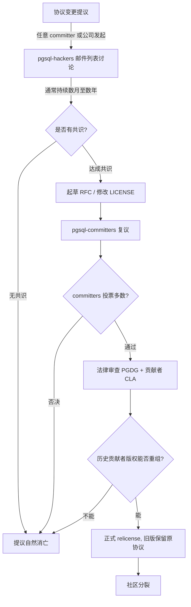

## 德说-第499期, PostgreSQL 协议之谜: 为什么被"白嫖"了 30 年还不改?
  
### 作者  
digoal  
  
### 日期  
2026-07-03  
  
### 标签  
PostgreSQL , 被白嫖 , 衍生产品 , 国产数据库 , 云厂商 , 宽松协议 , 改协议收租 , 利弊 , 社区治理  
  
----  
  
## 背景  

很多人可能会有这样的疑惑, 这么多国产数据库和云厂商白嫖 PostgreSQL, 为什么 PostgreSQL 不像 MongoDB、Redis、Elastic 那样把许可证换一换, 反过来收他们的钱?

今天就来说说

## 一、被"白嫖"是事实

首先, 在 PostgreSQL 目前用的 BSD 风格许可证下, 这些厂商"白嫖"你, 完全是合法的。 

这句话不是我说的, 是法律本身说的。

PostgreSQL 自 1996 年起就用一种叫 PostgreSQL License 的许可证 — 它本质上跟 BSD、MIT 是一类东西,极度宽松。条款很短,核心意思就一句:你可以随便用、随便改、随便卖,只要保留版权声明就行。换句话说,**openGauss 从 PostgreSQL 9.2.4 衍生出国产数据库内核**(华为 2020 年 6 月 30 日开源)、**PolarDB 100% 兼容 PostgreSQL**(阿里云 2021 年 5 月 29 日开源)、**KingbaseES 基于 PostgreSQL 9.6 改造**,**瀚高、海量、优炫**……这些厂商用 PG 内核做闭源商用产品,PGDG 在法律上连个"诉因"都找不到。

## 二、改协议这件事, 在治理上根本走不通

讲完法律, 你可能会说: 那 PG 改一个更严格的协议不就行了? —— 比如改成 AGPL 或 SSPL, 这样下游厂商但凡用 PG 内核做云服务, 就必须开源回馈。

听起来很简单。但你得知道 PostgreSQL 不是一家公司, 它是一个叫 **PGDG (PostgreSQL Global Development Group)** 的非营利组织。 **它没有股东, 没有董事会, 没有 CEO, 没有任何一个角色可以"拍板"说我们要换许可证**。 

PG 的协议变更提议,如果真要落地,流程是这么走的 — 

这张图很关键。注意 D 节点 — "提议自然消亡"。 **事实上,90% 的协议变更提议都死在 C 节点,因为全球邮件列表永远达不成共识**。

为什么达不成共识? 

**第一**: PG 核心 committer 来自全球数十家公司 — EnterpriseDB、Red Hat、Microsoft(2021 年收了 Citus)、Amazon、Google、Postgres Pro(俄罗斯)、SRA OSS(日本)、HighGo(中国),还有大量独立贡献者。2024 年 10 月新增的 12 位 committer 和 major contributor,来自不同的地区和公司。 **没有任何一家公司的雇员占比超过 50%** 。这意味着 — 你想发起协议变更,你得让分散在全球的几百位 committer 一起同意。这件事在物理上几乎不可能。

**第二**: 历史贡献者的 CLA(贡献者许可协议)。PG 用的 CLA 不是把版权"全部转让"给某个公司,而是把版权交给 PGDG 这个非营利组织、或者授予它再许可权。 **这意味着改协议的法律动作需要追溯处理过去 30 年所有贡献者的著作权状态**。你可以想想,30 年、几千位贡献者、分布在几十个国家,这得花多少法律成本?

MongoDB、Elastic、Redis 为什么能改?因为他们都是**单一商业公司控制著作权** — MongoDB Inc.(2024 财年营收 17.3 亿美元、增速从 30% 骤降到 15-18%)、Elastic NV(上市公司)、Redis Labs(VC 融资已转营利),关键贡献者早就通过 CLA 把版权全交给公司了,公司董事会一投票就能改。

PGDG 不是这种结构。 **它的治理结构本身就是一种"反协议变更"的护城河**。

   

## 三、改协议在经济学上对PG是一笔亏本买卖

最后这一层, 得请一位研究双边市场和开源平台经济学的教授来说。

许可证本质上是 PGDG 对全球贡献者发出的 **承诺机制** — "我承诺 30 年不收回你的权利, 你才会放心把代码交给我"。 **改协议,等于单方面撕毁承诺**。 

PG 是个三边平台 — 一边是贡献者(Side A,给你代码换声望), 一边是直接部署 PG 的自建用户(Side B,需要兼容性), 一边是把它当原材料的下游厂商和云(Side C,把它当基线做衍生产品)。 **Side C 搭便车是开源平台的正反馈放大器,不是缺陷** — 因为 Side C 扩大了 PG 的采用规模, 反过来喂养 Side A 的信号收益。

假设 PG 改 SSPL, 做一笔粗略估算: 

- **收益侧**: AWS + GCP + 阿里 + 腾讯 + 华为 + 微软,6 大云如果按 MongoDB Inc. 的 DBaaS 抽成比例付协议费,全球 PG-as-a-Service 市场年化约 8-15 亿美元, 能收 1.2-4.5 亿协议费/年。 
- **损失侧**: 贡献者活跃度假设下降 30%(参考 Elastic 2021 后 3 年社区数据), patch 提交节奏放缓;至少 5% 自建用户转向 MySQL/MariaDB(参考 Redis→Valkey 一年内迁移率); 80% 国产厂商走"协议无关 fork"路线(参考 OpenSearch)。 

**5 年折现下来,改协议对 PG 这个平台的总价值大概率是负的**。

这不是空想,有三个对照实验可以验证: 

**第一个,MongoDB。** 2018 年 10 月把协议从 AGPLv3 改成 SSPL,目标直指云厂商。结果呢?短期股价剧烈波动,改协议后单季回撤超 30%。 **FY24 营收增速指引从 +30% 骤降到 15-18%** ,而 Debian、Fedora、Red Hat 相继移除 MongoDB,Linux 包管理器 Homebrew 也移除。2019 年 3 月 SSPL 申请被 OSI 实质拒绝,CTO Horowitz 主动撤回。

**第二个,Elastic。** 2021 年 1 月把 Elasticsearch 和 Kibana 从 Apache 2.0 改成 SSPL + Elastic License。AWS 当年 4 月就 fork 出 OpenSearch。 **2024 年 8 月 30 日,Elastic 又宣布在原有协议之外新增 AGPL-3.0 选项 — 等于公开回滚,承认改协议失败**。2024 年 9 月,AWS 把 OpenSearch 移交给 Linux 基金会下的 OpenSearch Software Foundation,等于长期跟 Elastic 分庭抗礼。

**第三个,Redis。** 2024 年 3 月改 RSALv2 + SSPLv1 双协议,目标也是云厂商。 **一年之内,Linux 基金会联合 AWS、Google Cloud、Oracle 基于 Redis 7.2.4 推出 Valkey(BSD-3)** 。正牌 Redis 在云端被"协议中立"的 Valkey 切走大半流量。

**这些案例都有一个共同的结构特征: 平台由上市公司单一控制, 股东对短期协议费的要求决定了它必须选"收回租"这条路; 而 PG 这样的基金会治理项目,没有股东要伺候,长期零抽租才是贴现值最大的策略**。 

PGDG 不是不懂经济学, **它懂,所以它不改**。 

 

## 四、真正值得思考的问题

结论 — **PG 不改协议, 既不能(法律和治理)、也不该(经济和商业)** 。

**真正值得讨论的问题 不是"PG 为什么不反抗", 而是"为什么所有基于 PG 的衍生品里, 至今没有跑出一个真正意义上不可替代、被国际市场接受的商业实体?"**  

这个问题牵涉到中国数据库产业的整体能力 — 从接口兼容性, 到内核深度(分布式事务、HTAP、向量、列存), 到生态(DBA/ISV 数量), 到运维与服务交付能力。 **开源协议从来不是这个战场上决定胜负的变量**。

真正决定一家PG衍生系数据库厂商命运的, 是它能不能在 PG 之上造出"非 PG 易复制"的差异化层 — 例如“服务、工具、合规认证、SLA、ISV 渠道”。

 

## 被“白嫖”才是最正确的选择

PGDG 不是被白嫖的冤大头, **它是在重复博弈下算清楚了账的理性玩家**。

它的 BSD 协议不是善良, 不是软弱, 不是"还没来得及反击"。它是一种承诺 — "我不撤回你的权利"。这条承诺在过去 30 年里为 PG 换来了 DB-Engines 四届年度冠军(2017、2018、2020、2023)、Stack Overflow 2024 调查 48.7% 开发者使用率(连续两年第一)、比 MySQL 更深的内核生态。

以为 PG "被白嫖当了冤大头"的想法, 其实是没搞懂 PGDG 在重复博弈下的策略。
  
还是那句话: 真正值得讨论的问题 不是"PG 为什么不反抗", 而是"为什么所有基于 PG 的衍生品里, 至今没有跑出一个真正意义上不可替代、被国际市场接受的商业实体?" 
  
## 参考
[postgresql-protocol-myth-专家1-开源协议律师-20260703](postgresql-protocol-myth-专家1-开源协议律师-20260703.md)  
    
[postgresql-protocol-myth-专家2-pg核心提交者-20260703](postgresql-protocol-myth-专家2-pg核心提交者-20260703.md)
  
[postgresql-protocol-myth-专家3-数据库行业分析师-20260703](postgresql-protocol-myth-专家3-数据库行业分析师-20260703.md)
  
[postgresql-protocol-myth-专家4-平台经济学教授-20260703](postgresql-protocol-myth-专家4-平台经济学教授-20260703.md)  
  
#### [PostgreSQL 解决方案集合](../201706/20170601_02.md "40cff096e9ed7122c512b35d8561d9c8")
  
  
#### [德哥 / digoal's Github - 公益是一辈子的事.](https://github.com/digoal/blog/blob/master/README.md "22709685feb7cab07d30f30387f0a9ae")
  
  
#### [About 德哥](https://github.com/digoal/blog/blob/master/me/readme.md "a37735981e7704886ffd590565582dd0")
  
  

  
