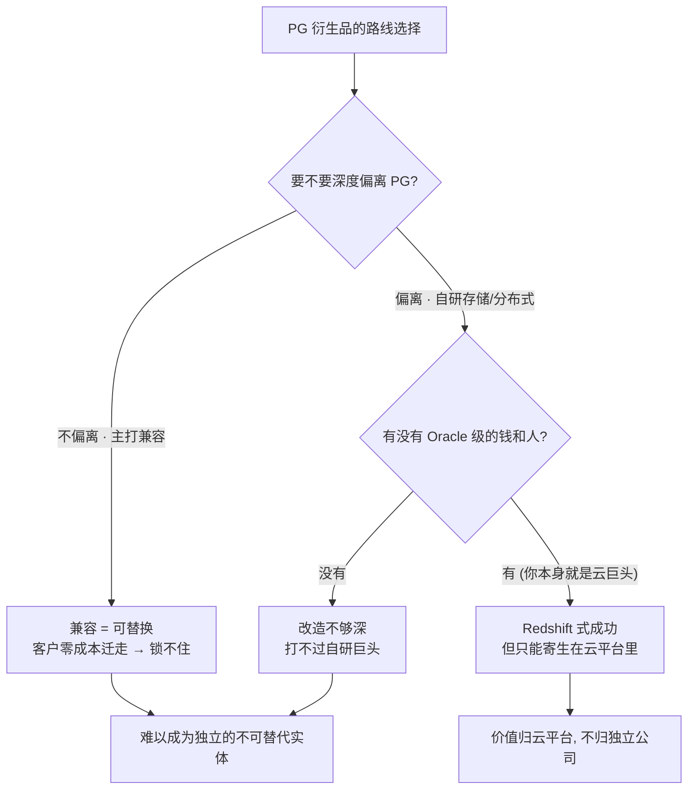
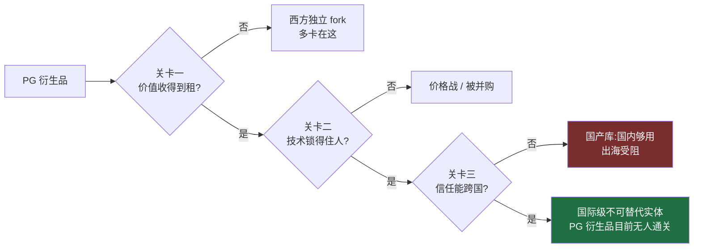

## 德说-第500期, PG 为什么长不出独立的商业数据库巨头? 
  
### 作者  
digoal  
  
### 日期  
2026-07-03  
  
### 标签  
PostgreSQL , 衍生产品 , 国产数据库 , 云厂商 , 公共水池 , 兼容陷阱 , 地缘信任之墙 
  
----  
  
## 背景  
  
先给大家三秒钟, 想一想基于PG内核代码或PG周边的衍生产品, 有没有商业上特别成功的独立数据库企业? oracle/sql server种级别. 

大家能想到什么? EDB? PostgresPro? 瀚高? Greenplum? 或在其他国产数据库厂商? 还是云厂商里的PG兼容产品?  

先看几个赚了大钱的: **亚马逊的 Redshift, 这个每年给 AWS 赚走大把钞票的云数仓, 本质上是一个 PostgreSQL 的改造版 —— 它的老底子就是 PostgreSQL 8.0.2**(这是 AWS 官方文档自己写的)。Aurora 有 PostgreSQL 兼容版; 微软 2019 年把分布式 PG 公司 Citus 收进了 Azure; 2025 年 5 月, Databricks 又花了大约 10 亿美元买下 Serverless PostgreSQL 公司 Neon, 转头包装成自己的 Lakebase。

所以当有人问"为什么这么多基于 PostgreSQL 的东西, 至今没跑出一个不可替代、被国际市场接受的商业实体"时, 我第一反应是: **等一下, 你可能是在一本错的账本上找它的成功。** PG 衍生品创造的商业价值大得吓人 —— 只不过这些钱没有记在一家叫得出名字的"PostgreSQL 衍生商业公司"账上, 而是记进了云巨头的收入表。

这个问题看着是个技术问题, 其实横跨经济学、内核工程和地缘政治三层。 

## 第一关: 靠"卖水"能不能发财

我先去问了一位研究开源经济的人。她给我打了个比方, 我觉得特别到位。

PostgreSQL 用的是 BSD 那一类极度宽松的许可证 —— 任何人都能零成本把内核代码搬走、闭源、拿去卖钱。这在经济学上意味着一件事: **内核变成了一条人人可免费取水的公共河流。** 而经济学有条铁律 —— 一个谁都能零成本复制的东西, 它的超额利润会被竞争抹到接近零。你想靠"我有一个很强的 PG 内核"来当护城河? 隔壁老王拿同一份上游代码, 分分钟做出一个功能上跟你八九不离十的东西。河水是免费的, 你卖不出价钱。

那钱到底被谁赚走了? 被那些**掌握了"河水之外、别人复制不走的东西"的人**: 客户关系、云的入口、数据的重量、品牌信任、合规牌照。云厂商恰好把着分发渠道和客户关系这两个闸门, 所以 Redshift、Aurora 能收到钱, 而一个纯粹的内核 fork 收不到。这就是为什么长大的独立衍生品, 结局大多是被平台吸收 —— Citus 进了微软, Neon 进了 Databricks。它们不是失败了, 是**价值被证明只能在"能收租的那一层"兑现, 而那一层不是内核**。 

这里有个前提得说清楚: 只有当内核的复制成本趋近于零、且许可证不允许你用法律拦住别人复制时, "内核收不到租"才成立。这就是现在 PG 内核的现状. 

## 第二关: "兼容"这个卖点, 本身就是一把双刃剑

经济学解释了"内核层收不到租"。但我还是不服气: 那我技术做得特别牛, 牛到别人离不开我, 不就行了吗? 于是我去问了一位做了十几年数据库内核的架构师。他甩给我一个词: **兼容性陷阱。**

他说, 你去看几乎所有 PG 衍生品的广告词, 最大的卖点都是"100% 兼容 PostgreSQL, 应用零改动迁移过来"。听着很美。但你有没有想过这句话的另一半意思 —— **既然客户能零改动迁进来, 那他也能零改动迁出去。** 兼容是一条双向车道。你越是标榜兼容, 客户想走的时候就越没有障碍, 你就越可替代。而"不可替代"的定义, 恰恰是"客户想走走不掉"。

那怎么才能让人走不掉? 得动真格的重改造 —— 换存储引擎、上列存、做分布式事务、搞向量检索。可这里有个要命的矛盾: **这些重改造和"兼容 PG"是负相关的, 改动越大, 越背离PG。** Redshift 就是活例子: 它为了分析性能, 把数据从行存改成列存、删掉了二级索引和高效单行操作 —— AWS 官方文档明说它"查询执行引擎完全不同于 PostgreSQL"。它因此变得难以替代, 但代价是**它已经不是一个你能随便接上的 PostgreSQL 了**, 而且它只能活在 AWS 的体内。

于是就成了一道两头堵的窄门: 你不偏离 PG, 就锁不住人, 只能打价格战; 你偏离 PG, 就等于从"站在巨人肩膀上"变成"从零造一个数据库", 而这条赛道上的对手是钱和人都比你多几个量级的 Oracle、Snowflake。我把他画的那棵决策树简化一下, 是这样的:

你看, 兼容PG的三条路走到头, 没有一条通向"既独立、又不可替代"。

## 第三关: 就算前两关都过了, 你还得让世界"信"你

假设有个天才真的同时破解了前两道题 —— 既能收到租, 又在技术上锁住了人。他就能成为"被国际市场接受"的巨头了吗? 我去问第三个人, 一位带过基础设施产品出海、又专门研究中国基础软件国际化的操盘手。她说: **"被国际市场接受", 接受的到底是代码, 还是信任?**

她的观点是: 企业买一个数据库, 本质是**一次长期的信任下注**。数据一旦放上去, 迁移成本极高, 所以客户选型时第一个问题从来不是"你快不快", 而是"十年后你还在不在、出事了谁负责、我们的合规官批不批"。这就带出三样代码之外、买不来也抄不快的东西: 开发者心智里的默认选择、一整圈靠你的数据库产品吃饭的 ISV 和人才生态、以及能跨越国界的信任 —— 品牌、SOC 2 / ISO 27001 这类合规资质、治理中立, 以及最关键的, **不被贴上地缘风险的标签**。

而这恰恰是中国 PG 衍生品的真正天花板。它们在国内信创市场活得很好, 技术早就够用了 —— 但一出海就撞上这堵墙。有个细节特别说明问题: 华为主导的 openGauss 在 2025 年 12 月的峰会上, 谈到国际市场时用的措辞是"未来将与产业链合作伙伴**共同出海** "。 **"未来""共同出海"这种将来时本身就是答案** —— 现在的国际接受度还不是既成事实, 而是一个目标。数字也印证了这点: DB-Engines 2026 年 4 月的榜单上, 国内的 PG 衍生产品里 PolarDB 全球第 39, openGauss 第 84, 声量主要来自国内。

所以把三层叠起来, 一张过滤器就清楚了 —— **西方的衍生品已经倒在前两关(收不到租、兼容陷阱), 中国的衍生品目前还卡在第三关(信任与地缘)** :

## 那些"三关全过"的赢家, 偏偏没走 PostgreSQL 衍生这条路

最有意思的是, 三个人虽然角度天差地别, 却不约而同指向了同一个反例: **Snowflake。**

它是今天独立、不可替代、被国际市场全盘接受的 1 家数据公司 —— 2025 财年第四季度营收 9.868 亿美元、同比增 27%, 并指引 2026 财年产品营收约 42.8 亿美元, 全球 DB-Engines 排到第 6。它把三关全过了: 有独有的自研引擎和数据引力(收得到租、锁得住人), 注册在中立主流的司法管辖区、靠海量 ISV 生态建立了默认心智(跨得过信任)。

但你注意到没有 —— **它这三样, 没有一样来自 PostgreSQL。** 它压根就没基于 PG, 而是自研了一个云数仓。

它证明了一件事: 想在数据库这行当做到"独立且不可替代", 你得拥有一堆别人复制不走的重资产, 而开源公地里, 恰恰没有这种东西。 (我得补一句, 这里说的开源特指PG这种的无企业主导、纯社区开源产品)

所以回到最初那个问题, 我现在的答案是: PG 没长出独立巨头, **不是谁不够努力, 而是这套结构从设计上就把独立巨头这条路堵死了**。宽松许可证让内核变成免费河水(收不到租), 兼容路线让"锁定"和"卖点"互相打架(锁不住人), 而出海又是一场比拼信任和地缘的战争(中国厂商尤其难)。价值不是没产生, 是顺着水管流去了云平台; 唯一三关全过的玩家, 用脚投票地绕开了 PG。

## 前面的结论也许会被打脸

这套判断对不对, 不用吵, 会不会被大脸只要盯着下面这些事件: 

- **看并购还是 IPO**: 下一家融资超 5 亿美元的独立 PG 公司(Supabase 已到 105 亿美元估值、Timescale 这类), 最终是走向独立上市, 还是又一次被云厂商/大数据平台收编。如果有独立公司能把经营性年收入做到 10 亿美元量级、三年不被并购 —— 第一层的"公地收不到租"就被打脸了。
- **看堆兼容还是押专有层**: 国产和独立 PG 厂商的新版本, 是继续吹"100% 兼容", 还是开始押注"非 PG 易复制"的东西(向量、列存、实时 HTAP、数据库分支)。若有人能第一个同时做到"完全兼容 + 客户技术上迁不走", 第二层的兼容陷阱就该退休。
- **看'出海'的时态变没变**: 下一届 openGauss / PolarDB 的海外峰会, "出海"是继续用将来时, 还是能亮出**可独立核实的欧美生产环境付费客户**、拿到成套国际合规认证。时态一变, 第三层的地缘天花板就松动了。
- **看 AI Agent 这波新牌**: Databricks 说 Neon 上每 5 个数据库有 4 个是 AI Agent 建的。AI 原生数据库可能整个改写规则 —— 盯住到底是"信任中立 + 生态"的玩家胜出, 还是"纯技术快"的玩家胜出, 这决定了上面三层里哪一层卡点最先失效。

## 开放式问题
最后这条提到的"每 5 个数据库有 4 个是 AI Agent 建的"值得玩味  
 
前面三层分析(收租、兼容、信任), 暗含的决策者始终是人: 一个开发者、一个 DBA、一个企业采购、一个合规官。三道关卡之所以成立, 全靠人的心理:
- 人有长期云关系、怕数据搬家 → 撑起关卡一 (价值归掌握客户关系的平台);
- 人厌恶迁移、看重"零改动" → 撑起关卡二 (兼容陷阱);
- 人有品牌偏好、有合规恐惧、会怕地缘风险 → 撑起关卡三 (信任天花板)。

而 AI Agent 是完全不同的买家。它"试错式"地大量并行创建、用完即弃,它要的是秒级开库、分支、便宜的临时副本;它没有品牌忠诚,没有合规官的恐惧,也不会因为供应商是中国血统就皱眉。当这种"非人类买家"占了 80%,三道关卡的地基就开始松动 —— 但往哪个方向松,还没定。

最后, 就会演变成另一个问提: AI 时代到底按什么标准选数据库?  

如果"纯技术快"的玩家胜出 —— 意味着 Agent 纯粹按"谁最适合我的工作负载"(秒级 branching、serverless、临时副本便宜)来选,不管你是谁、注册在哪。那么最先失效的是关卡三(信任与地缘): 因为把守这道关的是人的合规审查和地缘顾虑,而 Agent 根本不看这些。这对卡在第三关的国产库反而是利好 —— 一个技术够快的中国 PG 衍生品, 可能被 Agent 生态直接采纳, 绕过了人类采购的白名单。

如果"信任中立 + 生态"的玩家胜出 —— 意味着 Agent 的选择其实不自由, 它被"喂"给它的那套工具链/平台默认值牵着走(哪个 AI 编程助手、哪个云、默认接了哪个库)。那么人类世界的信任逻辑没消失, 只是换了个地方继续存在: 从"采购信不信你"变成"你是不是 Agent 工具链里的默认集成"。这种情况下关卡三照旧成立, 真正被架空的是关卡二(兼容陷阱) —— 因为锁定不再靠"兼容 PG", 而靠 Agent 原生的专有能力(分支、秒级隔离), 兼容与否变得没那么重要了。

  
Databricks 花 10 亿买 Neon、又强调"4/5 的库是 Agent 建的", 就是在下注后一种 —— 它想成为 Agent 时代那个"默认被接进去"的平台。 
  
  
#### [PostgreSQL 解决方案集合](../201706/20170601_02.md "40cff096e9ed7122c512b35d8561d9c8")
  
  
#### [德哥 / digoal's Github - 公益是一辈子的事.](https://github.com/digoal/blog/blob/master/README.md "22709685feb7cab07d30f30387f0a9ae")
  
  
#### [About 德哥](https://github.com/digoal/blog/blob/master/me/readme.md "a37735981e7704886ffd590565582dd0")
  
  

  
