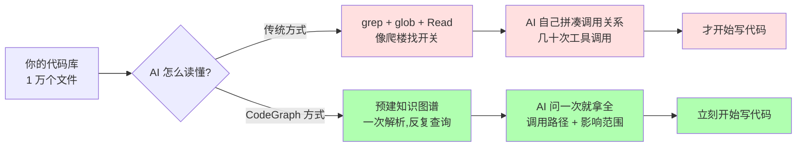

## CodeGraph: 给 AI 编程助手装上代码导航地图
  
### 作者  
digoal  
  
### 日期  
2026-07-03  
  
### 标签  
AI , coding , agent , 代码搜索 , 效率 , 上下文 , 交互次数 , 代码导航地图 
  
----  
  
## 背景  
  
  
你让 AI 帮你改个 bug, 5 分钟过去, AI 还在「找文件」 —— 它读了 9 个文件、调用了 50 次搜索工具, 问它"还有没有别处会受影响", 它说"我再看看"。

这是 2026 年大多数 AI 编程助手的真实工作状态。 **AI 不笨, 笨的是它每次接活都得从零摸索你的项目长什么样。**

CodeGraph(github.com/colbymchenry/codegraph)在 GitHub 上有 5.73 万颗星, 它做的事很好理解: **把 AI 找文件这件事, 从"每次现翻"变成"提前画好地图"** 。
 

## 一张图讲清楚: CodeGraph 在哪一层

我换个你熟悉的比喻。 **把代码库比作一座大楼** —— 传统 AI 助手是「举着手电筒一层一层爬楼找开关」,CodeGraph 是「给 AI 一张带荧光标记的建筑蓝图」:电梯在哪、哪根线连着哪根线、改这一面墙会不会影响隔壁,全标好了。AI 一上来就知道整个楼的结构,不用现爬。

这就是 CodeGraph 的核心 —— **不是让 AI 更聪明,而是让 AI 别再重复劳动**。

 

## 为什么 AI 读代码这么费劲? 三个绕不开的硬约束

你可能会问:既然 AI 这么强,为什么读个代码还要这么费劲?这背后有几个绕不开的硬约束。

第一,**AI 的「短时记忆」是按字数收费而且有限的**。大语言模型有个东西叫「上下文窗口」,可以理解成它的「工作记忆」。Claude Opus 4.8 的工作记忆大约是 20 万字——听起来很大,但一个几万行的中型项目,光把所有文件平铺一遍就要几百万字,根本塞不进去。更要命的是,这个记忆是按字数收费的,你塞得越多,每次回答都越贵。所以对 AI 来说,**只把最相关的代码塞进去,是生死攸关的事**。

第二,**AI 每问一次都要「来回跑腿」** 。AI 调一次工具,本质是:AI 发出请求 → 电脑执行 → 结果传回 AI。这个过程哪怕只查一行字,也要花几百毫秒,还要把结果序列化传回去。 **工具调用的成本跟它返回了多少信息成正比,跟 AI 是否需要这些信息无关**。你想知道「这个函数被谁调用」,用 grep 可能返回 200 个匹配的文件路径,AI 还得再读 50 个文件才能确认;用 CodeGraph,一次查询就给你结构化的「5 个直接调用者 + 2 个间接调用者 + 每个调用点的代码」。

第三,**AI 不理解代码,只理解「模式匹配」** 。很多人会误以为 AI 看代码跟人看代码一样,其实不是。AI 本质是个「超级文本预测器」,它不真正懂代码的语义,只是从海量代码里学到了「这种写法通常意味着什么」。但它**靠代码字面看不出隐藏的调用关系** —— 比如一个函数被传进了字典里、运行期才被调用,或者通过接口多态调用、具体哪个子类要看运行期类型。CodeGraph 用一些启发式规则,把这些能推断的隐藏关系都标出来,至少给 AI 一个「大概是这样」的提示。

这三条加起来,就解释了为什么「预先建一张代码地图」这件事这么有价值。CodeGraph 不是发明了什么新算法,它是把搜索引擎领域一个经典的范式转移——**倒排索引之于 grep,就是 CodeGraph 之于「AI 反复读文件」** —— 应用到了 AI 时代。

 

## 它和你听过的那些工具有什么不一样?

如果你在程序员圈子里混过,可能听过 ctags、LSP、Sourcegraph 这些名字。CodeGraph 和它们是什么关系?

把时间线拉长,你会发现一条清晰的演化线:**1980 年代的 ctags 像图书目录,只告诉你「这个仓库里有哪些函数」** ;**1990 年代的 cscope 像交叉引用表,能查「谁调用了谁」但要自己写查询语句**;**2016 年出现的 LSP(语言服务器协议)是编辑器用的「实时翻译」,光标移到哪个变量就告诉你定义在哪**;**2019 年的 CodeQL 是 GitHub 出的「代码安全审计引擎」,强大但门槛极高**;**2013 年至今的 Sourcegraph 把代码搜索做成云服务,支持跨仓库的全局搜索**。

**CodeGraph 的根本区别在于:消费者从「人」换成了「AI」** 。前面这些工具都是给程序员用的「代码搜索引擎」,而 CodeGraph 是给 AI 用的「代码大脑外挂」——它不需要漂亮的网页 UI,只需要一个极简的查询接口,让 AI 用一次调用就拿到所有需要的东西。

**对小白来说,这条演化线最重要的一句话是:这件事不是横空出世的,而是 30 年代码分析积累下来的**。CodeGraph 不是从零发明了什么魔法,它是站在前辈的肩膀上,把消费者从人换成 AI。

 

## 实操层面: 这工具到底值不值得装?

如果你不是程序员,可以直接跳到下一节。但如果你想自己试试,这里有几个实操判断。

**对小白来说,只要你的项目是用主流语言、文件数过百、走 git 管理,装它就是稳赚的「被动收益」** —— 不用配置,不用学命令,装完就忘了它的存在,AI 自动变快。安装就是一行命令(`npm i -g @colbymchenry/codegraph` 或 `curl | sh`),接入是一行命令(`codegraph install`),自动检测你电脑上装的 7 款主流 AI 工具(Claude Code、Cursor、Codex、opencode、Hermes Agent、Gemini CLI、Antigravity IDE、Kiro)。

**官方在 7 个真实开源项目上测出来的数据是:工具调用平均减少 58%、速度平均提升 22%、AI 几乎不再需要自己去读文件**(从平均 7-9 次文件读取降到 0-1 次)。最有说服力的一组:VS Code 这种 1 万个文件的巨型项目,工具调用减少 81%。

但我必须诚实告诉你三个边界: 

- **极小项目(几十个文件)反而是杀鸡用牛刀**。一个 200 行的脚本根本没有「调用关系」可言,直接让 AI 通读全文反而更快。CodeGraph 的索引本身有启动开销,小项目用不上。
- **冷门语言可能识别率下降**。CodeGraph 支持 23 种主流语言(TypeScript、Python、Go、Java、Rust、Swift、PHP、Ruby、C/C++、Kotlin、Scala、Lua、Dart 等),覆盖了 95% 以上的商业项目。但如果你用 COBOL、Fortran、Zig、Elixir、Haskell 这些相对小众的语言,可能解析失败或覆盖率低。
- **官方数据是「自测自报」,没经第三方独立验证**。我作为老兵看这种数据通常会打个折 —— 因为他们的方法学是「真实代码库 + 真实 AI 模型 + 多次取中位数」,可信度还是高的,但真实数字可能比官方保守 10-20%。如果你打算据此做重要决策,建议等 6 个月看有没有独立机构的复现测试。

**对非技术读者**:这个工具不是给你用的,它是给「用 AI 写代码的人」用的。但你可以要求你的开发同事装上,装完他的活干得更快,你的需求被实现的也更快。

 

## 它在行业里是什么位置? 卡在「工具 → 平台」的关键拐点

我看了 7 年开发者工具赛道,有个判断框架:**所有成功的 dev tools 都走过「工具 → 平台 → 标准」三段**。工具阶段用户因为「省事」来,没有锁定效应,容易被复制;平台阶段用户因为「协作」留下,具备网络效应,商业化窗口出现; 标准阶段上下游因为「必须兼容」而来, 护城河极深, 但通常需要 5-10 年。

Replit 走通了这条路径(工具 → 平台),Sourcegraph 卡在平台层多年,GitHub Copilot 直接被微软塞进平台层而非从工具做起。

CodeGraph 当前卡在哪? **正好卡在「工具 → 平台」的转换点上**。它通过 MCP 协议(2024 年 11 月 Anthropic 推出、2025-2026 年陆续被 OpenAI、Google、Cursor、Replit 采用)接入 7 款主流 AI 编码工具 —— 这是它关键的「卡位」:一旦 MCP 成为事实标准,任何 MCP 兼容的 AI 工具都能用上 CodeGraph。

但这条路径有个**残酷的统计现实**:开源明星项目最终形成可持续商业收入的比例,**业界共识区间是 20% 左右**(这来自 GitHub star 过万项目的 5 年跟踪数据和加速器内部数据,不是单一权威研究)。CodeGraph 团队正在做的 CodeGraph Platform(企业级产品,定位「在每个 PR 上精准识别测试范围、潜在破坏点、影响业务流程」)就是这个转换的关键一击。

我对它的判断是:**如果 2026 年 Q3-Q4 平台 Beta 公布首批企业付费客户名单、且早期用户留存率 > 50%,CodeGraph 就从「优秀开源工具」升级为「新基础设施候选」** ;如果做不到,大概率沦为「又一款被微软或 Anthropic 内置的竞品吸收掉的明星项目」。

**对创业者**:这是个有意思的赛道信号 —— 围绕 AI 编码代理的中间层服务有空间,但要避开 CodeGraph 卡住的代码理解层,从上层应用(代码评审、文档生成、测试覆盖)切入。

**对投资人**:这是「AI 编码基础设施」标的类型,但「开源 → 平台」成功率要谨慎打折, 不要被 57k star 数字冲昏头。

**对企业 CTO**:如果你的团队 50 人以上,PR 级别的代码风险分析是真实痛点,值得在 2026 下半年评估试用;但要警惕「早期产品稳定性」和「供应商锁定」两个风险。

## 一句话总结

CodeGraph 在做的事,就是**给 AI 编程助手装上一张「代码地图」** 。它不是让 AI 更聪明,而是让 AI 不再每次接活都从零摸索 —— 就像给一个熟悉每条街道的导游配上整座城市的蓝图。它有 57k 颗星、25 个 release、昨天刚更新,7 款主流 AI 工具都能用,100% 本地运行无数据外传。对大多数用 AI 写代码的人来说,这是个「装上就忘、AI 自动变快」的工具;但对行业观察者来说,它是 AI 编程赛道「工具 → 平台」转换期的关键卡位 —— 成不成功还要观察。
  
  
#### [PostgreSQL 解决方案集合](../201706/20170601_02.md "40cff096e9ed7122c512b35d8561d9c8")
  
  
#### [德哥 / digoal's Github - 公益是一辈子的事.](https://github.com/digoal/blog/blob/master/README.md "22709685feb7cab07d30f30387f0a9ae")
  
  
#### [About 德哥](https://github.com/digoal/blog/blob/master/me/readme.md "a37735981e7704886ffd590565582dd0")
  
  

  
