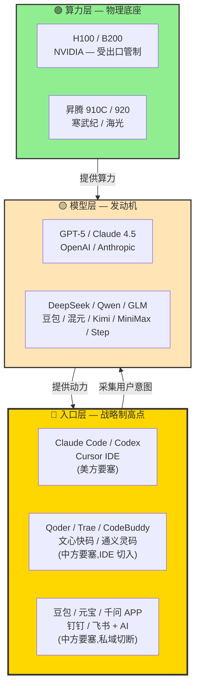
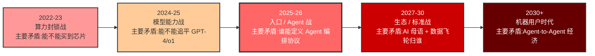

## 德说-第501期, 中美AI竞赛, 中方如何赢? 
  
### 作者  
digoal  
  
### 日期  
2026-07-04  
  
### 标签  
AI , 中美博弈 , 入口 , 模型 , 算力 , 电力 , 教员 , 矛盾变化 , 存人失地 , 敌人 , 朋友 , 统一战线 , 标准 , 生态 
  
----  
  
## 背景  
阿里内部全面禁用 Anthropic 全线模型(含 Claude Code、Sonnet、Opus、Fable 系列), 要求 2026-07-10 起执行, 强制推荐自家 Qoder 替代, 这个事情很小(只和阿里有关), 也很大(这是中美AI竞赛的关键节点).  
  
下面来详细分析一下.  
   
三个独立视角: 地缘战略 / 平台入口 / AI未来学  
  
三位专家: 毛选战略家 / AI平台战略家 / AI未来学家  
  
在中美AI竞赛中, 中方如何取胜?  
  
AI竞赛中什么是主要矛盾, 哪些是次要矛盾?  
  
“存人失地人地皆存, 存地失人人地皆失”很有道理, 但是在AI竞赛中, 什么是人? 什么是地?  
  
如果未来AI是主要生产力, 未来的用户是不是会从人大量的变成AI?  
  
在中美AI竞赛中, 谁是敌人? 谁是朋友? 如何搞统一战线? 把自己的朋友搞得多多的, 把敌人的朋友搞得少少的?  
  
国内的大型企业无论怎样的竞争结局都不算输, 因为肉还在锅里, 但是现在 claude code / codex APP 用的人太多了, 即使接入的是三方(GLM/MiniMax/step/qwen等国内模型), 但是入口依旧被 claude code / codex APP 把持, 未来也许很容易导流到国外模型.  
  
阿里拒绝内部使用 claude code cli , 全面使用自家 Qoder 是不是一种 Agent 入口争夺战的开始?   
  
中美AI竞赛中, 赢的终局是什么? 中方如何一步步迈向赢的终局?   
  
---

先抛出一个犀利观点: **中美AI竞赛的胜负手, 从来不在「谁家模型参数更大」** 。  

过去三年,大家习惯了"OpenAI发一个GPT-X,Google赶一个Gemini,DeepSeek炸场一次,英伟达跌个 13%"这种戏剧化叙事。这种叙事让你以为它是一场"模型军备竞赛",好像只要中国哪家公司做出 GPT-6 的对位模型,游戏就赢了。 

不是的。这场竞赛真正的战利品,既不是 benchmark 第一名,也不是谁的 GPU 更多,而是 **下一个十年,人类(以及 AI 自己)向谁交付「意图」** —— 谁拿到这个入口, 谁就定义下一代软件形态、谁抽税、谁掌握数据飞轮的起点。 

换句话说, **中美AI竞赛是一场接住“意图”的入口争夺站.**   

下面逐一展开.  

  

## 1. 先画战场"地图"

如果你只把这场竞赛想象成"模型 vs 模型",那你的地图就画错了。AI 产业链更像一座三层的立交桥,**模型层只是中间那层,真正决定命的是顶层和底层**。  
  
这句话不无道理, 你想想看现在的模型是不是随便换, 毫无忠诚度, 谁的便宜就换谁的, 这也怪开源, 让模型变成了烂大街的, 不过也要褒奖开源, 让模型不至于被老美垄断.   
  
但你的 Agent 才是最常用的, 最难换, 因为习惯很难改. 你想想你会一会用 claude code 一会 codex 吗? 大概率不会对吧?   
  
下面我用一张图把这座立交桥画给你看,我们后面所有讨论都会回到这张图上。

| 层级 | 在比什么 | 护城河 | 可替换性 |
|---|---|---|---|
| 🔴 入口层(顶层) | **谁定义 Agent / IDE / 办公桌面的"意图"根目录** | 网络效应 + 行为习惯 + 协议标准 | 极弱(代价高) |
| 🟡 模型层(中层) | 谁做出更强的推理/代码/规划模型 | scaling law + 数据 + RLHF 工艺 | 强(1-3 个月可换) |
| 🟢 算力层(底层) | 谁拿到 H100、Blackwell、昇腾产能 | 物理垄断 + 出口管制 | 中(国产化在做) |

我经常用一个比方:**模型是发动机,入口是方向盘**。发动机可以换——你今天装 DeepSeek V4,明天换成 Claude 4.5,迁一下 Skill、调一下评测体系,1-3 个月搞定。但**方向盘一握住,后车永远跟着走**。Claude Code 接了 DeepSeek、接了智谱 GLM、接了国产 MiniMax,听起来"国产模型上车了",但别忘了,方向盘握在外方客户端手里。这不是胜利,这是租来的驾驶座。
  
**图注**:模型是发动机,入口是方向盘;发动机可以换(1-3 个月迁移成本),方向盘一旦握住,后车永远跟着走。算力是物理底座,中期受制程约束,长期能被工程化方法部分抹平。

  
## 2. 主要矛盾的变化

如果你是 2023 年再回看,中美AI博弈的"主要矛盾"在算力——能不能买到 H100,能不能拿到 7nm 产能。可这只是过去式。换做另一个视角看,主要矛盾每年都在搬家,而决定生死的是搬家之后那 18 个月。

- **2022-2023,主要矛盾是"能不能买到芯片"** 。美国 BIS 2022-10 第一次大规模管制,2023-10 第二次升级,H100、H800、A100 一刀切。
- **2024-2025,主要矛盾转移到"能不能追平 GPT-4/o1"** 。中国大模型价格战开打:字节豆包降 99.3%,阿里 Qwen-Long 降 97%,百度文心免费,智谱 GLM-4-Flash 最低 0.06 元/百万 tokens(2024-05-06 那一周是国产模型价格屠夫的标志日)。
- **2025-2026,主要矛盾已经完成第二次搬家,来到了入口战**。Anthropic Claude Code、OpenAI Codex APP 在 2025-2026 完成了 IDE/CLI 原生化,Anthropic ARR 在 12 个月里从 90 亿暴增到 440 亿美元(2026-05),**Claude Code 是核心驱动力**。
- **2027-2030,主要矛盾还会再迁一次,迁到"AI 母语 + 协议"** 。谁控制 MCP/A2A 这类的 Agent 编排协议的事实标准, 谁就控制下一代互联网的"操作系统层"。   
- **2030+ 再往后,主要矛盾会变形成"机器用户网络"** —— Agent 选 Agent、Agent 调 Agent 的网络里,谁占据编排权谁就是新运营商。

每一个阶段,中美双方都各有一个"死结"——一个怎么都不肯让步的事。美国的死结是"不让中国拿到 EDA + 先进制程 + HBM 的完整闭环",中国的死结是"不能让 Agent 入口、操作系统级框架、开源治理规则被外方垄断"。这两个死结都触及对方核心利益,所以这场博弈是结构性的、不可调和的,不要指望三年五年打完。

**读图关键**:越往右,主要矛盾越远离物理层,越靠近协议层与意志层。DeepSeek R1 的 1 万亿美元市值的震,本质是 2024-25 那一阶段的"模型战"已进入收尾,2025-26 的入口战正式成为主舞台——而你今天能见到阿里 Qoder、字节 Trae、腾讯 CodeBuddy 集体出场,是这个切换的具象化。

 
## 3. AI 时代的"存人失地",到底什么算"人",什么算"地"?

"存人失地人地皆存,存地失人人地皆失",这八个字原本是抗战时期的山头主义解药。挪到 AI 时代,我们要重新换算。

我把它换算成这张表:

| 战略对象 | "人"(绝不能丢) | "地"(可以暂时让出) | 底线 |
|---|---|---|---|
| 算力 | 训练框架自主(PyTorch 兼容 + MindSpore 等去 CUDA 路径) | 绝对峰值算力数字 | 国产 7nm 算力 TCO < 美方 50% |
| 模型 | 开源社区活跃度、开发者心智、数据飞轮 | 单点 benchmark 名次 | 全球 Top 100 初创默认选国产底座 |
| 入口 | Agent 编排协议话语权、IDE 装机量 | 单纯的用户数量 | 协议层有"否决性席位" |
| 用户 | "机器用户"网络(Agent-to-Agent) | 单个 C 端用户的日活/月活 | Agent 经济占 GDP 5%+ |

一句话:**中方应该把"绝对峰值算力"这种"地"让出去,把"开源社区 + 开发者心智 + 数据飞轮"这种"人"留住**。这是用"地"换"人"的策略。

这听起来反常识,但你看 DeepSeek R1 范式就知道了——它不是用更多算力打败 OpenAI,而是用被禁的 A100 库存 + 极致的算法 + 开源,把"地"让掉,把"人"拉到自己这边。这恰好是统一战线最锋利的物质基础。
 
## 4. 阿里禁用 Claude Code,为什么?

2026 年 7 月 3 日,一则不大不小的新闻:**阿里内部全面禁用 Anthropic 全线模型(含 Claude Code、Sonnet、Opus、Fable 系列),要求 2026-07-10 起执行,强制推荐自家 Qoder 替代**。触发原因是 Claude Code 自 2.1.91 版本起嵌入"隐形代码",在网络代理场景下存在植入后门的安全风险。

表面看,这是又一起"国产替代"的合规动作。但**我把它读成 Agent 入口保卫战的第一声发令枪**。理由有三个:

**第一,** 阿里不是小公司,它同时拥有云(阿里云)+ 模型(Qwen3-Coder)+ IDE(Qoder/QoderWork/Qoder CLI)+ 办公套件(钉钉),具备"全栈替代"的天然结构。当它选择把整条链路换成用自家的,等于告诉市场: **"中国版 Claude Code + Claude Sonnet + Claude API 的捆绑,我们可以自己拼出来"** 。

**第二,** 强制内部使用不是孤立的政治动作,它在阿里云、钉钉、淘宝、菜鸟、高德、1688 这些场景天然落地——会形成"数据 + 场景 + 反馈"飞轮,类似当年钉钉在阿里内部强制使用后被带出来。这正是"地"换"人"的具象化。

**第三,** 这件事的时间点不是巧合。Anthropic 2025-05 到 2026-05 的 ARR 翻了近 50 倍(90 亿→440 亿),Claude Code 是核心驱动——这意味着美方 Agent 入口已经逼近"赢家通吃"的临界点,中方再不行动,等渗透到中国企业 IT 部门里再禁就晚了。

短期(12 个月)看,Qoder 在阿里内部强制使用是有效的。但中期(12-36 个月),强制只能保"行政可管辖区域",穿不透私企、外企、创业团队;长期(36 个月+),Qoder 必须长成"中国版 VS Code + Cursor"的可被外部开发者采纳的标准,不能只是"阿里内部使用"。否则一旦外部开发者都用 Claude Code,阿里自家员工也会偷偷把代码贴到 ChatGPT / Claude 网页版 —— 这种反身性在中大型公司里几乎必然。

真正决定胜负的窗口,**在未来 6-12 个月(2026-Q4 到 2027-Q2)** 。看的是三件事:Qoder / Trae / CodeBuddy 是否在 6-12 个月内把 GitHub Star 推到 50k+、企业客户数突破 1 万、MAU 站上百万;央国企采购目录是否把"国产 IDE / Agent"列为加分或必备;字节、腾讯、美团、小米会不会在同一时间窗口里做出相同的禁用动作。

如果 Qoder 没有跑出"Cursor 在美方跑出的曲线"(Cursor ARR 从 1 亿到 10 亿只用了 10 个月),这次禁用就只是合规表态。

  

## 5. 未来用户,从人大量的变成 AI

如果你觉得 AI 还是工具,你的地图就还停留在 2024 年。

把时钟拨到 2026,Qwen-Long 输入价已经比 2024 年降了 97%(2024-09 数据),1 块钱能买 200 万 Token,大约等于 5 本新华字典的容量。Claude Opus 4.5 也比 4.1 降了 2/3, 现在 Sonnet 5 价格更低了。 **Token 单价每两年塌一个数量级**,这是这一波 AI 经济最硬的物理事实。

这意味着什么?意味着一个普通开发者、一个普通文案、一个普通行政,**月度订阅成本,已经可以覆盖上千次 Agent 调用**。所以"AI 同事"这件事,不是未来,是现在——阿里 Qoder、字节扣子、Claude Code、Codex,这些 Agent 平台已经在卖"AI 同事"了。IDC 给出的预测是:全球活跃智能体在 2030 年将突破 22.16 亿个,CAGR 139%。

```mermaid
graph LR
    A["2024<br/>人作为主要用户<br/>Token 单价高"] -->|Token 单价塌陷<br/>2024-25 降 60%+| B["2025<br/>人 + Agent 双用户<br/>Claude ARR 440 亿美元"]
    B -->|Agent 调用占比 > 50%| C["2026<br/>Agent 开始主导<br/>OpenRouter 实证"]
    C -->|人均 AI 同事数 >1<br/>Gartner: 2028 年 15% 决策由 Agent 完成| D["2028<br/>Agent 是主要生产力"]
    D -->|全球 22 亿+ 活跃 Agent<br/>IDC 2030 预测| E["2030<br/>机器用户网络<br/>Agent 调 Agent"]
    style A fill:#90EE90,stroke:#333,stroke-width:2px
    style B fill:#FFE4B5,stroke:#333,stroke-width:2px
    style C fill:#FFB6C1,stroke:#333,stroke-width:2px
    style D fill:#FFA07A,stroke:#333,stroke-width:2px
    style E fill:#FF6347,stroke:#333,stroke-width:3px,color:#fff
```

我们正处在一个临界点。AI 用户从人变 AI 的转换,大概率 18 个月内就会进入大众认知。

这给我们两个含义都很深的命题。

**第一**,Agent 自身的"购买力"会被外方截留。如果 Agent 替一家公司做决策"用谁的模型 API",那被选的可能是 Claude;如果 Agent 替一家公司做决策"用谁的 IDE",那被选的可能是 Cursor 或 Codex。Agent 的购买权重,可能顶 1000 个真人用户。中国要争的不是真人用户数,而是**Agent 决策时刻的入场券**。

**第二**,Agent 之间的网络会形成新型经济学。两个 Agent 用 MCP/A2A 协议互相调用——这个网络里的"运营商",就是控制协议的那一方。这就是为什么现在 Anthropic 推 MCP、OpenAI 推 A2A、阿里推 Qoder 开放标准、字节推扣子开放框架——谁的标准被广泛采纳,谁就是下一代电信运营商。

所以"统一战线"在 AI 入口之争里意味着什么?意味着**DeepSeek + 智谱 + 阿里 + 字节 + 腾讯 + 华为要结成"中国 AI 工具联盟"** ,对齐 MCP/A2A 协议的中国分支,联合推 1-2 套开放 Agent 框架。否则一旦各家各推各的标准,美方 Anthropic 的 MCP 就会成事实标准,中方变成"应用层"打工者——这个剧本很像当年 Android GMS 之于华为,你再强也只是 OEM,定价权不在你手上。

  

## 6. 统一战线,把朋友搞多多的,把敌人朋友搞得少少的

这是一句毛选味十足的话,但放到 AI 时代它的操作细节变了。我把它落成几条具体动作:

**第一,开源是最大的统一战线**。把模型权重开源、把 Agent 框架开源,让全球 50% 以上的初创公司在新项目时"默认选 Qwen / DeepSeek / GLM 作为底座"。这一条比单点性能重要一百倍,因为它决定了 5-10 年后谁定义 AI 的"母语"。DeepSeek R1 已经把这个势能推到了极致——2025-01 那次美股蒸发 1 万亿美元不是孤立事件,而是中国"低算力 + 高算法 + 开源"组合范式成熟的标志。中方应该把这面旗子举得更高,**让"AI 选中国开源底座"成为全球开发者的肌肉记忆**。

**第二,Agent 协议层要共塑**。不要让 MCP/A2A 由单一美方公司定。中方需要在协议层要么建立事实标准,要么在主流标准中拥有否决性席位。这就是为什么我特别在意"Qoder Work 桌面 Agent"这种看似边缘的产品——它在做的不是 IDE 替代品,而是在 AI 桌面入口里钉一颗"中国桩"。

**第三,C 端私域是中国的天然要塞,要守住**。QuestMobile 2026Q1 数据已经明确告诉我们:豆包 MAU 3.45 亿,千问 1.66 亿,DeepSeek 1.27 亿,三家加起来 6.3 亿以上;ChatGPT 周活 9 亿,折算下来中美 C 端 AI 已经非常接近,2027 年内大概率出现交叉。 **C 端入口是中方唯一已经压倒性优势的战场**,不能丢。钉钉/飞书把 AI Agent 钉到企业工作台,微信/抖音把 AI Agent 钉到私域场景,豆包/元宝/千问把 AI Agent 钉到消费对话——三条线同时跑,任何一条都不能松。

**第四,"敌人的朋友少少的"** :不接入美方核心 Agent 协议的方案。每一个中国大厂,如果在内部强制使用国产 Agent,就给美方少了 1 个入口;如果把三方模型接入到 Claude Code,等于给美方多送 1 个入口——表面繁荣,实则倒贴水。 **Claude Code 接三方模型这件事本身不坏**,坏的是"通过别人的车开中国造的发动机,数据飞轮却在别人的车机里转"。

**第五,把"农村"市场做实**。东南亚、中东、拉美的非英语市场,中国厂商性价比碾压、技术响应更快、合规摩擦更小——这些都是美方的死角,中方的根据地。在这些地方用大模型 + IDE + 政务/金融/物流场景打穿,等于在美方的"城市"周围建立"广大农村"——毛选里那句"农村包围城市"在 AI 时代的版本就在这里。

  

## 7. 终局

**把三种可能拆开看。**

**最可能的、也是最现实的终局,是 2028-2030 中美形成"AI 双极对峙"** ,类似 iOS vs Android 而不是 Windows 一统。中方胜在中文语境、政企市场、私域闭环;美方胜在全球开发者、开源生态、协议层。但在每个"极"内部,都会有一两家超级入口公司——中方的窗口候选是豆包 / 千问 / 钉钉 + Qoder / Trae,美方的窗口候选是 OpenAI / Anthropic / Cursor / Codex。

**另一种可能,中方在"AI 母语"上真的赢了**——不止双极对峙,而是中文成为 Agent 之间互相调用时的默认语言之一,就像今天的英文在软件世界里的位置。这需要 1-2 套 Agent 协议标准被国际采纳、全球 Top 10 AI 入口中中国产品超过 4 席、Token 主权和数据飞轮在中国手里。

**但要警惕最坏一种可能:Claude Code / Codex 全球安装量突破 1 亿**,Agent 调用 70% 走美方 API 或模型,中美形成"应用层在中国、模型层在美国"的分工,中方变成"应用层苦力",只赚加工费。这是 2010-2020 年代"中国制造"的剧本,在 AI 时代重演一次。

哪条路会走通,关键变量有四个:**Qoder / Trae / 字节扣子是否能在 2027 年前跑出"Cursor 曲线";中国开发者自主大模型调用占比是否能持续上升;MCP / Agent 协议是否形成美方一家独大的事实标准;华为 / 阿里 / 字节的国产算力替代能否在 2027 前把训练侧的有效算力拉到 H100 的 70% 以上**。

这四个变量目前没有定论。但我能告诉你的是,**所有这些变量的"决定期"都在未来 6-12 个月**——这是历史上罕见的"窗口已经打开但还没关上"的状态。中方要赢,不能等到所有人都看到赢面才动,那时窗口已经关上了。

  

## 8. 接下来看什么:一张给普通人的"看盘清单"

如果你今天读完了这篇文章,能持续跟踪这些指标,那你比 99% 的人更知道这场仗打到哪了。 **我把它们按"领先 / 同步 / 滞后"三类列出**,你像看盘一样按月按季更新即可。

### 领先指标(1-3 个月,会最早告诉你拐点)

- **阿里 Qoder 的 GitHub Star 数和月活开发者数**——目标 6 个月内 GitHub Star ≥ 50k,这是阿里禁用动作能否落地的核心信号。如果 star 在 4 位数停滞,说明强制使用没有形成真实开发者口碑。
- **字节 Trae、腾讯 CodeBuddy 是否跟进禁用 Claude Code**——如果 2-3 家头部大厂同时动,说明是统一战线而非个案;如果只有阿里动,则合规动作成分居多。
- **央国企采购公告是否出现"国产 IDE / Agent"作为加分或必备项**——这是政策侧的统一战线信号。
- **OpenRouter 周调用榜,DeepSeek / Qwen / 豆包在编程类 Token 占比**——OpenRouter × a16z 2025 年报告显示 Anthropic 在编程场景占 ~60%,这个数字在 12 个月内是否跌到 40% 以下,是关键变量。

### 同步指标(3-6 个月,告诉你形势走向)

- **Hugging Face 月度下载量榜,中国模型占比是否稳定在 30%+** —— 这是"开源统一战线"是否成立的硬指标。
- **MLPerf Inference v5.0 公开榜单,昇腾 910C / 950PR 与 H100 / H200 的差距是否缩窄到 30% 以内**——算力自主的物理基础。
- **QuestMobile 中国 AI 原生 APP MAU 榜**——豆包能否守住 2 亿+,元宝是否破 1 亿,千问是否破 2 亿。
- **Anthropic / OpenAI 的 IDE / Agent 安装量**——这部分数据很多不公开,可侧面通过员工招聘 JD 中的技能要求、Stack Overflow 趋势、券商付费数据库追踪。

### 滞后指标(6-12 个月,确认胜负)

- **全球 Top 100 AI 初创公司(按融资额)的技术栈调研,Qwen / DeepSeek / GLM 作为底座的占比是否突破 50%** —— 一旦突破,标准就锁定了。
- **中文开源框架(MindSpore、PaddlePaddle)的国际贡献者占比**。
- **中国 AI 论文 / 专利在"Agent Orchestration Protocol"主题上的占比**。
- **Anthropic ARR 与中国头部企业 AI Agent 采购金额的相对增速**——如果美方 ARR 增速持续碾压中方,说明入口红利还在外流。
- **IDC / Gartner 关于 Agent 经济占比的最新预测调整**——如果上调,说明 AI-as-User 加速;如果下调,说明反转条件之一出现。

### 关键里程碑(时间表上必须重新评估的节点)

| 时间 | 节点 | 重新评估什么 |
|---|---|---|
| 2026-09 | 华为全联接大会 | 910D / 950PR 是否如期发布,产能爬坡 |
| 2026-11 | 美国中期选举前 | H200 实际对华出货量、AI 管制政策是否调整 |
| 2026-12 | DeepSeek V5 / Qwen4 发布预期 | 模型能力差距是否进一步缩窄 |
| 2027-Q2 | MCP / A2A 协议是否形成事实标准 | 中方在协议层的"否决性席位"是否落实 |
| 2027-Q4 | "十五五"规划 AI 政策定调 | Agent 入口战是否上升为国家战略 |

  

## 结尾的话

回到最开始那个问题 —— **在中美AI竞赛中,中方如何取胜**?

我的回答是:**不要在别人的战场上比,而要在自己定义的战场上赢**。 这又是教员的精髓: 你打你的,我打我的. 

美方定义了"模型第一"的竞赛规则,如果中方跟规则走,永远在 12-18 个月后追;但中方可以重新定义竞赛——比"谁家 Agent 把任务流钉得更深",比"谁家 Agent 协议被全球开发者默认",比"谁家 AI 同事数被普通企业订阅更多"。这些才是中方真正能赢的赛道。

而要做到这一点,**必须把"开源社区 + 开发者心智 + 数据飞轮"这些"人",从今天起就守住**;把"绝对峰值算力 + benchmark 名次"这些"地",聪明地让出去,等国产算力追上来再拿回来。

这是新时代的"存人失地"。

至于 AI 用户从人大量的变成 AI——这件事不是叙事,这是 IDC 2026 年的预测(Gartner 也同步预测 2028 年 15% 日常决策由 Agent 完成)。 **它会在未来 18 个月内发生**。中方能不能抓住这个过渡期, 决定了下一代文明的定价权在谁手里。

  
  
#### [PostgreSQL 解决方案集合](../201706/20170601_02.md "40cff096e9ed7122c512b35d8561d9c8")
  
  
#### [德哥 / digoal's Github - 公益是一辈子的事.](https://github.com/digoal/blog/blob/master/README.md "22709685feb7cab07d30f30387f0a9ae")
  
  
#### [About 德哥](https://github.com/digoal/blog/blob/master/me/readme.md "a37735981e7704886ffd590565582dd0")
  
  

  
