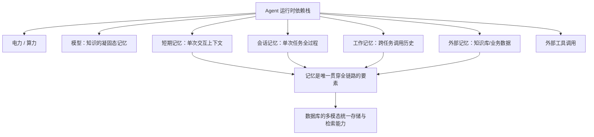
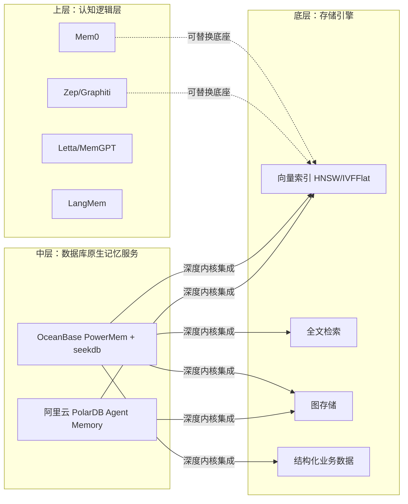
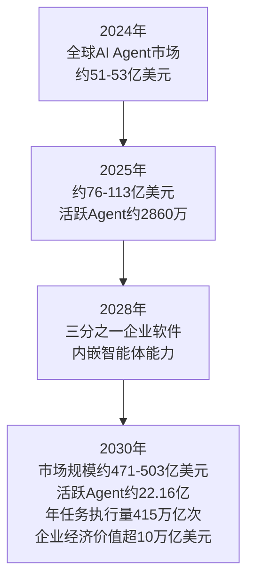

## 德说-第502期, Agent 记忆：数据库行业未来十年最大的一次身位重排
  
### 作者  
digoal  
  
### 日期  
2026-07-04  
  
### 标签  
AI , Agent , 记忆 , 业务数据 , 融合 , 进化 , 审计 , 安全 , 万亿市场 
  
----  
  
## 背景  

> 当 22 亿个数字员工在 2030 年同时"上岗"，谁掌握了它们的记忆，谁就掌握了下一代数据库的入场券。

## 引言：一个反问,揭开了数据库最大的机会窗口
  
最近我经常被问到一个问题：**为什么这么关心 Agent 的记忆模块？**

我先反问你, Agent 在运行时需要几样东西? 
- 电力
- 算力
- 模型(模型本身也是一种记忆的凝固态, 无非就是一堆已有知识训练出来的)
- 短期记忆(每次交互的上下文)
- 会话记忆(单次会话或任务的所有调用情况、调用的输入输出、输入上下文、思考过程、输出token等)
- 工作记忆(所有Agent工作中产生的所有调用情况、调用的输入输出、输入上下文、思考过程、输出token等)
- 外部记忆(来自搜索、知识库、业务数据)
- 外部工具调用

很显然, 拿掉记忆模块是不可能的, Agent 就无法运转了;

另外, 记忆有门槛, 有壁垒. 为什么这么说? 因为如果记忆组织不当, Agent 使用效率将大打折扣;

如何组织、存储 Agent 记忆, 将成为数据库必争之地, 目前还没有统一的标准;

记忆还有一个重要作用是帮助 Agent 进化, 进化它的 SKILL、Tools, 企业内部的系统 APP 等, 让你企业的数字员工越来越聪明;

记忆还有一个重要作用是安全审计, 所有行为可追溯, 可改进; 

得出结论: Agent 记忆即重要、又有门槛、又还没有形成标准. 

另外, Agent 将成为未来生产力主力军, 市场规模之大毋庸置疑. 

那么对于数据库来说, Agent 记忆这块市场会非常重要, 必须建立标准, 或者拿下足够多的市场后形成事实标准; 

我的判断是数据库要拿下这块市场, 必须将重心前移到 Agent 侧, 做记忆模块, 与 Agent 厂商深度合作, 与做 Agent 编排的厂商深度合作. 注意, 我的意思不是让数据库去卖记忆模块、卖 Agent, 而是要紧紧合作, 做记忆模块的目的或者说合作的前提是你能做好记忆组织、存储以及业务数据存储, 记忆数据必须与业务数据打通. 

我能看到的是 OceanBase 正在这么做(商业产品布局包括 DBAgent 产品 Data Pilot、数据治理产品 Data Studio、湖库一体产品 LakeBase; 开源产品布局包括 PowerMem, SeekDB, OceanBase;); 

顺着这个思路, 我们一起来推演一下数据库行业未来十年最大的机会在哪? 

## 一、记忆为什么是数据库的"天选战场"

站在数据库内核架构的角度看，这件事的底层逻辑其实并不复杂，甚至可以说是一次必然。

先把问题还原到第一性原理：Agent 的记忆需要同时存下四类完全不同形态的数据——结构化的元数据（用户 ID、时间戳、权限标签）、非结构化的文本（对话原文、总结）、向量嵌入（语义表示）、以及知识图谱（记忆之间的关联关系）。这四类数据如果分别放进关系数据库、文本引擎、向量数据库、图数据库这四套独立系统，会立刻引入一个工程上的死结：任何一次"回忆"都变成了跨库的分布式查询，数据一致性要靠应用层硬撑，运维成本随着系统数量指数级上升。

这正是数据库这门手艺过去六十年一直在解决的问题： **用一套存储引擎，统一多种数据形态的组织与检索**。OceanBase 的 seekdb 把向量、文本、结构化、半结构化数据放进同一张表，用一次查询同时做向量相似度匹配、全文检索和结构化过滤；阿里云 PolarDB 则用 pgvector 向量引擎加 Apache AGE 图引擎的组合，在同一个数据库实例里把语义检索和关系推理接了起来。这两条路径殊途同归，都是在回答同一个问题： **记忆管理，本质上是一道多模态统一存储与检索的数据库工程题，而不是一道算法题。** 补充一下: openGauss, vexDB, Gbase 8c 等等一系列国产数据库其实都在做 AI memory 场景相关功能.  

更关键的一层：记忆数据如果和业务数据物理隔离，Agent 就只能"记住聊了什么"，却记不住"这件事在业务里意味着什么"。真正有价值的企业级记忆，一定是记忆数据和业务数据能在同一个查询平面上关联——比如一个客服 Agent 记得"用户上个月投诉过物流延迟"这件事,同时能在同一次查询里关联到订单系统里那笔真实的物流记录。这道题只有数据库能答,因为业务数据的权威版本,从来就在数据库里,不在任何一个记忆框架的向量索引里。**未来的数据库要把AI Agent记忆数据当成一等公民来对待, 和业务数据一样重要.**  

这也是为什么我判断,数据库要拿下 Agent 记忆这块市场,前提条件是先做好三件基本功：多模态统一存储、混合检索(向量+全文+图+结构化过滤同时进行)、以及记忆数据与业务数据的无缝打通。这三件事,恰恰是数据库过去几十年积累下来、外部记忆框架短期内很难绕过去的护城河。

## 二、赛道全景：一场从"外挂框架"走向"内核集成"的静默迁移

如果只看今天的热闹程度，Agent 记忆这条赛道其实已经不算冷门——从工程实践的角度看，它正在经历一次清晰的分层。

第一层是纯粹的记忆框架，代表选手是 Mem0、Zep、Letta（前身 MemGPT）、LangMem。它们的共同点是"框架优先、存储外包"：Mem0 把记忆拆成用户、会话、Agent 三层作用域，靠混合的向量、图、键值存储做自动抽取；Zep 的核心武器是 Graphiti 引擎带来的"时序知识图谱"，能精确追踪"用户上周喜欢喝咖啡，这周因为失眠不能喝了"这类会随时间变化的事实；Letta 延续了 MemGPT 的操作系统隐喻，把记忆当成内存分页来管理。这些项目在开发者社区极受欢迎——Mem0 在 2025 年 10 月完成 2400 万美元 A 轮融资后，被 AWS 选为 Agent SDK 的独家记忆提供商，季度 API 调用量从 3500 万暴涨到 1.86 亿。但它们几乎都有一个共同的软肋：记忆本身仍然要"寄居"在某个底层存储上，无论是 PostgreSQL、SQLite 还是某个向量数据库，框架层可以随时更换底座，客户的迁移成本并不高，这意味着这条赛道很难形成真正意义上的护城河。

第二层是数据库厂商的原生集成，这是最近一年真正在提速的方向。阿里云 PolarDB 已经把 Mem0/MemOS 框架和自身的向量引擎、图引擎做了深度适配,并且推出了名为 Polar Agent Memory 的原生服务,直接部署在 PolarDB for AI 节点上,通过双模存储架构提供端到端的记忆管理,目前处于灰度阶段。OceanBase 走的是另一条路径：以 seekdb 作为统一存储底座,PowerMem 作为记忆管理的 Agent 层,叠加艾宾浩斯遗忘曲线这样的认知科学机制,支持 Experience 与 Skill 的"双层蒸馏"实现记忆的自我进化,并且原生适配 MCP,可以直接接入 Claude Code、Dify、OpenClaw 等主流 Agent 开发环境。这一层的关键突破在于：记忆不再是"挂在数据库外面的一个 API",而是变成了数据库内核能力的一部分。

第三层是纯粹的向量数据库,像 Pinecone、Milvus、Qdrant、Weaviate,它们提供的是记忆系统所需要的底层检索能力,但记忆的抽取、更新、遗忘这些"认知逻辑"仍然需要在其上再搭一层应用逻辑。

这三层结构其实揭示了一个正在发生的位移：越往底层走,护城河越深;越往上层走,越容易被替代。而数据库厂商现在做的事情,正是把自己的战场从"底层存储"主动往"记忆管理"这个更上层、更接近业务价值的位置推进——这正是我在引言里提到的"重心前移"。

## 三、市场到底有多大：从 IDC 的 22 亿 Agent 到"新数字劳动力"经济

站在产业与投资分析的角度,我更关心一个朴素的问题:这件事的钱景到底有多大,值不值得数据库厂商下重注。

先看最上游的增长引擎。IDC 的预测显示,全球活跃 Agent 数量将从 2025 年的约 2860 万,在 2030 年攀升到 22.16 亿,年复合增长率高达 139%；更值得注意的是任务执行频率的增长曲线更陡峭——年执行任务数预计从 2025 年的 440 亿次跃升到 2030 年的 415 万亿次,年复合增长率 524%。这意味着即使 Agent 的绝对数量增速已经很惊人,它们"干活"的密度增长得更快,而每一次任务执行,理论上至少都伴随着一次记忆的读取和写入。

再看直接对应的 AI Agent 软件市场规模,多家机构的口径虽有差异但方向高度一致:全球市场规模大致从 2024 年的 51-53 亿美元,增长到 2030 年的 471-503 亿美元区间,年复合增长率集中在 44.8%-45.8%;中国市场增速更快,预计 2030 年逼近 300 亿元人民币规模。而高盛的研究给出了一个更激进的推演:到 2030 年,AI Agent 将为全球企业创造超过 10 万亿美元的经济价值,并贡献应用软件市场 60% 以上的新增收入。

这里有一个容易被忽略但极其关键的结构性事实:上面这些数字算的都是"Agent 应用层"的市场规模,而记忆基础设施是隐藏在这层收入之下的"水电煤"。历史经验告诉我们,基础设施层的市场规模往往是应用层的一个稳定倍数——移动互联网时代,数据库、缓存、消息队列这些基础设施的市场规模,长期维持在应用层市场规模的十分之一到五分之一之间。如果 2030 年全球 AI Agent 市场规模落在 470-1150 亿美元(不同机构对"通用+垂直+平台"的加总口径不同,月之暗面等机构给出的垂直 Agent 市场单独测算已达 890 亿美元量级),那么支撑这些 Agent 运转的记忆基础设施市场,保守估算也会是百亿美元级别的增量空间,而这块蛋糕目前几乎还没有被瓜分。

更有意思的信号来自资本市场对"记忆"这个细分赛道本身的定价。Mem0 一家创业公司,在没有做数据库、没有做模型的情况下,仅凭"记忆层"这一件事就完成了 2400 万美元融资,并被 AWS 选为官方 Agent SDK 的独家记忆提供商;Zep、Letta、Supermemory 等一批"Mem-X"公司在过去一年密集拿到种子轮和 A 轮融资。这说明一个此前从未独立存在过的赛道——"AI 记忆基础设施"——正在被资本市场从数据库、从 RAG、从 Agent 编排这些更大的叙事里单独切割出来,给予独立估值。这恰恰印证了我最初的判断:记忆这件事,既重要,又有门槛,又还没有形成事实标准,是一片真正的处女地。

## 四、标准之战：谁能定义 Agent 记忆的"事实标准"

这是我最想深入推演的一层,因为它决定了这场竞争最终的赢家分配方式。

Agent 记忆目前最大的特点是"百花齐放、互不兼容"。Mem0 有自己的记忆抽取协议,Zep 靠 Graphiti 建自己的时序图谱格式,Letta 用操作系统式的分页模型,各个数据库厂商又在各自的内核里做了不同的适配。这种碎片化状态,和数据库历史上每一次技术范式切换初期的状态如出一辙——SQL 标准出现之前,关系数据库也是各家一套语法;向量检索兴起初期,各家的索引格式和 API 也互不兼容,直到 pgvector 和 HNSW 逐渐成为事实标准。

有一个积极的信号是,MCP(Model Context Protocol)和 A2A 这类协议正在从连接层开始统一 Agent 与工具、Agent 与 Agent 之间的通信方式。OceanBase 的 PowerMem 已经原生提供 MCP Server,可以直接被 Claude Code、Dify 等主流 Agent 开发环境调用;这意味着"记忆读写"作为一种标准化的工具调用能力,正在被更快地纳入到整个 Agent 生态的协议层里。但要注意,MCP 解决的是"记忆怎么被调用"的接口问题,并没有解决"记忆本身该怎么组织、存储、演化"这个更深层的架构问题——而后者,恰恰是数据库最擅长、也最有议价权的部分。

这就引出了一个关键的战略判断:数据库厂商在这场标准之争里,不应该、也不太可能靠"自己发布一个记忆协议然后号召全行业遵守"的方式取胜。协议层的话语权,天然会被 Anthropic、OpenAI 这样掌握模型和 Agent 入口的厂商拿走。数据库真正能打的牌,是把自己变成"记忆协议之下,最好、最难被替代的那个执行层"——就像 SQL 标准从来不是任何一家数据库厂商制定的,但 Oracle、PostgreSQL 依然靠着执行效率和生态积累拿到了绝大部分的市场价值。

换句话说,数据库不需要赢下"定义记忆是什么"这场战争,只需要赢下"谁能把记忆存得最好、查得最快、和业务数据关联得最紧"这场战争。这也正是我在开篇强调的:**做记忆模块的目的和前提,是做好记忆组织、存储以及业务数据存储,而不是去卖一个独立的记忆产品去正面挑战 Mem0 们的市场定位。**

## 五、拿下市场的具体路径:重心前移,深度共生

把前面几层的判断串起来,我认为数据库厂商要拿下这块增量市场,核心策略可以归纳为三个动作。

**第一,把交付重心从"数据库产品"前移到"Agent 侧的记忆中间件"。** 这不是说数据库厂商要去做 Agent、做编排,而是要在 Agent 实际运行的那个位置——也就是 Agent 每次决策前"回忆"、决策后"沉淀"的那个环节——提供一层深度适配的记忆服务。OceanBase 用 PowerMem 这样一个独立的记忆管理 Agent 去包装 seekdb 的存储能力,阿里云用 Polar Agent Memory 直接部署在数据库的 AI 节点上,本质上都是在做同一件事:让数据库不再是 Agent 调用链路末端一个被动的存储设施,而是主动参与到记忆的抽取、融合、遗忘、召回这整个认知闭环里。

**第二,与 Agent 厂商、Agent 编排厂商建立深度但克制的合作关系。** 这里的"克制"很关键——正如我在开篇强调的,数据库的目的不是把自己包装成一个 Agent 产品去和 Manus、Dify 这些编排平台抢生意,而是成为它们默认依赖、深度绑定的底层记忆基础设施。PowerMem 支持和 OpenClaw、LangChain、LangGraph 集成,PolarDB 的记忆方案直接对接百炼这样的模型服务平台,都是这个逻辑的体现。这种合作模式的商业本质,类似于当年 Intel Inside 之于 PC 厂商——你不需要自己做整机,但要让所有做整机的人都绕不开你。

**第三,守住"记忆数据与业务数据打通"这条最深的护城河。** 这是纯记忆框架厂商永远补不齐的短板,也是数据库厂商唯一不可被绕过的优势。一个客服 Agent 记得用户的历史投诉,如果这条记忆能在同一个数据库里直接关联到订单、物流、工单这些权威业务数据,它给出的回答质量会呈数量级提升——这不是靠更好的向量检索算法能弥补的差距,而是靠数据库几十年积累下来的事务一致性、权限体系、数据治理能力才能提供的价值。这也是为什么我判断,真正能在这场竞争里胜出的,一定是那些同时具备"记忆组织能力"和"业务数据存储能力"的数据库厂商,而不是单纯从记忆这一个切面切入的创业公司。

从目前的公开信息看,OceanBase 这套组合拳打得相对完整:商业产品线上有面向企业客户的 DataPilot(数据库 Agent)、DataStudio(数据治理)、LakeBase(湖仓一体),开源产品线上有 PowerMem(记忆管理)、SeekDB(轻量级统一存储)、以及 OceanBase 本身(核心业务数据库)。这套布局的巧妙之处在于,它没有把记忆当作一个孤立的功能点去卖,而是让记忆管理、数据治理、湖仓存储、核心交易数据库,在产品体系内部形成了一张互相咬合的网——这正是"记忆数据必须与业务数据打通"这句话在产品层面的具体落地。阿里云 PolarDB 走的是另一条路径,依托 Lakebase 架构和多引擎融合,把记忆能力做成核心交易数据库原生的一个特性,优势在于不需要额外引入新的产品心智,劣势是灰度阶段的成熟度还有待观察。

## 六、边界与例外:这个判断在什么情况下会失效

任何战略判断都需要划清适用边界,否则就是空对空的乐观预测。

这套推演最大的前提假设是:企业级 Agent 会持续朝着"长期记忆、跨会话个性化、多 Agent 协作"这个方向演进。如果模型的原生上下文窗口在未来几年出现数量级的突破——比如稳定支持千万级 token 且推理成本大幅下降——那么"记忆是外挂基础设施"这个前提本身可能被削弱,一部分轻量场景可能重新回到"把所有历史直接塞进上下文"的简单模式,记忆基础设施的刚需程度会打折扣。

另一个例外场景是记忆协议标准化的速度超出预期。如果 MCP、A2A 这类协议在未来一两年内迅速收敛出一套业界公认的记忆数据交换格式,并且这个标准恰好由某个占据模型或 Agent 入口优势的巨头主导,那么数据库厂商即便拿下了记忆存储层的技术优势,也可能被压缩成一个可被随意替换的"哑存储",议价权被大幅削弱——这类似于云计算早期,底层硬件厂商在云服务商崛起后逐渐失去定价权的历史。

还有一个更现实的约束:企业客户对"记忆"这件事的付费意愿,目前主要还停留在技术验证阶段,大规模的生产级付费场景仍然有限。如果 2026-2027 年 Agent 的企业级 ROI 迟迟无法验证——目前已经有分析指出 Agent 的可变成本(推理、人工兜底、迭代优化)占比超过 60%,不少项目在立项阶段就因为财务模型算不过账而被否决——那么整个上游需求可能出现比预期更长的爬坡期,记忆基础设施的商业化节奏也会相应推迟。

## 七、如何验证这个判断:观测指标与时间窗口

这套推演不是一次性的断言,而是可以被持续检验的假设,我给出几个具体的观测锚点。

**如何证明:** 未来 12-18 个月,如果看到主流数据库厂商(OceanBase、PolarDB、TiDB、Redis 等)密集发布记忆管理相关的原生产品或 GA(正式商用)版本,并且这些产品在客户案例里明确出现"记忆数据与业务数据联合查询"这类差异化能力描述,同时看到 Mem0、Zep 这类独立记忆框架厂商开始寻求被数据库厂商收购或深度绑定(而不是继续独立融资扩张),就说明"数据库主导记忆存储层"这个判断正在被市场验证。

**如何证伪:** 反过来,如果在同一个时间窗口里,看到某个模型厂商或云厂商推出了一套独立于任何数据库产品之外、能够被所有数据库统一调用的"记忆中间层协议",并且这套协议迅速被主流 Agent 编排平台采纳,导致底层存储变成可以随意替换的商品化组件——那就说明记忆这场战争的胜负手不在存储层,而在协议层,数据库厂商押注"重心前移"这个策略就需要重新评估。

**观测周期:** 考虑到 IDC 预测的 Agent 数量增长曲线在 2027 年前后开始明显加速,我认为 2026 年底到 2027 年中是一个关键的观察窗口——这段时间内头部数据库厂商的记忆产品线是从"灰度测试"走向"规模化商用",还是继续停留在概念验证阶段,基本可以判断出这场市场争夺战的初步走势。

## 结语

回到最初的那个反问:Agent 运行时需要几样东西?这道题的答案,决定了下一个十年数据库这个行业最重要的战略方向在哪里。记忆不是数据库业务版图里一个锦上添花的新功能,而是这个行业罕见地能够重新绑定到一个万亿级新兴市场入口的机会。它足够重要,重要到没有它 Agent 就无法运转;它足够有门槛,有门槛到组织不好就会大幅拉低整个 Agent 系统的效率;它又足够早期,早期到目前还没有任何一家公司、任何一个协议真正拿下了"事实标准"这个位置。这三个条件同时成立的机会窗口,在任何一个技术周期里都不多见。谁能在这个窗口关闭之前,把记忆组织、业务数据打通、和 Agent 生态的深度共生这三件事同时做对,谁就有机会重新定义数据库这个行业下一个十年的座次表。

  
  
#### [PostgreSQL 解决方案集合](../201706/20170601_02.md "40cff096e9ed7122c512b35d8561d9c8")
  
  
#### [德哥 / digoal's Github - 公益是一辈子的事.](https://github.com/digoal/blog/blob/master/README.md "22709685feb7cab07d30f30387f0a9ae")
  
  
#### [About 德哥](https://github.com/digoal/blog/blob/master/me/readme.md "a37735981e7704886ffd590565582dd0")
  
  

  
