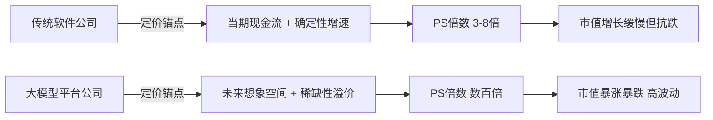
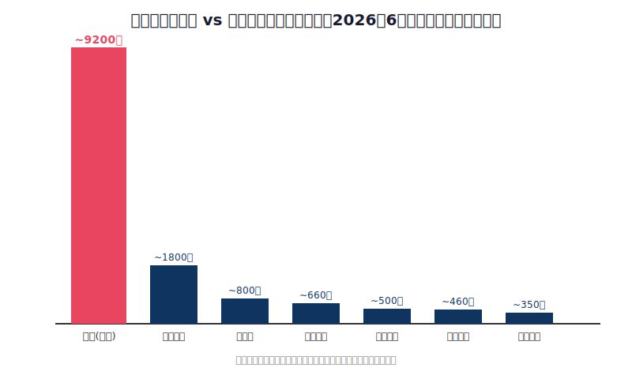
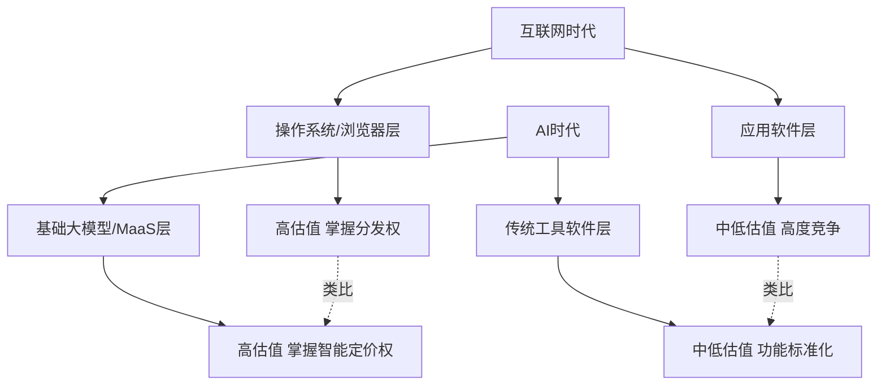

## 德说-第503期, 中国软件行业完蛋了吗? 整体市值不如一家上市半年的智谱
  
### 作者  
digoal  
  
### 日期  
2026-07-04  
  
### 标签  
软件 , 智谱 , AI , MaaS , 估值 , 确定性 , 预期 , 期权 , 护城河 , 技术突破 , 回款周期 , 订阅式 , 卖许可 , 卖服务  
  
----  
  
## 背景  

> 智谱一天市值冲到万亿港元，几乎等于把用友、金蝶、中国软件、宝信、三六零这些老牌软件公司加在一起还要多——但这不是"中国软件不行了"，而是资本市场正在用两套完全不同的尺子，给"卖工具的"和"卖智能的"定价。

*分析领域：资本市场估值 · 产业经济学 · 技术范式变迁*
*阅读时长：约 8 分钟*

---

## 一个刺眼的数字

2026年6月22日，智谱开盘暴涨13%，总市值一举站上1万亿港元，十天前它刚上市不到半年、市值还在5000亿港元左右徘徊。这意味着七个交易日之内，市值直接翻了一番，相当于两个京东，或者三个百度。

与此同时，把用友网络、金蝶国际、中国软件、宝信软件、三六零、金山办公这些在A股和港股摸爬滚打十几年、二十几年的软件公司市值全部加起来，大概率也够不着智谱巅峰时刻的零头。这就是"中国所有软件公司总市值不如一家智谱"这句话的由来——它不算夸张，甚至还算保守。

这个数字确实刺眼，也确实值得认真拆一拆：这到底是中国软件产业彻底掉队了，还是资本市场在用完全不同的逻辑给两类公司定价？我想从三个角度把这件事说清楚。

---

## 先讲清楚：这是两种"价值"，不是一种

站在资本市场定价的角度看，市值从来不是对"产业贡献"的直接测量，它测量的是投资者对未来现金流的贴现预期，外加一层情绪溢价。智谱现在的市销率（PS，市值除以年化收入）大约是591倍——用它自己披露的MaaS API年化收入约2.5亿美元（折合人民币约16.9亿元）去除市值算出来的。作为对照，它最想成为的那个"中国版Anthropic"，Anthropic自己在硅谷被爆炒到近万亿美元估值时，PS也不过22倍左右。591倍对22倍，这不是估值贵一点的问题，这是完全两个物种。

而用友网络这类传统软件公司呢？它们的PS通常在3到8倍之间，恒生电子、金蝶国际大体也在这个区间里打转。这背后的逻辑并不复杂：市场给一家公司的估值倍数，本质上取决于它未来收入增长的"斜率"有多陡、想象空间有多大。用友、金蝶们服务的是已经相对成熟、增速个位数的企业管理软件市场，投资者拿"确定性但平淡"的现金流去给它们定价，自然给不出高倍数。而智谱、MiniMax这类大模型公司，卖的是一张"下一个Anthropic"的门票，门票的价格里装的全是想象力，不是当期利润——智谱2025年全年营收7.24亿元，同时全年亏损47.18亿元，同比还扩大了59.5%，每赚1块钱要倒贴4.4块钱搞研发。这在传统估值框架里是绝对的负分项，但在"AGI叙事"框架里反而是"敢烧钱说明有信心"的加分项。

这里还有一层容易被忽略的资金结构因素。2026年的港股呈现出明显的"双层定价"：一层是南向资金，图的是确定性和政策支持，愿意长线持有；另一层是海外交易盘，尤其是活跃的韩国散户，他们高换手、强叙事驱动，专门在IPO和主题行情阶段放大波动。智谱和MiniMax上市初期的疯狂涨幅，相当一部分就是这类资金的助推——港股目前能买到的、掌握底层大模型核心技术且已经商业化落地的标的，翻来覆去也就这两三家，稀缺性本身就会制造溢价的踩踏效应。所以那句"一天冲上万亿、隔天又跌回去"的"市值体验卡"式行情，本质上讲的不是智谱基本面一天变了多少，而是一批边际资金在极窄的赛道里疯狂拥挤的结果。

这就是我想先讲清楚的第一层：拿"一家智谱"去对比"所有软件公司市值总和"，本身就是拿两种定价逻辑做除法——一边是被资本市场按"故事期权"定价的稀缺标的，一边是被按"现金流确定性"定价的成熟资产。两者数字上可以相除，但除出来的那个比值，讲的不是产业实力对比，而是估值方法论的落差。

---

## 中国软件业"市值洼地"，其实是个老问题

如果只看智谱这一个个案，容易得出"AI公司碾压传统软件"的结论。但把镜头拉远一点看产业经济学的账本，会发现一个更早就存在、也更值得警惕的现象：中国整个软件产业的市值，长期系统性地低于它的产值。

工信部的数据显示，前三季度中国软件业务收入接近9.83万亿元，同比增长10.8%，中国软件行业协会预测2025年全年产业规模有望突破15万亿元。这是一个体量惊人的产业。但对照资本市场的定价，中国软件行业市值前十的企业总市值大约6104亿美元，而美国同类企业前十总市值高达64438亿美元——相差超过10倍。也就是说，早在智谱把这个矛盾以最戏剧化的方式摆到台面上之前，中国软件业的"产值巨大、市值渺小"这道裂缝就已经存在了很多年。

这背后的第一性原理并不玄妙：一家公司的市值，本质上是市场对它未来能否持续把营收转化为自由现金流、并保持增长的信心投票。中国传统软件公司普遍面临几个结构性约束——服务的客户以政企、国企为主，回款周期长、议价能力弱；很多细分领域（比如高端工业软件、EDA）仍处于追赶阶段，护城河不够深；订阅制转型没有走完，收入确认模式还在从"卖License"向"卖服务"切换的阵痛期，账面利润因此常年承压，用友网络2025年前三季度归母净利润甚至是负的4.54亿元。当一家公司增长慢、利润薄、护城河浅时，即便它服务了几百万家企业、支撑着实体经济的数字化底座，资本市场也不会给它慷慨的估值倍数。

反过来看智谱这类公司，它虽然收入体量远小于用友、金蝶，但它踩中了一个正在被重新定价的赛道——大模型不是在和传统ERP、OA软件抢生意，它是在重新定义"软件"这个词本身的含义。这就引出了第三层，也是我认为最根本的一层。

  

*图：智谱峰值市值与几家代表性中国软件上市公司市值的量级对比，可以直观看到这不是"贵一点"的差距，而是数量级上的落差。*

---

## 真正的范式转移：从"卖工具"到"卖智能"

站在技术范式变迁的角度看，这件事更像互联网时代"基础设施层"与"应用层"估值分化的重演。当年PC互联网兴起时，操作系统和浏览器这类"基础设施级"公司拿到了远超同期应用软件公司的估值倍数，因为它们卡在价值链的咽喉位置——所有上层应用都要向它们支付"过路费"。今天大模型正在扮演类似的角色：智谱的MaaS平台已经成为连接基础模型与400万企业应用及开发者的枢纽，中国前十大互联网公司中有九家每天深度调用GLM，每一代新模型发布后24小时内就能获得字节、阿里、腾讯等大厂的官方接入。这意味着智谱不是在和某一款具体软件竞争，而是在成为几乎所有软件未来都要接入的"智能层"。

这也是为什么智谱敢在2026年2月GLM-5发布后逆势提价30%到67%，涨价之后调用量不降反增超过400%——虽然这里面有低基数的因素，但更本质的信号是：当一家公司的技术能力形成了实际的定价权，市场愿意为这种"稀缺的核心能力"支付溢价，而不是像过去那样靠低价补贴换规模。这和传统ERP软件的处境正好相反——ERP、财务软件这类工具型产品，功能已经高度标准化，客户替换成本虽然不低，但产品本身很难再靠"能力升级"获得定价权，只能靠服务绑定和长期客户关系维持存量生意。

不过我要在这里加一个关键的限定条件：这套"智能层碾压工具层"的叙事，目前更多是被资本市场"提前兑现"的预期，而不是已经发生的事实。智谱招股书披露的2024年全年营收只有3.124亿元，2025年上半年营收1.91亿元，即便按照最快的增速推算，全年营收规模和巅峰时刻3232亿港元、后来一度破万亿港元的市值之间，仍然横亘着巨大的鸿沟。换句话说，市场现在给的不是"智谱已经证明了自己"的价格，而是"智谱有可能证明自己"的期权费。这笔期权费能不能兑现，取决于两个变量：一是它的模型能力能不能持续保持在全球第一梯队（GLM-5.2在编程基准测试上已经逼近Anthropic的顶级闭源模型，超过了GPT-5.5，说明这条路目前是走得通的）；二是它能不能像Anthropic一样，把技术领先转化为持续的收入增长和毛利率提升，而不是陷入"越做强模型、越要烧更多钱"的死循环。

---

## 这个结论在什么条件下会失效

任何一套解释都有它的适用边界，我想诚实地把这些边界摆出来。

第一，智谱这类公司的高估值高度依赖"叙事的连续性"。它的股价从上市时116.2港元一路暴涨500%以上，靠的是模型能力持续超预期、商业化数据持续超预期这两个正反馈同时成立。一旦其中一个环节掉链子——比如下一代模型没能保持技术领先，或者付费增速明显放缓——591倍PS这种"市梦率"级别的估值随时可能出现断崖式回调。而且2026年7月基石投资者解禁、2027年1月大部分上市前股东禁售期结束，这两个时间点都是潜在的抛压窗口，市值的高波动性本身就是这套逻辑的一部分，不是意外。

第二，"软件行业不行了"这个判断本身可能问错了对象。用友、金蝶、恒生电子、宝信软件这些公司支撑的是实体经济、金融行业、制造业的数字化底座，它们的价值更多体现在产值、就业和产业协同效应上，而不是资本市场的即时定价上。中国软件产业15万亿的产值规模是真实存在的，只是这个真实性没有被资本市场充分定价——这恰恰说明问题出在"估值机制"和"市场结构"，而不是产业本身失去了存在的意义。如果哪天中国资本市场对确定性现金流类资产的定价方式发生变化（比如更多长线资金入场、上市公司质量分化收敛），这个"市值洼地"完全可能被填平，而不需要用友、金蝶变成大模型公司。

第三，也是最容易被忽视的一点：用"一家公司"去对比"一整个行业的总和"，这个比较方式本身就值得警惕。它制造了强烈的戏剧效果，但混淆了"单一标的的稀缺性溢价"和"行业整体健康度"这两个完全不同的问题。就像不能因为一家显卡公司市值超过了整个传统家电行业，就说"中国家电业不行了"一样，智谱市值超过传统软件业总和，说明的是市场在追逐一个稀缺赛道的头部效应，而不是给中国软件产业的整体前景打出了负分。

---

## 怎么验证这个判断，多久能见分晓

如果我的判断是对的，接下来一到两年应该能观测到这几个信号：智谱、MiniMax这类公司的收入增速会继续保持高位（比如MaaS平台ARR的同比增速维持在三位数以上），同时亏损幅度开始收窄而不是持续扩大；与此同时，传统软件公司即便市值增长缓慢，营收和现金流也不会崩塌，反而可能随着信创、国产替代政策的持续推进而稳步增长。

反过来，如果这套解释是错的，应该会看到：智谱在2026年7月和2027年1月两个解禁窗口前后出现远超市场正常波动的暴跌，且跌幅与其基本面变化（比如收入、毛利率）明显脱钩，说明当前市值确实只是资金博弈和叙事泡沫，和技术范式转移关系不大；或者，传统软件公司在接下来几个季度持续出现营收和利润的双重下滑，说明它们的"市值洼地"不是被低估，而是产业本身确实在被AI替代和挤压。这两类信号，用一到两个财报季就能看得比较清楚。

---

## 结语

"中国所有软件公司市值不如一家智谱"这句话，说的不是中国软件行业没戏了，而是资本市场正在用完全不同的规则，给"卖确定性"的公司和"卖可能性"的公司定价。传统软件公司撑着实体经济的数字化底座，账面朴素但根基扎实；大模型公司踩中了技术范式转移的风口，账面性感但泡沫风险也写在明面上。真正值得警惕的，不是这道市值鸿沟本身，而是如果我们只用市值这一把尺子去衡量一个产业"有没有戏"，可能会既看不清智谱的真实风险，也看不清传统软件业被低估的真实价值。
  
  
#### [PostgreSQL 解决方案集合](../201706/20170601_02.md "40cff096e9ed7122c512b35d8561d9c8")
  
  
#### [德哥 / digoal's Github - 公益是一辈子的事.](https://github.com/digoal/blog/blob/master/README.md "22709685feb7cab07d30f30387f0a9ae")
  
  
#### [About 德哥](https://github.com/digoal/blog/blob/master/me/readme.md "a37735981e7704886ffd590565582dd0")
  
  

  
