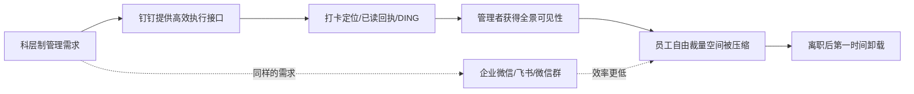
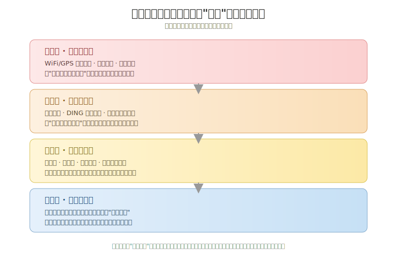

## 德说-第504期, 离职后第一个卸载的APP，为什么总是它？
  
### 作者  
digoal  
  
### 日期  
2026-07-05  
  
### 标签  
钉钉 , 电子拴狗绳 , 效率 , 全景监狱 , 下班边界   
  
----  
  
## 背景  

> 钉钉从来不是问题本身，它只是把中国职场原本就存在的控制逻辑，用一套极其高效的产品语言重新实现了一遍——效率越高，被控制的体感就越强。

*分析领域：组织行为学 · 产品与交互设计 · 劳动社会学 · 心理学*
*阅读时长：约 9 分钟*

---

我一直觉得，"离职当天卸载钉钉"这个动作特别值得琢磨。它不像卸载一个游戏——玩腻了、没时间了，悄无声息地卸载就是了。这个动作往往带着一点仪式感，甚至一点快意恩仇的味道：先备份完该备份的文件，办完离职手续，走出公司大门，然后掏出手机，长按图标，卸载。很多人会在这一刻发一条朋友圈，配文往往只有一句话——"终于自由了"。

一个工具软件，凭什么能让人产生这种近乎解脱的情绪？我想从几个不同的角度把这件事拆开看看：管理者为什么会把钉钉用成现在这个样子，产品经理在设计那些让人又爱又恨的功能时到底在优化什么目标，社会学意义上这背后是一种什么样的权力结构，以及从心理学角度看，为什么"卸载"这个动作本身会带来那么强烈的情绪释放。

## 效率工具是怎么变成"电子拴狗绳"的

先说一个容易被忽略的事实：钉钉最初的产品定位，解决的是一个真实存在的中小企业管理痛点——沟通链路太乱、审批流程太慢、考勤管理太原始。从这个角度看，它在设计之初其实是一个提效工具，逻辑上无可指摘。

但工具一旦被嵌入到科层制的权力结构里，它的效果就不再由工具本身的设计初衷决定，而是由组织内部权力最强的那一方——通常是管理层——决定怎么用它。这是组织行为学里一个很朴素但经常被忽视的原理：技术是中性的，但技术的部署方式从来不是中性的，它会沿着组织既有的权力梯度被放大。

钉钉的功能结构恰好提供了大量可以被这种权力梯度利用的接口。网友把它总结成"企业的拴狗绳"，这个比喻虽然情绪化，但精准地指出了一个结构性问题：钉钉本来就是"为企业老板、管理者打造的"，其功能结构本身就是自上而下设计的。打卡定位能被上级看到，考勤日志能被随时调取，而员工自己却往往看不到完整的打卡时间记录——这意味着一旦发生劳动纠纷，员工很难反过来用这套系统证明自己的加班事实。工具的信息不对称，直接映射了组织权力的不对称。

更极端的例子是今年闹得沸沸扬扬的"凌晨查岗"事件。早上9点上班、忙到凌晨、一周7天连轴转，这套逻辑本质上是过去二十年中国互联网"狼性文化"的延续：把在线时长等同于敬业度，把体力投入等同于产出效率。当管理者自己都在用这套逻辑要求员工时，工具只是把这套逻辑执行得更彻底、更无死角而已。

这里有一个容易被误读的因果关系需要澄清：不是钉钉发明了这种管理文化，而是这种管理文化找到了钉钉这个最趁手的执行载体。如果没有钉钉，管理者大概率会用企业微信、飞书实现同样的控制效果。钉钉的"罪过"，某种程度上是它把这件事做得太高效了。

从这个链条能看出一个关键点：卸载钉钉解决不了问题，因为问题从来不在软件里，而在软件所服务的那套管理逻辑里。这也是为什么企业微信、飞书虽然在公关话术上都强调"人性化"，却依然普遍被诟病——只要科层制的监控需求还在，任何一款协同软件都会被塑造成同一种形状。

## 产品设计里那些"效率优化"，其实是行为规训

如果说管理逻辑是"为什么会被这样用"，那产品设计就要回答"为什么它能被用得这么彻底"。这里我想重点拆解三个功能：已读回执、DING一下、打卡定位——它们在产品经理的KPI报表里大概率都叫"消息触达率""任务闭环率"这类中性名词，但落到用户体感上，效果完全是另一回事。

已读回执是一个绝佳的案例，因为它在即时通讯史上曾经有过一次公开的"全民公投"。腾讯QQ在推出已读功能前做过一次官方投票，结果显示约有一半用户选择了"你出我就卸载QQ"这个选项——这几乎是用户用脚投票明确表达了对这项功能的抵触。微信始终没有上线已读功能，张小龙给出的解释是不做已读未读，是为了"给人撒谎的机会"，这样才符合人性。这句话背后的产品哲学是：熟人社交场景里，模糊性本身是一种社交润滑剂，它给双方留出了不失礼的“撒谎”空间。

但钉钉、企业微信这类办公协同工具反其道而行之，主动引入已读回执，逻辑很直白：办公场景追求的是效率和可追责性，已读功能能倒逼接收方尽快回应，从管理者视角看，这是提升组织响应速度的合理设计。问题是，同一个功能，在社交场景里被用户用脚否决，在办公场景里却被默认强加——而员工作为这个场景里天然弱势的一方，并没有像QQ用户那样"用脚投票"的自由，他们唯一能表达抵触的时刻，就是离职卸载的那一刻。

DING一下则是把这套逻辑推向了极致。它的产品设计初衷是解决群消息容易被淹没、重要通知容易被遗漏的问题，如果对方没有及时查看，系统会通过电话或短信的方式强制触达。这个功能在效率意义上确实做到了行业里少有的"消息必达"，但它同时消灭了一种此前一直存在的默认状态——"下班后手机可以放在一边"。一个刚经历高强度工作、周末在家补觉的员工，被DING一下之后手机持续震动，这种体验被大量网友形容为"休息日的噩梦"。

打卡定位的问题则更微妙一些，它暴露的是"效率优化"和"用户体验"之间的直接冲突。大量用户反映，钉钉的WiFi/GPS定位识别经常出现误判——明明人已经站在公司门口，系统却识别为"外出"，导致被记为迟到或外勤。从产品角度看，这是一个典型的定位精度和用户体验的技术债务问题；但放到管理场景里，这类"技术故障"直接转化成了员工需要向HR解释、甚至影响绩效的真实后果。产品经理眼中的一个bug，落到员工身上就是一次被质问的经历。

我用一张图把三类设计选择放在一起对比一下，能更清楚地看出问题出在哪个环节：

从这三个案例可以提炼出一个更普遍的产品设计原则：任何一个把"提升管理可见性"作为首要目标的功能，几乎必然以压缩个体自由空间为代价。这不是说这类功能设计者存心作恶，而是效率和自主感在很多场景下天然处于此消彼长的关系，产品团队在做优先级排序时，如果目标用户画像里权重更高的是"企业客户/管理者"而不是"一线员工"，产品的形状自然会向控制一端倾斜——因为真正付费的是企业老板，不是企业员工。

今年内部流出的《置身钉内》一文，恰恰是从产品经理视角对这套逻辑做了一次罕见的内部复盘。文章作者用福柯"全景监狱"的概念来描述钉钉正在做的事情——用算法和产品交互规则，把用户置于一种持续被观察的状态。这篇文章之所以引发大范围共鸣，很大程度上是因为它精准地给"被系统裹挟"的这种集体情绪找到了一个命名。

## 全景监狱：当监控不再需要监控者在场

福柯在《规训与惩罚》里提出"全景监狱"这个概念时，讨论的是边沁设计的一种监狱建筑——中央瞭望塔可以观察到所有牢房，但囚犯无法确认自己此刻是否正被观察。这套机制的精妙之处在于，它最终不需要瞭望塔里真的有人，因为囚犯会因为"不确定自己是否被看见"而持续自我约束，监控由此从一种外部力量内化为一种自我审查的习惯。

把这个模型套到数字办公场景里，会发现契合度高得惊人。打卡定位、已读回执、DING消息，这些功能共同构成了一套"随时可能被看见"的机制——你不知道领导是否正在盯着你的在线状态，但你知道这种可能性始终存在，于是你会本能地维持一种"看起来在工作"的状态：及时回复、保持在线、避免长时间的"未读"。这正是全景监狱效应的数字版本：控制的实现不再依赖管理者持续在场，而是依赖员工自己完成了监控的最后一环。

这套机制在劳动社会学里有一个更早的理论源头，叫"数字泰勒主义"——把二十世纪初科学管理运动里那套通过秒表和流水线量化、拆解、监控体力劳动的逻辑，重新应用到脑力劳动和知识工作上。区别在于，工厂里的秒表测量的是动作和产出，而协同办公软件测量的是响应速度、在线时长、消息可见性——这些原本属于个人节奏、难以量化的东西，第一次被系统性地数据化了。

这套逻辑还有一个更深层的后果，就是工作与生活的边界被彻底打穿。传统雇佣关系里，"下班"是一个有明确物理和时间边界的状态——人离开工位，工作关系在物理意义上就中断了。而当协同软件把办公场景搬进手机、把已读和DING做成随时可触达的能力后，"下班"这个概念在技术上已经不复存在，剩下的只是一种约定俗成的、随时可能被打破的默契。企业微信的"上班/下班"状态开关某种程度上是想找补这个边界，但这个功能能否真正生效，最终还是取决于组织文化是否尊重这个边界——技术给了边界一个开关，却给不了尊重边界的意愿。

理解了这一层，就能明白为什么"卸载"会成为一个具有仪式感的动作：当一个人物理上离开雇佣关系时，他同时也在做一件事——夺回被这套系统占据的、原本属于个人生活的时间和注意力主权。卸载不是删除一个应用，而是拆除瞭望塔。

## 为什么"卸载"这个动作本身会让人如释重负

前三个视角解释了控制机制是怎么形成、怎么被设计、怎么在社会结构里运作的，但还没有回答一个更贴近个体体验的问题：为什么"卸载"这个纯粹的技术动作，会带来那么强烈的情绪释放？

心理学里的自我决定理论给出了一个很有解释力的框架。这套理论认为，人有三种与生俱来的基本心理需要——自主感、胜任感和归属感，其中自主感指的是个体希望能够根据自己的意愿做出选择，不被外部力量强制或限定行为方式。当这种需要被持续压制，行为的驱动力会逐渐从"内在动机"滑向"受控动机"——也就是说，人不再是因为想做而做，而是因为不得不做而做。已读回执、DING、排行榜这一整套机制，本质上都是在系统性地压缩自主感：你什么时候回复、以什么方式在线、工作节奏如何安排，越来越不是由你自己决定，而是由系统的可见性规则决定。

有意思的是，这种自主感的剥夺往往不是通过一次强制命令实现的，而是通过无数次微小的、看似"合理"的提醒累积而成——一次DING、一次已读未回的沉默压力、一次打卡异常的解释，单独看都不算什么大事，但长期累积后，个体会进入一种持续警觉状态。这也是为什么很多人形容离职是一种"解脱"而不是"失落"：当自主感被压制的时间足够长，恢复自主选择权本身就会带来强烈的正向情绪，这在心理学上和"心理抗拒"理论的预测是一致的——当自由被剥夺，人会对能够重新获得自由的行为赋予格外高的价值。

卸载这个动作之所以比"离职"这件事本身更容易被赋予情绪意义，是因为离职是一个相对复杂、需要走流程、有交接和告别的过程，而卸载是一个纯粹、即时、完全由自己掌控的动作——长按、卸载，一秒钟完成。这种"低成本、高确定性、瞬间见效"的特质，恰好满足了人在长期处于低自主感状态后，对"立刻拿回控制权"的心理需求。某种意义上，卸载钉钉是整个离职流程里唯一一个不需要HR审批、不需要交接、纯粹由个人意志完成的动作——这可能才是它被赋予仪式感的真正原因。

## 这个结论在什么条件下不成立

不过我想强调几个边界条件，避免把这个分析过度简化成"钉钉=万恶之源"。

第一，控制感的强弱高度依赖具体的组织文化，而不是软件本身。同一款钉钉，在一些管理相对宽松、强调结果导向而非在线时长的公司里，员工的抵触情绪明显更低——因为已读、DING这些功能的使用频率和强度，最终是由管理者的行为习惯决定的。软件提供的是能力上限，不是使用下限。

第二，对创业者、销售、需要高频跨组织协同的角色来说，"随时可触达"本身可能是一种被主动追求的能力而非负担。很多中小企业主自己就是重度DING用户，因为对他们来说，效率提升带来的收益明显超过自主感的损失——这提醒我们，同一套机制的体感好坏，和个体在权力结构里的位置直接相关：管理者用它是"掌控"，被管理者用它是"被掌控"。

第三，飞书、企业微信虽然公关话术更"人性化"，但并没有从根本上摆脱同样的结构性张力，只是在某些细节上做了缓和（比如企业微信的"下班模式"）。如果把钉钉换成任何一款功能类似的协同软件，长期来看用户的抵触情绪大概率会以类似的强度重新出现——这也是为什么"卸载钉钉"经常伴随着对整个移动办公软件品类的吐槽，而不只是针对某一个品牌。

## 如何验证这个结论

如果想检验"控制感强弱决定用户抵触程度"这个假设是否成立，有几个可以持续观测的指标。一是应用商店评分的纵向变化：钉钉在多个安卓应用市场长期维持在1到2分（满分5分）的区间，iOS端也长期处于2分上下，如果某家企业的管理文化发生实质性变化（比如取消强制打卡定位、缩短响应时限要求），可以观察对应用户群体评分和吐槽内容是否随之改善。二是可以对比不同管理风格企业的员工，在使用同一款协同软件时的满意度差异——如果我们的假设成立，差异应该主要来自管理方式而不是软件版本。三是可以跟踪"离职即卸载"这个行为本身的普遍性是否会随着远程办公政策、"下班免打扰"相关法规的完善而下降，如果几年后这个现象明显减少，说明结构性因素确实在起作用；如果换了软件、换了公司，这个行为依然普遍存在，则进一步印证了问题出在管理逻辑而非某个具体产品。

反过来，如果观测到某家公司即使全面移除了打卡定位、已读回执、排行榜这些功能，员工依然普遍反感协同软件，那就说明抵触情绪的根源可能更多来自工作强度本身，而不是这篇分析里讨论的控制机制设计——这也是一个值得警惕的证伪信号。

## 写在最后

钉钉不是一个孤立的产品案例，它更像一面镜子，照出了中国职场在效率至上逻辑下，个体自主空间被持续压缩的过程。有意思的是，这套逻辑的每一个环节单独拿出来看都有其合理性——企业需要管理效率，产品需要商业化验证，管理者需要可见性来做决策。真正的问题从来不是某一个功能是否"作恶"，而是当这些各自合理的环节叠加在一起时，个体的自主感会在不知不觉中被消耗殆尽，直到"卸载"成为唯一能立刻找回控制权的动作。

从这个角度看，比起讨论钉钉这款产品该怎么改进，也许更值得追问的是：我们的组织，到底还愿不愿意给"下班"这两个字，留一个真正意义上不会被打扰的边界。
  
  
#### [PostgreSQL 解决方案集合](../201706/20170601_02.md "40cff096e9ed7122c512b35d8561d9c8")
  
  
#### [德哥 / digoal's Github - 公益是一辈子的事.](https://github.com/digoal/blog/blob/master/README.md "22709685feb7cab07d30f30387f0a9ae")
  
  
#### [About 德哥](https://github.com/digoal/blog/blob/master/me/readme.md "a37735981e7704886ffd590565582dd0")
  
  

  
