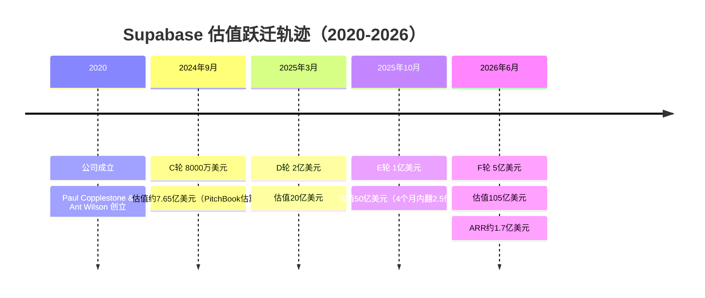
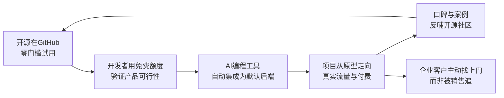
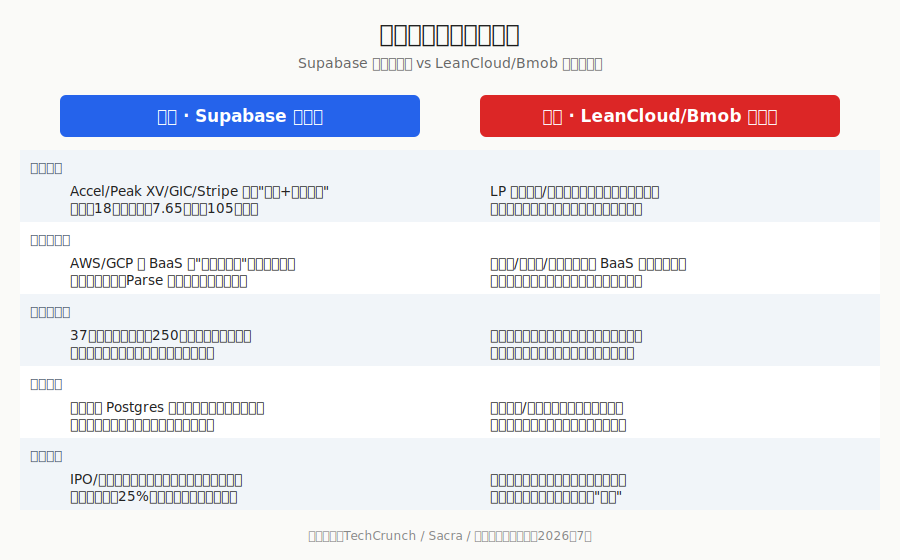

## 德说-第505期, 中国为什么做不出 Supabase 
  
### 作者  
digoal  
  
### 日期  
2026-07-05  
  
### 标签  
Supabase , PostgreSQL , BaaS , 后端即服务 , 云计算 , 补贴 , 内卷 , 资本市场 , 退出机制 , 全球化货币 , 全球市场 , 基金 , 未来期权 , 确定性 , 政策对齐  
  
----  
  
## 背景  
  

> 一个套壳 Postgres 的"数据库中间层"，六年融资近 7 亿美元，估值从 7.65 亿冲到 105 亿美元只用了 18 个月。同样的故事，中国讲了十年，讲死了 LeanCloud，讲死了 Bmob。这篇文章想说清楚：这不是技术差距，是土壤差距。

*分析领域：创投经济学 · 开源商业化 · 云计算产业格局 · 比较制度经济学*
*阅读时长：约 12 分钟*

---

## 引言

2026 年 6 月，Supabase 宣布完成 5 亿美元 F 轮融资，估值 105 亿美元，由新加坡主权基金 GIC 领投，Stripe 二次加注，Salesforce Ventures 新进场。四个月前，它刚刚从 20 亿美元跳到 50 亿美元；再往前七个月，它的估值还只是投资机构给出的一个模糊数字——7.65 亿美元。

同一个月，大洋对岸，一家几乎和 Supabase 同龄、模式高度相似的中国公司 LeanCloud，宣布关停注册，正式退场。

我一直觉得，这两件事放在一起看，比单独看任何一件都更有意思。因为它们说明的不是"中国工程师做不出 Supabase"——中国工程师完全做得出，甚至做得更早。LeanCloud 2013 年就上线了，比 Supabase 早了整整七年。它们说明的是：同一颗种子，种在两片土壤里，会长出完全不同的东西。

我想从四个角度把这件事拆开看：钱是怎么流向 Supabase 的，中国的同类玩家为什么会被自己所在的生态"绞杀"，以及在这两片土壤背后，到底是什么样的资本结构和全球化窗口在起决定性作用。

---

## 一、从 1480 万到 1.7 亿：资本为什么愿意为一条增长曲线支付十倍溢价

先把数字摆出来。Supabase 2024 年的年度经常性收入（ARR）大约是 1480 万美元，2025 年冲到 7000 万美元，到 2026 年 5 月已经涨到 1.7 亿美元左右。与此同时，公司估值走了这样一条路径：2024 年 9 月 8000 万美元 C 轮融资，市场估算的投后估值约 7.65 亿美元；2025 年 3 月，D 轮 2 亿美元，估值跳到 20 亿美元；2025 年 10 月，E 轮 1 亿美元，估值再跳到 50 亿美元；2026 年 6 月，F 轮 5 亿美元，估值来到 105 亿美元。

站在风险投资的定价逻辑上看，这条曲线里藏着几个关键变量，而这几个变量恰好是中国一级市场这几年越来越稀缺的东西。

第一个变量是"叙事密度"。Supabase 的收入增长不是靠地推、不是靠大客户签单，而是和"vibe coding"这个新物种深度捆绑——Bolt.new、Lovable、Replit、Cursor 这些 AI 编程工具生成的应用，六成以上会自动配置 Supabase 作为后端。也就是说，Supabase 收的不是"数据库使用费"，而是整个 AI 原生应用爆发这波浪潮的"过路费"。投资人买的不是当下的现金流，而是"这个赛道会不会指数级放大"这个期权。**这就有点意思了, 作为国产数据库厂商可以思考一下, Agent 既然能用 Supabase, 就不能用其他国产数据库打造的类 Supabase 吗?**

第二个变量是资本市场本身的结构。GIC 是主权财富基金，本质上是拿国家外汇储备做长周期配置；Stripe 是产业资本，二次加注意味着它在用自己的支付业务数据验证 Supabase 的客户质量；Accel、Peak XV（原红杉印度/东南亚）、Craft Ventures 是典型的美元成长期基金，它们的 LP 结构里有大量大学捐赠基金、养老金这类能承受十年周期的钱。这一整套资本链条，从早期天使到主权基金接力，中间没有断层，每一轮都有人愿意在上一轮基础上再翻倍下注。

第三个变量，也是最容易被忽略的一点：Supabase 让员工在每一轮融资里都能卖掉 25% 的既有股权(永远卖不完?每次最多能卖出手上的四分之一?)。这看似是个福利政策，实际上是一种资本市场信号——它告诉所有潜在投资人，"这家公司的老股东、创始团队对未来足够有信心，愿意用套现比例换流动性而不是套现退出"。这种设计只有在退出渠道通畅、二级市场愿意持续接盘的资本环境里才能成立。(后面会说到国内不一样的地方)

我把这条融资时间线画成了一张图，方便直观感受这个"加速度"：

这套逻辑放到中国一级市场里，几乎每一环都会卡住。国内基础设施类项目的 LP 结构里，政府引导基金、国资背景资金占比很高，这类资金天然对"叙事期权"不敏感，更在意确定性回报和产业政策对齐度；退出渠道以 A 股 IPO 和并购为主，周期长、审核严，二级市场对"长期不盈利但增长很快"的工具型公司容忍度低。同一条增长曲线，放在两个不同的定价体系里，会得出完全不同的估值结果——这不是说中国投资人"眼光差"，而是整套资本市场的风险偏好和退出机制决定了它必然给出更保守的定价。

---

## 二、我们拒绝定制需求

如果只看融资数字，很容易得出"这就是泡沫"的结论。但我更想聊聊 Supabase 商业模式里一个真正值得学习的设计：它是怎么把自己的获客成本打到接近零的。

Supabase 创始人 Paul Copplestone 在接受采访时反复强调一件事：他们主动拒绝那些开出百万美元合同、但要求大量定制化企业功能的客户。这句话听起来违反商业常识——放着钱不赚？但背后的逻辑其实很清楚：一旦开始为大客户做深度定制，产品就会不可避免地变复杂、变重，而 Supabase 真正的护城河恰恰是"简单"和"开发者体验"。它宁可放弃眼前的企业订单，也要保住"个人开发者五分钟内跑起一个后端"这件事的完成度。

这套打法能成立，有一个更底层的技术选择在支撑：Supabase 没有去发明一套自己的数据结构或协议，而是完全建立在 PostgreSQL 之上，做的事情是把认证、实时订阅、文件存储、边缘函数这些"每个后端项目都要重复造的轮子"打包成开箱即用的服务。这个选择的精妙之处在于，它相当于直接站上了整个 PostgreSQL 三十年积累的生态肩膀——现成的运维工具、现成的人才库、现成的信任背书，它一分钱都不用花去建立。开发者不需要学一套新东西，只需要把已经会的 SQL 技能平移过来。

这就是典型的开源产品商业化(外围商业化、核心留在开源社区)打法：Supabase 本身的核心组件均开源，任何人都可以自己搭一套，但绝大多数开发者会为"省心"付费——这就是它 4 百万开发者、25 万付费客户这个巨大漏斗的入口逻辑。开源不是情怀，是最便宜的获客渠道；社区不是负担，是免费的信任背书系统。

我用一张简单的流程图来表示这套增长飞轮：

这套飞轮转起来的前提，是开发者能够零摩擦地接触到产品——不需要备案、不需要实名认证、不需要担心哪天服务因为政策原因说停就停。这句话看起来平淡，但对比中国同类产品的处境，会发现这恰恰是最大的分水岭。

---

## 三、LeanCloud 和 Bmob 死于同一个原因：他们的对手不是彼此，是云计算大厂本身

把时间拨回到 2013 年前后，中国其实并不缺 BaaS 玩家。LeanCloud、Bmob、MaxLeap 几乎和硅谷的 Parse 同期起步，产品理念、技术架构高度相似，早期用户很多就是无法稳定访问 Parse 的中国开发者转移过来的。行业里当时的判断是乐观的：Parse 被 Facebook 收购又关停，恰恰给国产替代腾出了窗口。

但十几年后回头看，结局是：Parse 死于 Facebook 内部的业务取舍（一个非核心业务线，无法在集团内部证明自己配得上持续投入），而 LeanCloud、Bmob 死于一个更结构性的问题——它们从第一天起就活在阿里云、腾讯云、华为云这些巨头的阴影下，而这些巨头做云开发能力从来不是为了独立赚钱，是为了给自己的 IaaS 业务导流、锁定客户。

这中间的差异非常关键：美国的云巨头（AWS、GCP、Azure）确实也提供类似 Amplify、Firebase 这样的 BaaS 产品，但它们对独立创业公司的态度更接近"你做你的，我做我的"，谷歌甚至直接把 Firebase 当成独立品牌运营，反而给了整个赛道更强的用户教育。而中国的云计算市场，走的是另一条路——价格战。阿里云 2024 年 3 月一次性把云产品价格砍到最高降幅 55%，云开发、云数据库这类 PaaS 能力常年作为"引流品"随 IaaS 打包甚至免费赠送。据中国信通院统计，阿里云、天翼云、移动云、华为云、腾讯云长期占据国内公有云 IaaS 市场前五的绝对主导地位；在 PaaS 层面，阿里云、百度云、华为云、腾讯云同样处于第一梯队。当一个巨头可以用主营业务的现金流去补贴一个"引流用的免费功能"，独立创业公司靠这个功能本身赚钱的商业模式，从财务模型上就已经输了。

LeanCloud 关停之后，网上流传最广的一句话是"这是残酷市场与国内政策变动共同作用的结果"。更直白的意思就是：一家独立的基础设施创业公司，如果它提供的能力可以被巨头当作免费赠品捆绑进自己的云服务里，那么它唯一的出路只有两条——要么找到巨头看不上或者做不好的细分场景，要么被迫卷入价格战直到失血而亡。LeanCloud 和 Bmob 走的是第二条路，Bmob 企业版定价是每月每账号 1000 元对应 1 亿次调用，而 LeanCloud 早期是每月 100 万次免费、超出后每万次 0.5 元——两家公司甚至彼此之间也在打价格战，而不是共同把这个市场的用户教育做大。

反观 Supabase 面对的美国云计算格局，AWS、GCP、Azure 之间的竞争更多集中在算力和企业级合同，它们几乎不会主动下场去做一个"给个人开发者五分钟起后端"的轻量产品去抢 Supabase 的生意，因为这不符合它们的销售动力模型（大客户合同远比免费开发者工具产生的收入高）。这就给 Supabase 留出了一整条巨头懒得低头去捡的赛道。

---

## 四、资本、全球化与制度：两片真正不同的土壤

如果说前两节讲的是"钱"和"打法"的差异，这一节我想往更底层挖一层——为什么美国能一直源源不断地长出愿意打这种仗的资本，而中国的资本结构却很难做到。

这里有一个韦伯式的观察角度值得借用：一种经济行为能不能大规模持续发生，取决于背后有没有一整套与之匹配的制度伦理和资本组织形式在支撑，而不只是取决于个体创业者聪不聪明。美国的风险投资体系，本质上是一种为"高失败率、高回报期望"设计的赌局结构——有限合伙人愿意接受十年封闭期，愿意接受组合里九成项目打水漂，只要有一个 Supabase 能兑现百倍回报。这套结构的正常运转，依赖于极其成熟的二级市场退出通道（IPO、并购、老股转让），也依赖于一个庞大到可以让"全球开发者"成为潜在付费用户池的市场——Supabase 团队分布在 37 个国家，完全没有实体办公室，收入几乎全部以美元计价，这意味着它的天花板从第一天起就是全球市场，而不是某一个国家的开发者数量。

中国的资本供给结构完全是另一套逻辑。近几年一级市场里，政府产业引导基金、国资背景 LP 的比重持续上升，这类资金的考核机制天然更看重确定性、更看重与国家战略方向（比如信创、自主可控）的契合度，而不是"愿意为一个尚未盈利但增长很快的开发者工具支付十倍溢价"这种纯粹的成长期博弈。同时，中国的独立软件基础设施公司几乎无法把海外市场当作"一等公民" —— 出海要面对网络环境、数据合规、地缘政治摩擦这几重叠加成本，而国内市场又被云计算巨头用近乎免费的方式把天花板死死摁住。这就形成了一个双重挤压：往外走摩擦成本极高，往内卷又卷不过巨头的补贴能力。

我把这几层差异整理成了一张对比图：

这里有一点我想额外强调，避免把这件事简化成"中国不行、美国就行"的懒惰结论——这其实是一个关于"独立中间层软件"能否存活的普遍规律，而不是国别问题。即便在美国，绝大多数被大云厂商视为核心能力的领域（比如基础的对象存储、CDN），独立创业公司同样很难活下来，Firebase 本身也是被谷歌收购后才真正做大规模。Supabase 能跑出来，恰恰是因为它精准踩在了一个巨头暂时"看不上"或者"来不及做"的缝隙里——个人开发者的极致简单体验——并且赶上了 AI 原生应用爆发这个史无前例的需求脉冲。这两个条件缺一不可，纯粹靠资本堆砌是堆不出来的。

---

## 边界与例外：这套结论什么时候会失效

这个结论并不是说中国永远不可能出现类似 Supabase 的公司，它成立是有条件的。第一个条件是，云计算巨头必须把这类能力当作免费引流品而非独立商业模式来经营——一旦某个细分场景巨头因为战略收缩主动放弃（就像 LeanCloud 关停后腾讯云也在做迁移引导，说明连巨头自己也未必想把这块业务做重），反而会给独立公司腾出真空期。第二个条件是全球化窗口——如果中国的开源基础设施项目能够在海外开发者社区里先建立起足够的技术信任（比如某些数据库内核项目、AI 框架已经在 GitHub 上证明了这一点），再反向输出到国内市场，逻辑链条是可以走通的，只是难度和周期会比美元市场大得多。第三个条件是资本耐心——如果未来出现更多愿意用十年周期博弈全球化开发者工具的人民币或美元基金，这个结构性约束会松动。

反过来说，如果 Supabase 未来真的开始大规模承接企业定制需求、放弃"开发者优先"的产品哲学，它现在这套增长飞轮的核心引擎也会熄火——历史上太多开发者工具公司在追逐企业收入的过程中把自己原本轻盈的产品做重、做慢，最终失去了最初吸引开发者的那个理由。

## 如何验证这个判断

要验证"资本结构决定基础设施公司命运"这个判断，可以持续观察两个指标：一是看未来两年内是否有中国的开源数据库或后端工具项目，在没有巨头股东背景的情况下，凭借纯粹的海外开发者社区增长获得国际化基金的领投，如果出现，说明"全球化窗口"这个约束条件正在被打破；二是看国内云计算巨头是否会在价格战趋缓后，重新把 PaaS/BaaS 能力当作独立利润中心运营（而非引流品），如果它们开始收窄免费额度、提高定价透明度，说明独立创业公司的生存空间可能重新打开。如果两年后这两个信号都没有出现，这套"巨头挤压+资本耐心不足"的结构性解释就会得到进一步验证；如果出现了，说明中国的土壤本身也在发生变化。

## 结语

Supabase 的故事最容易被讲成一个"技术乐观主义"的爽文——开源、社区、开发者优先，赢麻了。但我更愿意把它当作一面镜子：它照出来的不是中国工程师的技术短板，而是资本组织方式、云计算竞争格局和全球化窗口这三件事叠加起来的结构性差异。LeanCloud 用十几年时间证明了一件事——同样聪明的团队、同样超前的产品判断，放进不同的土壤里，长出的东西可能截然不同。这不该让人沮丧，反而应该让人更清醒地去找那些真正属于这片土壤、巨头看不上也来不及做的缝隙——那才是下一个故事真正开始的地方。
  
  
#### [PostgreSQL 解决方案集合](../201706/20170601_02.md "40cff096e9ed7122c512b35d8561d9c8")
  
  
#### [德哥 / digoal's Github - 公益是一辈子的事.](https://github.com/digoal/blog/blob/master/README.md "22709685feb7cab07d30f30387f0a9ae")
  
  
#### [About 德哥](https://github.com/digoal/blog/blob/master/me/readme.md "a37735981e7704886ffd590565582dd0")
  
  

  
