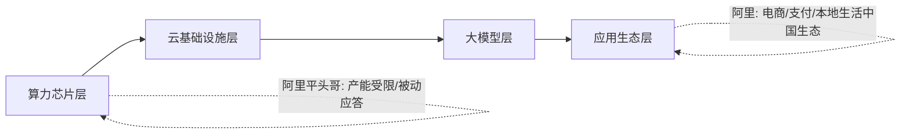

## 德说-第507期, 今天聊聊中美两家转型巨头阿里和谷歌
  
### 作者  
digoal  
  
### 日期  
2026-07-08  
  
### 标签  
阿里 , 谷歌 , 市值 , 转型 , 现金牛 , 客户 , 芯片 , 云 , 大模型 , Agent , 资本开支 , 转型成果
  
----  
  
## 背景  

七月的第一天，两条新闻几乎前后脚出现。一条是谷歌母公司Alphabet的市值稳稳站上3.9万亿美元，超过苹果，成为全球市值第二的公司，2025年全年股价涨了将近65%，是七大科技巨头里涨得最猛的一个。另一条是阿里巴巴同意向美国司法部支付6亿美元，就旗下跨境电商平台多年放任违禁品流入美国市场的问题，达成不起诉协议。

一个在庆祝市值新高，一个在签罚单和解书。不过, 我要聊的是两家公司都在赌的AI赛道. 

## 钱花的不是一个量级，但都花在了同一件事上

先说最直观的数字。谷歌今年的资本开支指引已经上调到1800亿到1900亿美元，比华尔街最乐观的分析师预测都还要高出四百多亿——这相当于每天要烧掉将近五亿美元，全砸在数据中心、服务器和自研芯片上。阿里这边呢，过去一个完整财年的资本性支出是1260亿元人民币，折合不到两百亿美元；阿里自己公布的中期计划，是未来三年投入3800亿元人民币，约合五百多亿美元。粗算下来，谷歌一年烧的钱，差不多是阿里三年计划的两三倍。

这个差距一开始看很吓人，但我想先泼一盆冷水：单纯比谁烧钱多，其实是个容易走偏的比法。谷歌服务的是全球市场，尤其是发达国家的企业客户；阿里云的主战场目前还是在中国内需市场。拿两个完全不同体量的目标市场去比投入规模，就像拿一家跨国连锁餐饮和一家区域连锁餐饮比装修预算——预算差距本身说明不了太多问题，真正该看的是钱花出去之后，转化成了什么。

那就往下看转化。谷歌云这个季度收入突破200亿美元，同比增长63%，积压订单一路涨到1550亿美元，全球排名前十的AI实验室里九家都在用谷歌云。阿里云一季度收入416亿元人民币，折合约58亿美元，同比增长38%，AI相关产品收入占比第一次突破30%。体量上谷歌云大概是阿里云的三倍半，但增速其实都在行业顶尖水平——真正的差距不在增速，而在客户画像：谷歌云的客户名单上写着OpenAI的竞争对手们，阿里云的客户名单上写着中国的制造业企业、金融机构和自动驾驶公司(PS: 当然这是当前情况, 未来谁也说不准, 万一大量模型服务商租用阿里云算力呢)。这决定了两条增长曲线未来能爬多高的天花板，完全不是一回事。

芯片这条线上，两家公司的心态也很不一样。谷歌的TPU是从2013年就开始下的一步闲棋——当时的动机很朴素，工程师们算了一笔账，发现如果每个安卓用户每天只用三分钟语音搜索，现有数据中心的算力就得翻倍。十几年磨下来，TPU现在已经进化到第八代，训练和推理各配一颗专用芯片，Anthropic计划调用的谷歌TPU规模已经是百万颗级别，谷歌也因此省下了原本要付给英伟达的七八成硬件毛利。阿里的平头哥走的是另一条路：真武系列芯片今年2月已经量产交付47万片，六成用在了外部商业化客户身上，但吴泳铭自己在财报会上也承认，自研芯片在阿里云里的部署量还不算大，主要卡在产能上。

顺带说一句容易被忽略的背景——阿里押注自研芯片，其实一半是主动选择，一半是被逼无奈。今年5月底，美国商务部又发了新规，把出口管制的口子从"实体芯片"进一步延伸到"总部在中国的实体，哪怕人在境外也要管"；1月份众议院还通过了一个法案，试图把"云上远程调用美国芯片算力"也纳入管制范围。这意味着阿里想靠租用英伟达算力过渡这条路，正在被一点点堵死，自研芯片从"降本增效的选项"变成了"没有退路的必答题"。而谷歌造TPU，从头到尾都是主动的技术卡位，两者的处境并不对等。

## 两家公司所在的战场分析

再往战略层看一层，会发现一个更有意思的分野：谷歌本质上是在用一头几乎没有边际成本的现金牛——搜索广告——去养一个烧钱的新业务。搜索广告这门生意，非但没有被生成式AI冲垮，反而借着AI Overview的推出让用户"越来越频繁地回到搜索"，这给了谷歌一个别人求不来的战略自由度：可以放心大胆地把巨额现金流砸向云和AI，完全不用担心主业被拖垮。

阿里的处境要复杂得多。它同时在打两场仗：一场是防御战，淘宝闪购的即时零售补贴大战，单季投入就上百亿人民币，为的是不被美团、京东在近场电商上截胡；另一场是进攻战，AI和云的基础设施投入，赌的是未来十年的技术主导权。这两场仗同时打的直接后果，是阿里罕见地出现了自由现金流净流出——2026整个财年净流出466亿元人民币，核心电商集团的经调整EBITA同比下滑动辄四成到八成。

不过我得在这里纠正一下我自己最初的判断。刚看到这组数字时，我的第一反应是"阿里在多线消耗战略资源"，但仔细想想，这个判断可能过于单薄了。淘宝闪购砸的钱，换来的不只是财报上难看的利润数字，也在同步积累即时配送网络和高频用户入口——这些资产未来完全有可能反哺"AI+外卖+电商"这类场景化的智能体应用，谷歌反而没有这种线下履约网络可以复用。所以"多线作战"到底是拖累还是资产复用的伏笔，现在下结论还为时过早，值得再观察几个季度。

## 聊聊股价和基本面

市值这本账更直观：谷歌3.9万亿美元，阿里按最乐观的估值模型也就4500亿到6000亿美元，大概是谷歌的六分之一。一个更扎心的对比锚点是，今年2月初，三星电子和SK海力士这两家韩国芯片公司的市值加起来，已经第一次超过了阿里和腾讯两家中国互联网巨头的市值总和——这说明放在全球资本市场的坐标系里，中国互联网双雄加起来，竟然不敌两家做存储芯片的韩国公司。

这个折价到底是因为基本面真的差，还是因为市场在为额外的风险定价，业内其实一直有争论。一种解释是，阿里的核心电商业务确实碰到了增长天花板，云和AI业务的绝对盈利体量还太小，撑不起重估，风险溢价只是锦上添花的说法；另一种解释是，阿里头上悬着的VIE结构合法性争议、中概股退市风险、以及跨境合规审查这些美国本土公司完全不需要考虑的额外变量，才是折价的真正主因。今年以来阿里港股跌了7%，同为中概股的腾讯跌了23% , 市场似乎是笼统看空所有中国科技股 —— 虽然阿里"云+AI"故事的确定性，被认为好于腾讯尚未讲清楚的AI变现路径，但这依然填不平和谷歌之间的鸿沟。

顺带一提，阿里今年那6亿美元的司法和解、以及美国国会持续推动的出口管制扩围，恰恰印证了后一种解释里最难量化也最难消除的部分：这类风险不是靠阿里巴巴自己经营改善就能对冲掉的，它更像是悬在整个中概股头上的达摩克利斯之剑，谷歌作为土生土长的美国公司，完全不需要背负这层负担——它面对的反垄断诉讼，好歹还是在美国国内法律框架里按部就班地走流程，可预期性天差地别。

## 所以，到底谷歌和阿里到底怎么比? 

写到这里，我想说清楚我自己的结论边界在哪里。如果只看"通用大模型训练和全球企业级云服务"这个维度，谷歌目前确实占优，靠的是十年磨一剑的TPU路线、几乎无懈可击的现金牛业务，以及不必背负额外地缘政治负担的从容。但如果换到"AI如何和电商、支付、本地生活这类高频生活场景结合"这个维度，阿里手里握着谷歌复制不了的生态位——这是一场谁也没法轻易替代谁的错位竞争，而不是简单的谁比谁强。

这个判断能不能站得住，其实有几个明确的验证节点可以盯着看：谷歌的资本开支能不能持续转化成云收入的同步增长，而不是变成折旧压力压垮利润率；阿里的即时零售能不能如管理层承诺的那样在这个财年结束前止血转正；以及最关键的——中美之间的出口管制和监管审查节奏，未来一两年是继续收紧，还是出现哪怕一点点制度性的缓和信号。这几条线只要有一条出现方向性反转，今天聊的很多判断可能都要重新改写。

你怎么看这两家隔海相望、并且都在赌AI赛道、都有现金牛、都在进行巨量资本开支、都有云服务和芯片、都有自有大模型、都有 Agent 入口、都在看转型速度的巨头呢?  
  
  
#### [PostgreSQL 解决方案集合](../201706/20170601_02.md "40cff096e9ed7122c512b35d8561d9c8")
  
  
#### [德哥 / digoal's Github - 公益是一辈子的事.](https://github.com/digoal/blog/blob/master/README.md "22709685feb7cab07d30f30387f0a9ae")
  
  
#### [About 德哥](https://github.com/digoal/blog/blob/master/me/readme.md "a37735981e7704886ffd590565582dd0")
  
  

  
