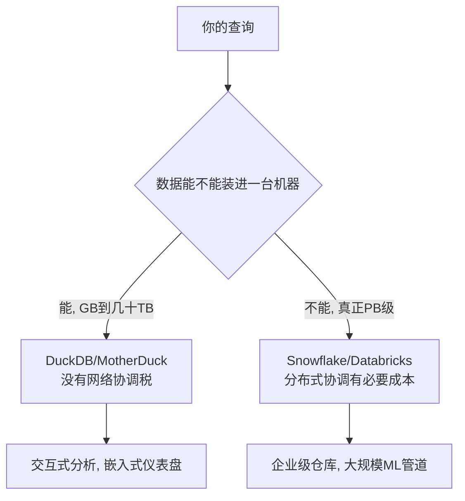

## 德说-第508期, 聊聊 DuckDB, MotherDuck, Snowflake, Databricks 的产品哲学
  
### 作者  
digoal  
  
### 日期  
2026-07-08  
  
### 标签  
DuckDB , MotherDuck , Snowflake , Databricks , 数仓 , 湖仓 , AI , 开源 , 开发者心智 , 估值模型 , 单机 , 分布式架构性能损耗税 , 护城河 , AI 数据底座 , AI 全栈数据底座 , 企业信任 
  
----  
  
## 背景  

DuckDB, MotherDuck, Snowflake, Databricks 这几个产品放一起, 能不能聊? 能聊点啥?

或许你会问"我们现在用 Snowflake，是不是该换成 Databricks？还是干脆用 DuckDB 省钱？" 这句话背后藏着一个假设：数据仓库市场正在发生一场淘汰赛，四个选手里总有一个会把其他三个挤下牌桌。 

这个假设从一开始就问错了问题。DuckDB、MotherDuck、Snowflake、Databricks 表面上都在做"跑 SQL 查数据"这件事，但它们的赌注下在了完全不同的地方 —— 有的赌"单机能装下的数据比你想的更多"，有的赌"AI 时代企业愿意为治理和信任付更高的溢价"，有的干脆赌"数据和机器学习本来就不该分家"。搞懂这几个赌注各自的胜负手，比纠结"哪个最好"有用得多。

## 计算放在哪，决定了它的天花板在哪

先说一个大多数人直觉上会想岔的事实：DuckDB 之所以能在很多场景里跑赢那些"看起来更强大"的分布式系统，靠的不是算法更聪明，而是它少交了一笔税 —— 分布式系统的协调税。Snowflake 和 Databricks（背后是 Spark）为了能扩展到 PB 级，必须支付跨节点的网络协调、运行时态数据重分布（shuffle）、任务调度这些固定成本；而 DuckDB 是单进程、列式存储加向量化执行，查询计划和数据都在同一块内存里流转，没有网络这一层。当你的数据能装进一台机器（现在动辄几百 GB 到几 TB 内存的机器不算稀罕），这笔"不用交的税"就是实打实的性能优势。这也是为什么单机 DuckDB 常常能跑赢分布式的 Spark：不是算得更聪明，是没有节点间协调的开销。

但这个优势是有射程的，一旦数据规模真正超出单机能扛的范围，需要跨机器 shuffle，这套逻辑就会反转——分布式系统的存在本来就是为了解决这个问题。MotherDuck 显然也清楚这条线在哪，所以它没有停在"更快的单机引擎"上吹嘘，而是在悄悄补一门叫 DuckLake 的课：把表的元数据从文件目录挪进一个真正的事务型数据库里，换来更快的元数据查询、即时分区裁剪、多表 ACID 事务——本质上是想把"单机快"的体验延伸到过去只有分布式系统才能覆盖的规模区间。不过这条路还没走完，面向 PB 级工作负载的托管版本目前还在私有预览阶段，能不能真扛住企业级的规模考验，现在下结论还早。

顺带说一句容易被忽略的细节：MotherDuck 支持一种"本地-云混合执行"——一条 SQL 可以同时 JOIN 你笔记本上的数据和云端的生产数据，把本地开发和云端部署接成一个即时反馈循环。Snowflake 和 Databricks 都是"云端 only"，你必须先把数据搬进它们的托管环境才能查询。这听起来像开发体验的小事，但对天天改 dbt 模型的工程师来说，是能实打实省出几个小时的那种小事。

## 定价背后，是三种完全不同的赚钱逻辑

架构决定了成本结构，成本结构又反过来决定了这几家怎么收钱。

MotherDuck 走的是最经典的开源变现套路：DuckDB 本身完全免费开源，云端订阅只在"团队协作、持久化存储、多用户治理"这些企业才需要的能力上收费——免费层之上是每月 25 美元的 Pro、49 美元的 Team，算力按秒计费，费率大约在每小时 0.6 到 36 美元之间，没有隐藏的空闲计费。这个定价姿态背后是联合创始人 Jordan Tigani 曾经做过 Google BigQuery 的工程负责人的履历——一个深知超大规模云仓库痛点的人，反过来做一款"反其道而行"的轻量产品，这条逻辑本身站得住脚。目前 MotherDuck 累计融资约 1.33 亿美元，估值大约 4 亿美元，处于早期偏中段的阶段。

Snowflake 走的是信用点消费制：标准版每信用点约 2 美元起，没有免费层。这套模式已经足够成熟——最新一季财报里，产品收入 13.3 亿美元，同比增长 34%，净收入留存率 126%，意味着老客户在持续自然增购，这是消费制模型最健康的信号。但仔细看财报电话会的措辞，管理层反复在讲 Cortex AI 和与 OpenAI 扩大到 2 亿美元的合作——这背后其实是一种"防御性提价"：纯粹卖存算分离仓库这门生意的边际利润率已经见顶，Snowflake 要维持增速，必须往上叠加毛利更高的 AI 产品层，用新功能证明自己配得上更高的客单价。顺带说一句，不能因为它市值曾经冲到过 400 美元一股就想当然地认为它一直很赚钱——过去十二个月它的每股收益其实是负的,如今 260 美元左右的股价、900 亿美元上下的市值，本质上是资本市场在为"它能不能真正转型成 AI 平台"这件还没发生的事付溢价。

Databricks 的计费复杂度是三家里最高的 —— 按 Databricks 单位（DBU）计费，还要叠加仓库类型、云厂商费用、运行时长，账单比前两者都难预测。计费之所以复杂, 是因为它想覆盖数据工程、BI、机器学习、生成式 AI 的全链条，计费的复杂性某种程度上是产品广度必然带来的。它目前的财务势头是三家里最凶猛的 —— 收入运行率突破 54 亿美元，同比增长超过 65%，AI 产品收入运行率单独就有 14 亿美元，净收入留存率超过 140%，还实现了正的自由现金流。不过这里要提醒一句：近期有报道说它的销售增长虽然超过 80%，利润率却在收窄，一个值得关注的解释是 AI 智能体（不是人类分析师）大量涌入调用数据平台，推高了计算成本 —— 当然这只是众多可能原因之一，销售费用扩张、股权激励增加同样可能是推手，不必把这条归因当成唯一答案，但如果你是投资者这件事确实值得关注: 如果计算成本增长持续跑赢收入增长，它现在最大的资本卖点 —— 正现金流 —— 迟早会被侵蚀。

## 护城河建在完全不同的地方

DuckDB/MotherDuck 的护城河，本质是开发者心智的占领 —— 一旦团队的 SQL 习惯了它那些"甜头"语法（比如 GROUP BY ALL、更干净的 struct/list 处理），迁移成本会慢慢累积。不过这道护城河目前还比较浅，因为 DuckDB 的 SQL 兼容标准语义, 绝大多数查询迁出去也不需要大改，理论上的迁移摩擦并不算高。

Snowflake 的护城河更多来自企业侧多年积累的信任 —— 安全认证、行业合规资质，还有一张数据共享网络：一旦你的合作伙伴都在这张网里共享数据，单方面离开的代价会很大。

Databricks 的护城河建在技术广度上：机器学习管道、Delta Lake 数据资产、Unity Catalog 治理体系一旦都建在它上面，替换成本是整个平台级别的，不是换一个查询引擎那么简单。

## 具体采购决策，规模不是唯一变量

这里有一个真实反直觉的现象：决定选型的往往不是团队人数，而是数据治理的复杂程度和查询的模式。一个只有 5 个人但治理需求复杂的团队，可能更适合 Snowflake；一个 200 人但查询逻辑简单的公司，反而可能更适合 MotherDuck。

一个真实存在、也确实容易被忽视的坑是"最小计费粒度"。Snowflake 的虚拟仓库每次启动或恢复都有 60 秒最低计费，跑批量夜间 ETL 无所谓，但对面向客户的高频短查询场景，这笔账就会被凸显；相比之下 MotherDuck 最小档位可以按 CPU 秒的零头计费。Databricks 的 DBU 计费同样存在冷启动和调度带来的不确定性，虽然较新的无服务器产品已经在改善这一点。有一家叫 Definite 的公司把仓库从 Snowflake 迁到 DuckDB 后，报告数据仓库支出降低超过 70% —— 这类数字听起来很诱人，但几乎所有类似案例都来自厂商自己发布的案例研究，样本量小、缺乏第三方复核，我的建议是把它当成"在特定 workload 模式下确实可能出现的量级"，而不是"迁移就能省 70%"的普遍规律。

真正决策前，可以先问自己三个问题：数据规模会不会真正突破单机能扛的量级？工作负载是不是深度绑定机器学习管道？团队对一个相对年轻的生态（DuckDB 2018 年才诞生）的容忍度有多高？想清楚这三件事，比对着功能清单打勾有用得多。当然，凡事要辩证地看 —— 组织内部的风险偏好和采购流程惯性，很多时候比技术适配度本身更能决定最终结果，一个团队里没人愿意为一个新兴生态背书，技术分析做得再漂亮也没用。

## 资本市场怎么给这四个产品背后的哲学定价

如果说前面三部分是产品和技术逻辑，资本市场的定价逻辑其实是另一套完全独立的叙事，不能和"技术孰优孰劣"混为一谈。

Snowflake 是已上市公司，增长稳健但估值倍数明显收缩 —— 市值 900 亿美元出头，对应过去十二个月 50 亿美元营收，但公司仍处于净亏损状态，市场愿意给的溢价，本质是在为"它能不能真正进化成 AI 平台"这件还没兑现的事买单。历史最高股价出现在 2021 年底的 400 美元附近，如今 260 美元左右，跌幅超过三成，这不是产品变差了，而是资本市场对"卖计算消费"这门生意的想象力天花板重新做了估值。

Databricks 走的是完全相反的路：不上市，靠私募市场持续加码估值。去年底一轮估值是 1340 亿美元，今年 6 月已经在洽谈新一轮，区间跳到 1650 到 1750 亿美元，半年涨了两到三成。CEO 公开表态说今年是"上市的糟糕年份"，把上市窗口推到 2027 年 —— 这句话翻译成资本语言其实是：私募市场现在愿意给的估值倍数，比公开市场现在给 Snowflake 这类同赛道公司的倍数慷慨得多，既然如此，何必急着上市把估值"锁死"在一个相对保守的公开市场定价上。这是一种私募市场比公开市场更乐观的现象，真正 IPO 那天能不能兑现，是最大的悬念。

MotherDuck 的估值体量和前两者完全不在一个量级 —— 4 亿美元 vs. 1300 多亿美元和 900 亿美元，差了两到三个数量级。这不是说它的技术或商业逻辑不成立，而是资本现在押注的是完全不同的东西：不是"现在能吃下多少企业级市场"，而是"DuckDB 的开发者心智占领速度，未来能不能转化成真正的商业规模"。这条路径在基础设施史上有走通的先例，也有更多没走通的案例，MotherDuck 现在正处在还看不出答案的早中期。

有意思的是，去年初就有报道点出 Databricks 的收入规模已经超过了 Snowflake，同一周 Oracle 和 Snowflake 股价都跌了一成多，原因是投资人担心一些 AI 驱动的开源生产力工具可能会削弱公有软件公司的护城河 —— 不过这更多是市场情绪层面的担忧,而不是坐实的业务替代事实，Databricks 自己的 CEO 也回应说这是"过度反应"。市场情绪和真实业务侵蚀，是两件需要分开看待的事。

## 到底该怎么选

写到这里回头看，这四个产品目前并不在一个赛场上, 但未来不好说, 毕竟拿了资本的钱就得交出满意的财报, 而 Snowflake 的反应已经说明了, 未来可能都会押注 AI 这条增长曲线。

DuckDB 是一个引擎，不是公司，它的胜负是"能不能持续占领开发者心智"；MotherDuck 赌的是这份心智占领能不能变成真正的企业级生意；Snowflake 在用 AI 功能给一门增速放缓的生意找第二增长曲线；Databricks 在用私募市场的热钱，给"数据和 AI 天生一体"这个赌注下最大的注。

回到现在的情况, 如果你的数据规模还在几十 GB 到几 TB、场景是交互式分析或者嵌入式仪表盘、团队愿意为省钱和迭代速度多担待一个还年轻的生态，DuckDB/MotherDuck 这条路线值得认真评估。如果你需要跨云跨组织的数据共享、严格的合规治理，Snowflake 这些年积累的成熟度目前还是别人比不了的护城河。如果你本来就要做大规模的机器学习训练和特征工程，数据和模型压根分不开，Databricks 的架构优势是结构性的，不是另外几个产品靠优化能追上的。

未来值得观察的则是: MotherDuck 的 Managed DuckLake 正式上线后能不能扛住独立第三方（不是厂商自己）验证的 TB 到低 PB 级企业案例；Databricks 利润率收窄的趋势会不会在后续几个季度扭转；Snowflake 的 AI 产品层收入占比能不能真正撑起它的估值倍数。这些答案会在未来一两年陆续揭晓。
  
  
#### [PostgreSQL 解决方案集合](../201706/20170601_02.md "40cff096e9ed7122c512b35d8561d9c8")
  
  
#### [德哥 / digoal's Github - 公益是一辈子的事.](https://github.com/digoal/blog/blob/master/README.md "22709685feb7cab07d30f30387f0a9ae")
  
  
#### [About 德哥](https://github.com/digoal/blog/blob/master/me/readme.md "a37735981e7704886ffd590565582dd0")
  
  

  
