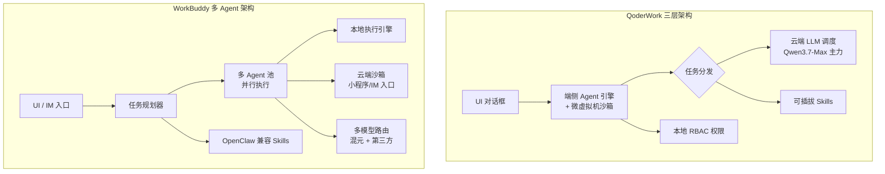
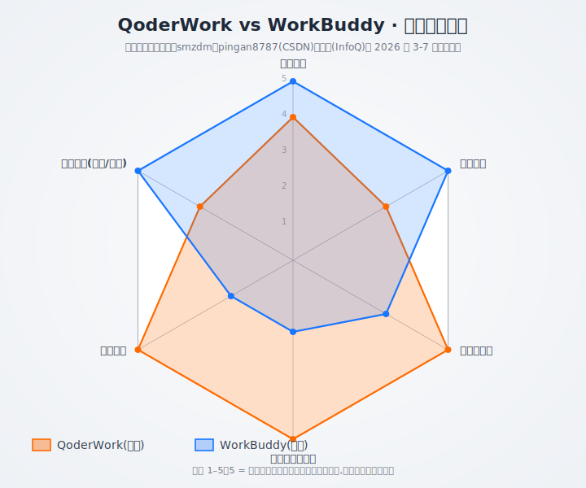
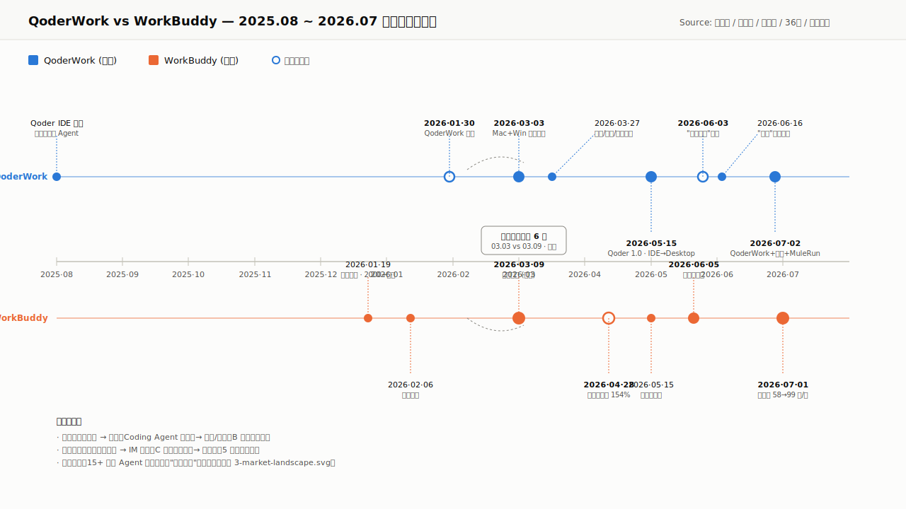
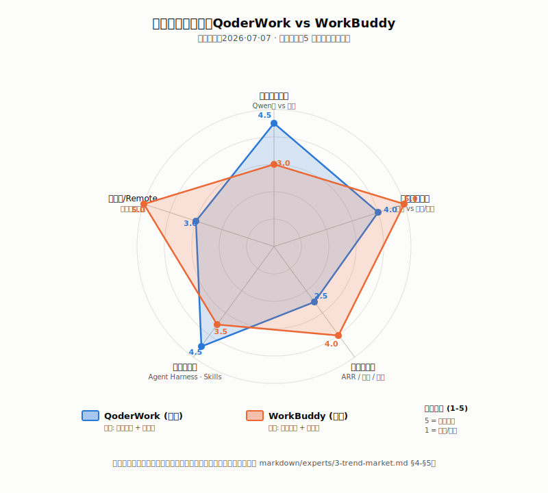
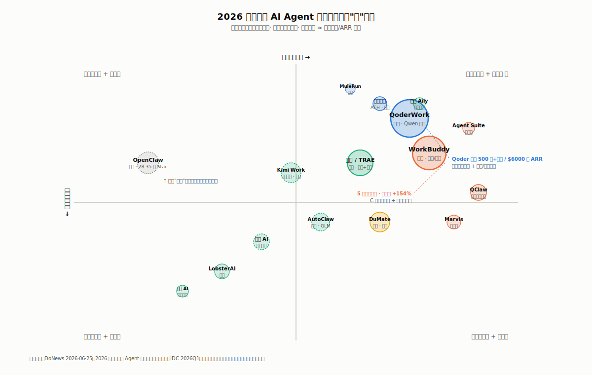
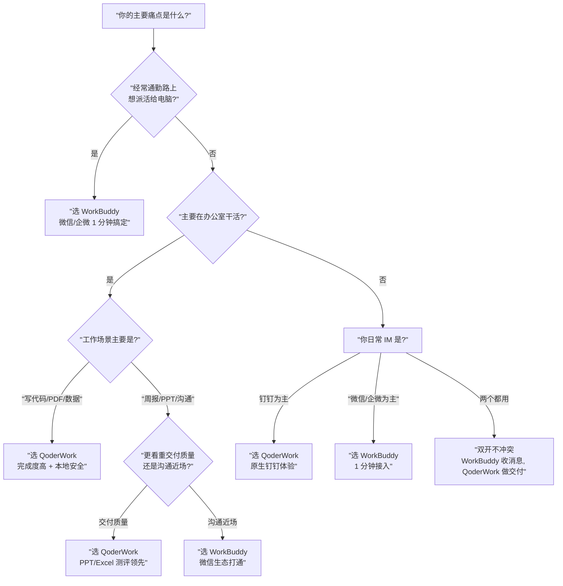

## 德说-第509期, 阿里腾讯 AI 大战
  
### 作者  
digoal  
  
### 日期  
2026-07-08  
  
### 标签  
阿里 , 腾讯 , AI Agent , QoderWork , WorkBuddy 
  
----  
  
## 背景  

2026 年 3 月，中国互联网两个最有钱的"老大哥" —— 阿里和腾讯 —— 像约好了一样，把各自憋了半年的大模型桌面 AI 智能体，前后脚推到我们电脑桌面上。阿里叫 QoderWork，3 月 3 日 Mac + Windows 同步开放；腾讯叫 WorkBuddy，3 月 9 日上线。中间只隔了 6 天。

没错, 两家都在抢"下一代办公入口"的话语权。

   

## 这两家的差异是什么?

**QoderWork（阿里）** ：本地沙箱里能拿主意的"瑞士军刀"。单点深度强、安全机制明显，代码、PDF、数据、PPT 都偏向"工程师审美" —— 做出来的东西更接近"能直接交"，但上手得懂点技术。

**WorkBuddy（腾讯）** ：会分身、能跑腿的"数字同事"。手机远程遥控电脑、微信/企微/QQ 全家桶联动是独家护城河，扫码就能用，但交付物常要二次精修。

对于非技术白领，记住这句话就可以： **WorkBuddy 解决"派活儿"问题，QoderWork 解决"交活儿"问题**。

 

## 为什么是 2026 

如果你是 2024 年就开始用 ChatGPT 的老用户，肯定有过同感：网页对话框里的 AI 很聪明，但碰到"帮我把这 200 张发票整理成 Excel"这种活儿就抓瞎——它没有你电脑的权限，没法动手干。

2026 年这件事彻底变了。三股力量在上半年同时到位：

第一股是海外领跑。Anthropic 在 2026 年 1 月推出 Claude Cowork，第一次把"AI 不再聊天、开始动手"做成了产品范式。

第二股是开源炸裂。奥地利程序员 Peter Steinberger 2025 年 11 月随手写的小工具 OpenClaw（被国内开发者戏称"小龙虾"），4 个月内在 GitHub 拿到 28–35 万 Star，超越了 React 和 Linux 内核，直接把"本地执行 + 长期记忆 + 工具调用"打成显学。

第三股是国内大模型能力终于够用。Qwen3.7-Max 在 2026 年 5 月 20 日发布时，官方数据显示它在 SWE-Pro、Terminal Bench 2.0 上反超了 Claude-Opus 4.6，Arena 总榜国产第一。

三股力量叠加，桌面 Agent 从"能不能做"跨过"该不该上"，变成"再不上就晚了"。

市场规模也印证了这一点。IDC 2026Q1 报告显示：中国企业活跃智能体数量从 2025 年接近 200 万，预计 2026 年达 500 万，年复合增长率约 145%；2024–2029 年中国企业级 Agent 市场从 86 亿元飙到 3320 亿元。2026 年政府工作报告首次把"智能经济新形态"写进去，明确要"促进新一代智能终端和智能体加快推广"。

所以阿里腾讯同时下场不是巧合 —— 是窗口期逼出来的。

 

## 技术架构对比

阿里 Qoder 设计产品时把"AI 怎么干活"这件事拆成三层，每层各管各的：

- **端侧 Agent 运行引擎**：本地跑规划、跑执行；
- **云端大模型调度**：路由到 Qwen3.7-Max、GLM、DeepSeek、Kimi 这些模型；
- **可插拔 Skill 模块**：UI 里直接拖入第三方技能包。

关键是 QoderWork 的"本地"用的是微虚拟机沙箱（Firecracker 路线），不是普通容器——AI 任务折腾一通不会污染主系统。再加上 RBAC 文件权限管理，AI 不是想读什么文件就能读什么。这对企业的 IT 部门来说是定心丸。

腾讯 CodeBuddy 思路就不一样。基于 CodeBuddy 同源架构，强调"动态拆解、多 Agent 同步开工"——把一个复杂任务拆给好几个 AI 同时干。云端那部分被高度封装成"干净客户端"，用户拿到的只是个能跑的壳。

这两种架构折射出两种产品哲学。阿里假设用户在意"AI 真的把事做对了"，所以花成本搭安全沙箱；腾讯假设用户在意"AI 真的能上手就用"，所以把路径压到扫码 1 分钟。

 

## 用户实测体感

**任务 A：整理桌面文件**
QoderWork 每经记者实测。
判断：数据安全敏感的人更适合 QoderWork，懒得看弹窗的人更适合 WorkBuddy。

**任务 B：写周报**
两边都能 3 分钟生成结构化周报。WorkBuddy 用户反馈"出来的东西基本不用大改"。两边打平。

**任务 C：做 PPT**
这是差距最大的一项。雷科技三轮实测：QoderWork 从缺 Node.js 环境到自己请求安装依赖、再到交出一份 13 页的可打开文件——"执行力确实强"。但首页没放真实 Logo、目录页留了模板占位符、数据没标来源，离"直接发给客户"还差一轮精修。WorkBuddy 在同一项被雷晶/金玙璠（新浪 2026-06-05）评级为"NPC"——"框架不错，但内容单薄，更像把要点列了一遍就收工"。
判断：QoderWork PPT 完成度在国产桌面 Agent 中目前领先。

**任务 D：写代码**
QoderWork 是国内截至 2026-06-30 唯一上线 Windows Computer Use 的桌面 AI（虽然 Beta），能直接"模拟鼠标操作"。
判断：代码场景 QoderWork 完胜——这也是它作为 Qoder IDE（同源）出身的天然优势。

新用户额度对比：WorkBuddy 送 5000 Credits，QoderWork 送 300 Credits。 **表面看 WorkBuddy 是 17 倍优势，但 WorkBuddy 单次任务消耗也明显高于 QoderWork** —— 这个 17 倍差距其实跑 5–6 个任务就抹平了（这个对比有两家自媒体复述同一篇腾讯云文章作来源，需读者自行核实最新规则）。

  

## 战略对决：阿里押 B 端深度，腾讯押 C 端广度

Qoder 编程 Agent 起家（Qoder IDE 2025 年 8 月上线），把 Coding Agent 的能力外溢到通用办公市场，再用钉钉（2000 万企业组织）和阿里云合规做 B 端渗透，最后通过"悟空 + QoderWork + MuleRun"三线整合（2026 年 7 月初完成）把企业生产力入口一锅端。模型走自研 —— Qwen3.7-Max 国产第一背书 + 国产云 + 国产芯片，三国产组合是金融/政务采购清单的"量身定制"。

CodeBuddy 起步是 AI 编程助手，但 WorkBuddy 一开始就明确"非技术背景职场人群" —— HR、行政、运营、销售。 **起点就比阿里更偏 C 端**。商业化也激进：5 个月两次涨价，企业版从 78 元涨到 198 元/月 —— 注意这是结构性涨价（原 78 元包含功能较少，新 198 元增加 WorkBuddy + CloudAgent + 企业管理），不是同款涨价 154%。海外版 5 月 28 日已发布。

两家对生态的理解完全不同。阿里钉钉是"工作流入口" —— 从开会、审批、报销、合同、招聘开始，AI 进入的是任务流；腾讯微信/企微/QQ 是"沟通入口" —— 从消息、文件、小程序开始，AI 进入的是对话流。

这不是空话。WorkBuddy 真的能做到"通勤路上用手机给电脑发指令" —— 这是腾讯的独家护城河，国内没有第二家。阿里的地利则在钉钉深处：制造业、政务、教育这些强组织流程的"AI 助理"嵌入，钉钉是天然根据地。

**但必须强调一下**。"QoderWork 偏企业 / WorkBuddy 偏个人"是侧重点差异，不是市场独占。阿里 2026 年 6 月推"AI 生产力计划 —— 免费发放百亿积分"是典型的 C 端拉新动作；腾讯 6 月 5 日发布 WorkBuddy 企业版、7 月 1 日把个人版拆成三档调价，是同时做 B 端 ARR 和 C 端付费。 **两家都在 B + C 双轮布局**，只是节奏不同。   

  

## 商业化：补贴拉新 vs 涨价跑 ARR

阿里走"先用免费/低价打规模、再用钉钉/悟空做企业渗透"。100 亿积分 ≈ 10 亿元补贴，是营销 + 拉新 + 沉淀用户行为数据的组合策略，不是无条件免费。这招对标钉钉、企业微信、飞书的历史路径 —— "先免费拉用户、再增值收费"。真正的悬念是：12 个月内能不能转化成 30%+ 付费率，否则就是 7 亿元净亏损。

腾讯走"先打企业/付费用户规模、再用微信/企微做全员覆盖"。5 个月两次涨价是验证"用户对涨价不敏感"的市场测试 —— WorkBuddy 体验真的能替代人力的话，月费 99 元对个人用户是极高性价比。腾讯会议、腾讯文档、企业微信都走过这条路。 **但涨价的双刃剑也得提一句** —— 钉钉 2020 年企业版激进收费后流失过一批中小客户，"涨价跑通 ARR"如果是 12 个月就能见效那还好，否则就是给竞品递刀子。

Qoder 全系（含 IDE + Work + Wake）2026 年 4 月底披露 500 万+用户、ARR 突破 6000 万美元，是阿里全产品线合计的数字，**不是 QoderWork 单产品的成绩** —— 别被一些标题党误导。

  

## 谁会赢？

谁会赢, 谁也说不准, 但是可以参考以下推演. 

**短期（6–12 个月）** ：腾讯占优。WorkBuddy 的涨价 + 企业版 + 微信入口，能更快做出 ARR —— WorkBuddy 企业版如果 2026 H2 ARR 增速突破 200%，就是腾讯的"沟通入口"在 Agent 时代拥有难以超越的网络效应。

**中期（1–2 年）** ：阿里占优。如果 Qwen3.7 持续保持国产评测领先、钉钉 + 悟空整合协同效率 12 个月内跑通、阿里云信创采购目录没有政策性意外，"中长期阿里赢"的概率上升。

**长期（2 年+）** ：胜负取决于"谁能把 AI Agent 嵌入企业组织流程" —— 目前看阿里的赌注更接近答案，但腾讯手里还有微信小程序这张 C 端超级牌。

还依赖几个关键变量：
- 如果 2026 Q4 出现重大 AI 误操作/数据泄露事件，"微信入口"反而从加分项变成高风险项；
- 如果钉钉 8 亿企业组织里的悟空渗透率 2026 年底前快速达到 10%+，"中期阿里赢"的时间窗可能前移到 12–18 个月；
- 如果字节把豆包专业版、TRAE Work 跟飞书 + 抖音绑成"双流量协同"，2026 H2 单季度拉到百万级 DAU 不是不可能   

字节这条线值得单独说：豆包专业版 2026 年 6 月 24 日才发布、TRAE Work 6 月 9 日才发布，**比阿里腾讯晚了整整一个季度**。但字节手里有飞书、抖音、剪映多端流量。一旦它在 2026 H2 把"豆包桌面 + 飞书 AI 套件"做成强协同产品，TOP 2 格局随时可能被改写。

"15 款桌面 Agent 同时爆发"看着热闹，但仔细一看：很多是同内核换皮 —— QoderWork/QoderWake/MuleRun/Trae 跟 Qwen 强绑定，WorkBuddy/CodeBuddy/QClaw 都出自腾讯，豆包/TRAE/ArkClaw 都出自字节。 **真实独立的玩家不超过 8 家**。"百虾大战"的另一面是"装完即吃灰" —— OpenClaw 时代就被验证过，腾讯、阿里、华为排队上门安装，大多数用户装完很少用。

  

## 怎么选？ 

**按人群的具体建议：**

- **通勤党、需要手机遥控电脑**：选 WorkBuddy。微信/企微/QQ IM 全家桶国内独家。
- **腾讯系深度用户（企微/腾讯文档/QQ 邮箱）** ：选 WorkBuddy。同账号打通，文件流转顺。
- **数据/代码重度用户**：选 QoderWork。多文件/多步任务、Web/代码场景、Excel 复杂分析均胜出。
- **数据安全敏感、怕 AI 闯祸**：选 QoderWork。"执行前预览确认"机制给你掌控感。
- **完全零基础小白**：选 WorkBuddy。扫码登录 + OS 沙箱兜底，最不容易出岔。
- **大企业 PoC 选型**：从 WorkBuddy 企业版（198 元/人/月）或阿里悟空（待三线整合后）二选一，**用 2–3 个月时间验证 3 个真实业务场景的 ROI**，再决定规模采购。
- **高频用户**：两个都装 —— 这是一位来自 todo.work 的横评作者给出的进阶建议，日常沟通用 WorkBuddy，攻坚克难用 QoderWork。

**顺带提醒一下** —— QoderWork 0.5 版本用户反馈"长任务 BUG 多、AI 反复修改同一问题"，"实习生水平"是个真实吐槽。WorkBuddy 的"中断-续做"机制是公认短板，复杂任务中途断了很难续上。 **目前的 AI 桌面 Agent 普遍介于"实习生"和"高级实习生"之间，别把它当"正式员工"** 。 但是AI发展日新月异, 可能睡一觉这些问题都不存在了, 如果还在, 那就再睡一觉. 

  

## 反思

第一，"短中期腾讯、中长期阿里"是依赖关键变量的判断，不是定论。Qwen 模型持续领先、钉钉整合协同、微信不被安全事件反噬 —— 三件事任一不成立，时间框架就要前移或后移。读者看到 2026 Q4 财报和钉钉 AI 渗透率披露时，要回头重新校准。

第二，"阿里 B 端 / 腾讯 C 端"是侧重点差异，不是市场独占。两家都在 B + C 双轮布局，只是阿里用钉钉切入企业流程、用百亿积分抢 C 端心智；腾讯用企业版做 ARR、用微信打通做 C 端覆盖。  

第三，"15 款桌面 Agent 同时爆发"看着热闹，但同内核换皮的占一半，独立玩家不超过 8 家。真正的赢家会在 2026 Q4–2027 H1 浮现——届时再看安装量 / DAU / 留存 / 付费转化四个口径，比看上线产品数更靠谱。

第四，字节豆包/TRAE/ArkClaw 是被一致低估的第三方变量。豆包 2024 年通过抖音引流三个月就冲到顶级流量，这次字节把"豆包桌面 + 飞书 AI 套件"做成强协同的窗口期是 2026 H2——BAT 谁都不能小看这条暗线。

 

## 一句话总结

阿里 QoderWork 和腾讯 WorkBuddy 在 2026 年桌面 AI 智能体赛道的对垒，可以简化为 **阿里押"模型深度 + 企业流程嵌入"** ，**腾讯押"沟通入口 + 流量近场触达"** 。

短期（6–12 个月）腾讯会跑出更快 ARR；中长期（1–2 年）阿里的工作台 + 专家套件 + 国产化合规会跑出更深的护城河；长期（2 年+）的胜负的关键是"谁把 AI Agent 真正嵌入企业组织流程"。但 18 个月后再回来对答案——中间任何一个安全事件、监管动作、模型能力跃迁，都可能让时间框架前移或后移。

  
  
#### [PostgreSQL 解决方案集合](../201706/20170601_02.md "40cff096e9ed7122c512b35d8561d9c8")
  
  
#### [德哥 / digoal's Github - 公益是一辈子的事.](https://github.com/digoal/blog/blob/master/README.md "22709685feb7cab07d30f30387f0a9ae")
  
  
#### [About 德哥](https://github.com/digoal/blog/blob/master/me/readme.md "a37735981e7704886ffd590565582dd0")
  
  

  
