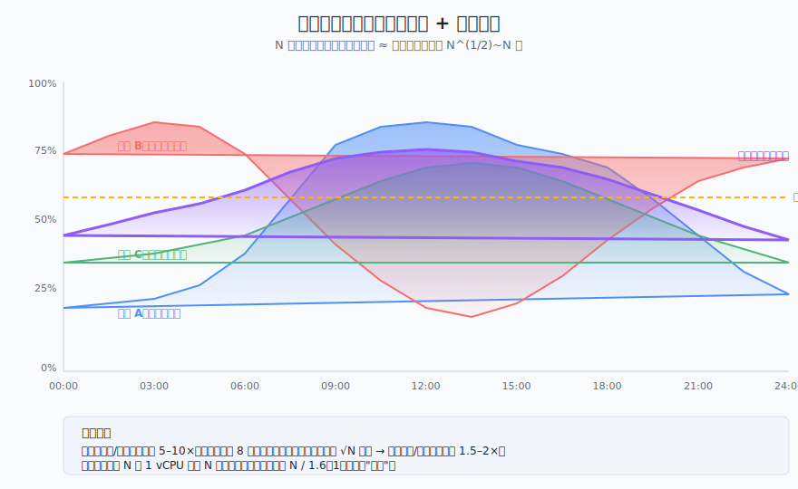
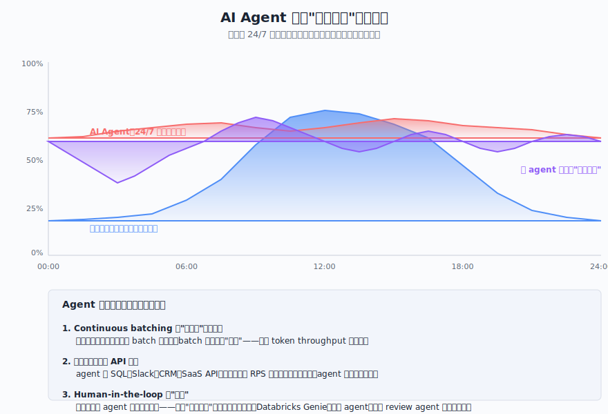
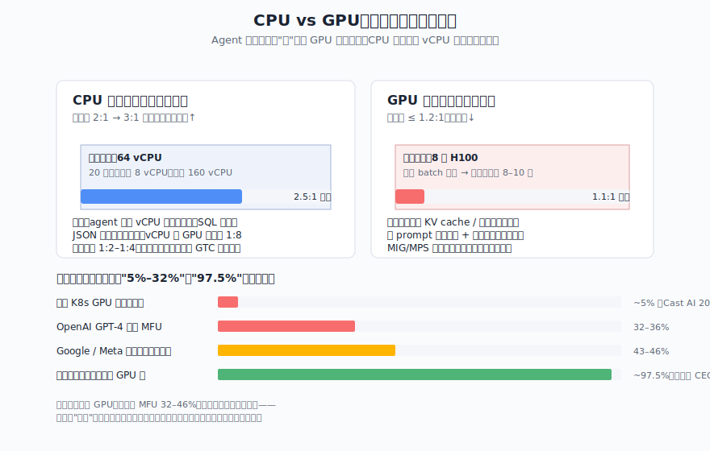
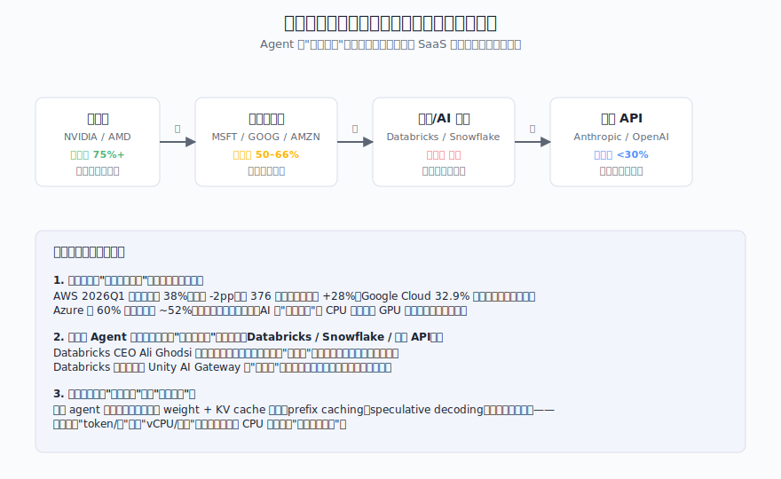
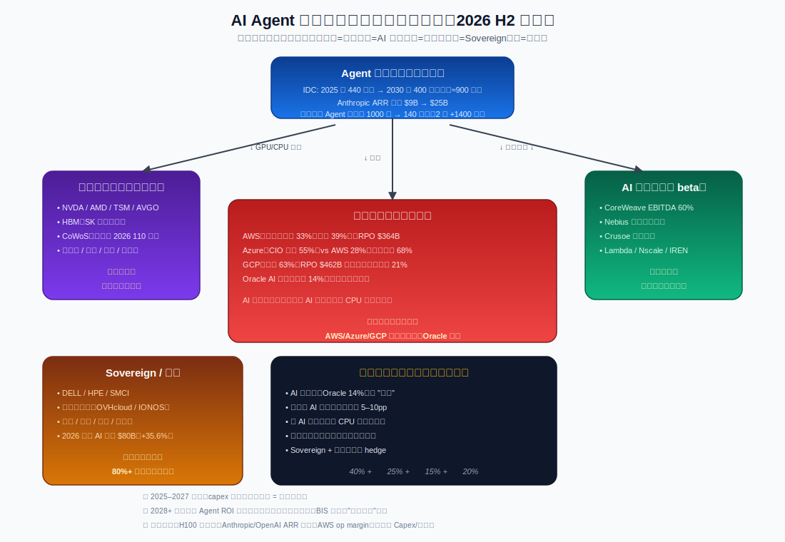
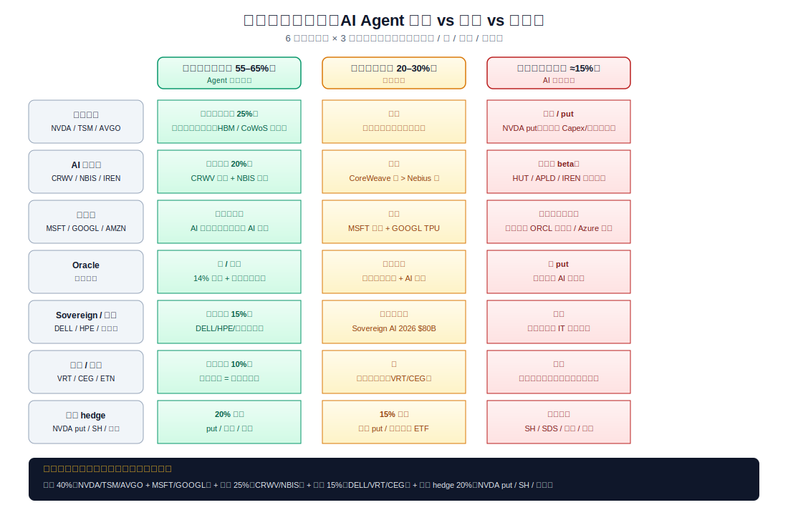

## 德说-第510期, AI Agent 时代, 云计算的超卖逻辑是不是完蛋了? 
  
### 作者  
digoal  
  
### 日期  
2026-07-08  
  
### 标签  
AI Agent , 不休息 , 云计算 , 商业模式 , 超卖 , CPU , GPU , 电力 , 规模 , 新势力玩家 , 利润  
  
----  
  
## 背景  

Databricks 最近的财报把一个老问题推到了台前：年化营收冲到 69 亿美元、同比涨 80%，但是CEO 阿里·戈德西却公开承认毛利率会走低 —— 理由是"agent 跑得太多，把算力吃光了"。消息一出，市场立刻把它放大成"AI 智能体 24/7 跑，云厂商的超卖棋局要崩"。这事得拆开聊，超卖没翻车，但也没法假装没发生；最值得搞清楚的是它到底伤了谁、伤在哪一块。

这篇文章想回答三个问题：超卖到底是啥？AI Agent 工作负载真的会抹平日内波形吗？未来云厂商可能被吃掉的利润是啥？

 

## 1. 超卖到底是什么 

云厂商能持续赚钱，靠的不是"卖容量"，而是"卖承诺"。一个物理 CPU 核对外可以承诺卖成 4–8 个 vCPU，存储卷在 OpenStack 默认配置下甚至可以 20:1 超卖（OpenStack Cinder 文档）。听起来离谱，但数学上立得住。

逻辑很简单：单个客户的工作负载有波峰波谷，不会 24 小时打满；N 个独立客户的负载叠加之后，波峰会因为相互错开而被"平均掉"。具体一点说：单个客户白天峰值是均值 8 倍很正常，但 64 个独立客户的峰值比均值只会高出 8/√64 = 1 倍。这叫统计复用，超卖的根基就是它。

超卖赌局要成立有三个前提：客户之间的负载互不相关、负载分布在时间上稳定、单客户的峰值是偶发而非持续。任何一个被打破，云厂商就得下调超卖比。AWS 多年下来把 CPU 安全超卖比做到 1:6–1:8，Google 早年做过内部研究（Garraghan et al. 2012），发现集群利用率常态只有 40%–60% —— 绝大多数时间物理资源都空着，超卖不是魔术，是白捡的空闲。
  
如果你养过“小龙虾”, 你用的是coding plan的大模型套餐, 我相信你会恨不得把模型的套餐内token全都烧完, 不让小龙虾有片刻休息, 才能值回票价的心态!
  
那么问题来了：AI Agent 一个不会累的客户端，是不是会把所有空闲时间都填满？

## 2. Agent 的 24/7，是个错觉

直觉上，agent 不睡觉、不午休，应该把云端的负载"摊平"。但企业生产环境和个人用户似乎不一样, 真正去看一个 agent 的运行时，会发现它的内部节奏远比"持续高占用"复杂。

一个 coding agent 一轮任务大概是这样走的：用户派单 → 模型推理（GPU 跑满 6–30 秒）→ 调外部工具/HTTP（IO 受限 0.5–5 秒）→ 写结果到"待 review"队列 → 等待人工 review（GPU 完全空转，可能几小时到几天）→ 通过后触发下一轮。 **"24/7 在线"和"24/7 跑满 GPU"是两码事**，前者是连接性、后者是算力占用。

按 agent 类型做个粗分层就清楚了：

| 类型 | 是不是真 24/7 跑满 | 量级（粗估） |
|---|---|---|
| 编程/客服/数据分析 agent | 否，跟着人审节奏走 | 65–80% |
| SRE / 安全监控 / 量化交易 | 是 | 5–15% |
| 夜间 ETL / 批量内容生成 | 反而强化峰谷 | 5–10% |

也就是说，真正"能抹平负载"的 agent 是少数派，绝大多数 agent 的负载图谱只是把峰顶推得更高、波形变得更不规则，而不是把它抹平。这层新的方差对云厂商同样可复用 —— 只要这些 agent 来自不同组织、彼此不相关，统计复用继续成立。

注意, 这也只是推论, 毕竟现在 databricks 的数据说明 agent 确实让它们利润下滑了. 

这条推论成立的**前置条件**有两个：agent 必须有外部依赖（调 API、写数据库、等人审），并且来自多个独立组织。如果未来某个大企业的全部 agent 都是单工作流、无人工审核、能 24/7 同步循环——比如全自动量化工厂 —— 那统计复用真的会失效。目前这类 agent 还不是主流，但必须关注。

  

## 3. CPU、GPU、电力：超卖被颠覆的程度不一样

把赌局拆到具体资源上，故事的形状完全不一样。

**CPU/内存这条线**：超卖反而可能走宽。原因是 agent 时代 vCPU 和 GPU 的配比需求正在变化 —— 从 chat bot 时代的 1:8 上升到 coding agent 的 1:4（雪球社区基于 NVIDIA GTC 公开数据测算）。同一个数据中心能容纳的"独立客户数 N"在膨胀，而 vCPU 又有上下文切换、抢占式调度这种天然容错，超卖窗口可能走宽而非走窄。 

**GPU 这条线**：超卖基本玩不动。GPU 推理有显存容量、显存带宽、MIG 切分粒度三道物理约束 —— 多个推理请求可以共享权重读取（这是 batch 摊销成本的来源），但必须同时驻留显存，结果就是 GPU 池的安全超卖比被压在 1.1:1–1.2:1。要么别卖，要么按峰值备。Databricks 毛利率下行的本质原因就在这里：GPU 推理的成本曲线几乎线性追随 token，烧多烧多。

**电力/制冷这条线**：完全没法超卖。Gartner 测算 2026 年全球 AI 数据中心用电量从 95 TWh 跳到 175 TWh（+84%），纳德拉公开讲"现在的瓶颈是电不是算力"。IEA 警告 20% 的计划数据中心可能延迟并网 —— 电网审批周期 3–5 年。这条物理上限反倒成了云厂商的护城河：谁都别想凭空多卖电力。

粗略定性： **CPU 池超卖比可能从 1:6–1:8 走宽，GPU 池被压在 1.1:1–1.2:1，电力无超卖可言**。所以"超卖叙事完蛋了"这种简化说法并不准确 —— 它是分资源、分层级的。

  

## 4. 价值链上，谁的利润被侵蚀了

  
芯片层（NVIDIA、AMD、台积电）依旧是最舒服的位置。HBM、CoWoS、先进封装全是技术壁垒，毛利率 75%+ 不在话下。这层吃的是时代红利，AI 推理越普及它越赚。

超大规模云（AWS / Azure / GCP）处于"换挡期"。营收暴涨 —— AWS 2026 Q1 营收 376 亿同比 +28%、Google Cloud 同比 +63%、Azure 同比 +40%（微软 FY26Q3） —— 但毛利率边际下滑。Azure 毛利率从 60% 一路走到 52%，管理层在财报里亲口承认"AI 工作负载推升基础设施投入"。它们不是被推翻，而是被迫从"靠超卖赚轻松钱"切到"靠单价 + 体量赚辛苦钱"。  

中间层（Databricks、Snowflake、部分模型 API）才是被 agent 流量反噬最深的那一层。它们按消耗计费，客户用得多 → 收入涨 → 但底层云成本同步涨 → 毛利率被侵蚀。Databricks 的 80% → 74% 就是这个剧本。模型 API 公司（Anthropic / OpenAI）毛利率 <30%，靠和云厂商签长约交换算力，谈判筹码上升但本身不掌握物理资源。 

新原生云（CoreWeave、Nebius、Crusoe）反倒有了新机会。CoreWeave 2025 年营收 51 亿、+168%，EBITDA 60%，靠的是 98% 收入绑定长约和能源套利。H100 一年合约价从 1.70 美元/小时涨到 2.35 美元（+40%），B200 续约价被通知 +94% —— 他们不是被冲击的对象，而是新的庄家。 

一句话总结： **agent 把"按席位收钱的 SaaS"利润，挤回"按 token / 算力收钱的云厂商"和"按硬件 / 能源收钱的芯片 + 电力供应商"手里**。中间那层转售商要么转型卖治理（Databricks 推 Unity AI Gateway）、卖编排（Snowflake 推 Cortex AI），要么被边缘化。

  

## 5. 怎么应对

按角色分。投资需谨慎, 请自行负责, 本文不负任何责任, 仅作交流.  

**对投资者**：跨栈分散 + 跨期套利更靠谱。上游硬件（NVDA / TSM / 寒武纪 / 中际旭创）+ 通用云（MSFT / GOOGL）的核心仓位先打底；AI 原生云做卫星仓位（短期 Nebius / Lambda 这种现货敞口大的，长期 CoreWeave 这种长约锁定的）；反向 hedge 留 15–20% —— 别把"AI 概念"全押满。IDC 预测全球 Agent 年执行任务数 5 年涨 900 倍，**这是一条单源预测，没有 Gartner / ABI 的交叉验证**（顺带提醒一下：增速若只有 100 倍，整条叙事强度减半）。  

**对云厂商运营商**：把"超卖利润率"换成"SLA 等级 + 专用容量溢价"。Anthropic 已经签下 10 年 1000 亿美元 + 5 GW 的 AWS Trainium 合约，这是新常态的样板 —— 长约、分级配给、按 token 定价。同样的，电力和能源合同（亚马逊过去 12 个月锁了 3.8 GW 容量）会变成云竞争的核心资产，比 vCPU 更值钱。  

**对企业 IT 决策者**：评估标准要从"vCPU 小时"换成"每 Agent 任务的总成本"。一个 agent 任务跑完花多少钱、KV cache 命中率多少、能否语义缓存复用 —— 这些是新 KPI。Dell COO Jeff Clarke 引用的数据：企业 Token 用量同比涨 320 倍，**3 个月内耗尽全年 Token 预算的案例已经在发生**。按业内粗估，自建 vs 公有云的盈亏平衡点大约在 GPU 利用率 70–80% —— 高频高合规场景（SRE / 客服 / 工业质检）正在快速搬回本地。

  

## 6. 这事能证明什么、推翻什么

把判断翻译成可观测的指标：

**证明"超卖被蚕食但没被推翻"** ，需要看到：超大规模云 AI 部分毛利率持续小幅下滑（H100 单卡时租上行、AI 业务收入 >50% 增速）、RPO（履约订单）继续膨胀（说明需求没减、只是被产能锁到多年合约）、CPU/GPU 配比从 1:8 反向走向 1:4。

**证伪"超卖被推翻"** ，需要看到：超大规模云综合毛利率回到 38%+（AWS 历史峰值）、AI 业务收入增速跌破两位数、IDC 900 倍预测至少两年内大幅下修——目前这几个条件一个都没成立。

顺带提醒一下，反过来"超卖啥事没有"的乐观叙事也得有边界。hyperscaler 当下的"卖水人"地位是用 1–2 年甚至 2–3 年的 GPU 折旧周期换来的 —— AWS 营业利润率从 39% 跌到 33% 是 1 个季度内发生的，Databricks 的 80% → 74% 是 4 个季度。 **速度上，大云可能比中间层恶化得更陡**，只是绝对体量大得多所以没那么显眼。换句话说，中间层当下更痛，hyperscaler 18–30 个月后的财报会更说明问题。 

还有一个隐含的修正： **Agent 工作负载 24/7 抹平负载**这条直觉，目前在 long-running agent（持续跑数小时到数天，没有"等人审"空隙）和全自动部署 pipeline 落地后会变得更脆弱。OpenClaw 开发者 Peter Steinberger 同时跑 100 个 agent 实例、30 天 760 万次请求——这是已经在生产里发生的"低方差负载"案例，规模不大但不该被忽视。今天超卖还算成立是因为这种 agent 还是少数派；18 个月后视情况再估。

  

## 总结

1. **"超卖叙事完蛋"是过度简化** —— 它在被蚕食、被换挡，但没翻车。CPU 池超卖可能走宽、GPU 池超卖被压死在低位、电力压根不能超卖。 
2. **真正的输家是中间层** —— 按消耗计费的 SaaS 数据平台（Databricks、Snowflake）被 agent 流量的成本曲线反噬；超大规模云只是"换挡"，芯片和能源供应商反而是最大赢家。  
3. **观察三个数字就够了**：超大规模云综合毛利率（特别是 AI 部分）、RPO（履约订单）同比增速、GPU 单卡时租。这三个任何一个异动，都比"agent 是不是 24/7"这种哲学讨论更重要。 

最后一句：AI Agent 时代云基础设施的关键变量不是"agent 数量"或"是否 24/7"，而是**单卡能卖出多少推理/秒 × 复用度 × 单价**这三件套。前两个被技术结构压住，第三个正在由 token 价格战和电力上限共同决定 —— 这才是经济学意义上的"价格 × 量 × 复用度"组合。 

  
  
#### [PostgreSQL 解决方案集合](../201706/20170601_02.md "40cff096e9ed7122c512b35d8561d9c8")
  
  
#### [德哥 / digoal's Github - 公益是一辈子的事.](https://github.com/digoal/blog/blob/master/README.md "22709685feb7cab07d30f30387f0a9ae")
  
  
#### [About 德哥](https://github.com/digoal/blog/blob/master/me/readme.md "a37735981e7704886ffd590565582dd0")
  
  

  
