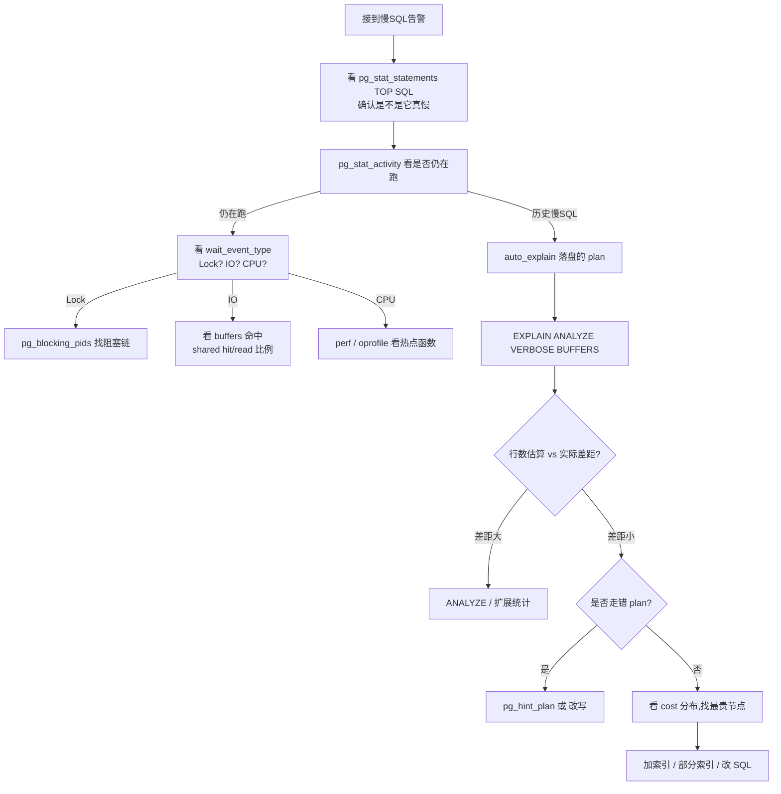
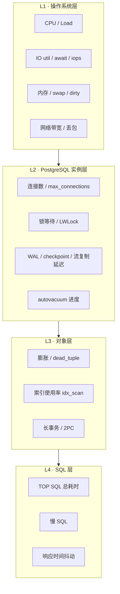
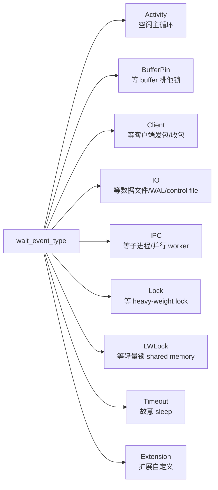
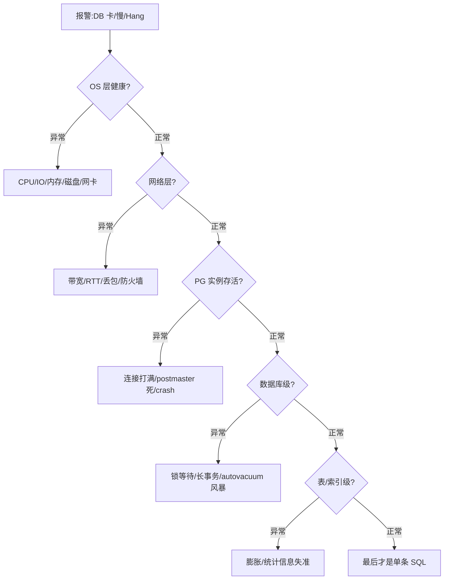

## PostgreSQL 从入门到进阶: SQL 优化、监控、故障诊断与问题分析
  
### 作者  
digoal  
  
### 日期  
2026-07-08  
  
### 标签  
PostgreSQL , SQL 优化 , 监控 , 故障诊断 , 问题分析 , 常见问题 , 实战 
  
----  
  
## 背景  

[演讲版](20260708_05_doc_005.html)

有一天同事拉了个群,说"数据库又卡了,帮忙看看"——你打开终端,面对的是十几张 `pg_stat_*` 视图、一堆没开过的开关、几份看不懂的 EXPLAIN 输出。这就是大多数 PG 使用者真实的工作状态:**会用 SQL,但卡在"为什么慢 / 出了事怎么定位"** 。

德哥(digoal)在阿里云和 PG 大会上的几份培训讲义把这套基本功讲得最透。我把它们和 PG 17 官方文档交叉核对后,按"从入门到高级进阶"的顺序重写成一篇文章,目标是让你在遇到问题时知道**该看哪个指标、走哪条工作流、用什么 SQL 验证假设**——不靠死记硬背,靠一套可推演的诊断思维。

我会先讲 SQL 优化(因为最常被问到),再讲监控指标怎么取、怎么读,最后讲故障诊断和问题分析。所有结论都标了**前置条件、适用边界、证伪手段**——这是工程师之间交流的最低礼貌,也是德哥讲义反复强调的"实战派"特征。

---

## 一、SQL 性能优化:从读懂 EXPLAIN 到治理规划器

### 1.1 EXPLAIN 是 DBA 的听诊器

拿到慢 SQL,第一动作是看它的执行计划。`EXPLAIN (ANALYZE, VERBOSE, BUFFERS, TIMING)` 这一行就是你的听诊器(出处:PG 17 官方文档 [Using EXPLAIN](https://www.postgresql.org/docs/17/using-explain.html))。

```sql
EXPLAIN (ANALYZE, VERBOSE, BUFFERS, TIMING, COSTS, FORMAT TEXT)
SELECT * FROM t WHERE id = 1;
```

典型输出长这样:

```
Seq Scan on t  (cost=0.00..25.00 rows=500 width=120)
              (actual time=0.015..0.318 rows=498 loops=1)
  Buffers: shared hit=4
Planning Time: 0.080 ms
Execution Time: 0.345 ms
```

几个关键字段的含义,我按"新手最常踩的坑"顺序讲:

- **cost**:Planner 的**估算成本**,单位是"1 次顺序页读"。它是估算,不是真实耗时,看个大概就行,别拿来当"性能指标"。
- **actual time**:真实耗时,毫秒。两个数字分别表示"首行返回"和"全部返回"。 **真耗时 = actual.end × loops**。
- **rows vs actual rows**:估算输出行数 vs 实际输出行数。偏差超过 10 倍几乎一定是统计信息失真。
- **Buffers: shared hit/read**:共享缓存命中 / 落盘次数。read 占比高说明 hot 数据没装进 `shared_buffers`。
- **loops**:节点被重复执行的次数。`loops > 1` 多半是嵌套循环或索引被多次扫,这时 cost 数字完全骗人。

**5 个最容易踩的坑**:

**坑 1:cost 数字小 ≠ 真的快。** 子节点 cost 低,父节点可能跑了几万次。某条 NestLoop 节点 cost=0.43,但 loops=30000、actual time=0.12ms,真实成本 = 3.6 秒——光看 cost 数字完全发现不了。

**坑 2:`rows` 估算偏差。** Planner 用 `pg_class.reltuples` 和 `pg_statistic` 估算,数据倾斜或多列相关时必然偏。 **证伪手段**:`ANALYZE` 后重跑 EXPLAIN,看估算是否贴近 actual;还偏就建扩展统计 `CREATE STATISTICS ON a, b FROM t;`。

**坑 3:把 `EXPLAIN ANALYZE` 当"试运行"。** ANALYZE 选项**真的执行**语句,不是估算。对 INSERT/UPDATE/DELETE 必须用事务包起来:`BEGIN; EXPLAIN ANALYZE ...; ROLLBACK;`。

**坑 4:Hash 节点 Batches > 1。** Hash Join 哈希表超出 `work_mem` 时落盘,出现 `Batches: 4` 之类,速度立刻降一个数量级。 **证伪**:`SET work_mem='256MB';` 再跑,看 Batches 是否回 1。

**坑 5:以为 Bitmap Heap Scan 就是好的。** Bitmap Scan 用于"低选择性过滤 + 索引组合"。看到 `Rows Removed by Filter` 巨大(> 实际输出 10×)就说明索引效果有限,需要补加更精准的索引。

> **顺带提醒一下**:cost 是估算、actual 才是真相——这是读 EXPLAIN 唯一不变的法则。

### 1.2 接到慢 SQL 的工作流

优化不是从加索引开始,而是从定位开始。



**核心原则**:

- **擒贼先擒王**:`pg_stat_statements` 按 `total_time` 排序取 TOP 5,优化收益最大的永远是占比最大的 SQL。优化一条次要 SQL 是浪费时间。
- **观测先行**:`log_lock_waits=on`、`track_io_timing=on`、`log_min_duration_statement`、`auto_explain.log_min_duration` 四个参数必开,否则事后无据可查。
- **不要相信 cost,要看 actual**:cost 是估算,actual time 是真实耗时,两者偏差超过 10 倍就一定有 Estimator 失准。

**前置条件**:能访问 `superuser` 或 `pg_read_all_stats` 权限的账号,能 reload `postgresql.conf`。 **证伪手段**:如果你优化后 `total_time` 反而上升,或 `pg_stat_statements.calls` 显示该 SQL 调用频率显著下降(应用层做了限流)——这就是"伪优化",回到第一步重新核对。

### 1.3 进阶:常见 SQL 优化场景

这部分是德哥讲义(1.pdf, P.121-188)的精华,我把每个场景展开成"识别 → 优化 → 验证"三步。

**分组 TOP**:每个组取前 N 条。反模式是子查询 + 窗口函数,如果表大且 uid 分布广,Planner 不得不全表扫 + 排序。 **正解**是 LATERAL + 复合索引:

```sql
SELECT u.uid, e.*
FROM users u, LATERAL (
  SELECT * FROM events WHERE events.uid = u.uid ORDER BY ts DESC LIMIT 10
) e;
```

配合 `events(uid, ts DESC)` 复合索引,验证 EXPLAIN 是否走 Index Scan。

**=ANY vs IN**:`WHERE x IN (1,2,3)` Planner 转成 `x=1 OR x=2 OR x=3`,能命中索引;`WHERE x = ANY(array)` 数组元素多时反而可能走 Hash Join。 **适用边界**:参数化查询用 ANY,子查询用 IN (SELECT) 或 EXISTS。 **证伪**:ANY 数组很大(> 1 万)且没走索引,把数组拆成临时表 + JOIN。

**模糊查询**:前缀 `LIKE 'abc%'` 走 BTree;后缀 `LIKE '%abc'` 用反向 BTree + `reverse(col)` 表达式索引;包含 `LIKE '%abc%'` 用 pg_trgm GIN/GiST。 **证伪手段**:看到 `Seq Scan on big_table + Filter: (col LIKE '%xxx%')` 必须立刻停手——这是没索引的典型症状,单条 SQL 能扫到天荒地老。

**count(distinct) 优化**:`count(distinct x)` 通常要全表扫或全索引扫,数据 > 1 亿基本无法秒回。 **五把刀**:
1. 部分索引(`CREATE INDEX ON t(id) WHERE status='active'`),count 走 Index Only Scan;
2. Index Only Scan(列是索引首列即可);
3. 物化视图 + `REFRESH MATERIALIZED VIEW CONCURRENTLY`;
4. 流计算把 distinct 推到写入侧(注意:PipelineDB 已停止维护,属历史方案);
5. T-digest 或 HLL 采样估算,允许 ±5% 误差时可用。

**OFFSET 分页**:`LIMIT 20 OFFSET 1000000` 仍要扫 100 万 + 20 行。 **正解**是 Keyset 分页:

```sql
SELECT * FROM t
WHERE id > $last_seen_id AND ...
ORDER BY id LIMIT 20;
```

**前置条件**:固定排序键。 **证伪**:翻第 1000 页时,Keyset 耗时应稳定 < 5ms,OFFSET 方案会随 offset 线性增长。

**任意字段组合查询**:10 个字段 1024 种组合,索引根本管不过来。 **正解**是 GIN 多列复合索引 + BitmapAnd,或 Bloom 索引,或在应用层加"必选条件"把组合数砍一个数量级。

**批量写入**:一次提交 1000 行 vs 1000 次提交 1 行——后者多 1000 次 WAL flush、fsync。德哥讲义(4.pdf, P.1501-1507)的 2018 年测试:PG 10 1000 行/事务可达 145 万行/s,无日志表(unlogged)可达 813 万行/s。 **注:这是 56 核 ECS + NVMe 上的数据,具体数字与硬件强相关,生产环境需自测**。

**JSON / 标签筛选**:`WHERE doc @> '{"tags":["hot"]}'` 用 GIN(`jsonb_path_ops`),德哥讲义实测 1 亿 JSON 14.4 万 TPS。RUM 索引是 GIN 超集,额外支持 `tsvector <-> tsquery` 相似排序、多列 INCLUDE。 **注:varbitx 等扩展在 PG 17 的兼容性需自测**。

### 1.4 高级:规划器失准、HINT、统计信息维护

**random_page_cost 默认值的真相**

PostgreSQL 优化器默认 `seq_page_cost=1.0`、`random_page_cost=4.0`(从 PG 8.x 一直延续到 PG 17,出处:PG 官方文档 / postgresql.conf)。这个 4.0 是**机械盘时代定的**——优化器认为 random_page 比 seq_page 慢 4 倍(机械头摆动)。SSD 没机械头,实际差异 < 10%,**SSD 场景推荐把 `random_page_cost` 调到 1.0~1.1**(出处:德哥 1.pdf, P.133-138)。

**第一性原理**:不校准 → 优化器"高估"索引扫描成本 → 选错 Seq Scan。 **前置条件**:磁盘真是 SSD/云盘(机械盘不要改)。 **验证**:`EXPLAIN` 看是否多了 Index Scan;压测对比。 **证伪**:改了之后某些大表 Seq Scan 反而快,这不是失准,而是优化器"看穿"了索引的真正价值。

**5 大 Planner 失准场景**:

| 场景 | 表现 | 对策 |
|---|---|---|
| 数据倾斜严重 | rows 估算严重偏高 | 扩展统计 `CREATE STATISTICS` |
| bulk load 后没 ANALYZE | 全 Seq Scan | 立即 `ANALYZE`;装数据用 `COPY ... WITH (FREEZE)` |
| 长时间小批量写入 | 统计陈旧 | 调 `autovacuum_analyze_scale_factor`(默认 0.1,大表降到 0.02) |
| 关联列无统计 | rows 估算为乘积 | `CREATE STATISTICS ON a,b FROM t` |
| 数据分布随时间漂移 | 老统计不反映新常态 | 周期性 ANALYZE |

**pg_hint_plan 怎么用**

PG 原生不支持 Oracle 风格的 Hint 注释,必须用 `pg_hint_plan` 扩展(社区主流,支持 PG 16/17,出处:[pg_hint_plan GitHub](https://github.com/ossc-db/pg_hint_plan)):

```sql
/*+ HashJoin(a b) NestLoop(b c) Leading((a b c)) IndexScan(a) */
SELECT ...
```

六类 Hint:扫描方式、JOIN 方式、JOIN 顺序、行数修正、并行、GUC 覆盖。 **适用边界**:应用层 SQL 模板固定才适合加 Hint;Hint 写在 `/*+` 开头且前面不能有任何字符。 **不要滥用**——Hint 是给"已知优化器判断错了"的场景兜底,不是默认选项。 **证伪**:`pg_hint_plan.debug_print = on` 看日志确认。

**部分索引(Partial Index)——投入产出比最高的优化**

如果 1% 的"激活"用户占了 99% 的查询:

```sql
CREATE INDEX idx_active_users ON users(id) WHERE status = 'active';
```

同样的 SELECT 在 active 上 Index Only Scan vs 全表 Seq Scan,差距 1000×。 **前置条件**:过滤条件稳定(不会变成 5%、10%、20%)。 **证伪**:如果业务方加了个"非激活"查询,但部分索引不命中,要么改 SQL 加 `WHERE status='active'`,要么别用部分索引。

**AD Lock 秒杀**

德哥 1.pdf, P.167-170 的 TPS 对比:**未优化 2855 TPS、nowait 优化 66630 TPS、advisory lock 优化 231376 TPS**(单行并发更新场景,跨度 80×):

```sql
UPDATE t SET x = x + 1
WHERE id = ? AND pg_try_advisory_xact_lock(id)
RETURNING *;
```

**前置条件**:必须配合"先查再写"的两阶段模式,锁粒度 = 单条记录 id。 **证伪**:`pg_stat_activity` 里看到大量 `LockWait`,说明冲突已超出 AD Lock 缓解能力,必须分片/排队/异步化。

---

## 二、监控指标及如何获取

### 2.1 先分层,再下钻,别上来就 SELECT *

PG 自带统计视图超过 100 个(全是 `pg_stat_*`、`pg_statio_*`),但生产中真正能稳定报警的不超过 20 个。一个新手和老司机的差别不在于"懂多少视图",而在于"出问题时第一刀砍哪儿"。



**核心观点**:**SQL 层优先 + 漏斗排查补充**。PostgreSQL 官方 wiki 在 [Performance Optimization](https://wiki.postgresql.org/wiki/Performance_Optimization) 章节里第一句就是"First, find the slow queries using pg_stat_statements"——这是 PG 社区的共识。

这话也得有个边界:很多人爱说"数据库慢,90% 不在 SQL 层",这话听起来很爽,但 ORM N+1 / OFFSET 分页 / 全表扫等纯 SQL 问题一上来就在 SQL 层。所以正确的顺序是:**先用 `pg_stat_statements` 擒贼擒王(命中大多数场景),再按 OS / 长事务 / 2PC 漏斗排查(命中突发场景)** 。前置条件:必须能登录到 DB 主机或 RDS 跳板机,至少有 `pg_stat_activity`、`iostat`、`vmstat`、`dmesg`、`netstat` 的访问权。托管 RDS 上 L1 数据由云厂暴露,DB 内部 `pg_stat_*` 仍可用,要换思路选指标。

**证伪手段**:L1~L3 都查了没毛病,业务还在报慢——大概率是 APP 层(连接池打满 / ORM N+1 / JVM Full GC / 上游阻塞),先把锅分清再继续挖。

### 2.2 必开的 5 个统计开关

任何一个没开,后续视图就是空的:

```ini
track_activities = on        # pg_stat_activity 才能拿到会话
track_counts     = on        # pg_stat_*_tables、pg_stat_database 累计计数器
track_io_timing  = on        # blk_read_time、pg_stat_statements 的 IO 时间
track_functions  = 'all'     # pg_stat_user_functions
compute_query_id = on        # pg_stat_activity.query_id、关联 pg_stat_statements 的桥梁
```

`compute_query_id` 在 PG 13+ 默认 `on`,但老版本必须显式开启,否则 `pg_stat_activity.query_id` 全是 NULL。改完 `SELECT pg_reload_conf();` 生效。

### 2.3 视图速查卡(6 张最常用表)

| 视图 | 一句话作用 | 关键字段 |
|---|---|---|
| `pg_stat_activity` | 当前所有会话 | `state`、`wait_event_type`、`wait_event`、`query_start`、`xact_start`、`pid` |
| `pg_stat_database` | 数据库级累计统计 | `numbackends`、`xact_commit`、`xact_rollback`、`blks_hit`、`blks_read`、`deadlocks`、`temp_bytes` |
| `pg_stat_user_tables` | 用户表 DML / 扫描统计 | `seq_scan`、`idx_scan`、`n_live_tup`、`n_dead_tup`、`n_mod_since_analyze` |
| `pg_stat_user_indexes` | 索引使用次数 | `idx_scan`、`idx_tup_read`、`idx_tup_fetch` |
| `pg_statio_user_tables` | 表/索引/toast 磁盘 IO | `heap_blks_hit/read`、`idx_blks_hit/read`、`toast_blks_hit/read` |
| `pg_stat_replication` | 主备流复制状态 | `state`、`sent_lsn`、`replay_lsn`、`write_lag`、`flush_lag`、`replay_lag` |

### 2.4 监控 SQL 实战(瑞士军刀)

```sql
-- ① 运行中慢 SQL
SELECT pid, usename, now() - query_start AS duration,
       state, wait_event_type, wait_event, query
FROM pg_stat_activity
WHERE state = 'active'
  AND now() - query_start > interval '5s';

-- ② 长事务
SELECT pid, usename, now() - xact_start AS xact_age, query
FROM pg_stat_activity
WHERE state IN ('active','idle in transaction')
  AND now() - xact_start > interval '30min';

-- ③ 长空闲事务(阻 autovacuum 的真凶)
SELECT pid, usename, now() - state_change AS idle_age, query
FROM pg_stat_activity
WHERE state IN ('idle in transaction','idle in transaction (aborted)')
  AND now() - state_change > interval '10min';

-- ④ 长 2PC
SELECT gid, prepared, owner, database
FROM pg_prepared_xacts
WHERE now() - prepared > interval '1h';

-- ⑤ 谁在堵谁(`pg_blocking_pids` 是 PG 9.6+ 引入的)
SELECT pid, pg_blocking_pids(pid) AS blocked_by,
       wait_event_type, wait_event, query
FROM pg_stat_activity
WHERE wait_event_type = 'Lock';

-- ⑥ 等待事件分布
SELECT wait_event_type, wait_event, count(*)
FROM pg_stat_activity
WHERE wait_event IS NOT NULL
GROUP BY 1, 2 ORDER BY count(*) DESC;
```

阈值:OLTP 慢 SQL 1~5s 算慢,OLAP 30s~5min;长事务默认 30min 报警;长空闲 5~10min 就该响。

### 2.5 auto_explain 自动捕获慢 SQL

`auto_explain` 是 PG 自带模块,可以把超过阈值的 SQL 的执行计划自动落盘。 **推荐配置**(注意:必须加载到 `shared_preload_libraries` 才能跨 session 全局生效,postmaster 启动时即加载;`session_preload_libraries` 只对新连接生效,不适合生产)。

```ini
shared_preload_libraries = 'auto_explain,pg_stat_statements'

auto_explain.log_min_duration = '3s'
auto_explain.log_analyze      = on
auto_explain.log_buffers      = on
auto_explain.log_format       = 'json'  # PG 10+ 支持 JSON,便于 ELK 解析
auto_explain.log_timing       = on
auto_explain.log_verbose      = on
auto_explain.sample_rate      = 1
```

**前置条件**:`auto_explain` 模块随 PG 安装自带,但 `LOAD 'auto_explain'` 需要 superuser。 **适用边界**:大流量库(> 5000 QPS)务必开 `sample_rate=0.01~0.1`,0.1% 抽样就够定位了,全量做 EXPLAIN ANALYZE 会让 CPU 翻倍。 **证伪**:日志里抓到某条 SQL 的 plan 包含 `Seq Scan on 大表`,且 `actual rows` 远大于 `rows` 估算,90% 是统计信息过期——跑 `ANALYZE` 后 plan 应自动变好。若仍走 Seq Scan,就是索引选错,需 `SET enable_indexscan = off` 验证或改写 SQL。

### 2.6 Wait Event 体系——2026 时代最强诊断武器

PG 9.6 起 `wait_event` 体系出现,PG 10 完善,PG 14+ 增加了 `IO` 类型的细分(如 `DataFileRead`、`WALWrite`),定位更精准(出处:PG 17 官方 [Table 27.4](https://www.postgresql.org/docs/17/monitoring-stats.html))。



**第一性原理**:`wait_event` 告诉你"这一刻这个 backend 为什么不在跑"。判断瓶颈在哪儿,只需要看分布:

- `IO:DataFileRead` 占大头 → 物理 IO 瓶颈,看 iostat、shared_buffers、磁盘 IOPS
- `LWLock:buffer_mapping` 占大头 → shared_buffers 太大导致 hash 冲突,调小或升级 PG 16+
- `LWLock:lock_manager` 占大头 → 锁太多/连接太多,降连接 + 上 pgbouncer
- `Lock:tuple` 占大头 → 行锁竞争,大概率是热点行,要重写 SQL(用 SKIP LOCKED 或拆批)

**适用边界**:若 `state=active` 且 `wait_event IS NULL`,在 PG 14+ 说明它在 CPU 上跑(大排序/哈希聚合),用 `perf top -p <pid>` 看是不是 CPU bound。

### 2.7 外部监控体系

| 工具 | 定位 | 适用场景 |
|---|---|---|
| Prometheus + pg_exporter | pull 式、PromQL、告警灵活 | 云原生主流方案,适配 Grafana |
| pgwatch2 | 自动化指标采集 + Grafana dashboards | 开箱即用,适合小团队 |
| PoWA | PostgreSQL Workload Analyzer | 历史回溯、TOP SQL 分析最强 |
| pgmetrics | 单文件可执行,产出健康报告 | 轻量级体检、邮件报告(项目仍在维护) |
| pgBadger | 解析 `pg_log`,产出 HTML 报告 | 偏日志分析,适合 DBA 周期性巡检 |

**注**:PipelineDB、plprofiler 等部分 PDF 提及的工具,使用前需确认维护状态(部分已停更)。

---

## 三、解读监控指标:从"看到数字"到"做出决策"

### 3.1 核心指标的健康区间

一句话拿到数据库健康总览:

```sql
SELECT
    datname,
    numbackends AS conns,
    xact_commit AS commit_cnt,
    xact_rollback AS rollback_cnt,
    round(100.0 * xact_rollback / NULLIF(xact_commit+xact_rollback,0), 2) AS rollback_pct,
    round(100.0 * blks_hit / NULLIF(blks_hit+blks_read,0), 2) AS cache_hit_pct,
    deadlocks, temp_bytes, blk_read_time, blk_write_time
FROM pg_stat_database
WHERE datname NOT IN ('template0','template1','postgres');
```

**各指标的健康区间与触发动作**:

| 指标 | 健康趋势 | 异常信号 | 触发动作 |
|---|---|---|---|
| TPS(commit 速率) | 业务基线 ±20% | 突降 50% 或突增 3 倍 | 突降→看 wait_event;突增→看 temp_bytes |
| 回滚率 | < 1% | > 5% 持续 | 应用层 BUG,长事务回滚代价也大 |
| 连接使用率 | < 70% | > 80% | 拒连风险,加 pgbouncer |
| 死锁次数 | 0 | > 0/min | 看 `log_lock_waits`,通常伴随锁争用 |
| 临时文件字节数 | 短期 0 | 单查询 > 1GB | `work_mem` 不够,该 SQL 性能差 |
| 块 IO 时间 | < 100ms/query | > 1000ms/query | 物理 IO 瓶颈,看 iostat |

**关于缓存命中率**

PostgreSQL 官方 wiki 在 [Server Tuning](https://wiki.postgresql.org/wiki/Tuning_Your_PostgreSQL_Server) 章节明确说:"Do not rely on the cache hit ratio as a measure of database performance. ... A simple query with a high hit ratio can perform worse than a complex query with a lower hit ratio."(官方原文)

> **顺带提醒一下**:PG 官方 wiki 明确说过不要把缓存命中率当作性能的唯一指标——所以缓存命中率看趋势就好,别定硬阈值。

具体到怎么看:
- **作为趋势指标**:稳定 99% + 突然掉到 80% = 热点数据被踢出 buffer = 大并发扫描 = 业务出错。这是它最有价值的用法。
- **作为分类讨论**:OLTP 短查询命中率长期 95~98% 是常态(因为 cold read 必然走盘),并行查询下每个 worker 各有 buffer pin 统计,口径会变。
- **避免硬阈值**:"≥ 99% 才正常"这种说法,会让你在并行查询或冷启动场景里徒增焦虑。

**证伪手段**:命中率低 → 同时 `pg_statio_user_tables ORDER BY heap_blks_read DESC LIMIT 10` 看是不是某几张表正在被大量 seq scan。

### 3.2 从 pg_stat_activity 看阻塞链

`pg_blocking_pids()` 是 PG 9.6 引入的救命函数,一行就能看到"谁在堵谁":

```sql
SELECT
    activity.pid,
    activity.usename,
    activity.wait_event_type || ':' || activity.wait_event AS wait,
    activity.query AS blocked_query,
    pg_blocking_pids(activity.pid) AS blocking_pids
FROM pg_stat_activity activity
WHERE activity.wait_event IS NOT NULL
  AND activity.wait_event_type = 'Lock';
```

`state` 字段精读:

| state | 解读 |
|---|---|
| `active` | 正在执行 SQL。active + `wait_event` 不为空 = 在**等**某资源 |
| `idle` | 上一条 SQL 已完成,等下一条,正常空闲连接 |
| `idle in transaction` | 开了事务但没提交,**危险信号**——事务持有锁、阻止 vacuum |
| `idle in transaction (aborted)` | 同上但事务已回滚,更危险——连接泄漏 |

> **第一性原理**:`state='idle in transaction'` 持续 > 5min,就要当作 P1 报警——这个会话每多活一秒,数据库内的 dead tuple 就多积压一秒,autovacuum 也无法绕过它回收垃圾。

**适用边界**:BI/报表工具(Superset、Metabase)内部会"开事务 → 大量计算 → 提交",可能持续 5~10min 不算异常,需与应用层协商阈值。 **证伪手段**:看 `query` 字段——如果是 "BEGIN",说明 APP 端真的发起了事务但卡住了;如果是 `SELECT ...`,说明 APP 在事务内发呆。

### 3.3 从 pg_stat_user_tables 看 vacuum/analyze 是否跟上

```sql
SELECT schemaname||'.'||relname AS tbl,
       n_live_tup, n_dead_tup,
       round(100.0 * n_dead_tup / NULLIF(n_live_tup,0), 2) AS dead_pct,
       n_mod_since_analyze, n_ins_since_vacuum,
       last_autovacuum, last_autoanalyze,
       age(relfrozenxid) AS xid_age
FROM pg_stat_user_tables
ORDER BY n_dead_tup DESC LIMIT 20;
```

| 指标 | 健康区间 | 异常阈值 | 实战解读 |
|---|---|---|---|
| `n_dead_tup / n_live_tup` | < 10% | > 20% 持续 | 膨胀中,调 `autovacuum_vacuum_scale_factor`(默认 0.2 太大) |
| `n_mod_since_analyze` | < n_live_tup × 0.1 | > n_live_tup × 0.2 | 统计信息过期,planner 选错 plan |
| `age(relfrozenxid)` | < 2 亿 | > 1.5 亿必须报警 | 事务号回卷风险,会强停库 |

> **第一性原理**:`relfrozenxid` 是 PG 给每张表打的"事务号快照"。一旦 `xid_age` 接近 `autovacuum_freeze_max_age`(默认 2 亿),PG 进入 **emergency vacuum**,所有 IO 让路,业务会卡。

### 3.4 从 pg_stat_user_indexes 看索引是否被使用

```sql
SELECT schemaname||'.'||relname AS tbl,
       indexrelname AS idx,
       pg_size_pretty(pg_relation_size(indexrelid)) AS size,
       idx_scan
FROM pg_stat_user_indexes
WHERE idx_scan = 0
ORDER BY pg_relation_size(indexrelid) DESC;
```

`idx_scan = 0` 持续运行的索引,基本就是死索引,可考虑 `DROP INDEX CONCURRENTLY`。 **前置条件**:外键约束上的索引(只用于 `ON DELETE CASCADE`)、极少触发的归档表索引、报表专用索引——这些是"应该 idx_scan=0"的合法场景。 **证伪手段**:对可疑死索引,先 `SET enable_indexscan = off; SET enable_bitmapscan = off` 跑 SQL,若性能无变化 = 真死;若性能变差 = 还有用。

### 3.5 从 wait_event 诊断瓶颈

按 wait_event_type 频次排序:

| Wait Event 主导 | 第一动作 | 第二动作 |
|---|---|---|
| `IO:DataFileRead` | `iostat -x 1`,看 `r_await` 是否 > 10ms | 热点数据 `pg_prewarm` 或换 SSD |
| `IO:WALWrite` | `iostat -x`,看 `w_await` | 主备复制延迟?同步复制降级异步 |
| `IO:ControlFileSync` | checkpoint 风暴? | `checkpoint_completion_target` 提到 0.9 |
| `LWLock:buffer_mapping` | `shared_buffers` 是否设太大(> RAM 25%) | 调小 / 升级 PG 16+ |
| `LWLock:lock_manager` | 单实例连接数是否超 500 | 上 pgbouncer / 升级 PG 16+(有锁池优化) |
| `Lock:transactionid` | 看 blocking_pids | 应用层事务顺序不一致,要治理 |
| `Lock:tuple` | 看具体 SQL + pg_blocking_pids | 用 `SKIP LOCKED` 改写 |

### 3.6 从 pg_stat_replication 诊断主备延迟

PG 10 起 `pg_stat_replication` 加了 `write_lag` / `flush_lag` / `replay_lag` 三段式:

```sql
SELECT pid, state, sync_state,
       (sent_lsn - replay_lsn) AS replay_lag_bytes,
       write_lag, flush_lag, replay_lag
FROM pg_stat_replication;
```

- `write_lag` > 1s 持续 → 主→备写入延迟,网络带宽或主库写入突增
- `flush_lag` > 1s → 备盘 IO 跟不上
- `replay_lag` > 30s → 长事务回放累积或 `hot_standby_feedback` 把 horizon 推前
- 三段全 NULL → **最危险**:网络断 / replication slot 被删,主库 WAL 无限堆积,可能撑爆磁盘

---

## 四、故障诊断:从报警到止血

### 4.1 接到报警——分层定位漏斗

任何报警过来,先分层,再下钻。



**适用边界**:本地单实例 PG 适用;托管 RDS 上 OS/网络层由云厂负责,只能拿到 PG 层指标,换思路。 **证伪**:OS、PG 实例、锁、autovacuum 都没事,但业务还在慢——不是 DB 层的锅,去查 APP 层(连接池、ORM、GC、上下游)。

### 4.2 三个核心查询(查谁在跑、谁在等、谁锁了谁)

**先收藏,排错时第一刀就砍这里**。

```sql
-- (1) 谁在跑
SELECT pid, now() - query_start AS duration, state, wait_event_type, wait_event, query
  FROM pg_stat_activity
 WHERE now() - query_start > interval '5s' AND state = 'active';

-- (2) 谁在等(长事务 / 空闲事务 / 2PC)
SELECT pid, state, now() - xact_start AS xact_age, query
  FROM pg_stat_activity
 WHERE state IN ('idle in transaction', 'idle in transaction (aborted)')
   AND now() - xact_start > interval '30min';
SELECT * FROM pg_prepared_xacts WHERE now() - prepared > interval '1h';

-- (3) 谁锁了谁
SELECT pid, pg_blocking_pids(pid) AS blocked_by, wait_event_type, wait_event, query
  FROM pg_stat_activity
 WHERE wait_event_type = 'Lock';
```

### 4.3 慢 SQL 排查七步法

从现象到根因,严格按顺序:

1. **抓样本**:`pg_stat_statements order by total_time desc limit 10`——擒贼先擒王。
2. **看类型**:Seq Scan? NestLoop? Hash Join? Sort? 每种有不同怀疑方向。
3. **看估算 vs 实际**:`rows=` 偏差几个数量级 → 统计信息过期,要 `ANALYZE`。
4. **看 buffer**:`shared hit` 高 = 内存友好;`read` 高 = 物理 IO 大,可能要建索引或调 `random_page_cost`。
5. **看 actual time**:数字的两个时间分别表示"首行返回"和"全部返回",后者才是真因。
6. **看 SETTINGS**:`EXPLAIN (..., SETTINGS, ...)` 会打印该 SQL 实际生效的优化器参数,例如 SSD 库上常显示 `random_page_cost = 1.1`(默认 4.0)。
7. **看 filter / recheck**:`Removed by Filter` 多 = 索引选错列;`Recheck Cond` 多 = bitmap scan 失误。

**证伪手段**:七步都查完,plan 也对,buffer 也合理,但还是慢 → 那就是 PG 之外的瓶颈(网络、应用、连接池),不要继续钻 SQL。

### 4.4 长事务 / 死锁 / 锁等待诊断

**止血三件套**:

```sql
-- 杀会话
SELECT pg_terminate_backend(pid) FROM pg_stat_activity
 WHERE now() - query_start >= interval '10 s' AND pid <> pg_backend_pid();

-- 只杀当前 query(更安全)
SELECT pg_cancel_backend(pid) FROM pg_stat_activity WHERE ...;
```

**预防参数**:

```ini
statement_timeout = '30s'
lock_timeout = '5s'
deadlock_timeout = '1s'
idle_in_transaction_session_timeout = '10min'
```

```sql
-- DDL 加超时(防雪崩)
BEGIN; SET LOCAL lock_timeout='100ms'; ALTER TABLE ...; COMMIT;
```

> **凡事要辩证的看**:长事务确实是 PG 高频灾难源之一,但 replication slot 误删、磁盘满、连接打满等灾难跟长事务无关,不要把所有生产事故都往长事务上套。

### 4.5 WAL / replication lag 排错

**先分清是 send 慢还是 replay 慢**:

```sql
-- 主库看 send 队列
SELECT client_addr, state, sent_lsn, replay_lsn,
       (sent_lsn - replay_lsn) AS byte_lag
  FROM pg_stat_replication;

-- 备库看 replay 进度
SELECT pg_last_wal_replay_lsn(), pg_last_wal_receive_lsn();
```

根因清单:
- **网络**:primary ↔ standby 带宽 < WAL 产生速率
- **备机 IO**:synchronous_commit=on 强制每次 commit 都要 fsync,备机盘 IOPS 跟不上
- **回放慢**:备库长查询/长 2PC,`hot_standby_feedback` 把 horizon 推前,主库 WAL 不能回收
- **逻辑复制 slot 卡死**:`pg_replication_slots.xmin` 不前进 → 主库 WAL 堆积

**第一性原理**:`send` 是"网络问题",`replay` 是"备机执行能力问题",`xmin` 不前进是"全局被事务卡住"问题——**这三件事要分开看**。 **证伪手段**:把 `hot_standby_feedback` 暂时关掉,延迟立刻消失 → 锁定是 feedback 导致的卡死。

### 4.6 突发 IO/CPU 但与业务无关

这是 PG 排错最有意思的一类——**报警响了,但 TOP SQL 没什么变化,CPU/IO 就是高**。答案几乎都在 PostgreSQL 后台进程三件套:**autovacuum + checkpoint + bgwriter**。

```sql
-- 1. autovacuum worker 在不在
SELECT pid, datname, relid::regclass, phase,
       heap_blks_total, heap_blks_scanned, heap_blks_vacuumed
  FROM pg_stat_progress_vacuum;

-- 2. freeze 风暴:看最老 xid 距 wraparound 还有多远
SELECT datname, age(datfrozenxid) FROM pg_database ORDER BY 2 DESC;
-- 任一 > 200,000,000(autovacuum_freeze_max_age)会触发 anti-wraparound vacuum

-- 3. checkpoint 频率
SELECT * FROM pg_stat_bgwriter;
-- checkpoints_req 远多于 checkpoints_timed → 雪崩式 checkpoint,调整 max_wal_size
```

**第一性原理**:`autovacuum_freeze_max_age = 200,000,000` 是 PG 硬编码的"事务回卷防线"——一旦某库最老 xid 跨过这个值,系统强制对该库所有表做 anti-wraparound vacuum。这是"为什么突然很卡"的最大单一原因。 **证伪**:把 autovacuum 临时关掉,IO 立刻降 → 锁定是 autovacuum;否则转向 checkpoint 或业务 SQL。

### 4.7 索引膨胀的机制

B-Tree 索引的"硬伤":**不释放空间,只 REUSE**。DELETE 后索引项变 dead tuple,VACUUM 标 dead 加入 FSM,新 INSERT 复用 dead slot;**如果长期没有 INSERT,永远不释放物理空间**——只有 REINDEX / REINDEX CONCURRENTLY 才能回收。

`nbtree` 内部用双向链表连接 leaf page,即使一个 page 只剩 1 个有效 item,这个 page 也不能释放。 **HEAP 的水位可以降,但索引的水位几乎只能 REINDEX**。

**证伪手段**:`pgstattuple` 看 `dead_tuple_percent`,> 30% 就值得 REINDEX;索引大小超过表大小 2 倍就是膨胀典型特征。

---

## 五、问题分析:从"为什么"反推机制

### 5.1 为什么 OFFSET 大就慢

`SELECT ... ORDER BY c LIMIT 10 OFFSET 80000`——PG 优化器无选择时只能**先把前 80010 条按 c 排好**,再扔掉前 80000 条。OFFSET 不等于"跳过",等于"先排序再扔"。

**正确解法**:基于有序键的条件分页。

```sql
WHERE c1=1 AND c2 BETWEEN 1 AND 10
  AND crt_time >= ?  -- 上次返回的最大 crt_time
  AND pk > ?         -- 上次返回的最大 pk(防同 crt_time)
ORDER BY crt_time, pk LIMIT 10;
-- 索引 (c1, c2, crt_time, pk) 直接走 Index Scan,不再 OFFSET
```

**注**:德哥讲义(3.pdf)里"OFFSET 8w 慢 7.4s"的案例,目的是说明 OFFSET 代价与排序代价叠加,不是精确 benchmark。

### 5.2 为什么表和索引会膨胀

MVCC 让 UPDATE 产生新版本,DELETE 产生 dead tuple——**这些 dead tuple 必须等 vacuum 才能回收**。vacuum 跟不上节奏的原因(7 条):
1. `autovacuum = off`
2. `autovacuum_vacuum_scale_factor = 0.2` 太大,大表等到 20% 才触发
3. `autovacuum_naptime` 太大
4. `autovacuum_vacuum_cost_delay` 太大(vacuum 跑得太斯文)
5. `autovacuum_max_workers` 太少(默认 3,大库不够)
6. `maintenance_work_mem` 太小,装不下所有 dead ctid,导致多次扫索引
7. 长事务 / 长 2PC / 慢 slot / `hot_standby_feedback` 挡 vacuum

**结论**:膨胀是 vacuum 跟不上的结果,不是 UPDATE/DELETE 本身。把 vacuum 配好,膨胀就消失。

### 5.3 为什么 STANDBY 有延迟

延迟 = `send_lag` + `replay_lag`。
- `send_lag`:网络 + primary 端 `wal_sender` 写网卡速度;通常 < 1ms,1Gbps 内网可忽略。
- `replay_lag`:备机 `startup` 进程把 WAL 应用到数据文件的速度;受备机 IO 能力和 apply worker 并发限制。

**特例**:`hot_standby_feedback = on` 时,备机的最长事务会反馈给主库,主库不清理比该 xmin 还老的数据,导致 WAL 不能回收、延迟反向放大。

### 5.4 为什么会雪崩

雪崩三件套:
- **lock**:大事务持锁,小事务都等;一个慢查询卡 100 个 worker。
- **大锁被已有长事务的小锁堵塞**:典型场景——DDL(ACCESS EXCLUSIVE)被 SELECT 阻,所有后续 DDL/DML 都排队。
- **高并发小锁等大锁**:典型场景——秒杀场景,几百个事务抢同一行的 `SELECT FOR UPDATE`。

> **第一性原理**:**没有超时 = 没有雪崩保护**。德哥反复强调"DDL 必须包在事务里设 `lock_timeout`,否则一次 ADD COLUMN 就能把整库卡住"。

### 5.5 为什么需要 FREEZE

32-bit 事务 ID 最多 2^32 ≈ 43 亿,PG 设计为循环使用。当某个表的 `relfrozenxid` 距离回卷点 < 200,000,000(autovacuum_freeze_max_age)时,autovacuum 会强制 freeze。

xid 回卷后,原本"过去"的事务会变成"未来"的事务,数据突然消失(著名的"PG 库变只读"事故)。数据库进入保护模式:拒绝写入,只允许 VACUUM。 **自检**:

```sql
SELECT datname, age(datfrozenxid) FROM pg_database ORDER BY 2 DESC;
-- 任一库 age > 200,000,000 → 该库已处于 anti-wraparound 模式
-- 任一库 age > 1,500,000,000 → 紧急!
```

### 5.6 为什么 GIN 有时不快

GIN 索引更新走"快路径"(放 pending list),vacuum 时才合并到主索引。pending list 越大,查询时遍历 pending list 的开销越大,RT 升高。

**诊断**:`CREATE EXTENSION pageinspect; SELECT * FROM gin_metapage_info(get_raw_page('idx_xxx', 0));`——看 `n_pending_pages`,越大越慢。 **修复**:`VACUUM tbl;` 触发 pending list 合并。 **第一性原理**:GIN 是为"读多写少"设计的,高频写时必须配套高频 vacuum。

### 5.7 为什么 BRIN 有时不快

BRIN 适用场景:**线性数据**(按物理顺序存储)且 HEAP PAGE 之间的边界清晰,时序数据是天然例子。 **不适用**:数据物理顺序与索引列顺序不一致(随机写入),多列任意组合查询(只对单列有效)。 **证伪**:把表 `CLUSTER` 在 BRIN 列上,RT 立刻降 → 锁定是物理顺序问题;否则换 B-Tree。

**注**:德哥讲义提到"BRIN 10 亿行 = 1MB 索引",这取决于 `pages_per_range` 配置(较大时确实可降到 1MB 以下),具体数值与设置相关。

### 5.8 为什么执行计划不正确

根因清单:
- **统计信息维度不够**:多列相关性没体现,优化器以为独立 → bitmap 失准
- **统计信息陈旧**:长时间不 `ANALYZE`,`pg_class.reltuples` 与实际差几个数量级
- **优化器因子参数不对**:`random_page_cost = 4`(默认)时,PG 认为随机 IO 很贵,倾向顺序扫描;对 SSD 盘要调到 1.0~1.1
- **plan cache / prepared statement**:`plan_cache_mode = auto` 时,前 5 次执行选 plan,后续都用这个 plan,即使数据已变(plan sniping)
- **多表 JOIN 顺序**:超过 8~12 张表时,PG 改用遗传算法,不一定最优;可用 `join_collapse_limit` 强制穷举

**自检**:

```sql
-- 看统计信息新鲜度
SELECT schemaname, relname, last_analyze, n_mod_since_analyze
  FROM pg_stat_user_tables ORDER BY n_mod_since_analyze DESC;
ANALYZE VERBOSE tbl;

-- 看是否 plan cache 引起
SET plan_cache_mode = force_custom_plan;
-- 对比两条 EXPLAIN
```

### 5.9 为什么 push/pull 大量数据慢

核心原因:走 `simple query` 协议(每个语句单独解析/规划/执行),大量 round-trip;走 `extended query` 协议(用 prepared statement),可以省去重复解析。

**优化方向**:
- 用 prepared + bind:`PREPARE p1 AS SELECT * FROM t WHERE id = $1;`
- 用 COPY 替代 INSERT(10x~100x 提速)
- 批量提交
- 异步提交:`SET synchronous_commit = off;`(配合 `wal_writer_delay = 10ms`)

> **第一性原理**:**网络 round-trip + 单条事务的 fsync = 大量数据搬运的两大成本**。

---

## 六、30 秒速记卡

贴工位上的版本:

```
【故障三件套】
  长事务 → 阻 vacuum → 膨胀 → 慢
  长 2PC → 阻 vacuum → 同上
  慢 slot → 主库 WAL 堆 → 磁盘爆

【排错七问】
  1. pg_stat_activity 现在谁在跑?
  2. 谁锁了谁?(pg_blocking_pids,PG 9.6+)
  3. pg_stat_progress_vacuum 在 vacuum 吗?
  4. pg_stat_replication 延迟是 send 还是 replay?
  5. pg_replication_slots.xmin 卡了吗?
  6. pg_stat_database 死元组/事务年龄?
  7. pg_stat_bgwriter checkpoint 频率?

【必杀参数】
  statement_timeout=30s
  lock_timeout=5s
  idle_in_transaction_session_timeout=10min
  autovacuum_max_workers=8
  autovacuum_vacuum_scale_factor=0.05
  random_page_cost=1.1(SSD)

【保命查询】
  SELECT age(datfrozenxid) FROM pg_database ORDER BY 2 DESC;
  -- 任一 > 2 亿立即处理
```

---

## 七、核心结论与可观测验证

**最重要的 3 句话**:

1. **读懂 EXPLAIN**(尤其是 actual rows、buffers、loops)比"调参"有用 10 倍。
2. **擒贼先擒王**:优化 `pg_stat_statements.total_time desc top 5`,而不是优化你看不顺眼的那条 SQL。
3. **统计信息是一切规划器决策的根**:ANALYZE 自动化不到位,后面所有优化都是空中楼阁。

**观测验证清单**:

| 结论 | 证明手段 | 证伪手段 |
|---|---|---|
| 索引被命中 | EXPLAIN 出现 Index Scan / Index Only Scan | 同一 SQL 出现 Seq Scan |
| 统计信息准确 | EXPLAIN ANALYZE 估算 rows 与 actual 偏差 < 3× | 偏差 > 10× |
| Hint 生效 | EXPLAIN plan 与 Hint 描述一致 | `pg_hint_plan.debug_print` 显示 hint 被忽略 |
| 主备延迟是网络 | `write_lag` 大、`replay_lag` 正常 | `write_lag` 正常但 `replay_lag` 大 → 是回放问题 |
| autovacuum 跟不上 | `pg_stat_user_tables.n_dead_tup` 持续上升 | autovacuum 频率正常,dead tuple 比例 < 10% |

---

**最后一句**:PG 的故障诊断本质上是"看监控 + 看等待事件 + 看统计信息"的循环,任何把 PG 故障神秘化的论调都是没真干过生产。保持冷静,看现象反推机制,看机制反推观测——这就是 PG 实战的基本功。

---

**主要参考来源**:
- 德哥(digoal)培训讲义 
    - [PostgreSQL 日常维护、监控、排错、优化](20260708_05_doc_001.pdf)  
    - [PostgreSQL SQL 优化](20260708_05_doc_002.pdf)  
    - [PostgreSQL 常见为什么](20260708_05_doc_003.pdf)
    - [2018 PostgreSQL 峰会培训材料](20260708_05_doc_004.pdf)
- PostgreSQL 17 官方文档:[Using EXPLAIN](https://www.postgresql.org/docs/17/using-explain.html)、[Statistics Used by the Planner](https://www.postgresql.org/docs/17/planner-stats.html)、[Monitoring Statistics](https://www.postgresql.org/docs/17/monitoring-stats.html)、[auto_explain](https://www.postgresql.org/docs/17/auto-explain.html)
- pg_hint_plan 文档:[GitHub: ossc-db/pg_hint_plan](https://github.com/ossc-db/pg_hint_plan)
- PostgreSQL 官方 wiki:[Performance Optimization](https://wiki.postgresql.org/wiki/Performance_Optimization)、[Server Tuning](https://wiki.postgresql.org/wiki/Tuning_Your_PostgreSQL_Server)
    
#### [PostgreSQL 解决方案集合](../201706/20170601_02.md "40cff096e9ed7122c512b35d8561d9c8")
  
  
#### [德哥 / digoal's Github - 公益是一辈子的事.](https://github.com/digoal/blog/blob/master/README.md "22709685feb7cab07d30f30387f0a9ae")
  
  
#### [About 德哥](https://github.com/digoal/blog/blob/master/me/readme.md "a37735981e7704886ffd590565582dd0")
  
  

  
