## PostgreSQL 从入门到进阶: 优化、监控、故障诊断与问题分析（4 小时实战版）
  
### 作者  
digoal  
  
### 日期  
2026-07-09  
  
### 标签  
PostgreSQL , SQL 优化 , 监控 , 故障诊断 , 问题分析 , 常见问题 , 实战 
  
----  
  
## 背景  

这份材料的目标是让你在遇到问题时**知道该看哪个指标、走哪条工作流、用什么 SQL 验证假设**，不靠死记硬背，靠一套可推演的诊断思维。

- 第一章「优化」（~60 分钟）：事前把坑堵住，事后把坑挖出来
- 第二章「监控」（~45 分钟）：开关、视图、SQL、auto_explain、wait_event 体系
- 第三章「故障诊断」（~55 分钟）：分层漏斗、止血三件套、各类事故现场
- 第四章「问题分析」（~50 分钟）：17 个"为什么"反推内核机制
- 第五章「FAQ AI 增强」（~30 分钟）：用 Claude Code + DeepWiki + 本地 PG 沉淀 SOP

每个核心结论都标了**前置条件、适用边界、证伪/证明手段** —— 这是工程师之间交流的最低礼貌，也是德哥讲义反复强调的"实战派"特征。证伪手段的具体性比结论更重要：模糊的"看现象"是废话，能跑的 SQL 才是真功夫。

**重点是思维方式, 技术更迭很快, 环境各不相同, 不要生搬硬套, 希望有所启发.**

---

# 一、PostgreSQL 优化

优化分两段：**事前优化**是上线前把能踩的坑堵住，**事后优化**是事故发生后的止血和根治。两者不是对立，是同一回路——事后反推出来的经验，又沉淀成下一次的"事前"。

> 顺带提醒一下：网上常说"事前优化的成本是事后的 1/10"，这话方向对但数字没出处。换个说法更准确：**绝大多数事后优化的成本远高于事前预留**。按这个"二八原则"分配精力即可。

## 1.1 了解 Workload：先分清 OLTP / OLAP / 混合

参数调优的起点不是参数本身，是你的 workload 形态。三种 workload 的特征、调优方向、关注指标完全不同：

| 类型 | 特征 | 参数调优方向 | 关注指标 |
|---|---|---|---|
| **OLTP**（如电商订单、账号系统） | 短事务、高并发、点查询为主、毫秒级 RT | `shared_buffers` 适中、`work_mem` 小、`effective_cache_size` 大、`random_page_cost` 降 SSD | TPS、P99 延迟、锁等待、长事务 |
| **OLAP**（如报表、BI、ETL） | 长查询、大表扫、并行度高、秒-分钟级 RT | `work_mem` 大、`max_parallel_workers_*` 大、`random_page_cost` 高（倾向 Seq Scan）、`effective_cache_size` 大 | 查询 RT、临时文件、并行 worker 利用率 |
| **混合**（HTAP） | 短查询+长查询并存、资源争抢 | 用资源池/队列隔离、给 OLAP 单独实例或 Read Replica | 两套指标同时监控 |

如果上来就照搬"标准 postgresql.conf"，OLTP 库 `work_mem` 给大了会浪费内存，OLAP 库 `work_mem` 给小了会疯狂落盘——**workload 不分清，所有调优都是猜**。

## 1.2 了解环境：架构 + 硬件 + 软件

### 1.2.1 两种典型架构

**云上架构（托管 RDS 或云盘自建）** ：

```
[APP] → [SLB] → [PG Primary] → [流复制] → [PG Standby]
                  ↓
              [EBS / 云盘 SSD]
                  ↓
              [OSS / S3] ← 备份/归档
```

云上的特点：**底层 IO 由云厂封装，你看到的"SSD"其实是 EBS gp3 / ESSD PL3**，网络是 VPC 内网。监控上 OS 层数据由云厂暴露，DB 层 `pg_stat_*` 仍可用。

**本地架构（自建机房 / 裸金属）** ：

```
[APP] → [HAProxy / PgBouncer] → [PG Primary] → [流复制] → [PG Standby]
                                     ↓
                              [本地 NVMe / RAID]
                                     ↓
                              [NAS / S3] ← 备份/归档
```

本地的特点：**底层硬件完全可控，能从 IO 调度器一路调到 PG 内核**。云盘做不到的 SSD 4K 对齐、本地盘条带化，这里可以做到极致。

### 1.2.2 拿到一份新库，第一件事是登记这张表

| 维度 | 命令 / 视图 | 关注点 |
|---|---|---|
| OS 版本 | `cat /etc/os-release; uname -r` | 内核 ≥ 4.19（io_uring 性能更好） |
| CPU/内存 | `lscpu; free -h` | 核数、超线程、NUMA 拓扑 |
| 磁盘 | `lsblk; nvme list; hdparm -I /dev/sda` | SSD/NVMe、容量、IOPS 标称 |
| 文件系统 | `df -Th /pgdata` | ext4/xfs/btrfs（PG 推荐 xfs） |
| PG 版本 | `SELECT version();` | 是否在主版本支持周期内 |
| 关键参数 | `SELECT name, setting, unit FROM pg_settings WHERE category LIKE '%Resource%' OR name IN ('shared_buffers','work_mem','maintenance_work_mem','effective_cache_size','max_connections','wal_level');` | 与 workload 是否匹配 |
| 关键扩展 | `SELECT extname, extversion FROM pg_extension;` | 是否装了 `pg_stat_statements`、`auto_explain` |
| 关键对象大小 | `SELECT pg_size_pretty(sum(pg_database_size(oid))) FROM pg_database;` | 总容量 |
| 表/索引膨胀 | 见 §1.6.5 | `n_dead_tup / n_live_tup` |

> 顺带提醒一下：上面这张表比任何"调优清单"都重要——**没有环境基线，调优就是玄学**。同一个 `work_mem = 64MB` 在 16GB 内存的 OLTP 库是灾难，在 256GB 内存的 OLAP 库是入门。

## 1.3 事前优化一：环境优化

### 1.3.1 SSD 页面对齐

SSD 的物理页大小是 4K（高级 NVMe 是 4K+），文件系统块、PG 的 `block_size`（默认 8K）都要对齐到 4K 的倍数，否则一次写会触发 SSD 内部的 read-modify-write，性能掉一半。

```bash
# 检查当前对齐
blockdev --getalignoff /dev/nvme0n1   # 不为 0 就是没对齐

# xfs 创建时强制对齐（PG 推荐文件系统）
mkfs.xfs -d su=4k,sw=1 -L pgdata /dev/nvme0n1p1
mount -o noatime,nodiratime,allocsize=16m /dev/nvme0n1p1 /pgdata
```

> **前置条件**：磁盘是 SSD/NVMe。机械盘不需要 4K 对齐（它的对齐单位是磁道）。
> **证伪手段**：用 `fio -filename=/pgdata/test -direct=1 -rw=randwrite -bs=4k -size=1G -runtime=30` 测随机写 IOPS，未对齐的 SSD 通常比对齐的低 30%~50%。

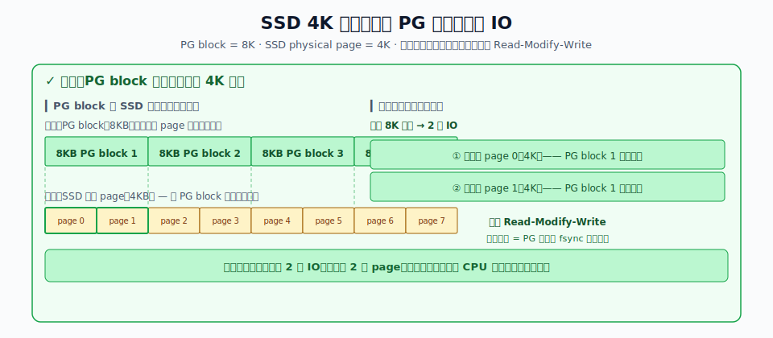

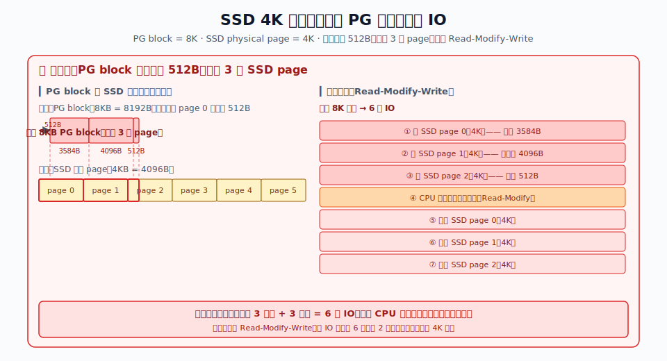

### 1.3.2 IO 调度器

机械盘时代调度器（`cfq`、`deadline`）用来合并磁头寻道；SSD 没有磁头，这些调度器反而增加延迟。Linux 5.x 内核后默认的 `mq-deadline` / `none` / `kyber` 更适合 SSD。

```bash
# 查看当前调度器
cat /sys/block/nvme0n1/queue/scheduler
# 期望看到 [none] 或 [mq-deadline] 激活

# 临时切换
echo none > /sys/block/nvme0n1/queue/scheduler
# 永久：写到 /etc/udev/rules.d/60-ssd-scheduler.rules
```

> **前置条件**：SSD/NVMe。机械盘继续用 `deadline`。
> **边界**：云盘（EBS、ESSD）由云厂处理调度器，你看不到也改不了。

### 1.3.3 ulimit 与内核参数

`ulimit -n`（文件描述符）至少 65535，`ulimit -u`（进程数）至少 16384，PG 每个连接至少消耗 1 个 fd：

```bash
# /etc/security/limits.conf
*  soft  nofile  65535
*  hard  nofile  65535
*  soft  nproc   16384
*  hard  nproc   16384

# /etc/sysctl.conf 关键参数
vm.swappiness = 0                # PG 用 swap 是性能灾难,建议禁用

# 示例：假设服务器内存为128GB，为PostgreSQL预留较大的脏页缓冲

# 1. 让后台刷盘尽早、平滑地启动。设置一个较小的值，比如总内存的1%-3%
vm.dirty_background_bytes = 314572800  # 300MB，当脏页达到300M就开始后台刷

# 2. 设置一个较高的强制同步阈值，给数据库充分的缓冲空间来吸收写尖峰，
# 但不要高到在断电时会丢失过多数据。一般设为总内存的5%-10%
vm.dirty_bytes = 4294967296            # 4GB，脏页达到4G才强制同步

# 3. 缩短脏页老化时间，强制老旧的脏页更积极地被刷盘，这能有效控制检查点后的脏页积压
vm.dirty_expire_centisecs = 500        # 5秒（默认30秒对你来说太长）
vm.dirty_writeback_centisecs = 100     # 1秒，提高内核回写线程的唤醒频率，让刷盘更平滑

vm.nr_hugepages = $((RAM_MB*25/100/2))  # 见 1.3.4
net.core.somaxconn = 4096        # 高并发连接排队, 应对高并发连接瞬间涌入
net.ipv4.tcp_max_syn_backlog = 4096
net.core.rmem_max = 16777216  # 每个 socket 的最大内核接收/发送缓冲区
net.core.wmem_max = 16777216
```

### 1.3.4 HugePage

PG 的 `shared_buffers` 推荐 `RAM × 1/4`，超过 32GB 必须配 HugePage，否则 TLB miss 会让大库性能掉 30%+。

```ini
# postgresql.conf
huge_pages = try      # PG 13+ 默认 try;建议 on(配错则 PG 起不来)
shared_buffers = 64GB # 示例
```

```bash
# 计算并预留 HugePage（64GB shared_buffers / 2MB per hugepage = 32768 hugepages）
echo $((64 * 1024 * 1024 / 2048)) > /proc/sys/vm/nr_hugepages
# 持久化: vm.nr_hugepages = 32768 写到 /etc/sysctl.conf
sysctl -w vm.nr_hugepages=32768
```

> **前置条件**：内存 ≥ 64GB；用 `grep Huge /proc/meminfo` 看 HugePage 总大小。
> **边界**：容器/Docker 嵌套虚拟化时 HugePage 配不上，性能提升有限。

### 1.3.5 块设备条带化（RAID / LVM）

多盘 RAID0/LVM stripe 能把单盘 IOPS × N：

```bash
# mdadm RAID0
mdadm -C /dev/md0 -l 0 -n 4 /dev/nvme[0-3]n1   # 4 块 NVMe 做 RAID0
# 关键参数: chunk size 64KB~256KB,与 PG block_size 8K 对齐
mkfs.xfs -d su=256k,sw=4 /dev/md0
```

> **边界**：云盘已经是底层条带化的（EBS gp3 内部 stripe），不需要再做 RAID0。NVMe 裸盘做 RAID0 才有意义。

### 1.3.6 文件系统

PG 官方推荐 **xfs**（与 ext4 性能相当但大文件更稳）。**禁用** btrfs（PG 社区历史问题多）和 zfs（PG 18+ 适配中）。

## 1.4 事前优化二：数据库参数优化

下面这套参数模板基于德哥 2018 年的 `postgresql.conf` 模板，按 PG 17 微调。**每条公式都是经验值，不是教条**——上生产前在自己环境跑 benchmark 验证。

### 1.4.1 连接与认证

```ini
listen_addresses = '0.0.0.0'
port = 1921
max_connections = 2000   # 公式: 物理内存(GB) * 1000 * (1/4) / 5
superuser_reserved_connections = 10
unix_socket_directories = '., /tmp'
unix_socket_permissions = 0700
password_encryption = scram-sha-256   # PG 10+;MD5 已不安全
tcp_keepalives_idle = 60              # 抗网络设备超时
tcp_keepalives_interval = 10
tcp_keepalives_count = 10
```

> **公式解释**：假设一个连接占 5MB 内存（含 syscache、relcache、work_mem 的一部分）。2000 连接 = 10GB 上限。
> **证伪**：`max_connections` 上调后内存不够，触发 OOM killer——先把 PG 内存预算算清楚。

### 1.4.2 内存

```ini
# shared_buffers: 主机内存 × 1/4(用 hugepage),否则 min(32GB, 主机内存×1/4)
shared_buffers = 24GB
huge_pages = try

# work_mem: min(物理内存/4096, 64MB),4MB 起步
# 单条 query 多个 NODE 都可能用 work_mem,实际 ×N 倍消耗
work_mem = 64MB

# maintenance_work_mem: min(8GB, 主机内存×1/8 / max_parallel_maintenance_workers)
maintenance_work_mem = 2GB

# autovacuum_work_mem: PG 13+ 引入;min(8GB, 主机内存×1/8 / autovacuum_max_workers)
autovacuum_work_mem = 1GB
# < PG 13 走 maintenance_work_mem

# effective_cache_size: 主机内存 × 1/2(给 OS page cache 的估算)
effective_cache_size = 48GB
```

> **前置条件**：HugePage 配齐（见 1.3.4）。
> **边界**：PG 16+ shared_buffers 加大（> 内存 25%）配合 buffer_mapping 优化有效，但 OS page cache 命中率下降要权衡。

### 1.4.3 WAL 与复制

```ini
wal_level = replica
wal_compression = lz4          # PG 11+ 支持 lz4(需显式开启,默认 off;PG 15+ 支持 zstd,更省空间但更耗 CPU)
max_wal_size = 16GB            # 触发 checkpoint 的软上限
min_wal_size = 1GB
checkpoint_timeout = 30min
checkpoint_completion_target = 0.9   # PG 14+ 默认;拉长 checkpoint,把 IO 摊平
checkpoint_flush_after = 2MB
wal_buffers = 64MB
wal_writer_delay = 200ms
wal_writer_flush_after = 1MB

# 流复制
max_wal_senders = 10
max_replication_slots = 10
wal_keep_size = 1GB            # 替代 wal_keep_segments(PG 13+)
hot_standby = on
hot_standby_feedback = off     # 生产默认 off,避免 WAL 堆积
synchronous_commit = on        # 同步复制;off 模式见下文
```

> **关于 `synchronous_commit = off`**：开启后最多丢失 `3 × wal_writer_delay`（默认 200ms → 最坏 ~600ms）的数据。对延迟敏感、对少量丢失可接受的场景（监控数据、日志）适用。**别在金融、订单库开**。
> **证伪手段**：开了 off 后 `pg_stat_replication.flush_lag` 应明显下降；如果 commit 仍慢，问题在 fsync 硬件或 `wal_writer_delay`。

### 1.4.4 日志

```ini
logging_collector = on
log_destination = 'csvlog'                  # pgBadger/ELK 易解析
log_directory = '/pglog'
log_filename = 'postgresql-%Y-%m-%d_%H%M%S.log'
log_rotation_age = 1d
log_rotation_size = 1GB
log_min_duration_statement = 3s             # 慢 SQL 阈值,OLTP 1~5s,OLAP 30s~5min
log_lock_waits = on
log_temp_files = 0                          # 0 = 全部记录
log_autovacuum_min_duration = 0
log_checkpoints = on
log_connections = off
log_disconnections = off
log_line_prefix = '%m [%p] %q%u@%d from %h '
log_timezone = 'Asia/Shanghai'
log_statement = 'ddl'                       # PG 17+ 推荐,只记录 DDL
# log_statement = 'mod'                    # 备选:记录 DDL + DML
```

### 1.4.5 Autovacuum（关键）

```ini
autovacuum = on
autovacuum_max_workers = 8                   # 默认 3,大库不够
autovacuum_naptime = 15s                    # 默认 60s 太慢
autovacuum_vacuum_scale_factor = 0.05        # 默认 0.2,大表等到 20% 才触发
autovacuum_analyze_scale_factor = 0.025     # 默认 0.1
autovacuum_vacuum_cost_delay = 10ms         # 默认 20ms,PG 13+ 可调到 2ms
autovacuum_vacuum_cost_limit = 1000         # 默认 200
autovacuum_work_mem = 1GB                   # 见 1.4.2
autovacuum_freeze_max_age = 200000000       # 不要改!
```

> **公式**：`autovacuum_max_workers = max(min(8, CPU 核数/2), 5)`——太少 vacuum 跟不上，太多互相抢资源。
> **证伪**：`pg_stat_user_tables.n_dead_tup / n_live_tup` 长期 > 20%，autovacuum 没跟上。

### 1.4.6 规划器与统计信息

```ini
random_page_cost = 1.1             # SSD/云盘起步,见下文
effective_io_concurrency = 200     # SSD 可调到 200+,HDD 留 1
default_statistics_target = 500    # 默认 100,大表改 500~2000
constraint_exclusion = partition    # 让分区裁剪生效
jit = on                           # OLAP 受益,OLTP 关闭省 CPU
```

> **关于 `random_page_cost`**：默认 4.0 是机械盘时代定的（磁头摆动 4 倍代价）。**SSD 起步 1.1**，**NVMe 本地盘可降到 1.0**，**云盘起步建议 1.5**（EBS gp3 实际延迟比本地 NVMe 高 5~10 倍，过低会让 Planner 选错索引）。
> **证伪**：`EXPLAIN` 看是否多走 Index Scan；改 1.1 后某些大表 Seq Scan 反而快——这是 Planner "看穿"了索引的真正价值，不是失准。

## 1.5 事前优化三：连接池配置

PG 单进程模型下，**连接 = 进程**，5000 连接就是 5000 个进程，内存爆炸、CPU 切换开销爆炸。生产 PG 单实例**后端连接数控制在 100~500**，前面套连接池。

### 1.5.1 pgbouncer 三种模式

| 模式 | 行为 | 适用 | 限制 |
|---|---|---|---|
| **session** | 一个 client 占一个 server 直到断开 | 极少场景 | 完全不 pool，没意义 |
| **transaction** | 一个 client 占 server 直到事务结束 | **通用首选** | 不能用 session-level SET、prepared statement、LISTEN/NOTIFY、temp table、advisory lock、跨语句 `SET LOCAL` 持久化 |
| **statement** | 一条 SQL 一个 server | 极致 pool | 事务边界不保，**别用** |

**pgbouncer 配置示例**：

```ini
[databases]
mydb = host=127.0.0.1 port=5432 dbname=mydb
[pgbouncer]
listen_port = 6432
listen_addr = 0.0.0.0
auth_type = md5
auth_file = /etc/pgbouncer/userlist.txt
pool_mode = transaction
default_pool_size = 40           # 后端连 PG 数,公式: CPU 核数 × 2~4
max_client_conn = 4000           # 前端最大连接
reserve_pool_size = 10
reserve_pool_timeout = 3s
server_idle_timeout = 600
query_wait_timeout = 120          # 排队超时
client_idle_timeout = 0
server_lifetime = 3600
server_connect_timeout = 15
```

> **前置条件**：应用层不依赖 session-level SET、不用 server-side prepared statement。
> **替代方案**：现代微服务（Go/Rust/Node）常用 **app-side pool**（HikariCP、R2DBC）直接连 PG，不需要 pgbouncer；如果必须用 prepared statement + transaction pool，**PgCat / Odyssey** 是比 pgbouncer 更现代的选择。

### 1.5.2 生命周期管理

- **keepalive**：PG 端 `tcp_keepalives_*` + pgbouncer 端 `server_lifetime = 3600`（1 小时），让 NAT 不会静默断流。
- **超时**：pgbouncer `query_wait_timeout = 120` + PG `statement_timeout = 30s` + `lock_timeout = 5s` + `idle_in_transaction_session_timeout = 10min`，**多重保险防雪崩**。

### 1.5.3 前端与后端配比

经验值 **50:1~100:1**（4000 前端 × 40 后端）。具体取决于：

- SQL 平均耗时：长 SQL 多 → 后端要更多（避免排队）
- IO/CPU 等待比：CPU bound → 后端少；IO bound → 后端可多
- 应用并发峰值：峰值比平均高 3 倍以上 → 前端预留 3×

> **证伪**：`SHOW POOLS` 看 `sv_active / pool_size`：> 0.8 说明后端不够，要么加后端、要么排查慢 SQL；< 0.2 说明后端太多，浪费 PG 内存。同时看 `cl_waiting` 计数：> 0 说明前端连接在排队。

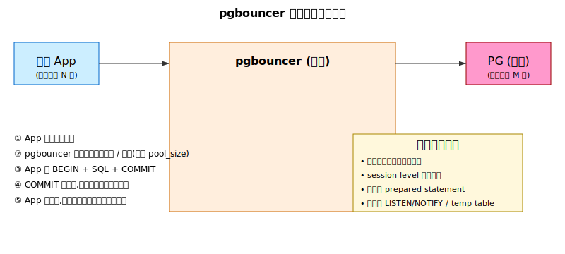

## 1.6 事前优化四：业务优化

业务优化是性价比最高的优化——上面所有环境/参数调优加起来，可能都比不上业务层改一个 SQL。

### 1.6.1 表设计与数据类型

**数据类型原则：用什么存什么**。

| 反例 | 正解 | 原因 |
|---|---|---|
| `VARCHAR(255)` 存手机号 | `CHAR(11)` 或 `VARCHAR(11)` | 索引更小、更快 |
| `VARCHAR(255)` 存 IPv4 | `INET` | 内置函数、网络转换高效 |
| `BIGINT` 存时间戳（毫秒） | `TIMESTAMPTZ` | 时区处理、范围查询、索引效率 |
| `FLOAT` 存金额 | `NUMERIC(15,2)` | 精度不丢 |
| `TEXT` + 拆 JSON 字符串 | `JSONB` | GIN 索引、内置函数 |
| 自增 ID | `UUIDv7` (PG 17+) 或 `BIGSERIAL` | UUIDv7 有序、B-Tree 友好 |

> **顺带提醒一下**：`UUID` 不是免费午餐——16 字节 vs 8 字节让主键索引大 2 倍，B-Tree 高度增加。PG 17 的 `uuidv7()` 解决了有序性，但仍比 `BIGINT` 大。只在分布式 / 跨实例去重场景用 UUID。

### 1.6.2 索引设计

| 索引类型 | 适用 | 注意 |
|---|---|---|
| **B-Tree**（默认） | 等值、范围、排序、`LIKE 'abc%'` | 80% 场景首选 |
| **Hash** | 仅等值（`=`） | PG 10+ WAL logged；`=` 之外的查询用不上 |
| **GIN** | JSONB、数组、全文搜索、trgm | 写慢、读快；高频写需配套高频 vacuum |
| **GiST** | 几何、范围、空间 | 写比 GIN 快、读比 GIN 慢 |
| **BRIN** | 时序数据（按物理顺序） | 极小（10 亿行 ~ 1MB），但依赖物理顺序 |
| **Bloom** (PG 10+) | 多列任意组合 | 假阳性率高，慎用 |
| **Partial Index** | 1% 数据占 99% 查询 | **投入产出比最高的索引** |
| **INCLUDE 索引** (PG 11+) | 覆盖查询，避免回表 | 只存非键列副本 |

**反模式清单**：

1. **每个查询都建索引** → 写性能下降、维护成本高
2. **复合索引列顺序错** → `(a, b)` 与 `(b, a)` 完全不同
3. **长字段建索引** → `VARCHAR(255)` 索引让 B-Tree 高度 +1
4. **冗余索引** → `(a)` 和 `(a, b)` 同时存在，单列查询用 `(a, b)` 就够
5. **死索引不清理** → `pg_stat_user_indexes.idx_scan = 0` 持续 1 个月，考虑 `DROP INDEX CONCURRENTLY`

**死索引识别 SQL**：

```sql
SELECT schemaname||'.'||relname tbl, indexrelname idx,
       pg_size_pretty(pg_relation_size(indexrelid)) size, idx_scan
FROM pg_stat_user_indexes
WHERE idx_scan = 0
ORDER BY pg_relation_size(indexrelid) DESC;
```

### 1.6.3 SQL 书写方式

```sql
-- ❌ 反面 1: SELECT *
SELECT * FROM big_table WHERE id = 1;

-- ✅ 正面: 只查需要的列
SELECT id, name FROM big_table WHERE id = 1;

-- ❌ 反面 2: 函数套列,索引失效
SELECT * FROM t WHERE date(create_time) = '2024-01-01';

-- ✅ 正面: 改写保持索引可用
SELECT * FROM t WHERE create_time >= '2024-01-01' AND create_time < '2024-01-02';

-- ❌ 反面 3: OR 滥用
SELECT * FROM t WHERE a = 1 OR b = 2;

-- ✅ 正面: UNION ALL
SELECT * FROM t WHERE a = 1
UNION ALL
SELECT * FROM t WHERE b = 2;

-- ❌ 反面 4: NOT IN 查子查询
SELECT * FROM t WHERE id NOT IN (SELECT user_id FROM black_list);

-- ✅ 正面: NOT EXISTS
SELECT * FROM t WHERE NOT EXISTS (SELECT 1 FROM black_list WHERE user_id = t.id);
```

**EXPLAIN 解读 6 信号法**（接慢 SQL 第一动作）：

```sql
EXPLAIN (ANALYZE, VERBOSE, BUFFERS, TIMING, COSTS, SETTINGS, FORMAT TEXT)
SELECT ...;
```

读 6 个信号：

1. **`actual time`**：真耗时（首行 / 末行），`loops` 相乘才是真实成本
2. **`rows` vs `actual rows`**：偏差 > 10× → 统计信息失真
3. **`Buffers: shared hit/read`**：read 占比高 → shared_buffers 不够
4. **`loops`**：> 1 多半是 NestLoop 嵌套，cost 数字完全骗人
5. **节点类型**：Seq Scan / Index Scan / Bitmap Heap Scan / Hash Join / Sort
6. **`SETTINGS`**：打印实际生效的优化器参数（如 SSD 上的 `random_page_cost`）

> **必避坑**：**`EXPLAIN ANALYZE` 真的执行 SQL**！对 `INSERT/UPDATE/DELETE` 必须包事务：
> ```sql
> BEGIN;
> EXPLAIN ANALYZE DELETE FROM t WHERE ...;
> ROLLBACK;
> ```

### 1.6.4 事务长短

- **OLTP 事务控制在毫秒级**——长事务 → 锁持有久 → 阻塞别人 → 雪崩
- **`idle in transaction` 是 P0 灾难**：每多活一秒，autovacuum 就多积压一秒
- **大事务分批**：批量 1 万行 / 事务，比 1 行 / 事务快 100 倍（少 1 万次 fsync）

**批量写入 benchmark 参考**（德哥 2018 年测，56 核 ECS + NVMe + PG 10）：

| 模式 | 吞吐 |
|---|---|
| 单行提交 1000 次 | ~1500 行/s |
| 单事务 1000 行 | ~145 万行/s |
| unlogged 表 1000 行/事务 | ~813 万行/s |

> **前置条件**：硬件是 56 核 ECS + NVMe；PG 10；表无索引。
> **证伪**：换你的环境跑 `pgbench -c 56 -j 56 -T 30 -M prepared` 看真实数字。**生产环境请自行测试**。

### 1.6.5 提交模式

| 模式 | 延迟 | 持久性 | 适用 |
|---|---|---|---|
| 同步提交 | 高 | 强（commit = 落盘） | 默认；金融、订单 |
| 异步提交 (`synchronous_commit = off`) | 低（~200ms → ~600ms 区间） | 弱（最多丢 3×wal_writer_delay） | 监控、日志、可容忍少量丢失 |
| 批量提交 | 中 | 强 | ETL、大批量写入 |
| 分组提交（`synchronous_commit = on` + `commit_delay`） | 中 | 强 | 高并发短事务（commit_delay 攒批 fsync） |

### 1.6.6 OFFSET 优化

`LIMIT 20 OFFSET 1000000` 必须扫 100 万 + 20 行——**OFFSET 不是"跳过"，是"排序再扔"** 。

```sql
-- ❌ OFFSET 大就慢
SELECT * FROM t ORDER BY id LIMIT 20 OFFSET 1000000;

-- ✅ Keyset 分页
SELECT * FROM t WHERE id > $last_seen_id ORDER BY id LIMIT 20;
-- 索引 (id) 直接走 Index Scan,不再 OFFSET
```

> **前置条件**：固定排序键 + 应用层记上一页最大 ID。
> **边界**：跨页查询（"跳到第 1000 页"）仍要用 OFFSET——Keyset 不支持随机跳页。

### 1.6.7 分区表

| 方案 | 适用 | 维护成本 |
|---|---|---|
| **业务分区**（应用层按 user_id 路由到不同表） | 极简、跨 PG 版本 | 应用层管 schema 演进 |
| **内置分区**（PG 10+ 声明式分区） | 90% 场景 | `ALTER TABLE ... DETACH/ATTACH`；PG 14+ 分区级 `ATTACH PARTITION` 不阻塞 |

```sql
-- PG 14+ 分区表
CREATE TABLE measurement (
    city_id    int NOT NULL,
    logdate    date NOT NULL,
    peaktemp   int,
    unitsales  int
) PARTITION BY RANGE (logdate);

CREATE TABLE measurement_y2024m01 PARTITION OF measurement
    FOR VALUES FROM ('2024-01-01') TO ('2024-02-01');
```

### 1.6.8 超时设置防雪崩

> **第一性原理**：**没有超时 = 没有雪崩保护**。德哥反复强调："DDL 必须包在事务里设 `lock_timeout`，否则一次 ADD COLUMN 就能把整库卡住"。

```sql
-- DDL 包事务 + lock_timeout
BEGIN;
SET LOCAL lock_timeout = '100ms';
ALTER TABLE big_table ADD COLUMN new_col int;
COMMIT;

-- 用户级超时
SET statement_timeout = '30s';
SET lock_timeout = '5s';
SET idle_in_transaction_session_timeout = '10min';
-- 全局: postgresql.conf 配 default_transaction_*
```

## 1.7 事后优化一：擒贼先擒王

> 顺带提醒一下：**擒贼先擒王适用于已经定位到 PG 内、SQL 占比 > 50% 的场景**。如果报警来自连接池打满、JVM Full GC、上游阻塞，TOP SQL 反而会因为请求堆积而**总耗时虚高**——盯着 SQL 改没用，根因在 APP 层。

**抓 TOP SQL**：

```sql
SELECT round(total_exec_time::numeric, 2) total_ms,
       calls,
       round(mean_exec_time::numeric, 2) mean_ms,
       rows,
       shared_blks_hit + shared_blks_read AS blks,
       query
FROM pg_stat_statements
ORDER BY total_exec_time DESC LIMIT 10;
```

**擒贼后怎么改**：先看 EXPLAIN（见 1.6.3 七步法），再决定：

| 现象 | 改法 |
|---|---|
| `rows` 估算偏差 > 10× | `ANALYZE 表名;` 或扩展统计 |
| Seq Scan on 大表 | 加索引或改写 SQL |
| Hash Join Batches > 1 | `SET work_mem = '256MB'` 看是否回 1 |
| Bitmap Heap Scan `Rows Removed by Filter` 大 | 索引选错列，加更精准的索引 |
| NestLoop loops 大（> 1000）| 改 Hash Join 或换驱动表 |

**5 大 Planner 失准场景**：

| 场景 | 表现 | 对策 |
|---|---|---|
| 数据倾斜 | rows 估算严重偏高 | 扩展统计 `CREATE STATISTICS ON a,b FROM t` |
| bulk load 后没 ANALYZE | 全 Seq Scan | `COPY WITH (FREEZE)` + 立即 `ANALYZE` |
| 长时间小批量写入 | 统计陈旧 | `autovacuum_analyze_scale_factor = 0.025` |
| 关联列无统计 | rows 估算为乘积 | `CREATE STATISTICS ON a,b FROM t` |
| 数据分布随时间漂移 | 老统计不反映新常态 | 周期性 `ANALYZE` 或 cron |

## 1.8 事后优化二：高级锁等待优化

```sql
-- 找阻塞链(PG 9.6+)
SELECT pid, pg_blocking_pids(pid) blocked_by,
       wait_event_type, wait_event, query
FROM pg_stat_activity
WHERE wait_event_type = 'Lock';
```

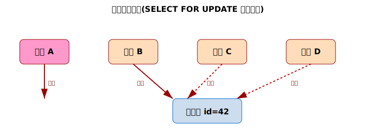

**秒杀场景的 80 倍性能差距**（单行并发更新）：

| 方案 | TPS |
|---|---|
| 未优化 `UPDATE ... WHERE id=?` | 2,855 |
| `nowait` 优化 | 66,630 |
| `pg_try_advisory_xact_lock(id)` 优化 | 231,376 |

```sql
UPDATE t SET x = x + 1
WHERE id = ? AND pg_try_advisory_xact_lock(id)
RETURNING *;
```

> **前置条件**：必须配合"先查再写"的两阶段模式，锁粒度 = 单条记录 id。
> **边界**：若 `pg_stat_activity` 看到大量 `LockWait`，说明冲突超出 AD Lock 缓解能力，必须分片/排队/异步化。

**批量任务用 `SKIP LOCKED`**（PG 9.5+）：

```sql
-- 队列 worker 抢任务,不互相阻塞
SELECT * FROM task_queue
WHERE status = 'pending'
ORDER BY id LIMIT 1
FOR UPDATE SKIP LOCKED;
```

## 1.9 事后优化三：等待事件分析

PG 9.6+ 的 `wait_event` 体系（**9 大类**：Activity、BufferPin、Client、Extension、IO、IPC、Lock、LWLock、Timeout）是定位瓶颈的最强武器：

```sql
SELECT wait_event_type, wait_event, count(*)
FROM pg_stat_activity
WHERE wait_event IS NOT NULL
GROUP BY 1, 2 ORDER BY count(*) DESC;
```

| wait_event 主导 | 第一动作 | 第二动作 |
|---|---|---|
| `IO:DataFileRead` | `iostat -x 1`，看 `r_await > 10ms` | `pg_prewarm` 热点数据或换 SSD |
| `IO:WALWrite` | `iostat -x` 看 `w_await` | 主备复制延迟？同步复制降级异步 |
| `IO:ControlFileSync` | checkpoint 风暴？ | `checkpoint_completion_target = 0.9` |
| `LWLock:buffer_mapping` | `shared_buffers` 设太大（> RAM 25%） | 调小 / 升级 PG 16+（8 分区优化） |
| `LWLock:lock_manager` | 单实例连接数 > 500 | 上 pgbouncer |
| `Lock:transactionid` | 看 `pg_blocking_pids` | 应用层事务顺序不一致 |
| `Lock:tuple` | 看具体 SQL + blocking | 用 `SKIP LOCKED` 改写 |

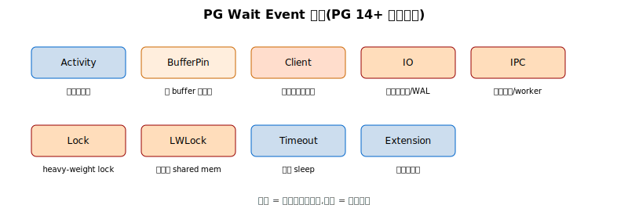

> **前置条件**：`track_activities = on`、`track_io_timing = on`、`compute_query_id = on`（PG 13+ 默认）。

## 1.10 事后优化四：隐患问题

| 隐患 | 检测 | 危害 | 治理 |
|---|---|---|---|
| **慢 SQL** | `pg_stat_statements` mean > 100ms | 雪崩 | 擒贼擒王 |
| **长事务** | `pg_stat_activity.xact_start` > 30min | 阻 vacuum → 膨胀 → 雪崩 | 杀 + `idle_in_transaction_session_timeout` |
| **长 2PC** | `pg_prepared_xacts.prepared` > 1h | 阻 vacuum + 锁堆积 | `ROLLBACK PREPARED` |
| **全库逻辑备份** | 备份期间 `pg_dump` 长跑 | 备份时长事务阻 vacuum | 物理备份（`pg_basebackup`）+ 增量 |
| **慢/异常 Slot** | `pg_replication_slots.xmin` 不前进 | 主库 WAL 堆积撑爆磁盘 | `pg_recvlogical` 修消费端 |
| **`hot_standby_feedback = on`** | 备机最长事务反馈给主库 | WAL 不能回收 | 生产推荐 `off`，业务容忍延迟用 `off` + 应用重试 |

## 1.11 事后优化五：膨胀处理

### 1.11.1 机制

MVCC 让 UPDATE 产生新版本、DELETE 产生 dead tuple，**这些必须等 vacuum 才能回收**。vacuum 跟不上节奏（7 条原因）：

1. `autovacuum = off`
2. `autovacuum_vacuum_scale_factor = 0.2`（默认太大）
3. `autovacuum_naptime` 太大
4. `autovacuum_vacuum_cost_delay` 太大（vacuum 跑得太斯文）
5. `autovacuum_max_workers` 太少
6. `maintenance_work_mem` 太小
7. 长事务 / 长 2PC / 慢 slot / `hot_standby_feedback` 挡 vacuum

### 1.11.2 B-Tree 索引膨胀的硬伤

**B-Tree 不释放空间，只 REUSE**。DELETE 后索引项变 dead tuple，vacuum 标 dead 加入 FSM，新 INSERT 复用 dead slot；**如果长期没有 INSERT，永远不释放物理空间**——只有 REINDEX 才能回收。

```sql
-- PG 12+ 不阻塞写
REINDEX INDEX CONCURRENTLY idx_t_id;
REINDEX TABLE CONCURRENTLY t;  -- PG 14+

-- 老版本必须停写
REINDEX INDEX idx_t_id;
```

### 1.11.3 治理步骤

```sql
-- 1. 找膨胀表
SELECT schemaname||'.'||relname tbl,
       pg_size_pretty(pg_total_relation_size(oid)) total_size,
       n_live_tup, n_dead_tup,
       round(100.0 * n_dead_tup / NULLIF(n_live_tup, 0), 2) dead_pct
FROM pg_stat_user_tables
WHERE n_dead_tup > 10000
ORDER BY n_dead_tup DESC LIMIT 20;

-- 2. 找膨胀索引
SELECT * FROM pgstattuple('idx_t_id');  -- 看 dead_tuple_percent

-- 3. 紧急止血
VACUUM (VERBOSE, ANALYZE) bloated_table;
VACUUM (INDEX_CLEANUP ON) bloated_table;
-- PG 13+ 可手动:
VACUUM (INDEX_CLEANUP ON, TRUNCATE ON) bloated_table;
```

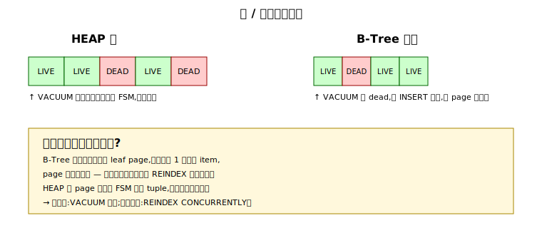

## 1.12 事后优化六：事务冻结隐患

32-bit 事务 ID 最多 2^32 ≈ 43 亿，PG 设计为循环使用。当 `relfrozenxid` 距回卷点 < 200,000,000（`autovacuum_freeze_max_age`）时，autovacuum 强制 freeze。

```sql
-- 看事务年龄(任一库 > 2 亿报警,> 15 亿紧急)
SELECT datname, age(datfrozenxid) FROM pg_database ORDER BY 2 DESC;
```

**xid 回卷后数据库进入保护模式：拒绝写入，只允许 VACUUM**。这是著名的"PG 库变只读"事故。

**治理**：

1. 平时就保持 `autovacuum_freeze_max_age = 200000000`（默认不要改）
2. 大表单独配 `ALTER TABLE t SET (autovacuum_freeze_max_age = 500000000);`（大表全表 freeze 太重）
3. 紧急时手动 `VACUUM FREEZE` 指定库：`VACUUM FREEZE VERBOSE pg_catalog.pg_class;`
4. **绝对不要**在生产用 `pg_resetwal` 等"清零"工具——会破坏一致性

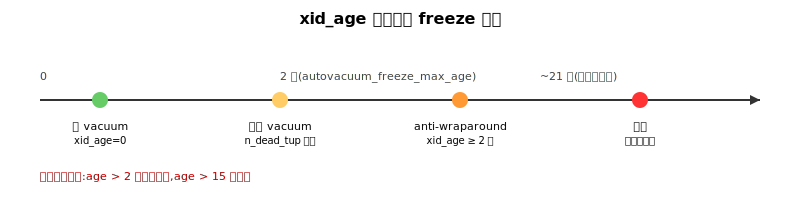

## 1.13 优化速记卡

```
【事前 4 件套】
  环境: SSD 4K 对齐 + xfs + IO 调度器 none/mq-deadline + HugePage
  参数: shared_buffers = RAM×1/4 + work_mem + autovacuum_scale_factor = 0.05
  连接池: pgbouncer transaction 模式 + 前后端 50:1~100:1
  业务: 类型精准 + Keyset 分页 + 事务短 + 超时设置

【事后 4 件套】
  擒贼擒王: pg_stat_statements TOP 5 + EXPLAIN 七步法
  锁: pg_blocking_pids + AD Lock 秒杀
  等待事件: wait_event 9 大类分布
  隐患: 长事务 / 长 2PC / 慢 slot / 膨胀 / 冻结

【必杀参数】
  random_page_cost = 1.1(本地 SSD)/ 1.0(NVMe)/ 1.5(云盘)
  checkpoint_completion_target = 0.9
  autovacuum_max_workers = 8
  autovacuum_vacuum_scale_factor = 0.05
  autovacuum_vacuum_cost_delay = 10ms

【保命查询】
  SELECT age(datfrozenxid) FROM pg_database ORDER BY 2 DESC;
  -- 任一 > 2 亿立即处理
```

---

# 二、PostgreSQL 监控

监控是"看见"的能力。PG 自带统计视图超过 100 个（`pg_stat_*`、`pg_statio_*`），但生产中真正能稳定报警的不超过 20 个。这一章教你**第一刀砍哪儿**。

## 2.1 分层监控架构：先分层，再下钻

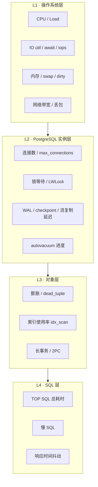
```mermaid
flowchart TB
    subgraph L1["L1 · 操作系统层"]
        O1[CPU / Load]
        O2[IO util / await / iops]
        O3[内存 / swap / dirty]
        O4[网络带宽 / 丢包]
    end
    subgraph L2["L2 · PostgreSQL 实例层"]
        D1[连接数 / max_connections]
        D2[锁等待 / LWLock]
        D3[WAL / checkpoint / 流复制延迟]
        D4[autovacuum 进度]
    end
    subgraph L3["L3 · 对象层"]
        T1[膨胀 / dead_tuple]
        T2[索引使用率 idx_scan]
        T3[长事务 / 2PC]
    end
    subgraph L4["L4 · SQL 层"]
        S1[TOP SQL 总耗时]
        S2[慢 SQL]
        S3[响应时间抖动]
    end
    L1 --> L2 --> L3 --> L4
```

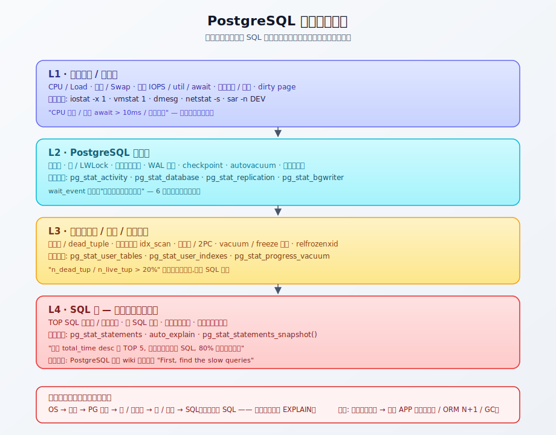

**核心观点**：**SQL 层优先 + 漏斗排查补充**。PG 官方 wiki 第一句就是"First, find the slow queries using pg_stat_statements"——这是 PG 社区的共识。但 ORM N+1 / OFFSET 分页 / 全表扫等纯 SQL 问题一上来就在 SQL 层，而连接池打满 / JVM Full GC / 上游阻塞等 APP 层问题需要从 L1 开始排查。**正确的顺序是：先用 `pg_stat_statements` 擒贼擒王（命中大多数场景），再按 OS / 长事务 / 2PC 漏斗排查（命中突发场景）** 。

> 顺带提醒一下：很多人爱说"数据库慢 90% 不在 SQL 层"——这话听起来很爽，但事实是：**SQL 层问题确实占大多数生产事故**，只是剩下的少数很棘手而已。先 SQL 再漏斗，别被这句话忽悠得漏掉 TOP SQL。

## 2.2 必开的 5 个统计开关

任何一个没开，后续视图就是空的：

```ini
track_activities = on          # pg_stat_activity 才能拿到会话
track_counts     = on          # pg_stat_*_tables、pg_stat_database 累计计数器
track_io_timing  = on          # blk_read_time、pg_stat_statements 的 IO 时间
track_functions  = 'all'       # pg_stat_user_functions
compute_query_id = on          # PG 13+ 默认 on;pg_stat_activity.query_id 桥梁
```

**半必开的 3 个日志开关**：

```ini
log_lock_waits = on
log_temp_files = 0              # 0 = 全部记录
log_min_duration_statement = 3s # 见 1.4.4
```

改完 `SELECT pg_reload_conf();` 生效。

## 2.3 pg_stat_statements：擒贼擒王的瑞士军刀

### 2.3.1 安装

```ini
# postgresql.conf
shared_preload_libraries = 'pg_stat_statements,auto_explain'
pg_stat_statements.max = 10000
pg_stat_statements.track = top
pg_stat_statements.track_utility = on
pg_stat_statements.track_planning = on  # PG 13+
pg_stat_statements.save = on            # PG 14+
```

```sql
CREATE EXTENSION pg_stat_statements;
```

> **前置条件**：必须加到 `shared_preload_libraries` 才能跨 session 全局生效。
> **边界**：旧版本 `track_planning` / `save` 不存在，跳过即可。

### 2.3.2 关键字段

| 字段 | 含义 |
|---|---|
| `queryid` | 查询指纹（PG 13+） |
| `query` | 归一化后的 SQL |
| `calls` | 调用次数 |
| `total_exec_time` | 总执行时间（PG 13+ 字段名） |
| `mean_exec_time` | 平均执行时间 |
| `rows` | 总返回行数 |
| `shared_blks_hit/read` | 共享缓存命中/落盘 |

> **关于 `queryid`**：在同一 major 版本内 + 同一 SQL 文本（规范化后）稳定；PG 大版本升级（14→15、16→17）会因 `pg_stat_statements` 内部算法微调而变化——**不能说"跨实例"稳定**。

### 2.3.3 perf insight：快照与趋势分析

PG 内置 `pg_stat_statements_snapshot()`（PG 14+）做手动快照；最实用的做法是**外部定时器 + 历史表 + 趋势 SQL**：

```sql
-- 创建历史表
CREATE TABLE pg_stat_statements_history (
    snap_ts    timestamptz DEFAULT now(),
    queryid    bigint,
    query      text,
    calls      bigint,
    total_exec_time double precision,
    rows       bigint,
    shared_blks_hit bigint,
    shared_blks_read bigint
);

-- 定时(每分钟)插快照
INSERT INTO pg_stat_statements_history
SELECT now(), queryid, query, calls, total_exec_time, rows,
       shared_blks_hit, shared_blks_read
FROM pg_stat_statements
WHERE calls > 0;

-- 7 天 TOP SQL 趋势
SELECT date_trunc('hour', snap_ts) hr,
       query,
       sum(calls) total_calls,
       sum(total_exec_time) total_ms
FROM pg_stat_statements_history
WHERE snap_ts > now() - interval '7 days'
GROUP BY 1, 2
ORDER BY total_ms DESC LIMIT 20;
```

> **前置条件**：部署 cron job 或 pg_cron 调度快照。
> **边界**：单纯靠 `pg_stat_statements` 没有外部快照就没有趋势——这是新手最常踩的坑。

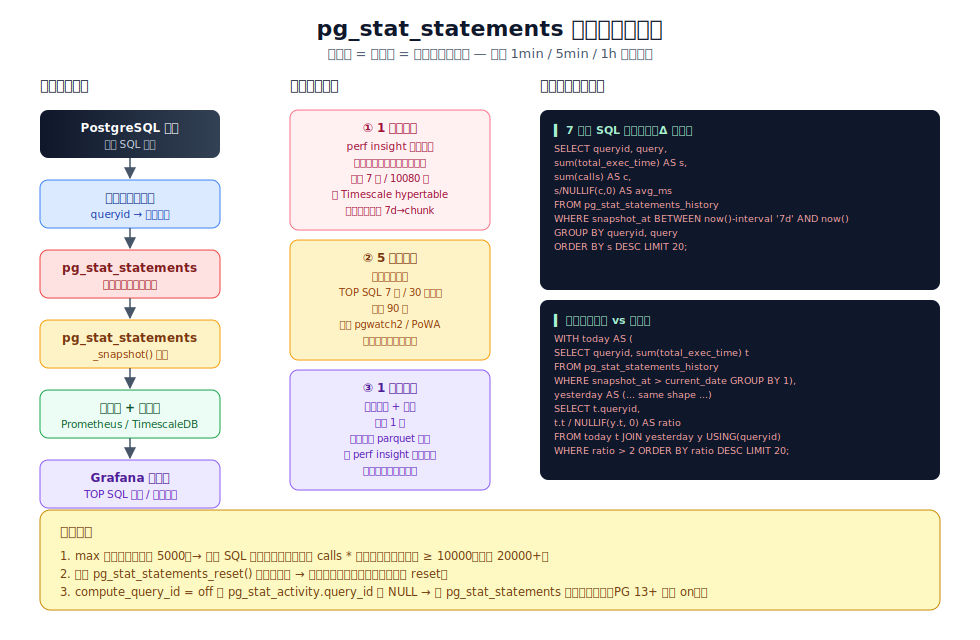

### 2.3.4 擒贼擒王 SQL

```sql
SELECT round(total_exec_time::numeric, 2) total_ms,
       calls,
       round(mean_exec_time::numeric, 2) mean_ms,
       rows,
       shared_blks_hit + shared_blks_read AS blks,
       query
FROM pg_stat_statements
ORDER BY total_exec_time DESC LIMIT 10;
```

## 2.4 Wait Event 体系：2026 时代最强诊断武器

PG 9.6 起 `wait_event` 体系出现，PG 10 完善，PG 14+ 增加了 IO 类型的细分（`DataFileRead`、`WALWrite` 等），定位更精准。

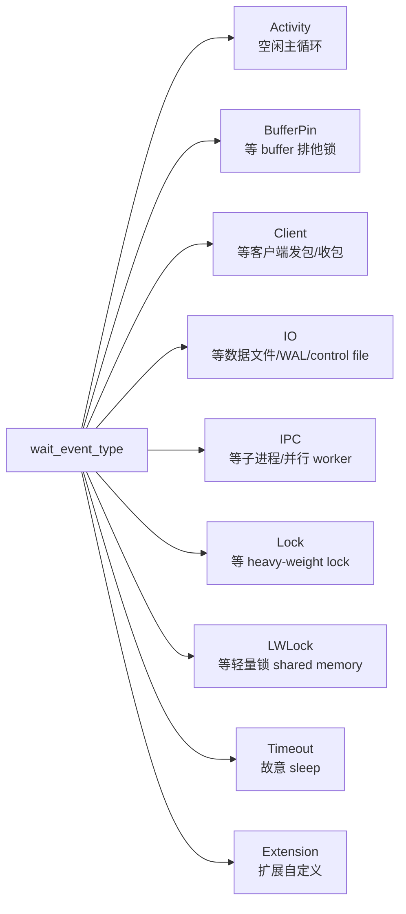
```mermaid
flowchart LR
    W[wait_event_type] --> A[Activity<br/>空闲主循环]
    W --> B[BufferPin<br/>等 buffer 排他锁]
    W --> C[Client<br/>等客户端发包/收包]
    W --> D[IO<br/>等数据文件/WAL/control file]
    W --> E[IPC<br/>等子进程/并行 worker]
    W --> F[Lock<br/>等 heavy-weight lock]
    W --> G[LWLock<br/>等轻量锁 shared memory]
    W --> H[Timeout<br/>故意 sleep]
    W --> I[Extension<br/>扩展自定义]
```

**第一性原理**：`wait_event` 告诉你"这一刻这个 backend 为什么不在跑"。

| wait_event 主导 | 第一动作 | 第二动作 |
|---|---|---|
| `IO:DataFileRead` | `iostat -x 1`，看 `r_await > 10ms` | `pg_prewarm` 热点数据或换 SSD |
| `IO:WALWrite` | `iostat -x` 看 `w_await` | 主备复制延迟？同步复制降级异步 |
| `IO:ControlFileSync` | checkpoint 风暴？ | `checkpoint_completion_target = 0.9` |
| `LWLock:buffer_mapping` | `shared_buffers` 设太大（> RAM 25%） | 调小 / 升级 PG 16+（8 分区优化） |
| `LWLock:lock_manager` | 单实例连接数 > 500 | 上 pgbouncer |
| `Lock:transactionid` | 看 `pg_blocking_pids` | 应用层事务顺序不一致 |
| `Lock:tuple` | 看具体 SQL + blocking | 用 `SKIP LOCKED` 改写 |

> **适用边界**：若 `state=active` 且 `wait_event IS NULL`，在 PG 14+ 说明它在 CPU 上跑（大排序/哈希聚合），用 `perf top -p <pid>` 看是不是 CPU bound。

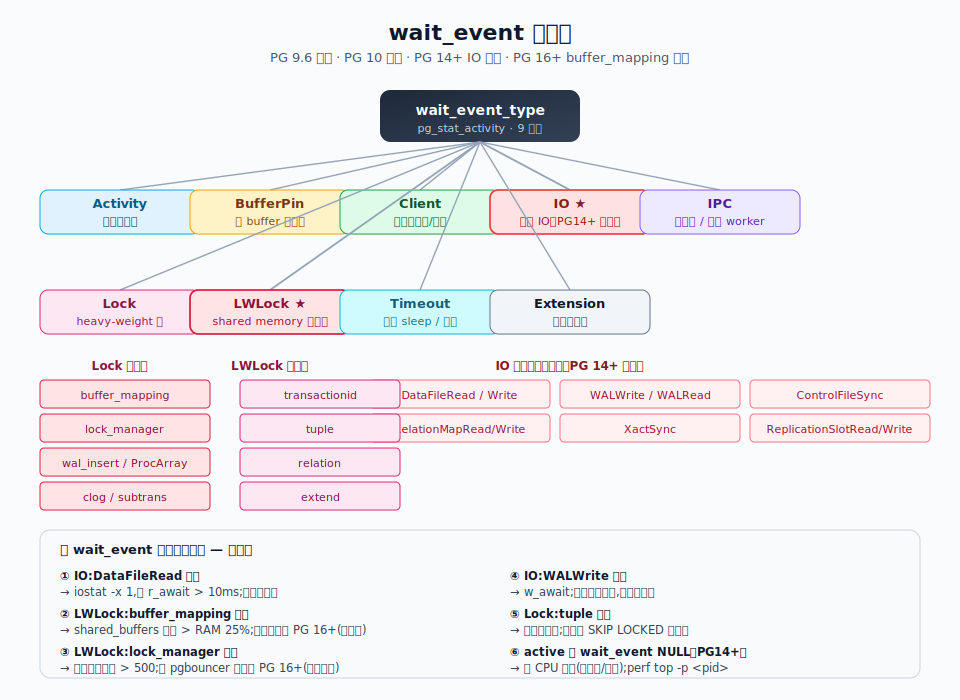

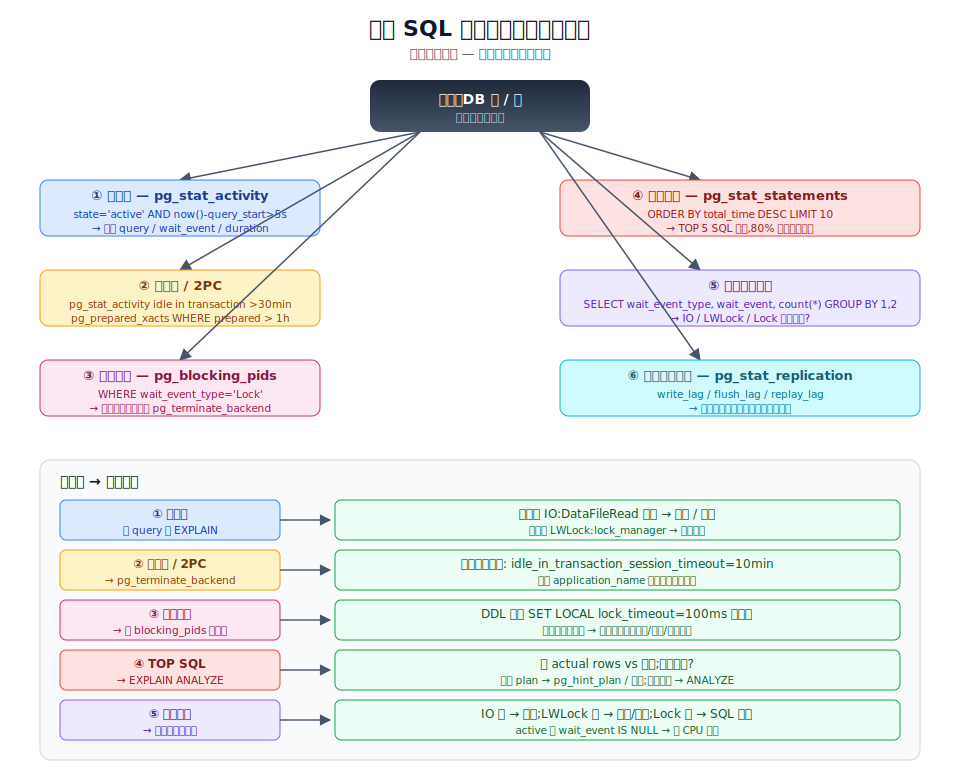

## 2.5 auto_explain：自动捕获慢 SQL

`auto_explain` 是 PG 自带模块，可把超过阈值的 SQL 的执行计划自动落盘。

```ini
shared_preload_libraries = 'auto_explain,pg_stat_statements'

auto_explain.log_min_duration = '3s'
auto_explain.log_analyze      = on
auto_explain.log_buffers      = on
auto_explain.log_format       = 'json'  # PG 10+ JSON 便于 ELK 解析
auto_explain.log_timing       = on
auto_explain.log_verbose      = on
auto_explain.sample_rate      = 1
```

> **前置条件**：必须加载到 `shared_preload_libraries` 才能跨 session 全局生效。
> **大流量场景（> 5000 QPS）必须抽样**——`sample_rate=0.01~0.1`，0.1% 抽样就够定位了，全量 EXPLAIN ANALYZE 会让 CPU 翻倍。

> 顺带提醒一下：**`log_min_duration = 3s` + `sample_rate = 0.01` 的组合有盲区**——一个平时 0.5 秒、发生事故时偶然跑到 4 秒的致命 SQL 可能一条都采不到。生产里建议 `log_min_duration = 1s` + `sample_rate = 0.05` 起跳，并配合 `pg_stat_statements` 短期快照（见 2.3.3）双轨。

## 2.6 6 张最常用视图速查

| 视图 | 一句话作用 | 关键字段 |
|---|---|---|
| `pg_stat_activity` | 当前所有会话 | `state`、`wait_event_type`、`wait_event`、`query_start`、`xact_start`、`pid` |
| `pg_stat_database` | 数据库级累计统计 | `numbackends`、`xact_commit`、`xact_rollback`、`blks_hit`、`blks_read`、`deadlocks`、`temp_bytes` |
| `pg_stat_user_tables` | 用户表 DML / 扫描统计 | `seq_scan`、`idx_scan`、`n_live_tup`、`n_dead_tup`、`n_mod_since_analyze` |
| `pg_stat_user_indexes` | 索引使用次数 | `idx_scan`、`idx_tup_read`、`idx_tup_fetch` |
| `pg_statio_user_tables` | 表/索引/toast 磁盘 IO | `heap_blks_hit/read`、`idx_blks_hit/read`、`toast_blks_hit/read` |
| `pg_stat_replication` | 主备流复制状态 | `state`、`sent_lsn`、`replay_lsn`、`write_lag`、`flush_lag`、`replay_lag` |

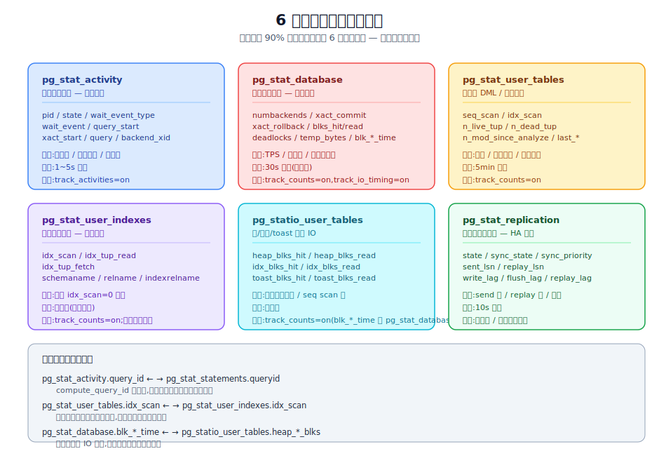

## 2.7 实战监控 SQL：10 条救命级

### 2.7.1 运行中慢 SQL

```sql
SELECT pid, usename, now() - query_start AS duration,
       state, wait_event_type, wait_event, query
FROM pg_stat_activity
WHERE state = 'active'
  AND now() - query_start > interval '5s';
```

### 2.7.2 长事务

```sql
SELECT pid, usename, now() - xact_start AS xact_age, query
FROM pg_stat_activity
WHERE state IN ('active','idle in transaction')
  AND now() - xact_start > interval '30min';
```

### 2.7.3 长空闲事务（阻 autovacuum 的真凶）

```sql
SELECT pid, usename, now() - state_change AS idle_age, query
FROM pg_stat_activity
WHERE state IN ('idle in transaction','idle in transaction (aborted)')
  AND now() - state_change > interval '10min';
```

### 2.7.4 长 2PC

```sql
SELECT gid, prepared, owner, database
FROM pg_prepared_xacts
WHERE now() - prepared > interval '1h';
```

### 2.7.5 谁在堵谁（`pg_blocking_pids` PG 9.6+）

```sql
SELECT pid, pg_blocking_pids(pid) AS blocked_by,
       wait_event_type, wait_event, query
FROM pg_stat_activity
WHERE wait_event_type = 'Lock';
```

### 2.7.6 等待事件分布

```sql
SELECT wait_event_type, wait_event, count(*)
FROM pg_stat_activity
WHERE wait_event IS NOT NULL
GROUP BY 1, 2 ORDER BY count(*) DESC;
```

### 2.7.7 vacuum 进度（PG 9.6+）

```sql
SELECT pid, datname, relid::regclass, phase,
       heap_blks_total, heap_blks_scanned, heap_blks_vacuumed
FROM pg_stat_progress_vacuum;
```

### 2.7.8 checkpoint 频率（PG 17+ 改用 `pg_stat_checkpointer`）

```sql
SELECT * FROM pg_stat_bgwriter;
-- checkpoints_req 远多于 checkpoints_timed → 雪崩式 checkpoint, 调整 max_wal_size
```

### 2.7.9 复制延迟（`write_lag/flush_lag/replay_lag` PG 10+）

```sql
SELECT pid, state, sync_state,
       (sent_lsn - replay_lsn) AS replay_lag_bytes,
       write_lag, flush_lag, replay_lag
FROM pg_stat_replication;
```

### 2.7.10 数据库总览 + 事务年龄

```sql
SELECT datname, numbackends AS conns,
       xact_commit AS commits, xact_rollback AS rollbacks,
       round(100.0 * xact_rollback / NULLIF(xact_commit+xact_rollback, 0), 2) AS rollback_pct,
       round(100.0 * blks_hit / NULLIF(blks_hit+blks_read, 0), 2) AS cache_hit_pct,
       deadlocks, temp_bytes, blk_read_time, blk_write_time,
       age(datfrozenxid) AS xid_age
FROM pg_stat_database
WHERE datname NOT IN ('template0','template1','postgres');
```

**阈值经验值**：

| 指标 | 健康 | 异常 |
|---|---|---|
| TPS 突降 50% 或突增 3 倍 | 业务基线 ±20% | 突降→看 wait_event；突增→看 temp_bytes |
| 回滚率 | < 1% | > 5% 持续 → 应用层 BUG |
| 连接使用率 | < 70% | > 80% → 拒连风险 |
| 死锁次数 | 0 | > 0/min → 看 `log_lock_waits` |
| 临时文件 | 短期 0 | 单查询 > 1GB → `work_mem` 不够 |
| 块 IO 时间 | < 100ms/query | > 1000ms/query → 物理 IO 瓶颈 |
| 缓存命中率 | 看趋势 | OLTP 95~98% 长期稳 |

> 顺带提醒一下：PG 官方 wiki 明确说过"不要把缓存命中率当作性能的唯一指标"——它**作为趋势指标**最有用（稳定 99% 突然掉到 80% = 热点被踢出 buffer），作为硬阈值最容易误导。

## 2.8 外部监控生态

| 工具 | 定位 | 适用场景 | 维护状态 |
|---|---|---|---|
| **Prometheus + pg_exporter** | pull 式、PromQL、告警灵活 | 云原生主流方案，适配 Grafana | 活跃 |
| **pgwatch2** | 自动化指标采集 + Grafana | 开箱即用，适合小团队 | 活跃 |
| **PoWA** | PostgreSQL Workload Analyzer | 历史回溯、TOP SQL 分析最强 | 活跃 |
| **pgmetrics** | 单文件可执行，产出健康报告 | 轻量级体检、邮件报告 | 活跃 |
| **pgBadger** | 解析 `pg_log`，产出 HTML 报告 | 偏日志分析，适合 DBA 巡检 | 活跃 |
| **PipelineDB** | 流计算把 distinct 推到写入侧 | **已停止维护**，不建议新上 | 停更 |

> **选型建议**：> 5 实例用 Prometheus + pg_exporter；< 5 实例用 pgwatch2；想 TOP SQL 历史回溯就 PoWA；个人开发机体检用 pgmetrics。

## 2.9 监控速记卡

```
【5 个必开开关】
  track_activities = on
  track_counts     = on
  track_io_timing  = on
  track_functions  = 'all'
  compute_query_id = on

【擒贼擒王】
  pg_stat_statements ORDER BY total_exec_time DESC LIMIT 10

【3 个救命查询】
  1. 运行中慢 SQL: pg_stat_activity + state='active' AND query_start > 5s
  2. 长事务: pg_stat_activity + xact_start > 30min
  3. 谁锁了谁: pg_blocking_pids(pid) (PG 9.6+)

【wait_event 速查】
  IO:DataFileRead → 物理 IO 瓶颈
  LWLock:buffer_mapping → shared_buffers 太大
  LWLock:lock_manager → 连接太多
  Lock:tuple → 行锁竞争
```

---

# 三、PostgreSQL 故障诊断

这一章是"救火篇"——读者读完应该能在报警响起的 5 分钟内走完排查漏斗、定位到根因、给出止血动作。

## 3.1 分层定位漏斗：任何报警先分层

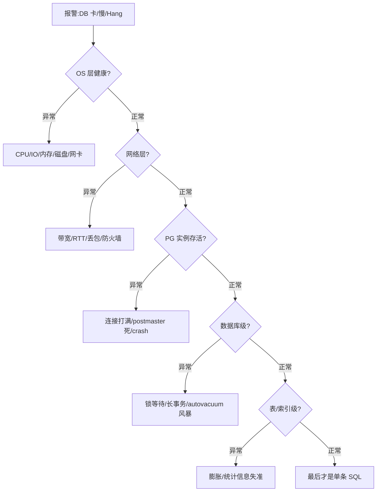
```mermaid
flowchart TB
    A[报警:DB 卡/慢/Hang] --> B{OS 层健康?}
    B -- 异常 --> B1[CPU/IO/内存/磁盘/网卡]
    B -- 正常 --> C{网络层?}
    C -- 异常 --> C1[带宽/RTT/丢包/防火墙]
    C -- 正常 --> D{PG 实例存活?}
    D -- 异常 --> D1[连接打满/postmaster 死/crash]
    D -- 正常 --> E{数据库级?}
    E -- 异常 --> E1[锁等待/长事务/autovacuum 风暴]
    E -- 正常 --> F{表/索引级?}
    F -- 异常 --> F1[膨胀/统计信息失准]
    F -- 正常 --> G[最后才是单条 SQL]
```

> **适用边界**：本地单实例 PG 适用；托管 RDS 上 OS/网络层由云厂负责，只能拿到 PG 层指标，换思路。
> **证伪**：OS、PG 实例、锁、autovacuum 都没事，但业务还在慢——不是 DB 层的锅，去查 APP 层（连接池、ORM、GC、上下游）。

## 3.2 三个核心查询（救命级，先收藏）

```sql
-- (1) 谁在跑
SELECT pid, now() - query_start AS duration, state, wait_event_type, wait_event, query
  FROM pg_stat_activity
 WHERE now() - query_start > interval '5s' AND state = 'active';

-- (2) 谁在等(长事务 / 空闲事务 / 2PC)
SELECT pid, state, now() - xact_start AS xact_age, query
  FROM pg_stat_activity
 WHERE state IN ('idle in transaction', 'idle in transaction (aborted)')
   AND now() - xact_start > interval '30min';
SELECT * FROM pg_prepared_xacts WHERE now() - prepared > interval '1h';

-- (3) 谁锁了谁
SELECT pid, pg_blocking_pids(pid) AS blocked_by, wait_event_type, wait_event, query
  FROM pg_stat_activity
 WHERE wait_event_type = 'Lock';
```

## 3.3 慢 SQL 排查七步法

从现象到根因，严格按顺序：

1. **抓样本**：`pg_stat_statements order by total_time desc limit 10`——擒贼擒王
2. **看类型**：Seq Scan / NestLoop / Hash Join / Sort 每种怀疑方向不同
3. **看估算 vs 实际**：`rows=` 偏差几个数量级 → `ANALYZE`
4. **看 buffer**：`shared hit` 高 = 内存友好；`read` 高 = 物理 IO 大
5. **看 actual time**：两个时间分别表示"首行返回"和"全部返回"
6. **看 SETTINGS**：`EXPLAIN (..., SETTINGS, ...)` 打印优化器参数
7. **看 filter / recheck**：`Removed by Filter` 多 = 索引选错列

> **证伪**：七步都查完，plan 也对，buffer 也合理，但还是慢 → 那就是 PG 之外的瓶颈（网络、应用、连接池），不要继续钻 SQL。

## 3.4 长事务 / 死锁 / 锁等待诊断与止血

### 3.4.1 止血三件套

```sql
-- 杀会话（强制）
SELECT pg_terminate_backend(pid) FROM pg_stat_activity
 WHERE now() - query_start >= interval '10s' AND pid <> pg_backend_pid();

-- 只杀当前 query（更安全）
SELECT pg_cancel_backend(pid) FROM pg_stat_activity WHERE ...;
```

### 3.4.2 预防参数

```ini
statement_timeout = '30s'
lock_timeout = '5s'
deadlock_timeout = '1s'
idle_in_transaction_session_timeout = '10min'
idle_session_timeout = '1h'      # PG 14+
```

```sql
-- DDL 加超时（防雪崩）
BEGIN; SET LOCAL lock_timeout='100ms'; ALTER TABLE ...; COMMIT;
```

> 凡事要辩证的看：**长事务确实是 PG 高频灾难源之一**，但 replication slot 误删、磁盘满、连接打满等灾难跟长事务无关，不要把所有生产事故都往长事务上套。

## 3.5 WAL / 流复制延迟排错

### 3.5.1 先分清是 send 慢还是 replay 慢

```sql
-- 主库看 send 队列
SELECT client_addr, state, sent_lsn, replay_lsn,
       (sent_lsn - replay_lsn) AS byte_lag
  FROM pg_stat_replication;

-- 备库看 replay 进度
SELECT pg_last_wal_replay_lsn(), pg_last_wal_receive_lsn();
```

### 3.5.2 四段拆解

| 阶段 | 含义 | 根因 |
|---|---|---|
| `send_lag` | primary → standby 网络 | primary 写网卡速率 / 带宽 |
| `flush_lag` | standby flush WAL | 备盘 IO；`synchronous_commit=on` 强制 fsync |
| `replay_lag` | standby replay WAL | 长事务回放累积；并行回放 worker |
| `xmin horizon` | logical slot 卡死 | 备机长事务 + `hot_standby_feedback` |

**第一性原理**：`send` 是"网络问题"，`replay` 是"备机执行能力问题"，`xmin` 不前进是"全局被事务卡住"问题——**这三件事要分开看**。

> **证伪**：把 `hot_standby_feedback` 暂时关掉，延迟立刻消失 → 锁定是 feedback 导致的卡死。

## 3.6 突发 IO/CPU 但与业务无关

报警响了，但 TOP SQL 没什么变化，CPU/IO 就是高——答案几乎都在 PostgreSQL 后台进程三件套：**autovacuum + checkpoint + bgwriter**。

### 3.6.1 autovacuum 风暴

```sql
-- 1. autovacuum worker 在不在
SELECT pid, datname, relid::regclass, phase,
       heap_blks_total, heap_blks_scanned, heap_blks_vacuumed
  FROM pg_stat_progress_vacuum;

-- 2. freeze 风暴:看最老 xid 距 wraparound 还有多远
SELECT datname, age(datfrozenxid) FROM pg_database ORDER BY 2 DESC;
-- 任一 > 200,000,000 触发 anti-wraparound vacuum
```

**第一性原理**：`autovacuum_freeze_max_age = 200,000,000` 是 PG 硬编码的"事务回卷防线"——一旦某库最老 xid 跨过这个值，系统强制对该库所有表做 anti-wraparound vacuum。这是"为什么突然很卡"的最大单一原因。

> **证伪**：把 autovacuum 临时关掉，IO 立刻降 → 锁定是 autovacuum；否则转向 checkpoint 或业务 SQL。

### 3.6.2 checkpoint 风暴

```sql
SELECT * FROM pg_stat_bgwriter;
-- checkpoints_req 远多于 checkpoints_timed → 雪崩式 checkpoint
```

```ini
# 缓解
max_wal_size = 16GB            # 增大软上限
checkpoint_timeout = 30min     # 延长间隔
checkpoint_completion_target = 0.9  # 拉长 checkpoint, 把 IO 摊平
bgwriter_lru_maxpages = 1000   # 让 bgwriter 多刷
bgwriter_delay = 50ms
```

> **关于 `checkpoint_completion_target`**：PG 14+ 默认 0.9，目的是让 checkpoint 慢一点、把 IO 摊平到整个周期。**不要因为"SSD 快速结束"就调到 0.2**——这反而会让所有 checkpoint IO 集中在一小段时间内，更尖刺。

### 3.6.3 bgwriter / backend write

```sql
SELECT * FROM pg_stat_bgwriter;
-- buffers_backend 大于 buffers_clean → backend 写盘太多,bgwriter 不够
-- 调大 bgwriter_lru_maxpages 或 shared_buffers
```

## 3.7 索引膨胀机制与处理

### 3.7.1 B-Tree 的硬伤

B-Tree 索引**不释放空间，只 REUSE**。DELETE 后索引项变 dead tuple，vacuum 标 dead 加入 FSM，新 INSERT 复用 dead slot；**如果长期没有 INSERT，永远不释放物理空间**——只有 REINDEX 才能回收。

`nbtree` 内部用双向链表连接 leaf page，即使一个 page 只剩 1 个有效 item，这个 page 也不能释放。**HEAP 的水位可以降，但索引的水位几乎只能 REINDEX**。

### 3.7.2 处理流程

```sql
-- 1. 找膨胀索引
SELECT * FROM pgstattuple('idx_t_id');  -- 看 dead_tuple_percent

-- 2. 重建索引
REINDEX INDEX CONCURRENTLY idx_t_id;  -- PG 12+,不阻塞写
REINDEX TABLE CONCURRENTLY t;         -- PG 14+
```

> **证伪手段**：`pgstattuple` 看 `dead_tuple_percent`，> 30% 就值得 REINDEX；索引大小超过表大小 2 倍就是膨胀典型特征。

## 3.8 连接风暴与池化雪崩

### 3.8.1 连接打满

```sql
-- 看连接数 vs max_connections
SELECT count(*), state FROM pg_stat_activity GROUP BY state;
-- active 接近 max_connections → 拒连风险

-- 看最老的 idle 连接
SELECT pid, usename, application_name, now() - state_change AS idle_age
FROM pg_stat_activity
WHERE state = 'idle'
ORDER BY idle_age DESC LIMIT 10;
```

**治理**：

1. 立刻 `pg_terminate_backend` 最老的 idle 连接腾位置（**仅 superuser**）
2. 排查 APP 连接池配置（泄漏？）
3. 长期方案：上 pgbouncer / PgCat
4. 预防：`idle_session_timeout = '1h'`（PG 14+）

### 3.8.2 pgbouncer 自身故障

```bash
# 看 pgbouncer 状态
psql -h 127.0.0.1 -p 6432 -U pgbouncer pgbouncer
SHOW POOLS;          # sv_active / sv_idle / max_conn
SHOW STATS;          # 总连接、查询、字节
SHOW SERVERS;        # 客户端连接对应的后端
```

> **常见坑**：pgbouncer `pool_size` 太小时 `sv_active = pool_size`，所有后端都在跑，新客户端排队 → `query_wait_timeout` 超时报错。

## 3.9 磁盘满 / WAL 堆积 / replication slot 卡死

### 3.9.1 磁盘满

```bash
df -h /pgdata    # 看哪个目录满
du -sh /pgdata/pg_wal/* | sort -h | tail   # WAL 占多少
du -sh /pgdata/base/* | sort -h | tail       # 哪个表占最多
```

```sql
-- 找最大的表 / 索引
SELECT n.nspname||'.'||c.relname AS obj,
       pg_size_pretty(pg_total_relation_size(c.oid)) AS size
FROM pg_class c JOIN pg_namespace n ON n.oid = c.relnamespace
WHERE c.relkind IN ('r', 'i')
ORDER BY pg_total_relation_size(c.oid) DESC LIMIT 20;
```

**紧急清理**：

```bash
# 1. 归档老 WAL（先归档再清理）
psql -c "SELECT pg_switch_wal();"
# 2. 临时调小 wal_keep_size（PG 13+）
psql -c "ALTER SYSTEM SET wal_keep_size = '1GB'; SELECT pg_reload_conf();"
# 3. 实在不行,删除已归档的 WAL 文件（绝对不要删未归档的！）
```

### 3.9.2 WAL 堆积

```sql
-- 看 replication slot 状态
SELECT slot_name, plugin, slot_type, active, active_pid,
       pg_size_pretty(pg_wal_lsn_diff(pg_current_wal_lsn(), restart_lsn)) AS lag_bytes
FROM pg_replication_slots;
```

```sql
-- logical slot 卡死的恢复
-- 1. 看 xmin 不前进的 slot
SELECT slot_name, xmin FROM pg_replication_slots WHERE xmin IS NOT NULL;
-- 2. 推进 xmin:重启消费端或 DROP SLOT 重创建
SELECT pg_drop_replication_slot('slot_name');
```

### 3.9.3 slot 卡死

`pg_replication_slots.xmin` 不前进 → 主库不能回收比该 xmin 还老的 WAL → **磁盘撑爆**。这种灾难的根因通常是消费端崩了没人修。

## 3.10 Postmaster crash 与启动恢复

### 3.10.1 看 crash 原因

```bash
# 1. PG 日志
tail -100 /pglog/postgresql-*.log
grep -i "FATAL\|PANIC\|crash" /pglog/postgresql-*.log

# 2. core dump
ls /pgdata/core*
```

### 3.10.2 启动恢复

```bash
# 强制启动(如果有未完成事务)
pg_ctl -D /pgdata start -o "-c ignore_system_indexes=on"

# 单用户模式
postgres --single -D /pgdata mydb
```

### 3.10.3 预防

- 部署 watchdog（`pg_auto_failover`、`Patroni`）
- `restart_after_crash = on`（默认）
- 监控 `pg_stat_database` 的 `xact_commit` 是否突然归零（重启信号）

## 3.11 故障复盘模板（RCA）

```markdown
## 事故信息
- 时间: 2026-07-09 14:23 ~ 15:05（持续 42 分钟）
- 业务影响: 订单写入 P99 从 50ms 飙到 30s, 30% 用户下单失败
- 等级: P1

## 时间线
- 14:23: 监控告警:订单库 TPS 突降 50%
- 14:25: DBA 接警,看 pg_stat_activity 发现 100 个 idle in transaction
- 14:30: 查 application log,发现上游 OMS 在 14:20 推送全量更新(2GB)
- 14:35: kill 长事务,autovacuum 开始回收
- 14:50: 监控指标回到正常水平
- 15:05: 全量恢复

## 根因
OMS 系统在 14:20 启动了一个事务,该事务在 14:30 仍未提交(2GB 大事务),阻断了 autovacuum 回收 dead tuple,导致表膨胀 30GB,后续查询走 Seq Scan 变慢。

## 短期修复
1. kill 长事务
2. 临时调小 autovacuum_vacuum_scale_factor 到 0.02
3. 手动 VACUUM 膨胀表

## 长期预防
1. APP 层加 `idle_in_transaction_session_timeout = '5min'`
2. OMS 不再允许单事务 > 100MB(应用层校验)
3. 监控加 `pg_stat_user_tables.n_dead_tup / n_live_tup > 0.2` 报警
```

## 3.12 故障诊断速记卡

```
【分层漏斗】
  OS → 网络 → PG 实例 → 数据库 → 对象 → SQL

【3 个救命查询】
  1. 谁在跑: state='active' AND query_start > 5s
  2. 谁在等: xact_start > 30min / pg_prepared_xacts > 1h
  3. 谁锁了谁: pg_blocking_pids(pid) (PG 9.6+)

【止血三件套】
  pg_terminate_backend(pid)   -- 杀会话
  pg_cancel_backend(pid)      -- 只杀当前 query
  SET LOCAL lock_timeout      -- DDL 加超时

【预防参数】
  statement_timeout = 30s
  lock_timeout = 5s
  idle_in_transaction_session_timeout = 10min
  idle_session_timeout = 1h (PG 14+)

【雪崩三件套】
  长事务 → 阻 vacuum → 膨胀 → 慢
  长 2PC → 阻 vacuum → 同上
  慢 slot → 主库 WAL 堆 → 磁盘爆
```

---

# 四、PostgreSQL 问题分析

这一章是"机制篇"——和第三章"故障诊断"互补：第三章讲怎么定位+止血，这一章讲**为什么会出现这个问题**（从机制反推现象）。

## 4.1 为什么 OFFSET 大就慢

`SELECT ... ORDER BY c LIMIT 10 OFFSET 80000` —— PG 优化器无选择时只能**先把前 80010 条按 c 排好，再扔掉前 80000 条**。OFFSET 不等于"跳过"，等于"先排序再扔"。

**正解**：Keyset 分页（见 1.6.6）。

> **自检 SQL**：
> ```sql
> EXPLAIN (ANALYZE, BUFFERS)
> SELECT * FROM t ORDER BY id LIMIT 10 OFFSET 1000000;
> -- 期望看到 Sort + 大量的 Buffers: shared read
> ```

## 4.2 为什么表/索引会膨胀

MVCC 让 UPDATE 产生新版本、DELETE 产生 dead tuple——**这些必须等 vacuum 才能回收**。vacuum 跟不上的 7 条原因见 1.11.1。

**结论**：膨胀是 vacuum 跟不上的结果，不是 UPDATE/DELETE 本身。把 vacuum 配好，膨胀就消失。

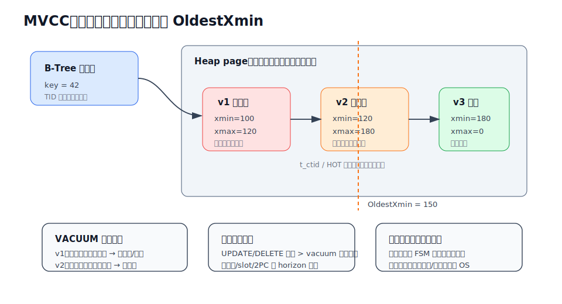

> **自检 SQL**：
> ```sql
> SELECT n_live_tup, n_dead_tup,
>        round(100.0 * n_dead_tup / NULLIF(n_live_tup, 0), 2) dead_pct
> FROM pg_stat_user_tables ORDER BY n_dead_tup DESC LIMIT 10;
> ```

## 4.3 为什么 STANDBY 有延迟

延迟 = `send_lag` + `flush_lag` + `replay_lag`。

- `send_lag`：网络 + primary 端 `wal_sender` 写网卡速度；通常 < 1ms，1Gbps 内网可忽略
- `flush_lag`：备机把 WAL 刷盘的速度；受备盘 IO 能力限制
- `replay_lag`：备机 `startup` 进程把 WAL 应用到数据文件的速度；受备机 IO 和并行回放 worker 限制

**特例**：`hot_standby_feedback = on` 时，备机的最长事务会反馈给主库，主库不清理比该 xmin 还老的数据，导致 WAL 不能回收、延迟反向放大。

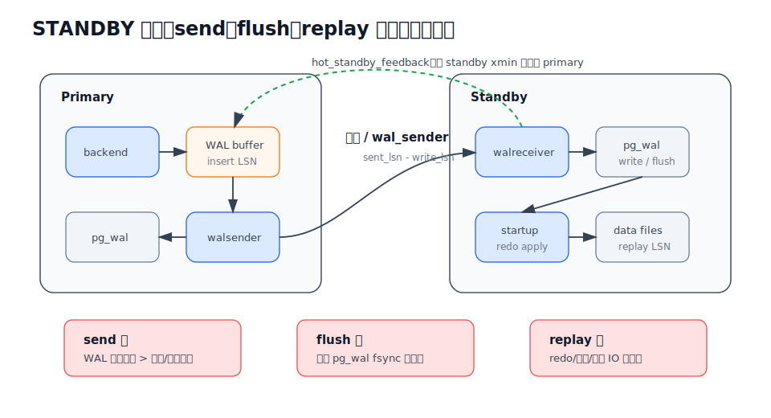

## 4.4 为什么会雪崩

雪崩三件套：

- **lock**：大事务持锁，小事务都等；一个慢查询卡 100 个 worker
- **大锁被已有长事务的小锁堵塞**：DDL（ACCESS EXCLUSIVE）被 SELECT 阻，所有后续 DDL/DML 都排队
- **高并发小锁等大锁**：秒杀场景，几百个事务抢同一行的 `SELECT FOR UPDATE`

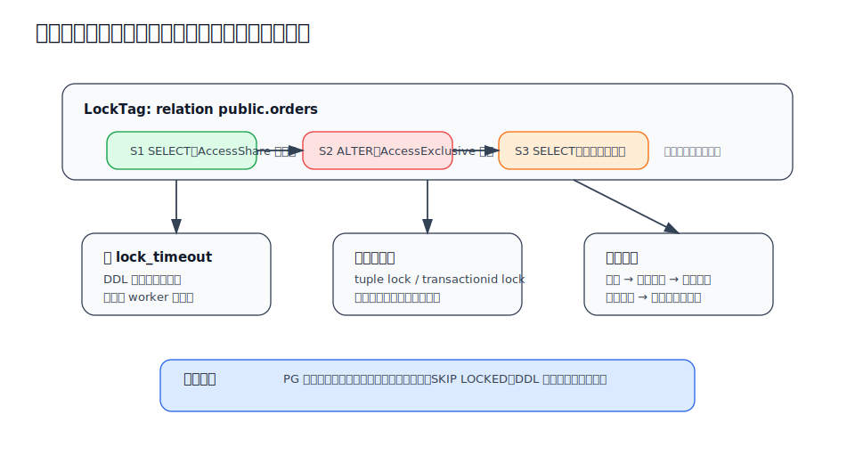

> 第一性原理：**没有超时 = 没有雪崩保护**。德哥反复强调："DDL 必须包在事务里设 `lock_timeout`，否则一次 ADD COLUMN 就能把整库卡住"。

## 4.5 为什么需要 FREEZE

32-bit 事务 ID 最多 2^32 ≈ 43 亿，PG 设计为循环使用。当某个表的 `relfrozenxid` 距离回卷点 < 200,000,000（`autovacuum_freeze_max_age`）时，autovacuum 会强制 freeze。

xid 回卷后，原本"过去"的事务会变成"未来"的事务，数据突然消失（著名的"PG 库变只读"事故）。数据库进入保护模式：拒绝写入，只允许 VACUUM。

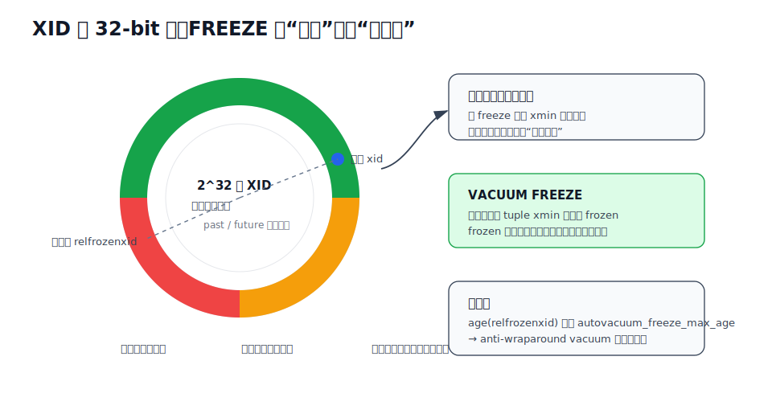

> **自检 SQL**：
> ```sql
> SELECT datname, age(datfrozenxid) FROM pg_database ORDER BY 2 DESC;
> -- 任一库 age > 200,000,000 → anti-wraparound 模式
> -- 任一库 age > 1,500,000,000 → 紧急!
> ```

## 4.6 为什么 GIN 有时不快

GIN 索引更新走"快路径"（放 pending list），vacuum 时才合并到主索引。pending list 越大，查询时遍历 pending list 的开销越大，RT 升高。

**诊断**：

```sql
CREATE EXTENSION pageinspect;
SELECT * FROM gin_metapage_info(get_raw_page('idx_xxx', 0));
-- 看 n_pending_pages,越大越慢
```

**修复**：`VACUUM tbl;` 触发 pending list 合并。

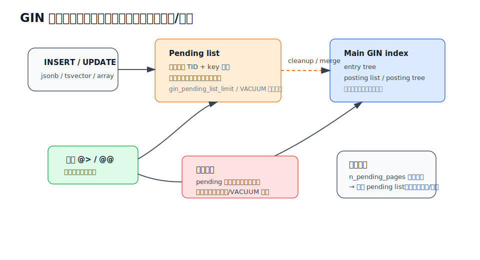

> **第一性原理**：GIN 是为"读多写少"设计的，高频写时必须配套高频 vacuum。

## 4.7 为什么 BRIN 有时不快

BRIN 适用场景：**线性数据**（按物理顺序存储）且 HEAP PAGE 之间的边界清晰，时序数据是天然例子。

**不适用**：数据物理顺序与索引列顺序不一致（随机写入），多列任意组合查询（只对单列有效）。

> **证伪**：把表 `CLUSTER` 在 BRIN 列上，RT 立刻降 → 锁定是物理顺序问题；否则换 B-Tree。

> **关于"BRIN 10 亿行 ≈ 1MB 索引"** ：这取决于 `pages_per_range` 配置（较大时确实可降到 1MB 以下），具体数值与设置相关。

## 4.8 为什么执行计划不正确

根因清单：

- **统计信息维度不够**：多列相关性没体现，优化器以为独立 → bitmap 失准
- **统计信息陈旧**：长时间不 `ANALYZE`，`pg_class.reltuples` 与实际差几个数量级
- **优化器因子参数不对**：`random_page_cost = 4`（默认）时 PG 认为随机 IO 很贵，倾向顺序扫描；对 SSD 盘要调到 1.1（云盘 1.5，NVMe 1.0）
- **plan cache / prepared statement**：`plan_cache_mode = auto` 时前 5 次执行选 plan，后续都用这个 plan，即使数据已变（plan sniping）
- **多表 JOIN 顺序**：超过 8~12 张表时 PG 改用遗传算法，不一定最优；可用 `join_collapse_limit` 强制穷举

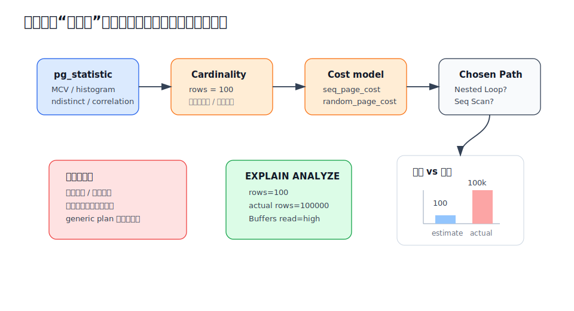

> **自检 SQL**：
> ```sql
> -- 看统计信息新鲜度
> SELECT schemaname, relname, last_analyze, n_mod_since_analyze
>   FROM pg_stat_user_tables ORDER BY n_mod_since_analyze DESC;
> ANALYZE VERBOSE tbl;
> 
> -- 看是否 plan cache 引起
> SET plan_cache_mode = force_custom_plan;
> -- 对比两条 EXPLAIN
> ```

## 4.9 为什么 push/pull 大量数据慢

核心原因：走 `simple query` 协议（每个语句单独解析/规划/执行），大量 round-trip；走 `extended query` 协议（用 prepared statement），可以省去重复解析。

**优化方向**：

- 用 prepared + bind：`PREPARE p1 AS SELECT * FROM t WHERE id = $1;`
- 用 COPY 替代 INSERT（10x~100x 提速）
- 批量提交
- 异步提交：`SET synchronous_commit = off;`（配合 `wal_writer_delay = 10ms`，最坏丢失 `3 × wal_writer_delay`）

> 第一性原理：**网络 round-trip + 单条事务的 fsync = 大量数据搬运的两大成本**。

## 4.10 为什么 LIMIT 不一定能止住大扫描

`SELECT * FROM t ORDER BY id LIMIT 10` —— 如果 `id` 没有索引或 `id` 列上有大量重复值，PG 可能选择 Seq Scan + Sort，而不是 Index Scan + Limit。"LIMIT 10" 只限制返回行数，不限制扫描行数。

> **证伪**：`EXPLAIN ANALYZE` 看 `actual rows` 是否远大于 10；如果 `actual rows = 1000000`，说明全表扫了。

## 4.11 为什么 count() 会扫表

PG 的 `count(*)` **没有"记录总数"缓存**（不像 MySQL 的 InnoDB），必须扫可见版本链。MVCC 让每行有多个版本，count 必须判断哪些版本对当前事务可见。

**优化方向**：用 `pg_class.reltuples`（统计信息估算，精度 ±10%）、物化视图、计数器表、采样估算（T-digest / HLL）。

## 4.12 为什么 transaction ID 不是无限增长的

PG 的 `xid` 是 32-bit 无符号整数（PG 17+ 可选 64-bit），最多 2^32 ≈ 43 亿。PG 设计为循环使用（wraparound），因此需要 FREEZE（见 4.5）。

> **PG 17 新增**：可以启用 64-bit xid（`wal_level` 等设置），但有兼容性问题，社区未广泛采用。

## 4.13 为什么 index-only scan 还是会回表

Index-only scan 看起来不用回表，但有"visibility map"前提：只有当 VM 标记页面全部可见时，才能纯索引返回。如果页面有未提交事务产生的 dead tuple，仍需回表确认 visibility。

```sql
-- 看 VM 命中率
SELECT relname,
       pg_size_pretty(pg_relation_size(oid)) tbl_size,
       pg_size_pretty(pg_relation_size(reltoastrelid)) toast_size,
       100.0 * pg_stat_get_blocks_fetched(oid) / NULLIF(pg_stat_get_blocks_hit(oid), 0) AS hit_ratio
FROM pg_class WHERE relkind = 'r';
```

> **证伪**：执行 VACUUM 后 index-only scan 概率升高——因为 VACUUM 维护 VM。

## 4.14 为什么 checkpoint 突然变慢

根因：

- **shared_buffers 太脏**：`bgwriter` 没跟上，所有 dirty page 由 checkpoint 集中刷盘
- **`full_page_writes = on` + 高并发小写**：每次 checkpoint 第一次改页时写整页（wal 记录），写盘量突增
- **checkpoint_completion_target 设太低**（如 0.2）：checkpoint 被压缩在短时间内完成
- **磁盘 IO 拥塞**：与业务 SQL 抢 IO

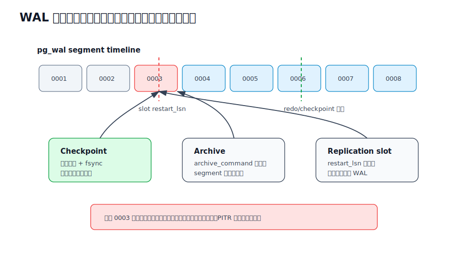

> **第一性原理**：checkpoint 是"把 shared_buffers 中的脏页同步刷到磁盘"。如果脏页太多，checkpoint 必然慢。

## 4.15 为什么 vacuum 不能并行回收同一张表

PG 的 vacuum 是单进程扫表（maintain single relation lock），即使你开 8 个 autovacuum worker，也只能在不同表上并行。同一张表内的 vacuum 只能串行。

**替代方案**：

- `pg_partman` 把大表分区，让 vacuum 在分区级并行
- PG 14+ 的 `vacuumdb --parallel` 仅对 index cleanup 阶段并行
- 用 `pg_prewarm` 主动加载热点

## 4.16 为什么 shared_buffers 设太大反而慢

`shared_buffers = RAM × 1/4` 是经验值。PG 16+ 之前，超过 RAM 25% 后，**buffer mapping 的 LWLock 争用急剧上升**（所有 backend 抢 buffer tag 的 hash 表）。

PG 16+ 引入了 **8 个 buffer mapping 分区**，大幅缓解争用，所以现在可以设到 40% 甚至更高，但仍要权衡：

- shared_buffers 越大 → OS page cache 越小
- OS page cache 命中率对 plan 估算的 `effective_cache_size` 影响变小

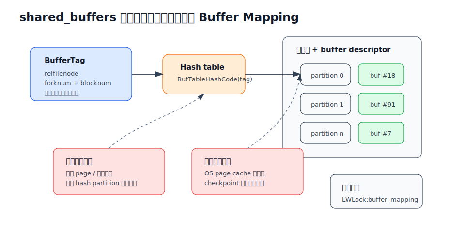

## 4.17 为什么 ANALYZE 后 plan 反而变差

罕见但真实：

- ANALYZE 触发了扩展统计重建，但表数据量极小时（< 100 行），统计信息不稳定
- ANALYZE 时启用 `default_statistics_target` 过大（> 1000），导致 plan 选择过分依赖极小概率事件
- 表刚 bulk load，`ANALYZE` 在最热路径上时，与业务 DML 冲突

> **证伪**：把 `default_statistics_target` 调回 100，重新 `ANALYZE`；或对大表分区独立 ANALYZE。

## 4.18 问题分析速记卡

```
【MVCC 反推链】
  UPDATE → 新版本 + 旧 dead tuple
  DELETE → 新 dead tuple
  vacuum → 回收 dead tuple
  vacuum 跟不上 → 膨胀

【OFFSET 真相】
  OFFSET = 排序 + 丢弃,不是跳过

【xid 真相】
  32-bit 循环使用;到 2 亿触发 anti-wraparound vacuum

【plan 失准检查清单】
  1. ANALYZE 了没?
  2. random_page_cost 对吗?
  3. plan_cache_mode 配了吗?
  4. 多表 JOIN 超过 8 张? 用 join_collapse_limit

【雪崩第一性原理】
  没有超时 = 没有雪崩保护

【push/pull 慢的原因】
  网络 RTT + 单事务 fsync = 两大成本
```

---

# 五、PostgreSQL FAQ AI 增强

这一章是"工具篇"——讲怎么用 AI（Claude Code + DeepWiki + 本地 PG 沉淀）把前四章的实战经验沉淀成可复用的 SOP。

## 5.1 准备工作：从 0 到 1 搭环境

### 5.1.1 clone PostgreSQL 代码

```bash
mkdir -p ~/pgstudy && cd ~/pgstudy
git clone https://github.com/postgres/postgres.git
cd postgres
git checkout REL_17_STABLE   # 或 REL_16_STABLE / REL_15_STABLE
# 配置代码索引
bear -- make -j$(nproc)   # 生成 compile_commands.json
```

> **前置条件**：装好 build 工具（gcc、make、bison、flex、readline）。
> **建议**：用 `pg branch` 切到要研究的版本，避免被 master 上的未发布 commit 误导。

### 5.1.2 初始化 Claude Code

```bash
cd ~/pgstudy/postgres
claude
# 首次运行会自动初始化,或在已有项目里跑 /init 生成 CLAUDE.md
```

CLAUDE.md 是项目级说明，相当于"给 Claude 的项目导航"。

### 5.1.3 配置 DeepWiki MCP

如果还没配，把下面加到 `~/.claude/settings.json`（或项目级 `.mcp.json`）：

```json
{
  "mcpServers": {
    "deepwiki": {
      "command": "npx",
      "args": ["-y", "mcp-deepwiki"]
    }
  }
}
```

重启 Claude Code，验证：

```
/mcp
# 看到 deepwiki 资源 ✓
```

### 5.1.4 启动本地 PG 实例（用于验证结论）

```bash
docker run -d --name pgstudy \
  -e POSTGRES_PASSWORD=postgres \
  -p 5432:5432 \
  postgres:17

# 进入 PG 客户端
psql -h 127.0.0.1 -p 5432 -U postgres
```

## 5.2 通用 pgfaq SKILL

把上面的工具串成一个工作流，写成 SKILL 沉淀到 `~/.claude/skills/pgfaq/SKILL.md`：

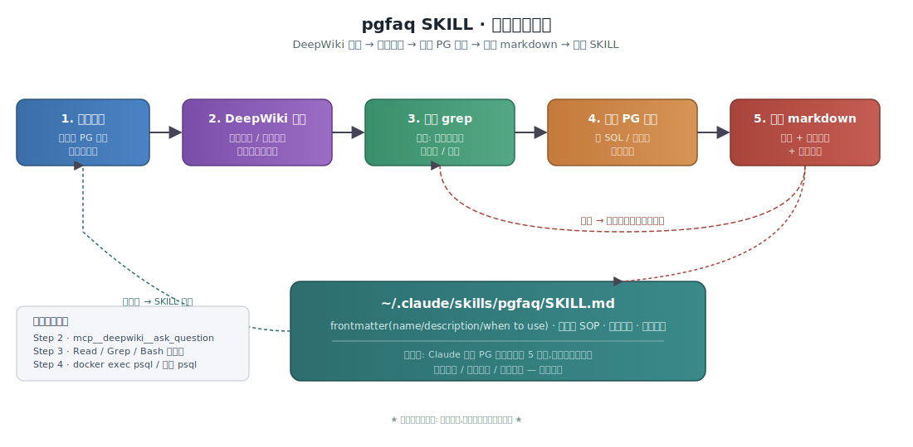

```markdown
---
name: pgfaq
description: PostgreSQL 概念问答 SOP——通过 DeepWiki + 源码 + 本地 PG 三件套验证
when_to_use: 用户提问 PostgreSQL 概念、机制、参数、SQL 行为时
---

# PostgreSQL FAQ Skill

## 工作流（4 步）

### Step 1: DeepWiki 宏观提问
对每个 PG 概念（MVCC、vacuum、xid、WAL 等），先问 deepwiki:
> "请解释 PostgreSQL 中 [概念] 的核心机制"
拿到高层架构和主要文件路径。

### Step 2: 源码定位微观验证
用 grep 在 ~/pgstudy/postgres 验证关键函数和文件:
> `grep -rn "function_name" src/backend/`
> 读头注释和关键路径

### Step 3: 本地 PG 跑 SQL 验证
在 Docker PG 里跑 SQL, 看实际行为:
```sql
BEGIN;
SET LOCAL vacuum_defer_cleanup_age = 10000;
VACUUM t;
-- 观察 pg_stat_progress_vacuum
COMMIT;
```

### Step 4: 沉淀 markdown 笔记
把"机制 + 验证 SQL + 边界 + 证伪"写成 markdown, 链接到 PostgreSQL 官方文档和源码位置。

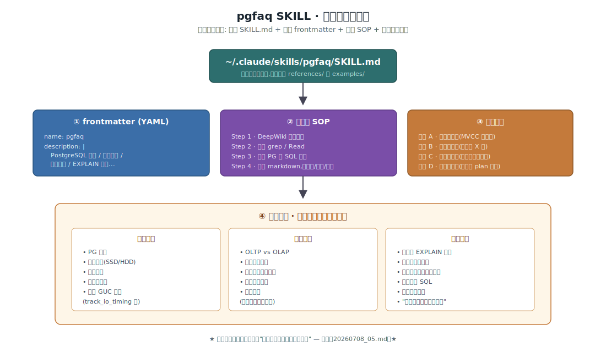

## 5.3 蒸馏 digoal.skill：把德哥风格固化成 SOP

> 顺带提醒一下：如果你机器上 `~/.claude/skills/digoal/` 已经有现成 SKILL（社区蒸馏的版本），可以**直接使用**而不是重蒸馏。本节讲的是怎么从 0 蒸馏出类似 SKILL 的过程。

### 5.3.1 德哥讲义的 8 条核心风格特征

对照德哥博客原文，蒸馏出可操作的风格清单：

| 德哥味 | AI 八股味 |
|---|---|
| 必给"前置条件 / 适用边界 / 证伪手段" | 给结论不给边界 |
| 引用必标出处（"PG 17 官方文档"、"德哥 1.pdf P.121"） | 不标出处或含糊"相关研究表明" |
| SQL/参数可直接 copy | 写"建议优化"等抽象表达 |
| 实战派语气，像在救火 | 教科书语气 |
| 大量具体数字（"56 核 ECS + NVMe 上 145 万行/s"） | 模糊"较高" / "较低" |
| 区分 OLTP / OLAP / 混合 | 笼统说"性能优化" |
| 强调"擒贼先擒王"思路 | 罗列 N 种方法不区分优先级 |
| 配速记卡 / 30 秒总结 | 长篇大论无总结 |

### 5.3.2 蒸馏流程（女娲式 6 阶段）

> **关于"女娲.skill"** ：这是花叔（`alchaincyf`，GitHub `huashu-nuwa`）开源的"风格归纳 + SOP 蒸馏"元方法。本节借其思路蒸馏德哥风格。

1. **搜集**：读 5~10 份德哥博客原文，提炼反复出现的表达模式
2. **归纳**：列出 8 条核心风格特征（如上表）
3. **反例对照**：找 AI 八股味 vs 德哥味的对照例子
4. **结构化**：把每条风格特征转成可操作 checklist
5. **沉淀为 SKILL.md**：写到 `~/.claude/skills/digoal/SKILL.md`
6. **回归测试**：让 Claude 用此 SKILL 答 5 个 PG 问题，对比德哥味 vs AI 味

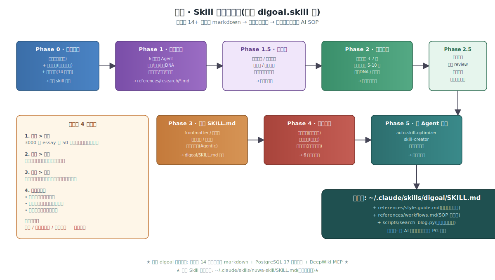

### 5.3.3 沉淀后的 SKILL 模板（参考）

```markdown
---
name: digoal
description: 用德哥(digoal)风格回答 PostgreSQL 问题——实战派、必给前置条件/边界/证伪
when_to_use: 用户提问 PostgreSQL 实战问题,期望得到"德哥味"回答
---

# digoal 风格 PostgreSQL 问答 SKILL

## 强制输出格式（每条结论）
1. 前置条件（自然语句,不表格）
2. 推理
3. 结论
4. 适用边界
5. 证伪/证明手段（具体可观测的 SQL 或命令）

## 禁止的 AI 八股
- "在当今时代"、"随着 PG 的发展"、"综上所述"
- "首先/其次/最后"开头
- "专家认为..."无具体引用
- 不标出处的具体数字
- "较高"、"较低"等模糊表达

## 必引用的来源
- PostgreSQL 17 官方文档
- PG 官方 wiki
- 德哥博客 GitHub: github.com/digoal/blog
- pg_stat_* 视图官方说明

## 风格示范
> 默认参数 `random_page_cost = 4.0` 是机械盘时代定的。
> **前置条件**：磁盘是 SSD/云盘才有讨论意义。
> **正解**：本地 SSD 改 1.1，云盘改 1.5，本地 NVMe 可降至 1.0。
> **证伪**：改完后 EXPLAIN 看是否多走 Index Scan；改完某些大表 Seq Scan 反而快——这是 Planner "看穿"了索引的真正价值，不是失准。
```

> **关于 SKILL 的"保质期"** ：SKILL 是基于截止 2026-07 的德哥公开博客蒸馏的中间产物。PG 新特性（PG 18+）或新场景（云原生、Citus）如果德哥没覆盖，SKILL 会"卡在风格而非事实"——遇到这种情况，**优先看官方文档而不是依赖 SKILL**。

## 5.4 FAQ 实战模板：现场带观众走一个 case

以 **MVCC 可见性判断** 为例，按 pgfaq SKILL 完整走一遍：

### Step 1: DeepWiki 提问

```
请解释 PostgreSQL 中 MVCC 可见性判断的核心机制,
特别说明 HeapTupleSatisfiesVisibility 在哪个文件,调用链是什么。
```

DeepWiki 返回概要：
- 文件：`src/backend/utils/time/tqual.c`（PG 17 改为 `src/backend/access/heap/heapam_visibility.c`）
- 入口：`HeapTupleSatisfiesMVCC`
- 关键判断：`xmin` < `Snapshot.xmin` AND `xmax` > `Snapshot.xmin`

### Step 2: 源码 grep 验证

```bash
cd ~/pgstudy/postgres
grep -rn "HeapTupleSatisfiesMVCC" src/backend/access/heap/
# 看 HeapTupleSatisfiesVisibility 的实现,理解 xmin/xmax 与 Snapshot 的对比
```

### Step 3: 本地 PG 跑 SQL 验证

```sql
-- 准备数据
CREATE TABLE mvcctest (id int, val text);
INSERT INTO mvcctest VALUES (1, 'a');

-- Session A: 开事务, 修改但不提交
BEGIN;
UPDATE mvcctest SET val = 'b' WHERE id = 1;
-- 不 COMMIT

-- Session B: 看 MVCC 可见性
SELECT * FROM mvcctest;
-- 期望返回 'a'(旧值, 因为 A 未提交)

-- Session A: 回滚
ROLLBACK;

-- Session B: 重新看
SELECT * FROM mvcctest;
-- 期望返回 'a'(不变)
```

### Step 4: 沉淀 markdown 笔记

写到 `~/pgstudy/notes/mvcc-visibility.md`，包括：
- DeepWiki 概要
- 源码关键路径
- 验证 SQL 输出截图
- 边界：serializable / repeatable read / read committed 行为差异
- 链接到 PostgreSQL 官方文档

## 5.5 FAQ AI 速记卡

```
【准备工作 4 步】
  1. clone PG 源码到 ~/pgstudy/postgres
  2. claude /init 生成 CLAUDE.md
  3. 加 deepwiki MCP
  4. docker run postgres:17 跑本地实例

【pgfaq SKILL 4 步工作流】
  DeepWiki → 源码 grep → 本地 PG → markdown 沉淀

【德哥风格 8 条特征】
  必给前置/边界/证伪 + 标出处 + SQL 可 copy
  + 实战语气 + 具体数字 + 区分 OLTP/OLAP
  + 擒贼擒王 + 速记卡

【蒸馏 6 阶段】
  搜集 → 归纳 → 反例 → 结构化 → SKILL.md → 回归测试

【SKILL 保质期】
  基于截止 2026-07 的德哥公开博客
  PG 新特性/新场景优先看官方文档
```

---

## 收尾：4 小时分享的主线

| 时段 | 章节 | 核心交付 |
|---|---|---|
| 0:00 - 1:00 | 一、PG 优化 | 事前 4 件套 + 事后 4 件套速记卡 |
| 1:00 - 1:45 | 二、PG 监控 | 10 条监控 SQL + auto_explain + wait_event 体系 |
| 1:45 - 2:50 | 三、故障诊断 | 分层漏斗 + 3 个救命查询 + RCA 模板 |
| 2:50 - 3:40 | 四、问题分析 | 17 个"为什么"反推机制 + 自检 SQL |
| 3:40 - 4:10 | 五、FAQ AI 增强 | pgfaq SKILL + 德哥风格蒸馏 |

**最重要的 3 句话**：

1. 读懂 EXPLAIN（actual rows、buffers、loops）比调参有用 10 倍
2. 擒贼先擒王：优化 `pg_stat_statements.total_time desc top 5`
3. 统计信息是一切规划器决策的根：ANALYZE 自动化不到位，所有优化都是空中楼阁

---

## 主要参考来源

- 德哥（digoal）培训讲义系列：
  - [PostgreSQL 日常维护、监控、排错、优化](20260708_05_doc_001.pdf)  
  - [PostgreSQL SQL 优化](20260708_05_doc_002.pdf)  
  - [PostgreSQL 常见为什么](20260708_05_doc_003.pdf)
  - [2018 PostgreSQL 峰会培训材料](20260708_05_doc_004.pdf)
  - [《PostgreSQL 11 postgresql.conf 参数模板》](../201812/20181203_01.md)  
  - [《PostgreSQL (慢SQL|数据库整体变慢|性能抖动) 数据库性能分析与优化方法》](../202208/20220823_02.md)  
  - [《PostgreSQL 9种索引的原理和应用场景》](../201706/20170627_01.md)  
  - [《PostgreSQL 锁等待排查实践 - process xxx1 acquired RowExclusiveLock on relation xxx2 of database xxx3 after xxx4 ms at xxx》](../201806/20180622_02.md)  
  - [《PostgreSQL 实时健康监控 大屏 - 低频指标》](../201806/20180613_04.md)  
  - [《PostgreSQL 实时健康监控 大屏 - 高频指标(服务器)》](../201806/20180613_03.md)  
  - [《PostgreSQL 实时健康监控 大屏 - 高频指标》](../201806/20180613_02.md)  
  - [《PostgreSQL Freeze 风暴预测续》](../201804/20180411_01.md)  
  - [《PostgreSQL 锁等待监控 SQL - 谁堵塞了谁》](../201705/20170521_01.md)  
  - [《PostgreSQL 如何查找TOP SQL (例如IO消耗最高的SQL) (包含SQL优化内容) - 数据库慢、卡死、连接爆增、慢查询多、OOM、crash、in recovery、崩溃等怎么办?怎么优化?怎么诊断?》](../201704/20170424_06.md)  
  - [《PostgreSQL on Linux 最佳部署手册》](../201611/20161121_01.md)  
  - [《PostgreSQL Oracle 兼容性之 - performance insight - AWS performance insight 理念与实现解读》](../201901/20190125_02.md)  
  - [《PostgreSQL pg_stat_statements AWR 插件 pg_stat_monitor , 过去任何时间段性能分析》](../202104/20210415_01.md)  
  - [《PostgreSQL 函数调试、诊断、优化 & auto_explain & plprofiler》](../201611/20161121_02.md)  
  - [《PostgreSQL 从入门到进阶: SQL 优化、监控、故障诊断与问题分析》](../202607/20260708_05.md)  
- PostgreSQL 17 官方文档：
  - [Using EXPLAIN](https://www.postgresql.org/docs/17/using-explain.html)
  - [Statistics Used by the Planner](https://www.postgresql.org/docs/17/planner-stats.html)
  - [Monitoring Statistics](https://www.postgresql.org/docs/17/monitoring-stats.html)
  - [auto_explain](https://www.postgresql.org/docs/17/auto-explain.html)
- PostgreSQL 官方 wiki：
  - [Performance Optimization](https://wiki.postgresql.org/wiki/Performance_Optimization)
  - [Server Tuning](https://wiki.postgresql.org/wiki/Tuning_Your_PostgreSQL_Server)
- 工具与扩展：
  - [pg_hint_plan GitHub](https://github.com/ossc-db/pg_hint_plan)
  - [pgwatch2 GitHub](https://github.com/cybertec-postgresql/pgwatch2)
  - [PoWA GitHub](https://github.com/powa-team/powa)
- 风格蒸馏参考：
  - [huashu-nuwa skill GitHub](https://github.com/alchaincyf/nuwa-skill)
  - 德哥博客：[digoal/blog](https://github.com/digoal/blog)

---

## 配套资源

**专家稿件**：
- [章节1](../experts/1-optimization.md)
- [章节2](../experts/2-monitoring.md)
- [章节3](../experts/3-fault-diagnosis.md)
- [章节4](../experts/4-problem-analysis.md)
- [章节5](../experts/5-faq-ai.md)

**事实核查报告**：
- [章节5](../experts/fact-checker.md)

**红队意见**：
- [章节5](../experts/red-team.md)


  
#### [PostgreSQL 解决方案集合](../201706/20170601_02.md "40cff096e9ed7122c512b35d8561d9c8")
  
  
#### [德哥 / digoal's Github - 公益是一辈子的事.](https://github.com/digoal/blog/blob/master/README.md "22709685feb7cab07d30f30387f0a9ae")
  
  
#### [About 德哥](https://github.com/digoal/blog/blob/master/me/readme.md "a37735981e7704886ffd590565582dd0")
  
  

  
