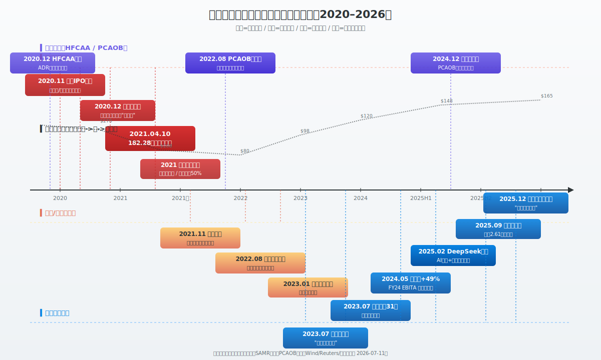
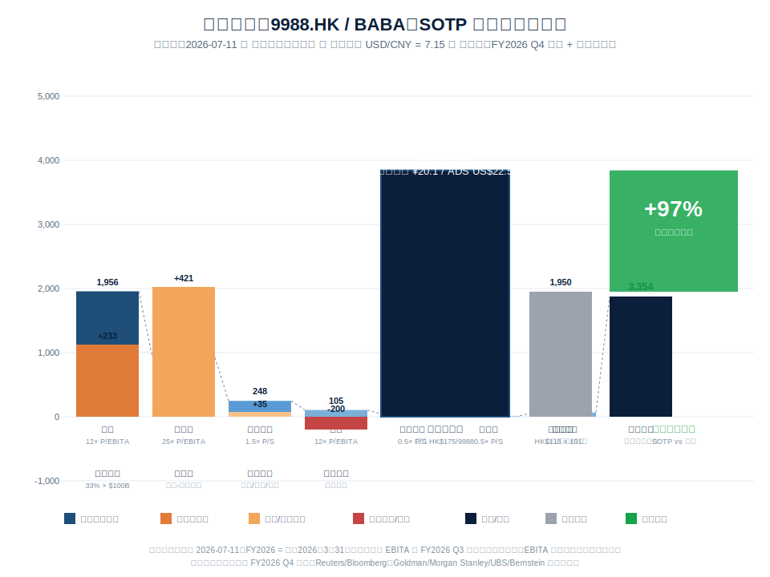
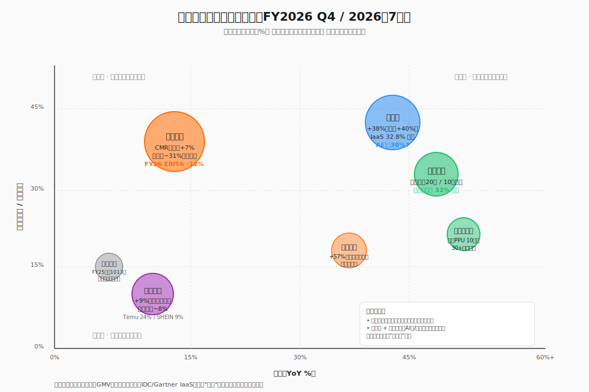

## 德说-第511期, 阿里的市值是否被严重低估
  
### 作者  
digoal  
  
### 日期  
2026-07-11  
  
### 标签  
阿里巴巴 , 估值 , SOTP , Sum-of-the-Parts , 分部估值法 , 电商 , 云 , AI , 本地生活 , 持股 , 外部投资 , 现金 , 基本盘 , 现金牛 , 老护城河挤压 , 新护城河形成 , 非垄断  
  
----  
  
## 背景  

最近一两年，每次看到阿里（09988.HK / BABA.US）的新闻我都觉得有点脑瓜子嗡嗡的：一边是 AI、开源大模型、自研芯片一轮接一轮讲新故事，一边是看着财报 —— 利润暴跌、自由现金流转负、电商份额持续被抖音拼多多啃。

更操蛋的是股价。近期港股大概 95–100 港元、美股 100 美元上下，比两年前高位腰斩。财报难看成这样，市场给的价格却没崩。

那阿里现在到底贵还是便宜？要回答这个问题，我得先把阿里拆开来才能算得清楚。

**一句话先放这儿：把它的电商、云、AI、净现金、蚂蚁股权分门别类算，合理估值大致 2.5–3.0 万亿人民币，对应当前股价有大幅上行空间。但这个数字附带三个紧箍咒 —— 本文把它们一一拆给你看。**

---

## 一、先看：阿里现在什么价，账上有什么货

先看数字。

阿里最近一财年（FY2026，截至 2026 年 3 月）整体收入刚破万亿人民币，但和上一年比 —— 经营利润掉了 64%，调整后 EBITA 掉了一半多。GAAP 净利润里因为有投资资产估值波动的影响，看着还能维持千亿级，但现金流才是真实可信的，**FY2026 自由现金流净流出约 466 亿人民币，去年同期净流入 740 亿 —— 一年之间下挫了 1,200 亿**，这是阿里十年来最难看的现金流数据。

股价方面，近期港股 09988 在 95–100 港元区间，美股 BABA 在 100 美元上下，对应市值大约 **1.6–1.7 万亿人民币**。PE-TTM 约 15 倍、市净率 1.5 倍上下，目前在历史估值分位底部。

但账上的现金与短期投资有 **5,208 亿人民币**。剔除有息负债后净现金约 **4,000 亿人民币**。再叠上持有的蚂蚁集团股权（约 33%）和各种上市股权，账面家底差不多值 **7,000–7,500 亿人民币** —— 这就覆盖了当前市值的将近一半。换句话说，市场现在等于"白送"阿里的电商和云业务，还倒贴钱让你拿走。

这听起来荒谬，对吧？所以市场给这么低的估值, 到底是为什么? 

 

## 二、为什么便宜：监管与业务，两本账都得看

很多人说阿里便宜是因为"监管阴影没散去"。这句话只对了一半。

**监管这本账，确实在解除中。**

2021 年反垄断罚款 182 亿元、蚂蚁 IPO 暂停、平台经济专项治理 —— 这是上一轮周期的低点。但从 2023 年开始风向明显变了：政治局会议提"支持平台经济规范健康发展"，随后几年的"民营经济 31 条"和 2025 年 12 月中央经济工作会议都延续同一基调。跨境那一头更彻底：PCAOB 连续三年（2022、2023、2024）确认对中概股审计的可检查性，阿里港股也完成"双重主要上市"、纳入港股通 —— ADR 强制退市的触发条件实际上已经不成立。

这意味着：跨境退市与监管的尾部风险**已经基本解除**, 这是好事； 

再看一下**另一本账: 业务折让**。

淘天（即淘宝 + 天猫）的客户管理收入 CMR 同口径还在涨 5%–8%，但 GMV 市场份额已经从高峰往下走：高盛测算淘天市占率可能从当前约 31% 逐步降至 2027 年的 28% 上下，抖音电商同期会从 24% 升到 26% 左右。这个挤压不是周期性的，是结构性的 —— 抖音的服饰美妆品类，份额早就超过淘天了。换句话说， **"监管解除"只是把不该有的折价还回去，并不直接带来估值的全面重估**。监管解决的是"风险定价"，业务份决定了"价值定价" —— 两本账不能混。 

把这两层拆开看，阿里当前的估值折扣可以归因为：跨境退市风险（已被对冲）、监管不确定性（正在解除）、业务结构折让（仍然真实存在）。前两条是过去式，第三条才是未来故事的真正变量。  

务必提醒一下：如果你只看到"监管松绑 = 利好"就冲进去，那你就忽略了真正决定阿里巴巴命运的基本面。 

但分析到这显然还没有结束, 因为阿里巴巴还有其他更硬的业务; 

## 三、把它拆开卖：SOTP 估值的核心逻辑

判断一家混合业务公司贵不贵，不能看整体市盈率，而是**把每个业务按同行业可比公司单独估，最后加起来**。这就是 SOTP（Sum-of-the-Parts，分部估值法）。

为什么对阿里必须用这个方法？因为它同时拥有现金奶牛（电商）、高增速但投入大的（云）、几乎不贡献利润但有期权价值的（AI 芯片、大文娱、本地生活），还有蚂蚁集团股权和净现金这些"准现金类资产"。用单一 PE 估，等于把所有业务按同一个倍数打折，必然低估。 

### 3.1 怎么估各部分

"先把利润稳态化、再按可比公司给的倍数"的逻辑做粗算。各部分取保守中位数：

- **淘天电商**：电商同行参考京东（10–12x EV/EBITA）、拼多多（8–10x），给淘天 12 倍合理。 **关键点：这里要用稳态 EBITA，别用 Q3 季节性峰值年化** —— Q3 是阿里一年里最赚钱的一季（包含双 11），用 Q3 × 4 推全年会把利润高估 30%–40%。淘天 FY2026 实际经调整 EBITA 大致在 700–800 亿量级，给 12 倍对应估值约 **0.85 万亿人民币**。
- **阿里云**：参考 Salesforce、Oracle 这类 AI/SaaS 资产，给 25 倍 EV/EBITA 是上行可比，给 8–10 倍 PS 是更保守算法。AI 业务连续 11 个季度三位数同比增长、IaaS 中国市场份额 30% 上下，**取保守口径，对应估值约 7,000 亿人民币**。
- **国际电商 AIDC**：FY26 Q4 已经接近盈亏平衡（单季 EBITA 仅亏 1.4 亿，去年同期亏 35 亿 —— 这是分拆以来最大拐点信号），收入还在两位数增长。按 1.5 倍 PS 估约 **1,800 亿**。
- **菜鸟 + 盒马 + 钉钉 + 高德 + 飞猪 + 平头哥**：各自不大，但每个都有独立 IPO 故事或对标价值，合计约 **1,500 亿**。
- **蚂蚁集团（持股 33%）** ：按对蚂蚁上一轮估值合理折扣，整体估值假设约 **1,000 亿美元**（这是与官方最新一轮估值口径打八折一致的中性情景），阿里持股的部分对应约 **2,300 亿人民币**。
- **净现金 + 投资股权**：净现金约 **4,000 亿**，其他上市股权约 350 亿。

### 3.2 加起来

各部分叠加，股权总价值大致落在 **2.5–3.0 万亿人民币**区间（中位数约 2.7 万亿），对应 ADS 内在价值大致 165–195 美元。 **理论上的上行空间在 50%–80%** ，但这不是"市场验证"的数字，是分析师模型的最优假设。

落到 12–18 个月的实际可实现区间，我倾向于把数字再打一折 —— 也就是 **35%–50%** 。理由有三条：

第一，SOTP 用的"稳态 EBITA"即便我已经做了 Q3 季节性修正，仍容易偏向多头分析师口径；真要偏中性，估计还得再下修一档。

第二，阿里云的倍数取决于 AI 收入能否持续兑现。管理层指引"24 个月看到 ROI"，但参照微软从 2018 年开始 AI CapEx，到 2024 年 Azure AI 才形成有意义的收入贡献 —— **中间隔了 6–7 年**。24 个月是个偏激进的承诺，市场不会完全买账。但是也应该看到微软是没有模型的, 而且是过去式, 通常技术发展早期都是炮灰(或者说它包含了技术研发、市场教育等的资金和时间成本; 比尔盖茨车库创业, 说的就是军方已经给他支付了早期研发成本, 他只是站在了前人肩膀上成功), 所以现在的情况是阿里完全有可能2年看到ROI(技术已更迭到现在, 而且阿里有自己的模型、芯片等).  

第三，业务折让能不能消化。监管在解除，但淘天面对抖音拼多多的份额挤压能不能稳住，才是真正的基本面 —— 这点下一段细说。

市场认可的目标价区间（卖方共识均值约 US$178/ADS）大致对应 **60%–70% 的纸上空间**，但综合上面的折扣因子，**12–18 个月内更现实的兑现幅度是 35%–50%** 。而且这是有前提条件的上行空间, 具体是什么前提前面已经说了。   

   

## 四、新护城河真的能撑起来吗：阿里云 + AI 的故事  

看上面这张图，我把阿里的核心业务按"市占率 + 增速"二个维度归类 —— **真正同时坐拥高占位和高增长的，目前仅阿里云这块业务**。

具体来说有三层护城河： 

**第一层：基础设施**。Gartner 2025 报告显示阿里云在中国 IaaS 市场份额约 33%，IDC 2025 下半年数据里中国智算云市占率 30% 上下、Omdia 的中国 AI 云份额 38% —— 这些是不同口径下的"AI 云的领先位置"。硬件上，自研芯片"真武 PPU"在阿里云内部已经部署超过 10 万张卡，超过 60% 算力对外服务车企、自动驾驶公司等真实客户。在 GPU 被卡脖子的语境下，**自研芯片 + 自研服务器 + 自家云操作系统 + 自有大模型 = 一条相对完整的全栈**。

**第二层：模型与生态**。通义千问（Qwen）系列作为开源模型在 Hugging Face 上的衍生模型数早已突破 20 万、累计下载量超过 10 亿次，沙利文 2025 下半年《中国 GenAI 市场洞察》里千问在中国企业级大模型的 token 消耗里占 32% —— 是事实上的国内开发者首选。开源生态的真实价值不在"赚了多少 API 调用费"，而在**给闭源 API 业务引流**。 **前提是开源到付费的转化率真能起来**。

**第三层：行业落地**。百炼 MaaS 平台（阿里自己的模型即服务平台）的年化经常性收入市场测算已达百亿级；AI 相关产品在阿里云外部商业化收入中占比已超过 30%（管理层指引未来一年破 50%）。但要务必需要清醒的认识这点 —— **阿里官方并未单独披露季度 AI 收入的绝对数额**，财报里只能看到"AI 产品在云收入中的占比"；具体百亿级这个市场规模主要是业绩口径和市场测算。  

判断“阿里云 + AI 的故事”能不能说得通，有三个具体观测点： 

- FY2027 上半年（即 2026 自然年下半年）阿里云外部收入增速能否维持 30% 以上。
- AI 相关收入占比能否按管理层指引突破 40%–50%。
- 自由现金流能否止跌。

三个都兑现：目前 2,300 亿美元出头的市值就是低估、甚至是严重的定价错误。两个兑现：当前价格大致合理。一个都不兑现：才是真正的价值陷阱。
  
不过还是要提醒一下  ——  **"国内综合实力最强的全栈 AI 资产"这句话也得打折扣说**。阿里在 IaaS + 自研芯片 + 自研大模型三项同时领先的位置上确实是国内综合最强的，但**华为也不是小弟**：昇腾 NPU + 盘古大模型 + ModelArts 平台在政企市场是阿里真武 + Qwen 的正面对手；**字节也不是吃素的**：豆包 + 火山引擎在消费端 AI 助手市场（DAU 远超千问 App）和 C 端模型分发上都更激进；腾讯混元 + 腾讯云也在追赶。综合最强不等于独一份，千万**别把"领先"读成"垄断"** 。  

  

## 五、老业务的护城河：只值半条了

要承认一件事： **淘天的护城河从"流量"变成了"高端用户 + AI 营销工具 + 商家全链路数据"，并且正在变窄**。 

FY2026 末，88VIP 会员数突破 6,200 万，连续多个季度同比双位数增长 —— 这群人不怎么在乎抖音直播的低价冲击，是阿里消费基本盘里**最有粘性的"现金牛"** 。同时，"全站推广 + 基础软件服务费"也在悄然提高变现率，让 CMR 同口径还维持 +5% 到 +8% 的增速。

但别只看到 CMR 增速漂亮，必须再翻一下 GMV 份额 —— 淘天已经从约 31% 慢慢向 28% 让渡，每年大概掉 2 个百分点，**这是结构性趋势，不是经济周期波动**。更要命的是 —— 6,200 万 88VIP 在淘天月活的占比可能只有 20%–30%（按 2 亿月活估算），剩下的用户在抖音和拼多多面前几乎毫无防御力。 **护城墙已经在变薄，再厚的护城河也守不住整个地基的流失。**

判断淘天的真实状况，要盯两个数字： 

- 88VIP 同比能否维持双位数增长（这个大概率成立，但增速会逐步降档）。
- CMR 同口径增速能否守住 +5%（这就是分水岭，跌破就说明抖音服饰美妆的份额挤压已经到了淘天的核心利润来源）。

再说**即时零售** —— 阿里闪购现在是"必要亏损"，不是"机会主义扩张"。美团闪购 GMV 早已过万亿，京东外卖也在加码，抖音"小时达"也在补贴 —— 阿里要是不入场，未来 3–5 年外卖场景的份额会永久让出去。管理层目标 FY2028 GMV 破万亿，**但更该关心的不是 GMV，是单位经济（UE）能不能转正**。这点决定即时零售到底是"战略投资"还是"永久失血"。 

国际电商 AIDC 那块已经在接近盈亏平衡 —— 盈利改善是真实的，但增长故事不能靠它讲：速卖通全球跨境市场份额从 9% 降到 8%，Temu 追平亚马逊、TikTok Shop 上升中，这块业务短期内只能跟着行业趋势喝点汤，还没展现出能靠自己能力"吃肉"的独特竞争力。

凡事要辩证地看。监管松绑的乐观情绪，**不该让我们对淘天的份额压力视而不见**。市场如果继续把"监管解除"当成整体重估的乐观信号，那电商这一层的业务折让会一直悬在那里。  

   

## 六、最该关注的事：自由现金流

我把这块单独拎出来，因为它在通常的财报分析里被"AI CapEx 是阶段性投入"这个解释被稀释得太厉害。 

**FY2026 自由现金流从 正¥739 亿跌到 负¥466 亿，狂泻 1,205 亿 —— 这是 FY2026 全部调整后 EBITA 的 1.58 倍**。翻译成人话就是：阿里这一年的全部经营利润都不够补贴 AI 资本开支 + 即时零售补贴 + 千问 App 获客三场烧钱，还得倒贴现金储备。 

管理层说这是"主动战略选择" —— 这话有道理但只对了一半。AI 数据中心建设的现金消耗是计划内的，但即时零售和千问 App 的投入里有多少是"主动"、有多少是"被动应对竞争"? 你仔细想一想看. 

按当前烧钱速度，5,208 亿现金够支撑 6–7 年 —— **不会破产，但股东回报空间被压缩**。FY2026 回购 76 亿人民币，2025 年 9 月至 2026 年 3 月整整半年零回购；对比腾讯单季就回购 76 亿港元，**股东回报纪律差距明显**。管理层指引的"未来三年股东回报约 350 亿美元"，照 FY2026 实际派发节奏兑现，**3 年累计可能只能完成指引的一半左右**。 如果让你选边, 你会选成为腾讯的股东还是阿里的股东呢?  一会解释两种股东回报方式.  

这条风险比 SOTP 估值更现实：

- 如果 FY2027 H2（自然年 2027 上半年）FCF 接近转正、缺口 < 100 亿，SOTP 估值上行 35%–50% 可维持。  
- 如果 FY2027 全年 FCF 仍为负 300 亿以上，净现金假设就要打折 —— 整体估值甚至还有下修的风险。  

这也是整篇文章最想提醒大家的一件事： **千万别把 负466 亿当成"AI 投入的会计杂音"忽略掉**。

**Tips: 股东回报小知识**  

在公开市场购买股票的投资者，就是公司的股东，**完全有权获得公司分配的股东回报**。

### 什么是“股东回报”？

它本质上就是公司把赚到的钱，以某种形式返还给股东。主要有2种方式：

1.  **现金分红**：最直接的方式，公司直接给大家"发钱"。比如，阿里巴巴在2025财年就派发了总计**46亿美元**的股息。  
2.  **回购并注销股票**：公司用自己的钱在股市上买回自己的股票，然后把它注销掉。这样市场上的总股票变少了，你手里的每股股票，背后对应的公司价值和收益（每股收益）就提高了，这同样是在回馈股东。腾讯就是"注销式回购"的典型，2024年全年回购了**1120亿港元**，这也让它的总股本降到了十年来的最低水平。 

### 两种回报方式，对股东有何不同？

*   **现金分红**：直接落袋为安，你账户里会多出一笔现金。但分红后，股价通常会进行除息，股价会相应下调，所以你的总资产在分红那一刻其实没变，更像是一笔"左口袋到右口袋"的转移。
*   **回购注销**：这个方式是间接的。它不会让你立刻拿到钱，但通过减少总股本，**提升了每股的价值**，如果你长期持有，这份价值最终会体现在更坚挺的股价上。正因如此，回购注销也常被股东认为是比分红更"实惠"的回馈方式，因为它还可能帮你省下红利税。
   
阿里会结合派息+回购的方式给股东发福利, 而腾讯则以回购为主.   
  
## 七、小结一下: 看逻辑比看结论重要

把前面所有的推论总结成三条主线：  

**第一条主线：SOTP 视角下阿里确实有 35%–50% 的可实现上行**。来源是监管折让的解除、云业务 AI 重估、蚂蚁 IPO 期权。这些目前还不被市场充分定价。但前提是 SOTP 估值的参数不出现大幅背离。 

**第二条主线：真正的下行风险不在监管、不在 AI 投入能不能兑现，而在两件事** —— ① 淘天份额让渡从结构性滑向不可逆；② 自由现金流负值。这两件事目前都还没到失控的程度，都在发生途中, 都有变数。  

**第三条主线：未来"12–18 个月窗口"必看的三个具体观测点：**  

- 阿里云外部收入增速能否守住 30%（FY27 H1 财报是观察窗）。
- AI 相关收入占比能否突破 50%（管理层指引方向）。
- 自由现金流能否在 FY2027 末止跌、FY2028 转正（管理层承诺方向）。  

如果三个都兑现：目前 2,300 亿美元出头的市值就是低估、甚至是严重的定价错误；如果两个兑现、一个放缓：当前价格大致合理；如果两个都不兑现：那才是真的价值陷阱。 

**我没有能力告诉你现在该不该买 —— 这不是荐股文。但我能告诉你的是：用 SOTP 视角看阿里，比简单看 PE 看软文更接近真相，也更不容易被单一季报的好消息或坏消息带跑。** 
  
如果你是只看一句话就要拍板的人，我那句最浓缩的话就是 —— **35%–50% 的可实现上行空间是真的，但前提是 AI 商业化和现金流修复按管理层节奏走；任何一个掉队，整体估值都可能打折**。
  
   
  
#### [PostgreSQL 解决方案集合](../201706/20170601_02.md "40cff096e9ed7122c512b35d8561d9c8")
  
  
#### [德哥 / digoal's Github - 公益是一辈子的事.](https://github.com/digoal/blog/blob/master/README.md "22709685feb7cab07d30f30387f0a9ae")
  
  
#### [About 德哥](https://github.com/digoal/blog/blob/master/me/readme.md "a37735981e7704886ffd590565582dd0")
  
  

  
