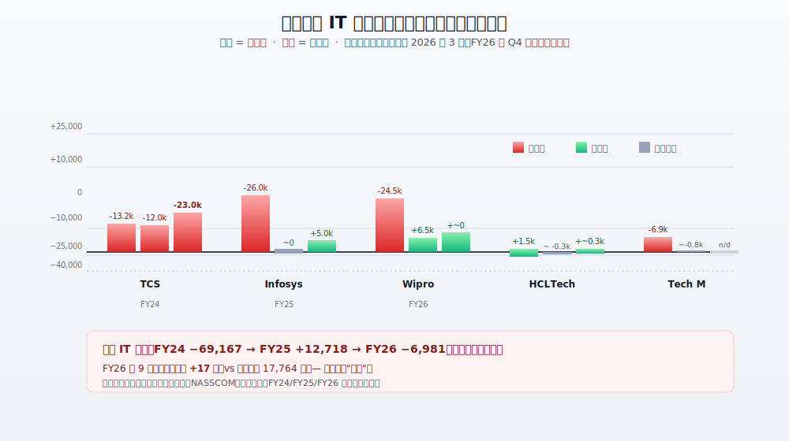
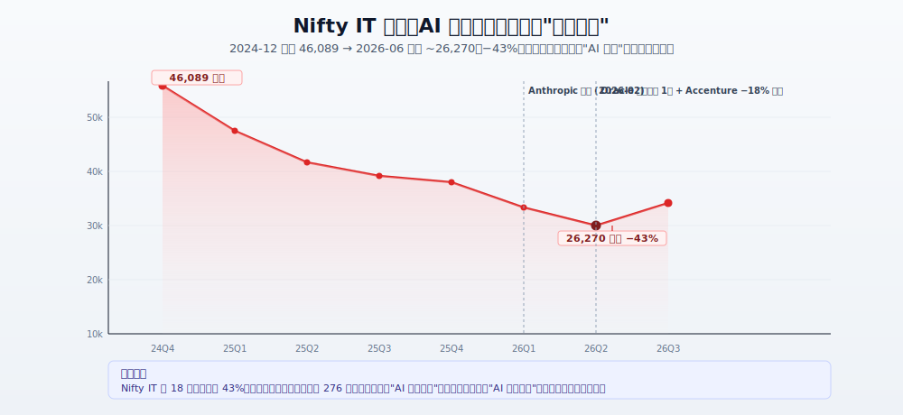
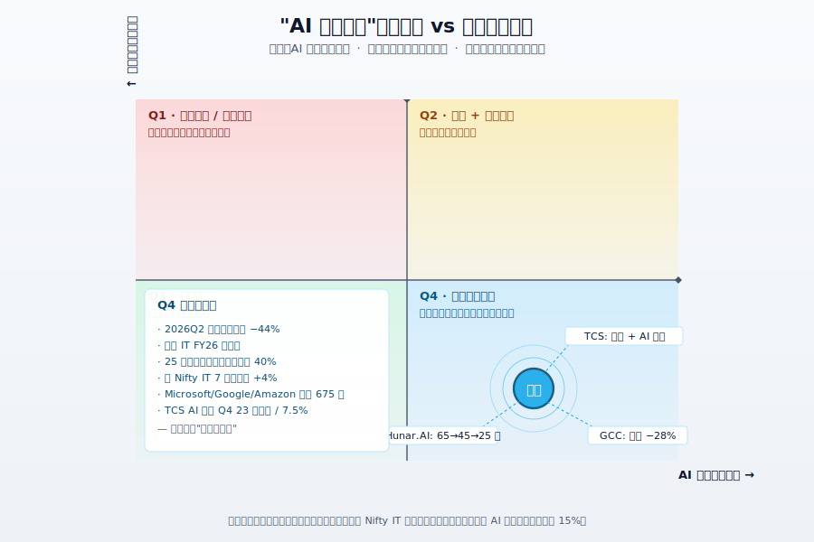
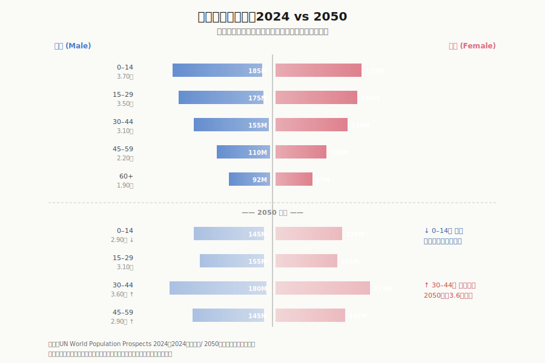

## 德说-第512期, 一个被 AI 做空的人口大国: 印度
  
### 作者  
digoal  
  
### 日期  
2026-07-12  
  
### 标签  
印度 , 人口红利 , 中低段位人才 , 卖人头 , 工时 , 单价低 , 年轻 , 廉价 , 会说英语 , AI 替代 , 冲击 , 转型 , AI 价值链 , AI 服务 
  
----  
  
## 背景  

  

"印度"，在过去三十年里，几乎是"人口红利"四个字的人形代言。14 亿人，28 岁年龄中位数，每年 150 万工科毕业，硅谷和华尔街讲印度故事时，嘴边的关键词永远是 young、cheap、English-speaking。

2023 年生成式 AI 爆发之后，这个故事开始讲不下去了。

我读了大量材料，越读越觉得，这个故事不是被"证伪"了，而是被解构了。真正在做空的是一种特定的商业模型 —— "按人头卖工时" —— 以及依附其上的大约 1000 万印度中产白领。印度这个国家本身体量太大、AI 给的反向杠杆也太多，不能简单贴一个"看空"标签。

下面我打算这样讲：先说清印度过去 30 年的"卖人头"商业模型长什么样；再说 AI 怎么精准砸中这套模型、砸到了哪几块；然后说说哪些做空是真存在的；  

---

## 一、印度这盘"卖人头的生意"长什么样

要理解"做空"在发生什么，先得理解"多头"在卖什么。

印度 IT 行业的起点，是 1980 年代的几家小公司帮美国银行做后台数据录入。这活儿技术含量不高、流程标准化、客户重复性强。换句话说，是**可计费、可外包、可规模化的"确定性的苦力活"** 。

后来这条路越走越长：Y2K 修补丁 → 大型机迁移 → ERP 实施 → 应用维护 → 客服中心 → 数据标注。一路 30 年，吃透了"白领成本套利"四个字。NASSCOM FY26 报告显示，印度 IT 服务全行业总收入到 2025-26 财年已经摸到 **3,150 亿美元**，同比增长 6.1%（来源：NASSCOM FY26 战略评估，路透社 2026-02-24 转载）。IT/BPO/GCC（外资在印度自建的能力中心）在整个印度直接雇佣 **595 万人**，如果再算上围绕这些白领吃饭的房地产、教育、家政、出行 —— 大约是 **5–10 倍**的溢出效应。换句话说，印度 IT 行业养活了将近 **5,000 万人**。

这条链的关键赚钱方式，从来不是创新，而是**人头 × 工时 × 单价**。客户每多买一个"全职当量"（Full-Time Equivalent, FTE），印度 IT 公司就多收一笔账；客户把活儿从伦敦搬到班加罗尔，省下的就是利润。这套商业模型在过去 30 年屡试不爽 —— Y2K 被来过一次"末日预言"、2008 金融危机来过一次、2017 RPA 浪潮又来过一次。每次都有人写"印度 IT 即将消亡"的头条，每次印度 IT 都靠下一波迁移（比如云迁移、AI 部署）找到了新订单。

所以，2023 年生成式 AI 出来时，多数人第一反应也是狼"又来了"。只不过这次，好像不太一样。

 

## 二、AI 怎么精准砸中"卖人头"

不一样在哪？我反复琢磨，结论是： **这一次的颠覆不是替代一种技能，而是替代一种计费方式**。

过去 30 年，印度 IT 卖的是"人头 × 工时"。生成式 AI 让客户开始问一个完全不同的问题： **"我能不能直接买结果、不买人头？"** Infosys、Wipro、Cognizant 的 CFO 都在公开场合承认这一点；Kotak Institutional Equities 把它叫做 **"AI 融合型费率表"** （AI-Fused Rate Card） —— 传统外包单价下降 10%–15%（来源：Kotak 2026 报告）。

单价降 10%–15% 还能扛。但叠加另一件事就要命： **GenAI 把"等效员工数"压缩了 5–10 倍**。

具体怎么压的？把几类典型工作过一遍就知道：

- **标准化代码**：以前 100 人的开发团队，今天 2–3 个熟练工 + GitHub Copilot / Cursor 就能跑同样的活儿（来源：TeamLease Digital CEO Nitin Sharma 公开举例，2026）。
- **客服中心**：标准咨询 80% 以上可被 LLM 顶替；Teleperformance 这类印度外包大户去年还在搞"AI 口音矫正"，把印度口音英语改造成听起来像美国本地 —— 这是延迟阀，不是护城河。
- **法律合同审阅**：30 人团队干的事，今天 1 个人 + 模型就能做。
- **数据录入**：10 个人的活，2–3 个人加 OCR + LLM 就够了。

这股力量砸到财报上是什么样？看下面这张图 —— 印度五大 IT 公司（TCS、Infosys、Wipro、HCLTech、Tech Mahindra）近三个财年的净增员工数。

注意最右那一列（FY26），TCS 还在大刀阔斧裁员 —— 2025 年 7 月单次宣布裁掉 1.2 万人，是这家印度最大 IT 公司**史上最大规模裁员**；Infosys、Wipro 勉强维持小幅净增。 **五大合计，FY26 前 9 个月净增员工仅 17 名**（同期 FY25 是 17,764 名） —— 印度 IT 行业的"新人入口"基本被堵死了（来源：印度《经济时报》2026-06-25，路透社 2026-04 转载）。

再看一个更尖锐的数字： **2026 年春季，印度入门级（≤2 年经验）技术岗位空缺同比锐减 44%** ，活跃岗位数掉到 28 个月以来最低点（同源）。

但是：把所有减员都算到 AI 账上，是不公平的。HBR 2025-12 的一项全球 1000+ 高管调查显示，**60% 的受访者承认"因预期 AI 的未来影响"裁员，但只有 2% 是 AI 已经造成的大规模实质替代**。Gartner 2025-10 调查了 321 名客服负责人，只有 20% 因 AI 真正裁员。换句话说，**真正由 AI 驱动的份额可能在 20%–40%** ，剩下的 60%–80% 来自疫情后过度招聘消化、宏观需求疲软、特朗普 2025 年 8 月对印度加征 50% 关税（亚洲最高水平）、客户预算冻结等结构性原因。

但这不削弱主结论，反而强化它： **减员里哪怕只有两三成是 AI 直接驱动，剩下的七八成是"AI 给了管理层一个体面的裁员叙事" —— 结果是一样的，员工丢了饭碗**。

  

## 三、资本市场已经把"做空"当真了

企业的财报是一个维度，金融市场是另一个维度 —— 通常金融市场的反应更快。

这是 Nifty IT 指数（印度科技股板块指数）从 2024 年第四季度到 2026 年中的走势。 **46,089 → 26,270，跌幅 43%** ，18 个月。同期，外资从印度股市净流出约 **276 亿美元**（路透社 2026-04-30）；印度卢比兑美元一度贬到 **89.48 的历史新低**，亚洲垫底（来源：Reuters/Bloomberg 2025-11-27）；2025 年印度股市相对 MSCI 新兴市场表现为 1994 年以来最差（摩根士丹利 2025-11 报告）。

这是 **"AI 真实冲击"被市场当真的证据**。投资人不需要等到印度 IT 公司的财报真正崩塌，只需要读到"Anthropic 发布"、"Oracle 在印度裁员 1 万"、"Accenture 单日跌 18%" —— 这些标题就够把一整个板块砸下来。

于是就有了这张四象限图 —— 

印度当前位置在右下象限： **实际冲击已经发生（FY26 净增员近乎为零、入门岗位 -44%），但资本市场叙事强度还在高位、且还有进一步上行的空间**。注意象限里的张力清单：一边是裁员的数字、25 岁以下大学毕业生 40% 的失业率（Azim Premji 大学《State of Working India 2026》）；另一边是 Nifty IT 7 月初的反弹、Microsoft / Google / Amazon 累计承诺的 675 亿美元投资、TCS AI 相关业务季度营收 23 亿美元（占 7.5%）。

这个象限可以这样读： **做空已经发生，裁员或停招也已经发生, 但还没到"现实 + 叙事共振"那种极端点**。  

  

## 四、被做空的到底是谁 —— 印度国家，还是一种生意？

写到这里我想停一下，问个最关键的问题： **"印度被 AI 做空"这话，做空的是国家, 还算国家里的某些人群？**

答案不是"14 亿印度人"。14 亿人里绝大多数不在 IT 外包行业里 —— 他们要么在农业（吸纳约 45% 劳动力），要么在街边小生意，要么在非正式部门打零工。AI 短期够不到这些岗位（但也意味着生产率提升极慢，这是另一个故事）。

真正脆弱的，是依附在 IT/BPO/GCC 这条链上的**大约 1,000 万中产白领 + 5,000 万连带受益人口**。他们集中在班加罗尔、海得拉巴、浦那、金奈、钦奈这几个"印度硅谷"城市 —— 房价、家政、教育、医疗、餐厅，全都靠这群人的工资撑着。路透社 2026-04-30 专栏直接用了一个词：AI job shock may sap India consumption（AI 就业冲击可能侵蚀印度消费）。换句话说，**这不是国家层面的危机，是一个特定阶层、特定城市的资产负债表危机**。

而更往下挖一层，AI 做空的不是"印度 IT"，是一种特定的计费模式： **卖人头 × 工时 × 海外客户**。同样的印度人、同样的工程能力，换一种计费方式（比如按 AI 治理方案计费、按模型部署项目计费、按合规与数据主权项目计费），就能继续赚。这不是空话 —— Infosys 的 Topaz、TCS 的 AI.Cloud、HCL 的 AI Force、Reliance 与 Nvidia 的 16 ExaFLOPS Shakti Cloud，这些都是同一家公司、同一个工程师、换一种卖法的尝试。  

所以我说"印度被 AI 做空"是部分对、部分被夸大。 **被做空的是旧的商业模型，不是这个国家**。  

   

## 五、时间错配：人口红利窗口与 AI 自动化高峰撞车

但事情没这么简单，因为还有一个更阴险的维度 —— **时间错配**。

印度的人口红利是真实存在的：2024 年总人口约 14.4 亿，已超过中国；年龄中位数 28 岁；总和生育率 2.0（NFHS-5 2019–2021），多个南部邦已经跌破 1.6。这意味着劳动力补给还有 15–20 年的窗口，但**这个窗口是有限的、不可重来的**。

看下面这张图就清楚了——

2050 年的印度，30–44 岁劳动主力人群将达约 **3.6 亿**的峰值；但 0–14 岁少年人口将从 **3.7 亿**收缩到 **2.9 亿**。换句话说，25 年后入场的劳动力补给，已经在变窄。这张图想说明一件事： **印度的年轻是真实的，但不是永恒的**。

AI 在 2024–2030 年集中吃掉的，恰好是当前 25–45 岁印度劳动力的"中段岗位" —— 基础会计、初级 IT 支持、入门客服、流程合规。这就是关键的错位(印度多的是初、中段位人才)： **AI 冲击最强的时段，正好叠在印度劳动主力人群规模最大、参与率本应最高的窗口期**。

同时还有第二个老问题： **制造业占 GDP 长期不动**。1991 年印度制造业占 GDP 约 16%，到 2024 年还是 14%–15%（世界银行 WDI 2024）；同期越南从 15% 涨到 22%+，马来西亚更猛。印度 30 年没解决的"Made in India"难题。

后果就是 **"未富先空心"** ：印度既没能向高端制造业转型（如半导体、电动汽车），也没能向高端服务业转型（如基础研究、品牌 IP），AI 把中间的过渡层削薄了。

不过这里要深挖一下 —— "制造业 30 年没动"这个宏观比例，掩盖了内部的结构升级。印度电子制造业（手机、PCB、家电）从 2018 到 2025 年产值翻了 4 倍以上；Apple 通过 Tata / Foxconn / Pegatron 在印度组装 iPhone 的占比，已从 2020 年的 1% 升到 2024–25 年的约 15%–20%（Counterpoint Research）。这跟"30 年没动"并不矛盾，只是这种升级还不够快、还不够吸纳就业。如果印度能在 2026–2030 年把 PLI（生产挂钩激励）真正放量、把半导体制造搞出来，AI冲击印度中段岗位的叙事就可以被部分对冲掉。
 
  

## 六、印度手里的反手牌

说了这么多悲观面，来说说反手牌。 

印度不只是 AI 的"受害者国家" —— 它同时也是 AI 价值链里几个关键节点的玩家：

- **人才库**：GitHub 上印度开发者数量排名全球第二，仅次于美国（GitHub Octoverse 2024）；每年新增工科毕业生约 150 万。
- **数字基础设施**：India Stack（Aadhaar 数字身份 + UPI 统一支付 + ONDC 开放电商网络）让印度在公共数字基建上领先于多数发展中国家。UPI 月均交易量超 100 亿笔，给 AI 训练和应用提供了天然跑道。
- **算力跃迁**：Nvidia 与 Reliance Jio、Infosys 合作一年内把印度算力扩大约 20 倍（英伟达 2024-10）；Yotta Shakti Cloud 是印度本土最大超算。
- **本土 LLM**：Sarvam AI 在 2026-06 完成 B 轮 2.34 亿美元融资、估值 15 亿美元，由 HCLTech 战略领投；Krutrim（Ola 创始人 Bhavish Aggarwal 旗下）2024-01 成为印度首家 AI 独角兽；IndiaAI Mission 12.5 亿美元预算，部署 18,000+ GPU 公共算力栈。

但这些反手牌也要分两路看：

**第一路：主权 LLM 路线** —— Sarvam 在印度语 benchmark 占优，但通用能力远逊 GPT-4o；IndiaAI Mission 18,000 GPU 能支撑的预训练规模上限大约是 70B–130B 参数模型，跟 GPT-4 量级（1.8T 参数）差一个数量级。 **这条路线在印度语 / 合规 / 数据主权细分场景成立，但要追通用智能，不现实**。

**第二路：AI 部署服务路线** —— 印度本土 SaaS（Zoho、Freshworks、Chargebee）已经做到全球部署；Infosys Topaz、TCS AI.Cloud、HCL AI Force 已经在为美国/欧洲大型客户做端到端 AI 集成。这条路估值锚不是 Sarvam 15 亿美元，而是整个印度 IT 服务业的总盘子。 **这条路线稳健，且正在兑现**。

我更看多第二路。第一路是防守、第二路是真反击。 

  
  
## 七、怎么证明 / 怎么证伪

写到这里，我得给"做空"这个判断加几个硬约束。

**"AI 结构性做空印度 IT"这个叙事成立的边界**：
- 成立的部分：在面向海外客户的传统 L1/L2 维护、初级代码、流程型 BPO、英语客服这块 —— 单价 -10%–15%、入门岗位 -44%、五大 IT FY26 净增员近乎为零、Nifty IT -43%。
- 不成立的部分：在印度本土银行业核心系统、政策性 IT、央行的支付清算基础设施（受 RBI / SEBI 数据本地化约束，几乎只能本国团队承接）；在 Sarvam / Krutrim / Yellow.ai 这种本土 AI 应用层；在高接触、高情感的服务（高端医疗、护理、教育、心理）。

**如何证明这个叙事是真实成立的**（看哪些指标）：
1. 五大 IT 公司连续 2 个财年累计净减员超过 **20 万人**（当前 FY25–26 累计约 5 万，趋势线已拐但未达）。
2. 入门级岗位空缺同比持续 ≥ -30%，且连续 6 个季度。
3. GCC（外资在印度自建能力中心）整体员工数 2028 年前净减少（NASSCOM-Zinnov 当前预测是 +28% 增速放缓，尚未负增长）。
4. 印度 25 岁以下大学毕业生失业率连续两年 ≥ 35%（State of Working India 2026 当前为 40%，已在边缘）。
5. 印度 GDP 中 IT 服务业占比从约 7% 跌破 6%，且不是因为分母变大、而是绝对额变小。

**如何证伪这个叙事是夸大**（看哪些指标）：
1. Nifty IT 指数 12 个月内回升至 35,000 点以上（+33%），且伴随新一轮大规模招聘回暖。
2. AI 相关收入占头部 IT 公司单季度营收超过 15%（TCS 当前 7.5%、Infosys 5.5%，距离反转还有 2–3 年）。
3. 印度工程毕业生起薪中位数 1 年内回升（即使通胀调整后）。
4. 印度 PLFS 女性劳动参与率突破 35%（当前约 24%）、制造业占 GDP 突破 18%。

  

## 八、留几个边角思考

**第一件，关于"AI 真实替代率"。** 上面我反复强调，把 FY26 五大 IT 公司的减员全部算到 AI 头上是不严谨的。HBR / Gartner 那两个数字 —— "60% 因为预期 AI 裁员、只有 2% 因 AI 实际替代" —— 值得每个引用"AI 消灭 XX 万岗位"的报道都重读一遍。 **印度 IT 行业这一轮收缩里，疫情后过度招聘消化、关税、客户预算冻结、宏观需求疲软，恐怕才是主菜；AI 替代是配菜，但配菜的香气让主菜显得更重**。

**第二件，关于"30 年没动"的简化。** 印度制造业占 GDP 30 年不动是个宏观比例，但内部结构是有变化的 —— 电子制造业翻 4 倍、Apple 印度组装占比从 1% 到 15%–20%、PLI 14 个行业创造约 180 万直接就业 + 300 万间接就业。 **如果终稿一直停在"30 年没动"这个数字上，会错过电子制造、半导体封装、汽车零部件这些正在发生的结构性升级**。AI 也可能反向加速制造业升级 —— 例如视觉质检、预测性维护对劳动密集型制造业的边际改善，在发展中国家更高（BCG 2024）。这把双刃剑的另一刃不该被忽略。

**第三件，关于"做空印度的最佳窗口已过"的边界提醒。** Nifty IT 跌 43%、印度股市 1994 年以来最差、peak pessimism 在 2025 Q4 —— 这些论据组合起来，让不少人喊"做空印度的最佳窗口已过"。我倒没那么乐观。 **Nifty PE 仍在 19–24 倍，相对 EM 溢价仍高；TCS / Infosys AI 收入占比离反转还有 2–3 年；卢比破 90 之后还能不能稳** —— 这些都还没给出明确答案。摩根士丹利的"2026 年反弹"是预测，不是已经发生的事实。如果把它当作核心论据，容易在反弹前的最后一跌里翻车。

   

## 九、收尾

回到开头那个问题： **印度被 AI 做空了吗？**

我的回答是： **部分对、部分被夸大**。AI 确实在做空印度"卖人头"的 30 年商业模式 —— 这件事已经在五大 IT 财报、Nifty IT 走势、入门岗位空缺上得到验证。但印度同时也是 AI 价值链上的人才、数据、应用层玩家 —— Sarvam、Krutrim、IndiaAI Mission、Nvidia×20 算力。

真正脆弱的是依附在 IT/BPO/GCC 链上的大约 1,000 万中产梯子，不是 14 亿印度人。真正的时间风险，是**人口红利窗口（15–20 年）与 AI 自动化高峰（2024–2030 年）的错位**。

如果印度能在 3–5 年里把"卖人头的国家"重塑为"卖 AI 治理 + 部署能力的国家"，那 30 年的人口红利故事还能续下去；如果做不到，"被 AI 做空"就会从资本市场叙事变成社会现实。

至于 5 年后是哪种结局 —— AI 发展日新月异，也许睡一觉这些问题都不存在了。如果还在，那就再睡一觉。  
   
  
#### [PostgreSQL 解决方案集合](../201706/20170601_02.md "40cff096e9ed7122c512b35d8561d9c8")
  
  
#### [德哥 / digoal's Github - 公益是一辈子的事.](https://github.com/digoal/blog/blob/master/README.md "22709685feb7cab07d30f30387f0a9ae")
  
  
#### [About 德哥](https://github.com/digoal/blog/blob/master/me/readme.md "a37735981e7704886ffd590565582dd0")
  
  

  
