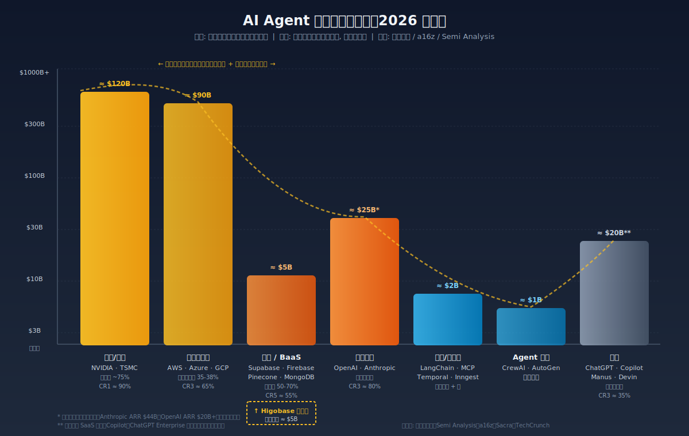
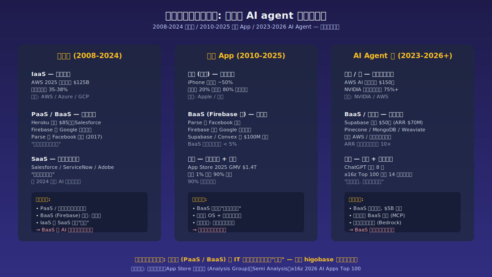
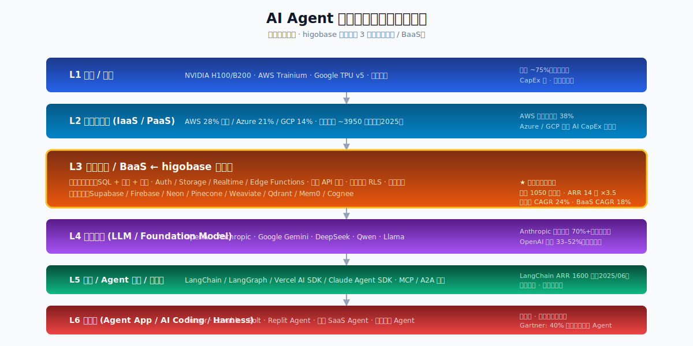
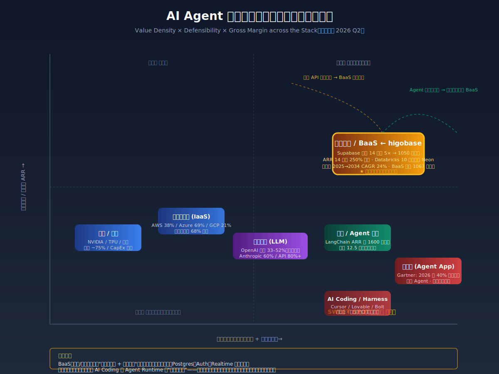
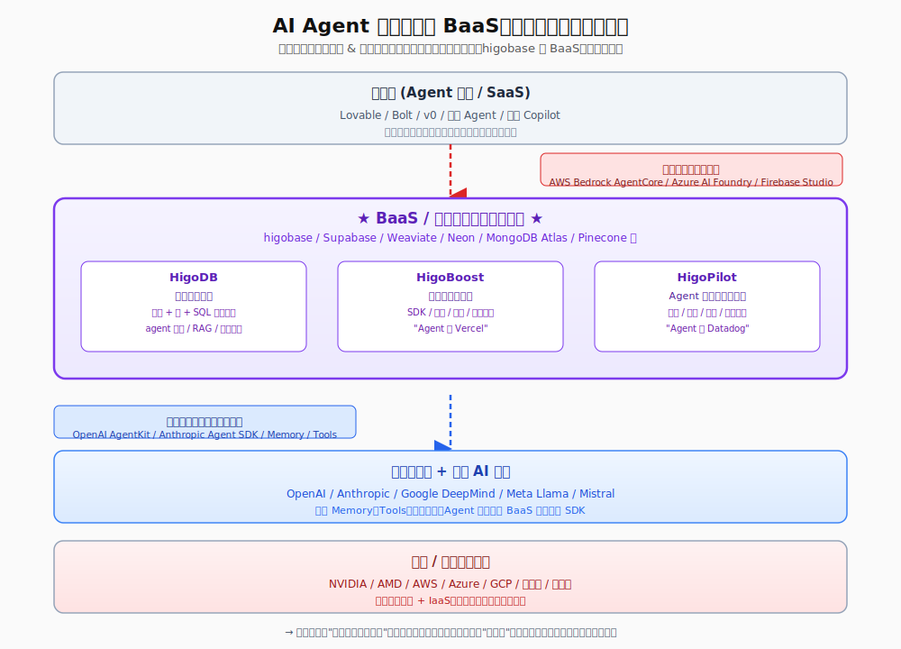
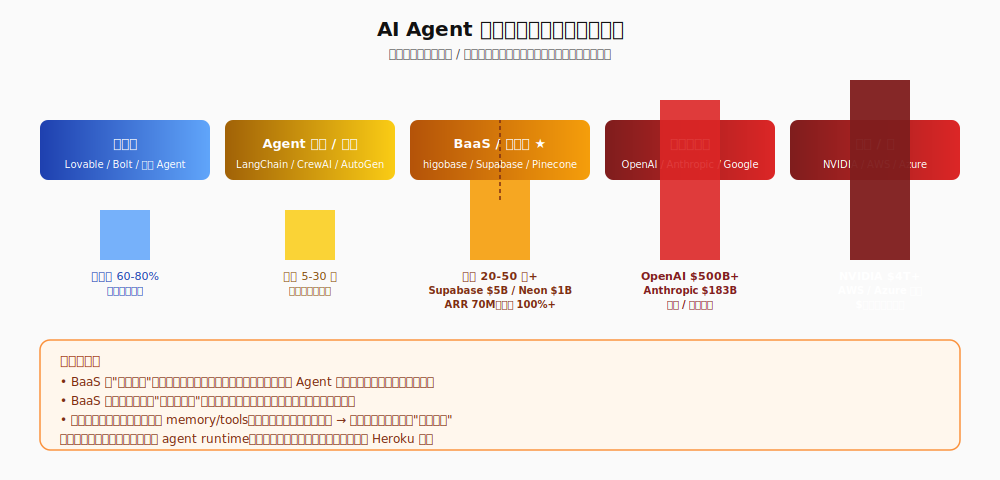

## 德说-第513期, 国产数据库 higobase 卡位 AI Agent 生产链
  
### 作者  
digoal  
  
### 日期  
2026-07-12  
  
### 标签  
AI , Agent , BaaS , Supabase , PostgreSQL , 瀚高 , 统一数据语义层 , Agent runtime 和可观测 , Agent 生命周期管理  
  
----  
  
## 背景  

2026 年 6 月，Supabase 一笔 F 轮融资 5 亿美元，估值冲到 105 亿美元。一年半前它还只是 20 亿美元。一时间"BaaS 是 AI agent 时代最大金矿"成了行业话术。higobase（瀚高）作为国内老牌 PostgreSQL 厂商，也顺势入局。

---

## 一、"最有价值"得看对谁说

为什么说 "BaaS 是 AI Agent 生产链上最有价值的一环" ? 得分析四个口径：营收规模？利润池？毛利率？战略卡位？四种口径给的答案虽然不同, 但作为数据库厂商(特别是兼容PG的数据库厂商), 它就是最有价值的(而这个将在下一节细说)。  

先看最直观的利润池 —— 按 2026 年估算的数据：

NVIDIA 一家拿走 AI 算力约 90% 的利润，AWS、Azure、GCP 三家云加起来拿走全球 IaaS/PaaS 约 68% 的份额。BaaS 这一层，整个独立第三方加起来年利润池估算也就 50 亿美元上下。

如果用利润池这个口径，结论是： **BaaS 不是产业链上最有价值的一环，而是被算力、云、模型三层夹在中间的"低洼地带"。**

为什么？还是那句老话 —— 价值链上"两端胜、中间败"几乎是 IT 行业的结构常数。1985 到 2010 的 PC 时代，Wintel 联盟拿走 60%+ 利润，OEM 戴尔惠普只有 3-5%；2010 到 2025 的移动 App 时代，苹果 20% 市占赚走 80% 利润，BaaS 类厂商只能在夹缝里收订阅费。

云计算 2008 到 2024 这段更值得对照。Heroku 当年估值数十亿美元，2010 年被 Salesforce 收购，2026 年 2 月 Salesforce 终于承认它已被边缘化，转入"维护工程模式"。Parse 被 Facebook 关停，Firebase 被 Google 收编后沦为 Cloud 引流工具。中间层独立存活的概率，几乎为零。  

所以"最有价值"这个话术，是营销话术，不是产业判断。 

那为什么说作为数据库厂商(特别是兼容PG的数据库厂商), BaaS 就是最有价值的?  

 

## 二、AI agent 时代，BaaS 的含金量确实变了 

把 BaaS 钉死在"中间低洼"也不公平。AI agent 跟传统 App 有个根本区别： **agent 是有状态的、长周期的、跨工具调用的**。每一轮调用都要读写持久化数据 —— 用户偏好、对话历史、知识图谱、向量嵌入、任务状态机。LLM 自己是无状态的，所有"记忆"的物质载体，都落在 BaaS 上。

Zylos 2026 年关于多 Agent 记忆架构的研究报告里有一句话值得反复读："Memory is the central unsolved problem in multi-agent AI systems." 同一份研究还披露了一个吓人的数字 —— 41-87% 的多 Agent 系统在生产中失败，其中 79% 的失败源自协调问题。协调问题落到物质层面，就是共享记忆、分层状态、权限审计 —— 说的还是 BaaS。  

这意味着 AI agent 时代，BaaS 多了三个传统 BaaS 没有的价值点：

1. **统一数据语义层**：向量 + 图 + SQL 混合检索，传统单点数据库满足不了。Pinecone 只有向量，Neo4j 只有图，Postgres 的向量能力 2024 年才刚够用。
2. **Agent runtime 和可观测**：传统 BaaS 不管"agent 一次跑 30 分钟、消耗 5 美元 token"这种长事务。需要新的编排监控 —— 成本治理、调用链追踪、合规审计。
3. **Agent 生命周期管理**：从 prompt 工程、灰度发布、A/B test 到回滚，BaaS 要从"存数据"升级成"管 agent"。

再往深了说, Agent 开发一款即时应用, 不也得需要后端的支持么? 而且在 Agent 的生产链上, 打造即时应用几乎是必然事件.  

higobase 把这条线拆成 HigoDB（数据引擎）+ HigoBoost（开发者平台）+ HigoPilot（Agent 全生命周期），落点都在这三个新增价值点。这个卡位，比纯向量库（Pinecone）、纯编排（LangChain）、纯 serverless Postgres（Neon）都更宽。

从这个角度看，"BaaS 在 AI agent 时代含金量变高"是成立的。

  

## 三、Supabase 为什么能涨 5 倍？资本已经在用脚投票

资本不会无缘无故追一个细分赛道。Supabase 估值从 2025 年 4 月的 20 亿美元，9 月跳到 50 亿，2026 年 6 月冲到 105 亿，一年半 ×5 倍 —— 同期 LangChain ARR 1600 万美元，估值 12.5 亿，BaaS 与编排框架的估值差超过 80 倍。

但这两层的技术复杂度并不差 80 倍。差的是什么？  

差的是**客户埋数据的深度**。Supabase 一个项目等于一份独占 Postgres + Auth + Storage + Realtime + Edge Functions + Vector 六个默认服务，外加自动生成的 REST/GraphQL API。客户的 schema、RLS 策略、Auth 用户表、Realtime channel 全沉淀进去。业务跑过 3 个月，迁移成本远高于续费。这是 Databricks 2025 年 5 月花约 10 亿美元收购 Neon 的原因 —— 不是 Neon 本身值 10 亿，是"serverless Postgres + AI agent 后端"这个生态位值 10 亿。  

还有一个被低估的网络效应： **PostgreSQL 已经被 LLM 学会**。Postgres 30 年的文档、Stack Overflow 回答、GitHub 历史全部进了训练数据，AI Coding 工具（Cursor、Bolt、Lovable、Replit、Claude Code）默认推荐 Postgres 的概率远高于其他数据库。LLM 把 Postgres 变成"模型的心智数据库"，BaaS 把 Postgres 变成"agent 的默认后端"。Supabase 平台上 60%+ 的新数据库由 AI 工具创建，这不是产品功能，是生态闭环。

所以资本买的不是"BaaS"四个字，是"BaaS + Postgres 网络效应 + AI Coding 闭环"的复利结构。

这套故事能不能复制到中国，是 higobase 真正的命题。

  

## 四、夹缝生存

把卡位再好，也得扛得住两个方向的夹击。  

**自下而上：基础模型厂商在吞 BaaS。** OpenAI 2025 年 10 月 DevDay 发布的 AgentKit，把 Connector Registry（接 SaaS）、Agent Builder（编排）、ChatKit（前端）打包到平台侧。Anthropic Claude Agent SDK 内置 18+ 工具，文件读写、Bash、Web 搜索、子代理、Plan Mode、MCP 生态全覆盖。Anthropic 2024 年 11 月推的 MCP（Model Context Protocol）甚至让模型直接读写数据库、文件、GitHub —— BaaS 的核心场景正在变成"MCP 工具"。  

**自上而下：云厂商在吞 Agent 平台。** AWS Bedrock AgentCore 推出 Runtime、Memory、Code Interpreter、Browser、Gateway、Observability、Identity 七件套，企业签一张 AWS 合同搞定一切。Azure AI Foundry 跟 Microsoft 365、OneLake、Power Platform 打通。Google Firebase Studio 2025 年 4 月上线，整合 Genkit + Project IDX + Gemini CLI + MCP 原生支持，从前端到部署全打包。Databricks 2026 年 6 月推的 Genie Ontology 押注"业务本体论"，开始向上吞应用层语义。  

中间层的命运，参考 Heroku：当 AWS 自上而下用 Beanstalk/Lambda/App Runner 挤压、Vercel/Netlify 从开发者侧挤压、Salesforce 在内部用 Hyperforce 替代时，曾经最炙手可热的 PaaS 标杆变成了"没人续约的中间件"。   
  
higobase 想不被夹击，必须在四件事上做深： **多云中立、自托管、私有化合规、Agent runtime 事实标准**。这四件事恰好是 OpenAI/Claude/AWS/Azure 各自最不擅长的 —— 也是中国信创、政企客户、私有化部署市场最有付费意愿的方向。
  
  
## 五、higobase 三件套 

higobase 三件套：

- **HigoDB（向量 + 图 + SQL 统一检索）** ：这是真痛点存在 —— 单点数据库满足不了 AI agent 的混合检索需求。OceanBase 2025 年 11 月开源的 seekdb、Databricks Genie 都在卡同一位置，证明赛道成立。但风险是 Postgres + pgvector + Apache AGE 已能拼出 80% 能力(PG 19 开始甚至都内置了 SQLPGQ 的功能)，开源组合对强工程客户来说成本更低。
- **HigoBoost（开发者体验平台）** ：v0/Lovable/Bolt 已验证"Vibe coding"开发者愿意为 DX 付费。但 Vercel/Replit/StackBlitz 已在卷，Anthropic Console/OpenAI Playground 自带 playground。护城河较浅，是三件套里最危险的一环。
- **HigoPilot（Agent 全生命周期）** ：这是 higobase 最值得押注的一环。Agent 监控、成本治理、token 路由、调用链追踪是企业落地的最大卡点 —— 92% 的 agent 项目停留在 Demo 阶段。LangSmith/Helicone/Portkey 已在做类似事情，但开源 + 自托管 + 多云中立 + 国产化合规的组合，目前没有完整对标。如果 18 个月内能把它做成事实标准，higobase 才算真正卡住位置。 

## higobase 醉翁之意

higobase 真正抢的不是"BaaS"四个字，而是 Agent 的状态/记忆/数据控制面(agent 时代的战略卡位、生态入口、长期复利与企业落地基础设施) —— memory、workflow state、权限、审计、成本、工具调用轨迹、业务数据的统一控制面。基本盘是国产化合规，更广阔的市场是"企业的 Agent control plane". 

   
  
#### [PostgreSQL 解决方案集合](../201706/20170601_02.md "40cff096e9ed7122c512b35d8561d9c8")
  
  
#### [德哥 / digoal's Github - 公益是一辈子的事.](https://github.com/digoal/blog/blob/master/README.md "22709685feb7cab07d30f30387f0a9ae")
  
  
#### [About 德哥](https://github.com/digoal/blog/blob/master/me/readme.md "a37735981e7704886ffd590565582dd0")
  
  

  
