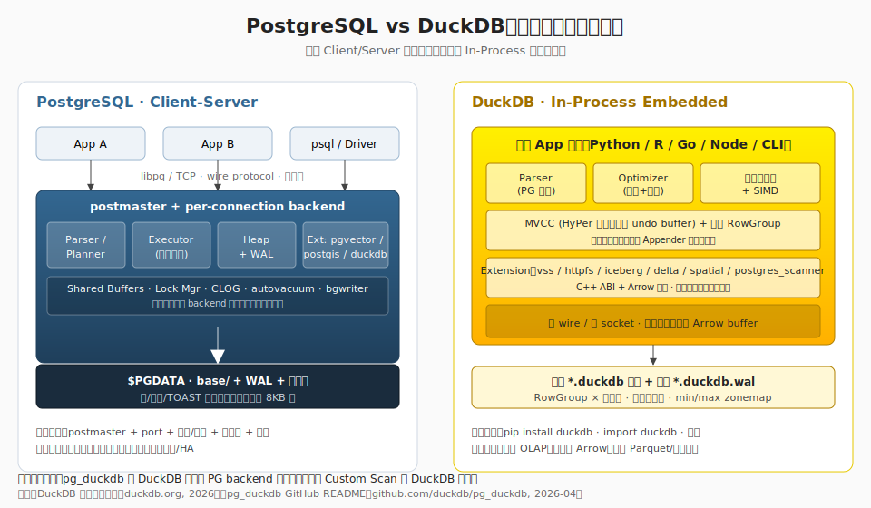
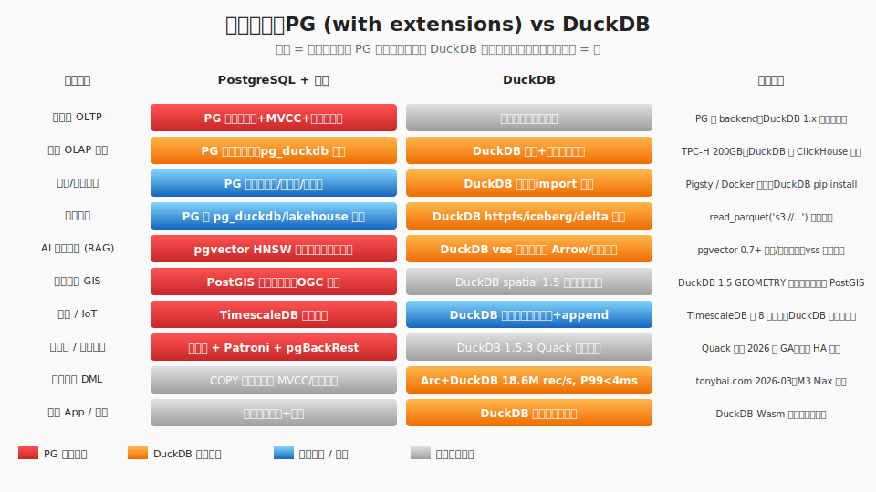
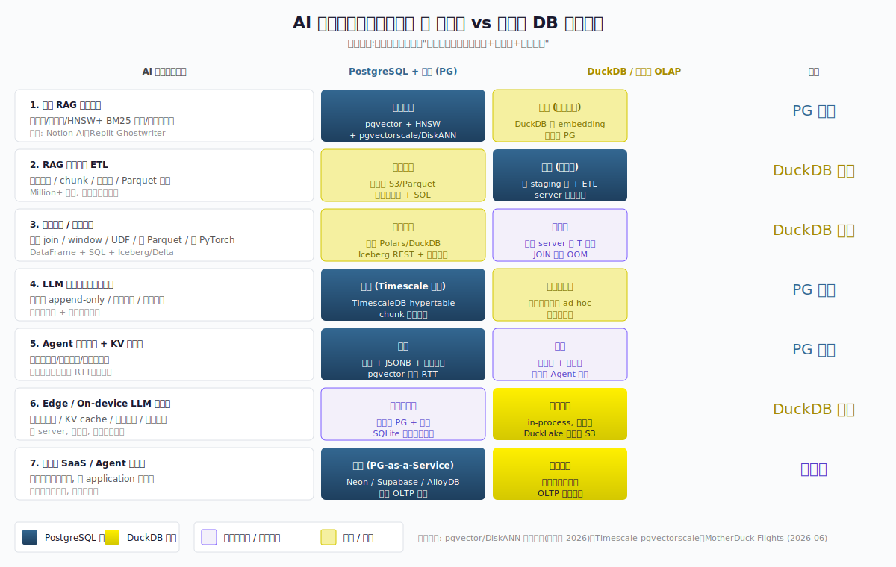
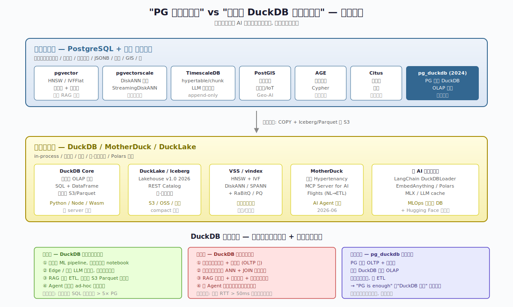
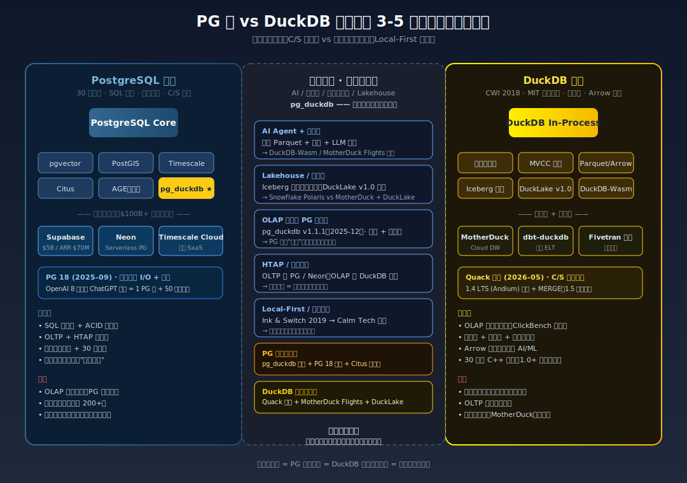

## 德说-第514期, PostgreSQL vs DuckDB - AI 开源数据底座之争
  
### 作者  
digoal  
  
### 日期  
2026-07-12  
  
### 标签  
PostgreSQL , DuckDB , AI , 开源数据库 , 数据底座 , 嵌入式 , 分析 , 向量化 , 插件 , 向量 , BM25 , 全文检索 , 图 , 混合检索    
  
----  
  
## 背景  
  
PostgreSQL 用户津津乐道的"PG is enough"哲学 —— 一个内核扛下 OLTP、向量、时序、空间、图、分析 —— 和 DuckDB 说的"嵌入式才是未来"到底谁更适合成为 AI 的开源数据底座？ 

这两看起来八竿子打不着的两个赛道下的产品, 能放到一起聊吗? 我认为能, 只要他们的用户场景有重叠, 并且这个应用场景还是热门的场景的话, 就有的了.

今天就来聊聊 AI Agent 应用场景下的: PG vs DuckDB 

---

## 两种范式：通用内核 vs 嵌入式加速器

 
**PostgreSQL** 是个 30 年历史的客户端-服务器架构的数据库。安装它要 initdb，要监听端口，要配 `pg_hba.conf`、用户、权限，要调 `shared_buffers`、`work_mem`、`autovacuum_*` 这一堆参数；运行起来之后会有 backend 进程、WAL、MVCC 多版本、备份/恢复/复制/HA 一整套体系。它的杀手锏是**扩展机制**：一个 `.control` 元信息文件 + 一个 `.sql` 注册脚本 + 一个 `.so` 动态库（解释：就是数据库不用重新编译，可以外挂功能模块的玩法），就能添加 pgvector、PostGIS、TimescaleDB、AGE、Citus 这些多模态能力。Pigsty 默认包里有 510 个扩展，包括 pgvector、PostGIS、TimescaleDB、AGE、Citus，以及我们后面要重点讲的 pg_duckdb。

**DuckDB** 是 2019 年由荷兰 CWI 研究所开源的 C++ 库，定位是"分析领域的 SQLite"。它没有独立服务器进程，没有端口，没有 wire protocol；它是直接寄生在应用进程里的一份代码，调用它就像调用一个本地函数。这种"嵌入式"听上去朴素，但带来的体验差距是数量级的：零 socket、零 protocol parse、零结果集反序列化、零部署心智 —— 没有 initdb、没有 pg_hba、没有 listen_addresses。



**一个像开店迎客（要门脸、要服务员、要菜单），一个像把厨房搬进自己家（想吃就开火）** 

把两个阵营的能力摊在一张图上看，差异会更直接： 



   

## 6 个维度的真实对比

把维度铺开来看，各有各的强项。

### 单进程 vs 客户端-服务器

DuckDB 嵌入式在数据量小（≤ 内存）、并发低（≤ 几十连接）时是绝对优势。但反转点出现在这些数量级附近：

- 数据量 ≤ 100GB：DuckDB 占优；超过 1TB，PG 行存的劣势通过 pg_duckdb / Citus 列存分担，反而可控。
- 并发：DuckDB 1.x 仍是单写者（MVCC 走 undo buffer 串行化写），100+ 并发连接分析会让它触发内部锁竞争；PG 一个连接一个 backend，借 pgbouncer 轻松上千连接。

但这不是谁更好，是不同象限里的最优。DuckDB 适合"单机分析、桌面/边缘、低运维"；PG 适合"多客户端、长生命周期、跨节点 HA"。

### 存算分离 

DuckDB 的存算分离是天然内嵌的 —— 存储可以是本地 `.duckdb` 文件，也可以是 S3 上的 Parquet/Iceberg，计算随时拉起：一份 1TB Parquet，64GB 内存单节点 HTTP 直读，查询在 20 分钟内完成。

PG 的存算分离需要更多零件：表空间、FDW、外部表注册。目前最成熟的是 pg_duckdb / pg_mooncake / pg_lake 三个扩展，其中 pg_duckdb 是 DuckDB 团队做的。

**关键差异**：DuckDB 的存算分离是无状态算子 + 数据文件的自描述文件，所以可以在 Lambda 里启一个 DuckDB 进程，跑完关掉，下次再启 —— 没有服务需要保活。PG 的存算分离必须维持一个长生命周期的 postmaster，状态在共享内存和 WAL 里。

### 对象存储原生 vs FDW

DuckDB 一行 SQL 就完事：

```sql
SELECT * FROM read_parquet('s3://bucket/data/*.parquet');
```

谓词下推到远端，列裁剪在客户端缓存层完成。

PG 要么装 duckdb_fdw（受限于 PG FDW 框架，行存转 parquet 性能差），要么走 pg_duckdb 扩展 —— 但目前 pg_duckdb 在数据类型转换上仍有不少坑：`numeric` 转 `double precision` 会丢精度（金融场景的会计金额碰都不能碰）、`jsonb` 读出来变 `json`、多维数组映射受限。

### Compact：Checkpoint vs VACUUM FULL

DuckDB 自动 checkpoint 触发后，把内存里所有 RowGroup 的脏数据刷到主文件，重写元数据，截断 WAL，原地完成，不需要临时表拷贝。

PG 普通 `VACUUM` 只标记死元组为可重用、不归还空间给 OS；这正是 PG 表膨胀的根因 —— 在大量 UPDATE/DELETE 场景下，文件可能膨胀到原始大小的几十甚至上百倍。`VACUUM FULL` 真正重写表，但会拿 `AccessExclusiveLock`，阻塞所有读写，生产时段几乎不能用；`pg_repack` / `pg_squeeze` 能在线重写，但要额外的扩展。(当然, 必须提一下 PG 19+ 已经内置了 repack, 不需要插件了.)  

差距的真相是：PG 把这个复杂性交给了 DBA，DuckDB 把它自动化了。

### 本地高速罐数据：Appender vs COPY

DuckDB Appender（C++/Python/R/Go binding 都有）专门为高速灌数据设计：跳过 SQL parse/plan，直接走列存 chunk 写入。社区测得 Go + DuckDB Appender 单机 18.6M rec/s、P50 < 0.5ms、P99 < 4ms（M3 Max 实测）。相同硬件下 PG 的 `COPY` 在 600 万行/s 量级。

但 PG 的 COPY 仍走 MVCC、仍生成 WAL，PG COPY 不比 DuckDB Appender 差多少，差的是没有 Appender 这种"绕过 SQL 层的低阶 API"。

提一嘴 : pg_bulkload 这个插件可以支持 PG 跳过写WAL来实现导入, 速度也有极大提升, 但是在物理流复制场景、逻辑复制场景, 这招会导致下游无法同步这种办法导入的数据.  

### 真正的"插件化多模态"

PG 扩展机制是 30 年沉淀下来的"扩展协议"，可以做到不重新编译 PG 内核就加上向量化引擎（pg_duckdb）、列存引擎（pg_mooncake）、图引擎（AGE）。DuckDB 扩展走 C++ ABI + Arrow 接口，INSTALL/LOAD 一行 SQL 拉取；生态已覆盖 vss（向量）、httpfs（S3）、iceberg/Delta、spatial（GIS，1.5 起 GEOMETRY 进核心）、postgres_scanner、quack（2026-05 新增的远程交互协议）。 **成熟度、文档完整度、版本兼容性都不如 PG 扩展生态** —— 毕竟 DuckDB 1.0 是 2024-06 才发布的。

  
## AI 场景到底谁更牛

把 AI 数据工作负载按 IO 模式、一致性需求、并发模型、生命周期拆开，至少有 7 类典型形态： 



第一类是在线 RAG 服务 —— 多租户、高并发、HNSW + BM25 混合、事务一致性，这一类 PG + pgvector 更合适。

第二类是 RAG 数据准备 ETL，大批文档清洗/chunk/向量化、一次写入多次重读，这一类 DuckDB 显著占优。

第三类是训练数据和特征工程，大表 JOIN、window、UDF、Parquet 落盘，DuckDB 的列存 + 向量化在这里拉开差距。DeepSeek 就用了 DuckDB 改成集群版本的 SmallPond 在训练场景.  

第四类是 LLM 推理日志与可观测性，多租户 append-only、时间窗口聚合，PG + TimescaleDB 更合适。

第五类是 Agent 长期记忆和 KV 上下文，每会话状态、工具结果、跨会话检索，PG 在事务一致性和并发读写上更稳。

第六类是 Edge / On-device LLM 数据层，本地知识库、离线可用，这是少数对纯嵌入式数据库有结构性优势的场景，DuckDB / SQLite 占优。

第七类是单租户 SaaS / Agent 进程内，一家客户一份数据、与 application 同进程，DuckDB 或 pg_duckdb 皆可。

**结论**：这 7 类里只有第 6 类对纯嵌入式有结构性优势；第 2、3 类偏 OLAP，DuckDB 显著占优；第 1、4、5 类偏在线长链路，PG + 扩展仍占优；第 7 类两者皆可。

那向量检索这条 AI 核心赛道呢？

pgvector HNSW（解释：HNSW 是一种"近似最近邻"索引算法，简单说就是给高维向量搭一张快速查找的导航图）已经能并行构建，在 64 vCPU / 512GB 实例上对 1.5 万维 × 10M 行 HNSW 并行构建索引时间较单线程提升约 30 倍；

pgvectorscale 引入 DiskANN/StreamingDiskANN，可达十亿级向量 + 持久化索引（DiskANN 是另一种向量索引算法，能把索引放在磁盘上而不是全塞内存，容量上限大得多）。

vectorchord 通过 rabitq + ivf 支持十亿级别以上向量的高效检索.  

DuckDB-vss 仍是实验性质，在生产稳定性上差一截。 **Java 生态基本把"PG + PGVector"当默认向量后端** —— 这说明在 Java RAG 这个真实生产场景里，DuckDB-VSS 根本还未进入生产。 

不过 DuckDB-vss 是实验性质不代表它没有进步：2026-04 社区分支 Icemap/duckdb-vector-index 已经支持 HNSW/IVF/DiskANN/SPANN + RaBitQ/PQ，社区在加速追赶。"PG 永远占优"这话过于绝对。  

但AI检索其实不仅仅是向量检索, 还有图、关键词、全文检索等混合检索场景, 这方面依旧是PG占优.  
  
## pg_duckdb：双引擎的合流点

说到两个范式的合流，就不能不提 pg_duckdb。这是 DuckDB 团队自己做的扩展，让 PG 的优化器把"分析型"查询下推到嵌入在 PG backend 里的 DuckDB 引擎。EXPLAIN 里能看到 `Custom Scan (DuckDBScan)`，等于 PG 用户不需要 ETL、不需要换数据库，就能拿到列存 + 向量化（向量化 = 一次处理一批数据而非一条条算，CPU 利用率高得多）的性能。



这种"内核是 PG、加速器是 DuckDB"的混合架构，在 HTAP 场景（HTAP = 同一个系统里同时跑事务型和分析型查询）里目前是最务实的折中。  

**但这不代表PG赢了**：

1. **类型转换坑**：`numeric` 转 `double precision` 会丢精度 —— 金融场景的会计金额碰都不能碰。这是 PG 严谨的事务型数值和 DuckDB 浮点列存假设之间的范式冲突，不是补丁能修的。
2. **并发模型冲突**：DuckDB 是单写者，PG 是多 backend。pg_duckdb 把 DuckDB 嵌进 PG backend 后，**OLAP 加速的有效并发就被 DuckDB 的串行化写封顶了** —— HTAP 的 OLAP 端又退回到单写者。  
  

## 商业化与生态：谁在生产里用

光看技术不够，得看谁在掏钱、谁在跑生产。



**PG 系**有几个标志性案例：

- **OpenAI ChatGPT 主库**：8 亿用户主库 = 1 个 PG 主库 + ~50 只读副本。这是 PG 在大流量 AI 生产环境里的硬证据。
- **Supabase**：2026-06 F 轮融资 5 亿美元，估值 $10.5B。
- **Neon**：Serverless PG（Serverless = 不需要预先规划服务器配置，按需启停、按用量付费），存储计算分离架构（Pageserver + Safekeeper + Proxy），被业界视为 PG 在云原生方向的代表项目。

**DuckDB 系**的旗手是 **MotherDuck** —— 把 DuckDB 带到云端，补齐"嵌入式 → 协同"的关键一环。2026-06 发布 Flights，定位是"AI Agent 数据管道入口"，让 Claude/ChatGPT/Gemini 通过 Python 调度数据。其他动作还包括 Fivetran Connector、MCP Server、Hypertenancy 多租户。

但需要注意： **MotherDuck 至今未披露 ARR**。能证明 DuckDB 嵌入式范式商业化跑通的硬指标之一是"MotherDuck ARR 在 2027 年前突破 1 亿美元" —— 目前还没达成。

再看 DuckDB 1.5 系列：包含 Quack 协议（官方 C/S 协议，相当于 DuckDB 主动向"嵌入式 vs C/S 二选一"叙事投降）、DuckLake v1.0（轻量 Lakehouse 协议，用 SQL 数据库做元数据 + Parquet 做数据）。

**MotherDuck 的真正对手不是 PG 系，而是 Snowflake 和 Databricks** —— DuckDB 的卡位是"小数据 + AI + 端侧"，Snowflake 是"大数据 + DWH"。两者目前并不正面交火，但随着 Iceberg / DuckLake 把数据湖和仓库的边界打穿，三方会逐步走到同一个战场。

  

## 怎么选：实操建议

回到工程实践，技术决策要给团队落地路径。

### 选 DuckDB 的场景

- **数据科学 notebook**：单机 ad-hoc 分析，Polars + DuckDB pipeline 比 PG server 模式快 3-10× 。
- **AI Agent 进程内数据探索**：不想拉起 PG 容器，pip install duckdb 就完事。
- **RAG 离线文档处理**：直读 S3 Parquet，免 ETL 落地。
- **Edge / 本地 LLM 知识库**：设备内存够（16GB+ 主流），DuckDB / SQLite 形态胜过一切 server。

### 选 PG 的场景

- **企业核心 OLTP**：银行、电信、ERP，30 年 SQL 标准 + ACID + MVCC + 强一致，30 年生态惯性比想象深。 
- **在线 RAG 服务**：多租户 + 高并发 + HNSW + 事务一致性，PG + pgvector + pgvectorscale 是当前最稳的组合。
- **多模联合查询**：向量 + 时序 + 空间 + 图一起 join，PG 的扩展协议让这些能力和原表共享同一套事务、同一份 WAL、同一个备份工具。
- **7×24 长生命周期服务**：PG 的 Patroni + 流复制 HA 体系打磨了 8 年以上。   

### 选 pg_duckdb 的场景

- HTAP：OLTP + OLAP 同一进程，PG 主干 + DuckDB 加速器，但要注意类型转换坑和并发封顶问题。  

## 结尾 

把上面这些都串起来，未来 3-5 年我的判断是：  

1. **PG 在 OLTP / 企业 HTAP 的地位不可撼动**，SQL 标准 + ACID + 30 年生态决定了没有任何嵌入式 OLAP 能在 3-5 年内撼动。  
2. **DuckDB 可能会在"小数据 + AI Agent + 数据湖 + 嵌入式分析"四个场景反超 PG**，成为这些场景的默认选择, 但更大的 AI 使用场景开源 PG 还是首选. 
3. **pg_duckdb 不是 PG 的投降，也不是 DuckDB 的寄生，而是双引擎融合的标志** —— 未来 HTAP 系统的标准架构就是"OLTP 一个引擎 + OLAP 一个引擎，在同一进程或同一查询计划中调度"。
4. **嵌入式范式不会吃掉 C/S 范式，而是吃掉 C/S 范式最尴尬的"小数据 + 临时分析"那一块**。C/S 在企业核心系统、跨地域、强一致场景仍不可替代。
5. **DuckDB 真正的对手不是 PG，也不是 Snowflake，而是 ClickHouse、Redshift 这一类"中小规模 OLAP + 传统 ETL"厂商** —— 他们正好被 DuckDB 的崛起精准打击。
  
"PG is enough" 对吗？PG 在 OLTP + 中小规模 HTAP 仍是无敌的，但 pg_duckdb 这个项目的存在本身就是 PG 社区承认了"DuckDB 在AP、在村算分离等维度更强"。  

"PG is enough"是对的, 因为 PG 的插件化架构使得 pg_duckdb 成为可能, 未来如果出现更牛的技术, PG 还是可以通过插件整合进来.   

你觉得呢?  
  
  
  
#### [PostgreSQL 解决方案集合](../201706/20170601_02.md "40cff096e9ed7122c512b35d8561d9c8")
  
  
#### [德哥 / digoal's Github - 公益是一辈子的事.](https://github.com/digoal/blog/blob/master/README.md "22709685feb7cab07d30f30387f0a9ae")
  
  
#### [About 德哥](https://github.com/digoal/blog/blob/master/me/readme.md "a37735981e7704886ffd590565582dd0")
  
  

  
