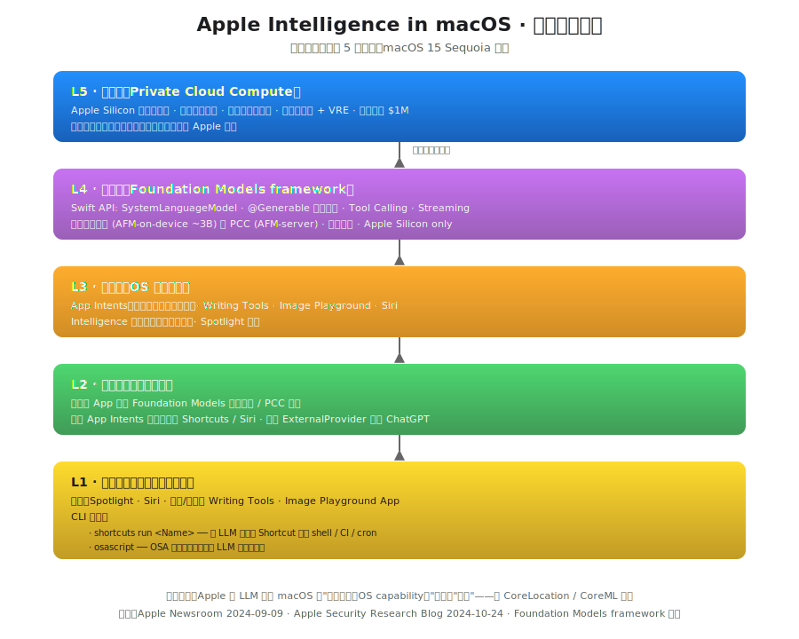
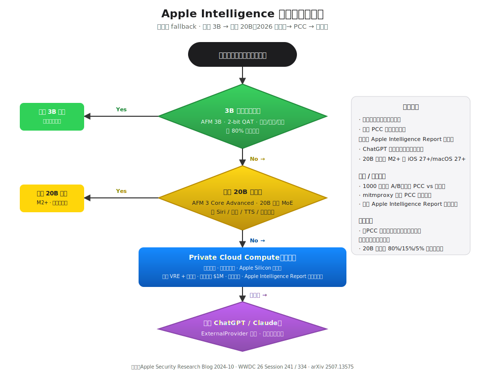
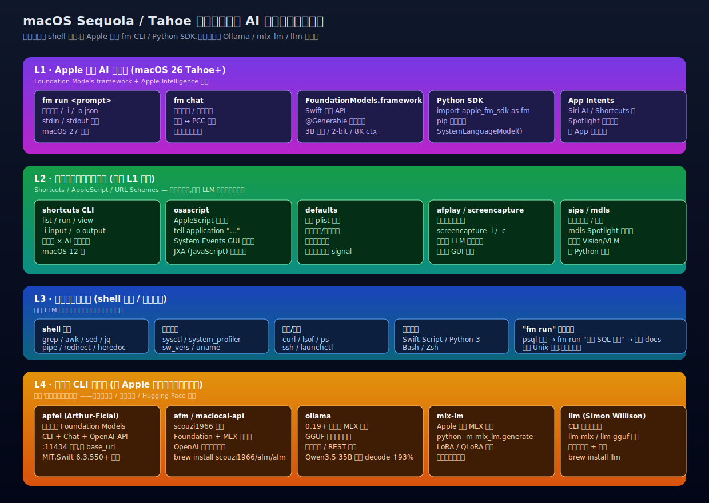

## 德说-第516期, 苹果在 AI 时代掉队了, 没!
  
### 作者  
digoal  
  
### 日期  
2026-07-14  
  
### 标签  
苹果 , 最强生产力工具 , AI , LLM , 大模型 , 四层路由 , 加强生产力 , 命令行 , 自动化编排 , PCC , 外部大模型供应商 , 本地模型 , 3B , 20B   
  
----  
  
## 背景  

大家都说 AI 时代苹果是不是掉队了, 我可以负责任的告诉大家, 苹果下一代操作系统就会闪瞎这些人的钛合金眼睛. 

先抛出一个个人判断: **苹果核心竞争力是“最强的生产力工具”, 这点应该没人反驳吧(不管你是程序员还是设计师或者是剪辑人员或者是音乐人)? 那么苹果做 AI 的目的也是: 维持苹果设备是最强生产力工具的事实, 甚至降低使用门槛, 拓展更多非专业人士的专业能力.** 

有了这个观点, 我们再来谈苹果的 AI 战略.  

Apple 的做法是把 LLM 嵌进系统层级 —— 和 CoreLocation、CoreML 同级，而不是摆在 App Store 里让你下载。Apple 想要的不是"更好的 ChatGPT 客户端"，而是让 AI 变成 macOS 本身的一个能力。

开发者入口是 **Foundation Models framework**，macOS 27 起还会有官方 `fm` CLI。 

如何理解苹果的 AI 布局？

如果你只看接口，会觉得眼花缭乱 —— `fm` CLI、Python SDK、Foundation Models framework、`apfel`、`afm`、`ollama`、`mlx-lm`，再加上 PCC、PCC-GCP、Apple Intelligence Report，名词能列出 20 个。但如果你从三个维度切进去 —— 能力放在哪一层、请求怎么路由、命令行怎么编排 —— 这套布局的主线其实只有一条： **Apple 主动让出"大模型市场"给第三方，自己占据系统级位置**。

下面分四节展开。

---

## 把 AI 融入系统原语

Apple Intelligence 在 macOS 里不是"一个应用"，而是分了 5 层塞进操作系统的不同位置。看一眼这张图就够了：

最上层是 Private Cloud Compute（PCC） —— Apple Silicon 服务器集群，公开 VRE(Virtual Research Environment) + 100 万美元漏洞悬赏 —— 架构层面公开可审计，但运行时的行为依赖独立研究者持续审计（细节留到隐私那一节再展开）。

模型层是 Foundation Models framework —— Swift 原生 API（`SystemLanguageModel`、`@Generable`、`Tool` 协议），同时绑定端侧和 PCC，开发者不用关心请求去了哪里。(个人理解苹果本地模型强在与苹果自身系统内置应用融合的能力, 可能比外部模型强很多, 而且本地模型与苹果M系列芯片GPU算力的整合丝滑.)  

系统层是 OS 内置服务 —— App Intents、Writing Tools、Image Playground、Siri、Intelligence 索引 —— 它们是用户能感知的"AI 功能"，但实际上是上层接口的具体表达。

应用层是第三方 App —— 通过 Foundation Models 调用端侧/PCC 模型，或通过 ExternalProvider 调用 ChatGPT。

用户层是终端用户与自动化的入口 —— Spotlight、Siri、邮件/备忘录里的 Writing Tools，以及两个对开发者最关键的 CLI：`shortcuts run` 和 macOS 27 之后的 `fm`。

关键判断：这套分层不是在"画一个 App"，而是在把 LLM 做成 macOS 的一个子系统。它和 CoreLocation、EventKit 同级 —— 你不会问"CoreLocation 是哪个 App"，你也不会问"Apple Intelligence 是哪个 App"。这是和 OpenAI/Anthropic 路线最大的区别：Apple 没有去抢"AI 应用"这个身位，它在抢"AI 系统能力"这个身位。

未来持续观察 Foundation Models framework 的 API 是否在持续扩展、第三方 App 接入数量是否在增长、Apple Intelligence 月活渗透率。   

  

## 路由决策 

早期讨论都说 Apple 是"本地 → PCC → ChatGPT"三段，但 2026 年 WWDC 之后，端侧多了一个 20B 稀疏 MoE 模型（AFM 3 Core Advanced），路由其实已经是四段了：

3B 端侧（AFM 3 Core）覆盖约 80% 高频场景 —— 摘要、改写、分类、Shortcuts 自动化、Siri 基础 NLU。论文 arXiv 2507.13575 给出的方案是 2-bit QAT 量化 + KV-cache 共享，能把权重压到约 0.75 GB，常驻内存，M1+ 设备直接跑。

20B 端侧（AFM 3 Core Advanced）是 2026 年新增，总参数 20B 但单 token 激活 1–4B，适合新 Siri 多步推理、听写、TTS、图像理解这类"端侧能做但 3B 撑不住"的场景。

PCC 是兜底层 —— 端侧置信度不足、任务超出本地能力范围时，请求上行到 PCC 节点。Apple Silicon 服务器、不可持久化、公开源码。 **注意**：PCC 触发是静默的，UI 不弹窗，事后通过 Apple Intelligence Report 审计。这点和"分层可见性"的叙事有距离 —— 你能审计的是"异常路径"，不是"实时透明"。  

ExternalProvider（ChatGPT / Claude）是最后的兜底 —— 只有用户显式同意（每次弹窗或首次整体授权）才走 OpenAI 或 Anthropic。  

  

## 命令行版图   

如果说能力分层决定 AI 的模型路由，命令行版图决定开发者怎么用。  

  
CLI 工具矩阵按从官方到第三方分四层。  

**L1（Apple 原生 AI 接口层）** 是 `fm run`/`fm chat`（WWDC 26 公告，预计随 macOS 27 落地）、Foundation Models Swift API、Python SDK（`import apple_fm_sdk as fm`）、App Intents。  
  
**L2（Apple 官方自动化总线）** 是 `shortcuts`、`osascript`、`defaults`、`afplay`、`screencapture`、`sips`、`mdls` —— 这些本身不是 LLM 工具，但全都能被 LLM 编排。  
  
**L3** 是经典 shell 原语（grep/awk/sed/jq/curl/ssh）。   
   
**L4（第三方 CLI）** 是 `apfel`（Arthur-Ficial 出品，包装 Foundation Models，提供 OpenAI 兼容 HTTP server 在 `localhost:11434` 监听）、`afm`/`maclocal-api`（scouzi1966 出品，同时支持 Foundation Models 与 MLX）、`ollama`（2026-03 v0.19 切到 MLX 后端）、`mlx-lm`（Apple MLX 团队官方）。   
   
注解：   

`fm` CLI 是 WWDC 26 Session 334 公告的官方命令，预计随 macOS 27 落地。 **注意**：这是已公告但未发布的状态，macOS 26 Tahoe 上 `which fm` 仍然找不到。  

`apfel` 填补了 macOS 26 时代官方 CLI 的真空。如果你今天就想用 Apple 内置模型 + Unix 管道，`apfel "你的 prompt"` 比等 macOS 27 更现实。  

`shortcuts` CLI 才是真正的"逃生通道" —— 它从 macOS 12 Monterey 起就把 GUI 自动化暴露给 Terminal 了，任何含 Writing Tools、Genmoji 动作的 Shortcut 都可以通过 `shortcuts run <name>` 触发，stdout/stdin 双向管道，配合 CI、cron、shell 脚本。LLM 让 Shortcuts 变得可"自然语言编排"，CLI 反而是把它接进自动化流水线的桥梁。  (依赖图形界面操作的任务自动化编排, 以前用 shortcuts CLI 支持, 现在有了 AI 更加丝滑, 可自然语言编排 shortcuts 了.)  

Apple 的战略选择： **Apple 主动让出"大模型市场"给第三方** —— 你做 MLX 微调、跑 70B 模型、用 Ollama 的全量模型市场，Apple 不和你争。Apple 占据的是"系统级位置" —— Foundation Models framework 作为标准入口、App Intents 作为应用可发现性基础设施、PCC 作为隐私标杆。这不是"互补"，是主动放弃 + 主动占据的组合。 

## 隐私架构 

隐私是 Apple 这套布局里最有差异化、也最容易被过度解读的部分。  

第一，**PCC 的承诺是"架构层面可验证"，不是"运行时全面成立"** 。Apple 在 2024 年 10 月公开了 PCC Security Guide、Virtual Research Environment（VRE，让研究者在本地复现 PCC 节点）、100 万美元漏洞悬赏，以及 GitHub 上开源的 `splunkloggingd`（日志过滤守护进程）。这些是设计目标的公开承诺 —— 节点无状态、无特权访问、二进制签名通过 transparency log 发布，设备在发送请求前会验证节点 attestation。如果 Apple 哪天悄悄给 PCC 加后门，所有 Apple 设备会在 24 小时内拒绝连接。  

但"运行时尚未全面成立"。VRE 是研究环境，不是生产镜像；`splunkloggingd` 过滤的是显式字段，timing/pattern 等 side-channel 元数据不在过滤范围；100 万悬赏截至 2026-07 仍未被领取 —— 这不能反过来证明"没有漏洞"，安全研究通常以年为单位，悬赏运行不到两年，结论过早。  

第二， **"No Logging" 的准确含义是 "No User-Content Logging"** ，不是"No Information Disclosure"。Apple 没有说 PCC 不产生任何日志，而是说不持久化与用户请求相关的日志。元数据（节点 ID、查询耗时、错误码）仍然外发，特定用户的请求模式（时间戳 + 错误率 + 请求长度分布）在理论上足以做 re-identification。  

第三，**PCC-GCP 节点 + NVIDIA Blackwell + 双供应商信任根是 2026-06 才公告的**，独立审计时间窗口不足一个月。InfoQ 和 EEWP 的报道确认了 Intel TDX（CPU 层）+ NVIDIA Blackwell Confidential Computing（GPU 层）+ Google Titan（硬件根）的三重认证 —— 但 VRE 是否覆盖到 GCP 节点、Apple 公钥对 GCP 二进制的 attestation 链是否已公开、splunkloggingd 在 Blackwell 上的移植是否完成 —— 这些都还需要独立研究者验证。Apple 的设计目标是好的，运行时证据尚不充分。  

**适用边界**：PCC 的"数据不回传"承诺在以下场景成立 —— 非政府合法请求场景、无物理接触 PCC 节点的场景、无提示注入的场景。政府和物理访问场景下，Secure Enclave 防软件攻击但不防物理 probing，这是 TEE 的通用局限。   

**验证方法**：用 VRE 在本地复现 PCC 节点，注入测试请求并 dump 内存 —— 若发现持久化文件即证伪；mitmproxy 分析 PCC 流量模式；导出 Apple Intelligence Report JSON（系统设置 → 隐私与安全性 → Apple Intelligence 报告）验证请求路径。    
 
再看一下友商翻车记录： 
  
Microsoft Recall（2024 翻车后 2025-04 修复，默认关闭、本地 NPU 推理、VBS Enclave 保护）的设计哲学是"全量记忆 + 本地保护" —— 攻击者拿到笔记本就能 dump 历史。
  
OpenAI ChatGPT Mac（2024-07 修复前的明文存储漏洞由 Pedro Vieito 公开）走的是"云端为主 + 客户端沙箱" —— 数据外泄风险随服务端。
  
Google Gemini Mac（2026-04 发布，原生 Swift 应用）走的是"完全云端 + 屏幕共享可选" —— 屏幕内容一旦共享即上传 Google。
  
而 Apple Intelligence 走的是"本地优先 + PCC 无状态 + ChatGPT opt-in" —— 风险留在云端（无状态），本地模型不带用户历史。  
  
这是范式上的对立，不是"哪家更安全"的简单排序。  

    
   
## 写在最后

**Apple 把内置 LLM 的能力做成系统原语，不做成独立产品**。这意味着你不能用"应用 vs 应用"的眼光看 Apple Intelligence 和第三方 CLI —— 它们之间是系统层与应用层的协作关系，不是直接竞争。 

苹果核心竞争力是“最强的生产力工具”, 那么苹果做 AI 的目的也是: 维持苹果设备是最强生产力工具的事实, 甚至降低使用门槛, 拓展更多非专业人士的专业能力.  

三个核心观点串一下：

1. **能力分层**：AI 是 macOS 的子系统，和 CoreLocation 同级，不是 App Store 里下载的应用。
2. **路由决策**：四段式（3B → 20B → PCC → ExternalProvider），每段都有边界，80% 高频场景端侧完成，剩余的才上行。
3. **命令行版图**：`shortcuts` 是 macOS 12 就写好的 GUI 自动化任务编排“逃生通道”，`fm` 是内置的模型调用 CLI，第三方（Ollama/MLX）填补 Apple 主动让出的"大模型市场"，Apple 占据系统级入口。

  
苹果股票依旧值得持有.  本文非投资建议, 不负任何责任, 仅作观点交流, 投资需谨慎, 自己负责.  
  
   
---

## 主要参考

- Apple arXiv 2507.13575：Apple Intelligence Foundation Language Models
- Apple Security Research Blog 2024-10：Private Cloud Compute 安全白皮书
- WWDC 26 Session 241 / 334：Foundation Models framework 与 fm CLI 公告
- Apple Support：Run shortcuts from the command line
- Apple Developer：Foundation Models framework 文档

  
  
#### [PostgreSQL 解决方案集合](../201706/20170601_02.md "40cff096e9ed7122c512b35d8561d9c8")
  
  
#### [德哥 / digoal's Github - 公益是一辈子的事.](https://github.com/digoal/blog/blob/master/README.md "22709685feb7cab07d30f30387f0a9ae")
  
  
#### [About 德哥](https://github.com/digoal/blog/blob/master/me/readme.md "a37735981e7704886ffd590565582dd0")
  
  

  
