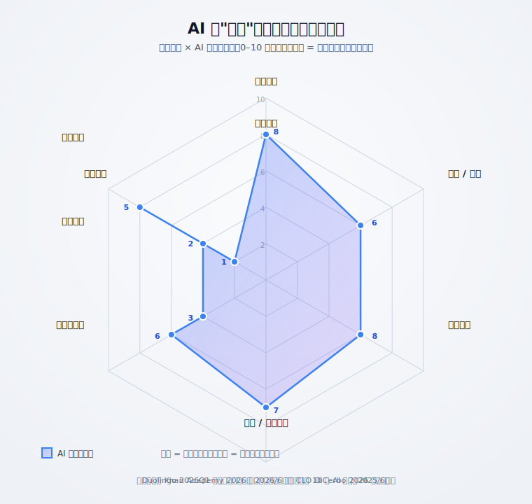
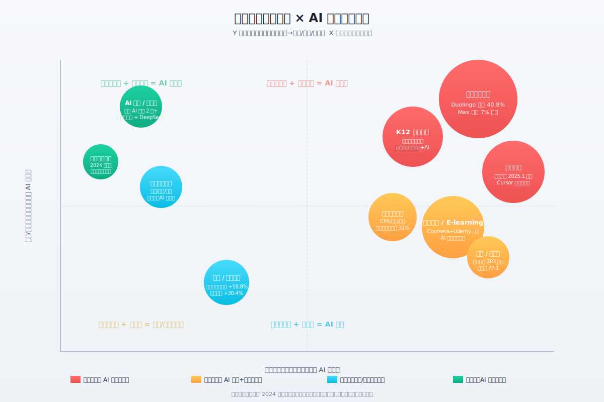

## 德说-第518期, AI 把教培行业逼成了“教陪”行业
  
### 作者  
digoal  
  
### 日期  
2026-07-15  
  
### 标签  
AI , 教培 , 教陪 , 知识 , 信息 , 结果 , 认证 , 动机 , 陪伴 , 学习反人性 
  
----  
  
## 背景  

> 先说结论：培训行业不会消失，会洗牌。AI 会把"卖信息"那一半压到接近免费, 而"卖结果 / 卖认证 / 卖动机 / 卖陪伴"那一半反而推得更贵。

---

传统培训行业正在被 AI 砸烂 —— ChatGPT 上线一年，可汗学院就掏出"AI 家教" Khanmigo，作业帮把"AI 超级老师"塞进学习机，连多邻国都靠 GPT-4 把日活跃用户一年推高 51%。再过两年，新闻口风变了：Chegg 39 个月蒸发 99% 的市值，多邻国股价腰斩一半，连全球最强非营利教育机构可汗学院自家的 Khanmigo，也被创始人亲口承认"许多学生不怎么用"。

同一个行业，半年讲一个故事，这本身就值得琢磨。

但我想说的是： **AI 没有"干翻"培训行业，它只是用一种蛮横但讲得通的方式，把培训行业劈成了两半** —— 一半在被压价，甚至被清场；另一半反而更值钱。行业没消亡，是洗牌。

  

 
## 先说什么是“培训”

"培训"是个被用滥的词。它至少塞了 9 件不太一样的事：把概念讲清楚、答疑、批改、口语陪练、推荐一条适合你的学习路径、管住你别走神、给你情感上的安全感，再加上签发证书和升学/升职/找工作背书。

AI 在这 9 件事上的成熟度差别非常大 —— 大到不能用一句话回答。把它们摊在雷达图上，是这样的：

挑几个最值得说的看： 

- **批改（8 分）和讲解（8 分）** ：AI 已经能做到 80 分以上。学而思学习机 2024 年替学生订正错题近 7500 万道、批改作文 629 万次 —— 这事不是"演示"，是已经规模化交付的能力。
- **答疑（6 分）** ：表面上够用，但有几个坑。多伦多大学出过一道"魔鬼测试"：给数学题加个双重否定，顶级模型准确率从近满分直接掉到 0。南方都市报 2025 年让豆包、Kimi、文心、通义、DeepSeek 等 10 款大模型同答一道高考题，结果**同一题给出四种不同的答案**，被质疑后还会"为迎合你改答案编理由"。
- **动机（3 分）和情感陪伴（2 分）** ：这是 AI 真正栽跟头的地方。 AI 永远无法解决“学习是反人性的”这件事!  
- **认证背书（1 分）** ：AI 不能签发学历和执业证书 —— 这压根不是技术问题，是制度。制度是最后一道防线.  

雷达图里"高中低"的分界，就是后面整篇文章要站住的核心： **AI 真正能砍的是左边的高分项（信息搬运类），左边低分项（动机、情感、认证）短期内反而更值钱。**

   
## AI 辅导产品样本研究

### 天花板: Khanmigo (可汗学院) 

如果有一个产品能代表"AI 辅导的天花板"，那一定是 Khanmigo。可汗学院是美国最早的非营利在线教育平台，OpenAI 把早期 GPT-4 试用权给了他们，微软还给 49 个国家的教师赞助了许可证。三年下来，他们到底做到了什么？

- 可汗学院自家 A/B 跑过 1500 万条 tutoring 互动，整体 next-item correctness 只提升 **6.1 个百分点**。听着不多对吧？这就是"全行业最好 AI 辅导产品"的真实效果。
- 斯坦福主导、跨多校、1000 多学生参与的大型 RCT 给出的整体结论是： **没发现统计意义上显著的学习增益**。
- Khan Lab 自己做的某项窄口径研究报了"学生多学约 0.3 SD、约等于多学一年" —— 这是个子样本、窄指标，跟上面那两条阴性整体结论是同一项目的不同切片。
- 萨尔·可汗本人在 2026 年 4 月承认"许多学生不怎么使用"，把"AI 减少 90% 教师行政任务"的预言**从 2024 年底自己推迟到 2034 年**。

**为什么我把这条单独拎出来讲？** 因为这是"AI 已被证明能替代真人辅导"这种乐观叙事的最佳反例 —— 产品很好、条件最好、跑了三年，结果就是这。

如果我再做个对比：另一个研究范式（Bloom 1984）显示，真正能让教学起效的是"一对一辅导 + 掌握学习法"，效果比大班课高约 2 个标准差。但 Bloom 自己说，**关键不是"一对一"这件事本身，而是三件组合**：形成性测试、矫正性反馈、晋级门槛。 **这恰恰是 AI 擅长的事**；讽刺的是 AI 也栽在动机环节 —— 如果学生不情愿坐下来被追问，你拿再聪明的 AI 也没用。

> **这条结论的边界**：Khanmigo 的失败不能直接套到所有 AI 辅导头上。中国这边有厂商自报"AI 超级老师学习提升率 42.85%"，但那是厂商评估，不是独立 RCT 长期跟踪；信源上应打折扣。 **判别一个 AI 教学产品是不是真有效果的金标准只有两条：是不是第三方 RCT？样本量过千了吗？**

   

### Duolingo 的双面：AI 加持增长、又被 AI 反噬 

如果说 Khanmigo 是教育非营利的标杆，那 Duolingo 就是商业化最强的 AI 教学样本。这家公司的故事必须**两面并陈**，因为它正好踩在"AI 重新画地图"这件事的两侧：

**左侧：2023–2024 年的增长奇迹。** Duolingo Max（GPT-4 加持的口语陪练）2023 年 3 月上线 Roleplay、Explain My Answer，2024 年 9 月加了 Video Call with Lily。公司全年营收 +40.8%，日活破亿，Max 订阅 167.99 美元/年（是普通 Super 的两倍），Max 占总订阅 7%。AI 加持版本既上了量，又加了价。这商业模型漂亮到能写教科书。

**右侧：2025 年 5 月之后的急转。** GPT-5 在 2025 年 8 月做了一段现场演示：只用一段简短提示词，就生成出一套语言学习工具。Duolingo 的"AI 加持溢价"瞬间被市场重新定价 —— 股价从 5 月高点 $529 跌到 8 月已经回调约 38%，CEO Luis von Ahn 公开承认"负有责任"，DAU 同比增速从 51% 一路降到 2026 年管理层给的 20% 目标。

Duolingo 的真故事： **AI 加持帮它跑出一段漂亮的增长，紧跟着通用大模型又把这段增长的反向风险暴露出来**。早期"AI 利好 Duolingo", AI增强到一定程度后"AI 利空 Duolingo"。

   
## 培训行业价值象限图

把镜头拉远点看。培训行业里"卖什么"差异极大 —— 卖一节课和卖一个通过的考试结果完全是两件事；可被线上交付的英语口语和必须线下做的手工劳动是两个物种。 

下面这张矩阵按"信息可编码程度（Y 轴）"和"交付线上化程度（X 轴）"把主流赛道分成四类：

依据上面这张图，逐段说说我看到的几条主线：

**1. "卖课时、卖刷题"的纯语言和题库类，正在塌方。** 这件事在全球范围同步发生 —— 多邻国增长失速、Chegg 39 个月市值蒸发 99%（CEO 自己归因于 Google AI Overviews 和 ChatGPT）、编程训练营在美国就业安置率从 90%+ 跌到 60% 以下（Codesmith 2023 届 6 个月内全职就业率只有 37%）。国内镜像：作业帮 App 在教育免费榜从 2026 年初的第 2 名滑到 6 月第 6 名，2025 年初已经有 40% 的中学生用 DeepSeek / 豆包 / Kimi 辅助写作业。

**2. "卖结果、卖认证、卖线下"的，反而在扩张。** 中国 2024 年数字教育市场 4685 亿元、同比 +13.35%；2024 年公考过审 303.3 万人、招录比 77:1；新东方 2026 财年 Q2 净收入 11.91 亿美元同比 +14.7%、净利润 +42.3%，**出国考试准备业务 +18.8%、出国咨询 +20.7%** —— AI 化的背景下，他们定价反而能涨，因为"卖的是考上 / 申上的概率"。粉笔用 AI 把单师服务能力从 40 人提到 150 人（+275% 师均效率），系统班反而能提价 31% 到 1280 元 / 年，净利润跟着涨 27%。

**3. AI 伴学 / 教育智能硬件是 2024–2026 年最确定的新增量。** 多鲸研究院 2024 年报告：中国教育智能硬件市场规模突破千亿元，2020–2027 年 CAGR 17.2%。学而思把九章大模型和 DeepSeek 一起塞进 T4 学习机，单价 6000+ 元，依然双十一销冠；网易有道 AI 订阅服务 2024 年销售额超 2 亿元、同比 +130%。顺带提醒： **这条路在 2026 Q1 已经出现零增长甚至小幅负增长** —— 洛图科技 2026 Q1 中国学习平板销量同比 -1%、销售额 -0.5%；这意味着硬件是新增长引擎没错，但增速正在变缓。

  

## 10 亿级新池子: 再培训 

WEF《Future of Jobs 2025》有一个常被引用的数字： **到 2030 年全球 100 个劳动者里有 59 人需要再培训或技能升级**；AWS 2025 年调研 9 国 3739 位 IT 高官，56% 的组织已经制定生成式 AI 培训计划、92% 的组织计划 2025 年招 AI 人才。高盛 2026 年报告：美国未来 10 年约 1500 万劳动者（劳动力 6–7%）将经历岗位转移。  

这些数字都真实，但**腰尾部是另一回事**——

- 三节课 2026 调研：49% 中大型、59% 中型企业**削减培训预算**；62% 培训团队精简人手、**工作量却增加 45%** 。 
- Training Magazine 2025：美国大型企业平均培训支出从 2024 年 1330 万美元降到 2025 年 1170 万美元（-12%）。 
- 麦肯锡 2025 报告：AI 流利度需求两年内暴增 7 倍 —— 这条增速**只发生在头部企业**，腰尾公司的预算里连"AI 培训"这一项都没有。 

把这两种力量合起来看："全球 10 亿人次再培训市场"是个**统计意义上成立、但分布上极不均衡的池子**。头部公司 +10%、腰尾公司 -10% , 总盘子可能还是 +5%，但腰尾部企业**已经在砍培训预算、塌方岗位** —— 这是一张"中位数在涨、尾巴在塌"的地图。  

这也是为什么有人问"AI 干翻培训了吗"时会感觉培训行业在死 —— 他看到的是腰尾部塌方；而头部 AI 培训公司、新东方、好未来、粉笔在增长。  
  
优秀的资源在向头部聚集，这跟 AI 关系其实不大。腰尾部公司不是没有培训和成长需求 —— 需求一直都在 —— 而是在经济不景气的大环境下，它们把这笔钱从预算里划掉，转手推给员工：要么自己掏钱报班，要么自己上网找免费材料、拿 AI 凑合学。头部公司则是反方向 —— 为了守住垄断地位，反而要砸更重的钱，买最好的技术、抢最优秀的人、加大资本开支和研发投入。 **这是"赢家通吃 + 经济下行"的老剧本，AI 只是顺手加速了它。**

这一层对培训行业意味着什么？需求没消失，但它从"企业付费（B 端）"变成了"员工自费 + 免费自学（C 端）"—— 而后者恰恰是最容易被免费 AI 接管的那部分。所以"人人都需要再培训"是真的，"这份需求最后能变成谁的收入"才是真问题。凡事得辩证看：需求在，不代表付费市场在。
  
## 窗口期

下面 2 条警示 —— 它们不会推翻上面的判断，但决定了上面判断的有效期： 

**1. 时间错配 —— 低端塌方速度 > 高端做大速度。** Chegg 99% 估值蒸发花 39 个月，多邻国 50% 跌掉花一年，而粉笔净利润 +27%、新东方 +14.7% 是单季度披露。低端塌方是"市值 + 营收 + 用户"三杀，高端做大是"营收 + 毛利率"单维度。 **转型期内，从业者是会真实受伤的** —— 40→150 人这种"师均效率 +275%"的故事，本质是"同样的课时收入由更少的人完成"。

**2. AI 能力曲线可能在 18–36 个月内吃掉"动机 / 情感"护城河 1–2 分。** 四位专家的技术雷达图都基于当前能力，但 GPT-5 到 GPT-6、Claude 4 到 Claude 5 的能力跃迁从来是非线性的。Anthropic 自报 Claude 使用场景**60% 辅助、40% 替代**，且替代比例在快速上升。更何况 2026 年 4 月公布的《人工智能拟人化互动服务管理暂行办法》直接把"虚拟伴侣"和未成年人陪伴堵死了 —— 这意味"AI 做情感陪伴"这条路被堵死了。

 

## 总结 
   
如果你正从事教培行业, 给你一些建议:

1、远离纯内容供给型产品（录播应试课、知识付费、零基础转行训练营） —— 这两年估值压力最大。

2、押注三类： 
- **企业 L&D（B 端，雇主付费）** 、
- **持证型培训（医疗、合规、AI 治理、教师资格）** 、
- **垂直行业 × AI 的复合能力包**（"教律师用 AI"、"教医生用 AI"），不是"教 AI 本身"。

3、把自己从"老师"升级为"学习路径设计 + 成果交付"。AI Tutor 越普及，越要做 AI 做不好的事：判断、反馈、激励、背书。
   
  
  
#### [PostgreSQL 解决方案集合](../201706/20170601_02.md "40cff096e9ed7122c512b35d8561d9c8")
  
  
#### [德哥 / digoal's Github - 公益是一辈子的事.](https://github.com/digoal/blog/blob/master/README.md "22709685feb7cab07d30f30387f0a9ae")
  
  
#### [About 德哥](https://github.com/digoal/blog/blob/master/me/readme.md "a37735981e7704886ffd590565582dd0")
  
  

  
