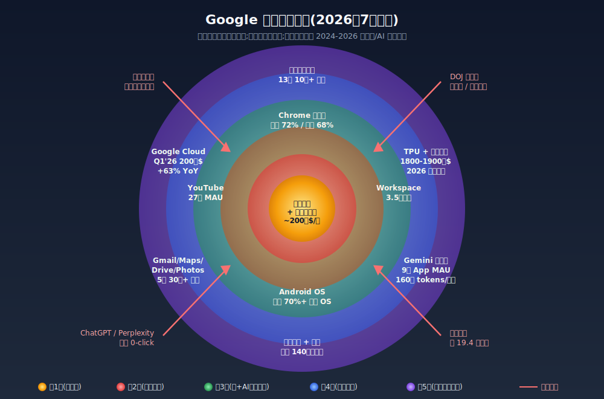
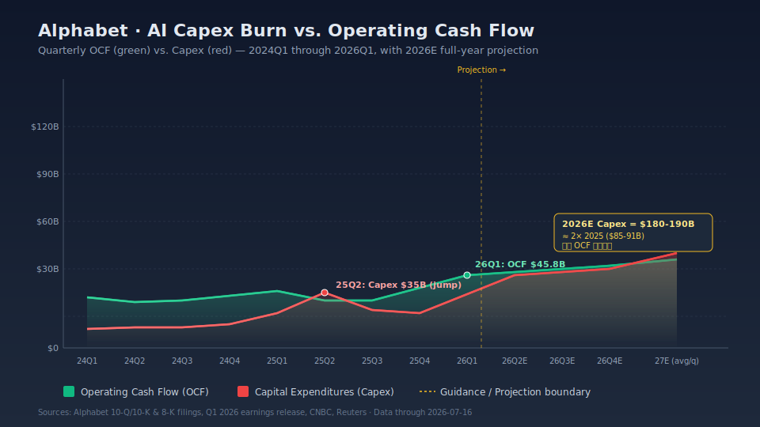

## 德说-第519期, 谷歌家底真的很厚
  
### 作者  
digoal  
  
### 日期  
2026-07-16  
  
### 标签  
AI , Google , 谷歌 , 芯片 , 模型 , Agent , 搜索广告 , Youtube , 云 , 转型 , 资本开支 , 现金流 , 回购注销 , 股东福利 
  
----  
  
## 背景 

谷歌家底厚：有钱、有芯片、有模型、有云、有搜索、有 Youtube。

但谷歌也在疯狂砸钱(所有赌 AI 的公司都在疯狂砸钱), 真正的问题是：钱能不能换成低成本算力，算力能不能换成好模型，好模型又能不能在不毁掉搜索广告的前提下变现。

我的答案是：厚，而且谷歌目前仍是 AI 赛场最难被复制的一档(除了阿里, 详见这篇 [《德说-第507期, 今天聊聊中美两家转型巨头阿里和谷歌》](../202607/20260708_01.md) )；但这份厚度不是保险箱，而是一台必须连续运转的机器。机器只要有一个齿轮打滑，护城河就可能变成固定成本。

## 先把“厚”拆开

我先给出三个判断，后面都围绕它们展开。

第一，谷歌的家底不是某一代 Gemini 或某一款 TPU，而是芯片、数据中心、研究、模型、搜索、云和现金流组成的系统。第二，它能承受远超普通公司的 AI 投入，但 2026 年投入已挤压自由现金流和回购，不能把“能投”误读成“免费”。第三，这套系统仍是护城河，却带着路径依赖：谷歌必须用 AI 改造搜索，又要防止 AI 把搜索原来的赚钱方式改没了。

## AI 全栈：厚在能自己串起来

### TPU 是系统，不只是一颗芯片

TPU 可以简单理解为谷歌为人工智能工作负载定制的芯片。它不像通用 GPU 那样什么都能做，却能在谷歌长期、规模巨大的矩阵计算上争取更低的成本、能耗和供给确定性。谷歌从 2015 年内部推理用的 TPU，一路做到训练、液冷、光路交换和大规模 Pod，背后积累的不只是芯片设计，还有编译器、网络、调度、存储和数据中心运维。[谷歌对 TPU 十年演进的回顾](https://cloud.google.com/transform/ai-specialized-chips-tpu-history-gen-ai)讲的其实是一个共同设计过程：芯片、软件和模型一起迭代，而不是买来硬件再临时适配。

这份优势的前提是：工作负载足够大且稳定，芯片利用率高，模型团队愿意为系统优化。小规模、变化快、强依赖 CUDA 的任务，通用 GPU 仍可能更划算。 

TPU 对外商业化也要冷静看待, 不要太上头。Anthropic 等客户扩展使用 TPU 的消息，更多是意向或目标，不能等同于百万颗已交付、收入已确认。真正能证明 TPU 是护城河的，不是峰值 FLOPS，而是每百万 token 成本、每瓦有效输出、集群利用率、训练时间和客户复购。如果这些指标长期不比同代 GPU 好，TPU 就会变成昂贵的内部项目。

### DeepMind、Gemini 和数据，组成了“能做什么”

谷歌的研究积累很深：Transformer 论文来自 Google 团队，DeepMind 做过 AlphaGo、AlphaFold 等项目。2023 年 Google Brain 与 DeepMind 合并成 Google DeepMind，减少了算力和人才的内部争抢。Gemini 则把多模态、长上下文、推理和工具调用逐步装进 Search、Android、YouTube、Workspace 和 Cloud。

谷歌的数据优势: 拥有实时网页索引、搜索意图、点击和广告转化、地图与视频推荐等真实任务反馈；在授权边界内，还能调用办公、日历和地图上下文。这些数据适合检索、评测、后训练和个性化。

Gemini 的强项不只是榜单分数，更在于迅速进入已有入口。Google I/O 2026 披露 Gemini App 月活超过 9 亿，AI Overviews 月活约 25 亿；这些只能作为参考, 毕竟是公司口径，且 App、搜索功能、API 流量不能相加。大规模分发确实存在，但默认入口带来的“用过”，与主动选择、长期留存和付费是两回事。

谷歌拥有很强的追赶和复用能力，某一代模型短暂落后时，仍能靠算力、研究和分发追回差距；但还要看 Gemini 的 30/90 日留存、API 净收入留存、单位任务成本，以及新模型进入十亿级产品需要多久。若用户只是被默认入口带来，深度使用和开发者复购却落后，说明模型还是落后的又或者说“全栈”护城河还不够深。

## 财务：有能力下注，但现金不是免费的

财务家底是谷歌最容易被看懂、也最容易被夸大的部分。Alphabet 2025 年营收约 4,028 亿美元，经营性现金流是 **1,647 亿美元**。资本开支约 **914 亿美元**，简单相减后的自由现金流仍有约 733 亿美元。也就是说，它不是靠融资才能做 AI，而是先有一台极强的现金流机器。

但 2026 年体感变了。公司给出的全年资本开支指引是 **1,800 亿至 1,900 亿美元**，接近 2025 年的两倍。第一季度经营现金流约 458 亿美元，扣掉约 357 亿美元资本开支后，自由现金流约 101 亿美元，同比明显收窄。[Alphabet 2025 年 10-K](https://www.sec.gov/Archives/edgar/data/1652044/000165204426000018/goog-20251231.htm)和 [2026 年一季度 10-Q](https://www.sec.gov/Archives/edgar/data/1652044/000165204426000048/goog-20260331.htm)已经能看见这种转变：AI 投资不是愿景，而是服务器、网络、数据中心和折旧。

用直白的话说，2026 年这轮投入并非完全由“旧家底”支付。经营现金流依旧是主力，但新增债务和回购都要填补缺口。2026 年发行的 200 亿美元美元债加上 10 亿英镑债，折算约 **210 亿美元**；2025 年 4 月的 700 亿美元回购授权，也不意味着这笔钱必须照原计划花掉。回购让路给 AI (本来要给股东发福利的, 先不发或押后的意思.)，所以 AI 的机会成本其实是由股东来承担的。

这不代表谷歌缺钱。它债务负担低，短期内有能力继续建设。但“能借到钱”与“资本赚得回来”是两个问题。新增算力若能被高毛利需求消化，那就能形成供给壁垒；若建设速度严重快过需求，或云服务陷入价格战，今天的产能就会以折旧形式多年压在利润表上。

财务结论的适用边界是：谷歌能扛住两三年的高投入，不等于可以无限烧钱，更不等于 AI 投资必然高回报。最有用的验证指标不是“资本开支有多大”，而是资本开支与经营现金流的比例、自由现金流是否连续下降、折旧是否跑得比 AI 收入快、在建资产能否按期转化为收入，以及 Cloud 的利润能否覆盖新增算力成本。若 2027 年以后资本开支仍接近 2,000 亿美元、自由现金流继续收窄，回购长期低迷，那就不太乐观了。 **不过如果谷歌都不乐观, 估计全世界也很难找到乐观的企业.**    

## 战略：搜索分发仍是底座，Cloud 是第二条腿

2026 年第一季度，搜索及其他广告收入约 **604 亿美元，同比增长 19%** ；Google Cloud 收入约 **200 亿美元，同比增长 63%** ，营业利润约 **66 亿美元，利润率约 33%** 。Cloud 这组数字很重要：谷歌不再只有一个广告收入池，AI 基础设施也开始有对外变现出口。顺带提醒一下，外界常提到的约 4,600 亿美元积压订单，是 Alphabet 全公司的口径，不能直接说成 Cloud 一家的订单。

搜索的优势仍然牢固。用户习惯、品牌、广告主预算、浏览器和手机入口，形成了很高的复合门槛。反垄断诉讼却提醒我们：默认入口不是永恒的壁垒，将来很有可能被监管盯上。美国司法部这次算仁慈的了, 相关救济措施没有要求立刻拆分 Chrome，但限制排他性默认安排，并要求在一定条件下开放部分搜索数据和交互数据。[司法部对 Google 搜索案救济的说明](https://www.justice.gov/opa/pr/department-justice-wins-significant-remedies-against-google)意味着，谷歌最强的分发和数据闭环，恰恰也是最容易被法律盯上的部分。

搜索自我蚕食的风险也不能只看总收入。AI Overviews 把答案直接放在结果页，可能减少用户点击外链，也可能改变广告展示和内容网站的生存方式。第三方估算约有 69% 的查询最终零外链点击，这个数字说明“用户目的是得到答案”。谷歌现在仍能让搜索收入增长，说明风险尚未表现为商业模式崩塌, 因为目标用户可能更精准了, 广告商要的也不是点击, 而是点击\*转化率；

这一层的边界很清楚：只要关键词搜索仍是主流，默认入口仍在，谷歌就有很厚的现金护城河；一旦用户转向直接给答案的代理，且苹果等关键入口不再默认 Google，旧分发优势就会缩水。验证方法也很简单：看 Google Services 是否连续两个季度同比下滑，看搜索每次查询收入是否下降，看取消默认入口后用户是否仍主动回到 Google。总营收短期继续上涨，并不能完全推翻单位经济性恶化。

## 最危险的不是没家底，而是家底太重

所谓“现金流 × TPU × AI 分发”的闭环，严格说不是三个独立因子的乘法，而是一条串行依赖链。

现金流要先支持算力，算力要被模型和产品有效利用，产品要有真实用户价值，用户价值又要转成广告、订阅或 Cloud 收入，最后才有新的现金流。如果 TPU 利用率下降、Gemini 质量落后、分发被监管削弱，或者 AI 搜索的服务成本超过新增收入，链条中的任一环反转，飞轮就会变成负反馈：越投越多，单位成本越高，现金越少，下一轮转型空间反而变窄。

创新者窘境也还没有被彻底破解。Google Brain 与 DeepMind 合并、Gemini 快速迭代，说明组织调整有效；但核心人才流失、过去的产品事故，以及广告收入和“直接给出最佳答案”之间的冲突仍在。谷歌最理想的 AI 搜索，可能正是不利于旧广告链条的搜索。它现在更像渐进式改造，而不是把旧模式一刀切掉；对一家拥有数千亿美元广告收入的公司来说，这种谨慎既是理性，也是包袱。

谷歌目前还没有打破创新者的窘境。它只是有资源把窘境拖长并尝试改造；能否跨过去，要看研究人才是否止住流失、AI 产品是否比旧搜索更有黏性，以及 AI 收入能否覆盖基础设施折旧。

## 最后：厚家底是一种动态能力

**一，谷歌的家底确实很厚。** 厚在自研 TPU、Google DeepMind、Gemini、实时数据反馈、十亿级产品入口、Cloud 和强劲现金流能够互相复用。这是极少数公司拥有的全栈组合，而不是把几个漂亮名词摆在一起。

**二，厚家底首先带来的是“更不容易被一轮技术迭代淘汰”，不是“必然赢”。** 它能承受更长的试错期，能同时押注模型、芯片和云；但 2026 年资本开支接近 2,000 亿美元，自由现金流收窄、回购让位给 AI 投入、债务增加 (不过不仅谷歌, 目前所有砸 AI 的大公司都处于这个境地, Anthropic, OpenAI, 包括我们这边的 alibaba 都一样)。值得关注的是: 若 Cloud 增长明显放缓、AI 收入没有跟上折旧，家底就会从弹药库变成沉没成本。

**三，AI 时代真正要观察的是转换效率。** 未来几个季度，我会盯四件事：TPU 的有效成本和利用率，Gemini 的独立留存与付费/API 复购，Cloud AI 收入能否覆盖折旧，搜索每次查询的收入和点击质量。它们同时改善，说明正反馈闭环真的在转；只要出现“资本开支继续上冲、自由现金流下滑、搜索单位变现下降、模型用户不留存”这组组合拳，“谷歌家底很厚”就只能算过去式。

说到底，谷歌不是没有包袱，而是暂时有能力背着包袱奔跑。AI 长跑还没到终点，所有砸 AI 的大公司都处于这个境地, 都在赌未来, 都怕掉队. 连苹果都怕, 但这次苹果我认为砸中了, 详见: [《德说-第516期, 苹果在 AI 时代掉队了, 没!》](../202607/20260714_01.md)    
  
  
#### [PostgreSQL 解决方案集合](../201706/20170601_02.md "40cff096e9ed7122c512b35d8561d9c8")
  
  
#### [德哥 / digoal's Github - 公益是一辈子的事.](https://github.com/digoal/blog/blob/master/README.md "22709685feb7cab07d30f30387f0a9ae")
  
  
#### [About 德哥](https://github.com/digoal/blog/blob/master/me/readme.md "a37735981e7704886ffd590565582dd0")
  
  

  
