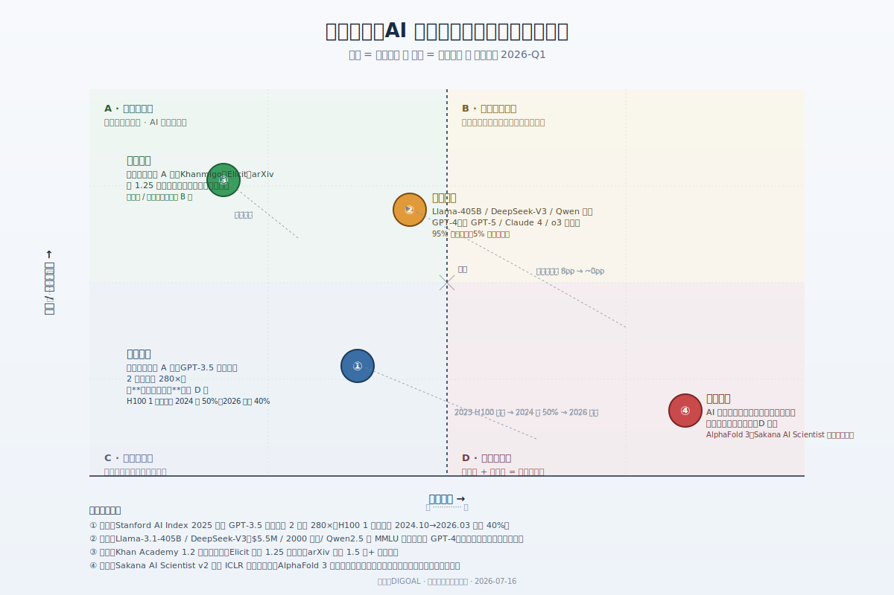
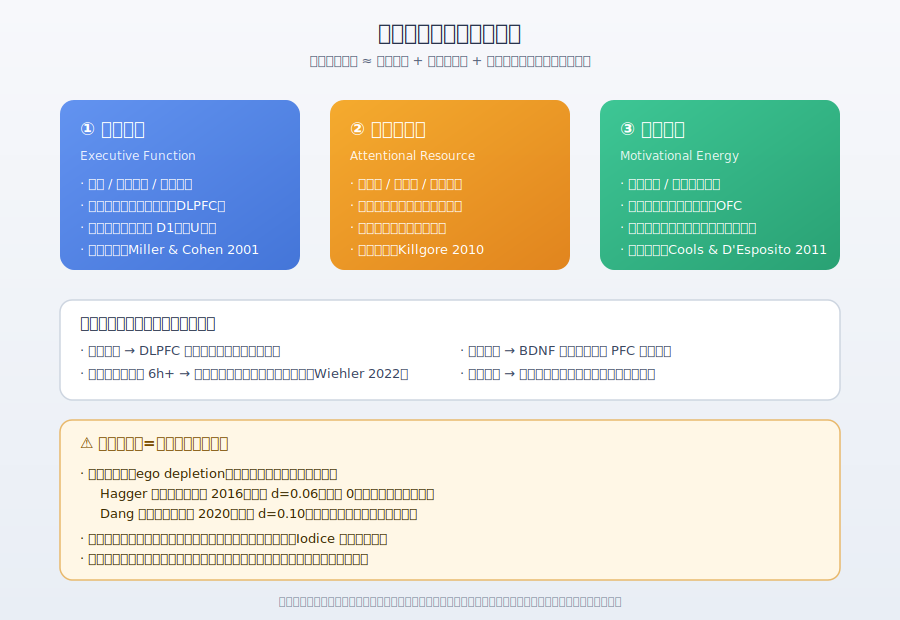
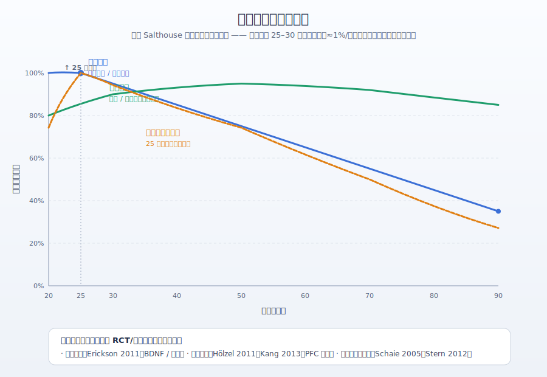
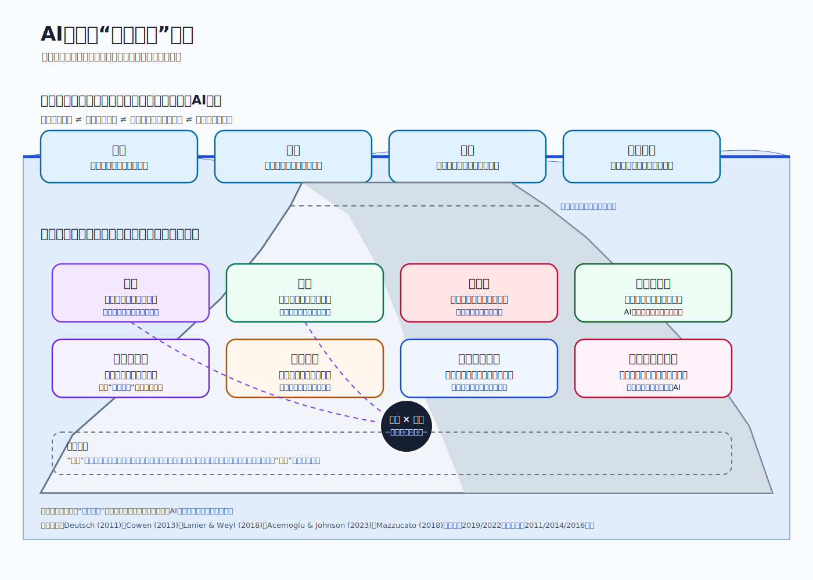

## 德说-第520期, AI 时代真正稀缺的是: 行动力+心力+愿力
  
### 作者  
digoal  
  
### 日期  
2026-07-16  
  
### 标签  
AI , 技术平权 , 知识廉价 , 问题 , 审美 , 品味 , 行动力 , 心力 , 愿力 , 肉身性 , 关系 , 意义 , 道德责任 , 偶然性与运气 , 制度与权力 
  
----  
  
## 背景 

AI 把"知道"变成空气一样廉价, 而对于人来说, "去做/DO" 依旧是越来越稀缺的能力.

突然想起我的座右铭:

公益是一辈子的事, I'm digoal, just do it.

AI 平权了什么, 又把什么悄悄"变成"了稀缺品。 (打引号的变, 因为这个不是 AI 变出来的, 而是一直存在, 但在 AI 平权之前未暴露出来的、在冰山之下的东西.)

今天就来聊一聊这个话题, AI 时代最稀缺的不是问题更不是答案, 而是: 愿力  

或者更精确一点应该是: 行动力+心力+愿力  

   
---
  
## 一、冰山之上: 四样东西的"瀑布式平权"

**算力、模型、知识、问题求解**。

这四样在过去三年的平权方式很像"瀑布" —— 上游先动, 下游跟进, 6–18 个月一个台阶。

- **算力**。推理侧基本平权:Stanford AI Index 2025 给出的数字是 GPT-3.5 等效推理成本两年下降约 280 倍。H100 这类卡的一年合约价 2024 年一度腰斩。但"自训 1T+ 参数的前沿模型"是另一回事 —— 2026 年 3 月 H100 现货价反弹 40%,Nebius、Lambda 一度售罄。"买得到 API"和"买得到 10 万张 H100"是两件不同的事。
- **模型**。开闭源差距在主流基准上从 2024 年初的约 8 个百分点,到年底在某些基准上被压缩到 1.7%。Llama 3.1-405B、DeepSeek-V3、Qwen2.5/3 用闭源 1/20 到 1/40 的预算追上 GPT-4 级。但 SOTA 仍按月租 —— GPT-5、Claude 4 Opus、o3 系列在 GPQA Diamond、SWE-bench Verified 等"反污染"基准上保持领先。顺带提醒一下:常被引用的 DeepSeek "$5.5M / 2048 张 H800 训出 R1" —— 其实这个数字属于 V3 的官方训练成本表,R1 论文摘要里并没有这串数字(DeepSeek-V3 技术报告, arXiv:2412.19437)。
- **知识**。陈述性知识(论文、教材、代码片段)的复制成本已经接近零。Elicit 接入约 1.25 亿篇学术论文并向免费用户开放搜索;Khan Academy 注册用户约 1.2 亿,Khanmigo(可汗学院) 拿到 Microsoft 1000 万美元做 AI 导师。 **但线下、陪伴类、认证类、情境化、师徒相传的 know-how 反而更值钱了** 这个我在 [《德说-第518期, AI 把教培行业逼成了“教陪”行业》](../202607/20260715_02.md) 专门分享过 。
- **问题求解**。AI 在"生成候选问题"上进步极快: Sakana AI Scientist v2(2025.04)在 ICLR 工作坊通过同行评审; DeepMind 的 FunSearch 在数学里发现了新的 cap set 构造(*Nature* 625, 2024); AlphaFold 3(*Nature* 630, 2024.05)把蛋白质结构预测的成本曲线砸平了。

把这四样放到一张"平权程度 × 准入门槛"的图里看, 大致是这样的分布:

"95% 业务已平权、5% 前沿仍稀缺"这种 95/5 的写法, 本身是 2026 年 Q1 这一刻的快照, 不是稳态。今天的"5% 前沿"会在 6–18 个月内大概率沉到 95% 区, 反之亦然。 

瀑布之外还有几个被漏掉的区域: **医疗诊断**、**法律合规**、**湿件实验**。FDA 累计批准的 AI/ML 医疗器械早已破千, 但临床医生对自主诊断 AI 的接受度和责任归属还远没解决; 律所里 LLM 做合同审查已常态化, 但出庭、监管沟通、跨法域协调仍主要靠人; 冷冻电镜、动物模型、临床试验这些"湿件"成本曲线没动过。换句话说, 平权在数字业务里成立, 在高 stakes、高监管、高度依赖专属数据的领域还没有被渗入。  

还有更隐蔽的: **控制权平权 ≠ 能力平权**。同一模型对所有人开放, 但谁能以接近零成本拿到、谁能稳定供给、谁的数据被用来训练、谁的版权被稀释、谁的议价权被重塑 —— 这是五件不同的事。这一层不是技术瀑布能解决的。

 

## 二、那么,水下是什么?

水面之上平权了, 水面之才是稀缺品。

简化来说, 水下归成两样: **心力**和**愿力**。

**心力**和**愿力**把一个本来复杂的多层结构压缩成了两根支柱。先把这两根支柱拆开看, 再补上被简化掉的几层。

### 2.1 心力: 不是"意志力燃料", 是前额叶 × 神经递质 × 代谢的复合体

"心力"这个说法在神经科学里没有统一定义,但它对应的生理结构是清晰的:**外侧前额叶皮层(PFC)** 负责抑制、工作记忆、目标维持;**前扣带**监控冲突;**腹内侧前额叶 / 眶额**做成本-收益评估;**基底神经节**提供动机能量。Miller & Cohen 在 2001 年的经典综述把这套关系概括为"PFC 通过维持目标表征、向皮层下发放自上而下的信号来实现认知控制"。

心力与身体的绑定关系是**确定性结论**:

- **睡眠**。Yoo 等(*Current Biology*, 2007)fMRI 显示,睡眠剥夺 36 小时后被试面对负性情绪时杏仁核反应升高约 60%,而内侧前额叶到杏仁核的功能连接显著下降 —— 情绪控制回路直接断线。持续清醒 17 小时的认知表现 ≈ 血液酒精浓度 0.05%;24 小时 ≈ 0.10%(CDC 引用)。换句话说,**通宵赶完一个项目之后决策力崩盘,不只因为累,而是生理性下调**。
- **运动**。Erickson 等(*PNAS*, 2011)随机对照试验显示,1 年中等强度步行使海马体积增加约 2%,相当于逆转 1–2 年年龄相关萎缩。
- **营养与代谢**。地中海饮食模式与更好的认知老化相关(Scarmeas, *Ann Neurol*, 2006);高糖高饱和脂肪饮食在动物模型中明确损害海马与 PFC 功能。

### 2.2 心力随年龄衰减, 但可干预缓解

Tim Salthouse 在认知老化领域做了二十多年最系统的横断+纵向研究(*JINS*, 2010; *Neurobiol Aging*, 2009),报告流体智力相关的核心能力(处理速度、工作记忆、推理)大约在 25–30 岁之后呈线性下降,衰减速率**约 1%/年** —— 注意这是健康成人的群体平均,不是每个人的纵向轨迹,也不是某项特定测验的精确常数。Salthouse 后续对 GALAMM 等潜变量增长模型的修订也提示这一速率会因能力领域、测量方式和队列不同而有差异。

为什么是 外侧前额叶皮层(PFC) 最早衰退? 因为它是神经元最密集、突触修剪最晚完成、髓鞘投资最重、能量需求最高的区域 —— **晚熟早衰是 PFC 的本性**。

外侧前额叶皮层(PFC)衰退 可干预缓解: 

- **运动**。上面 Erickson 2011 已列。
- **冥想**。Hölzel 等(*Psychiatry Research: Neuroimaging*, 2011)VBM 显示 8 周正念冥想即可使海马、后扣带回、颞顶联结区灰质密度增加;Kang 等(*SCAN*, 2013)DTI 显示长期冥想者前额叶皮层厚度高于对照,白质完整性更好。
- **认知训练与教育**。Schaie(2005)Seattle 纵向研究 50 年追踪提示: 认知训练干预可以把流体智力衰退推迟若干年; 教育水平每多一年与晚年痴呆/阿尔茨海默病发病延迟相关 —— 这是认知储备理论(Stern, *Lancet Neurology*, 2012)反复观察到的一致结论,**但精确到"每多一年教育发病风险下降多少个百分点"在不同队列里差别很大**。常见综述引用的是相对风险下降约 20% 一类的量级, 具体数字高度依赖样本、口径和 SES 控制; 若要给读者一个稳的表述, 只能说"教育与晚年认知表现之间存在被广泛复制的正相关, 且因果机制尚未完全闭合"。
- **认知储备**。同样的脑病理负担下, 高认知储备者临床表现更晚出现症状。

所以准确的表述是: **心力随年龄衰减总趋势不可逆, 个体轨迹高度可塑**。  

### 2.3 愿力: 是反人性的

搜遍 PsycINFO、Google Scholar 和中文心理学期刊(截至 2026 年 7 月),"愿力"作为一个正式学术构念**不存在**。它是一个复合直觉概念, 大致对应四样被正式研究过的东西的交集(基本上都是反人性的): 

- 长期目标坚持不放弃 → **grit(坚毅)** ,Duckworth 等 2007
- 抑制当下冲动换取远期回报 → **self-control(自控力)**
- 把费力的事持续做下去 → **perseverance of effort**
- 主动选择"正确但难"的事 → **approach motivation 的反面**

严格地说,一个人"愿不愿意做费力的好事"这件事, 实质上由五层组成:

- **行为机制层**(习惯化、自动激活) —— **也就是惯性, 确定可训练**;
- **动机-情绪层**(grit(坚毅) 中的 perseverance + approach motivation) —— **中等可训练**; 
- **能量-生理层**(耐受急性不适、调节 HPA 轴) —— **中等可训练但依赖剂量与基线**;
- **人格特质层**(尽责性的 productive facet) —— **弱可训练**;
- **基因 / 早期环境层**(尽责性的可遗传性约 50%) —— **几乎不可训练**。

真正能训练的主要是前两层;  

说到这, 我个人非常认同, 例如我分享内容的惯性可能持续了 20 年, 而在分享的过程中又会得到情绪层面的正反馈(例如可能我的分享帮助到了别人, 别人会心存感激, 在交流中又会给我正反馈)

  
## 三、被简化掉的几层: 水下其实更宽

把水下简化为"心力 + 愿力"两根支柱, 有个好处(好讲、好记),也有个代价 —— 它容易把一个本来多维的人类条件,压缩成两个内在品质,然后把结构性问题道德化。

至少还有这六层是"心力 + 愿力"覆盖不全的:  

- **肉身性**。疲劳、疼痛、性别化经验、疾病、衰老、触觉、空间位置、死亡 —— 不只是心力的输入变量, 而是意义形成的条件。Merleau-Ponty 和 Mark Johnson 都强调理解不是脱离身体的纯计算。AI 可以模拟身体语言, 却不因此承受伤口与死亡。
- **关系**。项飙在 2019 年的访谈里提出过"附近的消失": 人的注意力被自我焦虑和全球宏大叙事两端吸走,对邻居、保安、摊贩、社区规则和日常劳动者缺乏具体认识。生活的物质基础由大量细密关系托住; AI 能生成体贴话语, 也能成为媒介, 但不能单方面制造互惠历史、共同风险和相互承担。
- **审美与意义**。AI 可以生成风格、组合形式、预测偏好。但"什么值得追求"、"何种损失值得承受"、"为什么这个表达与此人的生命有关"是价值判断,不等同于形式相似度。审美不是人类专属的护城河, 但它的社会意义取决于创作者位置、共同体回应与生活实践。
- **道德责任**。责任不仅是知道正确答案, 更是被他人追问、能够解释、接受制裁或补偿。一个系统可以输出道德建议, 却不能自动成为责任主体。责任的归属仍需由组织、法律、职业伦理和具体的人来承担 —— 这正是为什么 Acemoglu 与 Johnson 在《Power and Progress》(2023)里反复强调: **AI 的用途是政治选择, 不是技术宿命**。
- **偶然性与运气**。出生地、家庭、健康、时代、关键相遇和灾难都会改变结果。Bernard Williams 在 1981 年提的"道德运气"问题说明:人的责任判断始终与不可控因素纠缠。把结果全归为愿力,会产生"成功者全靠自律、失败者全因懒惰"的错觉。
- **制度与权力**。人能否把心力转化为成果,取决于是否有时间、财产、信用、教育、法律保护、组织渠道和议价能力。Lanier & Weyl(HBR, 2018)提出的"数据尊严"问题: 模型越像一个自主主体, 越容易掩盖背后无数人的文字、审美、标注、照护和互动劳动;价值不等于平台给出的价格。

把上面这些合起来,可以用一个启发式:  

> **可实现的价值 ≈ 工具能力 × 有效注意力 × 关系信任 × 制度授权 × 身体可持续性 × 运气条件**  
  
乘法表示瓶颈效应: 任何一项接近零, 产出都可能急剧下降; 但在真实社会中也存在替代和补偿。这不是定律, 是"不要漏变量"的检查表。  
  
冰山的真实形状更像这样:  

  
## 四、几条我自己的反思

  
**第一**,神经科学说心力高度可干预(运动、睡眠、教育、冥想),积极心理学说愿力难训练(ego depletion 在复制危机里没站住),价值哲学说真正稀缺在结构(制度、关系、运气)。 **这三句话对的是不同人群**:对拥有基本健康、教育、时间、社会支持的城市中产成年人,前两句基本成立;对低 SES、慢性压力、被结构性约束的人群,第三句话更重要。把"心力/愿力可训练"当成普适处方,会忽视结构本身就是干预的边界条件。

**第二**,技术商品化以 6–18 个月为单位,关系 / 制度 / 公共生活的演化以十年计。 **把前者的速率外推到后者,是 AI 时代最大的叙事陷阱** —— 它会让你以为"AI 平权算力"等于"AI 平权一切"。这正是 Acemoglu 与 Johnson 在《Power and Progress》里反复警告的:技术变革和制度变革是脱节的,且方向由政治经济选择决定,不由技术参数自动决定。

**第三**,"识别好问题"这件事要拆成两层: **生成候选问题**(AI 已显著平权) 和 **判断、筛选、承担好问题**(AI 仍弱)。这两层的稀缺性完全不同。原命题里"问题也不再稀缺"只对第一层成立; 真正稀缺的是第二层 —— 而且这层的稀缺性不是"我想不到问题",而是"我想不到值得花 5 年去回答、且愿意为它承担沉没成本的问题"。这种判断力既依赖个人品味,也依赖共同体的承认、资本的资助、制度的保护 —— 它没法被外包给任何模型。

 

## 五、给读者的几条具体建议

  
  
1. **不要把"AI 平权算力"误推为"AI 平权一切"** 。访问平权、控制平权、结果平权、意义平权是四件不同的事; 前者在进步, 后几层还在分化。
2. **心力不是肌肉也不是燃料,是可干预的复合系统**。睡眠、运动、营养、压力管理 —— 这四件事的回报率高于任何"自我提升"课程。25–75 岁的健康中产成人, 这条处方基本管用;  
3. **愿力训练最有效的路径不是硬撑, 而是结构化设计**: 实施意图 + 微行为锚定(路径 A)、有反馈的刻意练习(路径 B)。把"不愿做的事"通过环境设计变成默认行为, 比用意志力反复搏斗稳得多。 
4. **关于"识别好问题"** : AI 是好的候选问题生成器, 但判断与承担仍然是人的事。如果你正处在"找不到值得做的事"的状态, 这不是 AI 的 bug, 可能是你需要一个共同体、一段时间、一些真实的不舒适来帮你长出"品味"。
  
     
  
#### [PostgreSQL 解决方案集合](../201706/20170601_02.md "40cff096e9ed7122c512b35d8561d9c8")
  
  
#### [德哥 / digoal's Github - 公益是一辈子的事.](https://github.com/digoal/blog/blob/master/README.md "22709685feb7cab07d30f30387f0a9ae")
  
  
#### [About 德哥](https://github.com/digoal/blog/blob/master/me/readme.md "a37735981e7704886ffd590565582dd0")
  
  

  
