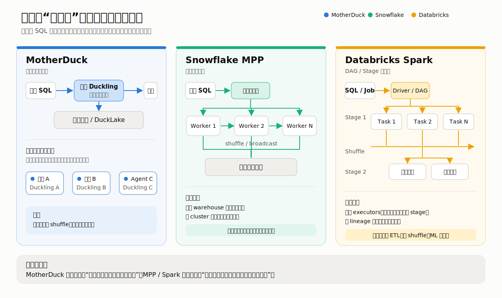
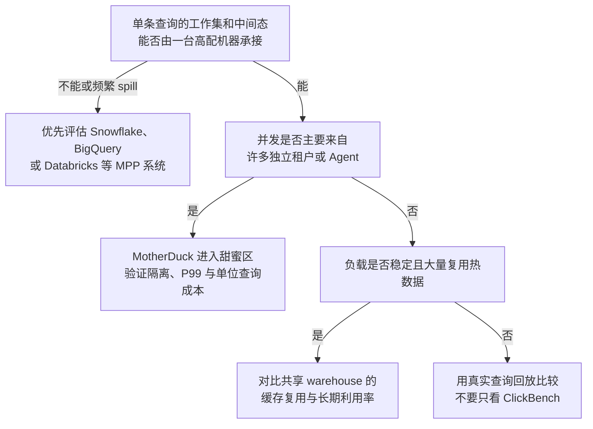

## 聊聊 MotherDuck 的分布式  
  
### 作者  
digoal  
  
### 日期  
2026-07-16  
  
### 标签  
AI , Agent , DuckDB , MotherDuck , 分布式 , Duckling , 单节点分布式 , 多租户 , replica 只读副本 , 对象存储 , serverless , 查询数据集 , 中间结果 , Spill 到磁盘 , 不要看总量 
  
----  
  
## 背景 

一听“分布式数据仓库”，很多人脑中都是几百台机器齐刷刷开工，把一条 SQL 切成几百份。基于 DuckDB 的 serverless 数据仓库 MotherDuck 偏偏反着来： **一条查询尽量只在一个 Duckling 节点里跑完，平台再用许多 Duckling 承接不同用户和查询。**

这听起来有点像“我没有分布式，但我分布式了”。绕口归绕口，它恰好点出了 MotherDuck 最值得聊的地方：它扩展的不是一条查询，而是整个平台上的工作负载。

## 先把“分布式”说清楚

传统 MPP 数据仓库里的 MPP，是“大规模并行处理”的缩写。Snowflake 收到一条大查询后，会让一个 Virtual Warehouse 里的多个 worker 一起读数据、做 join 和聚合；Databricks Spark 则把作业拆成 stage 和 task，交给多个 executor。机器之间常常要交换中间结果，这一步叫 **shuffle**。

好处很直接：一台机器装不下的数据，可以摊到很多机器上；代价是调度、协调和网络传输。查询越小，这些“开会成本”占比越高——活还没干多少，群聊已经拉了八个。

MotherDuck 选择另一条路：单个查询交给一个 Duckling，在节点内多核执行，不再拆给其他 Duckling；需要更多并发时，平台启动更多独立 Duckling。这是 **workload-level distribution**，也就是工作负载级分布，而非 MPP 的查询内分布。

这一区分不是咬文嚼字。1000 个 Duckling 同时服务 1000 个用户，不等于 1000 个 Duckling 能一起加速某一个超大查询。前者解决的是“人多”，后者解决的是“活大”。MotherDuck 主攻前者，也把后者留给 Snowflake、BigQuery 和 Databricks。

## 单节点为什么能打

MotherDuck 敢这样设计，底气来自 DuckDB。DuckDB 是嵌入式分析数据库，核心武器并不神秘：列式存储只读取查询需要的列；向量化执行不是一行一行解释，而是一批一批交给 CPU；morsel-driven parallelism 再把数据块分给单机多个核心。少搬无关数据、少做函数调用、尽量连续访问内存，现代 CPU 的吞吐就能真正用起来。

第一性原理其实很朴素：一条分析查询的时间，大致等于有效计算，加上数据搬运和系统协调。如果工作集能被一台机器的内存与本地 SSD 承接，那么剔除网络 shuffle、跨节点协调和重复序列化的开销，往往比盲目增加机器更划算。单机不是天然快，**少做无用功的单机才快**。

这套逻辑有一个重要前提：查询工作集和中间态不能远超单节点能力。MotherDuck 的 [CIDR 2024 论文](https://www.cidrdb.org/cidr2024/papers/p46-atwal.pdf) 引用云数仓轨迹称，超过 95% 的数据库小于 1 TB，超过 95% 的查询涉及少于 10 GB 数据；Mühleisen 在 2025 年的[《小数据失落的十年》](https://duckdb.org/2025/05/19/small-data-decade.html)中也引用过“查询中位扫描量约 100 MB”的行业观察。

不过也不能太绝对。数据库总大小、输入扫描量、运行内存不是同一个数字。一个查询只读几 GB，遇到高基数 `GROUP BY`、全局排序或两个大表 hash join，仍可能制造几十乃至几百 GB 的中间态。“95%”只能作为 MotherDuck 产品定位时的统计依据，不能当成你家系统的容量保证。

边界一旦被突破，DuckDB 可以把中间数据 spill 到 SSD，也就是内存放不下时临时写盘。查询“还能跑”，却不保证“仍然很快”。  

## Duckling 怎么扩

MotherDuck 把扩展拆成三个层面。

第一个是**纵向扩容**。Duckling 分为 Pulse、Standard、Jumbo、Mega、Giga 等级，更高等级给单条查询更多计算和内存资源。它解决的是“这一个活需要更大的机器”，但最高档仍是一台机器，不会突然变成跨节点 shuffle 引擎。公开材料对最高档的精确内存规格并不一致，所以更稳妥的判断不是背一个 GB 数字，而是观察查询是否频繁 spill、临时文件有多大，以及延迟是否跨过业务红线。

第二个是 **hypertenancy**，可译作“超多租户”。每个用户、客户或 AI agent 获得一个或多个独立 Duckling。某个客户突然跑出昂贵查询，影响主要留在自己的进程和资源额度内，不容易把隔壁客户的仪表盘一起拖慢。这比共享大集群更容易做故障隔离和费用上限。

但“独立 Duckling”应理解为独立进程或容器级计算单元，不能自动推导成每个租户都独占物理机。对象存储、元数据服务、调度器和网络仍可能共享，因此 query 延迟是否稳定，最终还得看 P95、P99 实测，不能靠架构图脑补。

第三个是 **read-scaling replica**，即只读扩展副本。多个副本读取同一份底层数据，它增加的是同时服务读请求的能力，不会把一条查询拆到 40 个副本上跑；每个副本也仍消耗计算、缓存和 I/O，不能因为数据没有复制 40 份，就说副本成本“几乎为零”。

这三个合在一起，设计就很清楚了：Duckling 等级负责单查询的纵向规模，hypertenancy 负责租户隔离，read replicas 负责单一数据源的高并发读请求并发。所谓“平台级分布式”，说的正是这三件事，而不是一条 SQL 横跨数百台机器。

## Serverless 不是没有服务器

Serverless 的意思从来不是机房消失了，而是用户不再预先管理服务器。MotherDuck 按 compute-unit seconds 计费，可以粗略理解为“计算能力 × 实际占用秒数”；没有查询时，Duckling 可以关停，因此用户侧没有持续的空闲计算费用。

它还宣传约 100ms 冷启动。顺带提醒一下，这是 **Duckling 计算进程就绪时间**，不是用户提交 SQL 后 100ms 就看到结果。第一次查询还可能经历元数据获取、计划生成、对象存储中数据的读取、解压和网络返回。对短而频繁的交互查询，少等一两秒都很有价值；对跑半小时的 ETL，100ms 只够你眨一下眼，谈不上决定性优势。

“零空闲成本”也只成立于用户账单视角。平台要维持快速调度能力，必然承担预留容量和基础设施成本，再摊入计算单价。与此同时，每租户独立进程会减少共享缓存和统计复用。间歇、突发的短查询可能很省；全天稳定高负载则未必比一个利用率很高的共享 warehouse 便宜。  

## 跑分该怎么看

[MotherDuck 官方文章](https://motherduck.com/learn/how-motherduck-scales-distributed-architecture/)给出了一组很抓眼球的 ClickBench 数据：Standard 大约达到 Snowflake XL 65% 的速度，成本约为 5%；Mega 的汇总时间是 5.9 秒，Snowflake 3XL 是 14.1 秒，约快 2.4 倍；同一组对比里 Databricks 为 27.3 秒。

这些数字可以说明一件事：在适合单机列式扫描和聚合的查询上，“不用 MPP”并不等于性能寒酸。但它们不能证明 MotherDuck 对所有 OLAP 都更快。ClickBench 是一张 1 亿行的扁平表、43 条查询，官方方法明确说不测试并发；它对扫描、过滤和聚合覆盖得多，对复杂多表 join、长跑 ETL、故障恢复覆盖得少。Databricks 对比还没有开启 Photon，Snowflake 的结果缓存、区域、版本、合同折扣和预热状态也没有完整对齐。

## 案例证明了什么

Together AI 是最贴合这套架构的案例。MotherDuck 与客户联合披露，它用 40 个 read replicas 服务 128 个并发用户和自由查询的 AI agent。这个数字证明副本查询可以落地，也证明真实用户愿意把 BI 并发交给这种架构。但案例没有同时给出与 Snowflake 同配置的成本、缓存状态和 P99 对照，所以它证明的是“可行”，不是“一定比别家省”。

Pricemedic 的官方案例则提到约 100 TB 数据湖。这个例子说明：MotherDuck 的边界不能只看湖里总共有多少数据，而要看每条查询实际读取多少、生成多少中间态。100 TB 放在对象存储里 不等于 一台 Duckling 要把 100 TB 全塞进内存。 

## 怎么选

BI 仪表盘、SaaS 内嵌分析、AI agent 的短查询，通常符合“查询相对小、用户彼此独立、流量有突发、在意费用上限”这组前提，正是 MotherDuck 的甜蜜区。此时应重点验证副本扩展后的 P99、冷数据首查，以及某个大客户是否会耗尽自己的 Duckling 配额。

超大事实表之间的 repartition join、PB 级批处理、持续高并发写入、大规模特征工程，则更需要 MPP 的聚合内存、网络 shuffle 和 stage 级容错。大量用户反复访问同一份热数据时，共享 worker 和缓存也可能比每租户独立进程更划算。 

## 收尾

MotherDuck 的“分布式”不是传统 MPP： **单个查询单节点执行，平台用更多 Duckling 扩展租户和并发。**

DuckDB 的单机优势来自列存、向量化、多核并行和减少协调开销，但优势有物理天花板；不要看总数据量大小，真正该关注的是查询工作集、中间态和 spill。 

它最适合 BI、AI agent 与中小规模的交互分析，不是 Snowflake、BigQuery 或 Databricks 的通用替代品。解决单节点就能满足的场景时，MotherDuck 很有竞争力；需要跨节点执行的场景，就别逼一只鸭子去拉火车了。
  
  
#### [PostgreSQL 解决方案集合](../201706/20170601_02.md "40cff096e9ed7122c512b35d8561d9c8")
  
  
#### [德哥 / digoal's Github - 公益是一辈子的事.](https://github.com/digoal/blog/blob/master/README.md "22709685feb7cab07d30f30387f0a9ae")
  
  
#### [About 德哥](https://github.com/digoal/blog/blob/master/me/readme.md "a37735981e7704886ffd590565582dd0")
  
  

  
