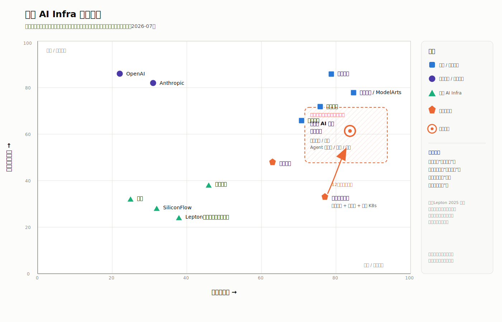
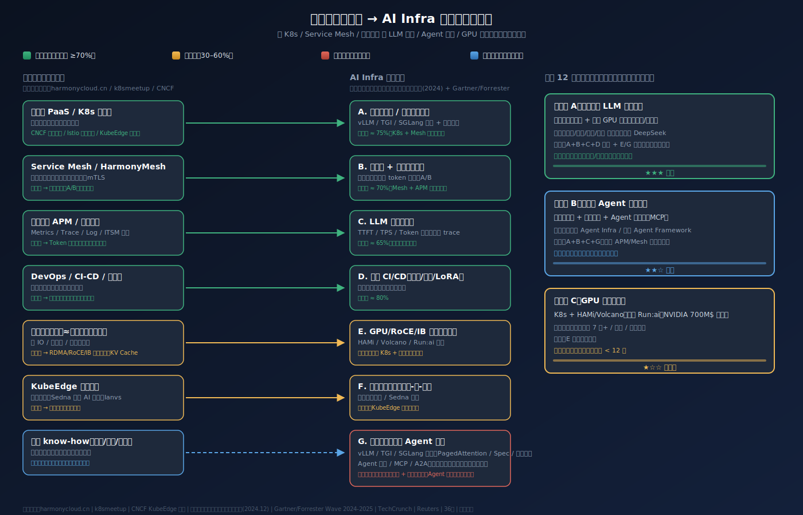
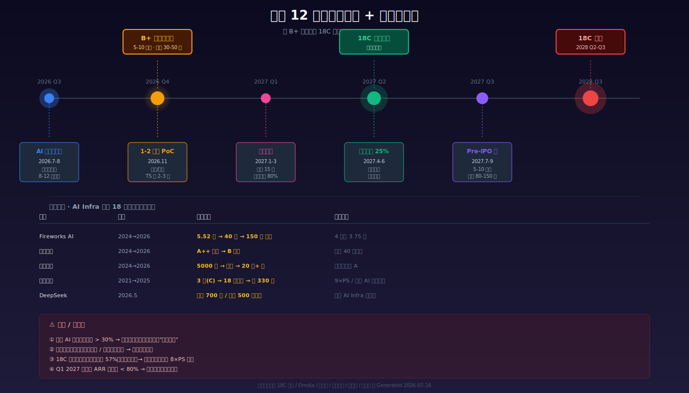
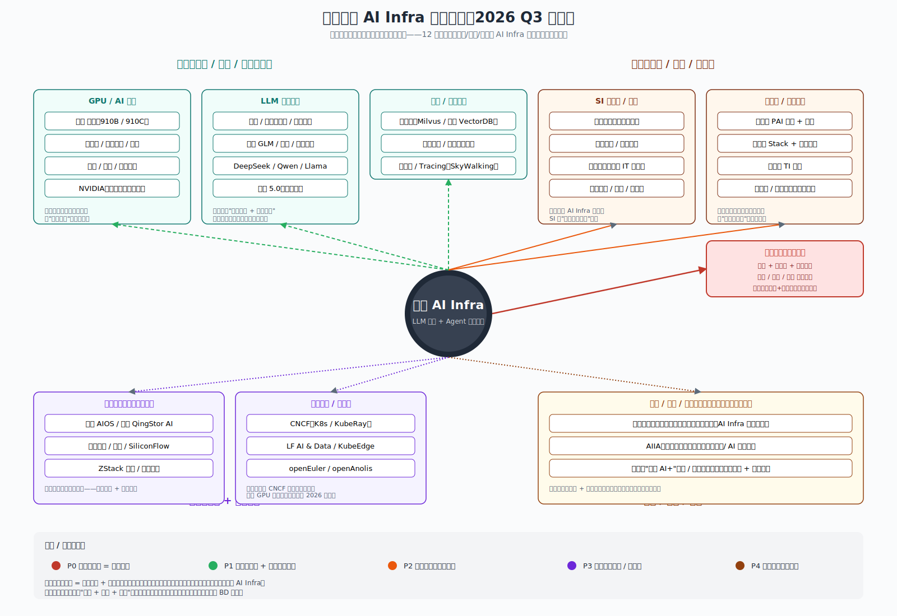

## 德说-第521期, 过一把 CEO 的瘾: 谐云怎么打赢 AI Infra 这一仗
  
### 作者  
digoal  
  
### 日期  
2026-07-17  
  
### 标签  
AI Infra , 一体机 , 平台层 , 治理 , 所有权 , 私有化 , 模型 , Agent , 训练 , GPU , 开源 , 信创 , 单一渠道风险 , 组织 , 人才 , 融资 , 估值 , 承诺点 , 锤子 , 钉子 , 战场定义 , 谐云 , 云原生时代 , AI 时代 
  
----  
  
## 背景 
  

我又要发挥全身上下嘴最硬的特长了, 你们听好了:

**我不想当 CEO, 但是想过一把当 CEO 的瘾, 怎么办?**

现在可以了, 随便找一家公司, 摸清一些基本情况后, 让 AI 组队定战略战术, 这不就搞定了么? (抱歉, 我冒犯 CEO 这个岗位了, 干 CEO 哪有那么简单!)   
  
今天假如我是“谐云” CEO.  
   
要打仗, 得知己知彼, 先盘点一下:   
  
2020 年阿里 B 轮战略领投之后，谐云 6 年没有公开新融资进账。这事在云原生时代不是问题 —— 老业务现金流正、客户稳 —— 但当战场被重新定义为 AI Infra，6 年断档的含金量就要重新算。

过去一年，AI Infra 一级市场的估值锚几乎按季度重写：Fireworks AI 在 2025 年 10 月 C 轮估值 40 亿美元，2026 年 7 月已经在谈 150-175 亿美元；无问芯穹日均 token 调用较 2025 年底涨了 20 倍；DeepSeek 把"开源 + 私有化"做成了行业标配。窗口以季度为单位变化。

谐云手里有的，是过去十年砸进股份制银行核心系统的 K8s + Service Mesh + 可观测这一整套工程能力 —— 谐云不是 AI 原生公司，但它是真正跑过生产、扛过银保监审计、踩过信创验收的工程证明。

假设谐云已经拍板"未来 12 个月主战场是横向拓 AI Infra"，要回答的就一个问题： **在自己定义的战场里，怎么把仗打赢。**  教员早就说过: 不要在敌人定义的战争中干仗.  
  
---

## 一、形势：赛道在重写，敲锤子的姿势没变

赛迪口径下 2025 年中国 AI Infra 平台市场只有 36.1 亿元，同比 +86%；Omdia 口径下的中国 AI 云市场是 567 亿元，同比 +148%。两个数字差一个量级，是因为前者只算 AI Infra 软件平台层，后者把 AI 算力云服务全包进去。 **口径不同，结论一样：AI Infra 仍处在从"资源"向"平台"切换的早期**（IDC 2026Q1 中国 AI 云市场报告；赛迪顾问《2025 中国 AI Infra 平台市场发展研究报告》）。

两个事实对谐云是好消息。

**第一，"平台层"还没被巨头锁死。** 火山引擎在公有云 MaaS 上拿了近一半的份额，但政企金融客户对"数据出域"和"等保三级"的硬约束，让私有化部署仍是第一选择（IDC 2026Q1）。私有化市场集中度更低、行业属性更强 —— 这正是谐云过去十年建过护城河的地方。

**第二，"治理 + 生产化"是真正的稀缺品。** Gartner 2026 年公开预测，到 2028 年中国 70% 大企业会为大模型部署建立完善治理框架，2025 年这一比例不足 10%。谐云从 K8s 时代攒下的"高可用 + 容器化 + 信创适配 + 合规审计"这一整套工程范式，恰好是模型上线之后最被需要、却最没人愿意做重的东西。

## 二、战场：高监管行业的 AI 生产控制平面

谐云要打的是**高监管行业的 AI 生产控制平面**，不是一个新通用 AI 云、不是 GPU 租赁云、也不是模型公司。

具体定义：在金融、运营商、能源这些数据敏感、信创硬约束、审计严要求的行业，给客户自有的或国产异构算力，提供一个生产级的运行时控制平面 —— 多模型接入、Agent 编排、推理调度、可观测、可审计、可迁移。

定位有三条边界要说清楚，否则容易和"全栈 AI 云"混为一谈。

**边界一：不碰推理引擎内核。** vLLM/SGLang/TensorRT-LLM 这些产品的工程能力已经遥遥领先 —— Anyscale 的 Ray + vLLM 已被 OpenAI 等头部公司用作大模型训练栈（Anyscale 官方公开材料），vLLM 核心团队 2025 年出来融了 1.5 亿美元做推理优化（市场口径）。谐云应当做的是这些引擎的**金融级 + 信创级 + 可观测级封装层**，不是内核再造者。Lepton AI 被英伟达收购并停止独立运营（InfoQ 2024 转载）就是个提醒：没有稳定算力供给和独立现金流，独立推理云会被上游吞掉。

**边界二：不卖 token、不做公有云 MaaS、不做基础模型训练。** 火山方舟已经把 API 价格打到 1 元/百万 token 以下，Fireworks AI 走 Serverless + 预留容量 + 微调的 PLG 打法在中国生态里不一定跑得通。谐云的销售资产、关系网、决策链全部在 B 端私有化项目里，强行切公有云 API 等于自杀。

**边界三：不与客户争模型和算力。** 模型归属是客户或模型公司，算力供给是芯片厂商或云厂。谐云的价值是让**客户已有的云、芯片、模型和核心业务，在 AI 时代仍然由客户自己控制、稳定运行**。

不过也不能太绝对。 **这个定位在以下场景不成立**：客户接受公有云 API、不需要私有化（这种客户去找火山/阿里更划算）；客户预算在 100 万以内、买的是单一模型 API（这种客户不该进谐云的销售漏斗）；客户已有自建 AI Infra 团队（这种客户去找九章云极/潞晨更对口）。

## 三、主线：把云原生的锤子从"调度容器"换成"调度模型"

谐云过去十年的核心资产，是把 K8s + Service Mesh + 可观测 + DevOps 这套云原生基本盘，砸进了股份制银行的核心业务系统。下一步不是丢开这套锤子，而是**把它从"调度容器"换成"调度模型"** 。

按信通院《大模型推理平台白皮书》（2024-12）的定义，AI Infra 分为算力底座 / 推理引擎 / 推理优化 / 推理服务化四层。谐云的现有能力对位如下：

**直接复用的部分（70%+）：** 接入很丝滑, 例如 K8s 发行版（推理服务的 Deployment/CRD、多租户）、Service Mesh（多模型路由、流式响应、token 级限流）、APM（TTFT/TPS/Token 成本/幻觉等 跟踪）、DevOps（模型权重 OCI 打包、影子流量、回滚）。这一层是"基本盘红利"，做 AI Infra 时应当默认接入。判断逻辑很简单：LLM 推理是"长连接、有状态、有流量"的工作负载，谐云过去这套底座本来就是为它设计的。

**需要适配的部分（30-60% 改造量）：** 数据库容器化的"≈物理机网络性能"可以翻译成 GPU 拓扑感知调度 + RDMA/RoCE；KubeEdge 升级 Sedna/Ianvs 支持端侧 LLM，做云-边-端大小模型路由。这一层的关键是"把过去十年的金融核心业务工程范式迁移到 GPU 推理场景"，不是从零写代码。 **判断标准**：谐云能否在 6 个月内跑出一个"国产 GPU + 异构网络 + 推理服务"的端到端 PoC，且 TTFT/TPS 与 NVIDIA 基准的差距收敛到 30% 以内。

**需要重建或集成（基本重做或集成）：** 推理引擎内核（PagedAttention、Continuous Batching、推测解码、量化编译）、模型转换/量化、训练-推理一体调度、Agent 编排/MCP/A2A。这一层**不要自研**，集成 vLLM/SGLang 为运行时、做国产 GPU 适配层、复用 LangGraph/Dify 协议层。HAMi 已晋升 CNCF Incubating（350+ 贡献者、200+ 企业落地），开源生态的成熟速度会压缩独立厂商的差异化窗口 —— 3 年后 HAMi/Volcano 可能就是行业事实标准，所以这条线的护城河本质上是"信创 + 金融合规 + 国产 GPU 适配"，不是"调度算法"本身。

**新机会（谐云独有的差异化战场）：** 金融行业 LLM 推理平台（建行 DeepSeek 已 200+ 场景，中信银行 2080 万采购单，浦发全面建设 —— 这些都是公开可查的）；信创 GPU 推理栈（谐云既有 K8s 发行版又有大客户背书，比纯算法公司更合适做昇腾+海光+寒武纪的复合适配）；边缘 AI（KubeEdge 已是 CNCF 唯一毕业级边缘项目）；金融合规 AI / 等保三级 / 审计 —— 这是阿里、火山、智谱都不愿意做重的脏活累活，银行非买不可。

一句话总结这条主线： **谐云不是帮你再买一朵云，而是让你已有的云、芯片、模型和核心业务，在 AI 时代仍然由你控制、稳定运行。**

## 四、战术：12 个月怎么打

把 12 个月切成 4 个季度，每个季度都有不可逆的承诺点。

**Q3 2026（7-9 月）：组队 + 验证。** 8 月 15 日前 AI 事业部一号位必须到岗 —— 必须是有 ToB AI Infra 完整经历的人，可参考潞晨尤洋、硅基流动袁进辉的画像（清华/伯克利/微软亚研背景 + 0-1 全周期）。9 月底核心团队 8-12 人就位，AI 网关 + 算力调度 MVP 内测。这一季度不要启动融资 —— 先用 PoC 讲故事，估值锚等 Q4 再定。

**Q4 2026（10-12 月）：商用 + 融资。** 11 月底前完成 1-2 个金融/能源客户的标杆 PoC。客户从谐云已有 100+ 客户里挑（建行/招行/工行之一 + 国网/中移动之一），不拓荒 —— 拓荒的胜率太低，且 12 个月周期压不住。PoC 范围限定 100 张 GPU 以内的异构池化 + DeepSeek-R1 推理 + 1 个具体业务场景（如智能客服 / 智能调度 / 投研助手）。12 月底前 B+ 轮 TS 拿到 2-3 份，估值锚不要卡超 50 亿元。

**Q1 2027（1-3 月）：规模复制。** AI Infra 新签 15 家客户，阿里云/华为云/腾讯云三家云市场全部上架，每个市场至少 1 个 SKU。 **不做任何一家云市场的"独家"** —— 独家等于自杀。关键招聘完成 80%（目标 35 人新团队）。

**Q2 2027（4-6 月）：规模化 + 出圈。** AI Infra 营收占比突破 25%，港股 18C 保荐人签约，GTC/KubeCon 至少一次主舞台演讲。18C 已上市 7 家（云迹、滴普、文远知行、黑芝麻、越疆、晶泰、仙工智能）平均上市周期 261 天，窗口已经打开了。

每个季度都有不可逆的 gate。Q3 gate 不通过（核心团队不到 8 人、MVP 内测跑不通），就缩窄至单一行业、停止泛化；Q4 gate 不通过（2 个 PoC 都未转商用、TS < 2 份），就停止新建通用产品、保留客户交付；Q1 gate 不通过（15 家客户未签、老业务续约率跌破 85%），就砍掉非核心功能线、回到单一行业包。

**节奏 > 规模 > 估值 > 团队** —— 12 个月里最大的风险不是融不到钱、招不到人，而是老业务被稀释、新业务没立住、组织在两套 KPI 里撕裂。 
  
**证明**：12 个月后 ≥ 3 家股份制银行的生产环境跑着谐云推理平台、Agent 编排平台被集成进至少 1 个 CNCF 生态项目、GitHub 开源 GPU 池化层 star ≥ 3000。 
  
**证伪**：12 个月后仍未签下任何银行商用合同、Agent 业务收入 < 1000 万、被 HAMi/Volcano 等开源项目直接吸收差异化。

## 五、组织与节奏：独立 AI 事业部 + 12 个月必融

**组织选方案 1（独立 AI 事业部），但留 2026.12 复评点。**

独立 AI 事业部的三个理由：
- 节奏优先（12 个月这种短周期，方案 2"一体化"的最大化“复用原有组织结构”是陷阱 —— 复用意味着组织内部路径依赖，老业务的 KPI 体系会把新业务拖进 6 个月的"对齐-妥协-再对齐"循环）；
- 估值溢价（AI Infra 一级市场给的 PS 是 30-100 倍，独立事业部可在未来 18 个月以"谐云 AI"子品牌独立融资，享受赛道溢价）；
- 阿里关系可控（阿里 2026.3 成立 ATH 事业群，对被投企业"分业务"已经习惯 —— 虽然对被投企业"友好分拆"的先例确实不多，菜鸟/Lazada 都是控股而非被投案例，这条要保守看）。 

**最直接的对标公司博云选了"一体化"路径**，AI Infra 业务占比已接近 40%、省级农信社为标杆、2026 规划开源 GPU 池化平台（花磊专访，腾讯新闻 2026-02）。所以方案 1 是首选，但 2026.12 必须做"组织分拆 vs 组织一体化"的复评 —— 若新业务 ARR < 老业务 5%，立刻切回方案 2 或重启方案 3（独立子公司）。 **别让"独立事业部"变成空架子**。

前置条件：CEO 必须**兼任**两个事业部的最终负责人（每个季度至少 1/3 时间在老业务、1/3 在新业务、1/3 在融资 —— 这是物理时间约束，不是态度问题）；独立事业部一号位的薪酬包必须显著高于云原生事业部一号位（至少 1.5 倍 base + 独立期权池 8-12%），否则招不到合格的人；老业务现金流为正且核心客户 ARR 续约率 ≥ 85%。

**阿里这一段最微妙。** 处理不好，谐云要么变成阿里云的"子集"，要么变成"竞合炮灰"。原则是**可用不可信、可合不可绑**：用阿里的云市场分销渠道、用达摩院的通义模型适配、用灵骏算力底座的互补，但永远不和阿里云搞"联合品牌产品"、不签"独家云市场协议"、核心客户名单不共享给阿里云 BD。三条红线（独家代理拒绝、捆绑拒绝、客户名单保护）必须提前与阿里战投沟通两次以上。

凡事要辩证的看(这条反事实推演 AI 给的真够狠的!)。 **反事实推演一下**：如果 2026 H2 阿里云推出"AI Infra 一体机"且定价低于谐云 30%（参考历史，这种事不是没干过），谐云的最坏应对路径是什么？答案是：立刻启动去阿里化（云市场 SKU 撤出阿里、独立融资降低阿里跟投比例、加速客户名单独立保护）；同时加速绑定华为 + 国产 GPU 生态（用昇腾渠道下沉对冲阿里云 BD 在金融客户的覆盖率）。预案现在就要想，不能等到事情发生。   

**12 个月必须融，5-10 亿元，估值锚 30-50 亿元投后。**

现金储备按 2020 年 B 轮后剩余 1.5-3 亿元估算，12 个月不融资能活，但 18 个月以后会断粮。而 AI Infra 一级市场估值锚正在急速抬升，错过 Q4-Q1 窗口就错过整个赛道。对标：潞晨 2024 营收 7700 万 → 2025 预计 1.5 亿，2026.3 B 轮数亿元；硅基流动 2026.6 B 轮 20 亿+元；无问芯穹 2026.5 超 7 亿元。谐云按"老业务 2 亿 + AI Infra 1 亿（保底）"，给 8-15 倍 PS，估值区间 24-45 亿元；若 AI Infra 12 个月内新签 30+ 客户、ARR 突破 5000 万，可冲 50-80 亿元。

**资金结构建议**："国资 AI 战投基金 + 战略产业资本"组合。北京/杭州 AI 国资基金参照北京 AI 产投基金投智谱+九章云极的逻辑；阿里云继续跟投（保留 19.32% 持股，公开工商档案口径，但不再接受阿里单方面增资以避免被进一步绑定）；引入一家券商系（中金/华兴/中信）为港股 18C 上市铺路。

因为这篇稿子是 AI 用多个领域专家 agent 各自写稿后合并的, 所有有了下面这条:  

**顺带提醒一下，融资这事也得有 Plan B。** 专家共识里"估值低于 20 亿不融"的红线是过严的 —— 2017-2020 年累计融资 7910 万元，老股东的持股成本远低于当前估值，稀释空间比想象的更大。如果 Q1 2027 估值上不去 30 亿元，B+ 轮应**接受 20-25 亿元 + 战略资源置换**（芯片厂商联合适配、云市场独家推荐位、ISV 渠道包销），而不是卡 20 亿红线不融。

**三条融资红线**：
1. 估值低于 20 亿元不融（破坏老股东权益，会触发对赌）；
2. 不接受业绩对赌（AI Infra 第一年 PoC 多、回款慢，对赌 = 自杀）；
3. 不出让超 25% 股权（稀释太大，损害阿里体系）。

**两个上市选项**：
- 港股 18C 是首选路径，2027 Q3 启动 Pre-IPO、2028 Q2-Q3 挂牌；
- 科创板次选，AI Infra 公司更适合先港股再"A+H"。 

  

## 六、生态与硬约束：什么时候必须停手

**先说 12 个月内最大的潜在威胁 —— 一体机厂商。** 中信银行 26 台昇腾一体机采购单：第 1 名金信润天 2080 万、第 2 名昆仑技术 3231 万、第 3 名华鲲振宇 3805 万；某银行 2 套 AI 一体机 1658 万；第四范式 SageOne Lite 8.8 万起。银行采购正在从"软件平台 + 多供应商"向"一体机 + 单点责任"迁移。谐云作为软件平台层，会被一体机厂商夹在中间 —— 上承硬件捆绑、下不接触终端业务。  

**应对：抱紧国产 GPU，绑定华为生态。** 华为昇腾是金融信创的硬通货，金信润天/华鲲振宇/昆仑技术都是华为总代。谐云必须主动进华为盘古联创计划，借华为政企渠道下沉到地市级 —— 不是被一体机绑架，而是和一体机共生（谐云做池化层，一体机厂商做硬件）。同时和寒武纪、沐曦签战略协议（联合发布"异构池化参考架构"），不要把宝全押昇腾一家。

**产品 SKU 设计要统一口径，不互相打架。** 4 个 SKU：  
- 私有化版（金融主打，一次性 License + 年度维保，150-300 万起）、
- 公有云订阅版（互联网/智驾客户，按集群规模年订阅）、
- 计量版（按 GPU 资源 + 推理流量计量 —— 这是平台层的合理计费，与"不做 MaaS"主张一致，不卖模型 API）、 
- 渠道分销版（神州数码/中软国际/神州信息）。 
  
**关键判断**：80% 收入来自私有化，20% 来自订阅和按量，靠"信创 + 异构 + 私有化"差异化避开云厂价格战。 
    
**证伪**：若 6 个月内不能在同等质量下持续证明 20% 以上成本或延迟优势、且没有稳定模型/调用供给，SKU 3 取消。  
  
**最后一组硬红线，触发就停**：  

| 触发信号 | 必须做的动作 |
|---|---|
| 老业务续约率跌破 85% | 立刻启动"老业务稳定计划"，销售激励独立 |
| AI Infra 12 个月 ARR < 1000 万 | 估值故事讲不动，融资窗口直接关闭 |
| 阿里云渠道贡献 ARR > 50% | 已被绑架，立刻收缩阿里依赖 |
| 美股 AI 板块单季回撤 > 30% | 融资窗口关闭，切换"现金为王"模式 |
| 核心 GPU/推理优化工程师 offer 周期 > 60 天 | 一号位画像与团队不匹配，重新评估方案 1 |
| 金融客户 PoC 幻觉率 > 5% | 立即切换标杆客户或调整技术栈 |
| Q4 两个 PoC 都被一体机厂商截胡 | 把战场定义从"平台层"收窄到"异构治理层" |

每条红线背后都有反事实推演。例如: 

"AI Infra 12 个月 ARR < 1000 万"为什么是死线？
- 因为没有 1000 万 ARR 就讲不出 AI Infra 估值故事，B+ 轮按 30-50 亿元估值的逻辑全部垮塌 —— 市场不会给"未来 12 个月 AI Infra 收入可能 5000 万"的承诺付溢价，只会按"现在有多少 ARR"给 PS。

"阿里云渠道贡献 ARR > 50%"为什么必须触发？
- 因为那意味着谐云已经被阿里云 BD 边缘化 —— 任何一家客户都可以被阿里云"打包卖"，谐云变成"阿里云上的一个应用"，没有定价权。

---

写了这么长，回头看其实一句话就够： **未来 12 个月，谐云要做的是把过去十年砸进金融核心系统的云原生锤子，从"调度容器"换成"调度模型"，在自己定义的高监管行业 AI 生产控制平面里，把仗打赢。** 节奏 > 规模 > 估值 > 团队。窗口以季度为单位，但产品定义和客户信任必须以年度为单位。  

只要企业核心业务还在跑在国产芯片和私有化环境里，谐云的仗就还在。  

---

> 数据主要参考信通院《大模型推理平台白皮书》（2024-12）、IDC 2026Q1 中国 AI 云市场报告、赛迪顾问《2025 中国 AI Infra 平台市场发展研究报告》、Gartner 2026 中国 LLM 基础设施报告，以及谐云官网、CNCF 官网、36 氪、央广网、新浪财经、移动支付网、Anyscale 官方公开材料。部分估值与融资数字为市场口径，未做尽调核实。

  
  
#### [PostgreSQL 解决方案集合](../201706/20170601_02.md "40cff096e9ed7122c512b35d8561d9c8")
  
  
#### [德哥 / digoal's Github - 公益是一辈子的事.](https://github.com/digoal/blog/blob/master/README.md "22709685feb7cab07d30f30387f0a9ae")
  
  
#### [About 德哥](https://github.com/digoal/blog/blob/master/me/readme.md "a37735981e7704886ffd590565582dd0")
  
  

  
