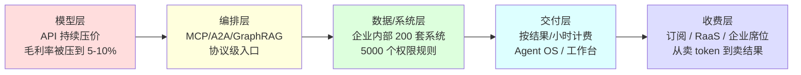

## 德说-第522期, AI 行业下半场尽在 2026 WAIC 
  
### 作者  
digoal  
  
### 日期  
2026-07-17  
  
### 标签  
AI , WAIC , 世界人工智能大会 , 治理 , 工程化闭环 , 下半场 , 利润 , 规则 , 可识别（身份码） , 可授权（最小权限 + 升阶确认） , 可审计（不可篡改的日志） , 可撤销（沙箱 / 熔断机制）  
  
----  
  
## 背景 
  

7 月 17 日开幕的 WAIC 2026（官方名：世界人工智能大会暨人工智能全球治理高级别会议），开幕规格比往年都高 —— 2018 年是大大发来贺信，2024、2025 是国务院总理代表出席并致辞，今年是大大本人亲临现场，发表"四点意见"（[gov.cn 讲话全文](https://www.gov.cn/yaowen/liebiao/202607/content_7075874.htm)）。规格升级释放了强烈的信号：中国打算把 AI 当成全球治理公共产品来经营。

于是这次大会变得有点不一样：台上不只是厂商发新模型、亮机器人，还有 29 国代表签署成立"世界人工智能合作组织"协定（总部设上海）的多边外交动作（[外交部 7-16 短页](https://www.fmprc.gov.cn/web/wjbzhd/202607/t20260716_11984399.shtml)），还有国务院总理级别的产业诉求。开幕刚过 12 小时，关于未来 AI 行业的解读铺天盖地。

我关注的不是某款模型比上一代强几个百分点，而是想试着回答三个方面: 技术、钱、规则

搞懂这三个方面，就能从 2026 WAIC 窥见 AI 行业下半场的走势。

---

## 一、技术：参数堆叠结束，工程化闭环开始

把 WAIC 2026 现场的零碎信号拼一拼，能看到一条主线： **"训练参数量谁更大"的旧胜负手正在失效，"谁能跑出 VLA（视觉-语言-动作大模型）+ 世界模型 + Agent（自主智能体）端到端工程闭环"成了新的胜负手。**

后 Scaling 时代的三个共识已经在 2026 年形成：

- **万亿参数 MoE（混合专家架构）成为旗舰标配，但真正激活的参数量被卡死在 13B–49B 区间** —— Qwen3-Max（阿里通义千问 1T 参数）、DeepSeek V4-Pro（1.6T 参数）、Kimi K3、文心 5.0 都走这条路线（[阿里云峰会披露](https://www.toutiao.com/topic/7474135549415114767/)、[DeepSeek 4-24 发布通稿](https://www.stcn.com/article/detail/3802845.html)）。
- **测试时扩展（Test-Time Scaling，即在推理阶段增加算力而非预训练阶段）和推理时 RL（强化学习）替代了预训练 Scaling** —— Qwen3-Max-Thinking 用"经验提取式多轮 TTS(Test-Time Scaling)"，DeepSeek V4 引入流形约束超连接（mHC）和 Muon 优化器，智谱用 Slime 异步 RL 框架（[WAIC 智启具身论坛议程](https://so.html5.qq.com/page/real/search_news?docid=70000021_0816a558e7e66152)）。
- **VLM（多模态大模型，慢思考）+ VLA（快思考、连接动作）+ 世界模型（在虚拟空间内仿真推演）三件套走向融合** —— 智元 GE-Sim 2.0、蚂蚁灵波 LingBot、苏度 Sudo R1 都在 WAIC 现场跑通了这条融合路线，华为 ADS 5 的 WEWA 2.0 是它在自动驾驶上最成熟的落地。

中美都把筹码压在了"下一段路线"上。中国有 GO-1（智元）、LingBot（蚂蚁灵波）、Sudo R1（苏度）、MindVLA（理想）、X-Foresight（小鹏）；美国有 GR00T N1.6（NVIDIA）、Cosmos（NVIDIA 世界模型）、Gemini Robotics ER-1.6（Google）、Helix-02（Figure AI）。区别在节奏：美国更偏通用智能的 RFM（机器人基础模型），中国更偏特定场景的高成功率+量产成本优势。这一点将会决定接下来 12–24 个月，谁先在工厂、康养、物流、电网等结构性场景跑通。

**这条判断要成立有个前置条件** —— 美国对华芯片管制（HBM 高带宽内存 / EDA 电子设计自动化工具 / 先进制程代工）不全面加码。如果禁令再加码到 EDA 和先进制程代工层面，中国国产芯片的迭代节奏会被打到 14nm/10nm 这个台阶，"工程化领先"会收缩到国内循环 —— 而国内循环撑不起全球化叙事。这是这条主线最大的外部脆弱点。

补充一句, 上面这个说明也不一定成立，斯坦福 AI Index 2026 报告给了第三方独立判断 —— **"中美模型性能差距从 2023 年的两位数百分比缩小到 2025 年的近乎持平"** （near-parity）（[Stanford AI Index 2026 摘要](https://new.qq.com/rain/a/20260716A0B50S00)）。SemiAnalysis 2025-12 报告则称 2026 年中国 AI 算力总容量约为美国的 2 倍（[行业测算、口径为年化](https://new.qq.com/rain/a/20260716A0B50S00)）。两个数字指向同一件事： **工程化路线上，中国是真的追到了"并跑"的位置**。

  

## 二、资本：利润正在从模型层搬向编排层、交付层、收费层

如果只看 WAIC 现场的新模型发布，很容易得出"AI 还在大爆发"的错觉。但从商业化分析师的视角看过去，2026 年最值得讲的反而是"模型层在失血、编排层在蓄水、交付层在筑坝、收费层在重新洗牌"。

**模型层的毛利压缩是真切的。** DeepSeek 2026-05 把 V4-Pro 的 75% 限时优惠永久化 —— 百万 token 输入缓存命中 0.025 元、未命中 3 元、输出 6 元；按 Artificial Analysis 测算，V4-Pro 输出价比 GPT-5.5 便宜约 34 倍（[DeepSeek 定价页](https://api-docs.deepseek.com/zh-cn/quick_start/pricing/)、[IT 之家 5-25](https://wap.ithome.com/html/954188.htm)）。同时间，字节豆包 5 月被推上风口浪尖 —— App Store 一夜间挂出 68/200/500 元三档订阅，被骂"敢收就卸"上微博热搜（[澎湃](https://m.thepaper.cn/newsDetail_forward_33096657)）。阿里云、百度智能云 2026-03-18 同步对算力与存储涨价 5%–34%，腾讯云 5 月 9 日起跟涨 5% —— **算力和模型的压力同时往云上传导**。

我把模型 API 下游这条价值链拆开，利润的真实去向其实是一张五段表：

**利润正在悄悄从模型层搬走，搬到哪里？看三个信号就够了。**

第一个信号是 MCP（Model Context Protocol，模型上下文协议）/ A2A（Agent-to-Agent，智能体间通信协议）/ GraphRAG（图检索增强生成）成为协议级入口。Anthropic 2024-11 开源的 MCP 把原本是 N×M 复杂度的工具集成收敛成 N+M，LangChain 2026 调查显示 89% 受访组织已实现某种可观测性、76% 同时用多个模型 —— **多个模型同时跑已经是常态**（[Anthropic MCP 公告](https://www.anthropic.com/news/model-context-protocol)、[LangChain 报告](https://www.langchain.com/state-of-agent-engineering)）。能帮企业把 xxx 套系统、xxx 个数据源、xxxx 个权限规则安全接上 AI 的玩家，比单纯跑分高的模型厂家更值钱。  可参考 [《德说-第521期, 过一把 CEO 的瘾: 谐云怎么打赢 AI Infra 这一仗》](../202607/20260717_01.md)  

第二个信号是"按结果计费"开始有真订单。Intercom Fin 按"已解决" $0.99/次、Salesforce Agentforce 按"对话" $2/次、Cognition Devin 直接以"工程师小时"卖而不是卖 token —— BCG 测算 SDR（销售开发代表）Agent 中位回本 3.4 个月、客服 Agent 三年回报 124%。中国这边也有动作：智谱 2025 年内三次提价（30%/20%/10%），是国产大模型里**第一家**敢商业化提价的 —— 说明头部开源厂商有了定价权（[钛媒体 / 公开披露](https://intuitionlabs.ai/articles/ai-agents-b2b-productivity-anthropic)）。

第三个信号是具身智能的"应用元年"虽然被高估，但"万台量产"信号是真的。聆动通用 CEO 季超 2025 年在 WAIC 上预测"2026 头部具身企业订单金额达 10 亿元级"，智元在今年的 WAIC 现场宣布 15,000 台机器人下线、柔性交付能力 10 万台/年；优必选、宇树、智元、松延动力、银河通用均在 2026 拿到新一轮大额融资。

但需要克制一下，把边界说完整：

- **"Agent 工业化元年"这话只在这些窄边界成立** —— 高频、规则相对明确、结果可观测的客服 / 数据查询 / SDR / 代码审阅场景里，按结果计费跑得通；
- **在长链、需要跨主体共担责任的高风险场景（医疗诊断、合规签字、复杂谈判）里，目前跑不通** —— 这些场景得"AI 做、人审"双轨，单独用 AI 跑 ROI 会先被幻觉和甩锅责任反噬。
- 另外还要泼一盆冷水: Gartner 2025-06 发出警告，到 2027 年底**超过 40% 的 Agentic AI 项目会被取消**，原因是“成本/价值/风险”三件事理不清 —— 这跟"元年"叙事方向相反，值得在乐观时拿来镇场。
- 麻省理工 NANDA 项目研究则指出，**95% 的企业 GenAI（生成式 AI）试点都没能进入生产** —— LangChain 报的"57.3% 已在生产"是少数派的画像，不是全行业的画像。两份数字看似冲突，实际口径不同。

  

## 三、规则：底线是"可识别可审计"，天花板由大国博弈决定

WAIC 2026 把"治理议题"拉到和"模型发布、Agent 落地"同等的位置。大大在主旨讲话里提的"四点意见" —— 开放共赢 / 风险可控 / 包容互鉴 / 全球治理 —— 把"治理"放在了与"发展"并列的位置（[gov.cn](https://www.gov.cn/yaowen/liebiao/202607/content_7075874.htm)）。29 国签署的世界 AI 合作组织协定（总部上海）是中方推进的"制度创业者"角色；同日发布的配套清单里包括 5000 个 AI 培训奖学金、与东盟/阿盟/非盟等共建"国际 AI 应用合作中心"、30 国推广"妈祖"智能气象预警方案。

这意味着 AI 行业未来两三年的**底线**至少包括四件事 —— 可识别（身份码）、可授权（最小权限 + 升阶确认）、可审计（不可篡改的日志）、可撤销（沙箱 / 熔断机制）。满足不了这四件事的产品，很难进支付、医疗、政务、工业控制这些高价值场景。

**这一层"底线"是中美欧的共同方向，但路径不一样**——

- 欧盟走"风险分级统一市场"路线，Reg (EU) 2024/1689（欧盟 AI 法案）的通用人工智能模型义务 2025-08 适用、**主体义务 2026-08-02 适用**；但附件 III（高风险 AI 系统分类）已通过 Omnibus（简化条例，Reg 2026/1128）推迟到 2027-12-02 起适用（[Gibson Dunn 2026-05-27](https://www.gibsonndunn.com/insights/publications/2026/05/27/EU-AI-Act-Update/)）。 **别把"还没在 OJ（欧盟官方公报）刊登"当成没生效** —— Omnibus 2026-06-29 欧盟理事会已正式通过，只是公布日期未在 EUR-Lex 上一手印证。
- 美国 2025-01 已经撤了拜登政府 EO 14110，新的 EO 14179 和"America's AI Action Plan"以"赢得竞争"为目标、配套去监管 / 出口管制 / 基建加速 —— 这意味着美国会**继续放宽前沿 AI 部署的行政限制**，把出口管制和算力管制当主战场（[federal register 撤销令](https://www.federalregister.gov/documents/2025/01/28/2025-01901/initial-rescissions-of-harmful-executive-orders-and-actions)、[白宫行动计划](https://www.whitehouse.gov/wp-content/uploads/2025/07/Americas-AI-Action-Plan.pdf)）。但"完全不监管"是个误读，它仍然保留评测、可解释性、稳健性研究。
- 中国走的是"算法 / 深度合成 / 生成式 AI / 内容标识 / 行业标准"逐层叠加的路线。最有判例价值的两件事：①《生成式人工智能服务管理暂行办法》 **只适用向境内公众提供的生成式 AI 服务**（[暂行办法第 2 条原文](https://www.gov.cn/gongbao/2023/issue_10666/202308/content_6900864.html)），机构内部研发应用不归它管 —— 这条边界常被简化解读；② 国发〔2025〕11 号设定 2027 年智能终端 / 智能体应用普及率超 70%、2030 年超 90% 的**目标值**，但这是政策目标，不是已实现事实。 

"底线"是收敛的 —— 智能体身份、权限、追溯、可撤销这几个**接口层规则**会率先达成某种跨法域共识。但"天花板"（国防、关键基础设施、先进芯片、跨境敏感数据）依然高度地缘化，且不容乐观。  

顺带提醒一下： **29 国 ≠ 全球多数**（联合国 193 个会员国里约占 15%），上海总部 ≠ 联合国入会。"跨过只有倡议的门槛"是事实，但**签了字不等于组织已运行** —— 秘书处、预算、章程生效、首次缔约方大会都还没公开确认。真要证明这件事的影响力，要看两年内是否做到：协定正式生效 → 常设秘书处组建预算公开 → 成员超出创始 29 国且加入更多技术强国 → 与联合国/ITU（国际电信联盟）/ISO（国际标准化组织）建立正式接口。  

   

## 几条不带结论的观察锚点

2026 WAIC 给的所有信号都要在未来 12–24 个月里接受验证。盯这几件事就够：

1. **OpenRouter 全球调用量排行** —— 2026 年 DeepSeek V4、Qwen3.7-Max、MiniMax M3（MiniMax 出品的开源大模型）已经稳定进入前十。下一个观察点是 Kimi K3 开源后能否进入前五 —— 这是中国开源生态国际化的真实试金石。
2. **昇腾 950 的良率与产能** —— Atlas 950 SuperPoD 是判断中国 AI 算力底座是否兑现的最直接信号。2026 Q3 首批订单交付节奏、2026 Q4 良率数据、2027 H1 950DT（专攻 Decode）上线 —— 三件事决定上述"工程化领先"能不能延续。
3. **Tesla Optimus V3 量产时间表 + Figure 03 B 端订单** —— 海外具身智能的真实落地节奏是判断中美具身赛道格局的关键外部参照系。如果 2026 年底 Optimus V3 弗里蒙特工厂仍未跑通年产 10 万台，或 Figure 03 在 BMW / 谷歌的部署规模未达预期，"中国具身领先"的窗口期会更长。

凡事要辩证地看：上面这三条观察锚点也都可能是错的。

第一，OpenRouter 调用量 = 国际开发者的主动偏好，**不等于商业合同**。多数调用是价格敏感型集成，不是工具链迁移。

第二，昇腾 950 / Atlas 950 SuperPoD 同规模算力号称是英伟达 NVL144 的 6.7 倍、内存 15 倍、互联 62 倍 —— 但**这只是华为自己给的口径**，还存在生态兼容性、CUDA 替代成熟度这些悬而未决的真问题。

所以这几条观察锚点最好每隔几个月就回头核对一次。

---

2026 WAIC 真正有价值的是释放的信号 —— **AI 行业从"模型竞赛"阶段进入了"协议 + 算力 + 制度/规则"三个赛道同时跑的阶段**。三个赛道里任何一个掉队，都会决定一家企业或者一个国家的 AI 在下半场的位置。

  

  
  
#### [PostgreSQL 解决方案集合](../201706/20170601_02.md "40cff096e9ed7122c512b35d8561d9c8")
  
  
#### [德哥 / digoal's Github - 公益是一辈子的事.](https://github.com/digoal/blog/blob/master/README.md "22709685feb7cab07d30f30387f0a9ae")
  
  
#### [About 德哥](https://github.com/digoal/blog/blob/master/me/readme.md "a37735981e7704886ffd590565582dd0")
  
  

  
