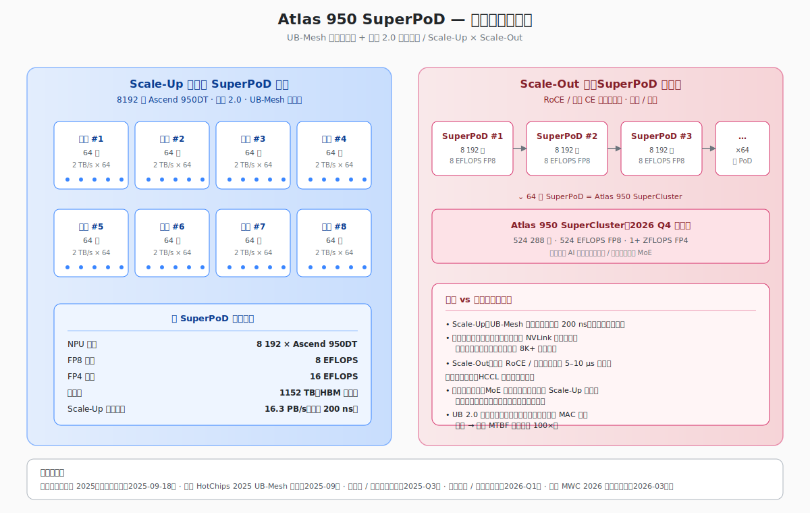

## 华为韬定律赢了: Atlas 950 SuperPoD 站上世界之巅
  
### 作者  
digoal  
  
### 日期  
2026-07-18  
  
### 标签  
华为 , 超节点 , 韬定律 , Altas , SuperPoD , 晟腾 , GPU , CANN , 英伟达 , Nvidia , CUDA , 国产化
  
----  
  
## 背景 
   

8192 张 AI 计算卡，拼成“一台计算机”。  

华为 Atlas 950 SuperPoD 应该是韬定律下的完美产物: 用连接、内存和软件，把单卡工艺差距改写成一道系统工程题。  

记住三点： **它的长板在系统，不在单卡；它能否成功，要看有效算力而非峰值算力；所谓“算力主权”，也不等于每颗螺丝都需要国产。**

## Atlas 950 SuperPoD

Atlas 950 SuperPoD 不是一台普通服务器，也不是一个塞进单柜的“巨型 GPU 盒子”。它以 **Ascend 950DT** 为计算卡：每个计算柜 64 卡，128 个计算柜组成 8192 卡的算力主体。 

这套满配系统的官方规格是： **FP4 峰值算力 16 EFLOPS、互联总带宽 16.3 PB/s、HBM 总容量 1152 TB，单个计算柜功耗约 100 kW。** 

这里还要分清两个词。 **Scale-Up** 是让许多卡在低时延、高带宽互联下尽量像一台大机器；**Scale-Out** 是把许多机器通过数据中心网络连成集群。Atlas 950 的主卖点，是把 Scale-Up 域扩到了 8192 卡，而不是简单宣称“我有 8192 台服务器”。

## 华为把赌注押在连接上

训练大模型时，芯片并不是各算各的。参数要切分，梯度要同步，MoE（混合专家模型）还要不断把 Token 发往不同“专家”。算得越快，网络就成了瓶颈。

可以把它想成一座城市：计算卡是工厂，HBM 是仓库，互联是公路。工厂翻倍而道路不扩容，货车就会把城市堵死。Atlas 950 的灵衢 2.0 与 UB-Mesh，做的正是扩路、减少换乘，并让更多设备使用统一的通信和寻址方式。华为给出的单跳时延是 200 ns，整机聚合互联带宽是 16.3 PB/s。对频繁 all-to-all 通信的 MoE 负载，这比单纯增加卡数更有价值。

不过，“16.3 PB/s”是聚合指标，不等于任意两张卡之间都能独占这么大带宽；“200 ns”是单跳指标，也不等于一次跨越多级拓扑的模型同步只花 200 ns。任务一旦跨出 SuperPoD，回到 Scale-Out 网络，时延会重新进入微秒级。稠密模型、数据并行为主的作业，也未必像 MoE 专家并行那样充分受益。

所以更接近真实能力的公式是：

> **有效训练能力 = 峰值算力 × 并行效率 × 可用时间**

8192 卡意味着更多总算力，也意味着更多光模块、连接器、内存堆栈和故障点。互联架构只有在 HCCL 集合通信库能避免热点、故障能快速隔离、任务能自动续训时，才算把芯片数量变成了生产力。

这条“以系统补单点”的路径，在 **大规模 MoE 训练、长上下文推理和高通信负载** 中最有价值；

## 与英伟达比系统而不是比单卡
教员说, 你打你的我打我的, 不要陷入敌人设定好的战场, 那里敌人更有优势, 要在重新定义战场歼灭敌人. 这也是华为韬定律的本质. 

之前专门分析过: [《“你打你的, 我打我的” - 华为韬定律, 本质是一场技术突围战》](../202605/20260526_06.md)  

所以, 对韬定律不了解的话, 你就会陷入与英伟达比单卡的尴尬境地. 单卡差距确实存在: 950DT 的官方 FP4 峰值约为 2 PFLOPS；市场对 Blackwell Ultra 单 GPU FP4 的常见研报估计约为 10–15 PFLOPS。于是“相差 7—8 倍”的说法，实际上采用了 15 PFLOPS 这一估计上沿，而且不是同一第三方基准。稳妥的表述是： **在低精度峰值算力上，950DT 与同期英伟达高端 GPU 仍有数倍差距；精确倍率尚待统一口径实测。**

但是: **单卡暂时落后与系统能不能完成有价值的工作，并不是同一个问题。**  

DeepSeek V4-Pro 给出了最好的证据: 2026 年 6 月，深圳河套相关团队披露，约 1000 颗 华为早期产品晟腾 Ascend 910C 在 MindSpore 与 CANN 环境中完成了 1.6T MoE 模型的全参数**后训练**，连续 1500 余步零中断，自报 MFU (大模型训练效率指标之一) 超过 30%。

但凡事也要辩证地看。一次 1500 步的后训练可以证明工程链路“跑通过”，不能证明万亿参数预训练能连续数月稳定运行。  

未来可以持续观察: 下一步应看同一负载能否重复、是否有独立复现、每步耗时与能耗如何，以及 950DT 上能否把这套经验扩展到 8192 卡。  

## 从 CUDA 迁移到华为 CANN 的成本  

CUDA 的护城河并不只是一套编程接口。它还包括编译器、数学库、NCCL 通信库、调试工具、性能分析器，以及十多年积累的工程经验。CANN 要替代的不是一个软件包，而是一整套默认工作方式。

业内常见说法是 CUDA 与 CANN 的算子总量相差约 24 倍。这个数字能说明覆盖广度，却很容易吓到小白：难道迁移成本也一定是 24 倍？并不是。就像 Oracle 迁移到其他国产数据库, 并不是每个用户都会大量使用 Oracle 的存储过程、函数等特定功能, 如果只是简单的使用, 迁移成本可能并不高. 大模型真正高频使用的是一组**相对集中的核心算子**。头部用户可以为模型定向补齐两三百个算子，长尾行业模型却可能卡在一个没人优化的冷门算子上。“算子总量差距很大”与“某个主流模型已经可用”，这两件事可以同时成立。

因此 CANN 的现实位置要分两层看。
- 对 DeepSeek、Qwen、GLM 等重点适配模型，迁移门槛可能已降到可接受范围；
- 对生物计算、科学计算、旧版私有框架和大量 CUDA 自定义内核，生态差距仍会直接转化为工期和成本。

推理通常先迁移，因为算子集合更收敛、任务更容易拆分；训练需要处理精度一致性、并行策略、通信稳定性与数月连续运行，门槛更高，但前述 DeepSeek V4-Pro 910C 案例说明训练迁移已经开始，不是“等推理全部完成以后再说”。

验证生态是否成熟，别只看开发者和算子数量。而要看：一个新模型迁移需要多少天、要重写多少自定义算子、端到端吞吐损失多少、同样工作负载的三年 TCO 对比。若头部模型之外的团队仍需数月定制，CANN 就还没有成为通用替代；若新模型能在一两周内低改动迁移，并稳定达到可比 MFU，生态差距就在真正收窄。

## 国产化不是一个百分数

“Atlas 950 国产化率到底多少”看似简单，实际上先要问口径。按采购金额、零件数量、知识产权归属，还是生产设备来源？芯片由国内企业设计、国内晶圆厂制造，也不代表制造设备、EDA sign-off 工具、接口 IP 与封装材料全部国产。

此前流传的 **38%—45% BOM 国产化率**，本质是产业链估算。

更可靠的办法是分层判断。NPU/CPU 设计、互联协议、整机集成、液冷和软件栈，国内控制力相对较强, 已经形成较强协同；HBM 量产、先进封装、大尺寸中介层、先进制程设备、完整 EDA 流程和部分高速接口 IP，仍是更脆弱的环节, 仍在补洞。

HBM 尤其关键。1152 TB 不是展示柜里的一块样品，而是成千上万张卡都要拿到容量、带宽、良率一致的量产件。先进封装同理：能做出工程样片，和能以可接受良率连续交付 8192 张卡，中间隔着一条很长的产线。

什么能证明国产化程度提高？主要看交付周期, 量产规模(这个和市场有关, 买家多, 规模才可能大)。 

## 出口管制是一张分层的网

美国对华 AI 芯片管制大体沿着成品芯片、性能密度、制造设备、HBM、EDA 和最终用途逐层加码。最高端 GPU、EUV 和部分先进制造能力上的限制最紧；但现实并不是一堵没有缝的墙。

一边是高端环节继续收紧，另一边是有限度的许可政策调整。2026 年 1 月，BIS 将符合门槛、从美国直接出口至中国大陆或澳门的 H200、MI325X 等产品，由“推定拒绝”改为“逐案审查”；这不是一般许可或全面解禁，更不证明已有客户获批交货。美国厂商希望保住中国收入，安全派则担心中端芯片也会累积成大规模训练能力。荷兰、日本和韩国已经与美国形成较高程度的政策协调，但各国的法律依据、管制清单、许可裁量和受控例外并不相同。

“全链条闭环”说得太满。更贴近现实的是**分层限制**：最先进芯片和设备趋向封闭，中端产品存在许可窗口，HBM 与盟友执行留有条件通道，而地缘事件随时可能把窗口关上。这个判断成立的前提，是中美关系没有出现极端升级、盟友企业仍有商业谈判空间；一旦发生重大冲突，分层管制可能迅速切换成直接断供。

它也很好验证：看 BIS 实际发出多少许可证，而不是只看政策措辞；看 ASML、日本设备商、三星和 SK 海力士的对华收入与设备许可；看国产 HBM、封装和设备能否在窗口收窄前完成量产。如果许可数量接近零、盟友同步执行且国产替代未成熟，“分层”就会向事实上的全面封锁移动。

## 算力主权不是“100% 国产”

“算力主权”听起来很宏大，落地其实是四个朴素问题：关键任务有没有机器可用，供应中断后能不能继续扩容，软件与数据能不能自主控制，三年总成本能不能承受。

“东数西算”提供了基本盘：八大国家枢纽、十个数据中心集群，把低时延业务与可远程调度的训练、存储任务分开布局。大基金三期则从设备、材料、存储和 EDA 侧补供给。Atlas 950 若能稳定交付，就可能成为其中的大型训练节点；但政策、资金和机房只提供跑道，不能替飞机完成起飞。

Atlas 950 对算力主权的意义，也不在于宣布供应链已经完全自主，而在于提供一个可替换、可持续迭代的国内系统方案。

它的边界同样清楚：如果电力成本过高、CUDA 软件迁移太慢、关键零件仍受单一海外来源约束，政策采购可以带来首批订单，却未必带来长期竞争力。

## 接下来只看五件事

第一，看 **8192 卡满配系统是否真实交付**，以及有多少客户把主训练负载放上去。

第二，看 **MFU、有效通信带宽与故障恢复**。如果只公布 16 EFLOPS，不公布模型、精度、batch size、并行策略和连续运行时间，比较意义仍然有限。

第三，看 **HBM 与先进封装的量产良率**。稳定交付决定一年能造多少套。

第四，看 **CANN 的迁移时间而非算子总数**。新模型能否低改动上线、长尾模型是否有人维护，比“支持多少算子”的宣传数字更接近开发者体验。

第五，看 **总拥有成本**。采购价只是开头，电费、液冷、机房、迁移人力、故障损失和利用率都要进账。128 个约 100 kW 的计算柜，可不是插上排插就能开机。

**Atlas 950 SuperPoD 不是对英伟达单卡优势的抹除，而是把“追芯片”改造成了“拼系统”的非对称路径。** 也就是教员说的: 你打你的我打我的, 不要陷入敌人设定好的战场, 那里敌人更有优势, 要在重新定义战场歼灭敌人. 这可以说是华为韬定律的本质. 

它已经证明中国厂商站上了世界之巅, 有能力重新定义超节点的规模, 这本身就是非常鼓舞人心的事件。  

   

*注：核心规格采用华为 HC 2025、MWC 2026、WAIC 2026 公开口径；政策与产业背景可参见 [华为 UB-Mesh 白皮书](https://e.huawei.com/en/material/AIaccelerator/1f486dffaf2c4d9eaa4cb1e13156fb0b)、[BIS 2026 年先进计算产品许可政策](https://www.bis.gov/press-release/department-commerce-revises-license-review-policy-semiconductors-exported-china)、[CSIS 2025.3 报告](https://www.csis.org/analysis/deepseek-huawei-export-controls-and-future-us-china-ai-race) 与 [国家发改委“东数西算”实施意见](https://www.ndrc.gov.cn/xxgk/zcfb/tz/202312/t20231229_1363094.html)。*
   
  
#### [PostgreSQL 解决方案集合](../201706/20170601_02.md "40cff096e9ed7122c512b35d8561d9c8")
  
  
#### [德哥 / digoal's Github - 公益是一辈子的事.](https://github.com/digoal/blog/blob/master/README.md "22709685feb7cab07d30f30387f0a9ae")
  
  
#### [About 德哥](https://github.com/digoal/blog/blob/master/me/readme.md "a37735981e7704886ffd590565582dd0")
  
  

  
