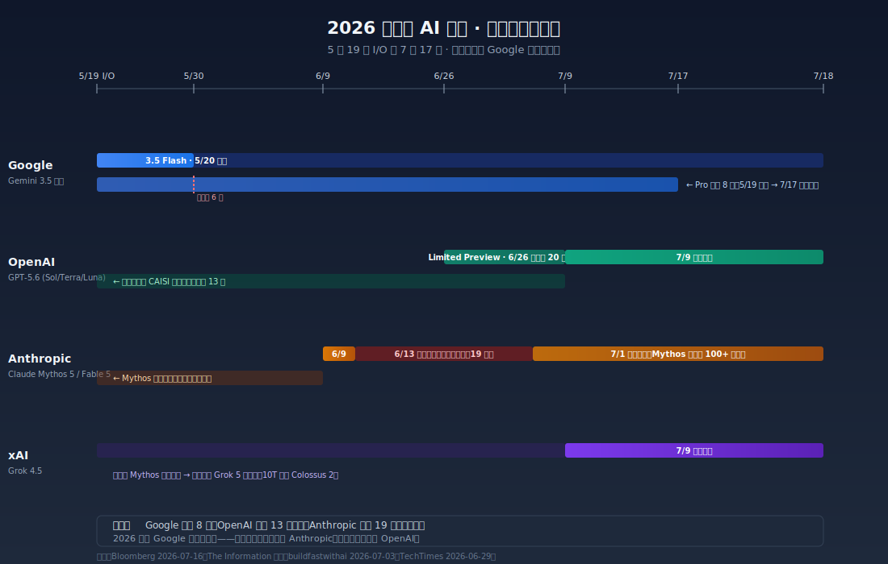
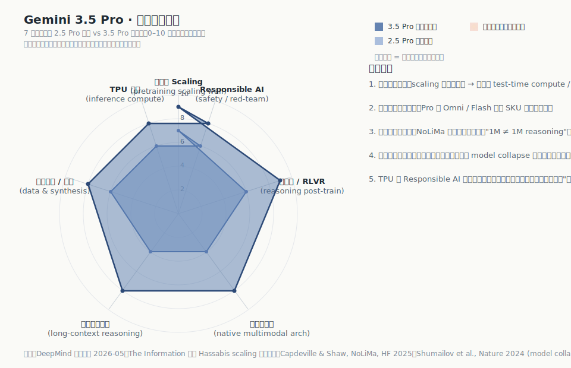
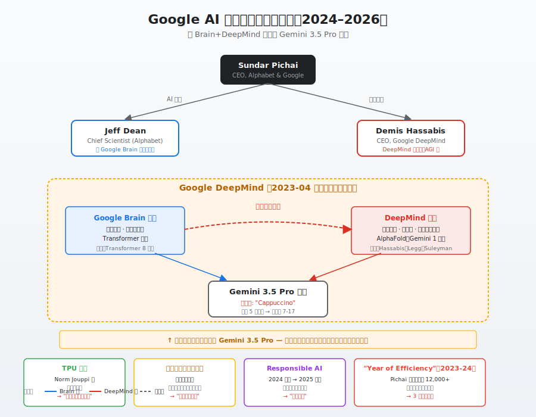

## 谷歌 Gemini 3.5 Pro “难产”事件分析
  
### 作者  
digoal  
  
### 日期  
2026-07-18  
  
### 标签  
Google , 谷歌 , Gemini , LLM , 大模型 , 参数 , 上下文 , 技术墙 , AI , 难产 , 编程能力 , 组织病 , 全行业问题 , 安全监管 , Anthropic , OpenAI , ChatGPT , Claude , TPU , Cloud , 协同壁垒 , 传统广告 , AI广告 , 资本开支 , 预期  
  
----  
  
## 背景 
  
2026 年 5 月 20 日的 Google I/O 上，皮查伊宣布 3.5 Flash 全面对外开放, Gemini 3.5 Pro "下个月发布"。两个月后 —— 也就是 7 月 17 日 —— Pro 才在 Vertex AI 的企业预览版里悄悄落地。

为什么承诺 6 月发，结果拖到 7 月中？延期这段时间 Google 在干什么，对手又在干什么？

Google 的"难产"既是它自己的病，也是 2026 年整个前沿 AI 实验室的通病。而在这个通病里，Google 反而成了**同期最不被动的那一家**。 

这不是替谷歌洗地, 且看下面的分析.  

---

## 谷歌这 8 周到底发生了什么

时间线不复杂，但有些细节容易被外行报道带偏：

- **5 月 19–20 日**：皮查伊在 Google I/O 上发布 3.5 Flash，同时预告 3.5 Pro "下个月发布"。皮查伊承认 Pro 还没准备好时台下有嘘声（来源：The Decoder 2026-05-19 现场报道）。
- **6 月 24 日**：Business Insider 等援引谷歌内部消息，称 3.5 Pro 已推到 7 月。
- **6 月下旬**：内部**切换了训练数据**想补编程能力，新一轮的测试仍低于预期。
- **7 月 16 日**：Bloomberg 援引 10 名现任 / 前 Google 员工确认延期；Alphabet 当日股价下跌约 4.7%。
- **7 月 17 日**：3.5 Pro 在 Vertex AI 进入企业限量预览，7.18日仍未公布向"全公众"开放的日期。

整个 8 周里，Google 发言人对外口径基本只有一句："正与合作伙伴测试 3.5 Pro、升级版 Flash 以及其他模型。"

这意味着 3.5 Pro 不是"没训出来"，而是"训出来了但没达到内部标准(卡在评测、安全、规模化推理、Agent 工程化这些收尾环节)、于是延期, 等下一轮训练"。
  
## 一、2026 年的延期是行业级现象，不是 Google 独家的病

别只盯着谷歌的问题, 那样容易产生偏见, 我们先做了个交叉对照，结果挺颠覆：  

- **OpenAI 同期旗舰**：GPT-5.6 在 2026-06-26 只对约 20 家受信机构以 Limited Preview 形式开放，原因是美国 CAISI（AI 标准与创新中心）做了预部署审查，7-09 才解禁。
- **Anthropic 同期旗舰**：Mythos 5 / Fable 5 在 6-09 发布后仅 4 天，就被美国商务部以"网络安全"为由强制下架 19 天，直到 7-01 才全面解禁 —— 这是美国历史上第一次对前沿模型动用"拔插头"级别的干预。Mythos 至今仍只对美国 100+ 机构开放。
- **xAI**：Grok 4.5 在 7-09 正常发布，但 Anthropic 的 Mythos 事件也打乱了它的路线图 —— 10T 参数量的 Grok 5 提前在 Colossus 2 上启动训练。

把这些事摆一起, 可以得出一个结论：当 Google 的 3.5 Pro 在 6 月底延期的时候，整个前沿实验室圈子正在经历一轮**监管驱动的延期**。OpenAI 被压，Anthropic 干脆被拔了插头。Google 反而是 7 月那个时点上**唯一没被美国监管正式盯上**的头部实验室(当然了原因是他们选择了不发新版)。

所以纠正一下"Google 3.5 Pro 难产"这件事，正确的理解应该是： **整个行业都在 2026 年慢下来，Google 是其中一家**。

不过 Google 自己也有病, 下面来展开。  

  

## 二、Google 的病：多因素叠加

### 2.1 技术摸到天花板了

Demis Hassabis 多次访谈里已经公开承认"预训练 scaling 撞墙" —— 也就是把模型参数量、训练数据量、训练算力（FLOPs）三件套同比例放大，不再稳定换来基准上的百分点提升。这意味着 3.5 Pro 想比 2.5 Pro 给出"显著领先"，不能再靠单纯堆规模，必须在**测试时算力**（长链 CoT、反复验证、多 agent 自审）上把预算大幅拉上去 —— 而这部分工程量是 3.5 Flash 那种"靠后训练换能力"路径不需要承担的。

配套的问题还有：长上下文。Gemini 1.5 Pro 把"100 万 token"摆上桌，2.5 / 3.5 还在延续甚至拉到 2M。但 Hugging Face 团队的 NoLiMa 基准（Capdeveille & Shaw 2025）已经证明：当任务需要对上下文做 paraphrase 或跨段聚合时，百万 token 模型和 8K 模型几乎无差。也就是说"百万 token ≠ 百万 token 推理"。3.5 Pro 把这个当作核心卖点，就必须同时解决"在公开独立基准上证明能力"和"把推理 latency 压下来"两件事。

雷达图上能直观看出"预训练 scaling"和"长上下文推理"两个维度的缺口最大 —— 这正是 scaling 撞墙 + 长上下文被独立基准戳破。

### 2.2 编程能力不及预期

彭博的报道把矛头直指**编程能力**。代码生成在 2025–2026 年是所有前沿模型最关键的"地缘战场" —— 它是企业付费转化最快的入口（Cursor、Claude Code、Codex、Copilot 都抢开发者心智），也是 Agent 能力的基石。Google 在 I/O 上把 Gemini Spark（24h 自主代理）和 Antigravity（Agentic IDE）作为差异化卖点，**编程就成了产品能否成立的"零号工程"** 。一旦内部把编程能力作为上市门槛，模型没达标就只能延期。

Bloomberg 指出：6 月下旬切换训练数据后，新一轮测试仍低于预期。这种"中途换数据集"的决策需要研究、产品、TPU 三方 sign-off，协调成本极高。

### 2.3 组织内耗：五方签字的工程

顺着 Google 这家公司本身的组织结构看下去，会发现难产最深的一层其实是组织问题。

2023 年 4 月 Google Brain 和 DeepMind 合并成 Google DeepMind，Hassabis 当 CEO、Jeff Dean 转首席科学家。三年过去，名义上是"一家人"，但内部文化融合始终没完成 —— DeepMind 一派偏英式学术、长周期、神经科学启发；Brain 一派偏美式工程、开放源码、内部工具文化。每次"要不要砍掉某一组能力去押注下一波 scaling"、"要不要先发再补"这种战略分歧，决策速度就被拉慢。

更麻烦的是 Google 同时拥有 DeepMind、Cloud、Android、Search、Workspace 五大块 AI 相关业务，每个新模型发布前都要过五个产品线的利益相关方审核。彭博报道里提到 Cloud、DeepMind、Android 三家都在做面向程序员的 AI 编码工具，部分消费者产品团队也参与 —— 这种重复造轮子不是 Google 一家的问题，但**模型发布需要五方签字**这件事是 Google 独有的。

### 2.4 人才流失

Noam Shazeer 是 Transformer 论文八位作者之一、LaMDA 核心作者。2021 年因内部对 LaMDA 上线策略分歧离职创办 Character.AI，2024 年 8 月 Google 砸约 **27 亿美元**以"授权 + 人才收回"的方式把他请回来。

但 Shazeer 在 **2026-06-18 已经再次离开 Google 加入 OpenAI**，距回流仅约 10 个月。同时，AlphaFold 之父、2024 诺贝尔化学奖得主 John Jumper 也加入了 Anthropic。

Google 砸 27 亿美元都没留住人。如果顶尖人才发现"在 Google 推动激进计划走不通，可以先出去做再被收购回来；甚至出去之后不必回来"，那么内部协调的议价能力会进一步下降。

不过**这是顶尖稀缺人才（L6+、Fellow 这一档）的议价机制**，不能等同于"Google 整体留不住人"。

### 2.5 财报压力 + TPU 外卖：左右手互搏的两个版本

先说财报。Alphabet 2026 全年 CapEx 指引是 **1750–1850 亿美元**，几乎是 2025 年 914 亿的两倍。市场已经因为 Gemini 3 Pro 把 Alphabet 股价推到全球第三、超越微软 —— 奖励过一次；现在投入翻倍，资本市场有理由期待模型能力同比例跳升。 **但实际发生的事情是：模型能力没有同比例跳升，CapEx 已经定下去了**。

再说 TPU。Google 是全球唯一用自研 TPU 而非 NVIDIA GPU 跑前沿模型的厂商 —— 这是它的护城河。但**同样的 TPU，被大笔外卖给了 Anthropic**：2025-10 签下约 100 万颗、1GW+ 容量协议；2026-04-06 又和 Anthropic + Broadcom 签下数 GW 级新一代 TPU 协议。美银证券测算仅这 3.5GW 增量就给 Google Cloud 带来超 1000 亿订单积压。

**Anthropic 既是 Google Cloud 最大的 TPU 客户，也是 Gemini 在企业市场上最大的对手**。Google 每卖 1GW TPU 给 Anthropic，自己 2027 年就要少 1GW 可用于 Gemini 迭代的资源。这是 Google 全栈垂直整合战略的代价。

短期对外卖 TPU 是合理的 —— 它让 TPU 生态从"内部自用"扩展到"全行业可用"，长期有利于议价权。Anthropic ARR 4 个月内从 90 亿推到 300 亿，Google Cloud 也跟着吃肉。真正的危险点在 2028 年之后 —— 那时候 Anthropic 用 3.5GW TPU 把下一代模型推到明显领先，Cloud 租金可能根本补不回 Gemini 流失的份额。

 

## 三、反直觉: Google 这次其实没吃亏

写到这里我得提醒一下自己：上面说的都是问题，但光看问题会得到一个过度悲观的画面。 **凡事要辩证地看** —— 2026 年 7 月这个时点上，Google 在三个维度上反而是头部实验室里相对位置最好的。

### 3.1 监管对 Google 反而最小

前面已经说过 OpenAI 和 Anthropic 都被拉进了 CAISI 审查，但 Gemini 3.5 Pro **没有触发联邦审查门槛**。这不是因为 Google 听话，而是因为 3.5 Pro 在网络安全能力上没有"越线" —— 这可能恰恰是一种**主动选择**（不把安全能力做得太激进），反而给它创造了一个发布窗口。

### 3.2 AI Mode 广告已经在变现, 搜索广告没死

行业里关于 Google 最流行的一种说法是："Gemini 蚕食自家搜索广告，左手打右手。"这个叙事直觉是对的, 但事实是相反的。

2026 Q1 财报给的事实是 Google 已经在把 AI 内嵌广告这条路跑通： 
- 搜索及其他广告收入 604 亿美元，同比 +19%，**绝对值创历史新高**。
- AI 驱动的广告活动已经占搜索广告支出 **30%+** 。
- Google 已经在 AI 答案里内嵌"对话式发现广告 / 高亮答案广告 / AI 购物广告 / 商家智能体"四种新格式。

具体的原因: AI 答案里能塞广告位、传统搜索页也是广告位 —— **广告位密度降了，但每个广告位的价值升了**，因为 AI 答案的"意图捕获"更接近交易环节。短期 ARPU 不会被击穿，长期商业模式有压力但已经在被对冲。

### 3.3 模型单方面强无法构成护城河 

Google 真正的护城河就不在模型本身，而在 TPU + Cloud + Workspace + Search 的全栈垂直整合。

从来没有任何 AI 公司的护城河是"单一模型"。OpenAI 是靠产品矩阵 + 算力锁定，Anthropic 是靠 ARR 增速 + Claude Code 工具链。Google 在 2025-11 Gemini 3 Pro 发布时，资本市场给过强烈反馈（Alphabet 市值七年来首次超越微软回到全球第三），说明"模型能力 + Cloud 协同"的组合是被市场认可的护城河。

Pichai 在 Google I/O 2026 反复强调的"搜索分发 + 云 + 芯片"三位一体，就是这个意思。

## 四、谷歌这 8 周真实发生的事情

把上面的分析收一收，8 周延期的真实剧本大致是这样的：  

1. **技术侧**：3.5 Pro 在 5 月已基本训出来，但编程能力没达到内部门槛；切换训练数据想补这个短板，新一轮测试仍不及预期。每一次"重训"都要和 TPU 团队、研究团队、产品团队三方协调。
2. **组织侧**：五方签字的审批链让每一次延期决策都被放大；DeepMind 与 Brain 文化融合未完成，外部议价（Shazeer / Jumper 离职）削弱了内部妥协意愿( 心痛谷歌一秒: **一言不合就离职, 高端人才太任性了, 真难管理!** )。  
3. **资源侧**：CapEx 翻倍给 Google 巨大压力，但 TPU 算力被外卖给 gemini 友商 Anthropic 占用，自家 gemini 可分配增量被压缩；造成“训练 vs 推理 vs 外部买家”三向抢 TPU 产能。
4. **市场侧**：同期 OpenAI / Anthropic 也都在延期甚至被监管下架，Google 反而不是最显眼的那家；同时 "AI Mode 广告业务" 已经在变现，搜索广告同比 +19% 缓解了"左手打右手"的财务焦虑。  
5. **外部侧**：Mythos 5 触发的 CAISI 审查让所有头部实验室节奏变慢，3.5 Pro 没被纳入审查反而成了一个"静默窗口"。

叠加起来看， **"再推迟几周"在 Google 内部是合理的、也是最优的策略**；外部感知则是"难产"。但也要注意：这里的"最优"是指在给定组织结构和外部约束下的局部最优 —— 不代表 Google 没有更深层的问题需要结构性手术（比如把 Gemini 团队从 DeepMind 内部独立 BU 化、直接向 Pichai 汇报）。

 

## 五、未来 6 个月重点关注什么

一句话总结： **2026 年的延期不是 Google 一家掉队，而是整个行业从"模型公司"向"基础设施 + 监管 + 应用"多维竞争的转折；Google 恰好处在摩擦最大的位置，但也享受到了没被监管盯上的窗口**。

要验证这个结论，未来 6 个月看几个具体信号：

- **3.5 Pro 发布后 30 天内 SWE-Bench / Terminal-Bench 排名**：是否进 Top 2？如果是，"编程能力不行"的故事被证伪；如果不是，"编程能力不行"被进一步验证。
- **Alphabet 2026 Q3 / Q4 财报**：搜索广告同比增速、AI 内嵌广告收入占比、Cloud 业务 CapEx 杠杆倍数。如果搜索广告增速从 +19% 跌到个位数，"左右手互搏"开始显性化。(也要看 AI 内嵌广告收入占比, 看对冲效果怎么样.)
- **Anthropic ARR 节奏**：4 个月 ×3 的曲线是否能延续到年底破 500 亿 —— 这是 TPU 外卖模式可持续性的最直接证据。
- **美国国会《AI 安全法案》立法日程**：如果 2027 年立法完成，CAISI 从"行政命令"升级为"法律"，所有头部模型的发布节奏都会被降低。

     
  
#### [PostgreSQL 解决方案集合](../201706/20170601_02.md "40cff096e9ed7122c512b35d8561d9c8")
  
  
#### [德哥 / digoal's Github - 公益是一辈子的事.](https://github.com/digoal/blog/blob/master/README.md "22709685feb7cab07d30f30387f0a9ae")
  
  
#### [About 德哥](https://github.com/digoal/blog/blob/master/me/readme.md "a37735981e7704886ffd590565582dd0")
  
  

  
